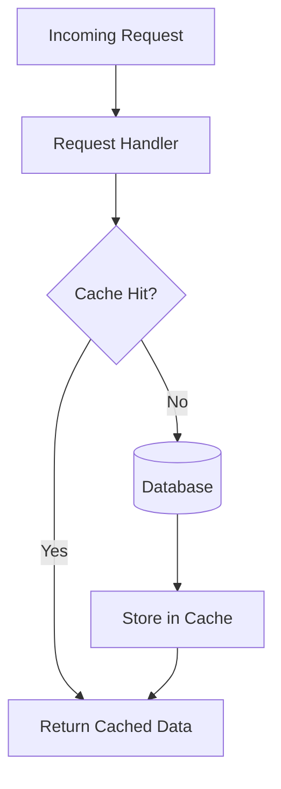
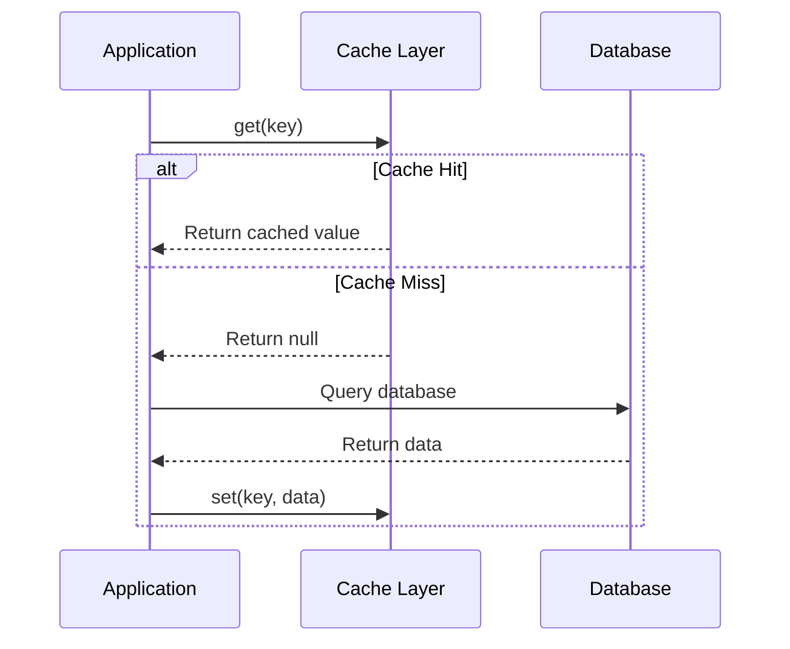
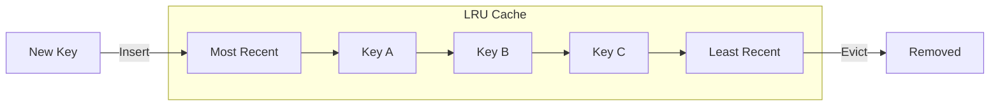
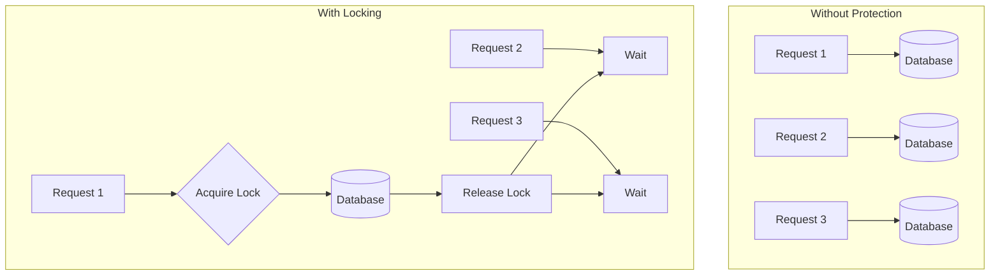

# How to Implement Application Cache Design

Author: [nawazdhandala](https://github.com/nawazdhandala)

Tags: Caching, Application, Memory, Performance

Description: Learn to implement application-level cache design for reducing database load and improving response times.

---

Application-level caching sits between your code and the database, storing frequently accessed data in memory for fast retrieval. Unlike distributed caches that span multiple servers, application caches live within your process memory, offering nanosecond access times with zero network overhead.

This guide covers the patterns, implementation strategies, and practical code for building effective application caches that reduce database load and improve response times.

## Why Application-Level Caching?

Every database query involves network round trips, query parsing, and disk I/O. For data that changes infrequently but gets read constantly, these costs add up. Application caches eliminate this overhead by keeping hot data in memory.

Here is a comparison of access times across different storage layers.

| Storage Layer | Typical Latency | Use Case |
|---------------|-----------------|----------|
| L1 CPU Cache | ~1 nanosecond | CPU operations |
| Application Memory | ~100 nanoseconds | Hot application data |
| Redis/Memcached | ~1 millisecond | Shared cache across instances |
| Database | ~10 milliseconds | Persistent storage |
| Disk I/O | ~10-100 milliseconds | Cold data retrieval |

Application caches work best for data that is read frequently, updated rarely, and tolerates brief staleness.

## Cache Architecture

A well-designed application cache sits in the request path, intercepting reads before they reach the database.



The cache acts as a read-through layer. On a hit, the response comes directly from memory. On a miss, the system fetches from the database and populates the cache for future requests.

## Basic Cache Implementation

Start with a simple in-memory cache using a dictionary with TTL-based expiration. This TypeScript implementation handles the core operations.

```typescript
interface CacheEntry<T> {
  value: T;
  expiresAt: number;
}

class ApplicationCache<T> {
  private cache: Map<string, CacheEntry<T>> = new Map();
  private defaultTTL: number;

  constructor(defaultTTLSeconds: number = 300) {
    // Default TTL of 5 minutes balances freshness with hit rate
    this.defaultTTL = defaultTTLSeconds * 1000;
  }

  set(key: string, value: T, ttlSeconds?: number): void {
    const ttl = (ttlSeconds ?? this.defaultTTL / 1000) * 1000;
    const entry: CacheEntry<T> = {
      value,
      expiresAt: Date.now() + ttl,
    };
    this.cache.set(key, entry);
  }

  get(key: string): T | undefined {
    const entry = this.cache.get(key);

    if (!entry) {
      return undefined;
    }

    // Check if entry has expired
    if (Date.now() > entry.expiresAt) {
      this.cache.delete(key);
      return undefined;
    }

    return entry.value;
  }

  delete(key: string): boolean {
    return this.cache.delete(key);
  }

  clear(): void {
    this.cache.clear();
  }
}
```

## Cache-Aside Pattern

The cache-aside pattern gives your application full control over cache population. The application checks the cache first, then falls back to the database on a miss.



Here is a practical implementation wrapping database queries with cache logic.

```typescript
import { Pool } from "pg";

interface User {
  id: string;
  email: string;
  name: string;
}

class UserRepository {
  private cache: ApplicationCache<User>;
  private db: Pool;

  constructor(db: Pool) {
    this.db = db;
    // Cache users for 10 minutes since profile data changes rarely
    this.cache = new ApplicationCache<User>(600);
  }

  async getById(userId: string): Promise<User | null> {
    const cacheKey = `user:${userId}`;

    // Check cache first
    const cached = this.cache.get(cacheKey);
    if (cached) {
      return cached;
    }

    // Cache miss: query database
    const result = await this.db.query(
      "SELECT id, email, name FROM users WHERE id = $1",
      [userId]
    );

    if (result.rows.length === 0) {
      return null;
    }

    const user = result.rows[0] as User;

    // Populate cache for future requests
    this.cache.set(cacheKey, user);

    return user;
  }

  async update(userId: string, updates: Partial<User>): Promise<void> {
    // Update database
    await this.db.query(
      "UPDATE users SET email = COALESCE($2, email), name = COALESCE($3, name) WHERE id = $1",
      [userId, updates.email, updates.name]
    );

    // Invalidate cache to prevent stale reads
    this.cache.delete(`user:${userId}`);
  }
}
```

## LRU Eviction Strategy

Memory is finite. When your cache grows too large, you need an eviction policy. Least Recently Used (LRU) removes entries that have not been accessed recently, keeping hot data in memory.



This LRU cache implementation uses a Map to maintain insertion order while tracking access patterns.

```typescript
class LRUCache<T> {
  private cache: Map<string, CacheEntry<T>> = new Map();
  private maxSize: number;

  constructor(maxSize: number = 1000) {
    // Limit cache size to prevent memory exhaustion
    this.maxSize = maxSize;
  }

  set(key: string, value: T, ttlSeconds: number = 300): void {
    // Delete existing key to update its position
    if (this.cache.has(key)) {
      this.cache.delete(key);
    }

    // Evict oldest entries if at capacity
    while (this.cache.size >= this.maxSize) {
      const oldestKey = this.cache.keys().next().value;
      if (oldestKey) {
        this.cache.delete(oldestKey);
      }
    }

    this.cache.set(key, {
      value,
      expiresAt: Date.now() + ttlSeconds * 1000,
    });
  }

  get(key: string): T | undefined {
    const entry = this.cache.get(key);

    if (!entry) {
      return undefined;
    }

    if (Date.now() > entry.expiresAt) {
      this.cache.delete(key);
      return undefined;
    }

    // Move to end of Map to mark as recently used
    this.cache.delete(key);
    this.cache.set(key, entry);

    return entry.value;
  }
}
```

## Write-Through vs Write-Behind

Two patterns handle cache updates during writes. Write-through updates the cache and database synchronously. Write-behind queues database writes for async processing.

| Pattern | Consistency | Write Latency | Complexity |
|---------|-------------|---------------|------------|
| Write-Through | Strong | Higher | Low |
| Write-Behind | Eventual | Lower | High |
| Cache-Aside | Eventual | Lowest | Medium |

Write-through is safer for most applications since it maintains consistency between cache and database.

```typescript
class WriteThroughCache<T> {
  private cache: LRUCache<T>;
  private persistFn: (key: string, value: T) => Promise<void>;

  constructor(
    maxSize: number,
    persistFn: (key: string, value: T) => Promise<void>
  ) {
    this.cache = new LRUCache<T>(maxSize);
    this.persistFn = persistFn;
  }

  async set(key: string, value: T, ttlSeconds?: number): Promise<void> {
    // Write to database first to ensure durability
    await this.persistFn(key, value);

    // Then update cache
    this.cache.set(key, value, ttlSeconds);
  }
}
```

## Cache Stampede Prevention

When a popular cache key expires, multiple concurrent requests may all try to regenerate it simultaneously. This cache stampede can overwhelm your database.



Use a simple locking mechanism to ensure only one request regenerates a cache entry.

```typescript
class StampedeProtectedCache<T> {
  private cache: LRUCache<T>;
  private locks: Map<string, Promise<T>> = new Map();

  constructor(maxSize: number = 1000) {
    this.cache = new LRUCache<T>(maxSize);
  }

  async getOrSet(
    key: string,
    fetchFn: () => Promise<T>,
    ttlSeconds: number = 300
  ): Promise<T> {
    // Check cache first
    const cached = this.cache.get(key);
    if (cached !== undefined) {
      return cached;
    }

    // Check if another request is already fetching this key
    const existingLock = this.locks.get(key);
    if (existingLock) {
      return existingLock;
    }

    // Create a lock for this key
    const fetchPromise = (async () => {
      try {
        const value = await fetchFn();
        this.cache.set(key, value, ttlSeconds);
        return value;
      } finally {
        // Release lock after fetch completes
        this.locks.delete(key);
      }
    })();

    this.locks.set(key, fetchPromise);
    return fetchPromise;
  }
}
```

## Monitoring Cache Performance

Track these metrics to understand cache effectiveness and tune your configuration.

| Metric | Formula | Target |
|--------|---------|--------|
| Hit Rate | Hits / (Hits + Misses) | > 90% |
| Eviction Rate | Evictions / Total Requests | < 5% |
| Memory Usage | Current Size / Max Size | < 80% |
| Average Latency | Total Latency / Requests | < 1ms |

Add instrumentation to your cache to collect these metrics.

```typescript
class InstrumentedCache<T> {
  private cache: LRUCache<T>;
  private hits: number = 0;
  private misses: number = 0;

  constructor(maxSize: number = 1000) {
    this.cache = new LRUCache<T>(maxSize);
  }

  get(key: string): T | undefined {
    const value = this.cache.get(key);

    if (value !== undefined) {
      this.hits++;
    } else {
      this.misses++;
    }

    return value;
  }

  getStats(): { hitRate: number; hits: number; misses: number } {
    const total = this.hits + this.misses;
    return {
      hitRate: total > 0 ? this.hits / total : 0,
      hits: this.hits,
      misses: this.misses,
    };
  }
}
```

## Conclusion

Application-level caching provides significant performance improvements when implemented correctly. Start with the cache-aside pattern for simplicity, add LRU eviction to manage memory, and implement stampede protection for high-traffic keys.

Monitor your cache hit rate and adjust TTLs based on your data's update frequency. A well-tuned application cache can reduce database load by 90% or more while cutting response times from milliseconds to microseconds.

The patterns in this guide apply to any language or framework. Adapt the code examples to your stack and start with conservative cache sizes, then expand based on observed memory usage and hit rates.
