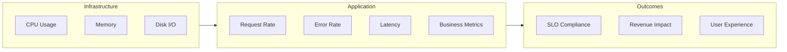
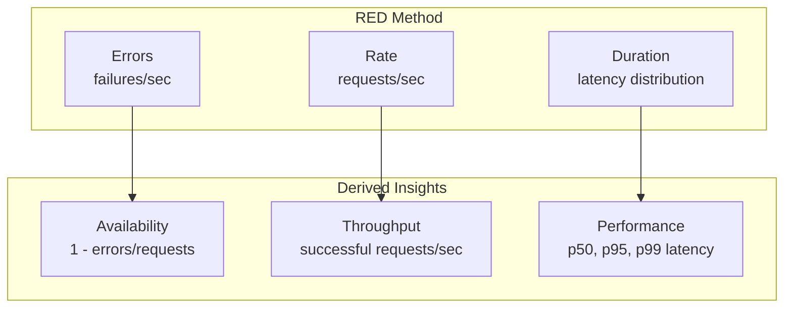
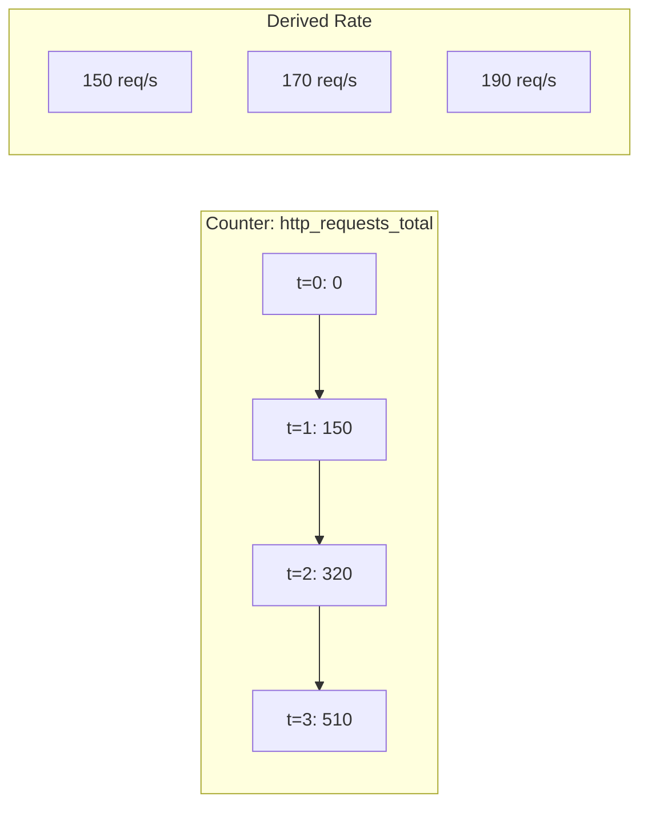
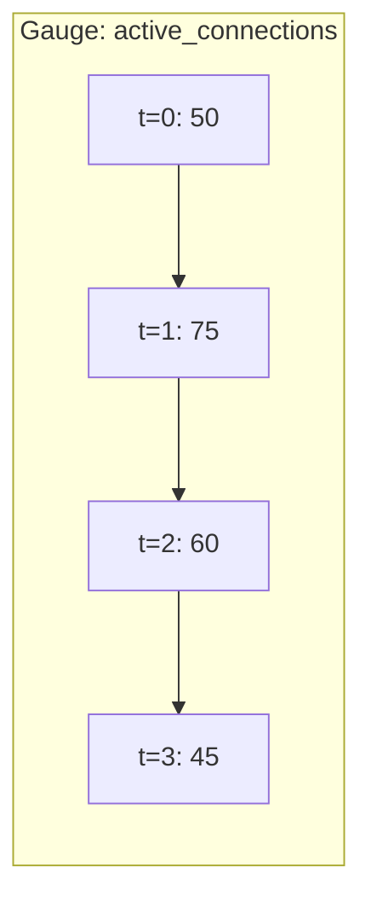
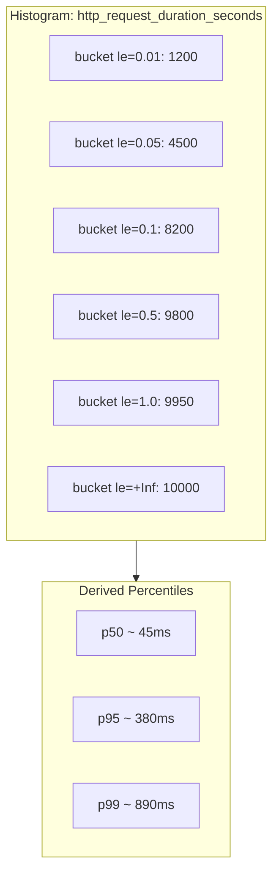
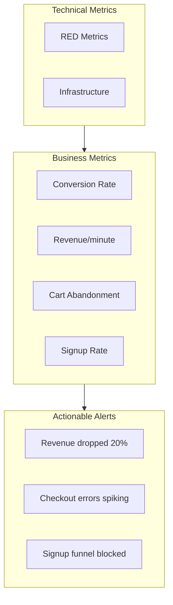
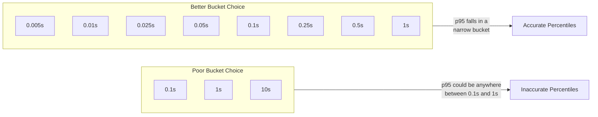
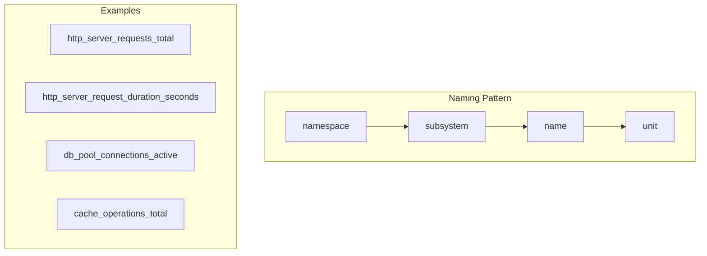
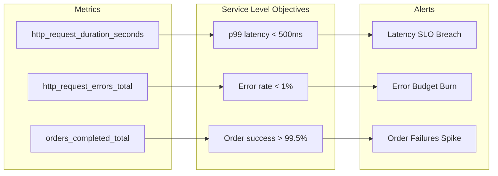
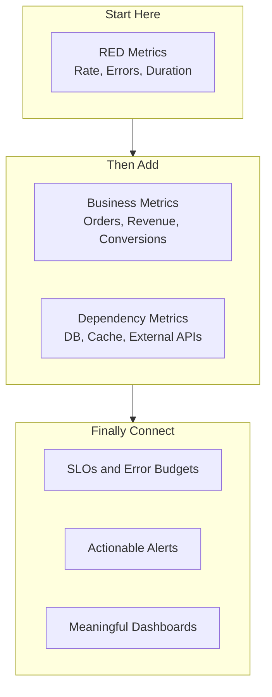

# How to Create Application Metrics

Author: [nawazdhandala](https://github.com/nawazdhandala)

Tags: Observability, Metrics, Application Performance, SRE

Description: Learn how to instrument applications with custom metrics for performance and business visibility.

---

You cannot improve what you cannot measure. That principle sits at the heart of every well-run production system. Yet many teams stop at infrastructure metrics (CPU, memory, disk) and never instrument the application layer where the real business logic lives.

This guide walks you through creating application metrics that matter: from the foundational RED method to custom counters, gauges, and histograms across multiple programming languages.

## Why Application Metrics Matter

Infrastructure metrics tell you the machine is healthy. Application metrics tell you the *business* is healthy. Consider this:

- CPU at 40%? Great. But are users actually completing checkouts?
- Memory stable? Wonderful. But how many orders failed validation?
- Disk I/O nominal? Perfect. But what is your p99 API latency?

Application metrics bridge the gap between "the server is running" and "the service is delivering value."



## The RED Method: Your Starting Point

The RED method provides a framework for service-level metrics. It focuses on three signals that matter most for request-driven services:

- **R**ate: How many requests per second is my service handling?
- **E**rrors: How many of those requests are failing?
- **D**uration: How long do requests take?



RED works because it captures what users experience. A spike in error rate means users see failures. A spike in duration means users wait. A drop in rate might mean users cannot reach you at all.

### When to Use RED vs USE

RED applies to *services* (APIs, workers, queues). For *resources* (CPU, memory, connections), use the USE method (Utilization, Saturation, Errors). Combine both for complete coverage.

## Metric Types: Counters, Gauges, and Histograms

Before writing code, understand the three fundamental metric types:

### Counters

Counters only go up. They track cumulative values like total requests, total errors, or total bytes processed. You derive rates by computing the difference over time.



**Use counters for:**
- Total requests handled
- Total errors by type
- Total bytes transferred
- Total items processed

### Gauges

Gauges can go up or down. They represent current state: active connections, queue depth, temperature, or memory usage.



**Use gauges for:**
- Current queue size
- Active connections/sessions
- Cache hit ratio (computed)
- Thread pool utilization

### Histograms

Histograms track the distribution of values by counting observations in predefined buckets. They enable percentile calculations (p50, p95, p99) without storing every individual value.



**Use histograms for:**
- Request latency
- Response sizes
- Queue wait times
- Batch processing durations

## Instrumentation in Practice

Let us implement RED metrics across popular languages. Each example includes OpenTelemetry, which provides vendor-neutral instrumentation.

### Python with OpenTelemetry

```python
# metrics_setup.py
# Configure OpenTelemetry metrics for a Python application
# This setup works with any OTLP-compatible backend (OneUptime, Prometheus, etc.)

from opentelemetry import metrics
from opentelemetry.sdk.metrics import MeterProvider
from opentelemetry.sdk.metrics.export import PeriodicExportingMetricReader
from opentelemetry.exporter.otlp.proto.grpc.metric_exporter import OTLPMetricExporter
from opentelemetry.sdk.resources import Resource, SERVICE_NAME

# Define service metadata that will be attached to all metrics
resource = Resource(attributes={
    SERVICE_NAME: "payment-service",
    "deployment.environment": "production",
    "service.version": "1.2.3"
})

# Configure the OTLP exporter to send metrics to your backend
# The endpoint should point to your OpenTelemetry Collector or OneUptime
exporter = OTLPMetricExporter(
    endpoint="http://localhost:4317",  # Replace with your collector endpoint
    insecure=True  # Set to False in production with TLS
)

# Create a metric reader that exports every 60 seconds
# Shorter intervals increase resolution but also increase overhead
reader = PeriodicExportingMetricReader(
    exporter,
    export_interval_millis=60000  # 60 seconds
)

# Initialize the meter provider with our configuration
provider = MeterProvider(resource=resource, metric_readers=[reader])
metrics.set_meter_provider(provider)

# Create a meter for our service
# The meter name typically matches your service or module name
meter = metrics.get_meter("payment-service")
```

```python
# red_metrics.py
# Implement RED method metrics for request tracking
# These metrics capture rate, errors, and duration for every request

import time
from functools import wraps
from opentelemetry import metrics

meter = metrics.get_meter("payment-service")

# Counter for total requests - the "R" in RED
# Labels allow slicing by endpoint and method
request_counter = meter.create_counter(
    name="http_requests_total",
    description="Total number of HTTP requests received",
    unit="1"  # Dimensionless count
)

# Counter for errors - the "E" in RED
# Separate counter allows calculating error rate: errors / requests
error_counter = meter.create_counter(
    name="http_request_errors_total",
    description="Total number of failed HTTP requests",
    unit="1"
)

# Histogram for duration - the "D" in RED
# Bucket boundaries chosen to capture typical web latencies
# Boundaries: 5ms, 10ms, 25ms, 50ms, 100ms, 250ms, 500ms, 1s, 2.5s, 5s, 10s
request_duration = meter.create_histogram(
    name="http_request_duration_seconds",
    description="HTTP request latency in seconds",
    unit="s"
)


def track_request(endpoint: str, method: str):
    """
    Decorator to automatically track RED metrics for any request handler.

    Usage:
        @track_request("/api/payments", "POST")
        def create_payment(request):
            # handler logic
            pass
    """
    def decorator(func):
        @wraps(func)
        def wrapper(*args, **kwargs):
            # Record request start time
            start_time = time.perf_counter()

            # Common labels for all metrics from this request
            labels = {
                "endpoint": endpoint,
                "method": method
            }

            try:
                # Execute the actual handler
                result = func(*args, **kwargs)

                # Record successful request
                request_counter.add(1, labels)

                return result

            except Exception as e:
                # Record the error with additional context
                error_labels = {
                    **labels,
                    "error_type": type(e).__name__
                }
                request_counter.add(1, labels)
                error_counter.add(1, error_labels)

                # Re-raise to let the framework handle it
                raise

            finally:
                # Always record duration, even for failures
                duration = time.perf_counter() - start_time
                request_duration.record(duration, labels)

        return wrapper
    return decorator


# Example usage with FastAPI
from fastapi import FastAPI, HTTPException

app = FastAPI()

@app.post("/api/payments")
@track_request("/api/payments", "POST")
async def create_payment(payment_data: dict):
    """
    Create a new payment. RED metrics are automatically captured
    by the @track_request decorator.
    """
    # Your business logic here
    if not payment_data.get("amount"):
        raise HTTPException(status_code=400, detail="Amount required")

    return {"status": "created", "id": "pay_123"}
```

### Node.js with OpenTelemetry

```javascript
// metrics-setup.js
// Configure OpenTelemetry metrics for a Node.js application
// This provides vendor-neutral metrics that work with any OTLP backend

const { MeterProvider, PeriodicExportingMetricReader } = require('@opentelemetry/sdk-metrics');
const { OTLPMetricExporter } = require('@opentelemetry/exporter-metrics-otlp-grpc');
const { Resource } = require('@opentelemetry/resources');
const { SemanticResourceAttributes } = require('@opentelemetry/semantic-conventions');

// Define service metadata attached to all metrics
const resource = new Resource({
    [SemanticResourceAttributes.SERVICE_NAME]: 'order-service',
    [SemanticResourceAttributes.DEPLOYMENT_ENVIRONMENT]: 'production',
    [SemanticResourceAttributes.SERVICE_VERSION]: '2.1.0'
});

// Configure OTLP exporter pointing to your collector
const exporter = new OTLPMetricExporter({
    url: 'http://localhost:4317'  // Your OpenTelemetry Collector endpoint
});

// Create metric reader with 60-second export interval
const reader = new PeriodicExportingMetricReader({
    exporter,
    exportIntervalMillis: 60000
});

// Initialize meter provider
const meterProvider = new MeterProvider({
    resource,
    readers: [reader]
});

// Export the meter for use throughout the application
const meter = meterProvider.getMeter('order-service');

module.exports = { meter, meterProvider };
```

```javascript
// red-metrics.js
// RED method implementation for Express.js middleware
// Automatically captures rate, errors, and duration for all requests

const { meter } = require('./metrics-setup');

// Counter for total requests (Rate)
const requestCounter = meter.createCounter('http_requests_total', {
    description: 'Total number of HTTP requests received',
    unit: '1'
});

// Counter for errors (Errors)
const errorCounter = meter.createCounter('http_request_errors_total', {
    description: 'Total number of failed HTTP requests',
    unit: '1'
});

// Histogram for latency (Duration)
// Bucket boundaries in seconds, optimized for web traffic
const requestDuration = meter.createHistogram('http_request_duration_seconds', {
    description: 'HTTP request latency in seconds',
    unit: 's',
    // Explicit boundaries help with percentile accuracy
    boundaries: [0.005, 0.01, 0.025, 0.05, 0.1, 0.25, 0.5, 1, 2.5, 5, 10]
});

/**
 * Express middleware that automatically tracks RED metrics.
 * Add this early in your middleware chain to capture all requests.
 *
 * Usage:
 *   const app = express();
 *   app.use(redMetricsMiddleware);
 */
function redMetricsMiddleware(req, res, next) {
    // Capture start time with high precision
    const startTime = process.hrtime.bigint();

    // Extract route pattern for consistent labeling
    // Falls back to path if no route is matched
    const getRoutePattern = () => {
        if (req.route && req.route.path) {
            return req.baseUrl + req.route.path;
        }
        return req.path;
    };

    // Hook into response finish to record metrics
    res.on('finish', () => {
        // Calculate duration in seconds
        const endTime = process.hrtime.bigint();
        const durationNs = Number(endTime - startTime);
        const durationSeconds = durationNs / 1e9;

        // Build labels for this request
        const labels = {
            method: req.method,
            endpoint: getRoutePattern(),
            status_code: res.statusCode.toString()
        };

        // Record the request
        requestCounter.add(1, labels);

        // Record errors (4xx and 5xx status codes)
        if (res.statusCode >= 400) {
            errorCounter.add(1, {
                ...labels,
                error_class: res.statusCode >= 500 ? 'server_error' : 'client_error'
            });
        }

        // Record duration
        requestDuration.record(durationSeconds, labels);
    });

    next();
}

module.exports = { redMetricsMiddleware };
```

```javascript
// app.js
// Example Express application using RED metrics middleware

const express = require('express');
const { redMetricsMiddleware } = require('./red-metrics');

const app = express();

// Apply RED metrics to all routes
app.use(redMetricsMiddleware);
app.use(express.json());

// Your routes
app.get('/api/orders', async (req, res) => {
    // Business logic here
    res.json({ orders: [] });
});

app.post('/api/orders', async (req, res) => {
    // Validation and creation logic
    if (!req.body.items) {
        return res.status(400).json({ error: 'Items required' });
    }
    res.status(201).json({ id: 'ord_456', status: 'created' });
});

app.listen(3000);
```

### Go with Prometheus Client

```go
// metrics/metrics.go
// RED metrics implementation for Go services
// Uses the standard Prometheus client library

package metrics

import (
	"net/http"
	"strconv"
	"time"

	"github.com/prometheus/client_golang/prometheus"
	"github.com/prometheus/client_golang/prometheus/promauto"
	"github.com/prometheus/client_golang/prometheus/promhttp"
)

var (
	// requestsTotal tracks the total number of HTTP requests (Rate in RED)
	// Labels allow slicing by method, endpoint, and status code
	requestsTotal = promauto.NewCounterVec(
		prometheus.CounterOpts{
			Name: "http_requests_total",
			Help: "Total number of HTTP requests received",
		},
		[]string{"method", "endpoint", "status_code"},
	)

	// errorsTotal tracks failed requests (Errors in RED)
	// Separating errors allows easy error rate calculation
	errorsTotal = promauto.NewCounterVec(
		prometheus.CounterOpts{
			Name: "http_request_errors_total",
			Help: "Total number of failed HTTP requests",
		},
		[]string{"method", "endpoint", "error_type"},
	)

	// requestDuration measures latency distribution (Duration in RED)
	// Buckets chosen for typical web service latencies
	requestDuration = promauto.NewHistogramVec(
		prometheus.HistogramOpts{
			Name: "http_request_duration_seconds",
			Help: "HTTP request latency in seconds",
			// Buckets: 5ms to 10s, covering typical web latencies
			Buckets: []float64{0.005, 0.01, 0.025, 0.05, 0.1, 0.25, 0.5, 1, 2.5, 5, 10},
		},
		[]string{"method", "endpoint"},
	)
)

// responseWriter wraps http.ResponseWriter to capture status code
type responseWriter struct {
	http.ResponseWriter
	statusCode int
}

// WriteHeader captures the status code before writing
func (rw *responseWriter) WriteHeader(code int) {
	rw.statusCode = code
	rw.ResponseWriter.WriteHeader(code)
}

// REDMiddleware wraps an http.Handler to automatically record RED metrics.
// It captures request rate, error rate, and latency distribution.
//
// Usage:
//
//	mux := http.NewServeMux()
//	mux.HandleFunc("/api/users", handleUsers)
//	http.ListenAndServe(":8080", metrics.REDMiddleware(mux))
func REDMiddleware(next http.Handler) http.Handler {
	return http.HandlerFunc(func(w http.ResponseWriter, r *http.Request) {
		// Start timing the request
		start := time.Now()

		// Wrap response writer to capture status code
		wrapped := &responseWriter{
			ResponseWriter: w,
			statusCode:     http.StatusOK, // Default if WriteHeader is not called
		}

		// Process the request
		next.ServeHTTP(wrapped, r)

		// Calculate request duration
		duration := time.Since(start).Seconds()

		// Extract endpoint pattern
		// In production, use a router that provides route patterns
		endpoint := r.URL.Path

		// Record metrics
		labels := prometheus.Labels{
			"method":      r.Method,
			"endpoint":    endpoint,
			"status_code": strconv.Itoa(wrapped.statusCode),
		}

		// Always increment request counter
		requestsTotal.With(labels).Inc()

		// Record errors (4xx and 5xx)
		if wrapped.statusCode >= 400 {
			errorType := "client_error"
			if wrapped.statusCode >= 500 {
				errorType = "server_error"
			}
			errorsTotal.With(prometheus.Labels{
				"method":     r.Method,
				"endpoint":   endpoint,
				"error_type": errorType,
			}).Inc()
		}

		// Record duration
		requestDuration.With(prometheus.Labels{
			"method":   r.Method,
			"endpoint": endpoint,
		}).Observe(duration)
	})
}

// MetricsHandler returns an HTTP handler for the /metrics endpoint
// This endpoint is scraped by Prometheus or OpenTelemetry Collector
func MetricsHandler() http.Handler {
	return promhttp.Handler()
}
```

```go
// main.go
// Example usage of RED metrics middleware in a Go service

package main

import (
	"encoding/json"
	"net/http"

	"yourapp/metrics"
)

func main() {
	mux := http.NewServeMux()

	// Expose metrics endpoint for scraping
	mux.Handle("/metrics", metrics.MetricsHandler())

	// Application routes
	mux.HandleFunc("/api/users", handleUsers)
	mux.HandleFunc("/api/orders", handleOrders)

	// Wrap entire mux with RED metrics middleware
	handler := metrics.REDMiddleware(mux)

	http.ListenAndServe(":8080", handler)
}

func handleUsers(w http.ResponseWriter, r *http.Request) {
	// Your handler logic
	json.NewEncoder(w).Encode(map[string]string{"status": "ok"})
}

func handleOrders(w http.ResponseWriter, r *http.Request) {
	// Your handler logic
	json.NewEncoder(w).Encode(map[string]string{"status": "ok"})
}
```

### Java with Micrometer

```java
// MetricsConfig.java
// Configure Micrometer metrics for Spring Boot applications
// Micrometer provides a vendor-neutral metrics facade

package com.example.metrics;

import io.micrometer.core.instrument.MeterRegistry;
import io.micrometer.core.instrument.Timer;
import io.micrometer.core.instrument.Counter;
import org.springframework.context.annotation.Bean;
import org.springframework.context.annotation.Configuration;

@Configuration
public class MetricsConfig {

    /**
     * Creates a Timer for tracking request duration.
     * Timers automatically create histograms for percentile calculation.
     *
     * The publishPercentileHistogram() method enables histogram buckets
     * that allow percentile calculation in Prometheus/OTLP backends.
     */
    @Bean
    public Timer requestTimer(MeterRegistry registry) {
        return Timer.builder("http.server.requests")
                .description("HTTP request latency")
                .publishPercentileHistogram()  // Enable histogram buckets
                .publishPercentiles(0.5, 0.95, 0.99)  // Also publish client-side percentiles
                .register(registry);
    }
}
```

```java
// REDMetricsInterceptor.java
// Spring MVC interceptor that captures RED metrics for all requests

package com.example.metrics;

import io.micrometer.core.instrument.Counter;
import io.micrometer.core.instrument.MeterRegistry;
import io.micrometer.core.instrument.Timer;
import org.springframework.stereotype.Component;
import org.springframework.web.servlet.HandlerInterceptor;

import jakarta.servlet.http.HttpServletRequest;
import jakarta.servlet.http.HttpServletResponse;

@Component
public class REDMetricsInterceptor implements HandlerInterceptor {

    private final MeterRegistry registry;

    // Thread-local storage for request timing
    // This allows tracking duration across preHandle and afterCompletion
    private final ThreadLocal<Timer.Sample> timerSample = new ThreadLocal<>();

    public REDMetricsInterceptor(MeterRegistry registry) {
        this.registry = registry;
    }

    /**
     * Called before the request handler executes.
     * Starts the timer for duration tracking.
     */
    @Override
    public boolean preHandle(
            HttpServletRequest request,
            HttpServletResponse response,
            Object handler) {

        // Start timing the request
        timerSample.set(Timer.start(registry));
        return true;
    }

    /**
     * Called after the request handler completes (success or failure).
     * Records all RED metrics with appropriate labels.
     */
    @Override
    public void afterCompletion(
            HttpServletRequest request,
            HttpServletResponse response,
            Object handler,
            Exception ex) {

        // Extract request attributes for labels
        String method = request.getMethod();
        String endpoint = getEndpointPattern(request);
        String statusCode = String.valueOf(response.getStatus());

        // Record request count (Rate)
        Counter.builder("http.requests.total")
                .description("Total HTTP requests")
                .tag("method", method)
                .tag("endpoint", endpoint)
                .tag("status", statusCode)
                .register(registry)
                .increment();

        // Record errors (Errors)
        if (response.getStatus() >= 400) {
            String errorType = response.getStatus() >= 500
                    ? "server_error"
                    : "client_error";

            Counter.builder("http.requests.errors.total")
                    .description("Total HTTP request errors")
                    .tag("method", method)
                    .tag("endpoint", endpoint)
                    .tag("error_type", errorType)
                    .register(registry)
                    .increment();
        }

        // Record duration (Duration)
        Timer.Sample sample = timerSample.get();
        if (sample != null) {
            sample.stop(Timer.builder("http.request.duration")
                    .description("HTTP request duration")
                    .tag("method", method)
                    .tag("endpoint", endpoint)
                    .publishPercentileHistogram()
                    .register(registry));
            timerSample.remove();
        }
    }

    /**
     * Extracts the route pattern from the request.
     * Uses Spring's path pattern if available, falls back to URI.
     */
    private String getEndpointPattern(HttpServletRequest request) {
        // Try to get the matched pattern from Spring
        Object pattern = request.getAttribute(
                "org.springframework.web.servlet.HandlerMapping.bestMatchingPattern");

        if (pattern != null) {
            return pattern.toString();
        }

        // Fall back to the request URI
        return request.getRequestURI();
    }
}
```

## Custom Business Metrics

Beyond RED, you should track metrics specific to your business domain. These metrics connect technical performance to business outcomes.



### Example: E-commerce Business Metrics

```python
# business_metrics.py
# Custom metrics that track business outcomes, not just technical health
# These metrics help answer "Is the business healthy?" not just "Is the server up?"

from opentelemetry import metrics

meter = metrics.get_meter("ecommerce-service")

# Track successful order completions
# This is your primary business outcome metric
orders_completed = meter.create_counter(
    name="orders_completed_total",
    description="Total number of successfully completed orders",
    unit="1"
)

# Track order value for revenue monitoring
# Use a histogram to understand the distribution of order sizes
order_value = meter.create_histogram(
    name="order_value_dollars",
    description="Value of completed orders in dollars",
    unit="USD"
)

# Track cart abandonment at each stage
# This helps identify where users drop off in the funnel
cart_abandonment = meter.create_counter(
    name="cart_abandonment_total",
    description="Number of abandoned carts by stage",
    unit="1"
)

# Track payment processing outcomes
# Separate from HTTP errors because payment failures have different causes
payment_outcomes = meter.create_counter(
    name="payment_outcomes_total",
    description="Payment processing outcomes by type",
    unit="1"
)

# Gauge for active shopping sessions
# Useful for capacity planning and detecting traffic anomalies
active_sessions = meter.create_up_down_counter(
    name="active_shopping_sessions",
    description="Number of active shopping sessions",
    unit="1"
)


def record_order_completion(order_id: str, value: float, payment_method: str):
    """
    Record a successful order completion with business context.
    Call this after an order is fully processed and confirmed.
    """
    labels = {
        "payment_method": payment_method,
        "value_tier": categorize_order_value(value)
    }

    orders_completed.add(1, labels)
    order_value.record(value, labels)


def record_cart_abandonment(stage: str, reason: str = "unknown"):
    """
    Record when a user abandons their cart.

    Stages might be: "cart_view", "shipping_info", "payment_info", "review"
    Reasons might be: "timeout", "navigation_away", "explicit_cancel", "error"
    """
    cart_abandonment.add(1, {
        "stage": stage,
        "reason": reason
    })


def record_payment_outcome(outcome: str, provider: str, error_code: str = None):
    """
    Record payment processing results.

    Outcomes: "success", "declined", "error", "timeout"
    """
    labels = {
        "outcome": outcome,
        "provider": provider
    }
    if error_code:
        labels["error_code"] = error_code

    payment_outcomes.add(1, labels)


def categorize_order_value(value: float) -> str:
    """
    Categorize order value into tiers for analysis.
    Avoids high cardinality from using raw values as labels.
    """
    if value < 25:
        return "small"
    elif value < 100:
        return "medium"
    elif value < 500:
        return "large"
    else:
        return "enterprise"
```

## Choosing the Right Histogram Buckets

Bucket selection determines percentile accuracy. Poor buckets mean poor percentile estimates.



### Guidelines for Bucket Selection

```python
# histogram_buckets.py
# Recommended bucket configurations for different use cases
# Proper bucket selection is crucial for percentile accuracy

# Web API latency (most requests < 1s, some outliers up to 10s)
# Concentrated in the sub-second range where most requests fall
WEB_API_BUCKETS = [
    0.005,   # 5ms - very fast cached responses
    0.01,    # 10ms - fast database queries
    0.025,   # 25ms - typical simple queries
    0.05,    # 50ms - moderate complexity
    0.1,     # 100ms - complex operations
    0.25,    # 250ms - heavy processing
    0.5,     # 500ms - slow but acceptable
    1.0,     # 1s - SLO boundary for many services
    2.5,     # 2.5s - degraded but functional
    5.0,     # 5s - definitely problematic
    10.0     # 10s - timeout territory
]

# Background job duration (jobs range from seconds to minutes)
# Wider range to capture batch processing patterns
BATCH_JOB_BUCKETS = [
    1,       # 1s - quick jobs
    5,       # 5s - simple processing
    10,      # 10s - moderate jobs
    30,      # 30s - typical batch size
    60,      # 1m - larger batches
    120,     # 2m - heavy processing
    300,     # 5m - significant jobs
    600,     # 10m - large data jobs
    1800,    # 30m - major batch runs
    3600     # 1h - full reprocessing
]

# Database query latency (most queries should be fast)
# Focus on the millisecond range where database queries live
DATABASE_QUERY_BUCKETS = [
    0.001,   # 1ms - index lookup
    0.005,   # 5ms - simple query
    0.01,    # 10ms - typical query
    0.025,   # 25ms - join or aggregation
    0.05,    # 50ms - complex query
    0.1,     # 100ms - heavy query
    0.25,    # 250ms - very complex
    0.5,     # 500ms - needs optimization
    1.0,     # 1s - problematic
    5.0      # 5s - critical issue
]

# Message queue processing time
# Captures async processing patterns
QUEUE_PROCESSING_BUCKETS = [
    0.01,    # 10ms - fast message
    0.05,    # 50ms - simple processing
    0.1,     # 100ms - typical message
    0.5,     # 500ms - moderate work
    1.0,     # 1s - heavier processing
    5.0,     # 5s - complex message
    10.0,    # 10s - batch message
    30.0,    # 30s - heavy batch
    60.0     # 1m - full reprocessing
]
```

## Avoiding Common Pitfalls

### High Cardinality Labels

Labels with too many unique values explode storage and query costs.

```python
# cardinality_examples.py
# Examples of good and bad label practices
# High cardinality is the #1 cause of metrics cost explosions

from opentelemetry import metrics

meter = metrics.get_meter("example-service")

# BAD: User ID as a label creates millions of time series
# If you have 1 million users, you get 1 million time series per metric
bad_counter = meter.create_counter("requests_total")
# bad_counter.add(1, {"user_id": "user_12345"})  # DON'T DO THIS

# GOOD: Use bounded categories instead
# Limit to a fixed set of values you can enumerate
good_counter = meter.create_counter("requests_total")
good_counter.add(1, {
    "user_tier": "premium",       # Only: free, basic, premium, enterprise
    "region": "us-east-1",        # Limited to your deployment regions
    "endpoint": "/api/orders"     # Limited to your API endpoints
})

# BAD: Request ID, session ID, or any UUID
# Each request creates a new time series that never gets reused
# bad_counter.add(1, {"request_id": "req_abc123"})  # DON'T DO THIS

# GOOD: Track unique values with histograms or logs, not labels
# Use labels for dimensions you want to GROUP BY

# BAD: Timestamp or continuously changing values
# bad_counter.add(1, {"timestamp": "2024-01-15T10:30:00Z"})  # DON'T DO THIS

# BAD: Raw error messages (infinite variations)
# bad_counter.add(1, {"error": "Connection refused to 10.0.1.5:5432"})

# GOOD: Error categories with bounded values
good_counter.add(1, {
    "error_type": "connection_error",  # Enum: connection_error, timeout, validation, etc.
    "error_code": "ECONNREFUSED"       # Standard error codes
})
```

### Missing Units

Always specify units to prevent confusion and enable automatic conversion.

```python
# units_examples.py
# Always specify units for clarity and tooling compatibility

from opentelemetry import metrics

meter = metrics.get_meter("example-service")

# BAD: Ambiguous unit
bad_latency = meter.create_histogram(
    name="request_latency",
    description="Request latency"
    # Is this milliseconds? Seconds? Microseconds?
)

# GOOD: Explicit unit in name and metadata
good_latency = meter.create_histogram(
    name="request_latency_seconds",  # Unit in the name
    description="Request latency in seconds",
    unit="s"  # OpenTelemetry unit annotation
)

# Standard units to use:
# - Time: "s" (seconds), "ms" (milliseconds), "us" (microseconds), "ns" (nanoseconds)
# - Bytes: "By" (bytes), "KiBy" (kibibytes), "MiBy" (mebibytes)
# - Counts: "1" (dimensionless count)
# - Ratios: "1" (0.0 to 1.0) or "%" (0 to 100)

# GOOD: Bytes with proper unit
response_size = meter.create_histogram(
    name="http_response_size_bytes",
    description="HTTP response body size in bytes",
    unit="By"
)

# GOOD: Percentage as ratio
cache_hit_ratio = meter.create_gauge(
    name="cache_hit_ratio",
    description="Ratio of cache hits to total requests (0.0 to 1.0)",
    unit="1"
)
```

## Metric Naming Conventions

Consistent naming makes metrics discoverable and queryable across services.



### Naming Guidelines

```text
Format: {namespace}_{subsystem}_{name}_{unit}

Examples:
- http_server_requests_total          (counter for HTTP requests)
- http_server_request_duration_seconds (histogram for latency)
- http_server_request_size_bytes      (histogram for request body size)
- db_pool_connections_active          (gauge for connection pool)
- db_query_duration_seconds           (histogram for query latency)
- cache_hits_total                    (counter for cache hits)
- cache_size_bytes                    (gauge for cache memory usage)
- queue_messages_total                (counter for messages processed)
- queue_depth                         (gauge for pending messages)

Rules:
1. Use snake_case (underscores, not dots or dashes)
2. Start with a namespace (http, db, cache, queue, etc.)
3. Include the unit as a suffix for counters and histograms
4. Use _total suffix for counters
5. Keep names descriptive but concise
6. Be consistent across all services
```

## Connecting Metrics to Alerts

Metrics are only valuable if they drive action. Connect them to SLOs and alerts.



### Example Alert Rules (Prometheus Format)

```yaml
# alert_rules.yaml
# Example alerting rules based on RED metrics
# These can be adapted for any Prometheus-compatible system

groups:
  - name: red-alerts
    rules:
      # Alert when p99 latency exceeds SLO
      # Uses histogram_quantile to calculate percentile from buckets
      - alert: HighLatency
        expr: |
          histogram_quantile(0.99,
            sum(rate(http_request_duration_seconds_bucket[5m])) by (le, service)
          ) > 0.5
        for: 5m
        labels:
          severity: warning
        annotations:
          summary: "High p99 latency for {{ $labels.service }}"
          description: "p99 latency is {{ $value }}s, exceeding 500ms SLO"

      # Alert when error rate exceeds threshold
      # Calculates error rate as errors / total requests
      - alert: HighErrorRate
        expr: |
          sum(rate(http_request_errors_total[5m])) by (service)
          /
          sum(rate(http_requests_total[5m])) by (service)
          > 0.01
        for: 5m
        labels:
          severity: critical
        annotations:
          summary: "High error rate for {{ $labels.service }}"
          description: "Error rate is {{ $value | humanizePercentage }}"

      # Alert when request rate drops significantly
      # Detects potential outages or traffic routing issues
      - alert: LowTraffic
        expr: |
          sum(rate(http_requests_total[5m])) by (service)
          <
          sum(rate(http_requests_total[5m] offset 1h)) by (service) * 0.5
        for: 10m
        labels:
          severity: warning
        annotations:
          summary: "Traffic drop detected for {{ $labels.service }}"
          description: "Current traffic is less than 50% of traffic 1 hour ago"
```

## Testing Your Metrics

Before deploying, verify your metrics work as expected.

```python
# test_metrics.py
# Unit tests for metric instrumentation
# Ensures metrics are recorded correctly before deployment

import pytest
from unittest.mock import MagicMock, patch
from your_app.metrics import track_request, record_order_completion


class TestREDMetrics:
    """Tests for RED method metrics implementation."""

    def test_successful_request_increments_counter(self):
        """Verify that successful requests increment the request counter."""
        with patch('your_app.metrics.request_counter') as mock_counter:
            @track_request("/api/test", "GET")
            def handler():
                return {"status": "ok"}

            handler()

            # Verify counter was incremented with correct labels
            mock_counter.add.assert_called_once()
            call_args = mock_counter.add.call_args
            assert call_args[0][0] == 1  # Increment by 1
            assert call_args[1]["endpoint"] == "/api/test"
            assert call_args[1]["method"] == "GET"

    def test_failed_request_increments_error_counter(self):
        """Verify that failed requests increment both request and error counters."""
        with patch('your_app.metrics.request_counter') as mock_request, \
             patch('your_app.metrics.error_counter') as mock_error:

            @track_request("/api/test", "POST")
            def handler():
                raise ValueError("Test error")

            with pytest.raises(ValueError):
                handler()

            # Verify both counters were incremented
            mock_request.add.assert_called_once()
            mock_error.add.assert_called_once()

            # Verify error type is captured
            error_call = mock_error.add.call_args
            assert error_call[1]["error_type"] == "ValueError"

    def test_duration_is_recorded(self):
        """Verify that request duration is recorded in histogram."""
        with patch('your_app.metrics.request_duration') as mock_duration, \
             patch('time.perf_counter', side_effect=[0, 0.15]):  # 150ms

            @track_request("/api/test", "GET")
            def handler():
                return {"status": "ok"}

            handler()

            # Verify duration was recorded
            mock_duration.record.assert_called_once()
            recorded_duration = mock_duration.record.call_args[0][0]
            assert recorded_duration == pytest.approx(0.15, rel=0.01)


class TestBusinessMetrics:
    """Tests for custom business metrics."""

    def test_order_completion_records_value(self):
        """Verify order completion records both count and value."""
        with patch('your_app.metrics.orders_completed') as mock_counter, \
             patch('your_app.metrics.order_value') as mock_histogram:

            record_order_completion(
                order_id="ord_123",
                value=75.50,
                payment_method="credit_card"
            )

            # Verify counter increment
            mock_counter.add.assert_called_once()

            # Verify histogram records the value
            mock_histogram.record.assert_called_once()
            recorded_value = mock_histogram.record.call_args[0][0]
            assert recorded_value == 75.50
```

## Summary

Creating effective application metrics requires understanding three core concepts:

1. **The RED Method**: Rate, Errors, and Duration provide a complete picture of service health from the user's perspective.

2. **Metric Types**: Use counters for cumulative events, gauges for current state, and histograms for distributions.

3. **Instrumentation Best Practices**: Choose meaningful labels with bounded cardinality, select appropriate histogram buckets, and use consistent naming conventions.

Start with RED metrics for every service, then layer in business-specific metrics that connect technical performance to outcomes your stakeholders care about.



The goal is not to collect metrics. The goal is to answer questions about your system's health and your business's success. Instrument with purpose, alert with context, and always tie technical signals back to user experience.

---

**Related Reading:**

- [Three Pillars of Observability: Logs, Metrics, and Traces](https://oneuptime.com/blog/post/2025-08-20-three-pillars-of-observability-logs-metrics-traces/view)
- [SRE Metrics to Track](https://oneuptime.com/blog/post/2025-11-28-sre-metrics-to-track/view)
- [Monitoring vs Observability](https://oneuptime.com/blog/post/2025-11-28-monitoring-vs-observability-sre/view)
