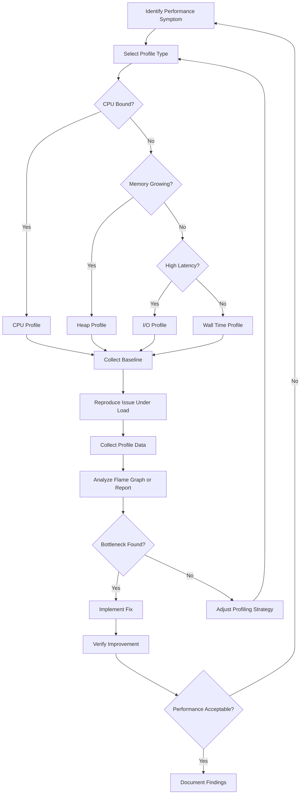
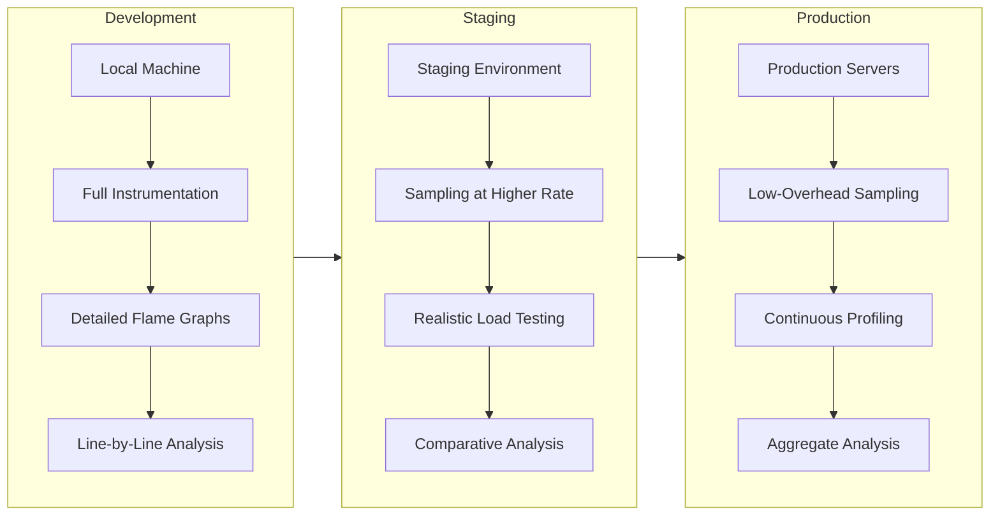
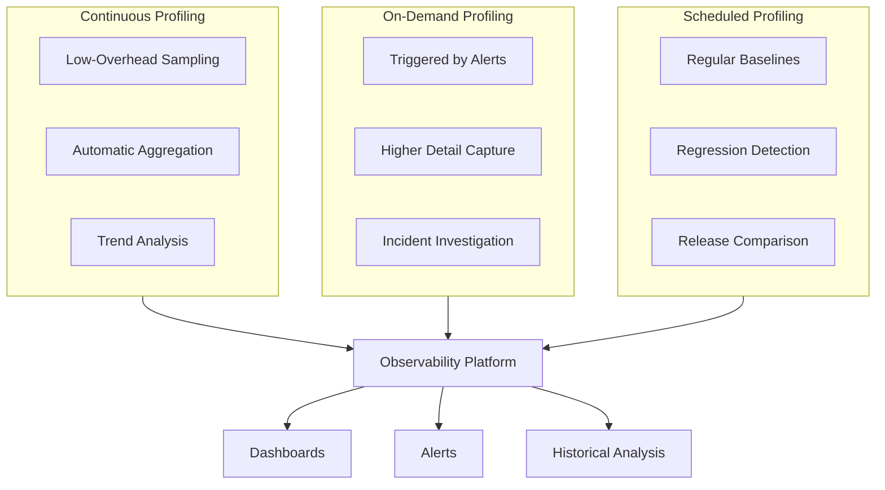

# How to Build Application Profiling Strategies

Author: [nawazdhandala](https://github.com/nawazdhandala)

Tags: Performance, Profiling, Optimization, Analysis

Description: A comprehensive guide to building effective application profiling strategies for identifying performance bottlenecks and optimizing resource usage across different runtime environments.

---

Performance problems are rarely obvious. Your application might be slow, but without profiling, you are guessing where the time goes. Profiling transforms vague symptoms like "the app feels sluggish" into actionable insights like "function X consumes 40% of CPU time parsing JSON."

This guide covers the essential strategies for building a profiling approach that works from development through production, across different languages and runtime environments.

## Understanding Profiling Types

Before selecting tools, understand what you are measuring. Different profile types reveal different performance characteristics.

### CPU Profiling

CPU profiling shows where your application spends processing time. It answers questions like:

- Which functions consume the most CPU cycles?
- Are there unexpected hot paths in the code?
- Is computation time distributed as expected?

```javascript
// Example: A CPU-intensive operation that benefits from profiling
function processData(items) {
  // CPU profile would show this loop consuming significant time
  return items.map(item => {
    // String operations are CPU-intensive
    const normalized = item.name.toLowerCase().trim();
    // JSON operations often appear in CPU profiles
    const parsed = JSON.parse(item.metadata);
    return { ...item, normalized, parsed };
  });
}
```

### Memory Profiling

Memory profiling tracks allocation patterns and heap usage. It helps identify:

- Memory leaks from objects that are never garbage collected
- Excessive allocation causing GC pressure
- Unexpectedly large data structures

```python
# Example: Memory profiling in Python reveals allocation patterns
import tracemalloc

# Start tracing memory allocations
tracemalloc.start()

def process_large_dataset(data):
    # Memory profiler shows this list comprehension allocating significant memory
    results = [transform(item) for item in data]

    # This intermediate list doubles memory usage unnecessarily
    filtered = [r for r in results if r['valid']]

    return filtered

# Take a snapshot to analyze allocations
snapshot = tracemalloc.take_snapshot()
top_stats = snapshot.statistics('lineno')

# Display top memory consumers
for stat in top_stats[:10]:
    print(stat)
```

### I/O Profiling

I/O profiling measures time spent waiting for external resources:

- Database queries and connection pool behavior
- File system reads and writes
- Network requests to external services
- Message queue operations

```go
// Example: I/O profiling in Go using pprof
package main

import (
    "net/http"
    _ "net/http/pprof"  // Import for side effects
)

func main() {
    // Enable pprof endpoint for profiling
    go func() {
        // Access profiles at /debug/pprof/
        http.ListenAndServe("localhost:6060", nil)
    }()

    // Your application code
    startServer()
}
```

## The Profiling Workflow

A systematic profiling workflow prevents random optimization and focuses effort on real bottlenecks.



## Sampling vs Instrumentation

Two fundamental approaches to profiling have different tradeoffs.

### Sampling Profilers

Sampling profilers periodically interrupt the program to record the current call stack. They provide statistical approximations with low overhead.

**Advantages:**
- Minimal performance impact (typically 1-5%)
- Safe for production use
- No code modification required

**Disadvantages:**
- May miss short-lived functions
- Statistical results, not exact counts
- Less accurate for infrequent operations

```bash
# Example: Using perf for sampling on Linux
# Sample CPU at 99 Hz for 30 seconds
perf record -F 99 -p <pid> -g -- sleep 30

# Generate flame graph from perf data
perf script | stackcollapse-perf.pl | flamegraph.pl > profile.svg
```

### Instrumentation Profilers

Instrumentation profilers inject measurement code at function entry and exit points. They provide exact measurements but with higher overhead.

**Advantages:**
- Exact call counts and timing
- Captures every function invocation
- Detailed call relationship data

**Disadvantages:**
- Higher overhead (10-100x slower)
- May alter program behavior
- Usually requires code changes or compilation flags

```java
// Example: Instrumentation in Java with AspectJ
@Aspect
public class ProfilingAspect {

    // Instrument all methods in the service package
    @Around("execution(* com.example.service.*.*(..))")
    public Object profile(ProceedingJoinPoint joinPoint) throws Throwable {
        long start = System.nanoTime();
        try {
            return joinPoint.proceed();
        } finally {
            long duration = System.nanoTime() - start;
            // Record timing for this method
            Metrics.recordMethodDuration(
                joinPoint.getSignature().getName(),
                duration
            );
        }
    }
}
```

### When to Use Each Approach

| Scenario | Recommended Approach | Reason |
|----------|---------------------|--------|
| Production debugging | Sampling | Low overhead, safe |
| Development testing | Instrumentation | Exact measurements |
| Finding CPU hotspots | Sampling | Good accuracy for hot paths |
| Counting function calls | Instrumentation | Sampling cannot count |
| Memory leak detection | Sampling (heap) | Low overhead snapshots |
| Latency tracing | Either | Depends on precision needs |

## Profiler Selection by Language

Different languages have different profiling ecosystems. Choose tools that integrate well with your runtime.

### JavaScript and Node.js

```javascript
// Built-in V8 Inspector for CPU profiling
const inspector = require('inspector');
const fs = require('fs');

const session = new inspector.Session();
session.connect();

async function profileOperation(operation) {
    // Enable the profiler
    await new Promise(resolve =>
        session.post('Profiler.enable', resolve)
    );

    // Start CPU profiling
    await new Promise(resolve =>
        session.post('Profiler.start', resolve)
    );

    // Run the operation to profile
    await operation();

    // Stop and save the profile
    return new Promise((resolve, reject) => {
        session.post('Profiler.stop', (err, { profile }) => {
            if (err) return reject(err);

            // Save as .cpuprofile for Chrome DevTools
            fs.writeFileSync(
                `profile-${Date.now()}.cpuprofile`,
                JSON.stringify(profile)
            );
            resolve(profile);
        });
    });
}

// Usage
profileOperation(async () => {
    // Your code to profile
    await processRequests();
});
```

**Recommended Tools:**
- V8 Inspector: Built-in, works with Chrome DevTools
- 0x: Easy flame graph generation
- clinic.js: Automated diagnosis with Doctor, Flame, and Bubbleprof

### Python

```python
# Using cProfile for CPU profiling
import cProfile
import pstats
from pstats import SortKey

def profile_function(func, *args, **kwargs):
    """Profile a function and return results."""
    profiler = cProfile.Profile()
    profiler.enable()

    result = func(*args, **kwargs)

    profiler.disable()

    # Sort by cumulative time
    stats = pstats.Stats(profiler)
    stats.sort_stats(SortKey.CUMULATIVE)

    # Print top 20 functions
    stats.print_stats(20)

    return result

# Memory profiling with memory_profiler
from memory_profiler import profile

@profile
def memory_intensive_function():
    # This decorator tracks line-by-line memory usage
    large_list = [i ** 2 for i in range(1000000)]
    processed = [x for x in large_list if x % 2 == 0]
    return len(processed)
```

**Recommended Tools:**
- cProfile: Built-in CPU profiler
- py-spy: Sampling profiler with low overhead
- memory_profiler: Line-by-line memory usage
- Scalene: CPU, memory, and GPU profiling combined

### Go

```go
package main

import (
    "os"
    "runtime/pprof"
    "time"
)

func profileCPU(duration time.Duration) error {
    // Create CPU profile file
    f, err := os.Create("cpu.prof")
    if err != nil {
        return err
    }
    defer f.Close()

    // Start CPU profiling
    if err := pprof.StartCPUProfile(f); err != nil {
        return err
    }

    // Profile for specified duration
    time.Sleep(duration)

    pprof.StopCPUProfile()
    return nil
}

func profileHeap() error {
    // Create heap profile file
    f, err := os.Create("heap.prof")
    if err != nil {
        return err
    }
    defer f.Close()

    // Write heap profile
    return pprof.WriteHeapProfile(f)
}

// HTTP endpoint for continuous profiling
import (
    "net/http"
    _ "net/http/pprof"
)

func enableProfilingEndpoint() {
    // Exposes /debug/pprof/ endpoints
    go http.ListenAndServe("localhost:6060", nil)
}
```

**Recommended Tools:**
- pprof: Built-in profiling toolkit
- go tool trace: Execution tracer
- fgprof: Wall-clock profiler for I/O analysis

### Java

```java
// Using JFR (Java Flight Recorder) programmatically
import jdk.jfr.*;
import jdk.jfr.consumer.*;

public class ProfilerExample {

    public static void profileWithJFR(Runnable operation) throws Exception {
        // Configure recording
        Configuration config = Configuration.getConfiguration("profile");

        try (Recording recording = new Recording(config)) {
            recording.start();

            // Run the operation to profile
            operation.run();

            recording.stop();

            // Dump to file for analysis
            recording.dump(Path.of("recording.jfr"));
        }
    }

    // Alternative: async-profiler for production use
    // java -agentpath:/path/to/libasyncProfiler.so=start,file=profile.html
}
```

**Recommended Tools:**
- JFR (Java Flight Recorder): Built-in, low overhead
- async-profiler: Sampling profiler for CPU and allocations
- VisualVM: GUI-based profiling
- JProfiler: Commercial comprehensive profiler

## Production vs Development Profiling

Profiling strategies differ significantly between environments.

### Development Profiling

In development, you can tolerate higher overhead for more detailed data.



**Development Best Practices:**

1. Profile with realistic data sizes
2. Use instrumentation for detailed analysis
3. Create reproducible test cases
4. Version control profile baselines

```python
# Development profiling with detailed output
import cProfile
import io
import pstats

def detailed_profile(func):
    """Decorator for detailed development profiling."""
    def wrapper(*args, **kwargs):
        pr = cProfile.Profile()
        pr.enable()

        result = func(*args, **kwargs)

        pr.disable()

        # Capture detailed statistics
        s = io.StringIO()
        ps = pstats.Stats(pr, stream=s)
        ps.strip_dirs()
        ps.sort_stats('cumulative')
        ps.print_stats(50)  # Top 50 functions
        ps.print_callers(20)  # Who called them
        ps.print_callees(20)  # What they called

        print(s.getvalue())
        return result

    return wrapper
```

### Production Profiling

Production profiling requires minimal overhead and safe operation.

```javascript
// Production-safe profiling with sampling and rate limiting
class ProductionProfiler {
    constructor(options = {}) {
        this.sampleRate = options.sampleRate || 0.01;  // 1% of requests
        this.maxConcurrent = options.maxConcurrent || 1;
        this.activeProfiles = 0;
    }

    shouldProfile() {
        // Rate limit profiling
        if (this.activeProfiles >= this.maxConcurrent) {
            return false;
        }
        // Random sampling
        return Math.random() < this.sampleRate;
    }

    async profileRequest(handler, req, res) {
        if (!this.shouldProfile()) {
            return handler(req, res);
        }

        this.activeProfiles++;
        const startTime = process.hrtime.bigint();

        try {
            const result = await handler(req, res);

            const duration = Number(process.hrtime.bigint() - startTime) / 1e6;

            // Send profile data to observability backend
            this.reportProfile({
                endpoint: req.path,
                method: req.method,
                duration,
                timestamp: Date.now()
            });

            return result;
        } finally {
            this.activeProfiles--;
        }
    }

    reportProfile(data) {
        // Send to your observability platform
        // OneUptime, Datadog, etc.
    }
}
```

**Production Best Practices:**

1. Use sampling profilers with 1-5% overhead
2. Implement on/off switches for emergency disable
3. Aggregate profiles across instances
4. Set up automated alerts for anomalies

| Aspect | Development | Production |
|--------|-------------|------------|
| **Overhead tolerance** | Up to 10x slower | Under 5% |
| **Sampling rate** | 100% (all calls) | 0.1-1% |
| **Data granularity** | Line-by-line | Function-level |
| **Storage duration** | Session only | Days to weeks |
| **Trigger mechanism** | Manual | Continuous or alert-based |

## Interpreting Profile Data

Raw profile data needs interpretation to drive optimization decisions.

### Reading Flame Graphs

Flame graphs visualize call stacks with width representing time spent:

```
                    main() - 100%
        _____________________________|_____________________________
       |                                                           |
  processData() - 70%                               handleRequest() - 30%
    _________|_________                                     |
   |                   |                            validateInput() - 30%
parseJSON() - 40%  transform() - 30%
```

**Key patterns to recognize:**

| Pattern | Visual | Meaning | Action |
|---------|--------|---------|--------|
| Wide tower | Single tall, wide stack | One function dominates | Optimize or cache |
| Plateau | Flat top across many calls | Leaf function is hot | Check for redundancy |
| Jagged peaks | Many narrow spikes | Diverse call patterns | May be normal |
| Deep recursion | Very tall, thin stack | Recursive algorithms | Consider iteration |

### Identifying Actionable Bottlenecks

Not all hot functions need optimization. Focus on:

```python
# Decision framework for optimization priority
def should_optimize(function_stats):
    """
    Determine if a function is worth optimizing.

    Criteria:
    - Consumes significant total time (> 10%)
    - Called frequently enough to matter
    - Has optimization potential (not already optimal)
    - Optimization cost is reasonable
    """

    # Skip functions with minimal impact
    if function_stats.percent_time < 10:
        return False, "Minimal impact"

    # Skip built-in or library functions
    if function_stats.is_builtin:
        return False, "Cannot modify built-in"

    # Skip functions called rarely with high per-call cost
    # These might be acceptable startup costs
    if function_stats.call_count < 100 and function_stats.is_initialization:
        return False, "Initialization cost"

    # Prioritize functions with clear optimization paths
    optimization_signals = [
        function_stats.has_redundant_computation,
        function_stats.has_n_plus_one_pattern,
        function_stats.has_unnecessary_allocation,
        function_stats.has_blocking_io_in_loop,
    ]

    if any(optimization_signals):
        return True, "Clear optimization available"

    return True, "Worth investigating"
```

## Building a Profiling Strategy

A complete profiling strategy combines multiple approaches for comprehensive coverage.

### Strategy Components



### Implementation Checklist

1. **Baseline establishment**
   - Profile under normal load
   - Document expected patterns
   - Store for comparison

2. **Alert integration**
   - Trigger profiles when latency spikes
   - Auto-capture during high error rates
   - Include profile links in incident channels

3. **Release validation**
   - Compare profiles before and after deploys
   - Flag performance regressions automatically
   - Block releases that exceed thresholds

4. **Regular review cadence**
   - Weekly review of top consumers
   - Monthly deep dive on specific services
   - Quarterly strategy adjustment

## Summary

Effective profiling is systematic, not reactive. Build a strategy that:

| Component | Purpose | Implementation |
|-----------|---------|----------------|
| **Profile types** | Match symptoms to measurements | CPU, memory, I/O profiles |
| **Sampling vs instrumentation** | Balance detail with overhead | Sampling for production, instrumentation for development |
| **Language-specific tools** | Leverage runtime capabilities | V8 Inspector, pprof, JFR |
| **Environment awareness** | Appropriate overhead levels | Low overhead in production, detailed in development |
| **Interpretation framework** | Convert data to decisions | Flame graph patterns, optimization criteria |
| **Continuous practice** | Catch regressions early | Automated baselines, alert integration |

Profiling is not a one-time activity. Build it into your development workflow and production monitoring to catch performance issues before they impact users.

---

*Need to correlate profiling data with logs, metrics, and traces? OneUptime provides a unified observability platform that brings all your performance data together for faster root cause analysis.*
