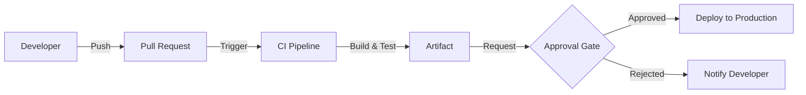
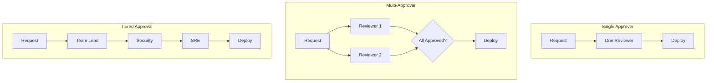
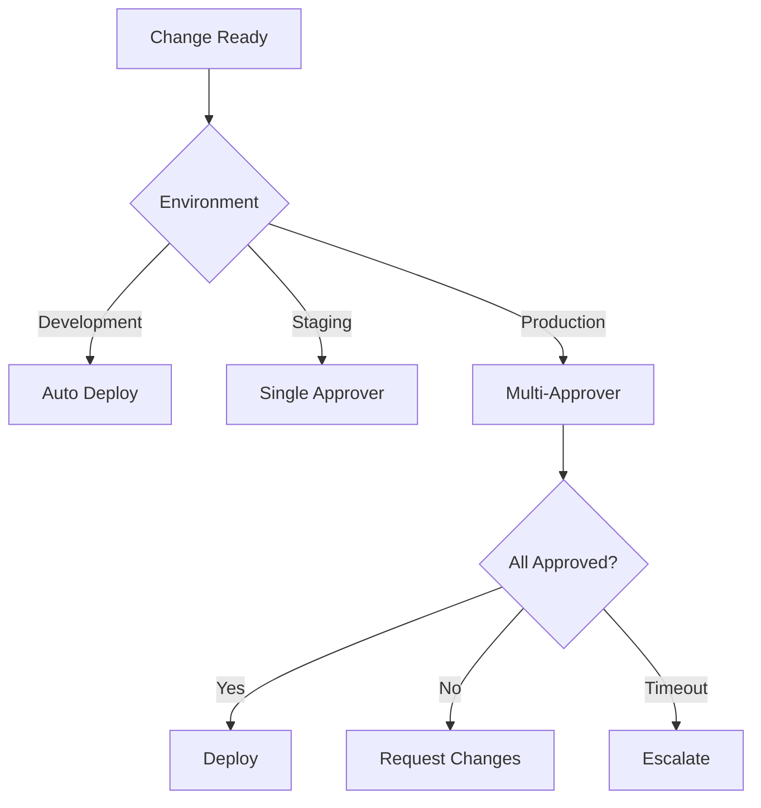

# How to Create Approval Workflows

Author: [nawazdhandala](https://github.com/nawazdhandala)

Tags: DevOps, Approvals, Workflows, CI/CD

Description: Learn to create approval workflows for controlled deployments with human review.

---

Production deployments should not happen automatically. Changes to critical systems need human oversight. Approval workflows add a checkpoint where designated team members review and approve changes before they go live.

## Why Approval Workflows Matter

Automated pipelines are fast, but speed without control leads to incidents. A developer pushes a config change, the pipeline deploys it, and suddenly production is down. Approval workflows prevent this by requiring explicit sign-off before sensitive operations.



Key benefits:

1. **Risk Reduction** - Human review catches issues automation misses
2. **Compliance** - Many regulations require documented approval chains
3. **Knowledge Sharing** - Reviewers learn about changes across the system
4. **Accountability** - Clear audit trail of who approved what

## Approval Workflow Patterns

Different scenarios call for different approval structures. Here are the common patterns.



**Single Approver** works for low-risk changes. One person reviews and approves.

**Multi-Approver** requires consensus. Multiple reviewers must all approve before proceeding.

**Tiered Approval** chains approvals sequentially. Each tier handles a different concern: functionality, security, operations.

## GitHub Actions Approval Workflow

GitHub environments provide built-in approval gates. Here is how to set them up.

First, create an environment in your repository settings with required reviewers. Then reference it in your workflow.

```yaml
# .github/workflows/deploy.yml
name: Deploy to Production

on:
  push:
    branches: [main]

jobs:
  build:
    runs-on: ubuntu-latest
    steps:
      - uses: actions/checkout@v4

      - name: Build application
        run: |
          npm ci
          npm run build
          npm test

      - name: Build Docker image
        run: |
          docker build -t myapp:${{ github.sha }} .

      - name: Push to registry
        run: |
          # Push image to container registry
          docker push myregistry/myapp:${{ github.sha }}

  # This job requires manual approval
  deploy-production:
    needs: build
    runs-on: ubuntu-latest
    # Reference the environment with approval rules
    environment:
      name: production
      url: https://myapp.example.com
    steps:
      - name: Deploy to production
        run: |
          # Deployment happens only after approval
          kubectl set image deployment/myapp \
            app=myregistry/myapp:${{ github.sha }}

      - name: Verify deployment
        run: |
          kubectl rollout status deployment/myapp --timeout=300s
```

The `environment: production` line triggers the approval gate. GitHub pauses the workflow and notifies the designated reviewers. The deployment proceeds only after approval.

## GitLab CI Approval Gates

GitLab uses manual jobs and protected environments. Here is the configuration.

```yaml
# .gitlab-ci.yml
stages:
  - build
  - test
  - staging
  - approval
  - production

variables:
  IMAGE_TAG: $CI_REGISTRY_IMAGE:$CI_COMMIT_SHA

build:
  stage: build
  script:
    - docker build -t $IMAGE_TAG .
    - docker push $IMAGE_TAG

test:
  stage: test
  script:
    - npm ci
    - npm test

deploy-staging:
  stage: staging
  script:
    - kubectl apply -f k8s/staging/
    - kubectl set image deployment/myapp app=$IMAGE_TAG
  environment:
    name: staging
    url: https://staging.myapp.example.com

# Manual approval gate
request-production-approval:
  stage: approval
  script:
    - echo "Requesting approval for production deployment"
    - echo "Commit: $CI_COMMIT_SHA"
    - echo "Author: $CI_COMMIT_AUTHOR"
  # Manual job blocks the pipeline until triggered
  when: manual
  # Only specific users can trigger this job
  only:
    - main

deploy-production:
  stage: production
  script:
    - kubectl apply -f k8s/production/
    - kubectl set image deployment/myapp app=$IMAGE_TAG
  environment:
    name: production
    url: https://myapp.example.com
  # Requires the approval job to complete first
  needs:
    - request-production-approval
  # Protected environment adds another approval layer
  resource_group: production
```

The `when: manual` directive creates a pause point. Protected environments in GitLab settings add role-based approval requirements.

## ArgoCD Sync Windows and Manual Sync

ArgoCD supports approval workflows through sync policies and sync windows.

Disable automatic sync to require manual approval for each deployment.

```yaml
# argocd-application.yaml
apiVersion: argoproj.io/v1alpha1
kind: Application
metadata:
  name: myapp-production
  namespace: argocd
spec:
  project: default
  source:
    repoURL: https://github.com/myorg/myapp-config.git
    targetRevision: HEAD
    path: production
  destination:
    server: https://kubernetes.default.svc
    namespace: production
  # No automated sync - requires manual approval
  syncPolicy:
    # Omitting 'automated' means manual sync only
    syncOptions:
      - CreateNamespace=true
      - PrunePropagationPolicy=foreground
```

Sync windows restrict when deployments can happen.

```yaml
# argocd-project.yaml
apiVersion: argoproj.io/v1alpha1
kind: AppProject
metadata:
  name: production-apps
  namespace: argocd
spec:
  description: Production applications with approval controls
  sourceRepos:
    - 'https://github.com/myorg/*'
  destinations:
    - namespace: production
      server: https://kubernetes.default.svc
  # Sync windows control deployment timing
  syncWindows:
    # Allow syncs only during business hours
    - kind: allow
      schedule: '0 9 * * 1-5'  # 9 AM weekdays
      duration: 8h             # Until 5 PM
      applications:
        - '*'
    # Block syncs during incidents
    - kind: deny
      schedule: '0 0 * * *'
      duration: 24h
      manualSync: true
      applications:
        - 'critical-*'
```

Teams trigger syncs through the ArgoCD UI or CLI after reviewing the pending changes.

```bash
# Review pending changes
argocd app diff myapp-production

# Approve and sync
argocd app sync myapp-production --prune
```

## Slack-Based Approval Bot

For teams that live in Slack, a custom approval bot provides a familiar interface.

```javascript
// approval-bot.js
const { App } = require('@slack/bolt');

const app = new App({
  token: process.env.SLACK_BOT_TOKEN,
  signingSecret: process.env.SLACK_SIGNING_SECRET,
});

// Store pending approvals
const pendingApprovals = new Map();

// Handle deployment approval request
app.command('/request-deploy', async ({ command, ack, client }) => {
  await ack();

  const deploymentId = generateId();
  const requesterId = command.user_id;

  // Store the pending approval
  pendingApprovals.set(deploymentId, {
    requesterId,
    environment: command.text,
    status: 'pending',
    requestedAt: new Date(),
  });

  // Post approval request to channel
  await client.chat.postMessage({
    channel: '#deployments',
    blocks: [
      {
        type: 'section',
        text: {
          type: 'mrkdwn',
          text: `*Deployment Approval Request*\n` +
                `Requester: <@${requesterId}>\n` +
                `Environment: ${command.text}\n` +
                `Time: ${new Date().toISOString()}`,
        },
      },
      {
        type: 'actions',
        elements: [
          {
            type: 'button',
            text: { type: 'plain_text', text: 'Approve' },
            style: 'primary',
            action_id: `approve_${deploymentId}`,
          },
          {
            type: 'button',
            text: { type: 'plain_text', text: 'Reject' },
            style: 'danger',
            action_id: `reject_${deploymentId}`,
          },
        ],
      },
    ],
  });
});

// Handle approval button click
app.action(/^approve_/, async ({ action, ack, client, body }) => {
  await ack();

  const deploymentId = action.action_id.replace('approve_', '');
  const approval = pendingApprovals.get(deploymentId);
  const approverId = body.user.id;

  // Prevent self-approval
  if (approval.requesterId === approverId) {
    await client.chat.postEphemeral({
      channel: body.channel.id,
      user: approverId,
      text: 'You cannot approve your own deployment request.',
    });
    return;
  }

  // Update approval status
  approval.status = 'approved';
  approval.approverId = approverId;
  approval.approvedAt = new Date();

  // Trigger the deployment pipeline
  await triggerDeployment(approval);

  // Update the message
  await client.chat.update({
    channel: body.channel.id,
    ts: body.message.ts,
    text: `Deployment approved by <@${approverId}>`,
  });
});

// Trigger deployment via webhook
async function triggerDeployment(approval) {
  const response = await fetch(process.env.DEPLOY_WEBHOOK_URL, {
    method: 'POST',
    headers: { 'Content-Type': 'application/json' },
    body: JSON.stringify({
      environment: approval.environment,
      approvedBy: approval.approverId,
      approvedAt: approval.approvedAt,
    }),
  });
  return response.ok;
}

app.start(3000);
```

This bot posts approval requests to a Slack channel. Designated approvers click buttons to approve or reject. The bot prevents self-approval and triggers the deployment pipeline on approval.

## Best Practices

**Set timeout policies.** Approval requests should not sit forever. Auto-reject after 24 hours or escalate to additional reviewers.

**Require context in requests.** Approvers need information to make decisions. Include commit summaries, test results, and change descriptions.

**Implement emergency bypass.** Sometimes you need to deploy during an incident. Create a documented break-glass procedure with post-incident review.

**Log everything.** Record who requested, who approved, when it happened, and what was deployed. This audit trail is essential for compliance and debugging.

**Start with staging.** Before enforcing production approvals, practice the workflow on staging environments. Work out the friction before it affects production velocity.



## Conclusion

Approval workflows balance deployment velocity with operational safety. Start simple with environment-based approvals in your CI/CD platform. Add complexity only when needed. The goal is controlled deployments, not bureaucratic slowdowns.

Choose the pattern that fits your team size and risk tolerance. A two-person startup needs different controls than a regulated enterprise. Whatever you choose, make approvals fast and frictionless so developers actually use them.
