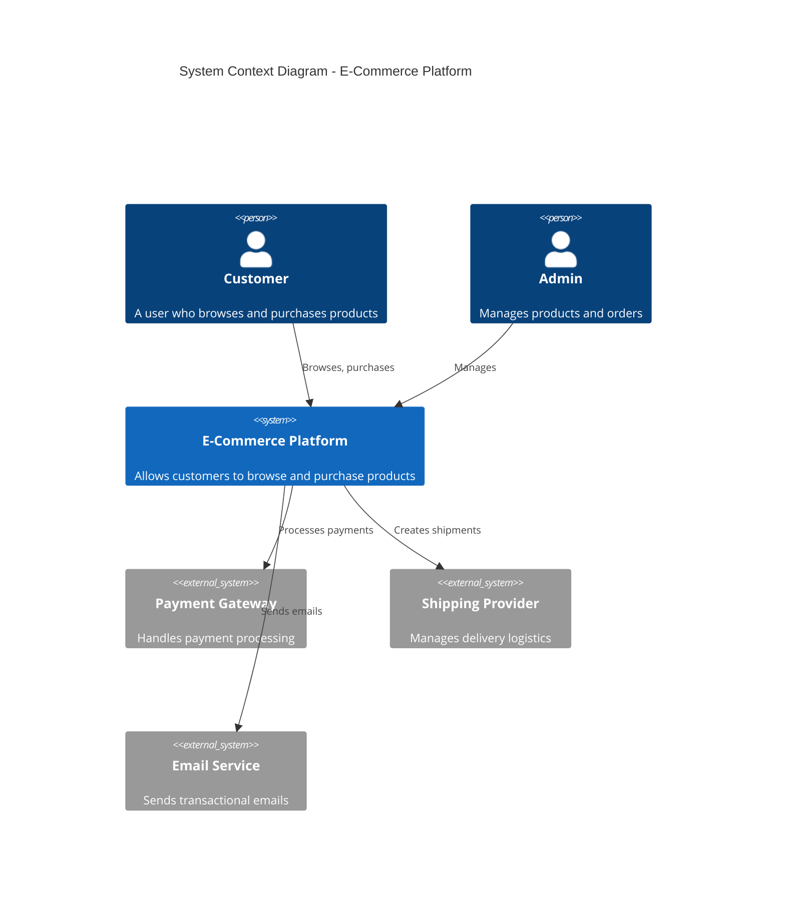
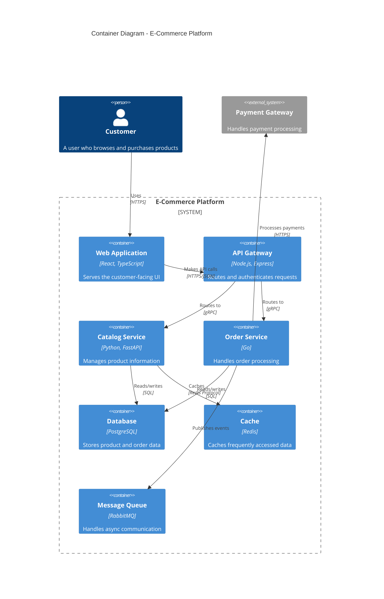
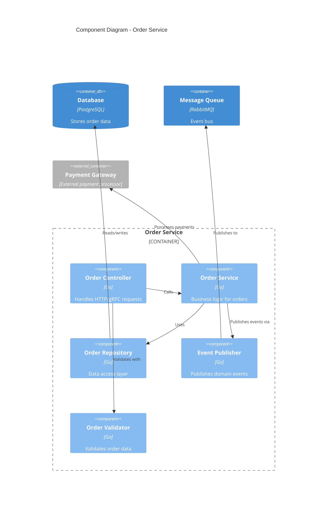
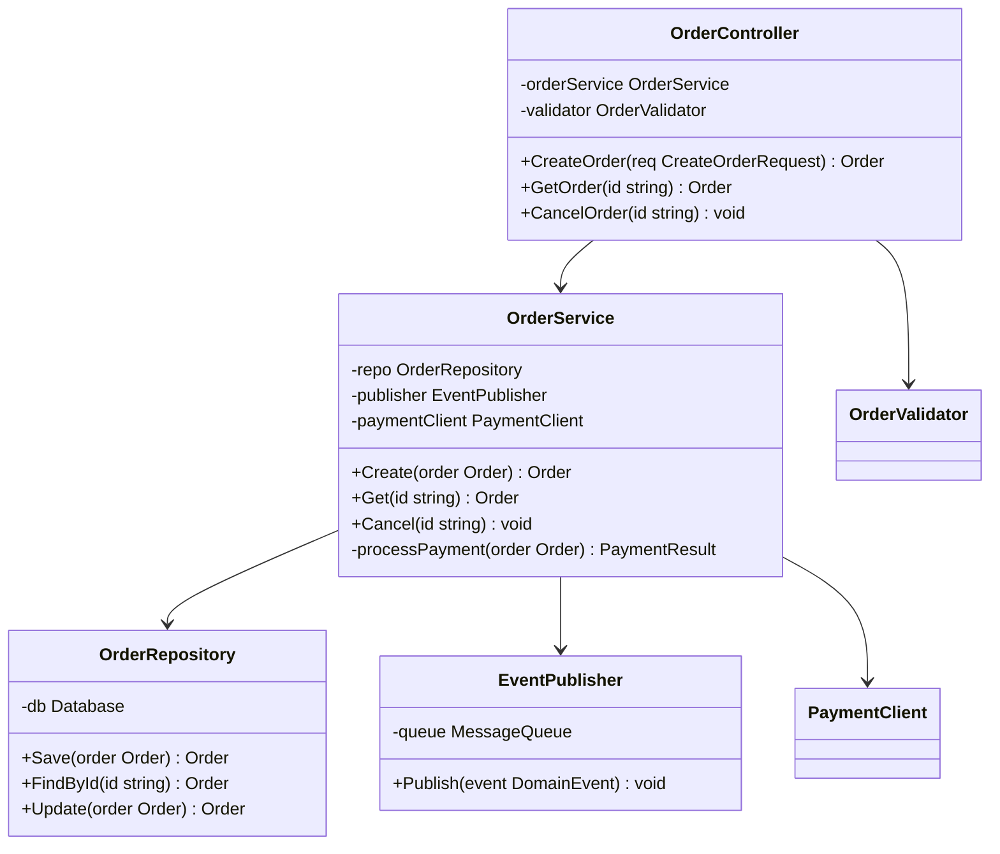

# How to Build Architecture Documentation

Author: [nawazdhandala](https://github.com/nawazdhandala)

Tags: Developer Experience, Architecture Documentation, C4 Model, Technical Writing

Description: Learn to implement architecture documentation with C4 diagrams, decision records, and automated diagram generation for maintainable architecture docs.

---

Good architecture documentation is the backbone of maintainable software systems. Without it, teams struggle to onboard new developers, make informed decisions, and understand how components interact. This guide walks you through building comprehensive architecture documentation using modern tools and proven methodologies.

## Why Architecture Documentation Matters

Architecture documentation serves multiple purposes:

- **Knowledge preservation** - Captures critical decisions and their rationale
- **Onboarding acceleration** - Helps new team members understand the system quickly
- **Communication tool** - Bridges gaps between technical and non-technical stakeholders
- **Decision support** - Provides context for future architectural choices

The challenge is keeping documentation accurate, accessible, and up-to-date. Let's explore how to achieve this.

## The C4 Model: A Layered Approach

The C4 model, created by Simon Brown, provides a hierarchical way to describe software architecture at different levels of abstraction. Think of it like Google Maps - you can zoom in and out depending on the level of detail you need.

### Level 1: System Context Diagram

The context diagram shows your system as a black box, focusing on its relationships with users and external systems.



### Level 2: Container Diagram

The container diagram zooms into your system to show the high-level technical building blocks.



### Level 3: Component Diagram

The component diagram shows the internal structure of a container.



### Level 4: Code Diagram

The code diagram shows the implementation details. Use this sparingly - only for complex or critical parts of the system.



## Architecture Decision Records (ADRs)

ADRs capture the context, decision, and consequences of significant architectural choices. They serve as a historical record that explains why the system looks the way it does.

### ADR Template

Create a standard template for your team:

```markdown
# ADR-001: Use PostgreSQL as Primary Database

## Status
Accepted

## Date
2026-01-15

## Context
We need a reliable database for our e-commerce platform that supports:
- ACID transactions for order processing
- Complex queries for reporting
- JSON support for flexible product attributes
- Strong ecosystem and tooling

## Decision
We will use PostgreSQL as our primary database.

## Alternatives Considered

### MySQL
- Pros: Familiar to team, good performance
- Cons: Less robust JSON support, fewer advanced features

### MongoDB
- Pros: Flexible schema, horizontal scaling
- Cons: No ACID transactions across documents, eventual consistency concerns for orders

### CockroachDB
- Pros: Distributed, PostgreSQL compatible
- Cons: Higher operational complexity, cost

## Consequences

### Positive
- Strong ACID guarantees for financial transactions
- Excellent JSON support via JSONB
- Rich ecosystem of tools and extensions
- Team familiarity reduces learning curve

### Negative
- Vertical scaling limitations may require sharding later
- Need to manage connection pooling carefully
- Backup and replication setup required

### Risks
- Single point of failure without proper HA setup
- Migration complexity if we outgrow PostgreSQL

## References
- [PostgreSQL Documentation](https://www.postgresql.org/docs/)
- [JSONB Performance Analysis](https://example.com/jsonb-perf)
```

### ADR Directory Structure

Organize ADRs in a dedicated directory:

```
docs/
  architecture/
    decisions/
      0001-use-postgresql-as-primary-database.md
      0002-adopt-microservices-architecture.md
      0003-implement-event-sourcing-for-orders.md
      0004-use-kubernetes-for-orchestration.md
      template.md
    diagrams/
      context.mmd
      containers.mmd
      components/
        order-service.mmd
        catalog-service.mmd
```

### ADR Management Script

Automate ADR creation with a simple script:

```bash
#!/bin/bash
# scripts/new-adr.sh

ADR_DIR="docs/architecture/decisions"
TEMPLATE="$ADR_DIR/template.md"

# Get the next ADR number
LAST_ADR=$(ls -1 "$ADR_DIR" | grep -E '^[0-9]{4}-' | sort -r | head -1)
if [ -z "$LAST_ADR" ]; then
    NEXT_NUM="0001"
else
    LAST_NUM=$(echo "$LAST_ADR" | cut -d'-' -f1)
    NEXT_NUM=$(printf "%04d" $((10#$LAST_NUM + 1)))
fi

# Get the title from arguments
TITLE="$*"
if [ -z "$TITLE" ]; then
    echo "Usage: $0 <title>"
    echo "Example: $0 Use Redis for Session Storage"
    exit 1
fi

# Create slug from title
SLUG=$(echo "$TITLE" | tr '[:upper:]' '[:lower:]' | tr ' ' '-' | tr -cd '[:alnum:]-')
FILENAME="$ADR_DIR/$NEXT_NUM-$SLUG.md"

# Create the ADR from template
sed "s/ADR-XXX/ADR-$NEXT_NUM/g; s/Title Here/$TITLE/g; s/Date Here/$(date +%Y-%m-%d)/g" \
    "$TEMPLATE" > "$FILENAME"

echo "Created: $FILENAME"
```

## Automated Diagram Generation

Keep diagrams in sync with code by generating them automatically.

### Using Structurizr DSL

Structurizr provides a domain-specific language for defining C4 models:

```
workspace "E-Commerce Platform" "Architecture documentation" {

    model {
        customer = person "Customer" "A user who browses and purchases products"
        admin = person "Admin" "Manages products and orders"

        ecommerce = softwareSystem "E-Commerce Platform" "Allows customers to browse and purchase products" {
            webapp = container "Web Application" "Serves the customer-facing UI" "React, TypeScript"
            api = container "API Gateway" "Routes and authenticates requests" "Node.js, Express"
            catalog = container "Catalog Service" "Manages product information" "Python, FastAPI"
            orders = container "Order Service" "Handles order processing" "Go"
            database = container "Database" "Stores product and order data" "PostgreSQL" "Database"
            cache = container "Cache" "Caches frequently accessed data" "Redis" "Database"
            queue = container "Message Queue" "Handles async communication" "RabbitMQ"
        }

        paymentGateway = softwareSystem "Payment Gateway" "Handles payment processing" "External"
        shippingProvider = softwareSystem "Shipping Provider" "Manages delivery logistics" "External"
        emailService = softwareSystem "Email Service" "Sends transactional emails" "External"

        customer -> webapp "Browses and purchases" "HTTPS"
        admin -> webapp "Manages products and orders" "HTTPS"
        webapp -> api "Makes API calls" "HTTPS/JSON"
        api -> catalog "Routes requests" "gRPC"
        api -> orders "Routes requests" "gRPC"
        catalog -> database "Reads/writes" "SQL"
        catalog -> cache "Caches data" "Redis Protocol"
        orders -> database "Reads/writes" "SQL"
        orders -> queue "Publishes events" "AMQP"
        orders -> paymentGateway "Processes payments" "HTTPS"
        ecommerce -> shippingProvider "Creates shipments" "HTTPS"
        ecommerce -> emailService "Sends emails" "SMTP"
    }

    views {
        systemContext ecommerce "SystemContext" {
            include *
            autoLayout
        }

        container ecommerce "Containers" {
            include *
            autoLayout
        }

        theme default
    }
}
```

### Generating Diagrams from Code

Create a script that extracts architecture information from your codebase:

```python
#!/usr/bin/env python3
# scripts/generate_architecture.py

import os
import json
import yaml
from pathlib import Path

def parse_service_config(service_path: Path) -> dict:
    """Extract service metadata from configuration files."""
    config = {}

    # Check for service.yaml
    service_yaml = service_path / "service.yaml"
    if service_yaml.exists():
        with open(service_yaml) as f:
            config = yaml.safe_load(f)

    # Check for package.json (Node.js)
    package_json = service_path / "package.json"
    if package_json.exists():
        with open(package_json) as f:
            pkg = json.load(f)
            config["name"] = pkg.get("name", service_path.name)
            config["description"] = pkg.get("description", "")
            config["dependencies"] = list(pkg.get("dependencies", {}).keys())

    # Check for go.mod (Go)
    go_mod = service_path / "go.mod"
    if go_mod.exists():
        config["language"] = "Go"
        with open(go_mod) as f:
            for line in f:
                if line.startswith("module"):
                    config["module"] = line.split()[1]
                    break

    return config

def generate_mermaid_container_diagram(services: list) -> str:
    """Generate a Mermaid container diagram from service configs."""
    lines = [
        "```mermaid",
        "C4Container",
        "    title Container Diagram - Generated from Code",
        ""
    ]

    for svc in services:
        name = svc.get("name", "Unknown")
        desc = svc.get("description", "Service")
        lang = svc.get("language", "Unknown")
        safe_name = name.replace("-", "_").replace(" ", "_")

        lines.append(f'    Container({safe_name}, "{name}", "{lang}", "{desc}")')

    lines.append("```")
    return "\n".join(lines)

def main():
    services_dir = Path("services")
    services = []

    if services_dir.exists():
        for service_path in services_dir.iterdir():
            if service_path.is_dir():
                config = parse_service_config(service_path)
                if config:
                    services.append(config)

    diagram = generate_mermaid_container_diagram(services)

    output_path = Path("docs/architecture/diagrams/containers-generated.md")
    output_path.parent.mkdir(parents=True, exist_ok=True)

    with open(output_path, "w") as f:
        f.write("# Container Diagram (Auto-Generated)\n\n")
        f.write("> This diagram is automatically generated. Do not edit manually.\n\n")
        f.write(diagram)

    print(f"Generated: {output_path}")

if __name__ == "__main__":
    main()
```

### Kubernetes to Architecture Diagram

Extract architecture from Kubernetes manifests:

```python
#!/usr/bin/env python3
# scripts/k8s_to_diagram.py

import yaml
from pathlib import Path
from typing import Dict, List

def parse_k8s_manifests(k8s_dir: Path) -> Dict[str, List]:
    """Parse Kubernetes manifests and extract services and deployments."""
    resources = {
        "deployments": [],
        "services": [],
        "ingresses": [],
        "configmaps": [],
    }

    for manifest_file in k8s_dir.glob("**/*.yaml"):
        with open(manifest_file) as f:
            docs = yaml.safe_load_all(f)
            for doc in docs:
                if not doc:
                    continue
                kind = doc.get("kind", "").lower()
                if kind in ["deployment", "statefulset"]:
                    resources["deployments"].append(doc)
                elif kind == "service":
                    resources["services"].append(doc)
                elif kind == "ingress":
                    resources["ingresses"].append(doc)

    return resources

def generate_deployment_diagram(resources: Dict) -> str:
    """Generate Mermaid diagram from Kubernetes resources."""
    lines = [
        "```mermaid",
        "flowchart TB",
        "    subgraph Internet",
        "        User((User))",
        "    end",
        ""
    ]

    # Add ingress
    for ing in resources["ingresses"]:
        name = ing["metadata"]["name"]
        lines.append(f'    subgraph Ingress')
        lines.append(f'        {name}["{name}"]')
        lines.append(f'    end')
        lines.append(f'    User --> {name}')

    # Add deployments grouped by namespace
    namespaces = {}
    for dep in resources["deployments"]:
        ns = dep["metadata"].get("namespace", "default")
        if ns not in namespaces:
            namespaces[ns] = []
        namespaces[ns].append(dep)

    for ns, deps in namespaces.items():
        lines.append(f'    subgraph {ns}["Namespace: {ns}"]')
        for dep in deps:
            name = dep["metadata"]["name"]
            replicas = dep["spec"].get("replicas", 1)
            containers = dep["spec"]["template"]["spec"]["containers"]
            container_info = ", ".join(c["name"] for c in containers)
            safe_name = name.replace("-", "_")
            lines.append(f'        {safe_name}["{name}<br/>Replicas: {replicas}<br/>{container_info}"]')
        lines.append('    end')

    lines.append("```")
    return "\n".join(lines)

def main():
    k8s_dir = Path("k8s")
    if not k8s_dir.exists():
        print("No k8s directory found")
        return

    resources = parse_k8s_manifests(k8s_dir)
    diagram = generate_deployment_diagram(resources)

    output_path = Path("docs/architecture/diagrams/k8s-deployment.md")
    output_path.parent.mkdir(parents=True, exist_ok=True)

    with open(output_path, "w") as f:
        f.write("# Kubernetes Deployment Diagram\n\n")
        f.write("> Auto-generated from Kubernetes manifests\n\n")
        f.write(diagram)

    print(f"Generated: {output_path}")

if __name__ == "__main__":
    main()
```

## Versioning Architecture Documentation

Track documentation changes alongside code changes.

### Git Integration

Store documentation in the same repository as code:

```
project/
  src/
  docs/
    architecture/
      README.md
      decisions/
      diagrams/
  .github/
    workflows/
      docs.yml
```

### GitHub Actions for Documentation

Automate documentation validation and generation:

```yaml
# .github/workflows/architecture-docs.yml
name: Architecture Documentation

on:
  push:
    paths:
      - 'docs/architecture/**'
      - 'services/**'
      - 'k8s/**'
  pull_request:
    paths:
      - 'docs/architecture/**'

jobs:
  validate:
    runs-on: ubuntu-latest
    steps:
      - uses: actions/checkout@v4

      - name: Validate Mermaid Diagrams
        uses: mermaid-js/mermaid-cli@v10
        with:
          files: docs/architecture/diagrams/*.mmd

      - name: Validate ADR Format
        run: |
          for adr in docs/architecture/decisions/[0-9]*.md; do
            echo "Validating $adr"
            # Check required sections
            grep -q "## Status" "$adr" || (echo "Missing Status section in $adr" && exit 1)
            grep -q "## Context" "$adr" || (echo "Missing Context section in $adr" && exit 1)
            grep -q "## Decision" "$adr" || (echo "Missing Decision section in $adr" && exit 1)
            grep -q "## Consequences" "$adr" || (echo "Missing Consequences section in $adr" && exit 1)
          done

      - name: Check for Broken Links
        uses: gaurav-nelson/github-action-markdown-link-check@v1
        with:
          folder-path: 'docs/architecture'

  generate:
    runs-on: ubuntu-latest
    needs: validate
    steps:
      - uses: actions/checkout@v4

      - name: Set up Python
        uses: actions/setup-python@v5
        with:
          python-version: '3.11'

      - name: Install dependencies
        run: pip install pyyaml

      - name: Generate diagrams from code
        run: python scripts/generate_architecture.py

      - name: Generate K8s diagrams
        run: python scripts/k8s_to_diagram.py

      - name: Check for changes
        id: changes
        run: |
          if git diff --quiet docs/architecture/diagrams/; then
            echo "changed=false" >> $GITHUB_OUTPUT
          else
            echo "changed=true" >> $GITHUB_OUTPUT
          fi

      - name: Commit generated diagrams
        if: steps.changes.outputs.changed == 'true' && github.event_name == 'push'
        run: |
          git config user.name "GitHub Actions"
          git config user.email "actions@github.com"
          git add docs/architecture/diagrams/
          git commit -m "docs: update generated architecture diagrams"
          git push
```

### Changelog for Architecture Changes

Maintain a changelog specifically for architectural changes:

```markdown
# Architecture Changelog

## [Unreleased]

### Added
- Event sourcing for order service (ADR-015)

### Changed
- Migrated from REST to gRPC for internal services (ADR-014)

## [2026-01-15]

### Added
- Redis cache layer for catalog service (ADR-013)
- Rate limiting at API gateway (ADR-012)

### Changed
- Database connection pooling configuration (ADR-011)

### Deprecated
- Legacy authentication service (to be removed in Q2 2026)
```

## Validation and Quality Checks

Ensure documentation stays accurate and complete.

### Documentation Linting

Create a custom linter for architecture documentation:

```python
#!/usr/bin/env python3
# scripts/lint_architecture_docs.py

import re
import sys
from pathlib import Path
from typing import List, Tuple

def lint_adr(file_path: Path) -> List[str]:
    """Lint an ADR file for common issues."""
    errors = []
    content = file_path.read_text()

    # Required sections
    required_sections = ["## Status", "## Context", "## Decision", "## Consequences"]
    for section in required_sections:
        if section not in content:
            errors.append(f"Missing required section: {section}")

    # Status must be one of the allowed values
    status_match = re.search(r"## Status\s*\n\s*(\w+)", content)
    if status_match:
        status = status_match.group(1)
        allowed_statuses = ["Proposed", "Accepted", "Deprecated", "Superseded"]
        if status not in allowed_statuses:
            errors.append(f"Invalid status '{status}'. Must be one of: {allowed_statuses}")

    # Check for date
    if "## Date" not in content:
        errors.append("Missing Date section")
    else:
        date_match = re.search(r"## Date\s*\n\s*(\d{4}-\d{2}-\d{2})", content)
        if not date_match:
            errors.append("Date must be in YYYY-MM-DD format")

    # Check for empty sections
    sections = re.split(r"^## ", content, flags=re.MULTILINE)
    for section in sections[1:]:
        lines = section.strip().split("\n")
        if len(lines) == 1:
            errors.append(f"Section '{lines[0]}' appears to be empty")

    return errors

def lint_mermaid(file_path: Path) -> List[str]:
    """Lint Mermaid diagram files."""
    errors = []
    content = file_path.read_text()

    # Check for basic Mermaid syntax
    mermaid_blocks = re.findall(r"```mermaid\s*(.*?)```", content, re.DOTALL)

    for i, block in enumerate(mermaid_blocks):
        # Check for valid diagram type
        valid_types = ["flowchart", "sequenceDiagram", "classDiagram",
                       "C4Context", "C4Container", "C4Component", "C4Deployment"]
        has_valid_type = any(t in block for t in valid_types)
        if not has_valid_type:
            errors.append(f"Mermaid block {i+1}: Missing or invalid diagram type")

        # Check for unbalanced brackets
        if block.count("(") != block.count(")"):
            errors.append(f"Mermaid block {i+1}: Unbalanced parentheses")
        if block.count("[") != block.count("]"):
            errors.append(f"Mermaid block {i+1}: Unbalanced brackets")
        if block.count("{") != block.count("}"):
            errors.append(f"Mermaid block {i+1}: Unbalanced braces")

    return errors

def main():
    docs_dir = Path("docs/architecture")
    all_errors: List[Tuple[Path, List[str]]] = []

    # Lint ADRs
    adr_dir = docs_dir / "decisions"
    if adr_dir.exists():
        for adr_file in adr_dir.glob("[0-9]*.md"):
            errors = lint_adr(adr_file)
            if errors:
                all_errors.append((adr_file, errors))

    # Lint diagrams
    diagrams_dir = docs_dir / "diagrams"
    if diagrams_dir.exists():
        for diagram_file in diagrams_dir.glob("*.md"):
            errors = lint_mermaid(diagram_file)
            if errors:
                all_errors.append((diagram_file, errors))
        for diagram_file in diagrams_dir.glob("*.mmd"):
            errors = lint_mermaid(diagram_file)
            if errors:
                all_errors.append((diagram_file, errors))

    # Report results
    if all_errors:
        print("Architecture documentation errors found:\n")
        for file_path, errors in all_errors:
            print(f"{file_path}:")
            for error in errors:
                print(f"  - {error}")
            print()
        sys.exit(1)
    else:
        print("All architecture documentation checks passed!")
        sys.exit(0)

if __name__ == "__main__":
    main()
```

### Pre-commit Hook

Add validation to your pre-commit configuration:

```yaml
# .pre-commit-config.yaml
repos:
  - repo: local
    hooks:
      - id: lint-architecture-docs
        name: Lint Architecture Documentation
        entry: python scripts/lint_architecture_docs.py
        language: python
        files: ^docs/architecture/
        pass_filenames: false

      - id: validate-mermaid
        name: Validate Mermaid Diagrams
        entry: mmdc -i
        language: node
        files: \.mmd$
        additional_dependencies: ['@mermaid-js/mermaid-cli']
```

### Integration Tests for Documentation

Verify that documentation matches the actual system:

```python
#!/usr/bin/env python3
# tests/test_architecture_docs.py

import pytest
import yaml
import subprocess
from pathlib import Path

class TestArchitectureDocumentation:
    """Tests to verify architecture documentation accuracy."""

    def test_documented_services_exist(self):
        """Verify all services mentioned in docs actually exist."""
        docs_path = Path("docs/architecture/containers.md")
        services_dir = Path("services")

        if not docs_path.exists():
            pytest.skip("No container documentation found")

        content = docs_path.read_text()
        documented_services = set()

        # Extract service names from documentation
        import re
        matches = re.findall(r'Container\([^,]+,\s*"([^"]+)"', content)
        documented_services.update(matches)

        # Get actual services
        actual_services = set()
        if services_dir.exists():
            actual_services = {d.name for d in services_dir.iterdir() if d.is_dir()}

        missing_in_docs = actual_services - documented_services
        missing_in_code = documented_services - actual_services

        assert not missing_in_docs, f"Services not documented: {missing_in_docs}"
        assert not missing_in_code, f"Documented services not found: {missing_in_code}"

    def test_adr_numbering_sequential(self):
        """Verify ADR numbers are sequential without gaps."""
        adr_dir = Path("docs/architecture/decisions")
        if not adr_dir.exists():
            pytest.skip("No ADR directory found")

        numbers = []
        for adr in adr_dir.glob("[0-9]*.md"):
            num = int(adr.name.split("-")[0])
            numbers.append(num)

        numbers.sort()
        for i, num in enumerate(numbers, start=1):
            assert num == i, f"ADR numbering gap: expected {i}, found {num}"

    def test_all_adrs_have_valid_status(self):
        """Verify all ADRs have a valid status."""
        adr_dir = Path("docs/architecture/decisions")
        if not adr_dir.exists():
            pytest.skip("No ADR directory found")

        valid_statuses = {"Proposed", "Accepted", "Deprecated", "Superseded"}

        for adr in adr_dir.glob("[0-9]*.md"):
            content = adr.read_text()
            import re
            match = re.search(r"## Status\s*\n\s*(\w+)", content)
            assert match, f"No status found in {adr.name}"
            status = match.group(1)
            assert status in valid_statuses, f"Invalid status '{status}' in {adr.name}"

    def test_external_systems_documented(self):
        """Verify external integrations are documented."""
        env_example = Path(".env.example")
        if not env_example.exists():
            pytest.skip("No .env.example found")

        # Extract external service URLs from env
        content = env_example.read_text()
        external_services = set()

        for line in content.split("\n"):
            if "_URL=" in line or "_ENDPOINT=" in line:
                service_name = line.split("=")[0].replace("_URL", "").replace("_ENDPOINT", "")
                external_services.add(service_name.lower())

        # Check if they're documented
        context_doc = Path("docs/architecture/context.md")
        if context_doc.exists():
            doc_content = context_doc.read_text().lower()
            for service in external_services:
                assert service in doc_content, f"External service {service} not documented"
```

## Best Practices Summary

### Keep Documentation Close to Code

- Store documentation in the same repository as code
- Use relative links between docs and code
- Update docs in the same PR as code changes

### Make Documentation Discoverable

- Create a clear table of contents
- Use consistent naming conventions
- Add search functionality if using a documentation site

### Automate What You Can

- Generate diagrams from code when possible
- Validate documentation in CI/CD
- Use templates to ensure consistency

### Review Documentation Like Code

- Include documentation changes in code reviews
- Set up CODEOWNERS for architecture docs
- Require approval for ADR changes

### Keep It Current

- Schedule regular documentation reviews
- Mark outdated documentation clearly
- Archive deprecated decisions rather than deleting them

## Conclusion

Building effective architecture documentation requires a combination of good practices, automation, and team discipline. The C4 model provides a structured way to describe your system at multiple levels of detail. ADRs capture the reasoning behind important decisions. Automated diagram generation keeps visuals in sync with reality. And validation ensures documentation stays accurate over time.

Start small - perhaps with a system context diagram and your first ADR. Then gradually expand as your team becomes comfortable with the process. The investment in good documentation pays dividends in faster onboarding, better decisions, and fewer architectural mistakes.

Remember: the best documentation is documentation that gets read and updated. Focus on making your docs useful and accessible, and the rest will follow.
