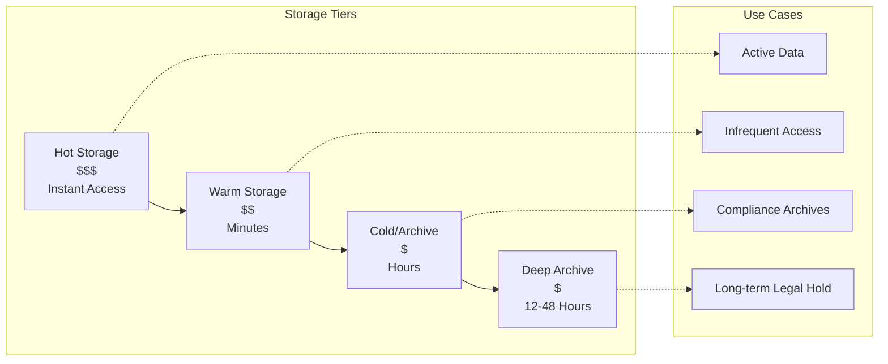
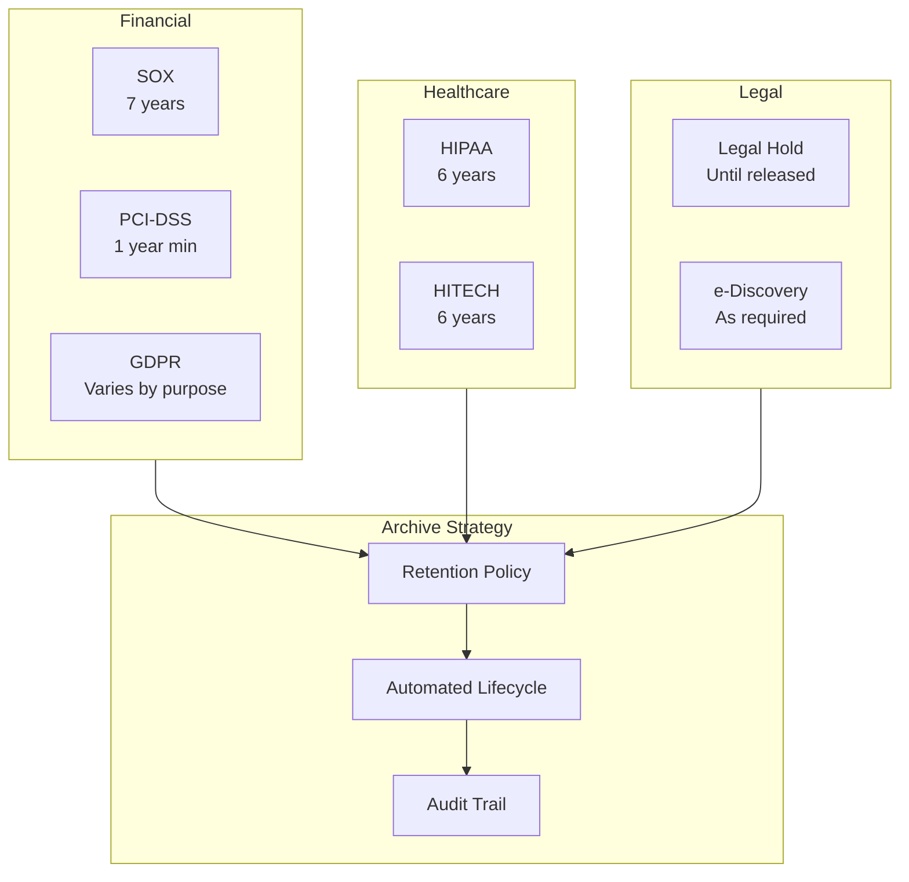
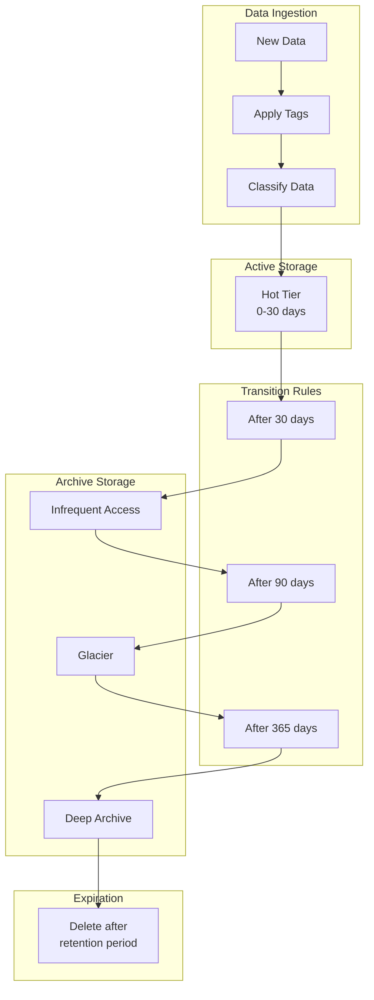
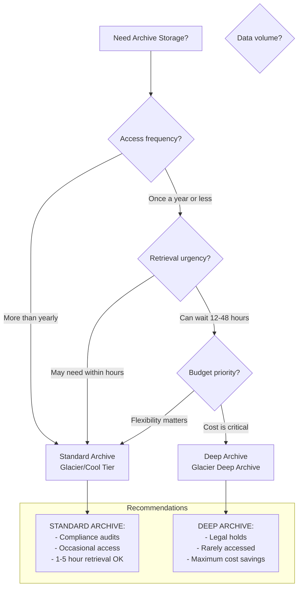
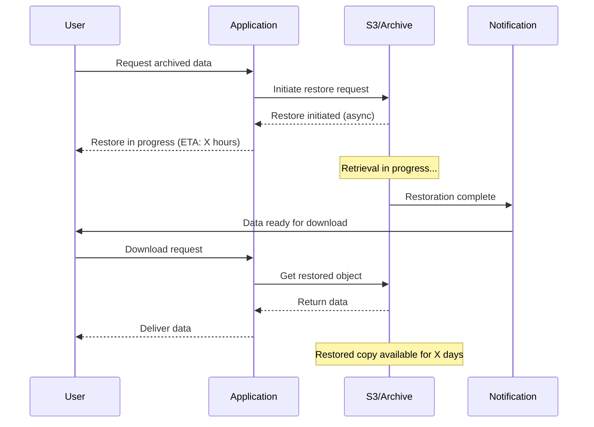
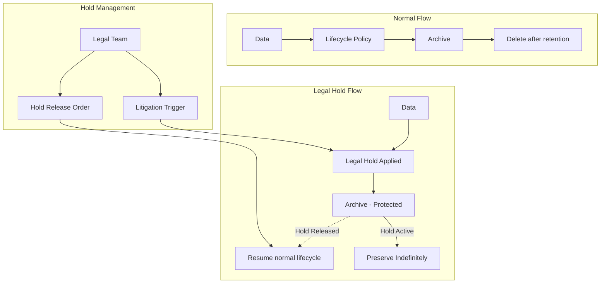

# How to Implement Archive Storage Backups

Author: [nawazdhandala](https://github.com/nawazdhandala)

Tags: Backup, Storage, Archive, Compliance

Description: Learn how to use archive storage for long-term compliance and legal retention.

---

Archive storage is the backbone of long-term data retention strategies. When compliance mandates require you to keep data for years or even decades, archive storage tiers offer cost-effective solutions that balance accessibility with economics. This guide walks you through implementing archive storage backups for compliance and legal retention.

---

## TL;DR

- Archive storage provides ultra-low-cost storage for rarely accessed data
- Choose between deep archive (lowest cost, longest retrieval) and standard archive (faster access, slightly higher cost)
- Implement lifecycle policies to automatically transition data to archive tiers
- Plan retrieval procedures carefully - archive access can take hours
- Legal holds override normal retention policies and require special handling
- Test your retrieval process regularly to ensure compliance during audits

---

## Understanding Archive Storage Characteristics

Archive storage differs fundamentally from standard storage in several key ways:

### Cost vs Accessibility Trade-off



### Key Characteristics Comparison

| Feature | Standard Storage | Archive Storage | Deep Archive |
|---------|-----------------|-----------------|--------------|
| Cost per GB/month | $0.023+ | $0.004-0.01 | $0.00099-0.002 |
| Retrieval Time | Milliseconds | 1-5 hours | 12-48 hours |
| Minimum Storage Duration | None | 90 days | 180 days |
| Retrieval Cost | Free/Low | Moderate | Higher |
| Use Case | Active data | Compliance | Long-term legal |

### When to Use Archive Storage

Archive storage is ideal for:

- **Compliance data**: Financial records, healthcare data (HIPAA), audit logs
- **Legal holds**: Litigation preservation, regulatory investigations
- **Historical records**: Old backups, decommissioned systems
- **Media archives**: Video, images, audio that must be retained
- **Research data**: Scientific datasets with long retention requirements

---

## Compliance Requirements

Different regulations mandate specific retention periods and access requirements:

### Common Compliance Frameworks



### Retention Period Reference

```yaml
# Common compliance retention requirements
compliance_requirements:
  sox:
    retention_years: 7
    data_types:
      - financial_records
      - audit_trails
      - email_communications
    access_requirement: "Must be retrievable within reasonable time"

  hipaa:
    retention_years: 6
    data_types:
      - patient_records
      - billing_records
      - authorization_forms
    access_requirement: "Must be available for patient requests"

  pci_dss:
    retention_years: 1
    data_types:
      - transaction_logs
      - access_logs
      - security_events
    access_requirement: "Available for forensic analysis"

  gdpr:
    retention_policy: "Only as long as necessary"
    data_types:
      - personal_data
      - consent_records
      - processing_logs
    access_requirement: "30 days for subject access requests"
```

### Building a Compliance-Ready Archive

```python
import boto3
from datetime import datetime, timedelta
import json

class ComplianceArchiveManager:
    """
    Manages archive storage with compliance requirements in mind.
    Handles retention policies, legal holds, and audit logging.
    """

    def __init__(self, bucket_name, compliance_type):
        self.s3 = boto3.client('s3')
        self.bucket = bucket_name
        self.compliance_type = compliance_type

        # Define retention periods by compliance type
        self.retention_periods = {
            'sox': 7 * 365,      # 7 years in days
            'hipaa': 6 * 365,    # 6 years in days
            'pci_dss': 365,      # 1 year in days
            'gdpr': 365 * 3,     # 3 years default, varies by purpose
            'legal_hold': None   # Indefinite until released
        }

    def archive_with_compliance(self, file_path, data, metadata=None):
        """
        Archive data with compliance metadata and proper storage class.
        Includes audit trail and retention information.
        """
        retention_days = self.retention_periods.get(self.compliance_type)

        # Build compliance metadata
        archive_metadata = {
            'compliance_type': self.compliance_type,
            'archived_date': datetime.utcnow().isoformat(),
            'archived_by': 'archive_system',
            'original_location': file_path,
        }

        # Add retention date if not legal hold
        if retention_days:
            retention_date = datetime.utcnow() + timedelta(days=retention_days)
            archive_metadata['retention_until'] = retention_date.isoformat()

        # Merge with custom metadata
        if metadata:
            archive_metadata.update(metadata)

        # Upload to archive storage class
        self.s3.put_object(
            Bucket=self.bucket,
            Key=f"archive/{self.compliance_type}/{file_path}",
            Body=data,
            StorageClass='GLACIER',  # Or 'DEEP_ARCHIVE' for longer retention
            Metadata=archive_metadata
        )

        # Log the archive operation for audit trail
        self._log_archive_operation(file_path, archive_metadata)

        return archive_metadata

    def _log_archive_operation(self, file_path, metadata):
        """Create audit log entry for compliance tracking."""
        audit_entry = {
            'timestamp': datetime.utcnow().isoformat(),
            'operation': 'archive',
            'file_path': file_path,
            'compliance_type': self.compliance_type,
            'metadata': metadata
        }

        # Store audit log in a separate, immutable location
        audit_key = f"audit_logs/{datetime.utcnow().strftime('%Y/%m/%d')}/{file_path}.json"
        self.s3.put_object(
            Bucket=self.bucket,
            Key=audit_key,
            Body=json.dumps(audit_entry),
            StorageClass='STANDARD'  # Audit logs need quick access
        )
```

---

## Retention Policies

Implementing effective retention policies requires automation and clear lifecycle rules.

### Lifecycle Policy Architecture



### AWS S3 Lifecycle Configuration

```json
{
  "Rules": [
    {
      "ID": "compliance-archive-policy",
      "Status": "Enabled",
      "Filter": {
        "Prefix": "compliance-data/"
      },
      "Transitions": [
        {
          "Days": 30,
          "StorageClass": "STANDARD_IA"
        },
        {
          "Days": 90,
          "StorageClass": "GLACIER"
        },
        {
          "Days": 365,
          "StorageClass": "DEEP_ARCHIVE"
        }
      ],
      "Expiration": {
        "Days": 2555
      },
      "NoncurrentVersionTransitions": [
        {
          "NoncurrentDays": 30,
          "StorageClass": "GLACIER"
        }
      ],
      "NoncurrentVersionExpiration": {
        "NoncurrentDays": 2555
      }
    }
  ]
}
```

### Terraform Configuration for Lifecycle Rules

```hcl
# terraform/archive-storage.tf

resource "aws_s3_bucket" "compliance_archive" {
  bucket = "company-compliance-archive"

  # Prevent accidental deletion
  force_destroy = false

  tags = {
    Environment = "production"
    Compliance  = "sox-hipaa"
    ManagedBy   = "terraform"
  }
}

# Enable versioning for compliance
resource "aws_s3_bucket_versioning" "compliance_archive" {
  bucket = aws_s3_bucket.compliance_archive.id
  versioning_configuration {
    status = "Enabled"
  }
}

# Object lock for WORM compliance
resource "aws_s3_bucket_object_lock_configuration" "compliance_archive" {
  bucket = aws_s3_bucket.compliance_archive.id

  rule {
    default_retention {
      mode = "COMPLIANCE"
      years = 7
    }
  }
}

# Lifecycle rules for automatic archiving
resource "aws_s3_bucket_lifecycle_configuration" "compliance_archive" {
  bucket = aws_s3_bucket.compliance_archive.id

  rule {
    id     = "archive-financial-records"
    status = "Enabled"

    filter {
      prefix = "financial/"
    }

    transition {
      days          = 30
      storage_class = "STANDARD_IA"
    }

    transition {
      days          = 90
      storage_class = "GLACIER"
    }

    transition {
      days          = 365
      storage_class = "DEEP_ARCHIVE"
    }

    # SOX requires 7 years retention
    expiration {
      days = 2555
    }
  }

  rule {
    id     = "archive-healthcare-records"
    status = "Enabled"

    filter {
      prefix = "healthcare/"
    }

    transition {
      days          = 60
      storage_class = "GLACIER"
    }

    # HIPAA requires 6 years retention
    expiration {
      days = 2190
    }
  }

  rule {
    id     = "legal-hold-no-expiration"
    status = "Enabled"

    filter {
      prefix = "legal-hold/"
    }

    transition {
      days          = 30
      storage_class = "GLACIER"
    }

    # No expiration for legal holds
  }
}

# Block public access
resource "aws_s3_bucket_public_access_block" "compliance_archive" {
  bucket = aws_s3_bucket.compliance_archive.id

  block_public_acls       = true
  block_public_policy     = true
  ignore_public_acls      = true
  restrict_public_buckets = true
}

# Enable server-side encryption
resource "aws_s3_bucket_server_side_encryption_configuration" "compliance_archive" {
  bucket = aws_s3_bucket.compliance_archive.id

  rule {
    apply_server_side_encryption_by_default {
      sse_algorithm     = "aws:kms"
      kms_master_key_id = aws_kms_key.archive_key.arn
    }
    bucket_key_enabled = true
  }
}

# KMS key for encryption
resource "aws_kms_key" "archive_key" {
  description             = "KMS key for compliance archive encryption"
  deletion_window_in_days = 30
  enable_key_rotation     = true

  policy = jsonencode({
    Version = "2012-10-17"
    Statement = [
      {
        Sid    = "Enable IAM User Permissions"
        Effect = "Allow"
        Principal = {
          AWS = "arn:aws:iam::${data.aws_caller_identity.current.account_id}:root"
        }
        Action   = "kms:*"
        Resource = "*"
      }
    ]
  })
}
```

---

## Deep Archive vs Standard Archive

Choosing between deep archive and standard archive depends on your access patterns and cost requirements.

### Decision Matrix



### Cost Comparison Script

```python
def calculate_archive_costs(
    data_size_gb: float,
    storage_months: int,
    expected_retrievals: int,
    retrieval_size_gb: float
) -> dict:
    """
    Calculate and compare costs between archive storage tiers.
    Prices are approximate and vary by region.
    """

    # AWS pricing (US East, approximate)
    pricing = {
        'standard': {
            'storage_per_gb': 0.023,
            'retrieval_per_gb': 0.00,
            'request_cost': 0.0004
        },
        'standard_ia': {
            'storage_per_gb': 0.0125,
            'retrieval_per_gb': 0.01,
            'request_cost': 0.001,
            'min_storage_days': 30
        },
        'glacier': {
            'storage_per_gb': 0.004,
            'retrieval_per_gb': 0.03,  # Standard retrieval
            'request_cost': 0.05,
            'min_storage_days': 90
        },
        'deep_archive': {
            'storage_per_gb': 0.00099,
            'retrieval_per_gb': 0.02,
            'request_cost': 0.10,
            'min_storage_days': 180
        }
    }

    results = {}

    for tier, prices in pricing.items():
        # Storage cost
        storage_cost = data_size_gb * prices['storage_per_gb'] * storage_months

        # Retrieval cost
        retrieval_cost = (
            expected_retrievals * retrieval_size_gb * prices['retrieval_per_gb'] +
            expected_retrievals * prices['request_cost']
        )

        # Total cost
        total_cost = storage_cost + retrieval_cost

        results[tier] = {
            'storage_cost': round(storage_cost, 2),
            'retrieval_cost': round(retrieval_cost, 2),
            'total_cost': round(total_cost, 2),
            'cost_per_gb_month': round(total_cost / (data_size_gb * storage_months), 4)
        }

    return results


# Example usage
if __name__ == "__main__":
    # 10 TB stored for 7 years, retrieved twice per year
    costs = calculate_archive_costs(
        data_size_gb=10000,
        storage_months=84,  # 7 years
        expected_retrievals=14,  # Twice per year for 7 years
        retrieval_size_gb=100  # 100 GB per retrieval
    )

    print("Archive Storage Cost Comparison (10 TB, 7 years)")
    print("=" * 50)
    for tier, cost_data in costs.items():
        print(f"\n{tier.upper()}:")
        print(f"  Storage Cost: ${cost_data['storage_cost']:,.2f}")
        print(f"  Retrieval Cost: ${cost_data['retrieval_cost']:,.2f}")
        print(f"  Total Cost: ${cost_data['total_cost']:,.2f}")
```

### Retrieval Time Comparison

| Retrieval Type | Standard Archive | Deep Archive |
|----------------|------------------|--------------|
| Expedited | 1-5 minutes | Not available |
| Standard | 3-5 hours | 12 hours |
| Bulk | 5-12 hours | 48 hours |

---

## Retrieval Procedures

Planning for data retrieval is critical since archive storage has significant access latency.

### Retrieval Workflow



### Automated Retrieval System

```python
import boto3
import json
from datetime import datetime
from typing import Optional

class ArchiveRetrievalManager:
    """
    Manages archive data retrieval with proper notification
    and tracking for compliance requirements.
    """

    def __init__(self, bucket_name: str, notification_topic: str):
        self.s3 = boto3.client('s3')
        self.sns = boto3.client('sns')
        self.bucket = bucket_name
        self.notification_topic = notification_topic

    def initiate_retrieval(
        self,
        object_key: str,
        retrieval_tier: str = 'Standard',
        days_available: int = 7,
        requester: str = None,
        reason: str = None
    ) -> dict:
        """
        Initiate retrieval of archived object.

        Args:
            object_key: S3 key of the archived object
            retrieval_tier: 'Expedited', 'Standard', or 'Bulk'
            days_available: Days the restored copy remains available
            requester: Who requested the retrieval (for audit)
            reason: Why the retrieval was requested (for audit)

        Returns:
            dict with retrieval status and tracking info
        """

        # Check current storage class
        try:
            head = self.s3.head_object(Bucket=self.bucket, Key=object_key)
            storage_class = head.get('StorageClass', 'STANDARD')
        except self.s3.exceptions.ClientError as e:
            return {'error': f'Object not found: {object_key}'}

        # Validate retrieval tier for storage class
        if storage_class == 'DEEP_ARCHIVE' and retrieval_tier == 'Expedited':
            return {
                'error': 'Expedited retrieval not available for Deep Archive',
                'suggestion': 'Use Standard (12h) or Bulk (48h) retrieval'
            }

        # Check if already restored or in progress
        restore_status = head.get('Restore')
        if restore_status:
            if 'ongoing-request="true"' in restore_status:
                return {
                    'status': 'in_progress',
                    'message': 'Retrieval already in progress'
                }
            elif 'ongoing-request="false"' in restore_status:
                return {
                    'status': 'available',
                    'message': 'Object already restored and available'
                }

        # Initiate the restore
        restore_request = {
            'Days': days_available,
            'GlacierJobParameters': {
                'Tier': retrieval_tier
            }
        }

        self.s3.restore_object(
            Bucket=self.bucket,
            Key=object_key,
            RestoreRequest=restore_request
        )

        # Create tracking record
        tracking_id = f"retrieve-{datetime.utcnow().strftime('%Y%m%d%H%M%S')}"
        tracking_record = {
            'tracking_id': tracking_id,
            'object_key': object_key,
            'storage_class': storage_class,
            'retrieval_tier': retrieval_tier,
            'days_available': days_available,
            'initiated_at': datetime.utcnow().isoformat(),
            'requester': requester,
            'reason': reason,
            'status': 'initiated'
        }

        # Store tracking record
        self._save_tracking_record(tracking_record)

        # Send notification
        self._notify_retrieval_initiated(tracking_record)

        # Estimate completion time
        eta_hours = self._estimate_retrieval_time(storage_class, retrieval_tier)

        return {
            'status': 'initiated',
            'tracking_id': tracking_id,
            'estimated_hours': eta_hours,
            'message': f'Retrieval initiated. Estimated completion: {eta_hours} hours'
        }

    def _estimate_retrieval_time(self, storage_class: str, tier: str) -> int:
        """Estimate retrieval completion time in hours."""
        estimates = {
            'GLACIER': {
                'Expedited': 0.1,  # 1-5 minutes
                'Standard': 4,     # 3-5 hours
                'Bulk': 10         # 5-12 hours
            },
            'DEEP_ARCHIVE': {
                'Standard': 12,    # 12 hours
                'Bulk': 48         # 48 hours
            }
        }
        return estimates.get(storage_class, {}).get(tier, 12)

    def _save_tracking_record(self, record: dict):
        """Save retrieval tracking record for audit purposes."""
        key = f"retrieval-tracking/{record['tracking_id']}.json"
        self.s3.put_object(
            Bucket=self.bucket,
            Key=key,
            Body=json.dumps(record, indent=2),
            ContentType='application/json'
        )

    def _notify_retrieval_initiated(self, record: dict):
        """Send notification about retrieval initiation."""
        message = {
            'event': 'archive_retrieval_initiated',
            'tracking_id': record['tracking_id'],
            'object_key': record['object_key'],
            'requester': record['requester'],
            'estimated_hours': self._estimate_retrieval_time(
                record['storage_class'],
                record['retrieval_tier']
            )
        }

        self.sns.publish(
            TopicArn=self.notification_topic,
            Message=json.dumps(message),
            Subject='Archive Retrieval Initiated'
        )

    def check_retrieval_status(self, object_key: str) -> dict:
        """Check the status of a retrieval request."""
        try:
            head = self.s3.head_object(Bucket=self.bucket, Key=object_key)
            restore_status = head.get('Restore', '')

            if not restore_status:
                return {'status': 'archived', 'message': 'Object is archived, no restore in progress'}
            elif 'ongoing-request="true"' in restore_status:
                return {'status': 'in_progress', 'message': 'Retrieval in progress'}
            elif 'ongoing-request="false"' in restore_status:
                # Extract expiry date
                return {'status': 'available', 'message': 'Object restored and available'}

        except Exception as e:
            return {'status': 'error', 'message': str(e)}
```

### Batch Retrieval for Audits

```bash
#!/bin/bash
# batch-archive-retrieval.sh
# Retrieve multiple archived files for compliance audit

BUCKET="company-compliance-archive"
PREFIX="financial/2024/"
RETRIEVAL_TIER="Bulk"  # Cost-effective for large batches
DAYS_AVAILABLE=14
OUTPUT_FILE="retrieval_jobs.txt"

echo "Starting batch retrieval for audit"
echo "Bucket: $BUCKET"
echo "Prefix: $PREFIX"
echo "Tier: $RETRIEVAL_TIER"
echo "==============================="

# List all objects in the prefix
aws s3api list-objects-v2 \
    --bucket "$BUCKET" \
    --prefix "$PREFIX" \
    --query 'Contents[?StorageClass==`GLACIER` || StorageClass==`DEEP_ARCHIVE`].Key' \
    --output text | tr '\t' '\n' > /tmp/archived_objects.txt

TOTAL=$(wc -l < /tmp/archived_objects.txt)
echo "Found $TOTAL archived objects to retrieve"

# Initiate restore for each object
COUNT=0
while read -r KEY; do
    if [ -n "$KEY" ]; then
        echo "Initiating restore: $KEY"

        aws s3api restore-object \
            --bucket "$BUCKET" \
            --key "$KEY" \
            --restore-request "{\"Days\":$DAYS_AVAILABLE,\"GlacierJobParameters\":{\"Tier\":\"$RETRIEVAL_TIER\"}}" \
            2>/dev/null

        if [ $? -eq 0 ]; then
            echo "$KEY" >> "$OUTPUT_FILE"
            ((COUNT++))
        else
            echo "  Already restored or in progress"
        fi
    fi
done < /tmp/archived_objects.txt

echo "==============================="
echo "Initiated $COUNT retrieval jobs"
echo "Job list saved to: $OUTPUT_FILE"
echo "Estimated completion: 48 hours for Bulk tier"
```

---

## Legal Hold Considerations

Legal holds require special handling because they override normal retention and deletion policies.

### Legal Hold Architecture



### Implementing Legal Holds

```python
import boto3
from datetime import datetime
import json
from typing import List, Optional

class LegalHoldManager:
    """
    Manages legal holds on archived data.
    Ensures compliance with litigation and regulatory requirements.
    """

    def __init__(self, bucket_name: str, legal_holds_table: str):
        self.s3 = boto3.client('s3')
        self.dynamodb = boto3.resource('dynamodb')
        self.bucket = bucket_name
        self.holds_table = self.dynamodb.Table(legal_holds_table)

    def apply_legal_hold(
        self,
        matter_id: str,
        matter_name: str,
        custodians: List[str],
        date_range_start: str,
        date_range_end: str,
        data_types: List[str],
        authorized_by: str
    ) -> dict:
        """
        Apply a legal hold to relevant data based on criteria.

        This prevents deletion and documents the hold for compliance.
        """

        hold_id = f"HOLD-{datetime.utcnow().strftime('%Y%m%d%H%M%S')}"

        # Create hold record
        hold_record = {
            'hold_id': hold_id,
            'matter_id': matter_id,
            'matter_name': matter_name,
            'custodians': custodians,
            'date_range': {
                'start': date_range_start,
                'end': date_range_end
            },
            'data_types': data_types,
            'authorized_by': authorized_by,
            'applied_at': datetime.utcnow().isoformat(),
            'status': 'active',
            'affected_objects': []
        }

        # Find and tag all affected objects
        affected_objects = self._find_affected_objects(
            custodians, date_range_start, date_range_end, data_types
        )

        for obj_key in affected_objects:
            # Apply S3 Object Lock legal hold
            self._apply_object_hold(obj_key, hold_id)
            hold_record['affected_objects'].append(obj_key)

        # Store hold record
        self.holds_table.put_item(Item=hold_record)

        # Create audit trail
        self._create_audit_entry('hold_applied', hold_record)

        return {
            'hold_id': hold_id,
            'status': 'applied',
            'affected_objects_count': len(affected_objects),
            'message': f'Legal hold {hold_id} applied to {len(affected_objects)} objects'
        }

    def _find_affected_objects(
        self,
        custodians: List[str],
        date_start: str,
        date_end: str,
        data_types: List[str]
    ) -> List[str]:
        """Find all objects matching the legal hold criteria."""

        affected = []

        # Search by custodian prefixes
        for custodian in custodians:
            for data_type in data_types:
                prefix = f"archive/{data_type}/{custodian}/"

                paginator = self.s3.get_paginator('list_objects_v2')
                for page in paginator.paginate(Bucket=self.bucket, Prefix=prefix):
                    for obj in page.get('Contents', []):
                        # Check if object falls within date range
                        obj_date = obj['LastModified'].strftime('%Y-%m-%d')
                        if date_start <= obj_date <= date_end:
                            affected.append(obj['Key'])

        return affected

    def _apply_object_hold(self, object_key: str, hold_id: str):
        """Apply legal hold status to an S3 object."""

        # Enable S3 Object Lock legal hold
        self.s3.put_object_legal_hold(
            Bucket=self.bucket,
            Key=object_key,
            LegalHold={'Status': 'ON'}
        )

        # Also tag with hold information for tracking
        existing_tags = self.s3.get_object_tagging(
            Bucket=self.bucket, Key=object_key
        ).get('TagSet', [])

        # Add legal hold tag
        existing_tags.append({
            'Key': 'LegalHold',
            'Value': hold_id
        })

        self.s3.put_object_tagging(
            Bucket=self.bucket,
            Key=object_key,
            Tagging={'TagSet': existing_tags}
        )

    def release_legal_hold(
        self,
        hold_id: str,
        authorized_by: str,
        reason: str
    ) -> dict:
        """
        Release a legal hold when litigation concludes.

        Objects will resume normal lifecycle policies.
        """

        # Get hold record
        response = self.holds_table.get_item(Key={'hold_id': hold_id})
        hold_record = response.get('Item')

        if not hold_record:
            return {'error': f'Hold {hold_id} not found'}

        if hold_record['status'] != 'active':
            return {'error': f'Hold {hold_id} is not active'}

        # Release hold on all affected objects
        for obj_key in hold_record['affected_objects']:
            self._release_object_hold(obj_key, hold_id)

        # Update hold record
        self.holds_table.update_item(
            Key={'hold_id': hold_id},
            UpdateExpression='SET #s = :status, released_at = :released, released_by = :by, release_reason = :reason',
            ExpressionAttributeNames={'#s': 'status'},
            ExpressionAttributeValues={
                ':status': 'released',
                ':released': datetime.utcnow().isoformat(),
                ':by': authorized_by,
                ':reason': reason
            }
        )

        # Create audit trail
        self._create_audit_entry('hold_released', {
            'hold_id': hold_id,
            'released_by': authorized_by,
            'reason': reason
        })

        return {
            'hold_id': hold_id,
            'status': 'released',
            'released_objects': len(hold_record['affected_objects']),
            'message': f'Legal hold {hold_id} released'
        }

    def _release_object_hold(self, object_key: str, hold_id: str):
        """Release legal hold from an S3 object."""

        # Remove S3 Object Lock legal hold
        self.s3.put_object_legal_hold(
            Bucket=self.bucket,
            Key=object_key,
            LegalHold={'Status': 'OFF'}
        )

        # Remove hold tag
        existing_tags = self.s3.get_object_tagging(
            Bucket=self.bucket, Key=object_key
        ).get('TagSet', [])

        updated_tags = [t for t in existing_tags if t['Key'] != 'LegalHold' or t['Value'] != hold_id]

        self.s3.put_object_tagging(
            Bucket=self.bucket,
            Key=object_key,
            Tagging={'TagSet': updated_tags}
        )

    def _create_audit_entry(self, action: str, details: dict):
        """Create immutable audit log entry for legal hold actions."""
        audit_entry = {
            'timestamp': datetime.utcnow().isoformat(),
            'action': action,
            'details': details
        }

        audit_key = f"legal-hold-audit/{datetime.utcnow().strftime('%Y/%m/%d')}/{action}-{datetime.utcnow().timestamp()}.json"

        self.s3.put_object(
            Bucket=self.bucket,
            Key=audit_key,
            Body=json.dumps(audit_entry, indent=2),
            ContentType='application/json'
        )
```

### Legal Hold Best Practices

1. **Immediate preservation**: Apply holds as soon as litigation is anticipated
2. **Broad scope initially**: Better to over-preserve than under-preserve
3. **Document everything**: Every action must have an audit trail
4. **Regular reviews**: Periodically review active holds for release eligibility
5. **Chain of custody**: Track all access to held data
6. **Separation of duties**: Legal team authorizes, IT team implements

---

## Monitoring Archive Operations

Track archive storage operations for compliance and cost management.

### CloudWatch Metrics Dashboard

```yaml
# cloudformation/archive-monitoring.yaml
AWSTemplateFormatVersion: '2010-09-09'
Description: Archive storage monitoring dashboard

Resources:
  ArchiveMonitoringDashboard:
    Type: AWS::CloudWatch::Dashboard
    Properties:
      DashboardName: archive-storage-monitoring
      DashboardBody: !Sub |
        {
          "widgets": [
            {
              "type": "metric",
              "properties": {
                "title": "Archive Storage Size",
                "metrics": [
                  ["AWS/S3", "BucketSizeBytes", "BucketName", "${ArchiveBucket}", "StorageType", "GlacierStorage"],
                  ["AWS/S3", "BucketSizeBytes", "BucketName", "${ArchiveBucket}", "StorageType", "DeepArchiveStorage"]
                ],
                "period": 86400,
                "stat": "Average"
              }
            },
            {
              "type": "metric",
              "properties": {
                "title": "Retrieval Requests",
                "metrics": [
                  ["AWS/S3", "RestoreRequests", "BucketName", "${ArchiveBucket}"]
                ],
                "period": 3600,
                "stat": "Sum"
              }
            },
            {
              "type": "metric",
              "properties": {
                "title": "Archive Transition Operations",
                "metrics": [
                  ["AWS/S3", "LifecycleTransitionRequests", "BucketName", "${ArchiveBucket}"]
                ],
                "period": 86400,
                "stat": "Sum"
              }
            }
          ]
        }

  ArchiveAlerts:
    Type: AWS::CloudWatch::Alarm
    Properties:
      AlarmName: archive-retrieval-spike
      AlarmDescription: Alert on unusual retrieval activity
      MetricName: RestoreRequests
      Namespace: AWS/S3
      Dimensions:
        - Name: BucketName
          Value: !Ref ArchiveBucket
      Statistic: Sum
      Period: 3600
      EvaluationPeriods: 1
      Threshold: 100
      ComparisonOperator: GreaterThanThreshold
      AlarmActions:
        - !Ref AlertTopic
```

---

## Best Practices Summary

### Archive Storage Checklist

```
PRE-IMPLEMENTATION:
[ ] Define compliance requirements and retention periods
[ ] Identify data categories and their sensitivity
[ ] Establish cost budget and retrieval SLAs
[ ] Document legal hold procedures

IMPLEMENTATION:
[ ] Configure lifecycle policies for automatic tiering
[ ] Enable versioning and object lock where required
[ ] Set up encryption (at rest and in transit)
[ ] Implement access controls and audit logging
[ ] Create retrieval procedures and runbooks

OPERATIONS:
[ ] Monitor storage growth and costs
[ ] Test retrieval procedures quarterly
[ ] Review and update retention policies annually
[ ] Audit legal holds for release eligibility
[ ] Train staff on archive procedures

COMPLIANCE:
[ ] Maintain audit trails for all operations
[ ] Document chain of custody
[ ] Regular compliance assessments
[ ] Incident response procedures for data breaches
```

### Cost Optimization Tips

1. **Right-size your tiers**: Use deep archive for true long-term storage
2. **Batch retrievals**: Combine requests to reduce per-request costs
3. **Use bulk retrieval**: Unless urgency requires faster options
4. **Monitor transitions**: Avoid unnecessary tier changes
5. **Clean up**: Remove data when retention periods expire (unless held)

---

## Conclusion

Archive storage is essential for cost-effective long-term data retention and compliance. By understanding the trade-offs between storage tiers, implementing proper lifecycle policies, and establishing robust retrieval and legal hold procedures, you can build an archive strategy that meets both regulatory requirements and budget constraints.

Key takeaways:

- **Choose the right tier**: Deep archive for maximum savings, standard archive for faster access
- **Automate transitions**: Use lifecycle policies to move data automatically
- **Plan for retrieval**: Archive access takes hours, not seconds
- **Handle legal holds carefully**: They override normal retention and require audit trails
- **Test regularly**: Verify your retrieval procedures work before you need them

Start with your most critical compliance data, establish clear policies, and expand your archive strategy as your retention needs grow.

---

Ready to implement archive storage backups? OneUptime can help you monitor your backup jobs and archive operations, ensuring your compliance data is protected and accessible when you need it.
