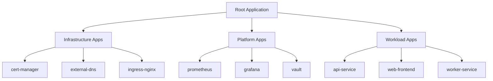

# How to Build ArgoCD App of Apps Pattern

Author: [nawazdhandala](https://github.com/nawazdhandala)

Tags: ArgoCD, GitOps, Kubernetes, Patterns

Description: Learn how to use the App of Apps pattern in ArgoCD to manage multiple applications, environments, and clusters from a single parent application.

---

Managing dozens of Kubernetes applications with ArgoCD can quickly become overwhelming. The App of Apps pattern solves this by letting you define a single parent application that manages all your child applications. One sync, everything deploys.

## What Is the App of Apps Pattern?

The App of Apps pattern is a hierarchical approach where a root ArgoCD Application manages other ArgoCD Applications as its resources. Instead of manually creating each application, you define them as YAML files in a Git repository, and the parent application deploys them automatically.



## Why Use App of Apps?

**Single entry point** - Bootstrap an entire cluster by applying one Application manifest.

**Consistent structure** - All applications follow the same pattern and live in the same repository.

**Atomic deployments** - Related applications sync together with proper ordering via sync waves.

**Environment parity** - Replicate your entire stack across dev, staging, and production.

## Repository Structure

A well-organized repository is the foundation of the App of Apps pattern:

```
gitops-repo/
├── apps/
│   ├── root/
│   │   └── application.yaml          # Root application
│   ├── infrastructure/
│   │   ├── cert-manager.yaml
│   │   ├── external-dns.yaml
│   │   └── ingress-nginx.yaml
│   ├── platform/
│   │   ├── prometheus.yaml
│   │   ├── grafana.yaml
│   │   └── vault.yaml
│   └── workloads/
│       ├── api-service.yaml
│       ├── web-frontend.yaml
│       └── worker-service.yaml
├── manifests/
│   ├── cert-manager/
│   │   └── kustomization.yaml
│   ├── prometheus/
│   │   └── kustomization.yaml
│   └── api-service/
│       ├── base/
│       └── overlays/
└── clusters/
    ├── dev/
    ├── staging/
    └── production/
```

## Building the Root Application

The root application is your entry point. It watches a directory containing other Application manifests and syncs them to ArgoCD.

```yaml
# apps/root/application.yaml
apiVersion: argoproj.io/v1alpha1
kind: Application
metadata:
  name: root
  namespace: argocd
  finalizers:
    - resources-finalizer.argocd.argoproj.io
spec:
  project: default
  source:
    repoURL: https://github.com/myorg/gitops-repo.git
    targetRevision: HEAD
    path: apps
    directory:
      recurse: true
      include: '*.yaml'
  destination:
    server: https://kubernetes.default.svc
    namespace: argocd
  syncPolicy:
    automated:
      prune: true
      selfHeal: true
    syncOptions:
      - CreateNamespace=true
```

Key configuration points:

- `directory.recurse: true` scans all subdirectories for Application manifests
- `finalizers` ensures child applications are cleaned up when the root is deleted
- `automated.prune` removes applications that are deleted from Git

## Creating Child Applications

Each child application points to its actual Kubernetes manifests. Here are examples for different application types.

### Infrastructure Application

```yaml
# apps/infrastructure/cert-manager.yaml
apiVersion: argoproj.io/v1alpha1
kind: Application
metadata:
  name: cert-manager
  namespace: argocd
  annotations:
    argocd.argoproj.io/sync-wave: "-3"
spec:
  project: default
  source:
    repoURL: https://charts.jetstack.io
    chart: cert-manager
    targetRevision: v1.14.0
    helm:
      values: |
        installCRDs: true
        prometheus:
          enabled: true
  destination:
    server: https://kubernetes.default.svc
    namespace: cert-manager
  syncPolicy:
    automated:
      prune: true
      selfHeal: true
    syncOptions:
      - CreateNamespace=true
```

### Platform Application with Kustomize

```yaml
# apps/platform/prometheus.yaml
apiVersion: argoproj.io/v1alpha1
kind: Application
metadata:
  name: prometheus
  namespace: argocd
  annotations:
    argocd.argoproj.io/sync-wave: "-1"
spec:
  project: default
  source:
    repoURL: https://github.com/myorg/gitops-repo.git
    targetRevision: HEAD
    path: manifests/prometheus/overlays/production
  destination:
    server: https://kubernetes.default.svc
    namespace: monitoring
  syncPolicy:
    automated:
      prune: true
      selfHeal: true
    syncOptions:
      - CreateNamespace=true
```

### Workload Application

```yaml
# apps/workloads/api-service.yaml
apiVersion: argoproj.io/v1alpha1
kind: Application
metadata:
  name: api-service
  namespace: argocd
  annotations:
    argocd.argoproj.io/sync-wave: "1"
spec:
  project: default
  source:
    repoURL: https://github.com/myorg/gitops-repo.git
    targetRevision: HEAD
    path: manifests/api-service/overlays/production
  destination:
    server: https://kubernetes.default.svc
    namespace: production
  syncPolicy:
    automated:
      prune: true
      selfHeal: true
    syncOptions:
      - CreateNamespace=true
      - ServerSideApply=true
```

## Sync Waves for Ordering

Sync waves control the order in which applications deploy. Lower numbers sync first.

```mermaid
flowchart LR
    subgraph Wave -3
        CRDs[CRDs]
        CertManager[cert-manager]
    end

    subgraph Wave -2
        Namespaces[Namespaces]
        RBAC[RBAC]
    end

    subgraph Wave -1
        Ingress[Ingress Controller]
        Monitoring[Monitoring Stack]
    end

    subgraph Wave 0
        Platform[Platform Services]
    end

    subgraph Wave 1
        Apps[Applications]
    end

    Wave -3 --> Wave -2 --> Wave -1 --> Wave 0 --> Wave 1
```

Typical wave assignments:

| Wave | Components |
|------|------------|
| -3 | CRDs, cert-manager |
| -2 | Namespaces, RBAC, secrets |
| -1 | Ingress controllers, monitoring |
| 0 | Platform services, databases |
| 1+ | Application workloads |

## Bootstrapping a New Cluster

Bootstrapping is straightforward with App of Apps. Install ArgoCD, apply the root application, and watch everything deploy.

```bash
# 1. Install ArgoCD
kubectl create namespace argocd
kubectl apply -n argocd -f https://raw.githubusercontent.com/argoproj/argo-cd/stable/manifests/install.yaml

# 2. Wait for ArgoCD to be ready
kubectl wait --for=condition=Ready pods --all -n argocd --timeout=300s

# 3. Apply the root application
kubectl apply -f apps/root/application.yaml

# 4. Watch the magic happen
argocd app list
```

ArgoCD syncs the root application, discovers all child applications, and deploys them in sync wave order. A fresh cluster goes from empty to fully configured in minutes.

## Multi-Cluster Deployment

The App of Apps pattern scales to multiple clusters by using cluster-specific directories.

### Cluster-Aware Repository Structure

```
gitops-repo/
├── apps/
│   ├── clusters/
│   │   ├── dev/
│   │   │   └── root.yaml
│   │   ├── staging/
│   │   │   └── root.yaml
│   │   └── production/
│   │       └── root.yaml
│   ├── base/
│   │   ├── infrastructure/
│   │   ├── platform/
│   │   └── workloads/
│   └── overlays/
│       ├── dev/
│       ├── staging/
│       └── production/
```

### Cluster-Specific Root Application

```yaml
# apps/clusters/production/root.yaml
apiVersion: argoproj.io/v1alpha1
kind: Application
metadata:
  name: root-production
  namespace: argocd
spec:
  project: production
  source:
    repoURL: https://github.com/myorg/gitops-repo.git
    targetRevision: HEAD
    path: apps/overlays/production
  destination:
    server: https://prod-cluster.example.com
    namespace: argocd
  syncPolicy:
    automated:
      prune: true
      selfHeal: true
```

### ApplicationSet for Multi-Cluster

For managing many clusters, ApplicationSet can generate root applications automatically:

```yaml
apiVersion: argoproj.io/v1alpha1
kind: ApplicationSet
metadata:
  name: cluster-roots
  namespace: argocd
spec:
  generators:
    - clusters:
        selector:
          matchLabels:
            argocd.argoproj.io/secret-type: cluster
  template:
    metadata:
      name: 'root-{{name}}'
    spec:
      project: default
      source:
        repoURL: https://github.com/myorg/gitops-repo.git
        targetRevision: HEAD
        path: 'apps/overlays/{{metadata.labels.env}}'
      destination:
        server: '{{server}}'
        namespace: argocd
      syncPolicy:
        automated:
          prune: true
          selfHeal: true
```

## Environment Management

Managing environments requires careful organization. Use overlays to customize applications per environment while sharing base configurations.

### Base Application Template

```yaml
# apps/base/workloads/api-service.yaml
apiVersion: argoproj.io/v1alpha1
kind: Application
metadata:
  name: api-service
  namespace: argocd
spec:
  project: default
  source:
    repoURL: https://github.com/myorg/gitops-repo.git
    targetRevision: HEAD
    path: manifests/api-service/overlays/ENVIRONMENT
  destination:
    server: https://kubernetes.default.svc
    namespace: ENVIRONMENT
  syncPolicy:
    automated:
      prune: true
      selfHeal: true
```

### Environment Overlay with Kustomize

```yaml
# apps/overlays/production/kustomization.yaml
apiVersion: kustomize.config.k8s.io/v1beta1
kind: Kustomization
resources:
  - ../../base/infrastructure
  - ../../base/platform
  - ../../base/workloads
patches:
  - target:
      kind: Application
    patch: |
      - op: replace
        path: /spec/source/path
        value: manifests/api-service/overlays/production
      - op: replace
        path: /spec/destination/namespace
        value: production
      - op: add
        path: /spec/source/helm/values
        value: |
          replicas: 5
          resources:
            limits:
              memory: 2Gi
```

## Projects for Access Control

ArgoCD Projects provide RBAC boundaries. Group applications by team or environment:

```yaml
apiVersion: argoproj.io/v1alpha1
kind: AppProject
metadata:
  name: team-backend
  namespace: argocd
spec:
  description: Backend team applications
  sourceRepos:
    - 'https://github.com/myorg/gitops-repo.git'
    - 'https://github.com/myorg/backend-*'
  destinations:
    - namespace: 'backend-*'
      server: https://kubernetes.default.svc
  clusterResourceWhitelist:
    - group: ''
      kind: Namespace
  namespaceResourceWhitelist:
    - group: '*'
      kind: '*'
  roles:
    - name: admin
      description: Backend team admin
      policies:
        - p, proj:team-backend:admin, applications, *, team-backend/*, allow
      groups:
        - backend-admins
```

Reference the project in your applications:

```yaml
apiVersion: argoproj.io/v1alpha1
kind: Application
metadata:
  name: backend-api
  namespace: argocd
spec:
  project: team-backend  # Restricted to this project
  source:
    repoURL: https://github.com/myorg/backend-api.git
    path: k8s
  destination:
    server: https://kubernetes.default.svc
    namespace: backend-api
```

## Handling Secrets

Secrets should never be stored in plain text. Use one of these approaches:

### Sealed Secrets

```yaml
# manifests/api-service/base/sealed-secret.yaml
apiVersion: bitnami.com/v1alpha1
kind: SealedSecret
metadata:
  name: api-credentials
spec:
  encryptedData:
    DB_PASSWORD: AgBy3i4OJSWK+...
    API_KEY: AgC2p9LKDJF8+...
```

### External Secrets Operator

```yaml
# manifests/api-service/base/external-secret.yaml
apiVersion: external-secrets.io/v1beta1
kind: ExternalSecret
metadata:
  name: api-credentials
spec:
  refreshInterval: 1h
  secretStoreRef:
    name: vault
    kind: ClusterSecretStore
  target:
    name: api-credentials
  data:
    - secretKey: DB_PASSWORD
      remoteRef:
        key: api-service/production
        property: db_password
```

### Include Secrets in Sync Waves

```yaml
apiVersion: argoproj.io/v1alpha1
kind: Application
metadata:
  name: external-secrets
  annotations:
    argocd.argoproj.io/sync-wave: "-2"  # Before applications
spec:
  source:
    chart: external-secrets
    repoURL: https://charts.external-secrets.io
```

## Debugging Tips

### Check Application Status

```bash
# List all applications
argocd app list

# Get detailed status
argocd app get root

# Check sync status of child apps
argocd app get api-service --show-operation
```

### Force Refresh

```bash
# Refresh application from Git
argocd app get root --refresh

# Hard refresh (clear cache)
argocd app get root --hard-refresh
```

### View Resource Tree

```bash
# See all managed resources
argocd app resources root

# Check specific resource
argocd app manifests api-service
```

### Sync with Prune

```bash
# Sync and remove resources not in Git
argocd app sync root --prune

# Sync specific app only
argocd app sync api-service
```

## Common Pitfalls

**Circular dependencies** - Never have the root application manage itself. This creates an infinite loop.

**Missing sync waves** - Without proper wave ordering, applications may fail because their dependencies are not ready.

**Overly broad paths** - Using `path: .` in the root application can accidentally include non-Application YAML files.

**Forgetting finalizers** - Without finalizers, deleting the root application leaves orphaned child applications.

**Hardcoded values** - Use Kustomize overlays or Helm values for environment-specific configuration instead of duplicating Application manifests.

## Full Example: Production Setup

Here is a complete example tying everything together:

```yaml
# apps/root/application.yaml
apiVersion: argoproj.io/v1alpha1
kind: Application
metadata:
  name: root
  namespace: argocd
  finalizers:
    - resources-finalizer.argocd.argoproj.io
spec:
  project: default
  source:
    repoURL: https://github.com/myorg/gitops-repo.git
    targetRevision: main
    path: apps/production
    directory:
      recurse: true
      include: '*.yaml'
      exclude: 'README.md'
  destination:
    server: https://kubernetes.default.svc
    namespace: argocd
  syncPolicy:
    automated:
      prune: true
      selfHeal: true
      allowEmpty: false
    syncOptions:
      - CreateNamespace=true
      - PruneLast=true
      - ApplyOutOfSyncOnly=true
    retry:
      limit: 5
      backoff:
        duration: 5s
        factor: 2
        maxDuration: 3m
```

```yaml
# apps/production/infrastructure/ingress-nginx.yaml
apiVersion: argoproj.io/v1alpha1
kind: Application
metadata:
  name: ingress-nginx
  namespace: argocd
  annotations:
    argocd.argoproj.io/sync-wave: "-2"
spec:
  project: default
  source:
    repoURL: https://kubernetes.github.io/ingress-nginx
    chart: ingress-nginx
    targetRevision: 4.9.0
    helm:
      values: |
        controller:
          replicaCount: 3
          service:
            type: LoadBalancer
          metrics:
            enabled: true
          resources:
            limits:
              cpu: 500m
              memory: 512Mi
  destination:
    server: https://kubernetes.default.svc
    namespace: ingress-nginx
  syncPolicy:
    automated:
      prune: true
      selfHeal: true
    syncOptions:
      - CreateNamespace=true
```

```yaml
# apps/production/workloads/api-service.yaml
apiVersion: argoproj.io/v1alpha1
kind: Application
metadata:
  name: api-service
  namespace: argocd
  annotations:
    argocd.argoproj.io/sync-wave: "2"
    notifications.argoproj.io/subscribe.on-sync-succeeded.slack: deployments
spec:
  project: default
  source:
    repoURL: https://github.com/myorg/gitops-repo.git
    targetRevision: main
    path: manifests/api-service/overlays/production
  destination:
    server: https://kubernetes.default.svc
    namespace: production
  syncPolicy:
    automated:
      prune: true
      selfHeal: true
    syncOptions:
      - CreateNamespace=true
      - ServerSideApply=true
  ignoreDifferences:
    - group: apps
      kind: Deployment
      jsonPointers:
        - /spec/replicas
```

---

The App of Apps pattern transforms ArgoCD from a deployment tool into a complete cluster management system. Start with a simple hierarchy, add sync waves for ordering, and expand to multiple clusters as you grow. The upfront investment in repository structure pays off in reproducible, auditable deployments across all your environments.
