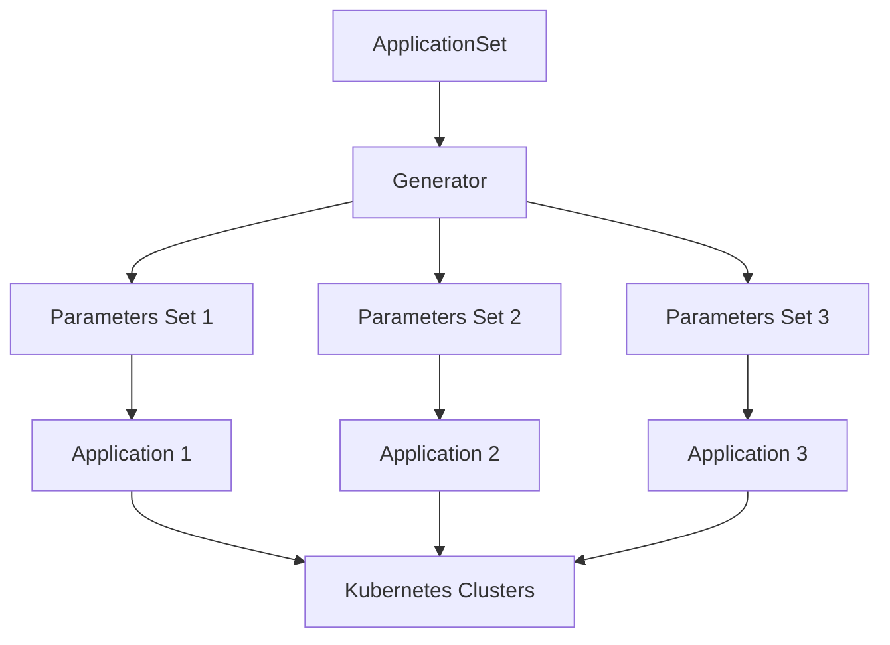

# How to Build ArgoCD Application Sets Generators

Author: [nawazdhandala](https://www.github.com/nawazdhandala)

Tags: ArgoCD, GitOps, Kubernetes, ApplicationSets, DevOps

Description: Master ArgoCD ApplicationSets with Git, List, Cluster, and Matrix generators for managing applications at scale across multiple clusters and environments.

---

Managing dozens or hundreds of applications across multiple Kubernetes clusters gets messy fast. You end up copy-pasting Application manifests, tweaking a few values, and hoping you did not miss anything. ArgoCD ApplicationSets solve this by letting you define a template once and generate Applications dynamically based on various data sources called generators.

## What Are ApplicationSet Generators?

Generators are the data sources that drive ApplicationSet templating. Each generator produces a list of parameters that get substituted into your Application template. Think of it like a for-loop that creates Applications.



ArgoCD ships with several built-in generators, and you can combine them for complex scenarios.

## List Generator

The simplest generator. You explicitly define the parameter sets. Good for small, static lists of environments or clusters.

```yaml
# list-generator.yaml
# Deploys the same app to three environments with different configs
apiVersion: argoproj.io/v1alpha1
kind: ApplicationSet
metadata:
  name: myapp-environments
  namespace: argocd
spec:
  generators:
    # List generator with explicit parameter sets
    - list:
        elements:
          # Each element becomes one Application
          - env: dev
            replicas: "1"
            domain: dev.example.com
          - env: staging
            replicas: "2"
            domain: staging.example.com
          - env: prod
            replicas: "5"
            domain: example.com
  template:
    metadata:
      # Template variables use double curly braces
      name: 'myapp-{{env}}'
    spec:
      project: default
      source:
        repoURL: https://github.com/myorg/myapp.git
        targetRevision: HEAD
        path: 'k8s/overlays/{{env}}'
        # Pass generator values to Helm or Kustomize
        helm:
          parameters:
            - name: replicas
              value: '{{replicas}}'
            - name: ingress.host
              value: '{{domain}}'
      destination:
        server: https://kubernetes.default.svc
        namespace: '{{env}}'
      syncPolicy:
        automated:
          prune: true
          selfHeal: true
        syncOptions:
          - CreateNamespace=true
```

This creates three Applications: `myapp-dev`, `myapp-staging`, and `myapp-prod`. Each gets different replica counts and domains.

## Git Generator

The Git generator discovers Applications from your repository structure. Two modes exist: directory and file.

### Directory Generator

Scans for directories matching a pattern. Each directory becomes an Application.

```yaml
# git-directory-generator.yaml
# Auto-discovers services from repo directory structure
apiVersion: argoproj.io/v1alpha1
kind: ApplicationSet
metadata:
  name: microservices
  namespace: argocd
spec:
  generators:
    - git:
        repoURL: https://github.com/myorg/services.git
        revision: HEAD
        # Scan for directories under services/
        directories:
          - path: 'services/*'
          # Exclude specific directories
          - path: 'services/deprecated-*'
            exclude: true
  template:
    metadata:
      # path.basename gives just the directory name
      name: '{{path.basename}}'
    spec:
      project: default
      source:
        repoURL: https://github.com/myorg/services.git
        targetRevision: HEAD
        # Use the discovered path
        path: '{{path}}'
      destination:
        server: https://kubernetes.default.svc
        namespace: '{{path.basename}}'
      syncPolicy:
        automated:
          prune: true
          selfHeal: true
```

Repository structure:

```
services/
├── user-api/
│   ├── deployment.yaml
│   └── service.yaml
├── payment-api/
│   ├── deployment.yaml
│   └── service.yaml
└── notification-api/
    ├── deployment.yaml
    └── service.yaml
```

This generates three Applications automatically. Add a new service directory, and ArgoCD picks it up.

### File Generator

Reads parameters from JSON or YAML files in your repo. Great when you need more control over per-application settings.

```yaml
# git-file-generator.yaml
# Reads app configs from JSON files in the repo
apiVersion: argoproj.io/v1alpha1
kind: ApplicationSet
metadata:
  name: team-apps
  namespace: argocd
spec:
  generators:
    - git:
        repoURL: https://github.com/myorg/app-configs.git
        revision: HEAD
        files:
          # Glob pattern for config files
          - path: 'apps/**/config.json'
  template:
    metadata:
      name: '{{name}}'
    spec:
      project: '{{team}}'
      source:
        repoURL: '{{repo}}'
        targetRevision: '{{branch}}'
        path: '{{path}}'
      destination:
        server: '{{cluster}}'
        namespace: '{{namespace}}'
```

Example config file at `apps/frontend/config.json`:

```json
{
  "name": "frontend-app",
  "team": "platform",
  "repo": "https://github.com/myorg/frontend.git",
  "branch": "main",
  "path": "k8s/production",
  "cluster": "https://kubernetes.default.svc",
  "namespace": "frontend"
}
```

## Cluster Generator

Iterates over clusters registered in ArgoCD. Deploy the same stack everywhere.

```yaml
# cluster-generator.yaml
# Deploys monitoring to all production clusters
apiVersion: argoproj.io/v1alpha1
kind: ApplicationSet
metadata:
  name: cluster-monitoring
  namespace: argocd
spec:
  generators:
    - clusters:
        # Filter clusters by labels
        selector:
          matchLabels:
            env: production
        # Or match all clusters with empty selector
        # selector: {}
  template:
    metadata:
      # Built-in cluster variables: name, server, metadata.labels.*
      name: 'monitoring-{{name}}'
    spec:
      project: infrastructure
      source:
        repoURL: https://github.com/myorg/monitoring.git
        targetRevision: HEAD
        path: base
        helm:
          parameters:
            # Use cluster name in metrics labels
            - name: cluster
              value: '{{name}}'
      destination:
        # Server URL from cluster secret
        server: '{{server}}'
        namespace: monitoring
      syncPolicy:
        automated:
          prune: true
          selfHeal: true
        syncOptions:
          - CreateNamespace=true
```

To use this, register clusters with labels:

```bash
# Add cluster with labels
argocd cluster add prod-us-east --name prod-us-east \
  --label env=production \
  --label region=us-east

argocd cluster add prod-eu-west --name prod-eu-west \
  --label env=production \
  --label region=eu-west
```

## Matrix Generator

Combines two generators to create a cartesian product. Deploy multiple apps to multiple clusters in one ApplicationSet.

```yaml
# matrix-generator.yaml
# Deploys multiple apps to multiple clusters (apps x clusters)
apiVersion: argoproj.io/v1alpha1
kind: ApplicationSet
metadata:
  name: multi-cluster-apps
  namespace: argocd
spec:
  generators:
    - matrix:
        generators:
          # First generator: list of applications
          - list:
              elements:
                - app: nginx
                  path: charts/nginx
                - app: redis
                  path: charts/redis
                - app: postgres
                  path: charts/postgres
          # Second generator: all production clusters
          - clusters:
              selector:
                matchLabels:
                  env: production
  template:
    metadata:
      # Combines variables from both generators
      name: '{{app}}-{{name}}'
    spec:
      project: default
      source:
        repoURL: https://github.com/myorg/helm-charts.git
        targetRevision: HEAD
        path: '{{path}}'
        helm:
          values: |
            cluster: {{name}}
            region: {{metadata.labels.region}}
      destination:
        server: '{{server}}'
        namespace: '{{app}}'
      syncPolicy:
        automated:
          prune: true
```

With 3 apps and 2 clusters, this creates 6 Applications: `nginx-prod-us-east`, `nginx-prod-eu-west`, `redis-prod-us-east`, and so on.

## Merge Generator

Combines parameters from multiple generators by merging on a key. Useful when base config comes from one source and overrides from another.

```yaml
# merge-generator.yaml
# Base settings from Git, overrides from a list
apiVersion: argoproj.io/v1alpha1
kind: ApplicationSet
metadata:
  name: apps-with-overrides
  namespace: argocd
spec:
  generators:
    - merge:
        # Merge key - must exist in all generators
        mergeKeys:
          - name
        generators:
          # Base config from Git files
          - git:
              repoURL: https://github.com/myorg/apps.git
              revision: HEAD
              files:
                - path: 'apps/*/config.json'
          # Override specific apps with custom values
          - list:
              elements:
                - name: frontend
                  replicas: "10"
                  resources: high
                - name: api
                  replicas: "20"
                  resources: high
  template:
    metadata:
      name: '{{name}}'
    spec:
      project: default
      source:
        repoURL: '{{repo}}'
        path: '{{path}}'
        helm:
          parameters:
            - name: replicas
              value: '{{replicas}}'
            - name: resourceProfile
              value: '{{resources}}'
      destination:
        server: https://kubernetes.default.svc
        namespace: '{{namespace}}'
```

## Progressive Sync Strategy

Control rollout order with progressive sync. Roll out to staging first, then production.

```yaml
# progressive-sync.yaml
# Deploys to dev first, waits, then staging, then prod
apiVersion: argoproj.io/v1alpha1
kind: ApplicationSet
metadata:
  name: progressive-rollout
  namespace: argocd
spec:
  generators:
    - list:
        elements:
          - env: dev
            order: "1"
          - env: staging
            order: "2"
          - env: prod
            order: "3"
  strategy:
    type: RollingSync
    rollingSync:
      steps:
        # Deploy to dev first
        - matchExpressions:
            - key: env
              operator: In
              values:
                - dev
        # Then staging after dev is healthy
        - matchExpressions:
            - key: env
              operator: In
              values:
                - staging
        # Finally production
        - matchExpressions:
            - key: env
              operator: In
              values:
                - prod
  template:
    metadata:
      name: 'myapp-{{env}}'
      labels:
        env: '{{env}}'
    spec:
      project: default
      source:
        repoURL: https://github.com/myorg/myapp.git
        path: 'k8s/{{env}}'
      destination:
        server: https://kubernetes.default.svc
        namespace: '{{env}}'
      syncPolicy:
        automated:
          prune: true
```

## Practical Tips

**Start simple.** Begin with List generator for a few environments. Move to Git or Cluster generators as you scale.

**Use goTemplate for complex logic.** Enable Go templating for conditionals and loops:

```yaml
spec:
  goTemplate: true
  template:
    metadata:
      name: '{{ .name }}'
      annotations:
        {{- if eq .env "prod" }}
        pagerduty: enabled
        {{- end }}
```

**Set preserveResourcesOnDeletion.** Prevent accidental deletion of resources when removing an element from a generator:

```yaml
spec:
  syncPolicy:
    preserveResourcesOnDeletion: true
```

**Label your Applications.** Makes filtering and management easier:

```yaml
template:
  metadata:
    labels:
      team: '{{team}}'
      env: '{{env}}'
```

---

ApplicationSet generators turn repetitive Application management into scalable automation. Whether you have three environments or thirty clusters, generators keep your config DRY and your deployments consistent. Start with the generator that matches your use case and combine them as your infrastructure grows.
