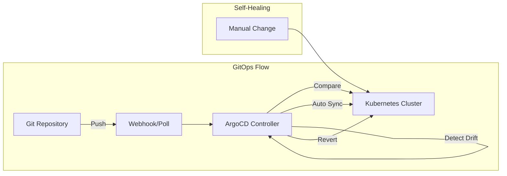
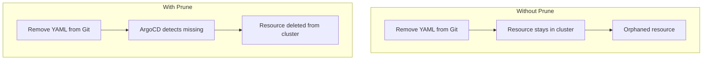
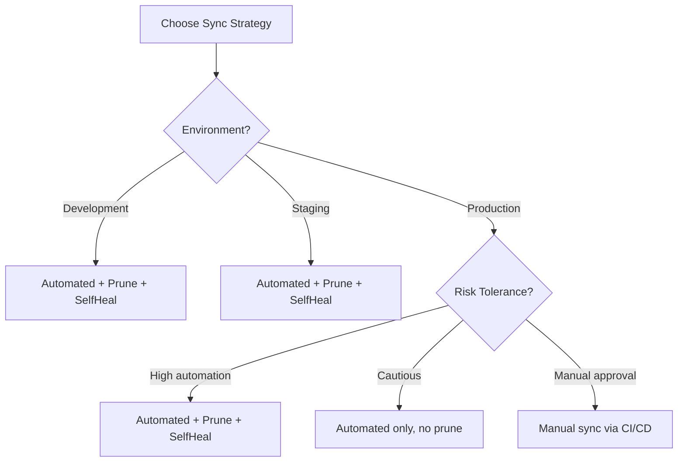

# How to Build ArgoCD Automated Sync Policy

Author: [nawazdhandala](https://github.com/nawazdhandala)

Tags: ArgoCD, GitOps, Kubernetes, Automation

Description: Learn how to configure ArgoCD automated sync policies to enable self-healing, auto-pruning, and continuous deployment for your Kubernetes applications.

---

ArgoCD automated sync policies let your cluster heal itself. Instead of manually running `argocd app sync`, the controller watches Git and applies changes automatically. This guide covers every sync policy option, when to use each one, and how to avoid common pitfalls.

## What Is Automated Sync?



Without automated sync, ArgoCD detects drift but waits for you to click "Sync." With automated sync enabled, ArgoCD applies changes within seconds of detecting them. This is the foundation of true GitOps.

## Enabling Automated Sync

### Basic Configuration

The simplest automated sync policy looks like this. Add the `syncPolicy.automated` block to your Application spec.

```yaml
apiVersion: argoproj.io/v1alpha1
kind: Application
metadata:
  name: myapp
  namespace: argocd
spec:
  project: default
  source:
    repoURL: https://github.com/myorg/myapp.git
    targetRevision: HEAD
    path: k8s/production
  destination:
    server: https://kubernetes.default.svc
    namespace: production
  syncPolicy:
    automated: {}
```

With just `automated: {}`, ArgoCD will sync when Git changes. But this minimal config has limitations. It will not delete resources removed from Git, and it will not fix manual changes to the cluster.

### Full Automated Sync with Self-Healing

This is the configuration most production teams want. Enable both pruning and self-healing.

```yaml
apiVersion: argoproj.io/v1alpha1
kind: Application
metadata:
  name: myapp
  namespace: argocd
spec:
  project: default
  source:
    repoURL: https://github.com/myorg/myapp.git
    targetRevision: HEAD
    path: k8s/production
  destination:
    server: https://kubernetes.default.svc
    namespace: production
  syncPolicy:
    automated:
      prune: true
      selfHeal: true
      allowEmpty: false
    syncOptions:
      - CreateNamespace=true
      - PruneLast=true
      - Validate=true
```

## Understanding Each Sync Policy Option

### prune

When `prune: true`, ArgoCD deletes resources that exist in the cluster but are no longer defined in Git. This keeps your cluster clean and ensures Git remains the single source of truth.



Be careful with prune. If you accidentally delete a folder from Git, ArgoCD will delete those resources from your cluster. Always use branch protection and code review for your GitOps repos.

### selfHeal

When `selfHeal: true`, ArgoCD reverts any manual changes made directly to the cluster. If someone runs `kubectl edit` or `kubectl scale`, ArgoCD detects the drift and restores the Git-defined state.

This example shows what happens when self-healing is enabled.

```bash
# Someone manually scales the deployment
kubectl scale deployment myapp --replicas=10 -n production

# Within 5 seconds, ArgoCD detects drift and reverts
# Deployment replicas return to the value defined in Git
```

Self-healing runs on a 5-second reconciliation loop by default. You can adjust this in ArgoCD settings.

### allowEmpty

When `allowEmpty: false` (the default), ArgoCD refuses to sync if the source path contains zero resources. This prevents accidental deletion of all resources if your Git repo is misconfigured or the path is wrong.

Set `allowEmpty: true` only if you intentionally want to delete everything in the destination namespace.

```yaml
syncPolicy:
  automated:
    prune: true
    selfHeal: true
    allowEmpty: false  # Safety net - prevents empty syncs
```

## Sync Options Reference

Sync options modify how ArgoCD performs the sync operation. Add them to the `syncOptions` array.

### CreateNamespace

Creates the destination namespace if it does not exist.

```yaml
syncOptions:
  - CreateNamespace=true
```

### PruneLast

Deletes resources only after all other sync operations complete successfully. This prevents race conditions where a new resource depends on one being deleted.

```yaml
syncOptions:
  - PruneLast=true
```

### Validate

Runs `kubectl --dry-run=server` validation before applying. Catches schema errors early.

```yaml
syncOptions:
  - Validate=true
```

### ServerSideApply

Uses server-side apply instead of client-side. Better handles conflicts and large resources.

```yaml
syncOptions:
  - ServerSideApply=true
```

### ApplyOutOfSyncOnly

Only applies resources that are out of sync, rather than re-applying everything. Reduces API server load for large applications.

```yaml
syncOptions:
  - ApplyOutOfSyncOnly=true
```

### PrunePropagationPolicy

Controls how Kubernetes deletes resources. Options are `foreground`, `background`, or `orphan`.

```yaml
syncOptions:
  - PrunePropagationPolicy=foreground
```

### RespectIgnoreDifferences

When using `ignoreDifferences`, this option ensures those fields are also ignored during sync operations.

```yaml
syncOptions:
  - RespectIgnoreDifferences=true
```

## Complete Production Example

This configuration combines all best practices for a production deployment.

```yaml
apiVersion: argoproj.io/v1alpha1
kind: Application
metadata:
  name: production-api
  namespace: argocd
  finalizers:
    - resources-finalizer.argocd.argoproj.io
spec:
  project: production
  source:
    repoURL: https://github.com/myorg/api-config.git
    targetRevision: main
    path: overlays/production
  destination:
    server: https://kubernetes.default.svc
    namespace: production
  syncPolicy:
    automated:
      prune: true
      selfHeal: true
      allowEmpty: false
    syncOptions:
      - CreateNamespace=true
      - PruneLast=true
      - Validate=true
      - ServerSideApply=true
      - ApplyOutOfSyncOnly=true
    retry:
      limit: 5
      backoff:
        duration: 5s
        factor: 2
        maxDuration: 3m
  ignoreDifferences:
    - group: apps
      kind: Deployment
      jsonPointers:
        - /spec/replicas
```

## Retry Configuration

Network glitches happen. Configure automatic retries to handle transient failures.

```yaml
syncPolicy:
  automated:
    prune: true
    selfHeal: true
  retry:
    limit: 5
    backoff:
      duration: 5s
      factor: 2
      maxDuration: 3m
```

This configuration retries up to 5 times with exponential backoff: 5s, 10s, 20s, 40s, 80s (capped at 3m).

## Ignoring Differences

Some fields change at runtime and should not trigger syncs. Use `ignoreDifferences` to exclude them.

This example ignores replica counts managed by HPA and status fields.

```yaml
spec:
  ignoreDifferences:
    - group: apps
      kind: Deployment
      jsonPointers:
        - /spec/replicas
    - group: autoscaling
      kind: HorizontalPodAutoscaler
      jsonPointers:
        - /status
    - kind: Service
      jsonPointers:
        - /spec/clusterIP
        - /spec/clusterIPs
```

## When to Use Manual vs Automated Sync



### Use Automated Sync When

- Development and staging environments need fast iteration
- You have strong Git branch protection and code review
- Your team follows GitOps discipline
- You want self-healing to prevent configuration drift

### Consider Manual Sync When

- Production changes need explicit approval workflows
- You are migrating from manual deployments and building trust
- Regulatory requirements mandate human approval for changes

## Progressive Rollout Strategy

Start conservative and enable features incrementally.

Phase 1: Automated sync only, no prune or self-heal.

```yaml
syncPolicy:
  automated: {}
```

Phase 2: Add self-healing after team adapts to GitOps.

```yaml
syncPolicy:
  automated:
    selfHeal: true
```

Phase 3: Enable pruning with PruneLast for safety.

```yaml
syncPolicy:
  automated:
    selfHeal: true
    prune: true
  syncOptions:
    - PruneLast=true
```

## Sync Windows

Restrict when automated syncs can occur. Useful for production environments where you want changes only during business hours.

```yaml
apiVersion: argoproj.io/v1alpha1
kind: AppProject
metadata:
  name: production
  namespace: argocd
spec:
  syncWindows:
    - kind: allow
      schedule: '0 6 * * 1-5'  # 6 AM UTC, Monday-Friday
      duration: 12h
      applications:
        - '*'
    - kind: deny
      schedule: '0 18 * * *'   # Block after 6 PM UTC
      duration: 12h
      applications:
        - '*'
```

## Monitoring Sync Status

Track sync operations with ArgoCD metrics. These Prometheus queries help monitor automated sync health.

Application sync status distribution.

```promql
sum by (sync_status) (argocd_app_info)
```

Sync operation duration.

```promql
histogram_quantile(0.95, sum(rate(argocd_app_sync_total[5m])) by (le))
```

Failed sync operations.

```promql
sum(increase(argocd_app_sync_total{phase="Failed"}[1h])) by (name)
```

## Troubleshooting Automated Sync

### Sync Not Triggering

Check if the application is configured for automated sync.

```bash
argocd app get myapp -o yaml | grep -A5 syncPolicy
```

Verify ArgoCD can reach the Git repository.

```bash
argocd repo list
argocd repo get https://github.com/myorg/myapp.git
```

### Sync Stuck in Progressing

Check for resource health issues.

```bash
argocd app get myapp
argocd app resources myapp
```

Look for failing health checks or pending pods.

```bash
kubectl get pods -n production
kubectl describe pod <pod-name> -n production
```

### Prune Not Working

Ensure prune is enabled and check for prune protection.

```yaml
# Resources with this annotation will not be pruned
metadata:
  annotations:
    argocd.argoproj.io/sync-options: Prune=false
```

## CLI Commands for Sync Management

Enable automated sync on existing application.

```bash
argocd app set myapp --sync-policy automated
```

Enable prune and self-heal.

```bash
argocd app set myapp --auto-prune --self-heal
```

Disable automated sync.

```bash
argocd app set myapp --sync-policy none
```

Check sync status.

```bash
argocd app wait myapp --sync
```

---

Automated sync policies transform ArgoCD from a deployment tool into a self-healing platform. Start with automated sync only, add self-healing once your team commits to GitOps discipline, and enable pruning when you trust your branch protection. The goal is a cluster that always matches Git, no manual intervention required.
