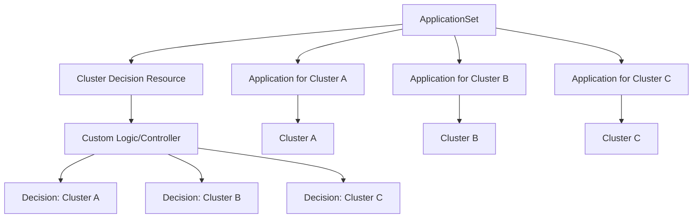
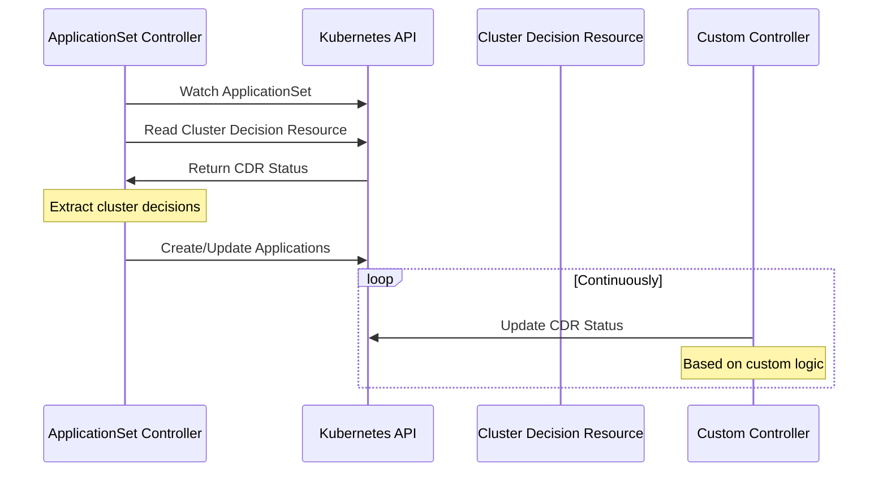
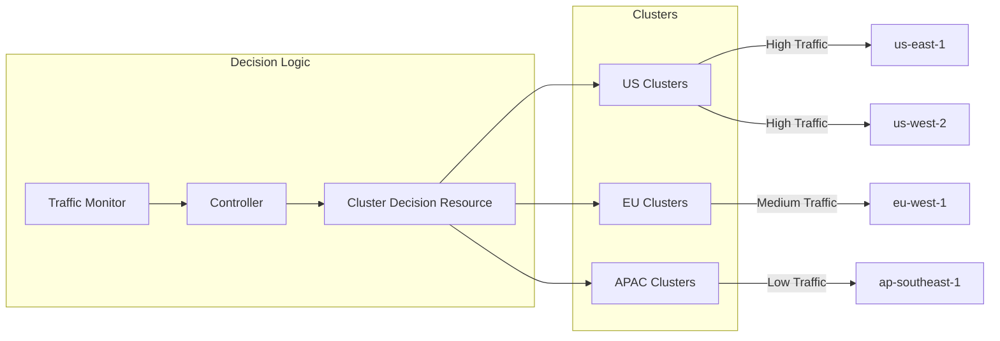

# How to Create ArgoCD Cluster Decision Resource

Author: [nawazdhandala](https://github.com/nawazdhandala)

Tags: ArgoCD, GitOps, Kubernetes, Multi-Cluster

Description: Learn how to use ArgoCD Cluster Decision Resource to dynamically select target clusters for your applications using external decision makers.

---

ArgoCD Cluster Decision Resource allows you to dynamically determine which clusters your applications should deploy to. Instead of hardcoding cluster destinations, you can delegate cluster selection to an external resource that makes decisions based on your custom logic.

## What Is a Cluster Decision Resource?

A Cluster Decision Resource is a custom Kubernetes resource that ArgoCD's ApplicationSet controller queries to determine target clusters. This enables dynamic cluster selection based on criteria like cluster health, capacity, geographic location, or any custom business logic.



## Why Use Cluster Decision Resources?

Traditional ApplicationSet generators like `clusters` or `list` require you to explicitly define target clusters. Cluster Decision Resources enable:

- **Dynamic cluster selection** based on real-time conditions
- **Integration with external systems** like service meshes or cluster registries
- **Custom placement logic** based on your organization's requirements
- **Separation of concerns** between application definitions and cluster selection

## How It Works

The Cluster Decision Resource generator works by reading the status of a Kubernetes resource that you define. This resource contains a list of decisions, where each decision specifies a cluster.



## Creating a Cluster Decision Resource

### Step 1: Define the Custom Resource Definition (CRD)

First, create a CRD that will hold your cluster decisions. This CRD must have a `status` field with a list containing cluster information.

```yaml
apiVersion: apiextensions.k8s.io/v1
kind: CustomResourceDefinition
metadata:
  name: clusterdecisions.example.com
spec:
  group: example.com
  versions:
    - name: v1alpha1
      served: true
      storage: true
      schema:
        openAPIV3Schema:
          type: object
          properties:
            spec:
              type: object
              properties:
                selector:
                  type: object
                  additionalProperties:
                    type: string
            status:
              type: object
              properties:
                decisions:
                  type: array
                  items:
                    type: object
                    properties:
                      clusterName:
                        type: string
                      reason:
                        type: string
      subresources:
        status: {}
  scope: Namespaced
  names:
    plural: clusterdecisions
    singular: clusterdecision
    kind: ClusterDecision
    shortNames:
      - cd
```

Apply the CRD to your cluster.

```bash
kubectl apply -f clusterdecision-crd.yaml
```

### Step 2: Create a Cluster Decision Resource Instance

Create an instance of your Cluster Decision Resource. The status field will be populated by your controller or manually for testing.

```yaml
apiVersion: example.com/v1alpha1
kind: ClusterDecision
metadata:
  name: production-clusters
  namespace: argocd
spec:
  selector:
    env: production
    tier: critical
status:
  decisions:
    - clusterName: prod-us-east
      reason: "Primary production cluster"
    - clusterName: prod-us-west
      reason: "Secondary production cluster"
    - clusterName: prod-eu-west
      reason: "EU region production cluster"
```

Apply this resource to your cluster.

```bash
kubectl apply -f production-clusters.yaml
```

### Step 3: Register Clusters in ArgoCD

Ensure your target clusters are registered in ArgoCD with matching names. Create cluster secrets for each cluster.

```yaml
apiVersion: v1
kind: Secret
metadata:
  name: prod-us-east-cluster
  namespace: argocd
  labels:
    argocd.argoproj.io/secret-type: cluster
stringData:
  name: prod-us-east
  server: https://prod-us-east.example.com
  config: |
    {
      "bearerToken": "<service-account-token>",
      "tlsClientConfig": {
        "insecure": false,
        "caData": "<base64-encoded-ca-cert>"
      }
    }
---
apiVersion: v1
kind: Secret
metadata:
  name: prod-us-west-cluster
  namespace: argocd
  labels:
    argocd.argoproj.io/secret-type: cluster
stringData:
  name: prod-us-west
  server: https://prod-us-west.example.com
  config: |
    {
      "bearerToken": "<service-account-token>",
      "tlsClientConfig": {
        "insecure": false,
        "caData": "<base64-encoded-ca-cert>"
      }
    }
---
apiVersion: v1
kind: Secret
metadata:
  name: prod-eu-west-cluster
  namespace: argocd
  labels:
    argocd.argoproj.io/secret-type: cluster
stringData:
  name: prod-eu-west
  server: https://prod-eu-west.example.com
  config: |
    {
      "bearerToken": "<service-account-token>",
      "tlsClientConfig": {
        "insecure": false,
        "caData": "<base64-encoded-ca-cert>"
      }
    }
```

### Step 4: Configure ArgoCD to Use the Cluster Decision Resource

Configure ArgoCD to recognize your Cluster Decision Resource by updating the `argocd-cm` ConfigMap.

```yaml
apiVersion: v1
kind: ConfigMap
metadata:
  name: argocd-cm
  namespace: argocd
data:
  applicationsetcontroller.clusterDecisionResource: |
    - apiVersion: example.com/v1alpha1
      kind: ClusterDecision
      statusListKey: decisions
      matchKey: clusterName
```

After updating, restart the ApplicationSet controller.

```bash
kubectl rollout restart deployment argocd-applicationset-controller -n argocd
```

### Step 5: Create an ApplicationSet Using the Cluster Decision Resource

Now create an ApplicationSet that uses the `clusterDecisionResource` generator.

```yaml
apiVersion: argoproj.io/v1alpha1
kind: ApplicationSet
metadata:
  name: myapp-multi-cluster
  namespace: argocd
spec:
  generators:
    - clusterDecisionResource:
        configMapRef: argocd-cm
        name: production-clusters
        requeueAfterSeconds: 180
  template:
    metadata:
      name: 'myapp-{{name}}'
    spec:
      project: default
      source:
        repoURL: https://github.com/myorg/myapp.git
        targetRevision: HEAD
        path: k8s/overlays/production
      destination:
        server: '{{server}}'
        namespace: myapp
      syncPolicy:
        automated:
          prune: true
          selfHeal: true
        syncOptions:
          - CreateNamespace=true
```

Apply the ApplicationSet.

```bash
kubectl apply -f applicationset.yaml
```

## Building a Custom Controller

For production use, you will want a controller that automatically updates the Cluster Decision Resource based on your logic.

### Example Controller Logic

Here is a simple Go controller that updates cluster decisions based on cluster health.

```go
package main

import (
    "context"
    "time"

    metav1 "k8s.io/apimachinery/pkg/apis/meta/v1"
    "k8s.io/apimachinery/pkg/apis/meta/v1/unstructured"
    "k8s.io/apimachinery/pkg/runtime/schema"
    "k8s.io/client-go/dynamic"
    "k8s.io/client-go/rest"
)

type ClusterDecision struct {
    ClusterName string `json:"clusterName"`
    Reason      string `json:"reason"`
}

func main() {
    config, _ := rest.InClusterConfig()
    client, _ := dynamic.NewForConfig(config)

    gvr := schema.GroupVersionResource{
        Group:    "example.com",
        Version:  "v1alpha1",
        Resource: "clusterdecisions",
    }

    for {
        // Get healthy clusters from your monitoring system
        healthyClusters := getHealthyClusters()

        // Build decisions list
        decisions := make([]interface{}, 0)
        for _, cluster := range healthyClusters {
            decisions = append(decisions, map[string]interface{}{
                "clusterName": cluster.Name,
                "reason":      cluster.HealthReason,
            })
        }

        // Update the ClusterDecision resource status
        cd, _ := client.Resource(gvr).Namespace("argocd").Get(
            context.Background(),
            "production-clusters",
            metav1.GetOptions{},
        )

        unstructured.SetNestedSlice(cd.Object, decisions, "status", "decisions")

        client.Resource(gvr).Namespace("argocd").UpdateStatus(
            context.Background(),
            cd,
            metav1.UpdateOptions{},
        )

        time.Sleep(30 * time.Second)
    }
}

func getHealthyClusters() []struct {
    Name         string
    HealthReason string
} {
    // Implement your cluster health check logic here
    return nil
}
```

## Advanced Use Cases

### Combining with Other Generators

You can combine the Cluster Decision Resource generator with other generators using matrix or merge strategies.

```yaml
apiVersion: argoproj.io/v1alpha1
kind: ApplicationSet
metadata:
  name: myapp-matrix
  namespace: argocd
spec:
  generators:
    - matrix:
        generators:
          - clusterDecisionResource:
              configMapRef: argocd-cm
              name: production-clusters
          - list:
              elements:
                - component: frontend
                  path: k8s/frontend
                - component: backend
                  path: k8s/backend
                - component: worker
                  path: k8s/worker
  template:
    metadata:
      name: '{{component}}-{{name}}'
    spec:
      project: default
      source:
        repoURL: https://github.com/myorg/myapp.git
        targetRevision: HEAD
        path: '{{path}}'
      destination:
        server: '{{server}}'
        namespace: myapp
```

### Geographic Load Balancing

Use Cluster Decision Resources to implement geographic load balancing by having your controller select clusters based on user traffic patterns.



### Disaster Recovery Failover

Implement automatic failover by having your controller remove unhealthy clusters from the decision list.

```yaml
apiVersion: example.com/v1alpha1
kind: ClusterDecision
metadata:
  name: dr-clusters
  namespace: argocd
spec:
  selector:
    tier: critical
status:
  decisions:
    # Primary cluster is healthy
    - clusterName: primary-cluster
      reason: "Healthy - Primary"
    # Secondary on standby (removed during normal operation)
    # Uncomment when primary fails:
    # - clusterName: secondary-cluster
    #   reason: "Failover - Primary unhealthy"
```

## Troubleshooting

### ApplicationSet Not Generating Applications

Check that the Cluster Decision Resource is configured correctly in `argocd-cm`.

```bash
kubectl get configmap argocd-cm -n argocd -o yaml | grep -A 10 clusterDecisionResource
```

### Verify the Cluster Decision Resource Status

Ensure your Cluster Decision Resource has the correct status structure.

```bash
kubectl get clusterdecision production-clusters -n argocd -o yaml
```

### Check ApplicationSet Controller Logs

Review the ApplicationSet controller logs for errors.

```bash
kubectl logs -n argocd -l app.kubernetes.io/name=argocd-applicationset-controller
```

### Ensure Cluster Names Match

The `clusterName` in your Cluster Decision Resource must exactly match the `name` field in your ArgoCD cluster secrets.

```bash
# List registered clusters
argocd cluster list

# Check cluster secret names
kubectl get secrets -n argocd -l argocd.argoproj.io/secret-type=cluster
```

## Best Practices

### 1. Use Meaningful Decision Reasons

Always include a reason field in your decisions for debugging and auditing.

```yaml
status:
  decisions:
    - clusterName: prod-us-east
      reason: "Selected: highest capacity, lowest latency"
```

### 2. Implement Requeue Intervals

Set appropriate requeue intervals based on how frequently your cluster decisions change.

```yaml
generators:
  - clusterDecisionResource:
      configMapRef: argocd-cm
      name: production-clusters
      requeueAfterSeconds: 60  # Check every minute
```

### 3. Add Labels for Filtering

Use labels on your Cluster Decision Resources for easy filtering and organization.

```yaml
metadata:
  name: production-clusters
  labels:
    environment: production
    team: platform
    tier: critical
```

### 4. Monitor Decision Changes

Set up alerts for when cluster decisions change unexpectedly.

```yaml
apiVersion: monitoring.coreos.com/v1
kind: PrometheusRule
metadata:
  name: cluster-decision-alerts
spec:
  groups:
    - name: cluster-decisions
      rules:
        - alert: ClusterDecisionChanged
          expr: changes(argocd_cluster_decision_count[5m]) > 0
          labels:
            severity: info
          annotations:
            summary: "Cluster decisions have changed"
```

---

Cluster Decision Resources give you fine-grained control over multi-cluster deployments in ArgoCD. Start with a simple static decision resource, then build a custom controller as your needs grow. This pattern is especially powerful for organizations managing many clusters across different regions or environments.
