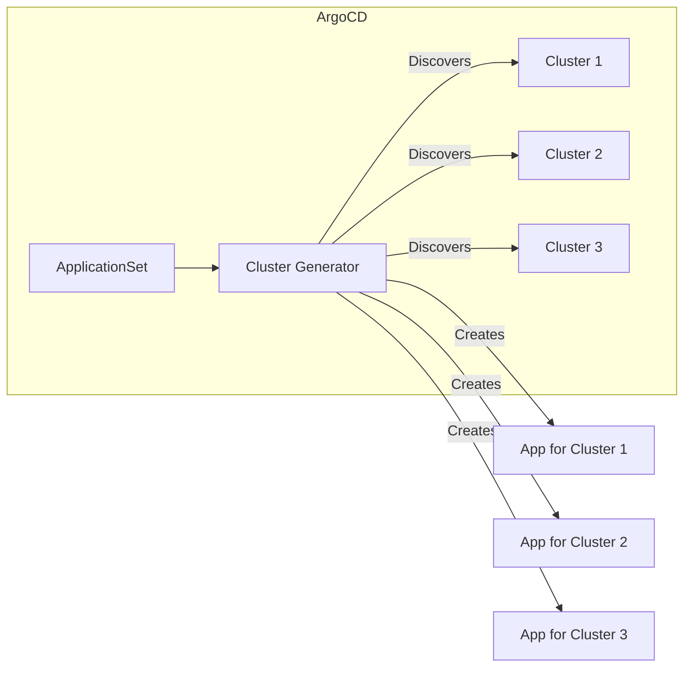
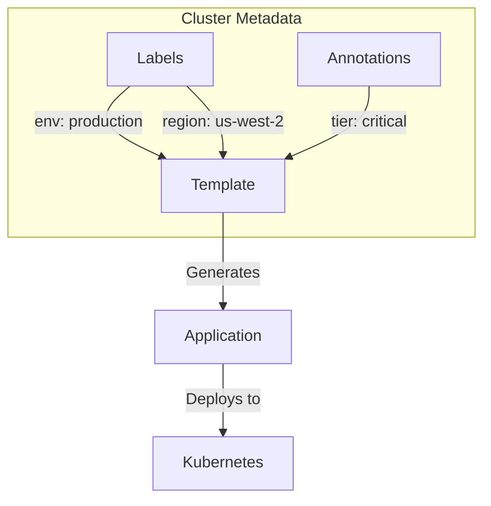

# How to Build ArgoCD Cluster Generator

Author: [nawazdhandala](https://github.com/nawazdhandala)

Tags: ArgoCD, GitOps, Kubernetes, Multi-Cluster

Description: Learn how to build and configure ArgoCD Cluster Generators to dynamically deploy applications across multiple Kubernetes clusters using ApplicationSets.

---

Managing deployments across multiple Kubernetes clusters manually is tedious and error-prone. ArgoCD's Cluster Generator solves this by automatically discovering clusters and generating Applications for each one.

## What Is a Cluster Generator?

The Cluster Generator is part of ArgoCD's ApplicationSet controller. It automatically creates ArgoCD Applications based on the clusters registered in ArgoCD.



When you add or remove clusters from ArgoCD, the Cluster Generator automatically creates or deletes the corresponding Applications.

## Prerequisites

Before building your Cluster Generator, ensure you have the following installed and configured.

```bash
# Install ArgoCD
kubectl create namespace argocd
kubectl apply -n argocd -f https://raw.githubusercontent.com/argoproj/argo-cd/stable/manifests/install.yaml

# Wait for ArgoCD to be ready
kubectl wait --for=condition=Ready pods --all -n argocd --timeout=300s

# Install ArgoCD CLI
brew install argocd  # macOS
# or
curl -sSL -o argocd https://github.com/argoproj/argo-cd/releases/latest/download/argocd-linux-amd64
chmod +x argocd && sudo mv argocd /usr/local/bin/
```

## Registering Clusters with ArgoCD

The Cluster Generator works with clusters registered in ArgoCD. Here is how to add clusters.

### Using the ArgoCD CLI

The simplest way to add a cluster is using the ArgoCD CLI with an existing kubeconfig context.

```bash
# List available contexts
kubectl config get-contexts

# Add cluster using context name
argocd cluster add production-context --name production

# Add with labels for filtering
argocd cluster add staging-context --name staging --label env=staging --label region=us-east-1
```

### Using Declarative Configuration

For GitOps workflows, define clusters as Kubernetes Secrets.

```yaml
apiVersion: v1
kind: Secret
metadata:
  name: production-cluster
  namespace: argocd
  labels:
    argocd.argoproj.io/secret-type: cluster
    env: production
    region: us-west-2
stringData:
  name: production
  server: https://production.k8s.example.com
  config: |
    {
      "bearerToken": "<service-account-token>",
      "tlsClientConfig": {
        "insecure": false,
        "caData": "<base64-encoded-ca-cert>"
      }
    }
```

Apply the cluster secret to register it with ArgoCD.

```bash
kubectl apply -f cluster-secret.yaml
```

## Building a Basic Cluster Generator

Here is a simple Cluster Generator that deploys an application to all registered clusters.

```yaml
apiVersion: argoproj.io/v1alpha1
kind: ApplicationSet
metadata:
  name: my-app-all-clusters
  namespace: argocd
spec:
  generators:
    - clusters: {}
  template:
    metadata:
      name: 'my-app-{{name}}'
    spec:
      project: default
      source:
        repoURL: https://github.com/myorg/my-app.git
        targetRevision: HEAD
        path: k8s/base
      destination:
        server: '{{server}}'
        namespace: my-app
      syncPolicy:
        automated:
          prune: true
          selfHeal: true
        syncOptions:
          - CreateNamespace=true
```

The `{{name}}` and `{{server}}` are template variables that get replaced with each cluster's name and API server URL.

## Using Label Selectors

Filter which clusters receive deployments using label selectors. This is useful for deploying to specific environments or regions.

### Match by Environment

Deploy only to production clusters.

```yaml
apiVersion: argoproj.io/v1alpha1
kind: ApplicationSet
metadata:
  name: my-app-production
  namespace: argocd
spec:
  generators:
    - clusters:
        selector:
          matchLabels:
            env: production
  template:
    metadata:
      name: 'my-app-{{name}}'
    spec:
      project: default
      source:
        repoURL: https://github.com/myorg/my-app.git
        targetRevision: main
        path: k8s/overlays/production
      destination:
        server: '{{server}}'
        namespace: my-app
      syncPolicy:
        automated:
          prune: true
          selfHeal: true
```

### Match by Multiple Labels

Use matchExpressions for complex filtering logic.

```yaml
apiVersion: argoproj.io/v1alpha1
kind: ApplicationSet
metadata:
  name: my-app-us-regions
  namespace: argocd
spec:
  generators:
    - clusters:
        selector:
          matchExpressions:
            - key: env
              operator: In
              values:
                - production
                - staging
            - key: region
              operator: In
              values:
                - us-east-1
                - us-west-2
  template:
    metadata:
      name: 'my-app-{{name}}'
    spec:
      project: default
      source:
        repoURL: https://github.com/myorg/my-app.git
        targetRevision: HEAD
        path: k8s/overlays/{{metadata.labels.env}}
      destination:
        server: '{{server}}'
        namespace: my-app
```

## Using Cluster Metadata in Templates

Access cluster labels and annotations in your templates for dynamic configuration.



### Accessing Labels

Use cluster labels to select environment-specific configurations.

```yaml
apiVersion: argoproj.io/v1alpha1
kind: ApplicationSet
metadata:
  name: my-app-dynamic-config
  namespace: argocd
spec:
  generators:
    - clusters:
        selector:
          matchLabels:
            app-enabled: "true"
  template:
    metadata:
      name: 'my-app-{{name}}'
      labels:
        environment: '{{metadata.labels.env}}'
        region: '{{metadata.labels.region}}'
    spec:
      project: default
      source:
        repoURL: https://github.com/myorg/my-app.git
        targetRevision: HEAD
        path: k8s/overlays/{{metadata.labels.env}}
        helm:
          parameters:
            - name: region
              value: '{{metadata.labels.region}}'
            - name: environment
              value: '{{metadata.labels.env}}'
      destination:
        server: '{{server}}'
        namespace: my-app-{{metadata.labels.env}}
```

### Accessing Annotations

Use annotations for additional configuration data.

```yaml
apiVersion: argoproj.io/v1alpha1
kind: ApplicationSet
metadata:
  name: my-app-with-annotations
  namespace: argocd
spec:
  generators:
    - clusters:
        selector:
          matchLabels:
            env: production
        values:
          clusterTier: '{{metadata.annotations.tier}}'
  template:
    metadata:
      name: 'my-app-{{name}}'
    spec:
      project: default
      source:
        repoURL: https://github.com/myorg/my-app.git
        targetRevision: HEAD
        path: k8s/base
        helm:
          parameters:
            - name: resources.tier
              value: '{{values.clusterTier}}'
      destination:
        server: '{{server}}'
        namespace: my-app
```

## Combining Generators

Combine the Cluster Generator with other generators for advanced use cases.

### Matrix Generator

Deploy multiple applications to multiple clusters using the Matrix generator.

```yaml
apiVersion: argoproj.io/v1alpha1
kind: ApplicationSet
metadata:
  name: multi-app-multi-cluster
  namespace: argocd
spec:
  generators:
    - matrix:
        generators:
          - clusters:
              selector:
                matchLabels:
                  env: production
          - list:
              elements:
                - app: frontend
                  path: apps/frontend
                - app: backend
                  path: apps/backend
                - app: worker
                  path: apps/worker
  template:
    metadata:
      name: '{{app}}-{{name}}'
    spec:
      project: default
      source:
        repoURL: https://github.com/myorg/platform.git
        targetRevision: HEAD
        path: '{{path}}'
      destination:
        server: '{{server}}'
        namespace: '{{app}}'
      syncPolicy:
        automated:
          prune: true
          selfHeal: true
```

This creates 9 Applications if you have 3 production clusters and 3 apps.

### Merge Generator

Override settings for specific clusters using the Merge generator.

```yaml
apiVersion: argoproj.io/v1alpha1
kind: ApplicationSet
metadata:
  name: my-app-with-overrides
  namespace: argocd
spec:
  generators:
    - merge:
        mergeKeys:
          - server
        generators:
          - clusters:
              selector:
                matchLabels:
                  env: production
              values:
                replicas: "3"
                resources: standard
          - list:
              elements:
                - server: https://high-traffic.k8s.example.com
                  values.replicas: "10"
                  values.resources: high
  template:
    metadata:
      name: 'my-app-{{name}}'
    spec:
      project: default
      source:
        repoURL: https://github.com/myorg/my-app.git
        targetRevision: HEAD
        path: k8s/base
        helm:
          parameters:
            - name: replicas
              value: '{{values.replicas}}'
            - name: resources.profile
              value: '{{values.resources}}'
      destination:
        server: '{{server}}'
        namespace: my-app
```

## Deploying Infrastructure Components

Use the Cluster Generator to deploy common infrastructure to all clusters.

```mermaid
flowchart TB
    AS[ApplicationSet] --> CG[Cluster Generator]

    CG --> C1[Cluster 1]
    CG --> C2[Cluster 2]
    CG --> C3[Cluster 3]

    subgraph Infrastructure Stack
        M[Metrics Server]
        P[Prometheus]
        G[Grafana]
        I[Ingress Controller]
        C[Cert Manager]
    end

    C1 --> Infrastructure Stack
    C2 --> Infrastructure Stack
    C3 --> Infrastructure Stack
```

Here is an example that deploys a monitoring stack to all clusters.

```yaml
apiVersion: argoproj.io/v1alpha1
kind: ApplicationSet
metadata:
  name: monitoring-stack
  namespace: argocd
spec:
  generators:
    - clusters: {}
  template:
    metadata:
      name: 'monitoring-{{name}}'
    spec:
      project: infrastructure
      source:
        repoURL: https://github.com/myorg/infrastructure.git
        targetRevision: HEAD
        path: monitoring
        helm:
          valueFiles:
            - values.yaml
            - values-{{metadata.labels.env}}.yaml
      destination:
        server: '{{server}}'
        namespace: monitoring
      syncPolicy:
        automated:
          prune: true
          selfHeal: true
        syncOptions:
          - CreateNamespace=true
          - ServerSideApply=true
```

## Handling the Local Cluster

ArgoCD always has access to the local cluster (the cluster where ArgoCD runs). Handle it explicitly in your generators.

### Exclude the Local Cluster

```yaml
apiVersion: argoproj.io/v1alpha1
kind: ApplicationSet
metadata:
  name: my-app-remote-only
  namespace: argocd
spec:
  generators:
    - clusters:
        selector:
          matchExpressions:
            - key: name
              operator: NotIn
              values:
                - in-cluster
  template:
    metadata:
      name: 'my-app-{{name}}'
    spec:
      project: default
      source:
        repoURL: https://github.com/myorg/my-app.git
        path: k8s/base
      destination:
        server: '{{server}}'
        namespace: my-app
```

### Include Only the Local Cluster

Deploy management tools only to the ArgoCD cluster.

```yaml
apiVersion: argoproj.io/v1alpha1
kind: ApplicationSet
metadata:
  name: management-tools
  namespace: argocd
spec:
  generators:
    - clusters:
        selector:
          matchLabels:
            name: in-cluster
  template:
    metadata:
      name: 'management-{{name}}'
    spec:
      project: infrastructure
      source:
        repoURL: https://github.com/myorg/management.git
        path: tools
      destination:
        server: '{{server}}'
        namespace: management
```

## Sync Policies and Options

Configure how Applications sync across clusters.

```yaml
apiVersion: argoproj.io/v1alpha1
kind: ApplicationSet
metadata:
  name: my-app-with-sync-options
  namespace: argocd
spec:
  generators:
    - clusters:
        selector:
          matchLabels:
            env: production
  template:
    metadata:
      name: 'my-app-{{name}}'
    spec:
      project: default
      source:
        repoURL: https://github.com/myorg/my-app.git
        path: k8s/production
      destination:
        server: '{{server}}'
        namespace: my-app
      syncPolicy:
        automated:
          prune: true
          selfHeal: true
          allowEmpty: false
        syncOptions:
          - CreateNamespace=true
          - PrunePropagationPolicy=foreground
          - PruneLast=true
          - ServerSideApply=true
          - RespectIgnoreDifferences=true
        retry:
          limit: 5
          backoff:
            duration: 5s
            factor: 2
            maxDuration: 3m
```

## Progressive Rollouts

Use ApplicationSet features to control rollout across clusters.

### Rolling Sync Strategy

Roll out changes progressively to minimize blast radius.

```yaml
apiVersion: argoproj.io/v1alpha1
kind: ApplicationSet
metadata:
  name: my-app-progressive
  namespace: argocd
spec:
  generators:
    - clusters:
        selector:
          matchLabels:
            env: production
  strategy:
    type: RollingSync
    rollingSync:
      steps:
        - matchExpressions:
            - key: region
              operator: In
              values:
                - us-west-2
        - matchExpressions:
            - key: region
              operator: In
              values:
                - us-east-1
        - matchExpressions:
            - key: region
              operator: In
              values:
                - eu-west-1
  template:
    metadata:
      name: 'my-app-{{name}}'
    spec:
      project: default
      source:
        repoURL: https://github.com/myorg/my-app.git
        path: k8s/production
      destination:
        server: '{{server}}'
        namespace: my-app
```

## Complete Multi-Cluster Platform Example

Here is a complete example that sets up a multi-cluster platform with proper organization.

```yaml
# App of Apps pattern for cluster generator
apiVersion: argoproj.io/v1alpha1
kind: ApplicationSet
metadata:
  name: platform-apps
  namespace: argocd
spec:
  generators:
    - matrix:
        generators:
          - clusters:
              selector:
                matchLabels:
                  platform-enabled: "true"
          - git:
              repoURL: https://github.com/myorg/platform.git
              revision: HEAD
              directories:
                - path: apps/*
  template:
    metadata:
      name: '{{path.basename}}-{{name}}'
      labels:
        app: '{{path.basename}}'
        cluster: '{{name}}'
        environment: '{{metadata.labels.env}}'
    spec:
      project: platform
      source:
        repoURL: https://github.com/myorg/platform.git
        targetRevision: HEAD
        path: '{{path}}'
        kustomize:
          commonLabels:
            cluster: '{{name}}'
      destination:
        server: '{{server}}'
        namespace: '{{path.basename}}'
      syncPolicy:
        automated:
          prune: true
          selfHeal: true
        syncOptions:
          - CreateNamespace=true
      ignoreDifferences:
        - group: apps
          kind: Deployment
          jsonPointers:
            - /spec/replicas
```

## Troubleshooting

### Check Registered Clusters

```bash
# List all clusters
argocd cluster list

# Get cluster details
argocd cluster get production

# Check cluster connectivity
kubectl --context=argocd exec -it deploy/argocd-server -n argocd -- \
  argocd cluster get production --grpc-web
```

### Debug ApplicationSet

```bash
# Check ApplicationSet status
kubectl get applicationset -n argocd

# Describe ApplicationSet for events
kubectl describe applicationset my-app-all-clusters -n argocd

# Check generated Applications
kubectl get applications -n argocd -l app.kubernetes.io/instance=my-app-all-clusters
```

### Common Issues

Clusters not being discovered usually means the cluster Secret is missing the required label.

```bash
# Verify cluster secret has correct label
kubectl get secrets -n argocd -l argocd.argoproj.io/secret-type=cluster
```

Template variables not resolving can be debugged by checking the ApplicationSet controller logs.

```bash
# Check ApplicationSet controller logs
kubectl logs -n argocd -l app.kubernetes.io/name=argocd-applicationset-controller
```

---

The ArgoCD Cluster Generator transforms multi-cluster management from a manual chore into an automated, GitOps-driven workflow. Start with basic cluster discovery, add label selectors for environment control, and combine with other generators for complex deployment patterns. Your clusters will stay in sync automatically.
