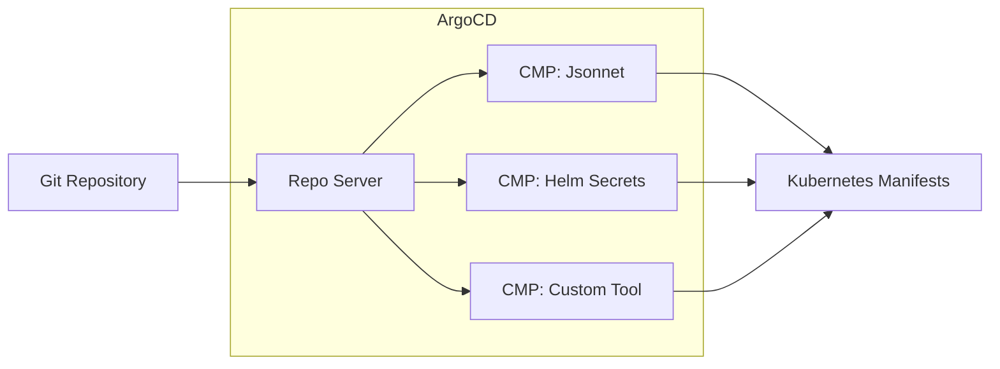

# How to Implement ArgoCD Config Management Plugins

Author: [nawazdhandala](https://github.com/nawazdhandala)

Tags: ArgoCD, GitOps, Kubernetes, Configuration

Description: Learn how to extend ArgoCD with custom Config Management Plugins (CMPs) to support any configuration tool or templating engine in your GitOps workflow.

---

ArgoCD supports Helm, Kustomize, and plain YAML out of the box. But what if you need to use Jsonnet, cue, or a custom templating tool? Config Management Plugins (CMPs) let you extend ArgoCD to generate Kubernetes manifests from any source format.

## What Are Config Management Plugins?

Config Management Plugins are sidecar containers that ArgoCD uses to generate Kubernetes manifests. When ArgoCD encounters a repository that matches a plugin's discovery rules, it delegates manifest generation to that plugin.



## CMP Architecture

The modern CMP architecture (ArgoCD 2.4+) uses sidecar containers instead of the legacy ConfigMap-based approach. Each plugin runs as a separate container alongside the repo-server.

```mermaid
flowchart TB
    subgraph Pod[argocd-repo-server Pod]
        RepoServer[repo-server container]
        Sidecar1[cmp-jsonnet sidecar]
        Sidecar2[cmp-helm-secrets sidecar]

        RepoServer -->|gRPC via Unix Socket| Sidecar1
        RepoServer -->|gRPC via Unix Socket| Sidecar2
    end

    subgraph Volumes
        PluginsDir[/home/argocd/cmp-server/plugins]
        TmpDir[/tmp]
    end

    Sidecar1 --> PluginsDir
    Sidecar2 --> PluginsDir
```

## Creating Your First CMP

Let me walk you through creating a simple CMP that processes Jsonnet files.

### Step 1: Define the Plugin Configuration

Create a ConfigMap that contains your plugin configuration. This file tells ArgoCD how to discover and run your plugin.

```yaml
# plugin.yaml
apiVersion: argoproj.io/v1alpha1
kind: ConfigManagementPlugin
metadata:
  name: jsonnet-cmp
spec:
  version: v1.0

  # Init command runs before generate
  init:
    command: [sh, -c]
    args:
      - |
        echo "Initializing Jsonnet plugin..."
        jsonnet-bundler install

  # Generate produces Kubernetes manifests
  generate:
    command: [sh, -c]
    args:
      - |
        jsonnet -J vendor -J lib main.jsonnet | \
        yq eval -P - | \
        yq eval 'select(. != null)'

  # Discovery rules determine when this plugin applies
  discover:
    find:
      glob: "**/main.jsonnet"

  # Allow concurrent processing
  allowConcurrency: true

  # Lock repo during generation
  lockRepo: false
```

### Step 2: Build the Sidecar Container

Create a Dockerfile for your CMP sidecar. The container must include the argocd-cmp-server binary and your tools.

```dockerfile
# Dockerfile
FROM golang:1.21 AS builder

# Install jsonnet
RUN go install github.com/google/go-jsonnet/cmd/jsonnet@latest
RUN go install github.com/google/go-jsonnet/cmd/jsonnetfmt@latest

# Install jsonnet-bundler
RUN go install github.com/jsonnet-bundler/jsonnet-bundler/cmd/jb@latest

FROM ubuntu:22.04

# Install dependencies
RUN apt-get update && \
    apt-get install -y --no-install-recommends \
    ca-certificates \
    curl \
    git \
    && rm -rf /var/lib/apt/lists/*

# Install yq
RUN curl -sL https://github.com/mikefarah/yq/releases/latest/download/yq_linux_amd64 \
    -o /usr/local/bin/yq && chmod +x /usr/local/bin/yq

# Copy binaries from builder
COPY --from=builder /go/bin/jsonnet /usr/local/bin/
COPY --from=builder /go/bin/jsonnetfmt /usr/local/bin/
COPY --from=builder /go/bin/jb /usr/local/bin/

# Copy argocd-cmp-server from ArgoCD image
COPY --from=quay.io/argoproj/argocd:v2.9.3 /usr/local/bin/argocd-cmp-server /usr/local/bin/

# Copy plugin configuration
COPY plugin.yaml /home/argocd/cmp-server/config/plugin.yaml

# Create non-root user
RUN useradd -m -u 999 argocd
USER 999

# Set working directory
WORKDIR /home/argocd

# Entry point
ENTRYPOINT ["/usr/local/bin/argocd-cmp-server"]
```

Build and push the image.

```bash
docker build -t myregistry/argocd-jsonnet-cmp:v1.0.0 .
docker push myregistry/argocd-jsonnet-cmp:v1.0.0
```

### Step 3: Deploy the CMP Sidecar

Patch the argocd-repo-server deployment to add your sidecar container.

```yaml
# repo-server-patch.yaml
apiVersion: apps/v1
kind: Deployment
metadata:
  name: argocd-repo-server
  namespace: argocd
spec:
  template:
    spec:
      containers:
        # Existing repo-server container
        - name: argocd-repo-server
          volumeMounts:
            - name: cmp-plugins
              mountPath: /home/argocd/cmp-server/plugins
            - name: cmp-tmp
              mountPath: /tmp

        # Jsonnet CMP sidecar
        - name: cmp-jsonnet
          image: myregistry/argocd-jsonnet-cmp:v1.0.0
          securityContext:
            runAsNonRoot: true
            runAsUser: 999
          volumeMounts:
            - name: var-files
              mountPath: /var/run/argocd
            - name: plugins
              mountPath: /home/argocd/cmp-server/plugins
            - name: cmp-tmp
              mountPath: /tmp
          env:
            - name: HOME
              value: /tmp

      volumes:
        - name: cmp-plugins
          emptyDir: {}
        - name: cmp-tmp
          emptyDir: {}
        - name: var-files
          emptyDir: {}
        - name: plugins
          emptyDir: {}
```

Apply the patch using Kustomize or directly.

```bash
kubectl patch deployment argocd-repo-server -n argocd --patch-file repo-server-patch.yaml
```

## Real-World CMP Examples

### Helm with SOPS Secrets

This plugin decrypts SOPS-encrypted values files before running Helm.

```yaml
# helm-secrets-plugin.yaml
apiVersion: argoproj.io/v1alpha1
kind: ConfigManagementPlugin
metadata:
  name: helm-secrets
spec:
  version: v1.0

  init:
    command: [sh, -c]
    args:
      - |
        helm dependency build

  generate:
    command: [sh, -c]
    args:
      - |
        # Decrypt secrets files
        for f in secrets.*.yaml; do
          if [ -f "$f" ]; then
            sops -d "$f" > "decrypted-$f"
          fi
        done

        # Build helm template command
        HELM_CMD="helm template $ARGOCD_APP_NAME ."

        # Add values files
        for f in values.yaml values-*.yaml; do
          if [ -f "$f" ]; then
            HELM_CMD="$HELM_CMD -f $f"
          fi
        done

        # Add decrypted secrets
        for f in decrypted-secrets.*.yaml; do
          if [ -f "$f" ]; then
            HELM_CMD="$HELM_CMD -f $f"
          fi
        done

        # Add namespace
        HELM_CMD="$HELM_CMD -n $ARGOCD_APP_NAMESPACE"

        # Execute
        eval $HELM_CMD

  discover:
    find:
      glob: "**/secrets.*.yaml"
```

The Dockerfile for the Helm Secrets plugin includes the necessary tools.

```dockerfile
FROM alpine:3.19

RUN apk add --no-cache \
    bash \
    curl \
    git \
    gnupg \
    helm \
    age

# Install SOPS
RUN curl -sL https://github.com/getsops/sops/releases/download/v3.8.1/sops-v3.8.1.linux.amd64 \
    -o /usr/local/bin/sops && chmod +x /usr/local/bin/sops

# Install helm-secrets plugin
RUN helm plugin install https://github.com/jkroepke/helm-secrets

COPY --from=quay.io/argoproj/argocd:v2.9.3 /usr/local/bin/argocd-cmp-server /usr/local/bin/
COPY plugin.yaml /home/argocd/cmp-server/config/plugin.yaml

RUN adduser -D -u 999 argocd
USER 999
WORKDIR /home/argocd

ENTRYPOINT ["/usr/local/bin/argocd-cmp-server"]
```

### Kustomize with Environment Variables

This plugin injects environment-specific variables into Kustomize builds.

```yaml
# kustomize-envsubst-plugin.yaml
apiVersion: argoproj.io/v1alpha1
kind: ConfigManagementPlugin
metadata:
  name: kustomize-envsubst
spec:
  version: v1.0

  generate:
    command: [sh, -c]
    args:
      - |
        # Load environment variables from .env file if exists
        if [ -f ".env.$ARGOCD_ENV_ENVIRONMENT" ]; then
          export $(cat ".env.$ARGOCD_ENV_ENVIRONMENT" | xargs)
        fi

        # Run kustomize and substitute environment variables
        kustomize build . | envsubst

  discover:
    find:
      glob: "**/kustomization.yaml"
    fileName: ".use-envsubst"

  parameters:
    static:
      - name: environment
        title: Environment
        tooltip: Target environment (dev, staging, prod)
        required: true
```

### CUE Language Support

CUE is a powerful configuration language that can validate and generate Kubernetes manifests.

```yaml
# cue-plugin.yaml
apiVersion: argoproj.io/v1alpha1
kind: ConfigManagementPlugin
metadata:
  name: cue-kubernetes
spec:
  version: v1.0

  init:
    command: [sh, -c]
    args:
      - |
        # Initialize CUE modules
        cue mod init 2>/dev/null || true

  generate:
    command: [sh, -c]
    args:
      - |
        # Export Kubernetes manifests from CUE
        cue export . \
          -e manifests \
          --out yaml \
          -t env=$ARGOCD_ENV_ENVIRONMENT

  discover:
    find:
      glob: "**/*.cue"

  parameters:
    static:
      - name: environment
        title: Environment
        required: false
        default: "production"
```

## Using CMP Parameters

CMPs can accept parameters from Application specs. This allows customization without modifying the source repository.

### Static Parameters

Define parameters in the plugin configuration.

```yaml
spec:
  parameters:
    static:
      - name: release-name
        title: Release Name
        tooltip: Helm release name
        required: false
        default: "$ARGOCD_APP_NAME"
      - name: values-file
        title: Values File
        required: false
        itemType: string
        collectionType: array
```

### Dynamic Parameters

Generate parameters dynamically based on repository contents.

```yaml
spec:
  parameters:
    dynamic:
      command: [sh, -c]
      args:
        - |
          # List available values files
          for f in values-*.yaml; do
            if [ -f "$f" ]; then
              echo "{\"name\": \"$f\", \"title\": \"Include $f\"}"
            fi
          done | jq -s '.'
```

### Using Parameters in Application

Reference parameters in your ArgoCD Application manifest.

```yaml
apiVersion: argoproj.io/v1alpha1
kind: Application
metadata:
  name: my-app
  namespace: argocd
spec:
  project: default
  source:
    repoURL: https://github.com/myorg/my-app.git
    path: deploy
    targetRevision: HEAD
    plugin:
      name: helm-secrets
      env:
        - name: ENVIRONMENT
          value: production
      parameters:
        - name: release-name
          string: my-custom-release
        - name: values-file
          array:
            - values-production.yaml
            - values-secrets.yaml
  destination:
    server: https://kubernetes.default.svc
    namespace: production
```

## Environment Variables in CMPs

ArgoCD injects useful environment variables into CMP containers.

| Variable | Description |
|----------|-------------|
| ARGOCD_APP_NAME | Application name |
| ARGOCD_APP_NAMESPACE | Target namespace |
| ARGOCD_APP_REVISION | Git commit SHA |
| ARGOCD_APP_SOURCE_PATH | Path within repository |
| ARGOCD_APP_SOURCE_REPO_URL | Git repository URL |
| ARGOCD_APP_SOURCE_TARGET_REVISION | Target branch/tag |
| ARGOCD_ENV_* | Custom environment variables |

Use these variables in your generate commands.

```yaml
generate:
  command: [sh, -c]
  args:
    - |
      echo "Generating manifests for $ARGOCD_APP_NAME"
      echo "Namespace: $ARGOCD_APP_NAMESPACE"
      echo "Revision: $ARGOCD_APP_REVISION"

      helm template "$ARGOCD_APP_NAME" . \
        --namespace "$ARGOCD_APP_NAMESPACE" \
        --set image.tag="$ARGOCD_APP_REVISION"
```

## Complete Deployment with Helm

For production deployments, use Helm to manage your ArgoCD installation with CMPs. Create a values file that configures the repo-server with sidecar containers.

```yaml
# argocd-values.yaml
repoServer:
  volumes:
    - name: cmp-jsonnet
      configMap:
        name: cmp-jsonnet-plugin
    - name: cmp-helm-secrets
      configMap:
        name: cmp-helm-secrets-plugin
    - name: cmp-tmp
      emptyDir: {}
    - name: gnupg-home
      emptyDir: {}
    - name: sops-age
      secret:
        secretName: sops-age-key

  extraContainers:
    # Jsonnet CMP
    - name: cmp-jsonnet
      image: myregistry/argocd-jsonnet-cmp:v1.0.0
      securityContext:
        runAsNonRoot: true
        runAsUser: 999
      volumeMounts:
        - name: var-files
          mountPath: /var/run/argocd
        - name: plugins
          mountPath: /home/argocd/cmp-server/plugins
        - name: cmp-tmp
          mountPath: /tmp
        - name: cmp-jsonnet
          mountPath: /home/argocd/cmp-server/config/plugin.yaml
          subPath: plugin.yaml

    # Helm Secrets CMP
    - name: cmp-helm-secrets
      image: myregistry/argocd-helm-secrets-cmp:v1.0.0
      securityContext:
        runAsNonRoot: true
        runAsUser: 999
      volumeMounts:
        - name: var-files
          mountPath: /var/run/argocd
        - name: plugins
          mountPath: /home/argocd/cmp-server/plugins
        - name: cmp-tmp
          mountPath: /tmp
        - name: gnupg-home
          mountPath: /home/argocd/.gnupg
        - name: sops-age
          mountPath: /home/argocd/.config/sops/age
        - name: cmp-helm-secrets
          mountPath: /home/argocd/cmp-server/config/plugin.yaml
          subPath: plugin.yaml
      env:
        - name: SOPS_AGE_KEY_FILE
          value: /home/argocd/.config/sops/age/keys.txt

configs:
  cmp:
    create: true
    plugins:
      jsonnet:
        init:
          command: [sh, -c]
          args: ["jsonnet-bundler install"]
        generate:
          command: [sh, -c]
          args: ["jsonnet -J vendor main.jsonnet"]
        discover:
          find:
            glob: "**/main.jsonnet"
```

Install ArgoCD with the custom values.

```bash
helm repo add argo https://argoproj.github.io/argo-helm
helm repo update

helm upgrade --install argocd argo/argo-cd \
  --namespace argocd \
  --create-namespace \
  --values argocd-values.yaml
```

## Debugging CMPs

### Check Sidecar Logs

View logs from CMP sidecar containers to debug issues.

```bash
# List pods
kubectl get pods -n argocd -l app.kubernetes.io/name=argocd-repo-server

# View sidecar logs
kubectl logs -n argocd deployment/argocd-repo-server -c cmp-jsonnet

# Follow logs
kubectl logs -n argocd deployment/argocd-repo-server -c cmp-helm-secrets -f
```

### Test Plugin Locally

Test your plugin commands locally before deploying.

```bash
# Clone your repo
git clone https://github.com/myorg/my-app.git
cd my-app/deploy

# Set environment variables
export ARGOCD_APP_NAME=my-app
export ARGOCD_APP_NAMESPACE=production
export ARGOCD_APP_REVISION=$(git rev-parse HEAD)

# Run generate command
jsonnet -J vendor main.jsonnet | yq eval -P -
```

### Verify Plugin Discovery

Check if ArgoCD discovers your plugin correctly.

```bash
# Check application details
argocd app get my-app --show-params

# Force refresh to trigger plugin discovery
argocd app get my-app --hard-refresh

# Check repo-server logs
kubectl logs -n argocd deployment/argocd-repo-server -c argocd-repo-server | grep -i plugin
```

## Security Considerations

### Limit Plugin Capabilities

Restrict what plugins can do by setting security contexts.

```yaml
extraContainers:
  - name: cmp-jsonnet
    securityContext:
      runAsNonRoot: true
      runAsUser: 999
      readOnlyRootFilesystem: true
      allowPrivilegeEscalation: false
      capabilities:
        drop:
          - ALL
```

### Secret Management

Never embed secrets in plugin images. Use Kubernetes secrets mounted at runtime.

```yaml
volumeMounts:
  - name: aws-credentials
    mountPath: /home/argocd/.aws
    readOnly: true
  - name: gcp-credentials
    mountPath: /home/argocd/.config/gcloud
    readOnly: true

volumes:
  - name: aws-credentials
    secret:
      secretName: argocd-aws-credentials
  - name: gcp-credentials
    secret:
      secretName: argocd-gcp-credentials
```

### Network Policies

Limit network access from CMP containers.

```yaml
apiVersion: networking.k8s.io/v1
kind: NetworkPolicy
metadata:
  name: argocd-repo-server
  namespace: argocd
spec:
  podSelector:
    matchLabels:
      app.kubernetes.io/name: argocd-repo-server
  policyTypes:
    - Egress
  egress:
    # Allow Git access
    - to:
        - ipBlock:
            cidr: 0.0.0.0/0
      ports:
        - port: 443
          protocol: TCP
        - port: 22
          protocol: TCP
    # Allow DNS
    - to:
        - namespaceSelector: {}
      ports:
        - port: 53
          protocol: UDP
```

## Best Practices

**Keep plugins simple.** Each plugin should do one thing well. Complex logic belongs in your build tooling, not in ArgoCD.

**Version your plugin images.** Tag images with semantic versions and update Application specs explicitly rather than using latest tags.

**Test plugins independently.** Create a test harness that runs your plugin commands outside of ArgoCD to catch issues early.

**Use multi-stage builds.** Keep plugin images small by using multi-stage Docker builds and minimal base images.

**Log verbosely during development.** Add echo statements to debug plugin behavior, then remove them for production.

**Handle missing files gracefully.** Check for file existence before processing to avoid cryptic errors.

**Set resource limits.** CMP containers should have appropriate CPU and memory limits to prevent resource exhaustion.

---

Config Management Plugins unlock ArgoCD's full potential by letting you use any configuration tooling in your GitOps workflow. Start with a simple plugin, test it thoroughly, and gradually add complexity as needed. The sidecar architecture makes plugins isolated, secure, and easy to update independently.
