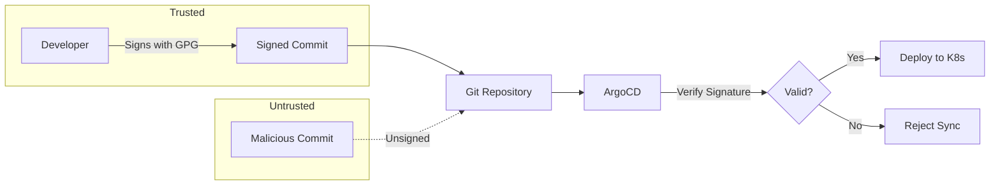
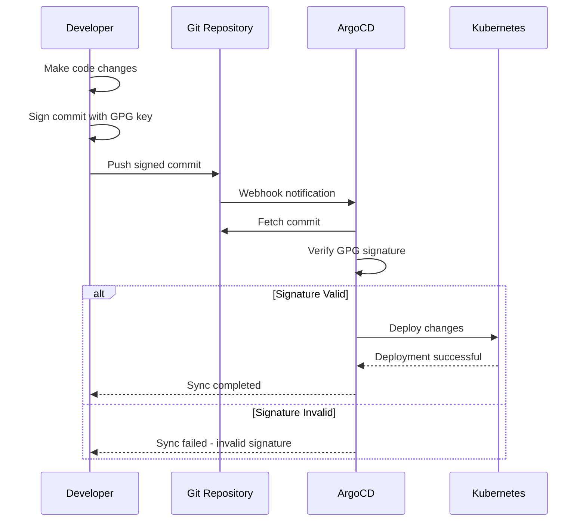

# How to Create ArgoCD GnuPG Keys

Author: [nawazdhandala](https://github.com/nawazdhandala)

Tags: ArgoCD, GitOps, GPG, Security

Description: Learn how to create and configure GnuPG keys for ArgoCD to verify signed Git commits and enhance your GitOps security posture.

---

ArgoCD supports GPG signature verification to ensure that only commits signed by trusted keys are deployed to your Kubernetes clusters. This adds a critical security layer to your GitOps pipeline.

## Why Use GPG Signature Verification?



Benefits of GPG verification:

1. **Authenticity** - Confirms commits come from trusted developers
2. **Integrity** - Ensures commits were not tampered with
3. **Non-repudiation** - Creates audit trail of who approved changes
4. **Compliance** - Meets security requirements for regulated industries

## Prerequisites

Before you begin, ensure you have:

- ArgoCD installed in your Kubernetes cluster
- GPG (GnuPG) installed on your local machine
- Access to your Git repository

To install GPG on your system, use the following commands.

```bash
# macOS
brew install gnupg

# Ubuntu/Debian
sudo apt-get install gnupg

# RHEL/CentOS
sudo yum install gnupg2
```

## Step 1: Generate a GPG Key Pair

First, generate a new GPG key pair. Use RSA with 4096 bits for strong security.

```bash
gpg --full-generate-key
```

When prompted, select the following options:

```
Please select what kind of key you want:
   (1) RSA and RSA (default)
   (2) DSA and Elgamal
   (3) DSA (sign only)
   (4) RSA (sign only)
Your selection? 1

RSA keys may be between 1024 and 4096 bits long.
What keysize do you want? (3072) 4096

Please specify how long the key should be valid.
         0 = key does not expire
      <n>  = key expires in n days
      <n>w = key expires in n weeks
      <n>m = key expires in n months
      <n>y = key expires in n years
Key is valid for? (0) 1y

Real name: Your Name
Email address: your.email@company.com
Comment: ArgoCD signing key
```

## Step 2: List and Export Your GPG Key

After generating the key, list your GPG keys to find the key ID.

```bash
gpg --list-secret-keys --keyid-format=long
```

You will see output similar to this:

```
/home/user/.gnupg/secring.gpg
-----------------------------
sec   rsa4096/ABCD1234EFGH5678 2026-01-30 [SC] [expires: 2027-01-30]
      Key fingerprint = 1234 5678 ABCD EFGH 9012 3456 7890 ABCD EFGH 1234
uid                 [ultimate] Your Name (ArgoCD signing key) <your.email@company.com>
ssb   rsa4096/1234ABCD5678EFGH 2026-01-30 [E] [expires: 2027-01-30]
```

Export the public key in ASCII armor format. Replace `ABCD1234EFGH5678` with your actual key ID.

```bash
gpg --armor --export ABCD1234EFGH5678 > argocd-signing-key.asc
```

## Step 3: Add GPG Key to ArgoCD

ArgoCD stores GPG keys in a ConfigMap. You can add keys using the ArgoCD CLI or by applying a ConfigMap directly.

### Option 1: Using ArgoCD CLI

Add the GPG key using the ArgoCD CLI.

```bash
argocd gpg add --from argocd-signing-key.asc
```

Verify the key was added successfully.

```bash
argocd gpg list
```

### Option 2: Using ConfigMap

Create a ConfigMap with your GPG public key.

```yaml
apiVersion: v1
kind: ConfigMap
metadata:
  name: argocd-gpg-keys-cm
  namespace: argocd
  labels:
    app.kubernetes.io/name: argocd-gpg-keys-cm
    app.kubernetes.io/part-of: argocd
data:
  ABCD1234EFGH5678: |
    -----BEGIN PGP PUBLIC KEY BLOCK-----

    mQINBGX...
    (Your full public key here)
    ...
    -----END PGP PUBLIC KEY BLOCK-----
```

Apply the ConfigMap to your cluster.

```bash
kubectl apply -f argocd-gpg-keys-cm.yaml
```

## Step 4: Configure Git Repository for Signature Verification

Update your ArgoCD repository configuration to require signature verification.

```yaml
apiVersion: v1
kind: Secret
metadata:
  name: my-repo
  namespace: argocd
  labels:
    argocd.argoproj.io/secret-type: repository
stringData:
  type: git
  url: https://github.com/myorg/myapp.git
  username: git
  password: <github-token>
```

## Step 5: Enable Signature Verification in ArgoCD Application

Configure your ArgoCD Application to verify GPG signatures. Set the `signatureKeys` field to specify which keys are trusted.

```yaml
apiVersion: argoproj.io/v1alpha1
kind: Application
metadata:
  name: myapp
  namespace: argocd
spec:
  project: default
  source:
    repoURL: https://github.com/myorg/myapp.git
    targetRevision: HEAD
    path: k8s/production
  destination:
    server: https://kubernetes.default.svc
    namespace: production
  syncPolicy:
    automated:
      prune: true
      selfHeal: true
```

## Step 6: Configure Project-Level Signature Requirements

For organization-wide enforcement, configure signature requirements at the AppProject level.

```yaml
apiVersion: argoproj.io/v1alpha1
kind: AppProject
metadata:
  name: production
  namespace: argocd
spec:
  description: Production applications with GPG verification
  sourceRepos:
    - 'https://github.com/myorg/*'
  destinations:
    - namespace: 'production-*'
      server: https://kubernetes.default.svc
  signatureKeys:
    - keyID: ABCD1234EFGH5678
```

This ensures all applications in the `production` project must have commits signed by the specified key.

## GPG Verification Workflow

Here is the complete workflow showing how GPG verification integrates with your GitOps pipeline.



## Signing Your Git Commits

Configure Git to sign all commits with your GPG key.

```bash
# Set your signing key
git config --global user.signingkey ABCD1234EFGH5678

# Enable automatic commit signing
git config --global commit.gpgsign true

# Enable automatic tag signing
git config --global tag.gpgsign true
```

Test that signing works correctly.

```bash
# Create a signed commit
git commit -S -m "Test signed commit"

# Verify the signature
git log --show-signature -1
```

## Managing Multiple GPG Keys

For teams with multiple developers, you need to add all trusted public keys to ArgoCD. Create a ConfigMap with multiple keys.

```yaml
apiVersion: v1
kind: ConfigMap
metadata:
  name: argocd-gpg-keys-cm
  namespace: argocd
data:
  ABCD1234EFGH5678: |
    -----BEGIN PGP PUBLIC KEY BLOCK-----
    (Developer 1 public key)
    -----END PGP PUBLIC KEY BLOCK-----
  9012IJKL3456MNOP: |
    -----BEGIN PGP PUBLIC KEY BLOCK-----
    (Developer 2 public key)
    -----END PGP PUBLIC KEY BLOCK-----
  QRST7890UVWX1234: |
    -----BEGIN PGP PUBLIC KEY BLOCK-----
    (CI/CD service account key)
    -----END PGP PUBLIC KEY BLOCK-----
```

## Best Practices

### 1. Use Dedicated Signing Keys

Create separate GPG keys for different purposes.

```bash
# Personal development key
gpg --full-generate-key  # For local development

# CI/CD automation key
gpg --full-generate-key  # For automated pipelines

# Emergency/break-glass key
gpg --full-generate-key  # Stored securely offline
```

### 2. Set Key Expiration

Always set expiration dates on your keys. One year is a reasonable default.

```bash
# Edit key to change expiration
gpg --edit-key ABCD1234EFGH5678
gpg> expire
gpg> save
```

### 3. Backup Your Private Keys

Store encrypted backups of your private keys securely.

```bash
# Export private key
gpg --armor --export-secret-keys ABCD1234EFGH5678 > private-key-backup.asc

# Encrypt the backup
gpg --symmetric --cipher-algo AES256 private-key-backup.asc

# Store encrypted backup in secure location
# Delete unencrypted backup
rm private-key-backup.asc
```

### 4. Revoke Compromised Keys

If a key is compromised, revoke it immediately.

```bash
# Generate revocation certificate (do this when creating the key)
gpg --gen-revoke ABCD1234EFGH5678 > revoke-ABCD1234EFGH5678.asc

# If key is compromised, import revocation certificate
gpg --import revoke-ABCD1234EFGH5678.asc

# Remove from ArgoCD
argocd gpg rm ABCD1234EFGH5678
```

## Troubleshooting

### Signature Verification Failed

If ArgoCD reports signature verification failures, check the following.

```bash
# Verify the key is in ArgoCD
argocd gpg list

# Check the commit signature locally
git verify-commit HEAD

# Ensure the key ID matches
gpg --list-keys --keyid-format=long
```

### Key Not Found

If ArgoCD cannot find the key, verify the ConfigMap is correct.

```bash
# Check the ConfigMap
kubectl get configmap argocd-gpg-keys-cm -n argocd -o yaml

# Restart ArgoCD repo server to pick up changes
kubectl rollout restart deployment argocd-repo-server -n argocd
```

### GPG Agent Issues

If GPG agent is not working properly, reset it.

```bash
# Kill existing agent
gpgconf --kill gpg-agent

# Start fresh agent
gpg-agent --daemon

# Test signing
echo "test" | gpg --clearsign
```

## Automating Key Management

For large teams, automate GPG key management with a script.

```bash
#!/bin/bash
# add-gpg-key-to-argocd.sh

KEY_ID=$1
KEY_FILE=$2

if [ -z "$KEY_ID" ] || [ -z "$KEY_FILE" ]; then
    echo "Usage: $0 <key-id> <public-key-file>"
    exit 1
fi

# Verify key file exists
if [ ! -f "$KEY_FILE" ]; then
    echo "Error: Key file not found: $KEY_FILE"
    exit 1
fi

# Add key to ArgoCD
argocd gpg add --from "$KEY_FILE"

# Verify key was added
if argocd gpg list | grep -q "$KEY_ID"; then
    echo "Successfully added key: $KEY_ID"
else
    echo "Failed to add key: $KEY_ID"
    exit 1
fi
```

---

GPG signature verification in ArgoCD provides a strong security guarantee that only trusted, verified commits are deployed to your clusters. Start by adding keys for your core team members, then expand to include CI/CD service accounts. Combined with branch protection rules and code review requirements, GPG verification creates a robust defense-in-depth strategy for your GitOps pipeline.
