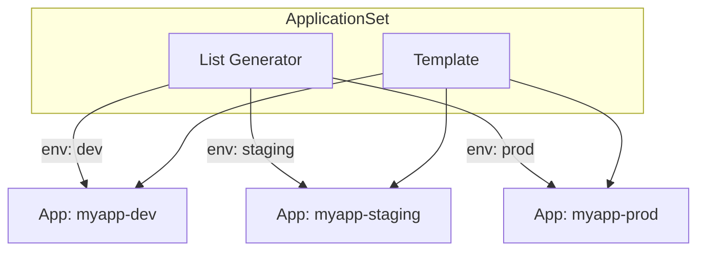
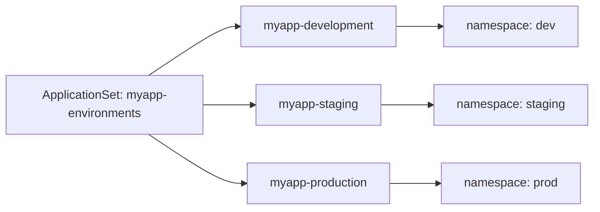
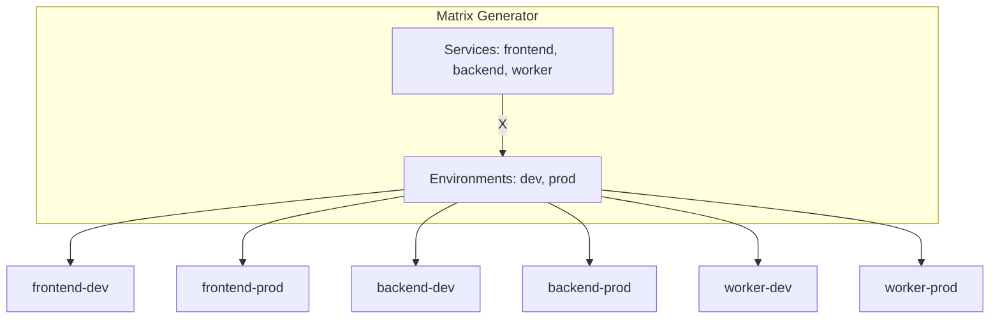

# How to Create ArgoCD List Generator

Author: [nawazdhandala](https://github.com/nawazdhandala)

Tags: ArgoCD, GitOps, Kubernetes, ApplicationSets

Description: Learn how to use ArgoCD List Generator to dynamically create multiple Applications from a simple list of parameters.

---

Managing multiple applications or environments in ArgoCD can become tedious when you need to create individual Application resources for each one. The List Generator solves this by allowing you to define a template once and generate multiple Applications from a list of values.

## What Is a List Generator?

The List Generator is part of ArgoCD ApplicationSets. It takes a list of key-value pairs and generates an Application for each item in the list.



## Prerequisites

Before using ApplicationSets, ensure you have ArgoCD installed with the ApplicationSet controller. If you installed ArgoCD version 2.3 or later, the ApplicationSet controller is included by default.

Verify the ApplicationSet controller is running:

```bash
kubectl get pods -n argocd | grep applicationset
```

You should see output similar to:

```
argocd-applicationset-controller-xxx   1/1     Running   0          10m
```

## Basic List Generator Structure

The List Generator uses an `elements` array where each element is a map of key-value pairs. These values are then substituted into the template using Go templating syntax.

Here is the basic structure of an ApplicationSet with a List Generator:

```yaml
apiVersion: argoproj.io/v1alpha1
kind: ApplicationSet
metadata:
  name: my-appset
  namespace: argocd
spec:
  generators:
    - list:
        elements:
          - key1: value1
            key2: value2
          - key1: value3
            key2: value4
  template:
    # Application template using {{key1}} and {{key2}}
```

## Example: Multi-Environment Deployment

One of the most common use cases is deploying the same application across multiple environments. Instead of creating three separate Application manifests, you can use a single ApplicationSet.

This ApplicationSet deploys an application to development, staging, and production environments:

```yaml
apiVersion: argoproj.io/v1alpha1
kind: ApplicationSet
metadata:
  name: myapp-environments
  namespace: argocd
spec:
  generators:
    - list:
        elements:
          - env: development
            replicas: "1"
            namespace: dev
          - env: staging
            replicas: "2"
            namespace: staging
          - env: production
            replicas: "5"
            namespace: prod
  template:
    metadata:
      name: 'myapp-{{env}}'
    spec:
      project: default
      source:
        repoURL: https://github.com/myorg/myapp.git
        targetRevision: HEAD
        path: 'k8s/overlays/{{env}}'
      destination:
        server: https://kubernetes.default.svc
        namespace: '{{namespace}}'
      syncPolicy:
        automated:
          prune: true
          selfHeal: true
        syncOptions:
          - CreateNamespace=true
```

This generates three Applications:



## Example: Multi-Cluster Deployment

When you have multiple Kubernetes clusters, the List Generator can deploy to each cluster by specifying different server URLs.

This ApplicationSet deploys to three different clusters:

```yaml
apiVersion: argoproj.io/v1alpha1
kind: ApplicationSet
metadata:
  name: multi-cluster-app
  namespace: argocd
spec:
  generators:
    - list:
        elements:
          - cluster: us-east
            server: https://us-east.k8s.example.com
            region: us-east-1
          - cluster: us-west
            server: https://us-west.k8s.example.com
            region: us-west-2
          - cluster: eu-central
            server: https://eu-central.k8s.example.com
            region: eu-central-1
  template:
    metadata:
      name: 'app-{{cluster}}'
      labels:
        region: '{{region}}'
    spec:
      project: default
      source:
        repoURL: https://github.com/myorg/infra.git
        targetRevision: HEAD
        path: base
      destination:
        server: '{{server}}'
        namespace: application
      syncPolicy:
        automated:
          prune: true
          selfHeal: true
```

## Example: Multiple Microservices

You can also use the List Generator to manage multiple microservices that follow a similar deployment pattern.

This example creates Applications for multiple services:

```yaml
apiVersion: argoproj.io/v1alpha1
kind: ApplicationSet
metadata:
  name: microservices
  namespace: argocd
spec:
  generators:
    - list:
        elements:
          - service: api-gateway
            port: "8080"
            team: platform
          - service: user-service
            port: "8081"
            team: identity
          - service: order-service
            port: "8082"
            team: commerce
          - service: notification-service
            port: "8083"
            team: engagement
  template:
    metadata:
      name: '{{service}}'
      labels:
        team: '{{team}}'
    spec:
      project: default
      source:
        repoURL: https://github.com/myorg/{{service}}.git
        targetRevision: HEAD
        path: deploy
        helm:
          parameters:
            - name: service.port
              value: '{{port}}'
      destination:
        server: https://kubernetes.default.svc
        namespace: '{{team}}'
      syncPolicy:
        automated:
          prune: true
          selfHeal: true
```

## Using Helm Values with List Generator

When deploying Helm charts, you can pass different values for each generated Application.

This example shows how to customize Helm values per environment:

```yaml
apiVersion: argoproj.io/v1alpha1
kind: ApplicationSet
metadata:
  name: helm-app-environments
  namespace: argocd
spec:
  generators:
    - list:
        elements:
          - env: dev
            values_file: values-dev.yaml
            ingress_host: app.dev.example.com
          - env: staging
            values_file: values-staging.yaml
            ingress_host: app.staging.example.com
          - env: prod
            values_file: values-prod.yaml
            ingress_host: app.example.com
  template:
    metadata:
      name: 'myapp-{{env}}'
    spec:
      project: default
      source:
        repoURL: https://github.com/myorg/helm-charts.git
        targetRevision: HEAD
        path: charts/myapp
        helm:
          valueFiles:
            - '{{values_file}}'
          parameters:
            - name: ingress.host
              value: '{{ingress_host}}'
      destination:
        server: https://kubernetes.default.svc
        namespace: 'myapp-{{env}}'
```

## Combining List Generator with Matrix Generator

For more complex scenarios, you can combine the List Generator with other generators using the Matrix Generator. This creates a Cartesian product of the inputs.

This example deploys each service to each environment:

```yaml
apiVersion: argoproj.io/v1alpha1
kind: ApplicationSet
metadata:
  name: services-by-environment
  namespace: argocd
spec:
  generators:
    - matrix:
        generators:
          - list:
              elements:
                - service: frontend
                - service: backend
                - service: worker
          - list:
              elements:
                - env: dev
                  cluster: https://kubernetes.default.svc
                - env: prod
                  cluster: https://prod.k8s.example.com
  template:
    metadata:
      name: '{{service}}-{{env}}'
    spec:
      project: default
      source:
        repoURL: https://github.com/myorg/{{service}}.git
        targetRevision: HEAD
        path: 'k8s/{{env}}'
      destination:
        server: '{{cluster}}'
        namespace: '{{service}}'
```

This generates six Applications:



## Combining List Generator with Merge Generator

The Merge Generator allows you to override specific values while keeping defaults.

This example sets defaults and overrides them per environment:

```yaml
apiVersion: argoproj.io/v1alpha1
kind: ApplicationSet
metadata:
  name: merged-config
  namespace: argocd
spec:
  generators:
    - merge:
        mergeKeys:
          - env
        generators:
          # Defaults
          - list:
              elements:
                - env: dev
                  replicas: "1"
                  memory: "256Mi"
                  cpu: "100m"
                - env: staging
                  replicas: "2"
                  memory: "512Mi"
                  cpu: "250m"
                - env: prod
                  replicas: "5"
                  memory: "1Gi"
                  cpu: "500m"
          # Overrides for specific environments
          - list:
              elements:
                - env: prod
                  replicas: "10"
                  memory: "2Gi"
  template:
    metadata:
      name: 'myapp-{{env}}'
    spec:
      project: default
      source:
        repoURL: https://github.com/myorg/myapp.git
        targetRevision: HEAD
        path: deploy
        helm:
          parameters:
            - name: replicas
              value: '{{replicas}}'
            - name: resources.memory
              value: '{{memory}}'
            - name: resources.cpu
              value: '{{cpu}}'
      destination:
        server: https://kubernetes.default.svc
        namespace: '{{env}}'
```

## Sync Policy Options

Control how your generated Applications sync with various options.

This example shows comprehensive sync policy configuration:

```yaml
apiVersion: argoproj.io/v1alpha1
kind: ApplicationSet
metadata:
  name: myapp-with-sync-policy
  namespace: argocd
spec:
  generators:
    - list:
        elements:
          - env: dev
            auto_sync: "true"
          - env: staging
            auto_sync: "true"
          - env: prod
            auto_sync: "false"
  template:
    metadata:
      name: 'myapp-{{env}}'
    spec:
      project: default
      source:
        repoURL: https://github.com/myorg/myapp.git
        targetRevision: HEAD
        path: 'k8s/{{env}}'
      destination:
        server: https://kubernetes.default.svc
        namespace: '{{env}}'
      syncPolicy:
        automated:
          prune: true
          selfHeal: true
          allowEmpty: false
        syncOptions:
          - Validate=true
          - CreateNamespace=true
          - PrunePropagationPolicy=foreground
          - PruneLast=true
        retry:
          limit: 5
          backoff:
            duration: 5s
            factor: 2
            maxDuration: 3m
```

## Handling Application Deletion

By default, when you remove an element from the list, the corresponding Application is deleted. You can control this behavior with the `preserveResourcesOnDeletion` option.

This setting preserves Kubernetes resources when an Application is deleted:

```yaml
apiVersion: argoproj.io/v1alpha1
kind: ApplicationSet
metadata:
  name: myapp-preserved
  namespace: argocd
spec:
  generators:
    - list:
        elements:
          - env: production
  syncPolicy:
    preserveResourcesOnDeletion: true
  template:
    metadata:
      name: 'myapp-{{env}}'
    spec:
      project: default
      source:
        repoURL: https://github.com/myorg/myapp.git
        path: deploy
      destination:
        server: https://kubernetes.default.svc
        namespace: production
```

## Debugging ApplicationSets

When things do not work as expected, use these commands to debug.

Check the ApplicationSet status:

```bash
kubectl get applicationset -n argocd
kubectl describe applicationset myapp-environments -n argocd
```

View generated Applications:

```bash
kubectl get applications -n argocd -l app.kubernetes.io/instance=myapp-environments
```

Check ApplicationSet controller logs:

```bash
kubectl logs -n argocd -l app.kubernetes.io/name=argocd-applicationset-controller -f
```

Verify the template expansion by using dry-run:

```bash
argocd appset create myapp.yaml --dry-run
```

## Best Practices

### 1. Use Meaningful Names

Always include identifying information in your Application names:

```yaml
metadata:
  name: '{{service}}-{{env}}-{{cluster}}'
```

### 2. Add Labels for Organization

Labels help with filtering and management:

```yaml
metadata:
  name: 'myapp-{{env}}'
  labels:
    environment: '{{env}}'
    team: platform
    managed-by: applicationset
```

### 3. Use Projects for Access Control

Assign Applications to appropriate projects:

```yaml
spec:
  project: '{{team}}-project'
```

### 4. Keep Lists in Separate Files

For large lists, consider using a Git Generator with a config file instead:

```yaml
# config/environments.json
[
  {"env": "dev", "replicas": "1"},
  {"env": "staging", "replicas": "2"},
  {"env": "prod", "replicas": "5"}
]
```

### 5. Document Your Parameters

Add comments to explain the purpose of each parameter:

```yaml
generators:
  - list:
      elements:
        # Development environment with minimal resources
        - env: development
          replicas: "1"
          memory: "256Mi"
```

---

The List Generator is a powerful tool for managing multiple Applications with minimal configuration. Start with simple multi-environment deployments and expand to more complex patterns as your needs grow. Combined with other generators like Matrix and Merge, you can build sophisticated deployment patterns that scale with your infrastructure.
