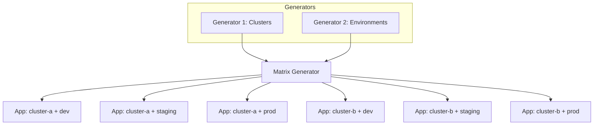
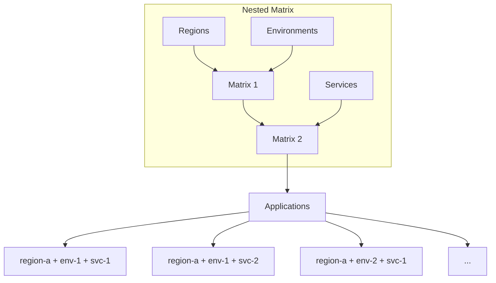
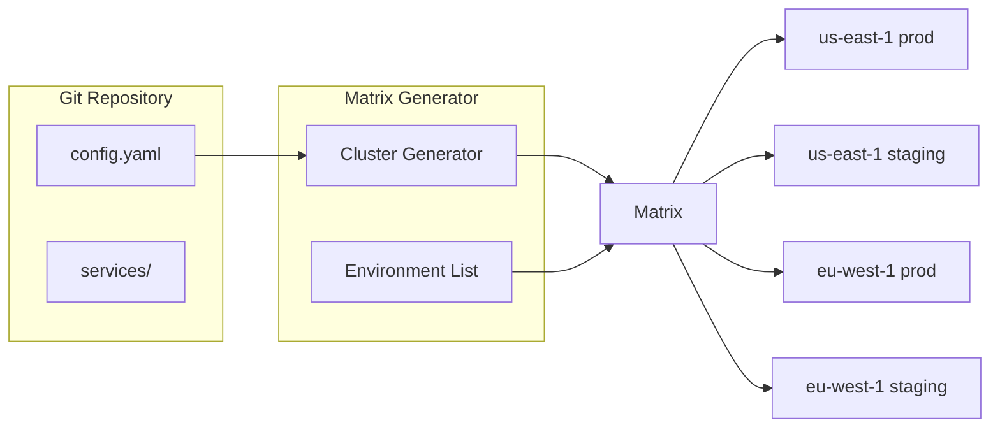

# How to Implement ArgoCD Matrix Generator

Author: [nawazdhandala](https://github.com/nawazdhandala)

Tags: ArgoCD, GitOps, Kubernetes, ApplicationSets

Description: Learn how to use the ArgoCD Matrix Generator to create powerful combinations of generators for deploying applications across multiple clusters, environments, and configurations.

---

The Matrix Generator in ArgoCD ApplicationSets combines multiple generators to create the Cartesian product of their outputs. This lets you deploy applications across every combination of clusters and environments without writing repetitive YAML.

## What Is the Matrix Generator?

The Matrix Generator takes two or more child generators and produces all possible combinations of their outputs. If you have 3 clusters and 4 environments, the Matrix Generator creates 12 Applications automatically.



## When to Use the Matrix Generator

Use the Matrix Generator when you need to deploy:
- The same application to multiple clusters AND multiple environments
- Different configurations across regions AND teams
- Services with varying resource profiles across clusters

## Basic Matrix Generator Example

This example combines a list of clusters with a list of environments to deploy an application to all combinations.

```yaml
apiVersion: argoproj.io/v1alpha1
kind: ApplicationSet
metadata:
  name: myapp-matrix
  namespace: argocd
spec:
  generators:
    - matrix:
        generators:
          - list:
              elements:
                - cluster: cluster-east
                  url: https://east.example.com
                - cluster: cluster-west
                  url: https://west.example.com
          - list:
              elements:
                - env: development
                  replicas: "1"
                - env: staging
                  replicas: "2"
                - env: production
                  replicas: "3"
  template:
    metadata:
      name: 'myapp-{{cluster}}-{{env}}'
    spec:
      project: default
      source:
        repoURL: https://github.com/myorg/myapp.git
        targetRevision: HEAD
        path: 'k8s/overlays/{{env}}'
        helm:
          parameters:
            - name: replicas
              value: '{{replicas}}'
      destination:
        server: '{{url}}'
        namespace: 'myapp-{{env}}'
      syncPolicy:
        automated:
          prune: true
          selfHeal: true
        syncOptions:
          - CreateNamespace=true
```

This creates 6 Applications: `myapp-cluster-east-development`, `myapp-cluster-east-staging`, `myapp-cluster-east-production`, `myapp-cluster-west-development`, `myapp-cluster-west-staging`, and `myapp-cluster-west-production`.

## Combining Cluster Generator with Git Generator

This pattern discovers clusters dynamically and combines them with service definitions from Git.

```yaml
apiVersion: argoproj.io/v1alpha1
kind: ApplicationSet
metadata:
  name: services-all-clusters
  namespace: argocd
spec:
  generators:
    - matrix:
        generators:
          - clusters:
              selector:
                matchLabels:
                  env: production
          - git:
              repoURL: https://github.com/myorg/services.git
              revision: HEAD
              directories:
                - path: 'services/*'
  template:
    metadata:
      name: '{{path.basename}}-{{name}}'
    spec:
      project: default
      source:
        repoURL: https://github.com/myorg/services.git
        targetRevision: HEAD
        path: '{{path}}'
      destination:
        server: '{{server}}'
        namespace: '{{path.basename}}'
      syncPolicy:
        automated:
          prune: true
          selfHeal: true
```

## Matrix with Git Files Generator

Read configuration from JSON or YAML files in Git and combine with clusters.

The config.json file defines application-specific settings.

```json
{
  "apps": [
    {
      "name": "frontend",
      "port": 3000,
      "resources": "small"
    },
    {
      "name": "backend",
      "port": 8080,
      "resources": "large"
    },
    {
      "name": "worker",
      "port": 9090,
      "resources": "medium"
    }
  ]
}
```

The ApplicationSet uses the Git files generator to read this configuration.

```yaml
apiVersion: argoproj.io/v1alpha1
kind: ApplicationSet
metadata:
  name: apps-matrix
  namespace: argocd
spec:
  generators:
    - matrix:
        generators:
          - clusters:
              selector:
                matchLabels:
                  tier: frontend
          - git:
              repoURL: https://github.com/myorg/config.git
              revision: HEAD
              files:
                - path: 'config/apps/config.json'
  template:
    metadata:
      name: '{{name}}-{{app.name}}'
    spec:
      project: default
      source:
        repoURL: https://github.com/myorg/apps.git
        targetRevision: HEAD
        path: 'apps/{{app.name}}'
        helm:
          parameters:
            - name: port
              value: '{{app.port}}'
            - name: resources
              value: '{{app.resources}}'
      destination:
        server: '{{server}}'
        namespace: '{{app.name}}'
```

## Nested Matrix Generators

For complex scenarios, you can nest matrix generators to create three-way combinations.



This ApplicationSet nests two matrix generators to combine regions, environments, and services.

```yaml
apiVersion: argoproj.io/v1alpha1
kind: ApplicationSet
metadata:
  name: nested-matrix
  namespace: argocd
spec:
  generators:
    - matrix:
        generators:
          - matrix:
              generators:
                - list:
                    elements:
                      - region: us-east
                        regionUrl: https://us-east.example.com
                      - region: eu-west
                        regionUrl: https://eu-west.example.com
                - list:
                    elements:
                      - env: dev
                      - env: prod
          - list:
              elements:
                - service: api
                  port: "8080"
                - service: web
                  port: "3000"
  template:
    metadata:
      name: '{{service}}-{{region}}-{{env}}'
    spec:
      project: default
      source:
        repoURL: https://github.com/myorg/services.git
        targetRevision: HEAD
        path: 'services/{{service}}/overlays/{{env}}'
      destination:
        server: '{{regionUrl}}'
        namespace: '{{service}}-{{env}}'
```

## Using Matrix with SCM Provider Generator

Automatically deploy applications from all repositories in your GitHub organization.

```yaml
apiVersion: argoproj.io/v1alpha1
kind: ApplicationSet
metadata:
  name: org-apps
  namespace: argocd
spec:
  generators:
    - matrix:
        generators:
          - scmProvider:
              github:
                organization: myorg
                tokenRef:
                  secretName: github-token
                  key: token
              filters:
                - repositoryMatch: '^service-.*'
          - list:
              elements:
                - env: staging
                  cluster: https://staging.example.com
                - env: production
                  cluster: https://prod.example.com
  template:
    metadata:
      name: '{{repository}}-{{env}}'
    spec:
      project: default
      source:
        repoURL: '{{url}}'
        targetRevision: '{{branch}}'
        path: 'k8s/{{env}}'
      destination:
        server: '{{cluster}}'
        namespace: '{{repository}}'
```

## Filtering Matrix Results

Use conditions to filter out specific combinations that should not be deployed.

```yaml
apiVersion: argoproj.io/v1alpha1
kind: ApplicationSet
metadata:
  name: filtered-matrix
  namespace: argocd
spec:
  generators:
    - matrix:
        generators:
          - list:
              elements:
                - cluster: dev-cluster
                  url: https://dev.example.com
                  allowedEnvs: "dev,staging"
                - cluster: prod-cluster
                  url: https://prod.example.com
                  allowedEnvs: "production"
          - list:
              elements:
                - env: dev
                - env: staging
                - env: production
  template:
    metadata:
      name: 'myapp-{{cluster}}-{{env}}'
    spec:
      project: default
      source:
        repoURL: https://github.com/myorg/myapp.git
        targetRevision: HEAD
        path: 'k8s/overlays/{{env}}'
      destination:
        server: '{{url}}'
        namespace: 'myapp-{{env}}'
  # Use goTemplate to filter combinations
  goTemplate: true
  goTemplateOptions: ["missingkey=error"]
```

## Real-World Example: Multi-Region Deployment

This complete example deploys a microservices application across multiple regions with environment-specific configurations.



First, label your clusters with appropriate metadata.

```bash
# Add cluster with labels
argocd cluster add us-east-1-context --name us-east-1
kubectl -n argocd patch secret us-east-1 \
  --type='json' \
  -p='[{"op": "add", "path": "/metadata/labels/region", "value": "us-east"}]'

argocd cluster add eu-west-1-context --name eu-west-1
kubectl -n argocd patch secret eu-west-1 \
  --type='json' \
  -p='[{"op": "add", "path": "/metadata/labels/region", "value": "eu-west"}]'
```

Define the ApplicationSet that uses these labeled clusters.

```yaml
apiVersion: argoproj.io/v1alpha1
kind: ApplicationSet
metadata:
  name: platform-services
  namespace: argocd
spec:
  generators:
    - matrix:
        generators:
          - clusters:
              selector:
                matchExpressions:
                  - key: region
                    operator: In
                    values:
                      - us-east
                      - eu-west
          - list:
              elements:
                - env: staging
                  values: values-staging.yaml
                  syncWave: "0"
                - env: production
                  values: values-production.yaml
                  syncWave: "1"
  template:
    metadata:
      name: 'platform-{{name}}-{{env}}'
      annotations:
        argocd.argoproj.io/sync-wave: '{{syncWave}}'
    spec:
      project: platform
      source:
        repoURL: https://github.com/myorg/platform.git
        targetRevision: HEAD
        path: charts/platform
        helm:
          valueFiles:
            - '{{values}}'
          parameters:
            - name: global.region
              value: '{{metadata.labels.region}}'
            - name: global.cluster
              value: '{{name}}'
            - name: global.environment
              value: '{{env}}'
      destination:
        server: '{{server}}'
        namespace: platform-{{env}}
      syncPolicy:
        automated:
          prune: true
          selfHeal: true
        syncOptions:
          - CreateNamespace=true
          - PruneLast=true
```

## Handling Merge Conflicts in Matrix

When both generators produce the same parameter name, the second generator takes precedence. Use unique parameter names to avoid conflicts.

```yaml
apiVersion: argoproj.io/v1alpha1
kind: ApplicationSet
metadata:
  name: conflict-free-matrix
  namespace: argocd
spec:
  generators:
    - matrix:
        generators:
          - list:
              elements:
                - clusterName: east     # Use clusterName instead of name
                  clusterUrl: https://east.example.com
          - clusters:
              selector:
                matchLabels:
                  type: worker
  template:
    metadata:
      # Use clusterName from list, name from clusters generator
      name: 'app-{{clusterName}}-{{name}}'
    spec:
      destination:
        server: '{{server}}'  # From clusters generator
```

## Debugging Matrix Generators

Check what Applications the Matrix Generator produces before applying.

```bash
# Preview generated applications
argocd appset generate myapp-matrix -o yaml

# Check ApplicationSet status
kubectl get applicationset myapp-matrix -n argocd -o yaml

# View generated applications
kubectl get applications -n argocd -l app.kubernetes.io/instance=myapp-matrix
```

Common issues and solutions:

| Issue | Cause | Solution |
|-------|-------|----------|
| No applications generated | Empty generator output | Check cluster labels, git paths |
| Parameter not found | Merge conflict | Use unique parameter names |
| Too many applications | Large Cartesian product | Add filters or reduce generator scope |

## Best Practices

### 1. Use Meaningful Names

Include enough context in application names to identify the source.

```yaml
template:
  metadata:
    name: '{{service}}-{{cluster}}-{{env}}'
    labels:
      service: '{{service}}'
      cluster: '{{cluster}}'
      environment: '{{env}}'
```

### 2. Set Sync Waves for Dependencies

Control deployment order across the matrix.

```yaml
template:
  metadata:
    annotations:
      argocd.argoproj.io/sync-wave: '{{syncWave}}'
```

### 3. Use Projects for Access Control

Separate matrix-generated apps into projects by team or environment.

```yaml
template:
  spec:
    project: '{{team}}-{{env}}'
```

### 4. Monitor Application Count

Matrix generators can create many applications. Set alerts on application count.

```bash
# Count applications from a specific ApplicationSet
kubectl get applications -n argocd \
  -l app.kubernetes.io/instance=myapp-matrix \
  --no-headers | wc -l
```

---

The Matrix Generator is a powerful tool for managing deployments at scale. Start with simple two-generator combinations, then expand to nested matrices as your requirements grow. Combined with cluster labels and Git-based configuration, you can automate complex multi-cluster deployments with minimal YAML duplication.
