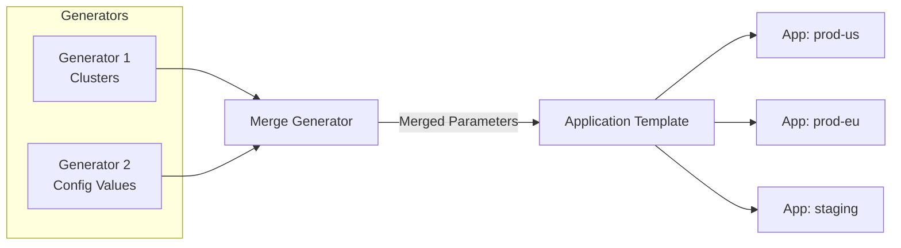
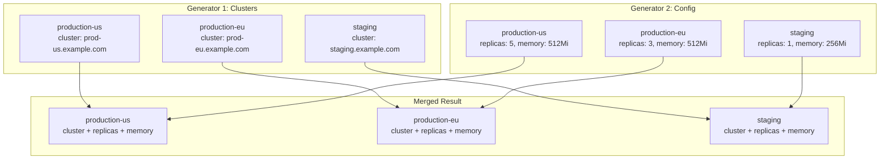
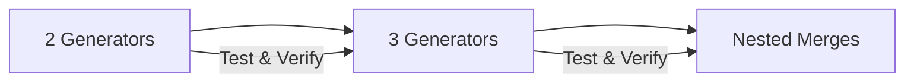

# How to Create ArgoCD Merge Generator

Author: [nawazdhandala](https://github.com/nawazdhandala)

Tags: ArgoCD, GitOps, Kubernetes, ApplicationSets

Description: Learn how to use ArgoCD Merge Generator to combine multiple generators and create powerful, flexible ApplicationSets for complex deployment scenarios.

---

The Merge Generator in ArgoCD ApplicationSets lets you combine parameters from multiple generators into a single template. This is essential when you need to deploy applications across different clusters with environment-specific configurations that come from separate sources.

## What Is the Merge Generator?

The Merge Generator takes the output of multiple child generators and merges them based on a common key. Think of it like a SQL JOIN operation where you combine data from different tables based on a shared column.



## Why Use the Merge Generator?

Common use cases include:

1. **Cluster-specific configurations** - Merge cluster details with environment-specific settings
2. **Multi-source parameters** - Combine data from Git directories with a static list of values
3. **Override patterns** - Apply base configurations with environment overrides
4. **Complex deployment matrices** - Create applications from multiple dimensions of data

## Basic Merge Generator Structure

The Merge Generator requires a `mergeKeys` field that specifies which parameter to use for matching entries across generators.

Here is the basic structure of a Merge Generator ApplicationSet:

```yaml
apiVersion: argoproj.io/v1alpha1
kind: ApplicationSet
metadata:
  name: my-apps
  namespace: argocd
spec:
  generators:
    - merge:
        mergeKeys:
          - environment
        generators:
          - # First generator (base)
          - # Second generator (overrides/additions)
  template:
    # Application template using merged parameters
```

## Practical Example: Multi-Cluster Deployment

Let's create an ApplicationSet that deploys to multiple clusters, where each cluster has specific resource limits and replica counts.

### Step 1: Define the Base Cluster Information

The first generator provides cluster URLs and names:

```yaml
apiVersion: argoproj.io/v1alpha1
kind: ApplicationSet
metadata:
  name: multi-cluster-app
  namespace: argocd
spec:
  generators:
    - merge:
        mergeKeys:
          - environment
        generators:
          # Base generator with cluster information
          - list:
              elements:
                - environment: production-us
                  cluster: https://prod-us.example.com
                  region: us-east-1
                - environment: production-eu
                  cluster: https://prod-eu.example.com
                  region: eu-west-1
                - environment: staging
                  cluster: https://staging.example.com
                  region: us-east-1
          # Second generator with environment-specific configs
          - list:
              elements:
                - environment: production-us
                  replicas: "5"
                  memory: "512Mi"
                  cpu: "500m"
                - environment: production-eu
                  replicas: "3"
                  memory: "512Mi"
                  cpu: "500m"
                - environment: staging
                  replicas: "1"
                  memory: "256Mi"
                  cpu: "250m"
  template:
    metadata:
      name: 'myapp-{{environment}}'
    spec:
      project: default
      source:
        repoURL: https://github.com/myorg/myapp.git
        targetRevision: HEAD
        path: k8s/overlays/{{environment}}
        helm:
          parameters:
            - name: replicas
              value: '{{replicas}}'
            - name: resources.memory
              value: '{{memory}}'
            - name: resources.cpu
              value: '{{cpu}}'
      destination:
        server: '{{cluster}}'
        namespace: myapp
      syncPolicy:
        automated:
          prune: true
          selfHeal: true
```

### Step 2: How the Merge Works

The Merge Generator matches entries from both generators using the `environment` key:



## Merging Git Generator with List Generator

A powerful pattern is combining a Git Generator that discovers services with a List Generator that provides deployment targets.

This example discovers all services in a Git repository and deploys them to specified environments:

```yaml
apiVersion: argoproj.io/v1alpha1
kind: ApplicationSet
metadata:
  name: services-per-environment
  namespace: argocd
spec:
  generators:
    - merge:
        mergeKeys:
          - service
        generators:
          # Discover services from Git
          - git:
              repoURL: https://github.com/myorg/services.git
              revision: HEAD
              directories:
                - path: 'services/*'
              values:
                service: '{{path.basename}}'
          # Provide service-specific configurations
          - list:
              elements:
                - service: api-gateway
                  port: "8080"
                  healthPath: /health
                - service: user-service
                  port: "3000"
                  healthPath: /api/health
                - service: order-service
                  port: "8000"
                  healthPath: /healthz
  template:
    metadata:
      name: '{{service}}'
    spec:
      project: default
      source:
        repoURL: https://github.com/myorg/services.git
        targetRevision: HEAD
        path: 'services/{{service}}'
        helm:
          parameters:
            - name: service.port
              value: '{{port}}'
            - name: health.path
              value: '{{healthPath}}'
      destination:
        server: https://kubernetes.default.svc
        namespace: '{{service}}'
```

## Using Multiple Merge Keys

When you need to match on multiple fields, specify multiple merge keys. This is useful for matrix-style deployments.

This ApplicationSet deploys every service to every environment:

```yaml
apiVersion: argoproj.io/v1alpha1
kind: ApplicationSet
metadata:
  name: service-environment-matrix
  namespace: argocd
spec:
  generators:
    - merge:
        mergeKeys:
          - service
          - environment
        generators:
          # Matrix generator creates all combinations
          - matrix:
              generators:
                - list:
                    elements:
                      - service: frontend
                      - service: backend
                      - service: worker
                - list:
                    elements:
                      - environment: dev
                        cluster: https://dev.example.com
                      - environment: prod
                        cluster: https://prod.example.com
          # Specific overrides for certain combinations
          - list:
              elements:
                - service: frontend
                  environment: prod
                  replicas: "10"
                  cdn: "enabled"
                - service: backend
                  environment: prod
                  replicas: "5"
                  cdn: "disabled"
                - service: worker
                  environment: prod
                  replicas: "3"
                  cdn: "disabled"
  template:
    metadata:
      name: '{{service}}-{{environment}}'
    spec:
      project: default
      source:
        repoURL: https://github.com/myorg/apps.git
        path: '{{service}}/overlays/{{environment}}'
      destination:
        server: '{{cluster}}'
        namespace: '{{service}}'
```

## Merge Generator with Cluster Generator

Combine the Cluster Generator (which reads registered ArgoCD clusters) with additional configuration:

```yaml
apiVersion: argoproj.io/v1alpha1
kind: ApplicationSet
metadata:
  name: infrastructure-per-cluster
  namespace: argocd
spec:
  generators:
    - merge:
        mergeKeys:
          - name
        generators:
          # Get all clusters registered in ArgoCD
          - clusters:
              selector:
                matchLabels:
                  tier: production
          # Provide cluster-specific infrastructure settings
          - list:
              elements:
                - name: prod-us-east
                  storageClass: gp3
                  ingressClass: nginx
                  certIssuer: letsencrypt-prod
                - name: prod-eu-west
                  storageClass: gp3
                  ingressClass: nginx
                  certIssuer: letsencrypt-prod
                - name: prod-ap-south
                  storageClass: standard
                  ingressClass: traefik
                  certIssuer: letsencrypt-prod
  template:
    metadata:
      name: 'infra-{{name}}'
    spec:
      project: infrastructure
      source:
        repoURL: https://github.com/myorg/infrastructure.git
        path: base
        helm:
          parameters:
            - name: storageClass
              value: '{{storageClass}}'
            - name: ingress.class
              value: '{{ingressClass}}'
            - name: certManager.issuer
              value: '{{certIssuer}}'
      destination:
        server: '{{server}}'
        namespace: infrastructure
```

## Nested Merge Generators

You can nest Merge Generators for complex scenarios where you need to combine data from three or more sources.

This example merges cluster info, environment config, and feature flags:

```yaml
apiVersion: argoproj.io/v1alpha1
kind: ApplicationSet
metadata:
  name: complex-deployment
  namespace: argocd
spec:
  generators:
    - merge:
        mergeKeys:
          - env
        generators:
          # First merge: clusters + base config
          - merge:
              mergeKeys:
                - env
              generators:
                - list:
                    elements:
                      - env: production
                        cluster: https://prod.example.com
                      - env: staging
                        cluster: https://staging.example.com
                - list:
                    elements:
                      - env: production
                        logLevel: warn
                        debug: "false"
                      - env: staging
                        logLevel: debug
                        debug: "true"
          # Second generator: feature flags
          - list:
              elements:
                - env: production
                  featureNewUI: "true"
                  featureBetaAPI: "false"
                - env: staging
                  featureNewUI: "true"
                  featureBetaAPI: "true"
  template:
    metadata:
      name: 'app-{{env}}'
    spec:
      project: default
      source:
        repoURL: https://github.com/myorg/app.git
        path: deploy
        helm:
          parameters:
            - name: logging.level
              value: '{{logLevel}}'
            - name: debug.enabled
              value: '{{debug}}'
            - name: features.newUI
              value: '{{featureNewUI}}'
            - name: features.betaAPI
              value: '{{featureBetaAPI}}'
      destination:
        server: '{{cluster}}'
        namespace: app
```

## Handling Missing Keys

When a merge key does not exist in one of the generators, the entry is excluded from the merged result. Use this behavior to your advantage for conditional deployments.

Only services with matching configuration will be deployed:

```yaml
apiVersion: argoproj.io/v1alpha1
kind: ApplicationSet
metadata:
  name: configured-services-only
  namespace: argocd
spec:
  generators:
    - merge:
        mergeKeys:
          - service
        generators:
          # All services discovered from Git
          - git:
              repoURL: https://github.com/myorg/services.git
              revision: HEAD
              directories:
                - path: 'services/*'
              values:
                service: '{{path.basename}}'
          # Only configured services (others will be excluded)
          - list:
              elements:
                - service: api-gateway
                  enabled: "true"
                - service: user-service
                  enabled: "true"
                # order-service is not listed, so it won't be deployed
  template:
    metadata:
      name: '{{service}}'
    spec:
      project: default
      source:
        repoURL: https://github.com/myorg/services.git
        path: 'services/{{service}}'
      destination:
        server: https://kubernetes.default.svc
        namespace: '{{service}}'
```

## Best Practices

### 1. Keep Merge Keys Simple

Use a single, clear identifier when possible:

```yaml
mergeKeys:
  - environment
```

### 2. Document Your Generator Logic

Add comments explaining the merge strategy:

```yaml
generators:
  - merge:
      mergeKeys:
        - cluster
      generators:
        # Base: Cluster endpoints from ArgoCD
        - clusters: {}
        # Override: Cluster-specific configurations from ConfigMap
        - list:
            elements:
              # ... configurations
```

### 3. Use Consistent Naming

Ensure merge key values match exactly across generators:

```yaml
# Good - consistent naming
- environment: prod-us-east-1
# ...
- environment: prod-us-east-1

# Bad - inconsistent naming will not merge
- environment: prod-us-east-1
# ...
- environment: production-us-east-1
```

### 4. Test with Dry Run

Before applying, use the ArgoCD CLI to preview generated applications:

```bash
argocd appset generate ./applicationset.yaml --dry-run
```

### 5. Start Simple

Begin with two generators before adding complexity:



## Troubleshooting

### Applications Not Created

Check if merge keys match:

```bash
# View ApplicationSet status
kubectl describe applicationset my-apps -n argocd

# Check for merge key mismatches in events
kubectl get events -n argocd --field-selector involvedObject.name=my-apps
```

### Unexpected Parameter Values

The last generator in the merge list takes precedence for duplicate keys:

```yaml
generators:
  - merge:
      mergeKeys:
        - env
      generators:
        - list:
            elements:
              - env: prod
                replicas: "3"  # This will be overwritten
        - list:
            elements:
              - env: prod
                replicas: "5"  # This value wins
```

### Missing Parameters in Template

Ensure all parameters used in the template exist in at least one generator:

```yaml
# Template uses {{region}} but no generator provides it
template:
  metadata:
    name: 'app-{{region}}'  # Will fail if region is not in merged output
```

---

The Merge Generator is one of the most powerful features in ArgoCD ApplicationSets. It enables you to create flexible, maintainable deployment configurations by combining data from multiple sources. Start with simple two-generator merges, test thoroughly, and gradually build up to more complex scenarios as your needs grow.
