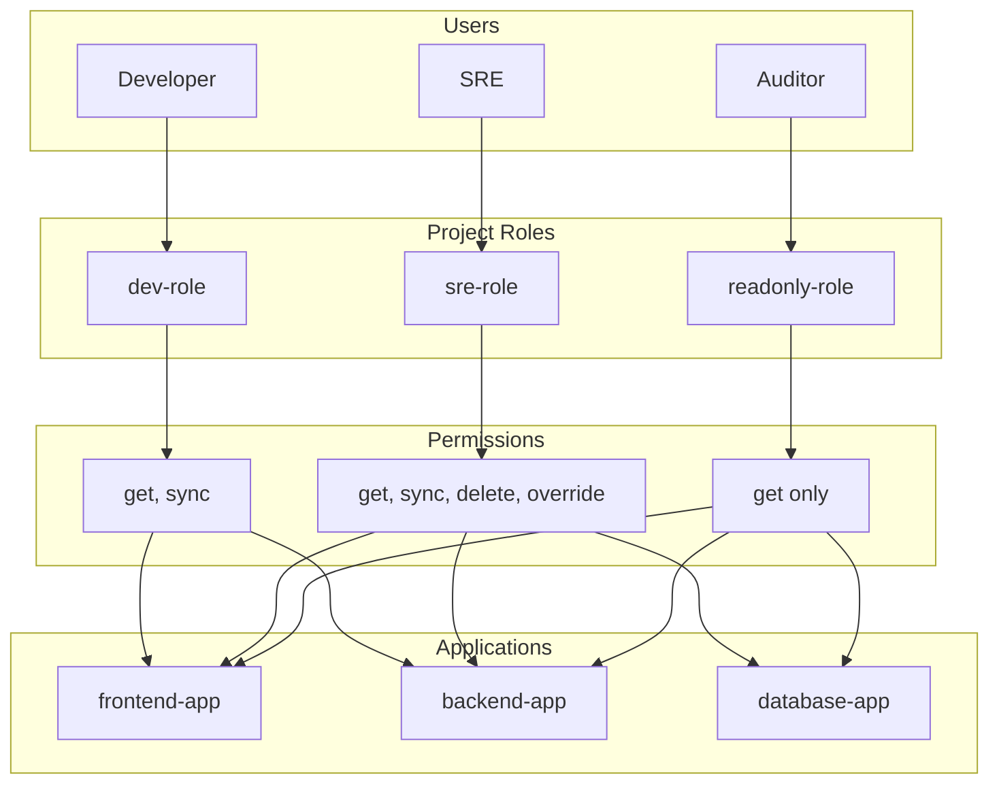
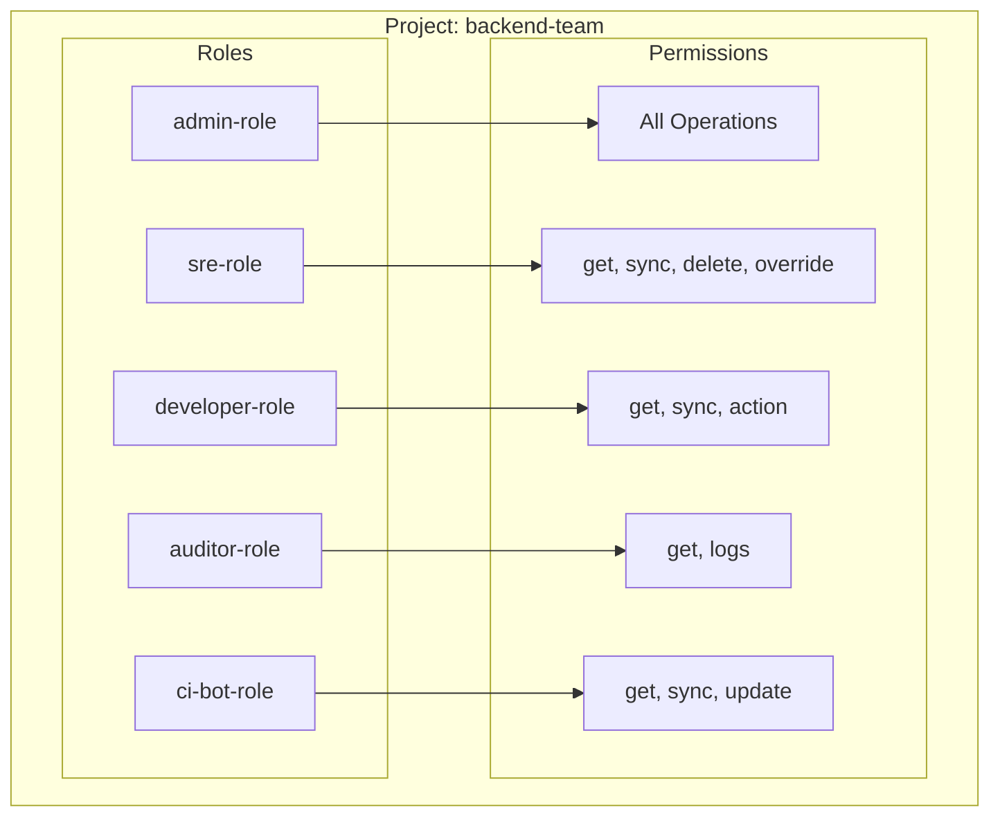
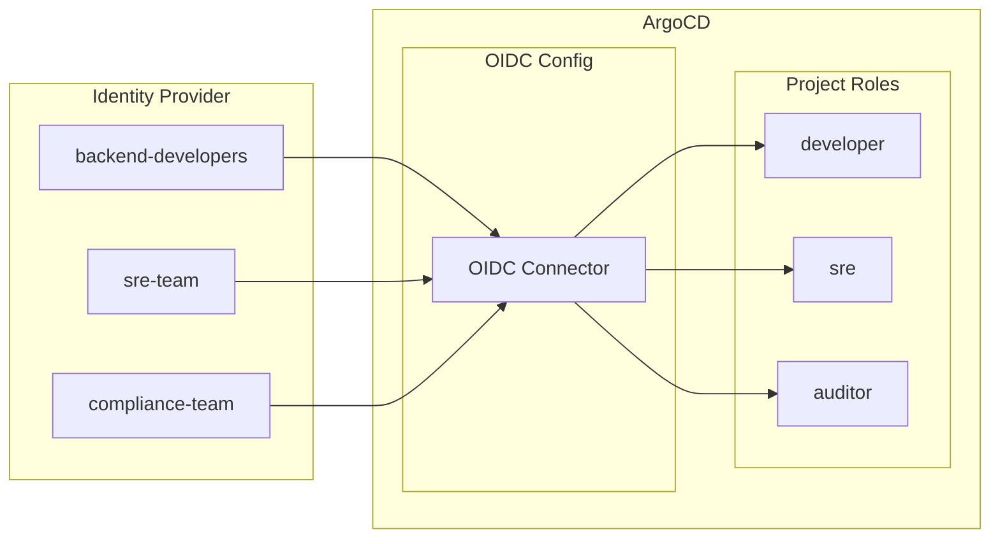

# How to Create ArgoCD Project Roles

Author: [nawazdhandala](https://github.com/nawazdhandala)

Tags: ArgoCD, GitOps, RBAC, Security

Description: Learn how to implement fine-grained access control in ArgoCD using project roles to secure your GitOps workflows and enforce the principle of least privilege.

---

ArgoCD project roles let you define who can do what within a project. Instead of giving everyone admin access, you create specific roles with precise permissions. This is essential for multi-team environments where security and isolation matter.

## Understanding ArgoCD RBAC

ArgoCD uses a Casbin-based RBAC model with three key concepts:



The permission model follows this pattern:

- **Subject**: Who (user, group, or role)
- **Resource**: What (applications, repositories, clusters)
- **Action**: How (get, create, update, delete, sync, override)
- **Object**: Which specific resource

## Creating Your First Project Role

Project roles are defined within an AppProject resource. Here is a basic project with a developer role.

```yaml
apiVersion: argoproj.io/v1alpha1
kind: AppProject
metadata:
  name: backend-team
  namespace: argocd
spec:
  description: Backend team project

  # Allowed source repositories
  sourceRepos:
    - 'https://github.com/myorg/backend-*'

  # Allowed deployment destinations
  destinations:
    - namespace: 'backend-*'
      server: https://kubernetes.default.svc

  # Define project roles
  roles:
    - name: developer
      description: Developer role with sync permissions
      policies:
        - p, proj:backend-team:developer, applications, get, backend-team/*, allow
        - p, proj:backend-team:developer, applications, sync, backend-team/*, allow
      groups:
        - backend-developers
```

Apply the project:

```bash
kubectl apply -f backend-project.yaml
```

## Policy Syntax Deep Dive

Each policy line follows this format:

```
p, <subject>, <resource>, <action>, <object>, <effect>
```

Breaking down the components:

| Component | Description | Examples |
|-----------|-------------|----------|
| subject | Role identifier | `proj:backend-team:developer` |
| resource | ArgoCD resource type | `applications`, `repositories`, `clusters` |
| action | Operation to allow/deny | `get`, `create`, `update`, `delete`, `sync` |
| object | Target pattern | `backend-team/*`, `backend-team/myapp` |
| effect | Permission result | `allow` or `deny` |

## Common Role Patterns

### Read-Only Auditor Role

This role can view applications but cannot make any changes. Perfect for compliance teams.

```yaml
roles:
  - name: auditor
    description: Read-only access for compliance
    policies:
      - p, proj:backend-team:auditor, applications, get, backend-team/*, allow
      - p, proj:backend-team:auditor, logs, get, backend-team/*, allow
    groups:
      - compliance-team
```

### Developer Role with Sync

Developers can view and sync applications but cannot delete or override sync windows.

```yaml
roles:
  - name: developer
    description: Can view and sync applications
    policies:
      - p, proj:backend-team:developer, applications, get, backend-team/*, allow
      - p, proj:backend-team:developer, applications, sync, backend-team/*, allow
      - p, proj:backend-team:developer, applications, action/*, backend-team/*, allow
    groups:
      - backend-developers
```

### SRE Role with Full Control

SREs need broader permissions including override capabilities for incident response.

```yaml
roles:
  - name: sre
    description: Full application management
    policies:
      - p, proj:backend-team:sre, applications, *, backend-team/*, allow
      - p, proj:backend-team:sre, repositories, *, backend-team/*, allow
      - p, proj:backend-team:sre, logs, get, backend-team/*, allow
    groups:
      - sre-team
```

### CI/CD Service Account Role

Automated pipelines need specific permissions without human group membership.

```yaml
roles:
  - name: ci-bot
    description: CI/CD pipeline access
    policies:
      - p, proj:backend-team:ci-bot, applications, get, backend-team/*, allow
      - p, proj:backend-team:ci-bot, applications, sync, backend-team/*, allow
      - p, proj:backend-team:ci-bot, applications, update, backend-team/*, allow
```

## Role Hierarchy Example

Here is a complete project showing how different roles interact.



Full project manifest:

```yaml
apiVersion: argoproj.io/v1alpha1
kind: AppProject
metadata:
  name: backend-team
  namespace: argocd
spec:
  description: Backend team applications

  sourceRepos:
    - 'https://github.com/myorg/backend-*'
    - 'https://github.com/myorg/shared-libs'

  destinations:
    - namespace: 'backend-*'
      server: https://kubernetes.default.svc
    - namespace: 'backend-*'
      server: https://prod.example.com

  clusterResourceWhitelist:
    - group: ''
      kind: Namespace

  namespaceResourceWhitelist:
    - group: '*'
      kind: '*'

  roles:
    # Admin role - full control
    - name: admin
      description: Project administrator
      policies:
        - p, proj:backend-team:admin, applications, *, backend-team/*, allow
        - p, proj:backend-team:admin, repositories, *, backend-team/*, allow
        - p, proj:backend-team:admin, clusters, *, backend-team/*, allow
        - p, proj:backend-team:admin, logs, *, backend-team/*, allow
      groups:
        - backend-leads

    # SRE role - operations focused
    - name: sre
      description: SRE with override capabilities
      policies:
        - p, proj:backend-team:sre, applications, get, backend-team/*, allow
        - p, proj:backend-team:sre, applications, sync, backend-team/*, allow
        - p, proj:backend-team:sre, applications, delete, backend-team/*, allow
        - p, proj:backend-team:sre, applications, override, backend-team/*, allow
        - p, proj:backend-team:sre, logs, get, backend-team/*, allow
      groups:
        - sre-team

    # Developer role - day-to-day work
    - name: developer
      description: Standard developer access
      policies:
        - p, proj:backend-team:developer, applications, get, backend-team/*, allow
        - p, proj:backend-team:developer, applications, sync, backend-team/*, allow
        - p, proj:backend-team:developer, applications, action/*, backend-team/*, allow
        - p, proj:backend-team:developer, logs, get, backend-team/*, allow
      groups:
        - backend-developers

    # Auditor role - compliance
    - name: auditor
      description: Read-only compliance access
      policies:
        - p, proj:backend-team:auditor, applications, get, backend-team/*, allow
        - p, proj:backend-team:auditor, logs, get, backend-team/*, allow
      groups:
        - compliance-team

    # CI/CD role - automation
    - name: ci-bot
      description: Automated pipeline access
      policies:
        - p, proj:backend-team:ci-bot, applications, get, backend-team/*, allow
        - p, proj:backend-team:ci-bot, applications, sync, backend-team/*, allow
        - p, proj:backend-team:ci-bot, applications, update, backend-team/*, allow
```

## Generating JWT Tokens for Roles

For service accounts and CI/CD pipelines, generate JWT tokens:

```bash
# Generate a token for the ci-bot role
argocd proj role create-token backend-team ci-bot

# Generate a token with expiration
argocd proj role create-token backend-team ci-bot --expires-in 24h

# List existing tokens
argocd proj role list-tokens backend-team ci-bot

# Delete a token by ID
argocd proj role delete-token backend-team ci-bot <token-id>
```

Use the token in CI/CD:

```yaml
# GitHub Actions example
- name: Sync ArgoCD Application
  env:
    ARGOCD_AUTH_TOKEN: ${{ secrets.ARGOCD_TOKEN }}
  run: |
    argocd app sync myapp --server argocd.example.com
```

## Integrating with SSO Groups

Project roles can map to SSO groups from your identity provider.



Configure OIDC in ArgoCD:

```yaml
apiVersion: v1
kind: ConfigMap
metadata:
  name: argocd-cm
  namespace: argocd
data:
  url: https://argocd.example.com
  oidc.config: |
    name: Okta
    issuer: https://myorg.okta.com
    clientID: $oidc-client-id
    clientSecret: $oidc-client-secret
    requestedScopes: ["openid", "profile", "email", "groups"]
```

Then reference groups in your project:

```yaml
roles:
  - name: developer
    groups:
      - backend-developers  # Matches Okta group
```

## Restricting Resources Per Role

Limit what Kubernetes resources a role can deploy:

```yaml
apiVersion: argoproj.io/v1alpha1
kind: AppProject
metadata:
  name: restricted-project
  namespace: argocd
spec:
  # Only allow these cluster-scoped resources
  clusterResourceWhitelist:
    - group: ''
      kind: Namespace

  # Deny specific cluster resources
  clusterResourceBlacklist:
    - group: ''
      kind: ResourceQuota
    - group: rbac.authorization.k8s.io
      kind: ClusterRole

  # Only allow these namespace-scoped resources
  namespaceResourceWhitelist:
    - group: ''
      kind: ConfigMap
    - group: ''
      kind: Secret
    - group: apps
      kind: Deployment
    - group: ''
      kind: Service

  # Deny dangerous resources
  namespaceResourceBlacklist:
    - group: ''
      kind: LimitRange

  roles:
    - name: restricted-developer
      policies:
        - p, proj:restricted-project:restricted-developer, applications, *, restricted-project/*, allow
```

## Testing Role Permissions

Verify role permissions using the ArgoCD CLI:

```bash
# Check if a role can perform an action
argocd proj role can-i backend-team developer get applications 'backend-team/*'
# Output: yes

argocd proj role can-i backend-team developer delete applications 'backend-team/*'
# Output: no

# List all role permissions
argocd proj role list backend-team

# Get detailed role info
argocd proj role get backend-team developer
```

## Best Practices

### 1. Use Wildcards Carefully

Wildcards are powerful but can over-grant permissions.

```yaml
# Too permissive - grants access to all projects
policies:
  - p, proj:backend-team:admin, applications, *, */*, allow

# Better - scoped to project
policies:
  - p, proj:backend-team:admin, applications, *, backend-team/*, allow
```

### 2. Separate Production Roles

Create distinct roles for production access:

```yaml
roles:
  - name: developer
    description: Non-production access
    policies:
      - p, proj:backend-team:developer, applications, sync, backend-team/dev-*, allow
      - p, proj:backend-team:developer, applications, sync, backend-team/staging-*, allow

  - name: production-deployer
    description: Production deployment access
    policies:
      - p, proj:backend-team:production-deployer, applications, sync, backend-team/prod-*, allow
    groups:
      - production-deployers  # Smaller, vetted group
```

### 3. Implement Deny Rules

Explicitly deny dangerous operations:

```yaml
policies:
  # Allow most actions
  - p, proj:backend-team:developer, applications, *, backend-team/*, allow
  # But deny delete
  - p, proj:backend-team:developer, applications, delete, backend-team/*, deny
```

### 4. Audit Role Changes

Track project role modifications:

```bash
# Enable audit logging in ArgoCD
kubectl patch configmap argocd-cm -n argocd --type merge -p '
data:
  audit.enabled: "true"
'
```

## Troubleshooting

### Permission Denied Errors

Check the effective permissions:

```bash
# View user's groups
argocd account get-user-info

# Test specific permission
argocd proj role can-i <project> <role> <action> <resource> <object>
```

### SSO Groups Not Working

Verify groups are being passed from your IdP:

```bash
# Check the JWT token claims
argocd account get-user-info --output json | jq '.groups'
```

### Token Expired

Regenerate or extend token lifetime:

```bash
# Create new token with longer expiry
argocd proj role create-token backend-team ci-bot --expires-in 90d
```

---

Project roles are the foundation of secure GitOps. Start with a minimal permission set and expand as needed. Combine role-based access with SSO integration to create a scalable, auditable access control system that grows with your organization.
