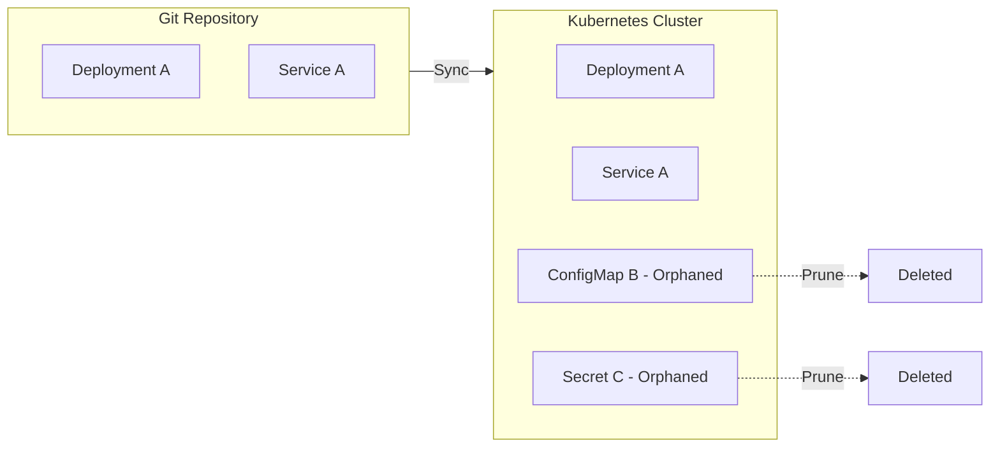
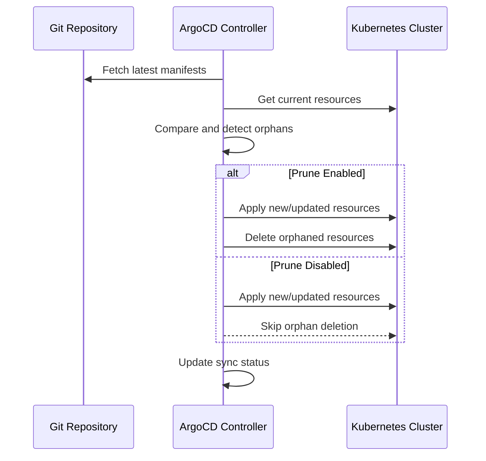
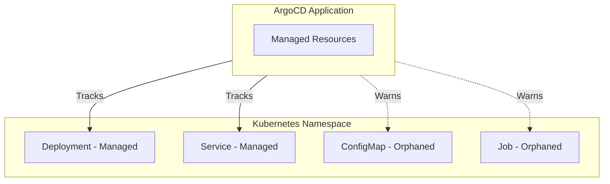
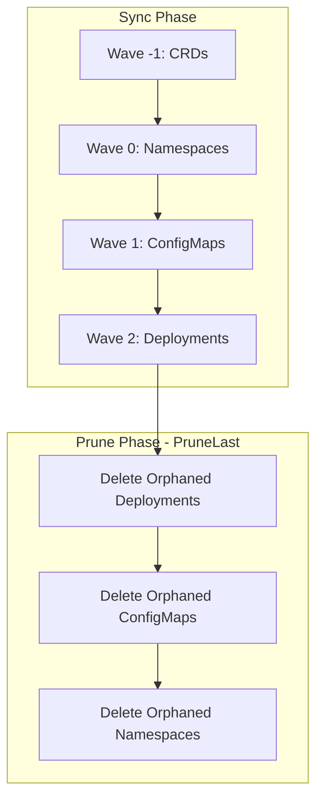

# How to Implement ArgoCD Prune Policy

Author: [nawazdhandala](https://github.com/nawazdhandala)

Tags: ArgoCD, GitOps, Kubernetes, Resource-Management

Description: Learn how to configure ArgoCD prune policies to automatically remove orphaned Kubernetes resources and keep your clusters clean.

---

When you delete a resource from your Git repository, ArgoCD does not automatically remove it from your cluster by default. This leads to orphaned resources, configuration drift, and wasted cluster resources. Prune policies solve this problem by automatically cleaning up resources that no longer exist in Git.

## What Is Pruning in ArgoCD?

Pruning is the process of deleting Kubernetes resources that exist in the cluster but are no longer defined in the Git repository. Without pruning, your cluster accumulates stale resources over time.



## Enabling Automatic Pruning

There are multiple ways to enable pruning in ArgoCD, from CLI commands to declarative YAML configurations.

### Option 1: Enable via CLI

When creating an application, you can enable automatic pruning with the `--auto-prune` flag.

```bash
argocd app create myapp \
  --repo https://github.com/myorg/myapp.git \
  --path k8s/production \
  --dest-server https://kubernetes.default.svc \
  --dest-namespace production \
  --sync-policy automated \
  --auto-prune \
  --self-heal
```

### Option 2: Enable via Application YAML

For declarative GitOps, define prune settings in your Application manifest. Setting `prune: true` in the `syncPolicy.automated` section enables automatic pruning.

```yaml
apiVersion: argoproj.io/v1alpha1
kind: Application
metadata:
  name: myapp
  namespace: argocd
spec:
  project: default
  source:
    repoURL: https://github.com/myorg/myapp.git
    targetRevision: HEAD
    path: k8s/production
  destination:
    server: https://kubernetes.default.svc
    namespace: production
  syncPolicy:
    automated:
      prune: true      # Enable automatic pruning
      selfHeal: true   # Revert manual changes
    syncOptions:
      - CreateNamespace=true
```

### Option 3: Enable Pruning on Existing Apps

If you have an existing application, you can enable pruning using the CLI.

```bash
# Enable auto-prune on existing application
argocd app set myapp --auto-prune

# Verify the setting
argocd app get myapp
```

## Understanding Prune Behavior

ArgoCD's pruning behavior follows a specific sequence during synchronization. Understanding this flow helps you configure pruning safely.



## Sync Options for Pruning Control

ArgoCD provides several sync options to fine-tune pruning behavior. These options give you granular control over when and how resources are pruned.

### PruneLast

The `PruneLast` option ensures resources are deleted only after all other resources are successfully synced. This prevents issues where a resource is deleted before its replacement is ready.

```yaml
apiVersion: argoproj.io/v1alpha1
kind: Application
metadata:
  name: myapp
  namespace: argocd
spec:
  source:
    repoURL: https://github.com/myorg/myapp.git
    path: k8s/production
  destination:
    server: https://kubernetes.default.svc
    namespace: production
  syncPolicy:
    automated:
      prune: true
    syncOptions:
      - PruneLast=true   # Delete orphans after successful sync
```

### PrunePropagationPolicy

Control how Kubernetes handles dependent resources when a parent is pruned. The propagation policy determines whether child resources are deleted along with the parent.

```yaml
apiVersion: argoproj.io/v1alpha1
kind: Application
metadata:
  name: myapp
  namespace: argocd
spec:
  syncPolicy:
    automated:
      prune: true
    syncOptions:
      - PrunePropagationPolicy=foreground  # Wait for children to delete
```

Available propagation policies:
- `foreground` - Delete children first, then parent (blocking)
- `background` - Delete parent first, children asynchronously
- `orphan` - Delete parent only, leave children

### Selective Resource Pruning

Apply prune settings to specific resource types using annotations. This annotation on individual resources can override the application-level prune setting.

```yaml
apiVersion: v1
kind: ConfigMap
metadata:
  name: legacy-config
  annotations:
    argocd.argoproj.io/sync-options: Prune=false
data:
  key: value
```

## Protecting Resources from Pruning

Sometimes you need to prevent certain resources from being pruned, even when they are removed from Git.

### Using the Prune Annotation

Add the `argocd.argoproj.io/sync-options: Prune=false` annotation to protect a resource from automatic pruning.

```yaml
apiVersion: v1
kind: PersistentVolumeClaim
metadata:
  name: database-pvc
  annotations:
    argocd.argoproj.io/sync-options: Prune=false
spec:
  accessModes:
    - ReadWriteOnce
  resources:
    requests:
      storage: 100Gi
```

### Project-Level Resource Protection

Define protected resources at the project level to prevent accidental deletion of critical resource types.

```yaml
apiVersion: argoproj.io/v1alpha1
kind: AppProject
metadata:
  name: production
  namespace: argocd
spec:
  description: Production applications
  sourceRepos:
    - '*'
  destinations:
    - namespace: '*'
      server: https://kubernetes.default.svc
  # Prevent pruning of these resource types
  orphanedResources:
    warn: true   # Warn about orphaned resources
    ignore:
      - group: ""
        kind: PersistentVolumeClaim
      - group: ""
        kind: Secret
        name: "database-*"
```

## Handling Orphaned Resources

ArgoCD can monitor and report orphaned resources in your namespace. Orphaned resources are those that exist in the cluster but are not managed by any ArgoCD application.



### Enable Orphaned Resource Monitoring

Configure your AppProject to detect and optionally warn about orphaned resources.

```yaml
apiVersion: argoproj.io/v1alpha1
kind: AppProject
metadata:
  name: team-backend
  namespace: argocd
spec:
  orphanedResources:
    warn: true   # Show warnings in UI and CLI
    ignore:
      - group: batch
        kind: Job    # Ignore completed jobs
      - group: ""
        kind: Event  # Ignore events
```

### View Orphaned Resources

Use the ArgoCD CLI to list orphaned resources in a project.

```bash
# List orphaned resources
argocd proj get team-backend

# Detailed orphaned resource information
argocd app resources myapp --orphaned
```

## Prune Policy Strategies

Different applications require different pruning strategies based on their risk profile and requirements.

### Strategy 1: Aggressive Pruning for Stateless Apps

For stateless applications where all resources can be safely recreated, enable full automatic pruning.

```yaml
apiVersion: argoproj.io/v1alpha1
kind: Application
metadata:
  name: frontend-app
  namespace: argocd
spec:
  source:
    repoURL: https://github.com/myorg/frontend.git
    path: k8s
  destination:
    server: https://kubernetes.default.svc
    namespace: frontend
  syncPolicy:
    automated:
      prune: true
      selfHeal: true
      allowEmpty: false  # Prevent sync if no resources found
    syncOptions:
      - PruneLast=true
```

### Strategy 2: Conservative Pruning for Stateful Apps

For applications with persistent data, be more cautious with pruning to prevent data loss.

```yaml
apiVersion: argoproj.io/v1alpha1
kind: Application
metadata:
  name: database-app
  namespace: argocd
spec:
  source:
    repoURL: https://github.com/myorg/database.git
    path: k8s
  destination:
    server: https://kubernetes.default.svc
    namespace: database
  syncPolicy:
    automated:
      prune: false    # Manual pruning only
      selfHeal: true
    syncOptions:
      - RespectIgnoreDifferences=true
```

### Strategy 3: Manual Pruning with Warnings

For high-risk environments, disable automatic pruning but enable orphaned resource warnings.

```yaml
apiVersion: argoproj.io/v1alpha1
kind: Application
metadata:
  name: critical-app
  namespace: argocd
spec:
  syncPolicy:
    automated:
      prune: false   # No auto-prune
      selfHeal: true
```

Manually trigger pruning when needed:

```bash
# Dry run to see what would be pruned
argocd app sync critical-app --prune --dry-run

# Execute prune
argocd app sync critical-app --prune
```

## Finalizers and Prune Cascading

ArgoCD uses finalizers to control what happens when an Application is deleted. The cascade option determines whether managed resources are also deleted.

### Understanding Application Finalizers

The `resources-finalizer.argocd.argoproj.io` finalizer controls cascade deletion.

```yaml
apiVersion: argoproj.io/v1alpha1
kind: Application
metadata:
  name: myapp
  namespace: argocd
  finalizers:
    - resources-finalizer.argocd.argoproj.io  # Enable cascade delete
spec:
  project: default
  source:
    repoURL: https://github.com/myorg/myapp.git
    path: k8s
  destination:
    server: https://kubernetes.default.svc
    namespace: production
```

### Cascade Deletion Options

When deleting an application, choose whether to delete managed resources.

```bash
# Delete app AND all managed resources (cascade)
argocd app delete myapp --cascade

# Delete app only, leave resources in cluster
argocd app delete myapp --cascade=false

# Force delete stuck application
argocd app delete myapp --cascade --force
```

## Troubleshooting Prune Issues

### Resources Not Being Pruned

If resources are not being pruned as expected, check these common issues.

```bash
# Check if prune is enabled
argocd app get myapp -o yaml | grep -A5 syncPolicy

# Check sync status
argocd app get myapp

# Look for resources with prune protection
kubectl get all -n production -o yaml | grep "Prune=false"
```

### Prune Fails Due to Finalizers

Resources with finalizers may block pruning. Identify and handle stuck resources.

```bash
# Find resources with finalizers
kubectl get all -n production -o json | jq '.items[] | select(.metadata.finalizers) | {name: .metadata.name, finalizers: .metadata.finalizers}'

# Remove finalizer if safe (use with caution)
kubectl patch configmap stuck-resource -n production \
  --type json \
  --patch='[{"op": "remove", "path": "/metadata/finalizers"}]'
```

### Sync Wave and Prune Order Issues

Resources with sync waves may cause prune order problems. Use the diagram below to understand the sync and prune sequence.



## Best Practices

### 1. Always Use PruneLast in Production

Ensure resources are synced before orphans are deleted.

```yaml
syncOptions:
  - PruneLast=true
```

### 2. Protect Persistent Storage

Never auto-prune PVCs without explicit review.

```yaml
apiVersion: v1
kind: PersistentVolumeClaim
metadata:
  annotations:
    argocd.argoproj.io/sync-options: Prune=false
```

### 3. Test Prune Behavior in Staging

Always verify prune policies in non-production environments first.

```bash
# Test in staging
argocd app sync staging-app --prune --dry-run

# Review what would be deleted
argocd app diff staging-app
```

### 4. Monitor Orphaned Resources

Enable orphaned resource warnings at the project level.

```yaml
orphanedResources:
  warn: true
```

### 5. Document Prune Exceptions

Add comments explaining why resources are protected from pruning.

```yaml
apiVersion: v1
kind: Secret
metadata:
  name: encryption-key
  annotations:
    # Protected: Contains encryption keys that cannot be recreated
    argocd.argoproj.io/sync-options: Prune=false
```

## Complete Example: Production Application

Here is a complete Application manifest with recommended prune settings for production workloads.

```yaml
apiVersion: argoproj.io/v1alpha1
kind: Application
metadata:
  name: production-api
  namespace: argocd
  finalizers:
    - resources-finalizer.argocd.argoproj.io
spec:
  project: production
  source:
    repoURL: https://github.com/myorg/api.git
    targetRevision: main
    path: k8s/overlays/production
  destination:
    server: https://kubernetes.default.svc
    namespace: production
  syncPolicy:
    automated:
      prune: true
      selfHeal: true
      allowEmpty: false
    syncOptions:
      - CreateNamespace=true
      - PruneLast=true
      - PrunePropagationPolicy=foreground
      - Validate=true
    retry:
      limit: 5
      backoff:
        duration: 5s
        factor: 2
        maxDuration: 3m
  ignoreDifferences:
    - group: apps
      kind: Deployment
      jsonPointers:
        - /spec/replicas
```

---

Proper prune policies are essential for maintaining clean Kubernetes clusters in a GitOps workflow. Start with conservative settings, enable orphaned resource warnings, and protect your persistent storage. As you gain confidence in your GitOps processes, gradually enable more aggressive pruning for stateless workloads while keeping safeguards for critical resources.
