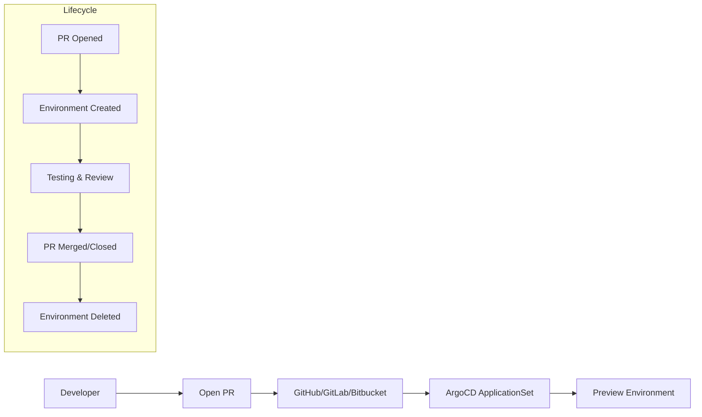
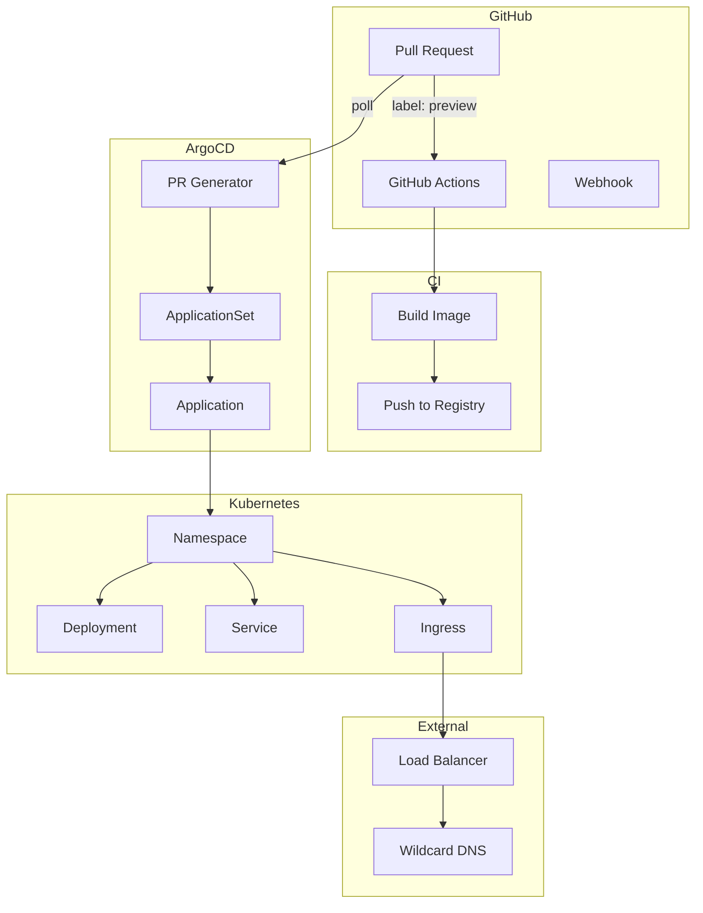

# How to Build ArgoCD Pull Request Generator

Author: [nawazdhandala](https://github.com/nawazdhandala)

Tags: ArgoCD, GitOps, Kubernetes, PR-Environments

Description: Learn how to automatically create ephemeral preview environments for every pull request using ArgoCD's Pull Request Generator.

---

Testing changes in isolation before merging is critical for software quality. ArgoCD's Pull Request Generator automatically creates and destroys preview environments for each PR, giving developers and reviewers a live environment to test changes.

## What Is the Pull Request Generator?

The Pull Request Generator is part of ArgoCD ApplicationSets. It monitors your Git repository for open pull requests and dynamically creates ArgoCD Applications for each one. When the PR is merged or closed, the corresponding environment is automatically deleted.



## Prerequisites

Before setting up the Pull Request Generator, ensure you have:

- ArgoCD installed in your Kubernetes cluster
- ApplicationSet controller enabled (included by default in ArgoCD 2.3+)
- A Git repository with Kubernetes manifests
- Repository credentials configured in ArgoCD

## Configuring GitHub Integration

The Pull Request Generator needs access to your GitHub repository to detect open pull requests. Create a GitHub token and configure it in ArgoCD.

First, create a GitHub personal access token with `repo` scope. Then add the repository to ArgoCD with the token.

```bash
argocd repo add https://github.com/myorg/myapp.git \
  --username git \
  --password ghp_your_github_token
```

Alternatively, create the repository secret declaratively.

```yaml
apiVersion: v1
kind: Secret
metadata:
  name: myapp-repo
  namespace: argocd
  labels:
    argocd.argoproj.io/secret-type: repository
stringData:
  type: git
  url: https://github.com/myorg/myapp.git
  password: ghp_your_github_token
  username: git
```

## Basic Pull Request Generator

This ApplicationSet creates a preview environment for every open pull request in your repository.

```yaml
apiVersion: argoproj.io/v1alpha1
kind: ApplicationSet
metadata:
  name: myapp-preview
  namespace: argocd
spec:
  generators:
    - pullRequest:
        github:
          owner: myorg
          repo: myapp
          tokenRef:
            secretName: github-token
            key: token
        requeueAfterSeconds: 60
  template:
    metadata:
      name: 'myapp-pr-{{number}}'
    spec:
      project: default
      source:
        repoURL: https://github.com/myorg/myapp.git
        targetRevision: '{{head_sha}}'
        path: k8s/overlays/preview
      destination:
        server: https://kubernetes.default.svc
        namespace: 'preview-{{number}}'
      syncPolicy:
        automated:
          prune: true
          selfHeal: true
        syncOptions:
          - CreateNamespace=true
```

The generator provides several template variables you can use.

| Variable | Description |
|----------|-------------|
| `{{number}}` | Pull request number |
| `{{branch}}` | Source branch name |
| `{{branch_slug}}` | URL-safe branch name |
| `{{head_sha}}` | Commit SHA of the PR head |
| `{{head_short_sha}}` | Short commit SHA (7 characters) |
| `{{labels}}` | PR labels as comma-separated string |

## Filtering Pull Requests by Labels

You may not want preview environments for every PR. Use label filters to control which PRs get environments.

This configuration only creates environments for PRs with the `preview` label.

```yaml
apiVersion: argoproj.io/v1alpha1
kind: ApplicationSet
metadata:
  name: myapp-preview
  namespace: argocd
spec:
  generators:
    - pullRequest:
        github:
          owner: myorg
          repo: myapp
          tokenRef:
            secretName: github-token
            key: token
          labels:
            - preview
        requeueAfterSeconds: 60
  template:
    metadata:
      name: 'myapp-pr-{{number}}'
    spec:
      project: default
      source:
        repoURL: https://github.com/myorg/myapp.git
        targetRevision: '{{head_sha}}'
        path: k8s/overlays/preview
      destination:
        server: https://kubernetes.default.svc
        namespace: 'preview-{{number}}'
      syncPolicy:
        automated:
          prune: true
          selfHeal: true
        syncOptions:
          - CreateNamespace=true
```

## Repository Structure for PR Environments

Organize your repository with a dedicated overlay for preview environments. This allows you to customize resource limits, replicas, and other settings specifically for previews.

```
myapp/
├── k8s/
│   ├── base/
│   │   ├── kustomization.yaml
│   │   ├── deployment.yaml
│   │   ├── service.yaml
│   │   └── ingress.yaml
│   └── overlays/
│       ├── production/
│       │   └── kustomization.yaml
│       ├── staging/
│       │   └── kustomization.yaml
│       └── preview/
│           ├── kustomization.yaml
│           └── patch-resources.yaml
└── .github/
    └── workflows/
        └── build.yml
```

The preview overlay should use minimal resources since these environments are temporary.

```yaml
# k8s/overlays/preview/kustomization.yaml
apiVersion: kustomize.config.k8s.io/v1beta1
kind: Kustomization
resources:
  - ../../base
patches:
  - patch-resources.yaml
```

```yaml
# k8s/overlays/preview/patch-resources.yaml
apiVersion: apps/v1
kind: Deployment
metadata:
  name: myapp
spec:
  replicas: 1
  template:
    spec:
      containers:
        - name: myapp
          resources:
            requests:
              cpu: 50m
              memory: 64Mi
            limits:
              cpu: 200m
              memory: 256Mi
```

## Dynamic Ingress for PR Environments

Each preview environment needs a unique URL. Use Kustomize replacements or Helm values to dynamically set the hostname.

Create an ingress template that uses the PR number in the hostname.

```yaml
# k8s/base/ingress.yaml
apiVersion: networking.k8s.io/v1
kind: Ingress
metadata:
  name: myapp
  annotations:
    cert-manager.io/cluster-issuer: letsencrypt-prod
spec:
  ingressClassName: nginx
  tls:
    - hosts:
        - myapp.example.com
      secretName: myapp-tls
  rules:
    - host: myapp.example.com
      http:
        paths:
          - path: /
            pathType: Prefix
            backend:
              service:
                name: myapp
                port:
                  number: 80
```

For previews, override the hostname using Kustomize replacements.

```yaml
# k8s/overlays/preview/kustomization.yaml
apiVersion: kustomize.config.k8s.io/v1beta1
kind: Kustomization
resources:
  - ../../base
patches:
  - patch-resources.yaml
  - target:
      kind: Ingress
      name: myapp
    patch: |-
      - op: replace
        path: /spec/rules/0/host
        value: pr-PLACEHOLDER.preview.example.com
      - op: replace
        path: /spec/tls/0/hosts/0
        value: pr-PLACEHOLDER.preview.example.com
      - op: replace
        path: /spec/tls/0/secretName
        value: myapp-pr-PLACEHOLDER-tls
```

Then use ArgoCD's source plugin or Helm to substitute the actual PR number.

## Using Helm for PR Environments

Helm provides more flexibility for parameterizing preview environments. Here is an ApplicationSet that passes the PR number as a Helm value.

```yaml
apiVersion: argoproj.io/v1alpha1
kind: ApplicationSet
metadata:
  name: myapp-preview
  namespace: argocd
spec:
  generators:
    - pullRequest:
        github:
          owner: myorg
          repo: myapp
          tokenRef:
            secretName: github-token
            key: token
          labels:
            - preview
        requeueAfterSeconds: 60
  template:
    metadata:
      name: 'myapp-pr-{{number}}'
      annotations:
        notifications.argoproj.io/subscribe.on-deployed.github: ""
    spec:
      project: default
      source:
        repoURL: https://github.com/myorg/myapp.git
        targetRevision: '{{head_sha}}'
        path: helm/myapp
        helm:
          values: |
            replicaCount: 1
            prNumber: "{{number}}"
            image:
              tag: "pr-{{number}}"
            ingress:
              enabled: true
              hosts:
                - host: pr-{{number}}.preview.example.com
                  paths:
                    - path: /
                      pathType: Prefix
            resources:
              requests:
                cpu: 50m
                memory: 64Mi
              limits:
                cpu: 200m
                memory: 256Mi
      destination:
        server: https://kubernetes.default.svc
        namespace: 'preview-{{number}}'
      syncPolicy:
        automated:
          prune: true
          selfHeal: true
        syncOptions:
          - CreateNamespace=true
```

## Building PR-Specific Container Images

Preview environments need container images built from the PR branch. Configure your CI pipeline to build and tag images with the PR number.

This GitHub Actions workflow builds an image when a PR is labeled with `preview`.

```yaml
# .github/workflows/build-preview.yml
name: Build Preview Image

on:
  pull_request:
    types: [labeled, synchronize]

jobs:
  build:
    if: contains(github.event.pull_request.labels.*.name, 'preview')
    runs-on: ubuntu-latest
    steps:
      - uses: actions/checkout@v4

      - name: Set up Docker Buildx
        uses: docker/setup-buildx-action@v3

      - name: Login to Container Registry
        uses: docker/login-action@v3
        with:
          registry: ghcr.io
          username: ${{ github.actor }}
          password: ${{ secrets.GITHUB_TOKEN }}

      - name: Build and push
        uses: docker/build-push-action@v5
        with:
          context: .
          push: true
          tags: |
            ghcr.io/${{ github.repository }}:pr-${{ github.event.pull_request.number }}
            ghcr.io/${{ github.repository }}:${{ github.sha }}
          cache-from: type=gha
          cache-to: type=gha,mode=max
```

## Complete Architecture

Here is how all the pieces fit together in a complete PR preview workflow.



## Notifications for PR Environments

Configure ArgoCD notifications to post the preview URL as a comment on the pull request.

First, set up the GitHub notification service.

```yaml
apiVersion: v1
kind: ConfigMap
metadata:
  name: argocd-notifications-cm
  namespace: argocd
data:
  service.github: |
    appID: "123456"
    installationID: "12345678"
    privateKey: $github-privateKey

  template.pr-deployed: |
    message: |
      ## Preview Environment Ready

      Your preview environment has been deployed and is available at:

      **URL:** https://pr-{{.app.metadata.labels.prNumber}}.preview.example.com

      **Commit:** {{.app.status.sync.revision}}

      The environment will be automatically deleted when this PR is closed.

  trigger.on-deployed: |
    - description: Application is synced and healthy
      send:
        - pr-deployed
      when: app.status.operationState.phase in ['Succeeded'] and app.status.health.status == 'Healthy'
```

Add the trigger subscription to your ApplicationSet template.

```yaml
template:
  metadata:
    name: 'myapp-pr-{{number}}'
    labels:
      prNumber: '{{number}}'
    annotations:
      notifications.argoproj.io/subscribe.on-deployed.github: ""
```

## GitLab Integration

The Pull Request Generator also supports GitLab. Replace the GitHub configuration with GitLab settings.

```yaml
apiVersion: argoproj.io/v1alpha1
kind: ApplicationSet
metadata:
  name: myapp-preview
  namespace: argocd
spec:
  generators:
    - pullRequest:
        gitlab:
          project: mygroup/myapp
          api: https://gitlab.com
          tokenRef:
            secretName: gitlab-token
            key: token
          labels:
            - preview
        requeueAfterSeconds: 60
  template:
    metadata:
      name: 'myapp-mr-{{number}}'
    spec:
      project: default
      source:
        repoURL: https://gitlab.com/mygroup/myapp.git
        targetRevision: '{{head_sha}}'
        path: k8s/overlays/preview
      destination:
        server: https://kubernetes.default.svc
        namespace: 'preview-{{number}}'
      syncPolicy:
        automated:
          prune: true
          selfHeal: true
        syncOptions:
          - CreateNamespace=true
```

## Bitbucket Integration

For Bitbucket Server or Data Center, use the Bitbucket generator.

```yaml
apiVersion: argoproj.io/v1alpha1
kind: ApplicationSet
metadata:
  name: myapp-preview
  namespace: argocd
spec:
  generators:
    - pullRequest:
        bitbucketServer:
          api: https://bitbucket.mycompany.com
          project: MYPROJ
          repo: myapp
          basicAuth:
            username: git
            passwordRef:
              secretName: bitbucket-token
              key: token
        requeueAfterSeconds: 60
  template:
    metadata:
      name: 'myapp-pr-{{number}}'
    spec:
      project: default
      source:
        repoURL: https://bitbucket.mycompany.com/scm/MYPROJ/myapp.git
        targetRevision: '{{head_sha}}'
        path: k8s/overlays/preview
      destination:
        server: https://kubernetes.default.svc
        namespace: 'preview-{{number}}'
      syncPolicy:
        automated:
          prune: true
          selfHeal: true
        syncOptions:
          - CreateNamespace=true
```

## Resource Cleanup and Limits

Preview environments can consume significant cluster resources. Implement safeguards to prevent runaway costs.

### Namespace Resource Quotas

Apply resource quotas to preview namespaces to limit their resource consumption.

```yaml
apiVersion: v1
kind: ResourceQuota
metadata:
  name: preview-quota
spec:
  hard:
    requests.cpu: "500m"
    requests.memory: 512Mi
    limits.cpu: "1"
    limits.memory: 1Gi
    pods: "10"
```

Include this quota in your preview overlay so it is created with each environment.

### Automatic Stale PR Cleanup

Configure ArgoCD to delete applications for PRs that have been inactive for too long using the `requeueAfterSeconds` setting and checking PR activity.

For additional cleanup, use a CronJob that checks for stale preview namespaces.

```yaml
apiVersion: batch/v1
kind: CronJob
metadata:
  name: cleanup-stale-previews
  namespace: argocd
spec:
  schedule: "0 */6 * * *"
  jobTemplate:
    spec:
      template:
        spec:
          serviceAccountName: preview-cleanup
          containers:
            - name: cleanup
              image: bitnami/kubectl:latest
              command:
                - /bin/sh
                - -c
                - |
                  for ns in $(kubectl get ns -l type=preview -o name); do
                    age=$(kubectl get $ns -o jsonpath='{.metadata.creationTimestamp}')
                    # Delete namespaces older than 7 days
                    if [ $(date -d "$age" +%s) -lt $(date -d "7 days ago" +%s) ]; then
                      kubectl delete $ns
                    fi
                  done
          restartPolicy: OnFailure
```

## Troubleshooting

### PR Not Detected

If ArgoCD is not detecting your pull requests, check these common issues.

Verify the token has correct permissions.

```bash
# Test GitHub API access
curl -H "Authorization: token ghp_your_token" \
  https://api.github.com/repos/myorg/myapp/pulls
```

Check ApplicationSet controller logs.

```bash
kubectl logs -n argocd -l app.kubernetes.io/name=argocd-applicationset-controller
```

### Environment Not Deploying

If the Application is created but not syncing, check the Application status.

```bash
argocd app get myapp-pr-123
argocd app sync myapp-pr-123 --dry-run
```

### Image Not Found

Ensure your CI pipeline completes before ArgoCD tries to sync. Add an image pull backoff or use sync waves.

```yaml
template:
  spec:
    syncPolicy:
      retry:
        limit: 5
        backoff:
          duration: 30s
          factor: 2
          maxDuration: 5m
```

---

The Pull Request Generator transforms your development workflow by providing isolated, production-like environments for every change. Start with a basic configuration, then add notifications, resource limits, and custom domains as your team adopts the workflow. The investment in automated preview environments pays off with faster reviews, fewer bugs reaching production, and happier developers.
