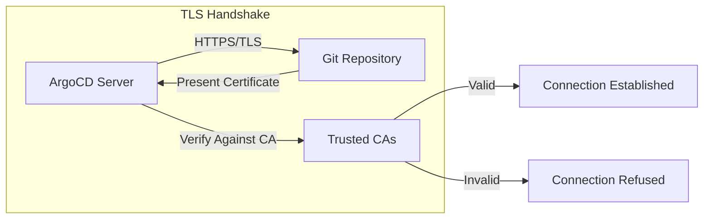
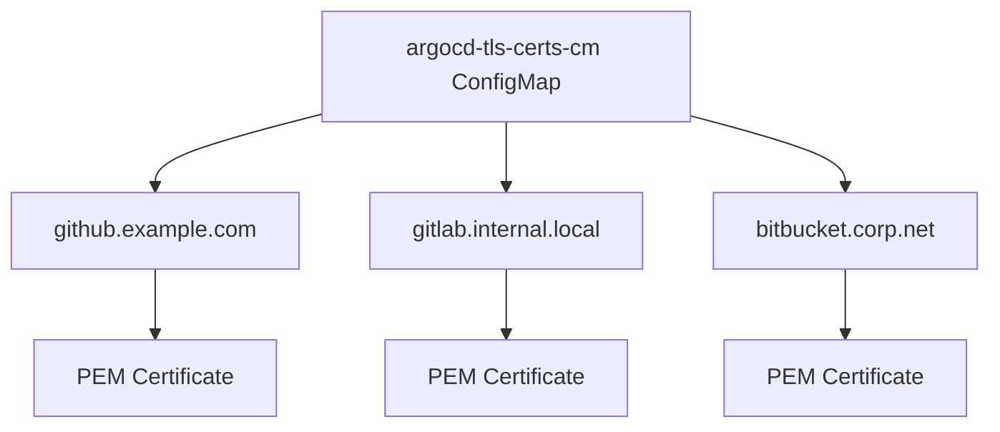
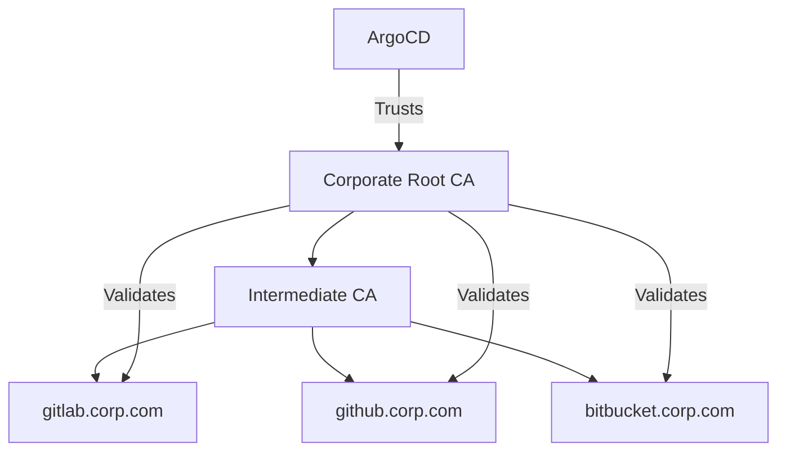
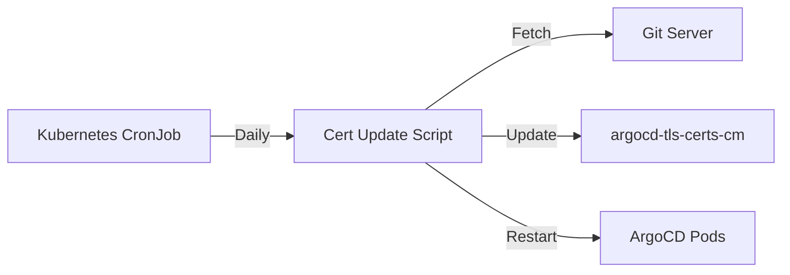

# How to Build ArgoCD Repository Certificates

Author: [nawazdhandala](https://github.com/nawazdhandala)

Tags: ArgoCD, GitOps, TLS, Security

Description: Learn how to configure and manage TLS certificates for secure Git repository connections in ArgoCD.

---

ArgoCD needs to trust your Git repositories to pull manifests securely. When your repositories use self-signed certificates or private CAs, you need to configure ArgoCD to recognize them. This guide covers everything from basic certificate setup to advanced scenarios like multi-repository configurations.

## Why Repository Certificates Matter



Without proper certificate configuration:
- ArgoCD cannot connect to repositories with self-signed certificates
- Private CA-signed certificates will fail verification
- Sync operations will fail with TLS errors

## Understanding ArgoCD Certificate Storage

ArgoCD stores repository certificates in a ConfigMap called `argocd-tls-certs-cm`. This ConfigMap lives in the ArgoCD namespace and contains PEM-encoded certificates keyed by the repository hostname.



## Getting the Server Certificate

Before adding a certificate to ArgoCD, you need to extract it from your Git server.

Use openssl to connect to the server and retrieve its certificate chain.

```bash
openssl s_client -connect gitlab.example.com:443 -showcerts </dev/null 2>/dev/null | \
  openssl x509 -outform PEM > gitlab-cert.pem
```

For servers behind a proxy or with SNI requirements, specify the servername explicitly.

```bash
openssl s_client -connect gitlab.example.com:443 \
  -servername gitlab.example.com \
  -showcerts </dev/null 2>/dev/null | \
  openssl x509 -outform PEM > gitlab-cert.pem
```

To get the full certificate chain including intermediate certificates, save all certificates from the output.

```bash
openssl s_client -connect gitlab.example.com:443 -showcerts </dev/null 2>/dev/null | \
  awk '/BEGIN CERTIFICATE/,/END CERTIFICATE/{ print }' > gitlab-chain.pem
```

## Adding Certificates via ConfigMap

The most common method is creating or updating the `argocd-tls-certs-cm` ConfigMap directly.

Create a ConfigMap with your certificate. The key must match the exact hostname used in your repository URL.

```yaml
apiVersion: v1
kind: ConfigMap
metadata:
  name: argocd-tls-certs-cm
  namespace: argocd
  labels:
    app.kubernetes.io/name: argocd-tls-certs-cm
    app.kubernetes.io/part-of: argocd
data:
  gitlab.example.com: |
    -----BEGIN CERTIFICATE-----
    MIIFazCCA1OgAwIBAgIUEJLHzR3fqBgPKvPZgJuXqlHYyN4wDQYJKoZIhvcNAQEL
    BQAwRTELMAkGA1UEBhMCVVMxEzARBgNVBAgMClNvbWUtU3RhdGUxITAfBgNVBAoM
    GEludGVybmV0IFdpZGdpdHMgUHR5IEx0ZDAeFw0yNDAxMDEwMDAwMDBaFw0yNTAx
    ...
    -----END CERTIFICATE-----
```

Apply the ConfigMap to your cluster.

```bash
kubectl apply -f argocd-tls-certs-cm.yaml
```

## Adding Certificates via ArgoCD CLI

The ArgoCD CLI provides a convenient way to add certificates without manually editing ConfigMaps.

Add a certificate for a specific repository server.

```bash
argocd cert add-tls gitlab.example.com --from gitlab-cert.pem
```

List all configured certificates to verify the addition.

```bash
argocd cert list --cert-type https
```

Remove a certificate if it is no longer needed.

```bash
argocd cert rm gitlab.example.com --cert-type https
```

## Adding Multiple Certificates

When working with multiple Git servers, add all certificates to the same ConfigMap.

```yaml
apiVersion: v1
kind: ConfigMap
metadata:
  name: argocd-tls-certs-cm
  namespace: argocd
  labels:
    app.kubernetes.io/name: argocd-tls-certs-cm
    app.kubernetes.io/part-of: argocd
data:
  gitlab.example.com: |
    -----BEGIN CERTIFICATE-----
    MIIFazCCA1OgAwIBAgIUEJLHzR3fqBgPKvPZgJuXqlHYyN4wDQYJKoZIhvcNAQEL
    ...
    -----END CERTIFICATE-----
  github.internal.corp: |
    -----BEGIN CERTIFICATE-----
    MIIFbzCCA1egAwIBAgIUKJ8hz2n4qBgPKvPZgJuXqlHYyN4wDQYJKoZIhvcNAQEL
    ...
    -----END CERTIFICATE-----
  bitbucket.private.net: |
    -----BEGIN CERTIFICATE-----
    MIIFczCCA1ugAwIBAgIURPL7zR3fqBgPKvPZgJuXqlHYyN4wDQYJKoZIhvcNAQEL
    ...
    -----END CERTIFICATE-----
```

## Using a Corporate CA Certificate

If your organization uses a private Certificate Authority, add the CA certificate instead of individual server certificates.



Add the CA certificate to the ConfigMap using a wildcard-style key or the specific hostname.

```yaml
apiVersion: v1
kind: ConfigMap
metadata:
  name: argocd-tls-certs-cm
  namespace: argocd
data:
  gitlab.corp.com: |
    -----BEGIN CERTIFICATE-----
    # Your Corporate CA Certificate
    MIIFazCCA1OgAwIBAgIUEJLHzR3fqBgPKvPZgJuXqlHYyN4wDQYJKoZIhvcNAQEL
    ...
    -----END CERTIFICATE-----
```

## Certificate Chain Configuration

When your Git server presents an incomplete certificate chain, you may need to provide the full chain.

Concatenate certificates in order from server certificate to root CA.

```bash
cat server-cert.pem intermediate-ca.pem root-ca.pem > full-chain.pem
```

The ConfigMap should contain the complete chain.

```yaml
apiVersion: v1
kind: ConfigMap
metadata:
  name: argocd-tls-certs-cm
  namespace: argocd
data:
  gitlab.example.com: |
    -----BEGIN CERTIFICATE-----
    # Server Certificate
    MIIFazCCA1OgAwIBAgIUEJLHzR3fqBgPKvPZgJuXqlHYyN4wDQYJKoZIhvcNAQEL
    ...
    -----END CERTIFICATE-----
    -----BEGIN CERTIFICATE-----
    # Intermediate CA
    MIIFbzCCA1egAwIBAgIUKJ8hz2n4qBgPKvPZgJuXqlHYyN4wDQYJKoZIhvcNAQEL
    ...
    -----END CERTIFICATE-----
    -----BEGIN CERTIFICATE-----
    # Root CA
    MIIFczCCA1ugAwIBAgIURPL7zR3fqBgPKvPZgJuXqlHYyN4wDQYJKoZIhvcNAQEL
    ...
    -----END CERTIFICATE-----
```

## Configuring Certificates with Helm

When installing ArgoCD via Helm, you can configure certificates in the values file.

```yaml
# values.yaml
configs:
  tls:
    certificates:
      gitlab.example.com: |
        -----BEGIN CERTIFICATE-----
        MIIFazCCA1OgAwIBAgIUEJLHzR3fqBgPKvPZgJuXqlHYyN4wDQYJKoZIhvcNAQEL
        ...
        -----END CERTIFICATE-----
```

Install or upgrade ArgoCD with the custom values.

```bash
helm upgrade --install argocd argo/argo-cd \
  --namespace argocd \
  --create-namespace \
  -f values.yaml
```

## Automating Certificate Rotation

Certificates expire. Automate rotation to avoid sync failures.



Create a CronJob that periodically updates certificates.

```yaml
apiVersion: batch/v1
kind: CronJob
metadata:
  name: argocd-cert-refresh
  namespace: argocd
spec:
  schedule: "0 0 * * *"  # Daily at midnight
  jobTemplate:
    spec:
      template:
        spec:
          serviceAccountName: argocd-cert-updater
          containers:
            - name: cert-updater
              image: bitnami/kubectl:latest
              command:
                - /bin/bash
                - -c
                - |
                  # Fetch new certificate
                  CERT=$(echo | openssl s_client -connect gitlab.example.com:443 \
                    -servername gitlab.example.com 2>/dev/null | \
                    openssl x509 -outform PEM)

                  # Update ConfigMap
                  kubectl create configmap argocd-tls-certs-cm \
                    --from-literal="gitlab.example.com=$CERT" \
                    -n argocd \
                    --dry-run=client -o yaml | kubectl apply -f -

                  # Restart repo-server to pick up changes
                  kubectl rollout restart deployment argocd-repo-server -n argocd
          restartPolicy: OnFailure
```

Create the required ServiceAccount and RBAC permissions.

```yaml
apiVersion: v1
kind: ServiceAccount
metadata:
  name: argocd-cert-updater
  namespace: argocd
---
apiVersion: rbac.authorization.k8s.io/v1
kind: Role
metadata:
  name: argocd-cert-updater
  namespace: argocd
rules:
  - apiGroups: [""]
    resources: ["configmaps"]
    verbs: ["get", "create", "update", "patch"]
  - apiGroups: ["apps"]
    resources: ["deployments"]
    verbs: ["get", "patch"]
---
apiVersion: rbac.authorization.k8s.io/v1
kind: RoleBinding
metadata:
  name: argocd-cert-updater
  namespace: argocd
subjects:
  - kind: ServiceAccount
    name: argocd-cert-updater
roleRef:
  kind: Role
  name: argocd-cert-updater
  apiGroup: rbac.authorization.k8s.io
```

## Verifying Certificate Configuration

After adding certificates, verify they are correctly configured.

Check the ConfigMap contents.

```bash
kubectl get configmap argocd-tls-certs-cm -n argocd -o yaml
```

Test the repository connection using the ArgoCD CLI.

```bash
argocd repo add https://gitlab.example.com/myorg/myapp.git --username git --password $TOKEN
```

If the connection succeeds, the certificate is correctly configured. For debugging, check the repo-server logs.

```bash
kubectl logs -n argocd -l app.kubernetes.io/name=argocd-repo-server --tail=100
```

## Troubleshooting Common Issues

### Certificate Not Trusted

If ArgoCD reports certificate errors, verify the certificate matches the server.

```bash
# Get certificate from server
openssl s_client -connect gitlab.example.com:443 -showcerts </dev/null 2>/dev/null | \
  openssl x509 -noout -fingerprint -sha256

# Compare with configured certificate
kubectl get configmap argocd-tls-certs-cm -n argocd -o jsonpath='{.data.gitlab\.example\.com}' | \
  openssl x509 -noout -fingerprint -sha256
```

### Hostname Mismatch

The ConfigMap key must exactly match the hostname in your repository URL.

```yaml
# Repository URL: https://git.example.com/org/repo.git
# ConfigMap key must be: git.example.com

data:
  git.example.com: |  # Correct
    -----BEGIN CERTIFICATE-----
```

### Certificate Chain Issues

If the server sends an incomplete chain, verify you have all required certificates.

```bash
# Check the full chain
openssl s_client -connect gitlab.example.com:443 -showcerts </dev/null 2>/dev/null | \
  grep -E "(s:|i:)"
```

Include all missing certificates in your ConfigMap.

### Changes Not Taking Effect

ArgoCD caches certificates. Restart the repo-server after making changes.

```bash
kubectl rollout restart deployment argocd-repo-server -n argocd
```

## Disabling TLS Verification (Not Recommended)

In development environments, you may want to skip TLS verification. This is insecure and should never be used in production.

Configure the repository with TLS verification disabled.

```yaml
apiVersion: v1
kind: Secret
metadata:
  name: repo-gitlab-dev
  namespace: argocd
  labels:
    argocd.argoproj.io/secret-type: repository
stringData:
  type: git
  url: https://gitlab.dev.local/myorg/myapp.git
  username: git
  password: <token>
  insecure: "true"  # Disables TLS verification
```

Or via CLI.

```bash
argocd repo add https://gitlab.dev.local/myorg/myapp.git \
  --username git \
  --password $TOKEN \
  --insecure-skip-server-verification
```

## Best Practices

1. **Use CA certificates when possible** - Adding the CA certificate covers all servers signed by that CA
2. **Automate certificate rotation** - Set up monitoring and automated renewal before expiration
3. **Monitor certificate expiry** - Alert when certificates are approaching expiration
4. **Keep certificates in version control** - Store certificate configurations in Git (not the private keys)
5. **Use separate certificates per environment** - Development and production should have different certificates
6. **Test after certificate updates** - Always verify sync operations work after updating certificates

---

Properly configured repository certificates ensure secure communication between ArgoCD and your Git repositories. Start by extracting your server certificates, add them to the ConfigMap, and set up automated rotation to avoid surprises. With these practices in place, your GitOps pipeline will remain secure and reliable.
