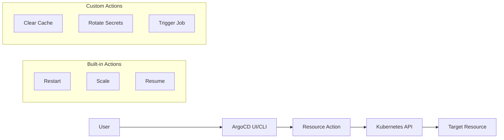
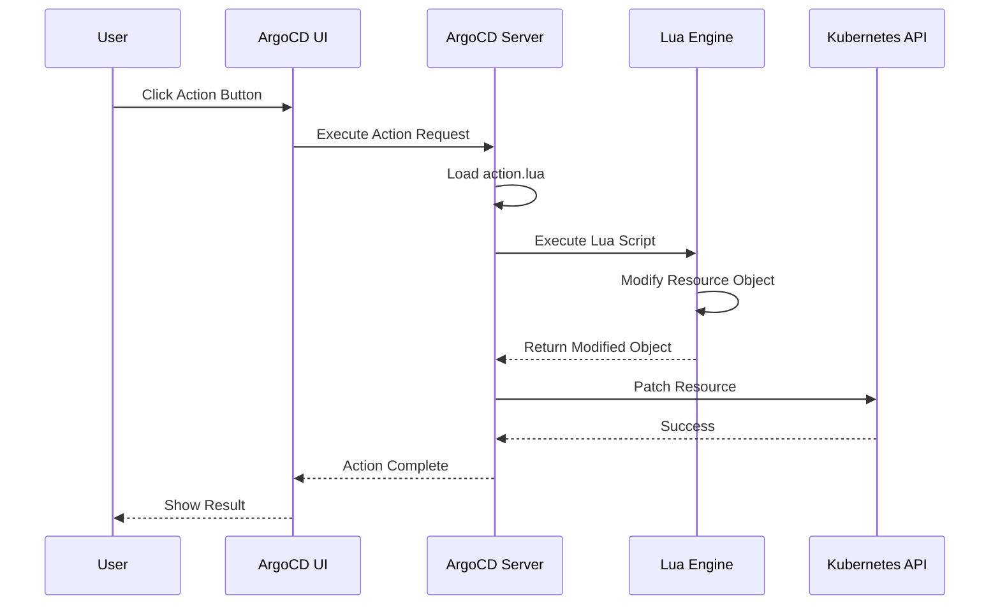

# How to Implement ArgoCD Resource Actions

Author: [nawazdhandala](https://github.com/nawazdhandala)

Tags: ArgoCD, GitOps, Kubernetes, Automation

Description: Learn how to implement custom resource actions in ArgoCD to extend Kubernetes resource management with one-click operations like restarts, scaling, and rollbacks.

---

ArgoCD resource actions let you perform operations on Kubernetes resources directly from the UI or CLI. Instead of opening a terminal and running kubectl commands, you can restart deployments, scale replicas, or trigger custom workflows with a single click.

## What Are Resource Actions?

Resource actions are custom operations you can execute on Kubernetes resources managed by ArgoCD. They bridge the gap between GitOps (declarative) and operational needs (imperative).



Common use cases include:

- **Restart Deployments** - Rolling restart without changing manifests
- **Scale Resources** - Temporary scaling for load testing
- **Resume Paused Rollouts** - Continue Argo Rollouts after analysis
- **Trigger Jobs** - Run one-off tasks like database migrations

## Built-in Resource Actions

ArgoCD ships with several built-in actions. Here are the most commonly used ones.

### Restart a Deployment

You can restart a deployment to pick up ConfigMap or Secret changes without modifying the Git repository.

```bash
# Using ArgoCD CLI
argocd app actions run myapp restart --kind Deployment --resource-name my-deployment

# This adds a restart annotation to trigger rolling restart
# kubectl equivalent:
kubectl rollout restart deployment/my-deployment -n production
```

### List Available Actions

To see what actions are available for resources in an application:

```bash
# List all available actions for an application
argocd app actions list myapp

# Output example:
# KIND        NAME            ACTION
# Deployment  my-deployment   restart
# Rollout     my-rollout      restart
# Rollout     my-rollout      resume
# Rollout     my-rollout      abort
# StatefulSet my-statefulset  restart
```

### Argo Rollouts Actions

If you use Argo Rollouts, additional actions become available:

```bash
# Resume a paused rollout
argocd app actions run myapp resume --kind Rollout --resource-name my-rollout

# Abort a rollout and rollback
argocd app actions run myapp abort --kind Rollout --resource-name my-rollout

# Retry a failed rollout
argocd app actions run myapp retry --kind Rollout --resource-name my-rollout

# Promote to next step (skip analysis)
argocd app actions run myapp promote --kind Rollout --resource-name my-rollout
```

## Custom Resource Actions

The real power comes from defining your own actions. Custom actions are defined in the `argocd-cm` ConfigMap.

### Action Definition Structure

Custom actions use Lua scripts to define what happens when triggered. Here is the basic structure:

```yaml
apiVersion: v1
kind: ConfigMap
metadata:
  name: argocd-cm
  namespace: argocd
data:
  resource.customizations.actions.apps_Deployment: |
    discovery.lua: |
      actions = {}
      actions["restart"] = {
        ["disabled"] = false
      }
      return actions
    definitions:
      - name: restart
        action.lua: |
          local os = require("os")
          if obj.spec.template.metadata == nil then
            obj.spec.template.metadata = {}
          end
          if obj.spec.template.metadata.annotations == nil then
            obj.spec.template.metadata.annotations = {}
          end
          obj.spec.template.metadata.annotations["kubectl.kubernetes.io/restartedAt"] = os.date("!%Y-%m-%dT%H:%M:%SZ")
          return obj
```

### Custom Action: Scale Deployment

Create an action that scales a deployment to a specific replica count. This shows how to handle action parameters:

```yaml
apiVersion: v1
kind: ConfigMap
metadata:
  name: argocd-cm
  namespace: argocd
data:
  resource.customizations.actions.apps_Deployment: |
    discovery.lua: |
      actions = {}
      actions["scale-up"] = {
        ["disabled"] = false
      }
      actions["scale-down"] = {
        ["disabled"] = false
      }
      actions["scale-to-zero"] = {
        ["disabled"] = false
      }
      return actions
    definitions:
      - name: scale-up
        action.lua: |
          local replicas = obj.spec.replicas or 1
          obj.spec.replicas = replicas + 1
          return obj
      - name: scale-down
        action.lua: |
          local replicas = obj.spec.replicas or 1
          if replicas > 1 then
            obj.spec.replicas = replicas - 1
          end
          return obj
      - name: scale-to-zero
        action.lua: |
          obj.spec.replicas = 0
          return obj
```

### Custom Action: Clear Redis Cache

Here is an example of a custom action for a Redis StatefulSet that triggers a cache flush:

```yaml
apiVersion: v1
kind: ConfigMap
metadata:
  name: argocd-cm
  namespace: argocd
data:
  resource.customizations.actions.apps_StatefulSet: |
    discovery.lua: |
      actions = {}
      -- Only show action for Redis StatefulSets
      if obj.metadata.labels ~= nil and obj.metadata.labels["app"] == "redis" then
        actions["flush-cache"] = {
          ["disabled"] = false
        }
      end
      return actions
    definitions:
      - name: flush-cache
        action.lua: |
          -- Add annotation to trigger cache flush job
          if obj.spec.template.metadata.annotations == nil then
            obj.spec.template.metadata.annotations = {}
          end
          obj.spec.template.metadata.annotations["redis.example.com/flush-requested"] = os.date("!%Y-%m-%dT%H:%M:%SZ")
          return obj
```

## Actions for Custom Resources

You can define actions for any custom resource, including CRDs from operators.

### Argo Rollouts Custom Actions

Define custom actions for Argo Rollouts beyond the built-in ones:

```yaml
apiVersion: v1
kind: ConfigMap
metadata:
  name: argocd-cm
  namespace: argocd
data:
  resource.customizations.actions.argoproj.io_Rollout: |
    discovery.lua: |
      actions = {}
      actions["full-promote"] = {
        ["disabled"] = false
      }
      actions["set-weight-50"] = {
        ["disabled"] = false
      }
      return actions
    definitions:
      - name: full-promote
        action.lua: |
          -- Skip all remaining steps and fully promote
          if obj.status ~= nil then
            obj.status.promoteFull = true
          end
          return obj
      - name: set-weight-50
        action.lua: |
          -- Set canary weight to 50%
          if obj.spec.strategy.canary ~= nil then
            obj.spec.strategy.canary.setWeight = 50
          end
          return obj
```

### Certificate Manager Actions

Create actions for cert-manager Certificate resources:

```yaml
apiVersion: v1
kind: ConfigMap
metadata:
  name: argocd-cm
  namespace: argocd
data:
  resource.customizations.actions.cert-manager.io_Certificate: |
    discovery.lua: |
      actions = {}
      actions["renew"] = {
        ["disabled"] = false
      }
      return actions
    definitions:
      - name: renew
        action.lua: |
          -- Trigger certificate renewal by updating annotation
          if obj.metadata.annotations == nil then
            obj.metadata.annotations = {}
          end
          obj.metadata.annotations["cert-manager.io/issuer-name"] = obj.spec.issuerRef.name
          return obj
```

## Conditional Action Availability

Actions can be conditionally enabled or disabled based on resource state.

### Disable Actions Based on Labels

Only show certain actions for resources with specific labels:

```yaml
discovery.lua: |
  actions = {}

  -- Only allow restart for non-production
  local env = ""
  if obj.metadata.labels ~= nil then
    env = obj.metadata.labels["env"] or ""
  end

  actions["restart"] = {
    ["disabled"] = (env == "production")
  }

  -- Scale actions only for scalable workloads
  local isScalable = obj.spec.replicas ~= nil
  actions["scale-up"] = {
    ["disabled"] = not isScalable
  }
  actions["scale-down"] = {
    ["disabled"] = not isScalable or (obj.spec.replicas or 0) <= 1
  }

  return actions
```

### Disable Actions Based on Health Status

Prevent actions on unhealthy resources:

```yaml
discovery.lua: |
  actions = {}

  -- Check if deployment is healthy
  local isHealthy = true
  if obj.status ~= nil then
    local available = obj.status.availableReplicas or 0
    local desired = obj.spec.replicas or 1
    isHealthy = available >= desired
  end

  actions["scale-down"] = {
    ["disabled"] = not isHealthy
  }

  return actions
```

## Resource Action Architecture

Understanding the flow helps with debugging and design.



## Advanced Lua Scripting

### Working with Nested Objects

Safely navigate nested structures in Lua:

```lua
action.lua: |
  -- Safe navigation helper
  local function safeGet(tbl, ...)
    local current = tbl
    for _, key in ipairs({...}) do
      if type(current) ~= "table" then
        return nil
      end
      current = current[key]
    end
    return current
  end

  -- Safe set helper
  local function safeSet(tbl, value, ...)
    local keys = {...}
    local current = tbl
    for i = 1, #keys - 1 do
      local key = keys[i]
      if current[key] == nil then
        current[key] = {}
      end
      current = current[key]
    end
    current[keys[#keys]] = value
  end

  -- Usage
  local replicas = safeGet(obj, "spec", "replicas") or 1
  safeSet(obj, replicas + 1, "spec", "replicas")

  return obj
```

### Generating Unique Values

Create unique identifiers for actions:

```lua
action.lua: |
  local function generateId()
    local template = 'xxxxxxxx-xxxx-4xxx-yxxx-xxxxxxxxxxxx'
    return string.gsub(template, '[xy]', function(c)
      local v = (c == 'x') and math.random(0, 15) or math.random(8, 11)
      return string.format('%x', v)
    end)
  end

  if obj.metadata.annotations == nil then
    obj.metadata.annotations = {}
  end
  obj.metadata.annotations["action-id"] = generateId()

  return obj
```

## Integration with CI/CD

### Triggering Actions from Pipelines

Use the ArgoCD CLI in your CI/CD pipelines:

```yaml
# GitHub Actions example
name: Deploy and Restart

on:
  push:
    branches: [main]

jobs:
  deploy:
    runs-on: ubuntu-latest
    steps:
      - name: Install ArgoCD CLI
        run: |
          curl -sSL -o argocd https://github.com/argoproj/argo-cd/releases/latest/download/argocd-linux-amd64
          chmod +x argocd
          sudo mv argocd /usr/local/bin/

      - name: Login to ArgoCD
        run: |
          argocd login ${{ secrets.ARGOCD_SERVER }} \
            --username ${{ secrets.ARGOCD_USERNAME }} \
            --password ${{ secrets.ARGOCD_PASSWORD }} \
            --insecure

      - name: Sync Application
        run: argocd app sync myapp --prune

      - name: Wait for Healthy
        run: argocd app wait myapp --health --timeout 300

      - name: Restart Deployment
        run: |
          argocd app actions run myapp restart \
            --kind Deployment \
            --resource-name my-deployment
```

### Using the ArgoCD API

For programmatic access, use the REST API:

```bash
# Get auth token
TOKEN=$(curl -s -X POST "https://argocd.example.com/api/v1/session" \
  -H "Content-Type: application/json" \
  -d '{"username":"admin","password":"secret"}' | jq -r '.token')

# Run action via API
curl -X POST "https://argocd.example.com/api/v1/applications/myapp/resource/actions" \
  -H "Authorization: Bearer $TOKEN" \
  -H "Content-Type: application/json" \
  -d '{
    "namespace": "production",
    "resourceName": "my-deployment",
    "group": "apps",
    "kind": "Deployment",
    "action": "restart"
  }'
```

## Best Practices

### 1. Document Your Actions

Add descriptions to help users understand what each action does:

```yaml
discovery.lua: |
  actions = {}
  actions["restart"] = {
    ["disabled"] = false,
    ["displayName"] = "Rolling Restart",
    ["description"] = "Triggers a rolling restart of all pods"
  }
  return actions
```

### 2. Add Safety Checks

Prevent accidental operations on critical resources:

```yaml
discovery.lua: |
  actions = {}

  -- Check for critical labels
  local isCritical = false
  if obj.metadata.labels ~= nil then
    isCritical = obj.metadata.labels["critical"] == "true"
  end

  -- Check for environment
  local isProd = false
  if obj.metadata.namespace ~= nil then
    isProd = string.find(obj.metadata.namespace, "prod") ~= nil
  end

  actions["scale-to-zero"] = {
    ["disabled"] = isCritical or isProd
  }

  return actions
```

### 3. Use Consistent Naming

Follow a naming convention for actions:

```
[verb]-[target]

Examples:
- restart-pods
- scale-up
- flush-cache
- rotate-secrets
- trigger-backup
```

### 4. Test Actions in Development

Always test custom actions in a non-production environment first:

```bash
# Test in development
argocd app actions run myapp-dev restart \
  --kind Deployment \
  --resource-name my-deployment

# Verify the action worked
kubectl get pods -n development -l app=my-deployment
```

## Troubleshooting

### Action Not Appearing

If your custom action is not showing up:

```bash
# Check ConfigMap is loaded
kubectl get cm argocd-cm -n argocd -o yaml

# Restart ArgoCD server to pick up changes
kubectl rollout restart deployment argocd-server -n argocd

# Check for Lua syntax errors in logs
kubectl logs -n argocd deployment/argocd-server | grep -i lua
```

### Action Fails to Execute

Debug action execution failures:

```bash
# Check ArgoCD server logs
kubectl logs -n argocd deployment/argocd-server --tail=100

# Common issues:
# - Lua syntax errors
# - Missing required fields in obj
# - RBAC permissions

# Verify ArgoCD has permissions
kubectl auth can-i patch deployments -n target-namespace --as system:serviceaccount:argocd:argocd-application-controller
```

### Validate Lua Syntax

Test your Lua scripts locally before deploying:

```bash
# Install lua locally
brew install lua  # macOS

# Create test script
cat > test.lua << 'EOF'
obj = {
  spec = {
    replicas = 3,
    template = {
      metadata = {}
    }
  }
}

-- Your action.lua code here
local replicas = obj.spec.replicas or 1
obj.spec.replicas = replicas + 1
print("New replicas: " .. obj.spec.replicas)
EOF

# Run test
lua test.lua
```

---

Resource actions extend ArgoCD beyond pure GitOps, giving you operational flexibility while maintaining the benefits of declarative configuration. Start with built-in actions for common tasks, then create custom actions as your needs grow. The combination of GitOps for steady state and resource actions for operational tasks provides the best of both worlds.
