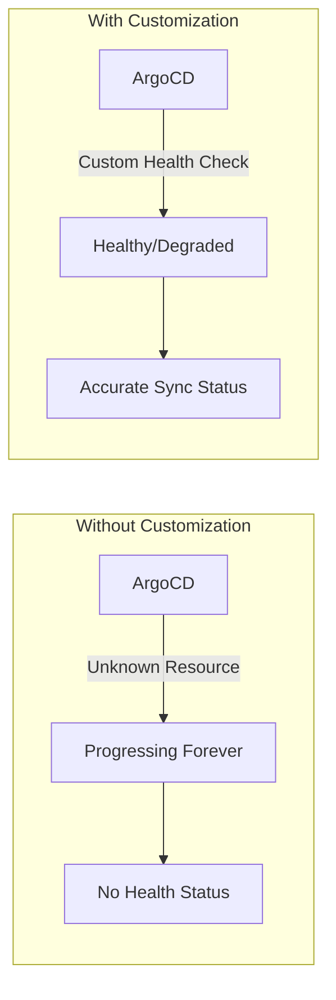
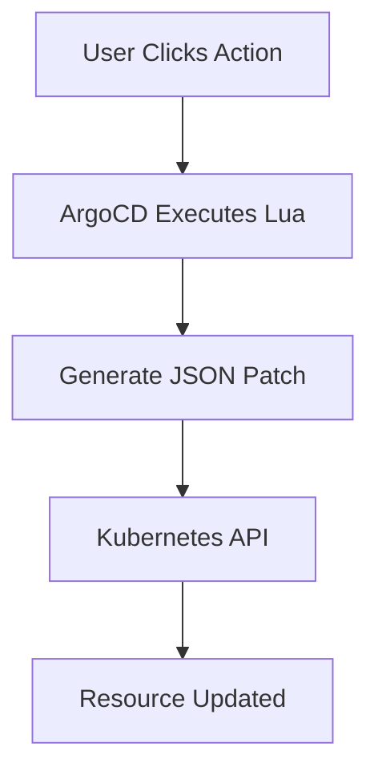

# How to Create ArgoCD Resource Customizations

Author: [nawazdhandala](https://github.com/nawazdhandala)

Tags: ArgoCD, GitOps, Kubernetes, Customization

Description: Learn how to create ArgoCD resource customizations to define custom health checks, sync behaviors, and resource actions for any Kubernetes resource type.

---

ArgoCD resource customizations let you teach ArgoCD how to understand any Kubernetes resource. Out of the box, ArgoCD knows how to check health and compare state for built-in Kubernetes resources. But when you add CRDs, Operators, or third-party tools, ArgoCD needs guidance. Resource customizations provide that guidance.

## Why Resource Customizations Matter



When ArgoCD encounters an unknown resource type, it cannot determine:
- Is the resource healthy or degraded?
- Has the sync completed successfully?
- What actions can users take on this resource?

Resource customizations solve these problems by defining custom logic for health assessment, sync status, and available actions.

## Types of Resource Customizations

ArgoCD supports four types of customizations:

| Type | Purpose |
|------|---------|
| Health | Define when a resource is healthy, progressing, or degraded |
| Actions | Add custom buttons in the UI to perform operations |
| Ignore Differences | Tell ArgoCD to ignore specific fields during comparison |
| Known Type | Mark a resource as a known Kubernetes type |

## Configuring Resource Customizations

Resource customizations live in the `argocd-cm` ConfigMap in the `argocd` namespace.

Here is the basic structure for adding customizations.

```yaml
apiVersion: v1
kind: ConfigMap
metadata:
  name: argocd-cm
  namespace: argocd
data:
  resource.customizations: |
    <group>/<kind>:
      health.lua: |
        -- Lua script for health check
      actions: |
        -- Action definitions
      ignoreDifferences: |
        -- Fields to ignore
```

## Custom Health Checks

Health checks use Lua scripts to evaluate resource status. ArgoCD passes the resource object to your script, and you return a health status.

### Health Status Values

Your Lua script must return one of these status values:

- `Healthy` - Resource is working correctly
- `Progressing` - Resource is still being created or updated
- `Degraded` - Resource has a problem
- `Suspended` - Resource is paused intentionally
- `Missing` - Resource does not exist
- `Unknown` - Cannot determine health

### Example: Custom Health Check for Certificates

This example defines a health check for cert-manager Certificate resources.

```yaml
apiVersion: v1
kind: ConfigMap
metadata:
  name: argocd-cm
  namespace: argocd
data:
  resource.customizations: |
    cert-manager.io/Certificate:
      health.lua: |
        hs = {}
        if obj.status ~= nil then
          if obj.status.conditions ~= nil then
            for i, condition in ipairs(obj.status.conditions) do
              if condition.type == "Ready" and condition.status == "False" then
                hs.status = "Degraded"
                hs.message = condition.message
                return hs
              end
              if condition.type == "Ready" and condition.status == "True" then
                hs.status = "Healthy"
                hs.message = "Certificate is valid"
                return hs
              end
            end
          end
        end
        hs.status = "Progressing"
        hs.message = "Waiting for certificate to be issued"
        return hs
```

### Example: Health Check for External Secrets

This health check evaluates External Secrets Operator resources.

```yaml
apiVersion: v1
kind: ConfigMap
metadata:
  name: argocd-cm
  namespace: argocd
data:
  resource.customizations: |
    external-secrets.io/ExternalSecret:
      health.lua: |
        hs = {}
        if obj.status ~= nil then
          if obj.status.conditions ~= nil then
            for i, condition in ipairs(obj.status.conditions) do
              if condition.type == "Ready" then
                if condition.status == "True" then
                  hs.status = "Healthy"
                  hs.message = "Secret synced successfully"
                  return hs
                else
                  hs.status = "Degraded"
                  hs.message = condition.message
                  return hs
                end
              end
            end
          end
          if obj.status.refreshTime ~= nil then
            hs.status = "Healthy"
            hs.message = "Last refresh: " .. obj.status.refreshTime
            return hs
          end
        end
        hs.status = "Progressing"
        hs.message = "Waiting for secret sync"
        return hs
```

### Example: Health Check for Argo Rollouts

Argo Rollouts have complex status conditions. This health check handles all rollout phases.

```yaml
apiVersion: v1
kind: ConfigMap
metadata:
  name: argocd-cm
  namespace: argocd
data:
  resource.customizations: |
    argoproj.io/Rollout:
      health.lua: |
        function checkReplicasStatus(obj)
          hs = {}
          replicasAvailable = obj.status.availableReplicas or 0
          replicasDesired = obj.spec.replicas or 0

          if replicasAvailable == replicasDesired then
            hs.status = "Healthy"
            hs.message = "All replicas available"
            return hs
          end

          hs.status = "Progressing"
          hs.message = "Waiting for replicas: " .. replicasAvailable .. "/" .. replicasDesired
          return hs
        end

        hs = {}
        if obj.status ~= nil then
          if obj.status.phase == "Healthy" then
            hs.status = "Healthy"
            hs.message = "Rollout is healthy"
            return hs
          end
          if obj.status.phase == "Paused" then
            hs.status = "Suspended"
            hs.message = obj.status.message or "Rollout is paused"
            return hs
          end
          if obj.status.phase == "Degraded" then
            hs.status = "Degraded"
            hs.message = obj.status.message or "Rollout is degraded"
            return hs
          end
          if obj.status.phase == "Progressing" then
            hs.status = "Progressing"
            hs.message = obj.status.message or "Rollout in progress"
            return hs
          end
        end
        return checkReplicasStatus(obj)
```

## Custom Actions

Actions let users perform operations on resources directly from the ArgoCD UI. Each action is a button that executes a Lua script to modify the resource.

### Action Structure



Actions require two components:
1. A discovery script that determines which actions are available
2. An action script that generates the patch to apply

### Example: Restart Deployment Action

This action adds a "Restart" button for Deployments.

```yaml
apiVersion: v1
kind: ConfigMap
metadata:
  name: argocd-cm
  namespace: argocd
data:
  resource.customizations.actions.argoproj.io_Rollout: |
    discovery.lua: |
      actions = {}
      actions["restart"] = {
        ["disabled"] = false
      }
      actions["promote"] = {
        ["disabled"] = obj.status.phase ~= "Paused"
      }
      actions["abort"] = {
        ["disabled"] = obj.status.phase ~= "Progressing"
      }
      return actions
    definitions:
      - name: restart
        action.lua: |
          local os = require("os")
          if obj.spec.restartAt == nil then
            obj.spec.restartAt = os.date("!%Y-%m-%dT%H:%M:%SZ")
          else
            obj.spec.restartAt = os.date("!%Y-%m-%dT%H:%M:%SZ")
          end
          return obj
      - name: promote
        action.lua: |
          if obj.status.pauseConditions ~= nil then
            obj.status.pauseConditions = nil
          end
          if obj.spec.paused ~= nil then
            obj.spec.paused = nil
          end
          return obj
      - name: abort
        action.lua: |
          obj.status.abort = true
          return obj
```

### Example: Scale Action for StatefulSets

This action lets users scale StatefulSets from the UI.

```yaml
apiVersion: v1
kind: ConfigMap
metadata:
  name: argocd-cm
  namespace: argocd
data:
  resource.customizations.actions.apps_StatefulSet: |
    discovery.lua: |
      actions = {}
      actions["scale-up"] = {
        ["disabled"] = false
      }
      actions["scale-down"] = {
        ["disabled"] = obj.spec.replicas <= 1
      }
      return actions
    definitions:
      - name: scale-up
        action.lua: |
          obj.spec.replicas = obj.spec.replicas + 1
          return obj
      - name: scale-down
        action.lua: |
          if obj.spec.replicas > 1 then
            obj.spec.replicas = obj.spec.replicas - 1
          end
          return obj
```

## Ignore Differences

Sometimes ArgoCD reports resources as out of sync even when they are correctly deployed. This happens when controllers modify resources after creation. Ignore differences tells ArgoCD which fields to skip during comparison.

### Common Use Cases

- Autoscaler modifies replica count
- Controllers add annotations or labels
- Mutating webhooks inject sidecars
- Default values added by admission controllers

### Example: Ignore HPA-Managed Replicas

When using Horizontal Pod Autoscaler, ArgoCD should not compare replica counts.

```yaml
apiVersion: v1
kind: ConfigMap
metadata:
  name: argocd-cm
  namespace: argocd
data:
  resource.customizations.ignoreDifferences.apps_Deployment: |
    jqPathExpressions:
      - .spec.replicas
```

### Example: Ignore Controller-Added Annotations

Some controllers add annotations that should not trigger sync.

```yaml
apiVersion: v1
kind: ConfigMap
metadata:
  name: argocd-cm
  namespace: argocd
data:
  resource.customizations.ignoreDifferences.all: |
    managedFieldsManagers:
      - kube-controller-manager
      - argo-rollouts
    jqPathExpressions:
      - .metadata.annotations["kubectl.kubernetes.io/last-applied-configuration"]
```

### Example: Ignore Specific Fields in CRDs

For custom resources, you may need to ignore fields that controllers manage.

```yaml
apiVersion: v1
kind: ConfigMap
metadata:
  name: argocd-cm
  namespace: argocd
data:
  resource.customizations.ignoreDifferences.certmanager.io_Certificate: |
    jqPathExpressions:
      - .spec.secretName
    jsonPointers:
      - /status
```

### Using JSON Pointers vs JQ Expressions

ArgoCD supports two syntaxes for specifying fields to ignore.

JSON Pointers are simpler but less flexible.

```yaml
jsonPointers:
  - /spec/replicas
  - /metadata/annotations/example.com~1annotation
```

JQ expressions are more powerful and support pattern matching.

```yaml
jqPathExpressions:
  - .spec.template.spec.containers[].resources
  - .metadata.annotations | keys | map(select(startswith("cloud.google.com")))
```

## Application-Level Customizations

You can also define customizations at the Application level instead of globally.

```yaml
apiVersion: argoproj.io/v1alpha1
kind: Application
metadata:
  name: my-app
  namespace: argocd
spec:
  source:
    repoURL: https://github.com/myorg/myapp.git
    path: k8s
  destination:
    server: https://kubernetes.default.svc
    namespace: production
  ignoreDifferences:
    - group: apps
      kind: Deployment
      jqPathExpressions:
        - .spec.replicas
    - group: ""
      kind: Service
      jsonPointers:
        - /spec/clusterIP
        - /spec/clusterIPs
```

## Complete Configuration Example

Here is a complete argocd-cm ConfigMap with multiple customizations.

```yaml
apiVersion: v1
kind: ConfigMap
metadata:
  name: argocd-cm
  namespace: argocd
data:
  resource.customizations: |
    # Cert-Manager Certificates
    cert-manager.io/Certificate:
      health.lua: |
        hs = {}
        if obj.status ~= nil then
          if obj.status.conditions ~= nil then
            for i, condition in ipairs(obj.status.conditions) do
              if condition.type == "Ready" then
                if condition.status == "True" then
                  hs.status = "Healthy"
                  hs.message = "Certificate is valid"
                  return hs
                else
                  hs.status = "Degraded"
                  hs.message = condition.message
                  return hs
                end
              end
            end
          end
        end
        hs.status = "Progressing"
        hs.message = "Waiting for certificate"
        return hs

    # Sealed Secrets
    bitnami.com/SealedSecret:
      health.lua: |
        hs = {}
        if obj.status ~= nil then
          if obj.status.conditions ~= nil then
            for i, condition in ipairs(obj.status.conditions) do
              if condition.type == "Synced" and condition.status == "True" then
                hs.status = "Healthy"
                hs.message = "Secret decrypted successfully"
                return hs
              end
            end
          end
        end
        hs.status = "Progressing"
        hs.message = "Waiting for secret decryption"
        return hs

    # Istio VirtualService
    networking.istio.io/VirtualService:
      health.lua: |
        hs = {}
        hs.status = "Healthy"
        hs.message = "VirtualService applied"
        return hs

    # Kafka Topics
    kafka.strimzi.io/KafkaTopic:
      health.lua: |
        hs = {}
        if obj.status ~= nil then
          if obj.status.conditions ~= nil then
            for i, condition in ipairs(obj.status.conditions) do
              if condition.type == "Ready" then
                if condition.status == "True" then
                  hs.status = "Healthy"
                  hs.message = "Topic ready"
                  return hs
                else
                  hs.status = "Degraded"
                  hs.message = condition.message
                  return hs
                end
              end
            end
          end
        end
        hs.status = "Progressing"
        hs.message = "Creating topic"
        return hs

  # Global ignore differences
  resource.customizations.ignoreDifferences.all: |
    managedFieldsManagers:
      - kube-controller-manager

  # Deployment-specific ignore differences
  resource.customizations.ignoreDifferences.apps_Deployment: |
    jqPathExpressions:
      - .spec.replicas
      - .spec.template.spec.containers[].resources.limits
      - .spec.template.spec.containers[].resources.requests

  # Service ignore differences
  resource.customizations.ignoreDifferences._Service: |
    jsonPointers:
      - /spec/clusterIP
      - /spec/clusterIPs
      - /spec/sessionAffinity
```

## Testing Your Customizations

Before deploying customizations to production, test them locally.

### Step 1: Export Current ConfigMap

```bash
kubectl get configmap argocd-cm -n argocd -o yaml > argocd-cm-backup.yaml
```

### Step 2: Apply Test Customization

```bash
kubectl apply -f - <<EOF
apiVersion: v1
kind: ConfigMap
metadata:
  name: argocd-cm
  namespace: argocd
data:
  resource.customizations: |
    example.com/MyResource:
      health.lua: |
        hs = {}
        hs.status = "Healthy"
        hs.message = "Test passed"
        return hs
EOF
```

### Step 3: Verify in ArgoCD

```bash
# Refresh the application
argocd app get my-app --refresh

# Check resource health
argocd app resources my-app
```

### Step 4: Check Logs for Lua Errors

```bash
kubectl logs -n argocd -l app.kubernetes.io/name=argocd-application-controller | grep -i lua
```

## Debugging Lua Scripts

When your Lua scripts have errors, ArgoCD logs will show the problem.

### Common Lua Errors

**Nil value access**

```lua
-- Wrong: crashes if status is nil
if obj.status.conditions ~= nil then

-- Correct: check each level
if obj.status ~= nil and obj.status.conditions ~= nil then
```

**Missing return statement**

```lua
-- Wrong: no return
hs = {}
hs.status = "Healthy"

-- Correct: always return
hs = {}
hs.status = "Healthy"
return hs
```

**Invalid status value**

```lua
-- Wrong: typo in status
hs.status = "healthy"

-- Correct: exact case matters
hs.status = "Healthy"
```

## Best Practices

1. **Start simple** - Begin with basic health checks before adding actions
2. **Handle nil values** - Always check if fields exist before accessing them
3. **Use descriptive messages** - Health messages appear in the UI, make them useful
4. **Test incrementally** - Apply one customization at a time
5. **Document your customizations** - Add comments explaining the logic
6. **Version control** - Store your argocd-cm in Git alongside applications
7. **Monitor performance** - Complex Lua scripts can slow down sync operations

---

Resource customizations transform ArgoCD from a generic deployment tool into a platform that truly understands your infrastructure. Start with health checks for your most important CRDs, add ignore differences to reduce sync noise, and introduce actions to empower your team. With well-crafted customizations, ArgoCD becomes an intelligent operator for all your Kubernetes resources.
