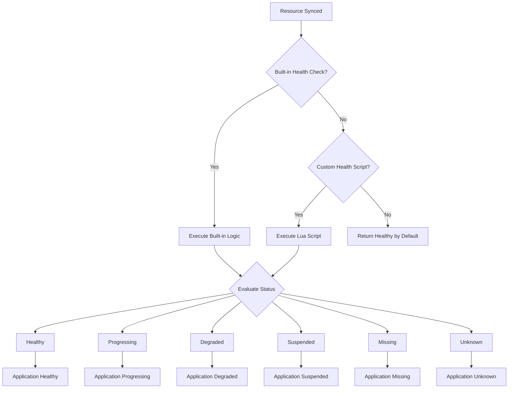
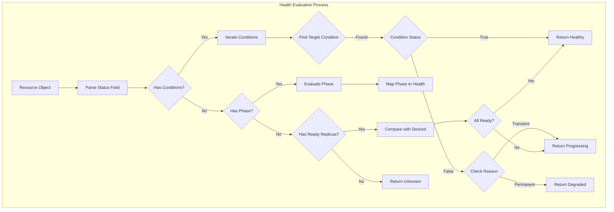
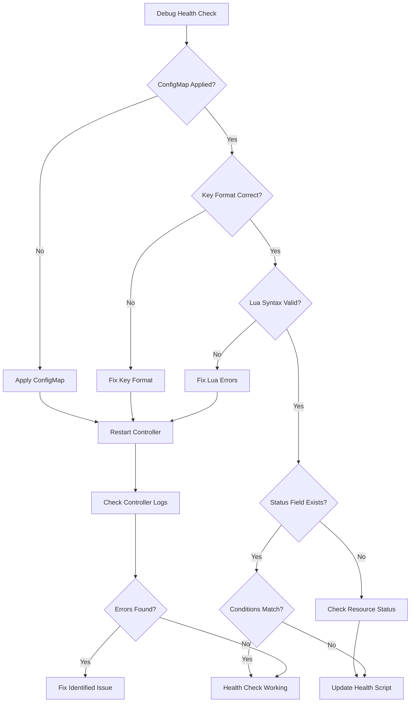

# How to Build ArgoCD Resource Health Checks

Author: [nawazdhandala](https://github.com/nawazdhandala)

Tags: ArgoCD, GitOps, Health Checks, Kubernetes

Description: Learn how to create custom health checks in ArgoCD for Kubernetes resources, CRDs, and complex applications using Lua scripts and ConfigMap configuration.

---

ArgoCD knows when Deployments and Services are healthy out of the box. But what about your custom resources, third-party operators, or applications with special requirements? That is where custom health checks come in.

## How ArgoCD Health Assessment Works



ArgoCD evaluates health in this order:
1. Check if a custom health script exists for the resource type
2. Fall back to built-in health checks for standard Kubernetes resources
3. Mark as healthy if no health check is defined

## Health Status Types

| Status | Description | UI Color |
|--------|-------------|----------|
| Healthy | Resource is operating correctly | Green |
| Progressing | Resource is still being created or updated | Blue |
| Degraded | Resource has failed or is in an error state | Red |
| Suspended | Resource is paused or suspended | Yellow |
| Missing | Resource does not exist | Yellow |
| Unknown | Health status cannot be determined | Gray |

## Configuring Custom Health Checks

Custom health checks are defined in the `argocd-cm` ConfigMap. The scripts are written in Lua and have access to the full resource object.

### Basic ConfigMap Structure

```yaml
apiVersion: v1
kind: ConfigMap
metadata:
  name: argocd-cm
  namespace: argocd
data:
  resource.customizations.health.argoproj.io_Application: |
    hs = {}
    if obj.status ~= nil then
      if obj.status.health ~= nil then
        hs.status = obj.status.health.status
        if obj.status.health.message ~= nil then
          hs.message = obj.status.health.message
        end
      end
    end
    return hs
```

### Health Check Naming Convention

The key format is:
```
resource.customizations.health.<group>_<kind>
```

Examples:
- `resource.customizations.health.apps_Deployment`
- `resource.customizations.health.cert-manager.io_Certificate`
- `resource.customizations.health.argoproj.io_Rollout`

For core API resources (no group), use an empty prefix:
- `resource.customizations.health._Service`
- `resource.customizations.health._Pod`

## Writing Lua Health Scripts

### Script Structure

Every health script must return a table with:
- `status` (required): One of Healthy, Progressing, Degraded, Suspended, Missing, Unknown
- `message` (optional): Human-readable status message

```lua
hs = {}
hs.status = "Healthy"
hs.message = "All replicas are available"
return hs
```

### Accessing Resource Fields

The resource object is available as `obj`:

```lua
-- Access metadata
obj.metadata.name
obj.metadata.namespace
obj.metadata.annotations["key"]
obj.metadata.labels["app"]

-- Access spec
obj.spec.replicas
obj.spec.selector.matchLabels["app"]

-- Access status
obj.status.readyReplicas
obj.status.conditions
obj.status.phase
```

## Practical Health Check Examples

### Example 1: CronJob Health Check

CronJobs should be healthy if they have run successfully recently and are not suspended:

```yaml
apiVersion: v1
kind: ConfigMap
metadata:
  name: argocd-cm
  namespace: argocd
data:
  resource.customizations.health.batch_CronJob: |
    hs = {}
    if obj.spec.suspend ~= nil and obj.spec.suspend == true then
      hs.status = "Suspended"
      hs.message = "CronJob is suspended"
      return hs
    end

    if obj.status ~= nil then
      if obj.status.lastScheduleTime ~= nil then
        hs.status = "Healthy"
        hs.message = "Last scheduled: " .. obj.status.lastScheduleTime
      else
        hs.status = "Progressing"
        hs.message = "Waiting for first schedule"
      end
    else
      hs.status = "Progressing"
      hs.message = "Status not yet available"
    end

    return hs
```

### Example 2: Cert-Manager Certificate

Certificates should show health based on their ready condition:

```yaml
apiVersion: v1
kind: ConfigMap
metadata:
  name: argocd-cm
  namespace: argocd
data:
  resource.customizations.health.cert-manager.io_Certificate: |
    hs = {}
    if obj.status ~= nil then
      if obj.status.conditions ~= nil then
        for i, condition in ipairs(obj.status.conditions) do
          if condition.type == "Ready" then
            if condition.status == "True" then
              hs.status = "Healthy"
              hs.message = "Certificate is ready"
            else
              if condition.reason == "Issuing" then
                hs.status = "Progressing"
                hs.message = condition.message
              else
                hs.status = "Degraded"
                hs.message = condition.message
              end
            end
            return hs
          end
        end
      end
    end

    hs.status = "Progressing"
    hs.message = "Waiting for certificate status"
    return hs
```

### Example 3: PostgreSQL Operator (Zalando)

PostgreSQL clusters managed by the Zalando operator need custom health evaluation:

```yaml
apiVersion: v1
kind: ConfigMap
metadata:
  name: argocd-cm
  namespace: argocd
data:
  resource.customizations.health.acid.zalan.do_postgresql: |
    hs = {}
    if obj.status ~= nil then
      if obj.status.PostgresClusterStatus == "Running" then
        hs.status = "Healthy"
        hs.message = "PostgreSQL cluster is running"
      elseif obj.status.PostgresClusterStatus == "Creating" or
             obj.status.PostgresClusterStatus == "Updating" then
        hs.status = "Progressing"
        hs.message = "PostgreSQL cluster is " .. obj.status.PostgresClusterStatus
      elseif obj.status.PostgresClusterStatus == "SyncFailed" or
             obj.status.PostgresClusterStatus == "CreateFailed" then
        hs.status = "Degraded"
        hs.message = "PostgreSQL cluster failed: " .. obj.status.PostgresClusterStatus
      else
        hs.status = "Unknown"
        hs.message = "Unknown status: " .. tostring(obj.status.PostgresClusterStatus)
      end
    else
      hs.status = "Progressing"
      hs.message = "Waiting for status"
    end
    return hs
```

### Example 4: Argo Rollouts

For blue-green and canary deployments with Argo Rollouts:

```yaml
apiVersion: v1
kind: ConfigMap
metadata:
  name: argocd-cm
  namespace: argocd
data:
  resource.customizations.health.argoproj.io_Rollout: |
    hs = {}
    if obj.status ~= nil then
      if obj.status.phase == "Healthy" then
        hs.status = "Healthy"
        hs.message = "Rollout is healthy"
      elseif obj.status.phase == "Paused" then
        hs.status = "Suspended"
        hs.message = obj.status.message or "Rollout is paused"
      elseif obj.status.phase == "Progressing" then
        hs.status = "Progressing"
        hs.message = obj.status.message or "Rollout in progress"
      elseif obj.status.phase == "Degraded" then
        hs.status = "Degraded"
        hs.message = obj.status.message or "Rollout is degraded"
      else
        hs.status = "Unknown"
        hs.message = "Unknown phase: " .. tostring(obj.status.phase)
      end
    else
      hs.status = "Progressing"
      hs.message = "Waiting for rollout status"
    end
    return hs
```

### Example 5: External Secrets Operator

Check if secrets are properly synced from external providers:

```yaml
apiVersion: v1
kind: ConfigMap
metadata:
  name: argocd-cm
  namespace: argocd
data:
  resource.customizations.health.external-secrets.io_ExternalSecret: |
    hs = {}
    if obj.status ~= nil then
      if obj.status.conditions ~= nil then
        for i, condition in ipairs(obj.status.conditions) do
          if condition.type == "Ready" then
            if condition.status == "True" then
              hs.status = "Healthy"
              hs.message = "Secret synced successfully"
            else
              hs.status = "Degraded"
              hs.message = condition.message or "Secret sync failed"
            end
            return hs
          end
        end
      end

      if obj.status.refreshTime ~= nil then
        hs.status = "Healthy"
        hs.message = "Last refresh: " .. obj.status.refreshTime
        return hs
      end
    end

    hs.status = "Progressing"
    hs.message = "Waiting for secret sync"
    return hs
```

## Health Check Flow for Complex Resources



## CRD Health Checks

When you create custom resources with your own operators, you need to define health checks so ArgoCD can monitor them properly.

### Step 1: Understand Your CRD Status

First, examine your CRD status structure:

```yaml
apiVersion: myapp.example.com/v1
kind: MyApplication
metadata:
  name: my-app
spec:
  replicas: 3
status:
  phase: Running
  readyReplicas: 3
  conditions:
    - type: Ready
      status: "True"
      lastTransitionTime: "2024-01-15T10:00:00Z"
      reason: AllReplicasReady
      message: All replicas are ready
    - type: Progressing
      status: "False"
      lastTransitionTime: "2024-01-15T10:00:00Z"
      reason: DeploymentComplete
      message: Deployment completed successfully
```

### Step 2: Write the Health Check

```yaml
apiVersion: v1
kind: ConfigMap
metadata:
  name: argocd-cm
  namespace: argocd
data:
  resource.customizations.health.myapp.example.com_MyApplication: |
    hs = {}

    if obj.status == nil then
      hs.status = "Progressing"
      hs.message = "Waiting for status"
      return hs
    end

    -- Check conditions first
    if obj.status.conditions ~= nil then
      local ready = false
      local progressing = false
      local readyMessage = ""
      local progressingMessage = ""

      for i, condition in ipairs(obj.status.conditions) do
        if condition.type == "Ready" then
          if condition.status == "True" then
            ready = true
            readyMessage = condition.message or "Ready"
          else
            readyMessage = condition.message or "Not ready"
          end
        end

        if condition.type == "Progressing" then
          if condition.status == "True" then
            progressing = true
            progressingMessage = condition.message or "Progressing"
          end
        end
      end

      if ready then
        hs.status = "Healthy"
        hs.message = readyMessage
        return hs
      end

      if progressing then
        hs.status = "Progressing"
        hs.message = progressingMessage
        return hs
      end

      hs.status = "Degraded"
      hs.message = readyMessage
      return hs
    end

    -- Fall back to phase
    if obj.status.phase ~= nil then
      if obj.status.phase == "Running" or obj.status.phase == "Succeeded" then
        hs.status = "Healthy"
      elseif obj.status.phase == "Pending" or obj.status.phase == "Creating" then
        hs.status = "Progressing"
      elseif obj.status.phase == "Failed" or obj.status.phase == "Error" then
        hs.status = "Degraded"
      else
        hs.status = "Unknown"
      end
      hs.message = obj.status.phase
      return hs
    end

    hs.status = "Unknown"
    hs.message = "Unable to determine health"
    return hs
```

## Multiple Custom Health Checks

You can define multiple health checks in a single ConfigMap:

```yaml
apiVersion: v1
kind: ConfigMap
metadata:
  name: argocd-cm
  namespace: argocd
data:
  # Cert-Manager Certificate
  resource.customizations.health.cert-manager.io_Certificate: |
    hs = {}
    if obj.status ~= nil and obj.status.conditions ~= nil then
      for i, condition in ipairs(obj.status.conditions) do
        if condition.type == "Ready" then
          if condition.status == "True" then
            hs.status = "Healthy"
          else
            hs.status = "Degraded"
          end
          hs.message = condition.message
          return hs
        end
      end
    end
    hs.status = "Progressing"
    hs.message = "Waiting for certificate"
    return hs

  # Sealed Secrets
  resource.customizations.health.bitnami.com_SealedSecret: |
    hs = {}
    if obj.status ~= nil and obj.status.conditions ~= nil then
      for i, condition in ipairs(obj.status.conditions) do
        if condition.type == "Synced" then
          if condition.status == "True" then
            hs.status = "Healthy"
            hs.message = "Secret unsealed successfully"
          else
            hs.status = "Degraded"
            hs.message = condition.message
          end
          return hs
        end
      end
    end
    hs.status = "Progressing"
    hs.message = "Waiting for secret to be unsealed"
    return hs

  # Istio VirtualService
  resource.customizations.health.networking.istio.io_VirtualService: |
    hs = {}
    hs.status = "Healthy"
    hs.message = "VirtualService is applied"
    return hs

  # Keda ScaledObject
  resource.customizations.health.keda.sh_ScaledObject: |
    hs = {}
    if obj.status ~= nil then
      if obj.status.conditions ~= nil then
        for i, condition in ipairs(obj.status.conditions) do
          if condition.type == "Ready" then
            if condition.status == "True" then
              hs.status = "Healthy"
              hs.message = "ScaledObject is ready"
            elseif condition.status == "False" then
              hs.status = "Degraded"
              hs.message = condition.message
            else
              hs.status = "Progressing"
              hs.message = "Waiting for scaler"
            end
            return hs
          end
        end
      end
    end
    hs.status = "Progressing"
    hs.message = "Initializing"
    return hs
```

## Testing Health Checks

### Test with kubectl

First, get the raw resource to understand its structure:

```bash
kubectl get certificate my-cert -o yaml
kubectl get postgresql my-db -o yaml
kubectl get rollout my-app -o yaml
```

### Validate Lua Syntax

Create a test file and run it locally:

```bash
# Install lua (macOS)
brew install lua

# Create test script
cat > test_health.lua << 'EOF'
-- Mock object
obj = {
  status = {
    conditions = {
      {
        type = "Ready",
        status = "True",
        message = "Certificate is valid"
      }
    }
  }
}

-- Your health check logic
hs = {}
if obj.status ~= nil and obj.status.conditions ~= nil then
  for i, condition in ipairs(obj.status.conditions) do
    if condition.type == "Ready" then
      if condition.status == "True" then
        hs.status = "Healthy"
      else
        hs.status = "Degraded"
      end
      hs.message = condition.message
      break
    end
  end
end

print("Status: " .. (hs.status or "nil"))
print("Message: " .. (hs.message or "nil"))
EOF

lua test_health.lua
```

### Check ArgoCD Logs

After deploying your health checks, verify they work:

```bash
# Check application-controller logs
kubectl logs -n argocd -l app.kubernetes.io/name=argocd-application-controller -f | grep -i health

# Force a refresh
argocd app get my-app --refresh
```

## Debugging Health Checks

### Common Issues

**1. Health check not being applied**

Verify the ConfigMap key format matches your resource:

```bash
# Get the GVK of your resource
kubectl api-resources | grep certificate
# cert-manager.io/v1   Certificate

# Key should be:
# resource.customizations.health.cert-manager.io_Certificate
```

**2. Lua syntax errors**

Check the application-controller logs:

```bash
kubectl logs -n argocd deployment/argocd-application-controller | grep -i "lua\|error"
```

**3. Nil access errors**

Always check for nil before accessing nested fields:

```lua
-- Wrong
if obj.status.conditions[1].type == "Ready" then

-- Correct
if obj.status ~= nil and obj.status.conditions ~= nil then
  for i, condition in ipairs(obj.status.conditions) do
    if condition.type == "Ready" then
```

### Health Check Decision Tree



## Using Health Checks with Sync Waves

Combine health checks with sync waves to ensure resources are healthy before proceeding:

```yaml
apiVersion: argoproj.io/v1alpha1
kind: Application
metadata:
  name: my-app
spec:
  source:
    repoURL: https://github.com/myorg/my-app.git
    path: k8s
  destination:
    server: https://kubernetes.default.svc
    namespace: my-app
  syncPolicy:
    automated:
      prune: true
      selfHeal: true
    syncOptions:
      - CreateNamespace=true
```

Your manifests use sync waves:

```yaml
# Wave 0: Create namespace and secrets
apiVersion: v1
kind: Namespace
metadata:
  name: my-app
  annotations:
    argocd.argoproj.io/sync-wave: "0"
---
# Wave 1: Database (waits for namespace to be healthy)
apiVersion: acid.zalan.do/v1
kind: postgresql
metadata:
  name: my-db
  annotations:
    argocd.argoproj.io/sync-wave: "1"
spec:
  numberOfInstances: 2
---
# Wave 2: Application (waits for database to be healthy)
apiVersion: apps/v1
kind: Deployment
metadata:
  name: my-app
  annotations:
    argocd.argoproj.io/sync-wave: "2"
```

ArgoCD uses health checks to determine when each wave is complete before starting the next one.

## Production Considerations

### Keep Health Checks Simple

Complex health checks slow down sync operations. Aim for scripts that:
- Execute in under 100ms
- Access only necessary fields
- Have clear, deterministic logic

### Version Your Health Checks

Store health checks in Git alongside your ArgoCD configuration:

```
argocd-config/
  base/
    argocd-cm.yaml
    argocd-rbac-cm.yaml
  overlays/
    production/
      kustomization.yaml
      health-checks-patch.yaml
```

### Monitor Health Check Performance

Watch for slow syncs caused by expensive health evaluations:

```bash
# Check sync duration
argocd app get my-app --show-operation

# Monitor application-controller resource usage
kubectl top pod -n argocd -l app.kubernetes.io/name=argocd-application-controller
```

---

Custom health checks make ArgoCD aware of your entire application state. Start with the resources that matter most to your deployments, test your Lua scripts locally, and gradually expand coverage. The investment pays off in reliable deployments and clear visibility into your cluster health.
