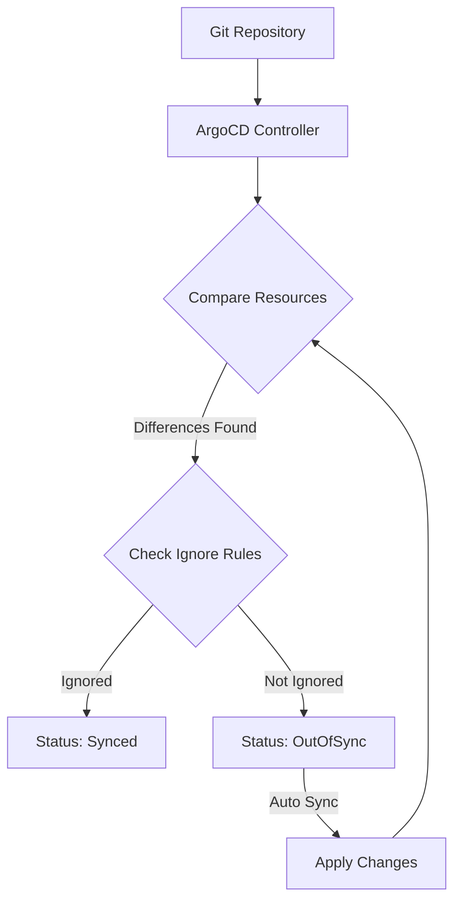
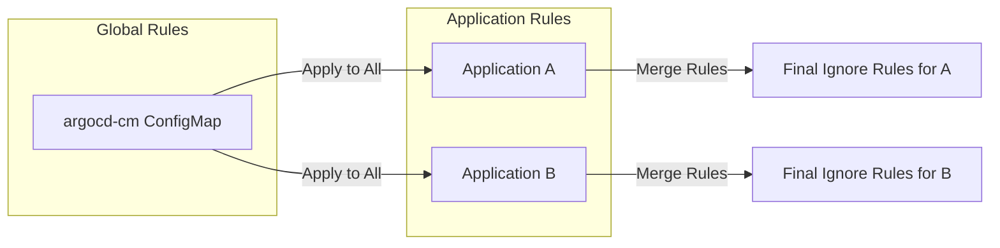
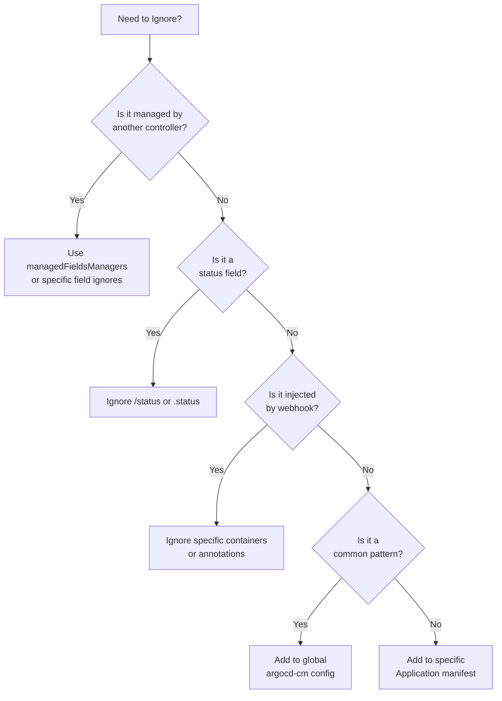

# How to Create ArgoCD Resource Ignoring

Author: [nawazdhandala](https://github.com/nawazdhandala)

Tags: ArgoCD, GitOps, Kubernetes, Configuration

Description: Learn how to configure ArgoCD to ignore specific resource differences and prevent unnecessary sync operations in your GitOps workflow.

---

ArgoCD constantly compares your Git repository with your Kubernetes cluster state. Sometimes this comparison flags differences you want to ignore. Resource ignoring tells ArgoCD which differences are acceptable, preventing false "OutOfSync" states and unnecessary reconciliation loops.

## Why Ignore Resource Differences?

Several scenarios require ignoring specific resource fields.



Common scenarios where ignoring is necessary:

1. **Autoscaling** - HPA modifies replica counts
2. **Annotations** - Controllers add runtime metadata
3. **Timestamps** - Kubernetes adds lastAppliedConfiguration
4. **Mutating Webhooks** - Inject sidecars or modify resources
5. **Operator-managed fields** - Operators update status and spec fields

## Basic ignoreDifferences Configuration

The `ignoreDifferences` field in your Application spec tells ArgoCD which fields to skip during comparison.

Here is a basic example that ignores replica count changes on Deployments.

```yaml
apiVersion: argoproj.io/v1alpha1
kind: Application
metadata:
  name: myapp
  namespace: argocd
spec:
  project: default
  source:
    repoURL: https://github.com/myorg/myapp.git
    targetRevision: HEAD
    path: k8s
  destination:
    server: https://kubernetes.default.svc
    namespace: production
  ignoreDifferences:
    - group: apps
      kind: Deployment
      jsonPointers:
        - /spec/replicas
```

## JSON Pointers vs JQ Path Expressions

ArgoCD supports two syntaxes for specifying which fields to ignore.

### JSON Pointers (RFC 6901)

JSON Pointers use forward slashes to navigate the resource structure.

```yaml
ignoreDifferences:
  - group: apps
    kind: Deployment
    jsonPointers:
      - /spec/replicas
      - /spec/template/spec/containers/0/image
      - /metadata/annotations/kubectl.kubernetes.io~1last-applied-configuration
```

Note that special characters require encoding. The tilde (~) becomes ~0 and forward slash (/) becomes ~1.

### JQ Path Expressions

JQ expressions provide more powerful pattern matching.

```yaml
ignoreDifferences:
  - group: apps
    kind: Deployment
    jqPathExpressions:
      - .spec.replicas
      - .spec.template.spec.containers[].resources
      - .metadata.annotations["kubectl.kubernetes.io/last-applied-configuration"]
```

JQ expressions support wildcards and array iteration, making them more flexible than JSON Pointers.

## Common Ignore Patterns

### Ignore HPA-Managed Replicas

When using Horizontal Pod Autoscaler, ArgoCD should not manage replica counts.

```yaml
apiVersion: argoproj.io/v1alpha1
kind: Application
metadata:
  name: webapp
  namespace: argocd
spec:
  source:
    repoURL: https://github.com/myorg/webapp.git
    path: deploy
  destination:
    server: https://kubernetes.default.svc
    namespace: webapp
  ignoreDifferences:
    - group: apps
      kind: Deployment
      jqPathExpressions:
        - .spec.replicas
    - group: apps
      kind: StatefulSet
      jqPathExpressions:
        - .spec.replicas
```

### Ignore Sidecar Injections

Service meshes like Istio inject sidecar containers. Ignore the injected containers to prevent sync issues.

```yaml
ignoreDifferences:
  - group: apps
    kind: Deployment
    jqPathExpressions:
      - .spec.template.spec.containers[] | select(.name == "istio-proxy")
      - .spec.template.spec.initContainers[] | select(.name == "istio-init")
      - .spec.template.metadata.annotations["sidecar.istio.io/status"]
```

### Ignore Operator-Managed Status Fields

Operators frequently update status subresources and certain spec fields.

```yaml
ignoreDifferences:
  - group: cert-manager.io
    kind: Certificate
    jqPathExpressions:
      - .status
  - group: monitoring.coreos.com
    kind: ServiceMonitor
    jsonPointers:
      - /status
```

### Ignore Kubernetes-Added Metadata

Kubernetes controllers add various metadata fields automatically.

```yaml
ignoreDifferences:
  - group: "*"
    kind: "*"
    managedFieldsManagers:
      - kube-controller-manager
      - kube-scheduler
    jqPathExpressions:
      - .metadata.annotations["kubectl.kubernetes.io/last-applied-configuration"]
      - .metadata.managedFields
```

## Targeting Specific Resources

You can narrow ignore rules to specific resources by name.

```yaml
ignoreDifferences:
  - group: apps
    kind: Deployment
    name: frontend
    namespace: production
    jsonPointers:
      - /spec/replicas
  - group: apps
    kind: Deployment
    name: backend
    namespace: production
    jqPathExpressions:
      - .spec.template.spec.containers[].resources.limits
```

## Global Resource Ignoring

Configure ignore rules at the ArgoCD system level to apply them across all Applications.

Edit the argocd-cm ConfigMap to add global ignore rules.

```yaml
apiVersion: v1
kind: ConfigMap
metadata:
  name: argocd-cm
  namespace: argocd
data:
  resource.customizations.ignoreDifferences.all: |
    managedFieldsManagers:
      - kube-controller-manager
    jsonPointers:
      - /metadata/annotations/kubectl.kubernetes.io~1last-applied-configuration
  resource.customizations.ignoreDifferences.apps_Deployment: |
    jqPathExpressions:
      - .spec.replicas
  resource.customizations.ignoreDifferences.admissionregistration.k8s.io_MutatingWebhookConfiguration: |
    jqPathExpressions:
      - .webhooks[].clientConfig.caBundle
```

The naming convention for resource-specific rules is: `resource.customizations.ignoreDifferences.GROUP_KIND`



## Managing Fields by Controller

Use `managedFieldsManagers` to ignore all fields managed by specific controllers.

```yaml
ignoreDifferences:
  - group: apps
    kind: Deployment
    managedFieldsManagers:
      - kube-controller-manager
      - cluster-autoscaler
```

This approach is cleaner than listing individual fields when a controller manages many fields.

## Sync Options for Resource Ignoring

Combine ignoreDifferences with sync options for more control.

### Respect Ignore Differences on Sync

By default, ArgoCD applies the full manifest during sync even for ignored fields. Use RespectIgnoreDifferences to preserve the live state.

```yaml
apiVersion: argoproj.io/v1alpha1
kind: Application
metadata:
  name: myapp
  namespace: argocd
spec:
  source:
    repoURL: https://github.com/myorg/myapp.git
    path: k8s
  destination:
    server: https://kubernetes.default.svc
    namespace: production
  ignoreDifferences:
    - group: apps
      kind: Deployment
      jqPathExpressions:
        - .spec.replicas
  syncPolicy:
    syncOptions:
      - RespectIgnoreDifferences=true
```

### Server-Side Apply with Ignore

Server-side apply combined with ignore differences handles field ownership properly.

```yaml
syncPolicy:
  syncOptions:
    - ServerSideApply=true
    - RespectIgnoreDifferences=true
```

## Complete Example: Production Application

Here is a comprehensive Application manifest with common ignore patterns.

```yaml
apiVersion: argoproj.io/v1alpha1
kind: Application
metadata:
  name: production-api
  namespace: argocd
  finalizers:
    - resources-finalizer.argocd.argoproj.io
spec:
  project: production
  source:
    repoURL: https://github.com/myorg/api.git
    targetRevision: main
    path: k8s/overlays/production
  destination:
    server: https://kubernetes.default.svc
    namespace: api-production
  ignoreDifferences:
    # HPA manages replicas
    - group: apps
      kind: Deployment
      jqPathExpressions:
        - .spec.replicas
    # Istio injects sidecars
    - group: apps
      kind: Deployment
      jqPathExpressions:
        - .spec.template.spec.containers[] | select(.name == "istio-proxy")
        - .spec.template.spec.initContainers
        - .spec.template.metadata.annotations["sidecar.istio.io/status"]
        - .spec.template.metadata.labels["security.istio.io/tlsMode"]
    # Cert-manager updates certificates
    - group: cert-manager.io
      kind: Certificate
      jsonPointers:
        - /status
    # Ignore webhook CA bundles
    - group: admissionregistration.k8s.io
      kind: MutatingWebhookConfiguration
      jqPathExpressions:
        - .webhooks[].clientConfig.caBundle
    - group: admissionregistration.k8s.io
      kind: ValidatingWebhookConfiguration
      jqPathExpressions:
        - .webhooks[].clientConfig.caBundle
  syncPolicy:
    automated:
      prune: true
      selfHeal: true
    syncOptions:
      - CreateNamespace=true
      - PruneLast=true
      - RespectIgnoreDifferences=true
      - ServerSideApply=true
    retry:
      limit: 5
      backoff:
        duration: 5s
        maxDuration: 3m0s
        factor: 2
```

## Debugging Ignore Rules

### Check What ArgoCD Sees

Use the ArgoCD CLI to see the actual diff.

```bash
# Show the diff for an application
argocd app diff myapp

# Show the diff with details
argocd app diff myapp --local /path/to/local/manifests
```

### Refresh and Check Status

```bash
# Hard refresh to clear cache
argocd app get myapp --hard-refresh

# Check sync status details
argocd app get myapp -o yaml | grep -A 20 status:
```

### Test JQ Expressions

Test your JQ expressions against the live resource before adding them.

```bash
# Get the live manifest
kubectl get deployment myapp -o json > deployment.json

# Test your JQ expression
jq '.spec.replicas' deployment.json
jq '.spec.template.spec.containers[] | select(.name == "istio-proxy")' deployment.json
```

## Best Practices



1. **Start Specific** - Begin with application-level ignores before moving to global
2. **Document Why** - Add comments explaining why each ignore rule exists
3. **Use JQ for Complex Patterns** - JQ expressions handle arrays and conditionals better
4. **Test Before Deploying** - Verify expressions work against actual resources
5. **Review Periodically** - Remove ignore rules that are no longer needed
6. **Combine with RespectIgnoreDifferences** - Ensure ignored fields are preserved on sync

---

Resource ignoring is essential for running ArgoCD in production environments where multiple controllers modify resources. Start with the specific fields causing sync issues, test your expressions, and gradually build a set of ignore rules that keeps your applications correctly reporting their sync status.
