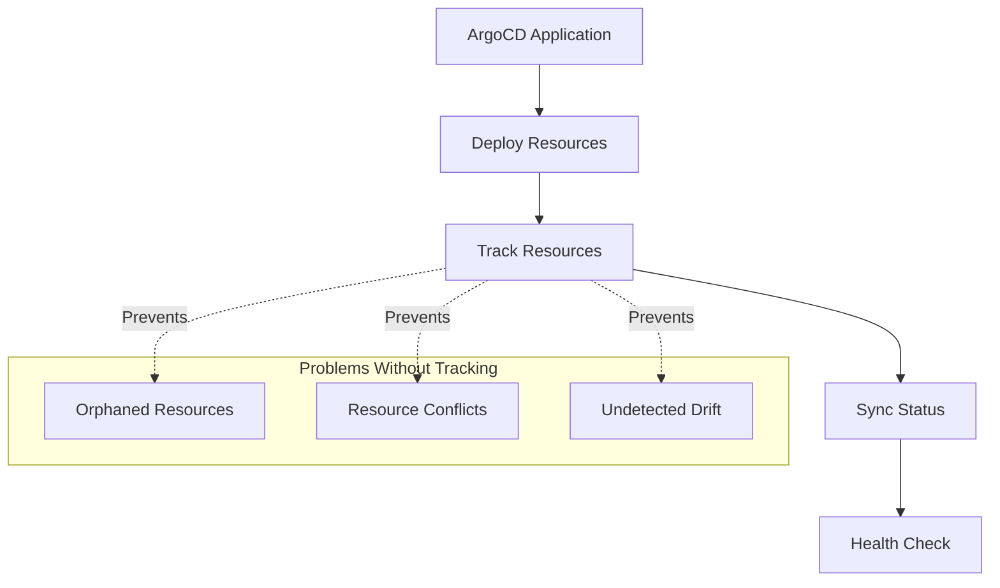
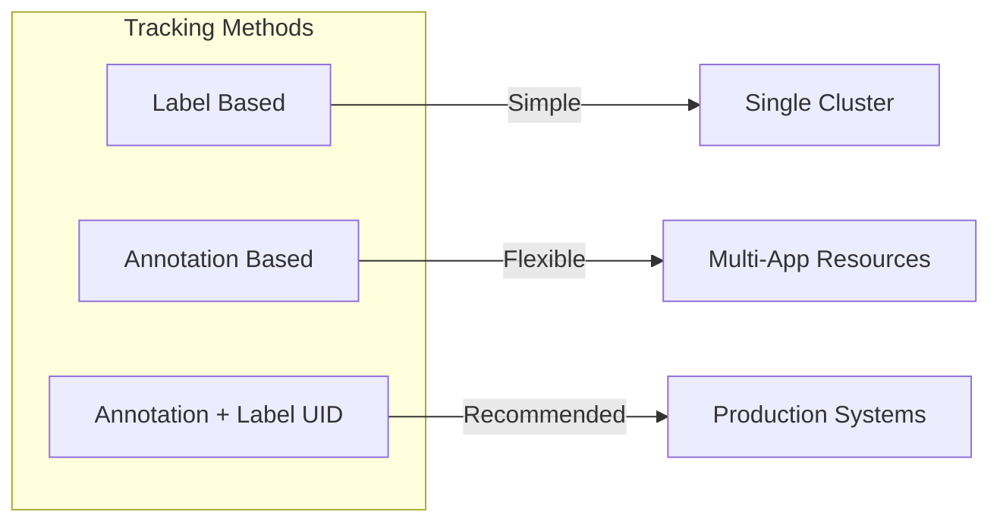
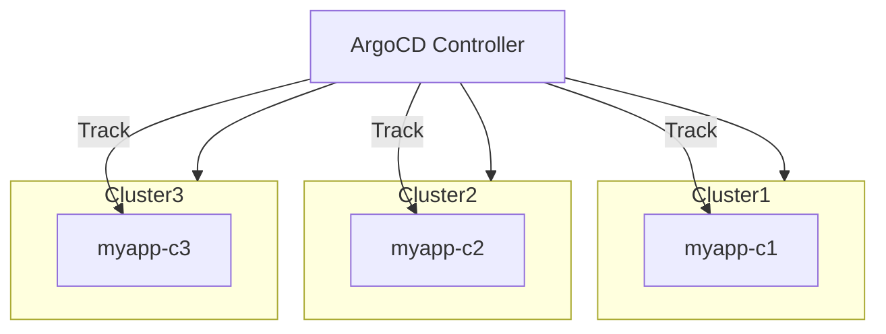
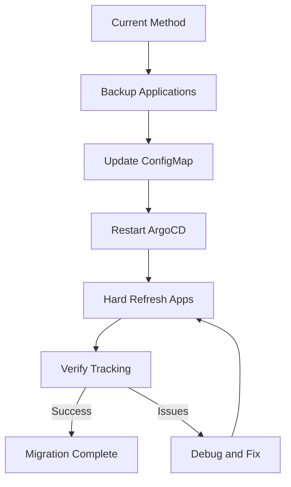

# How to Create ArgoCD Resource Tracking

Author: [nawazdhandala](https://github.com/nawazdhandala)

Tags: ArgoCD, GitOps, Kubernetes, Resource-Management

Description: Learn how to configure ArgoCD resource tracking to monitor, manage, and maintain your Kubernetes resources with precision using labels, annotations, and tracking methods.

---

ArgoCD needs to know which resources belong to which Application. Resource tracking is how ArgoCD identifies and manages resources it has deployed. Get this wrong, and you will see orphaned resources, sync issues, or resources accidentally deleted.

## Why Resource Tracking Matters



Resource tracking enables ArgoCD to:
- Identify which resources belong to each Application
- Detect when resources are modified outside of Git
- Clean up resources when they are removed from Git
- Prevent conflicts between multiple Applications

## Resource Tracking Methods

ArgoCD supports three tracking methods. Each has different tradeoffs.



### 1. Label-Based Tracking (Legacy)

The original method uses a label to identify resources.

ArgoCD adds this label to every resource it manages:

```yaml
metadata:
  labels:
    app.kubernetes.io/instance: myapp
```

Configure label-based tracking in the ArgoCD ConfigMap:

```yaml
apiVersion: v1
kind: ConfigMap
metadata:
  name: argocd-cm
  namespace: argocd
data:
  application.resourceTrackingMethod: label
```

Limitations of label-based tracking:
- Labels have a 63 character limit
- Cannot track the same resource from multiple Applications
- Does not include Application namespace in tracking

### 2. Annotation-Based Tracking

Annotation tracking stores more information and avoids label limits.

ArgoCD adds this annotation to managed resources:

```yaml
metadata:
  annotations:
    argocd.argoproj.io/tracking-id: myapp:apps/Deployment:production/myapp
```

The tracking ID format is: `<app-name>:<group>/<kind>:<namespace>/<name>`

Enable annotation tracking:

```yaml
apiVersion: v1
kind: ConfigMap
metadata:
  name: argocd-cm
  namespace: argocd
data:
  application.resourceTrackingMethod: annotation
```

Benefits of annotation tracking:
- No character limit issues
- Includes full resource identification
- Supports longer Application names

### 3. Annotation + Label UID (Recommended)

This method combines both approaches and adds a unique identifier.

ArgoCD adds both a label and an annotation:

```yaml
metadata:
  labels:
    app.kubernetes.io/instance: myapp
  annotations:
    argocd.argoproj.io/tracking-id: argocd/myapp:apps/Deployment:production/myapp
```

The annotation includes the ArgoCD namespace, making it unique across clusters.

Enable annotation+label tracking:

```yaml
apiVersion: v1
kind: ConfigMap
metadata:
  name: argocd-cm
  namespace: argocd
data:
  application.resourceTrackingMethod: annotation+label
```

This is the recommended method because:
- Backward compatible with label-based tools
- Full tracking information in annotation
- Includes ArgoCD namespace for multi-cluster setups

## Configuring Resource Tracking

### Global Configuration

Set the tracking method for all Applications in the ArgoCD ConfigMap.

Apply this configuration to enable annotation+label tracking globally:

```yaml
apiVersion: v1
kind: ConfigMap
metadata:
  name: argocd-cm
  namespace: argocd
data:
  application.resourceTrackingMethod: annotation+label
```

Apply the configuration:

```bash
kubectl apply -f argocd-cm.yaml

# Restart ArgoCD to pick up changes
kubectl rollout restart deployment argocd-repo-server -n argocd
kubectl rollout restart deployment argocd-application-controller -n argocd
```

### Verify Tracking Method

Check the current tracking method:

```bash
kubectl get configmap argocd-cm -n argocd -o yaml | grep resourceTrackingMethod
```

Inspect a managed resource to see tracking metadata:

```bash
kubectl get deployment myapp -n production -o yaml | grep -A5 "annotations:"
```

## Custom Resource Tracking Labels

You can customize the label used for tracking. This is useful when you have existing labeling conventions.

### Change the Instance Label Key

Configure a custom label key in the ArgoCD ConfigMap:

```yaml
apiVersion: v1
kind: ConfigMap
metadata:
  name: argocd-cm
  namespace: argocd
data:
  application.instanceLabelKey: mycompany.com/app-instance
```

Resources will now be labeled with your custom key:

```yaml
metadata:
  labels:
    mycompany.com/app-instance: myapp
```

### Preserve Existing Labels

If your resources already have labels you want to keep, configure ArgoCD to not overwrite them.

Add sync options to your Application:

```yaml
apiVersion: argoproj.io/v1alpha1
kind: Application
metadata:
  name: myapp
  namespace: argocd
spec:
  source:
    repoURL: https://github.com/myorg/myapp.git
    path: k8s
  destination:
    server: https://kubernetes.default.svc
    namespace: production
  syncPolicy:
    syncOptions:
      - RespectIgnoreDifferences=true
```

## Resource Tracking in Multi-Cluster Environments

When managing multiple clusters, resource tracking becomes more complex.



### Use Unique Application Names

When deploying the same application to multiple clusters, use unique names:

```yaml
apiVersion: argoproj.io/v1alpha1
kind: ApplicationSet
metadata:
  name: myapp-multicluster
  namespace: argocd
spec:
  generators:
    - clusters:
        selector:
          matchLabels:
            env: production
  template:
    metadata:
      name: 'myapp-{{name}}'  # Unique per cluster
    spec:
      source:
        repoURL: https://github.com/myorg/myapp.git
        path: k8s/production
      destination:
        server: '{{server}}'
        namespace: myapp
```

### Include Cluster in Tracking

The annotation+label method includes the ArgoCD namespace, but you can add cluster information as a label:

```yaml
apiVersion: argoproj.io/v1alpha1
kind: Application
metadata:
  name: myapp-prod-east
  namespace: argocd
spec:
  source:
    repoURL: https://github.com/myorg/myapp.git
    path: k8s/production
    kustomize:
      commonLabels:
        cluster: prod-east
  destination:
    server: https://prod-east.example.com
    namespace: myapp
```

## Handling Shared Resources

Sometimes multiple Applications need to reference the same resource. This requires special handling.

### Option 1: Exclude from Tracking

Tell ArgoCD to not track specific resources:

```yaml
apiVersion: argoproj.io/v1alpha1
kind: Application
metadata:
  name: myapp
spec:
  source:
    repoURL: https://github.com/myorg/myapp.git
    path: k8s
  syncPolicy:
    syncOptions:
      - CreateNamespace=false  # Don't manage namespace
```

Use ignoreDifferences for shared ConfigMaps:

```yaml
spec:
  ignoreDifferences:
    - group: ""
      kind: ConfigMap
      name: shared-config
      jsonPointers:
        - /data
```

### Option 2: Use Resource Exclusions

Configure global resource exclusions in ArgoCD:

```yaml
apiVersion: v1
kind: ConfigMap
metadata:
  name: argocd-cm
  namespace: argocd
data:
  resource.exclusions: |
    - apiGroups:
        - ""
      kinds:
        - ConfigMap
      names:
        - shared-*
      clusters:
        - "*"
```

### Option 3: Separate Shared Resources

Create a dedicated Application for shared resources:

```yaml
apiVersion: argoproj.io/v1alpha1
kind: Application
metadata:
  name: shared-resources
  namespace: argocd
spec:
  source:
    repoURL: https://github.com/myorg/shared.git
    path: resources
  destination:
    server: https://kubernetes.default.svc
    namespace: shared
  syncPolicy:
    automated:
      prune: false  # Never auto-delete shared resources
```

## Tracking Custom Resources

ArgoCD tracks CRDs and custom resources differently than built-in Kubernetes resources.

### Configure Health Checks for CRDs

Define how ArgoCD determines health for your custom resources:

```yaml
apiVersion: v1
kind: ConfigMap
metadata:
  name: argocd-cm
  namespace: argocd
data:
  resource.customizations.health.mycompany.com_MyResource: |
    hs = {}
    if obj.status ~= nil then
      if obj.status.phase == "Ready" then
        hs.status = "Healthy"
        hs.message = "Resource is ready"
      elseif obj.status.phase == "Pending" then
        hs.status = "Progressing"
        hs.message = "Resource is pending"
      else
        hs.status = "Degraded"
        hs.message = obj.status.message or "Unknown status"
      end
    else
      hs.status = "Progressing"
      hs.message = "Waiting for status"
    end
    return hs
```

### Ignore Specific Fields in CRDs

Custom resources often have fields managed by controllers that should be ignored:

```yaml
apiVersion: v1
kind: ConfigMap
metadata:
  name: argocd-cm
  namespace: argocd
data:
  resource.customizations.ignoreDifferences.mycompany.com_MyResource: |
    jsonPointers:
      - /status
      - /metadata/generation
```

## Monitoring Resource Tracking

### Check Application Resource Status

Use the ArgoCD CLI to inspect tracked resources:

```bash
# List all resources tracked by an Application
argocd app resources myapp

# Get detailed resource tree
argocd app get myapp --show-tree

# Check sync status with resource details
argocd app get myapp --refresh
```

### Detect Orphaned Resources

Find resources that might be orphaned (have tracking labels but no matching Application):

```bash
# Find resources with ArgoCD labels
kubectl get all -A -l app.kubernetes.io/instance

# Compare with ArgoCD Applications
argocd app list -o name
```

Create a script to detect orphans:

```bash
#!/bin/bash
# detect-orphans.sh

# Get all ArgoCD-managed resources
TRACKED=$(kubectl get all -A -l app.kubernetes.io/instance -o jsonpath='{range .items[*]}{.metadata.labels.app\.kubernetes\.io/instance}{"\n"}{end}' | sort -u)

# Get all ArgoCD Applications
APPS=$(argocd app list -o name | cut -d'/' -f2 | sort -u)

# Find orphans
echo "Potentially orphaned resources:"
comm -23 <(echo "$TRACKED") <(echo "$APPS")
```

### Set Up Alerts for Tracking Issues

Create a PrometheusRule to alert on sync issues:

```yaml
apiVersion: monitoring.coreos.com/v1
kind: PrometheusRule
metadata:
  name: argocd-tracking-alerts
  namespace: monitoring
spec:
  groups:
    - name: argocd-tracking
      rules:
        - alert: ArgoCDResourceOutOfSync
          expr: |
            argocd_app_info{sync_status!="Synced"} == 1
          for: 15m
          labels:
            severity: warning
          annotations:
            summary: "ArgoCD Application {{ $labels.name }} is out of sync"

        - alert: ArgoCDResourceUnhealthy
          expr: |
            argocd_app_info{health_status!="Healthy"} == 1
          for: 10m
          labels:
            severity: critical
          annotations:
            summary: "ArgoCD Application {{ $labels.name }} is unhealthy"
```

## Migrating Tracking Methods

If you need to change tracking methods, plan carefully to avoid issues.



### Migration Steps

First, backup your Application definitions:

```bash
kubectl get applications -n argocd -o yaml > applications-backup.yaml
```

Update the tracking method:

```bash
kubectl patch configmap argocd-cm -n argocd --type merge -p '{"data":{"application.resourceTrackingMethod":"annotation+label"}}'
```

Restart ArgoCD components:

```bash
kubectl rollout restart deployment argocd-application-controller -n argocd
kubectl rollout restart deployment argocd-repo-server -n argocd

# Wait for rollout
kubectl rollout status deployment argocd-application-controller -n argocd
```

Hard refresh all Applications to update tracking metadata:

```bash
# Refresh all Applications
for app in $(argocd app list -o name); do
  argocd app get "$app" --hard-refresh
done
```

Verify resources have updated tracking metadata:

```bash
# Check a sample resource
kubectl get deployment myapp -n production -o yaml | grep -A10 "metadata:"
```

## Best Practices

### 1. Use annotation+label Tracking

This method provides the best compatibility and tracking precision:

```yaml
data:
  application.resourceTrackingMethod: annotation+label
```

### 2. Name Applications Uniquely

Include environment and cluster information in Application names:

```yaml
metadata:
  name: myapp-production-us-east-1
```

### 3. Be Careful with Prune

Only enable auto-prune when you trust your Git repository completely:

```yaml
syncPolicy:
  automated:
    prune: true
    selfHeal: true
```

### 4. Document Shared Resources

Maintain a list of shared resources and their owners:

```yaml
# shared-resources.yaml
# Owner: platform-team
# Used by: app-a, app-b, app-c
apiVersion: v1
kind: ConfigMap
metadata:
  name: shared-config
  labels:
    owner: platform-team
    shared: "true"
```

### 5. Monitor Tracking Health

Set up dashboards and alerts for tracking issues. Use Prometheus metrics exposed by ArgoCD:

```promql
# Applications with sync issues
sum(argocd_app_info{sync_status!="Synced"}) by (name, sync_status)

# Resource count per Application
argocd_app_resource_count{project!=""}
```

---

Resource tracking is foundational to how ArgoCD manages your Kubernetes clusters. Start with annotation+label tracking for new installations, plan migrations carefully for existing setups, and monitor your Applications to catch tracking issues early. With proper resource tracking, ArgoCD becomes a reliable source of truth for your cluster state.
