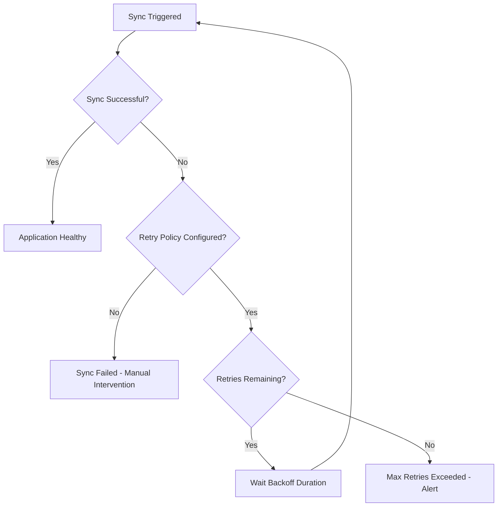
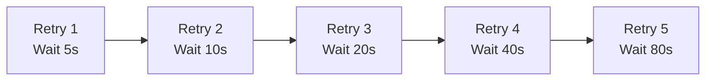
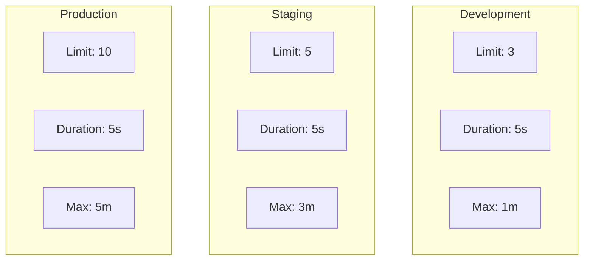
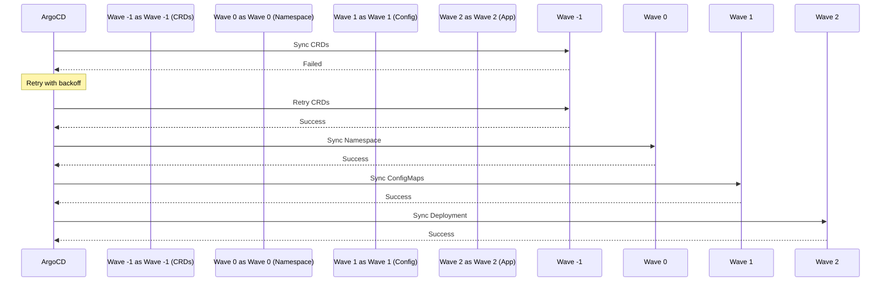

# How to Build ArgoCD Retry Policy

Author: [nawazdhandala](https://github.com/nawazdhandala)

Tags: ArgoCD, GitOps, Kubernetes, Resilience

Description: Learn how to configure robust retry policies in ArgoCD to handle transient failures and ensure reliable application deployments.

---

Deployments fail. Networks hiccup. APIs timeout. A solid retry policy in ArgoCD ensures your GitOps workflow recovers gracefully from transient failures instead of leaving applications in a broken state.

## Why Retry Policies Matter

Without retry policies, a temporary network glitch or API rate limit can fail your entire deployment. You end up with manual intervention, frustrated developers, and inconsistent cluster state.

Here is how retry policies fit into the ArgoCD sync lifecycle.



## Basic Retry Configuration

ArgoCD supports retry policies at the Application level. The retry configuration goes inside the `syncPolicy` section.

This example shows a basic retry policy with 5 attempts and exponential backoff starting at 5 seconds.

```yaml
apiVersion: argoproj.io/v1alpha1
kind: Application
metadata:
  name: myapp
  namespace: argocd
spec:
  project: default
  source:
    repoURL: https://github.com/myorg/myapp.git
    targetRevision: HEAD
    path: k8s/production
  destination:
    server: https://kubernetes.default.svc
    namespace: production
  syncPolicy:
    automated:
      prune: true
      selfHeal: true
    retry:
      limit: 5
      backoff:
        duration: 5s
        factor: 2
        maxDuration: 3m
```

## Understanding Backoff Parameters

The backoff configuration controls how ArgoCD waits between retry attempts.

| Parameter | Description | Example |
|-----------|-------------|---------|
| `duration` | Initial wait time before first retry | `5s` |
| `factor` | Multiplier applied to duration after each retry | `2` |
| `maxDuration` | Maximum wait time between retries | `3m` |

Here is how the backoff calculation works with a factor of 2.



The formula is: `wait = min(duration * (factor ^ attempt), maxDuration)`

## Production-Ready Retry Policy

For production environments, you want a balanced retry policy that handles common failure scenarios without excessive delays.

This configuration handles most transient failures while respecting reasonable timeout limits.

```yaml
apiVersion: argoproj.io/v1alpha1
kind: Application
metadata:
  name: production-app
  namespace: argocd
spec:
  project: production
  source:
    repoURL: https://github.com/myorg/production-app.git
    targetRevision: main
    path: manifests/production
  destination:
    server: https://kubernetes.default.svc
    namespace: production
  syncPolicy:
    automated:
      prune: true
      selfHeal: true
      allowEmpty: false
    syncOptions:
      - Validate=true
      - CreateNamespace=true
      - PrunePropagationPolicy=foreground
      - PruneLast=true
    retry:
      limit: 10
      backoff:
        duration: 5s
        factor: 2
        maxDuration: 5m
```

## Retry Policy for Different Environments

Different environments have different reliability requirements. Development can tolerate fewer retries while production needs more resilience.

Here is a comparison of retry strategies by environment.



### Development Environment

Fast feedback is more important than reliability in development.

```yaml
apiVersion: argoproj.io/v1alpha1
kind: Application
metadata:
  name: myapp-dev
  namespace: argocd
spec:
  project: development
  source:
    repoURL: https://github.com/myorg/myapp.git
    targetRevision: develop
    path: k8s/development
  destination:
    server: https://kubernetes.default.svc
    namespace: development
  syncPolicy:
    automated:
      prune: true
      selfHeal: true
    retry:
      limit: 3
      backoff:
        duration: 5s
        factor: 2
        maxDuration: 1m
```

### Staging Environment

Balance between fast feedback and production-like reliability.

```yaml
apiVersion: argoproj.io/v1alpha1
kind: Application
metadata:
  name: myapp-staging
  namespace: argocd
spec:
  project: staging
  source:
    repoURL: https://github.com/myorg/myapp.git
    targetRevision: main
    path: k8s/staging
  destination:
    server: https://kubernetes.default.svc
    namespace: staging
  syncPolicy:
    automated:
      prune: true
      selfHeal: true
    retry:
      limit: 5
      backoff:
        duration: 5s
        factor: 2
        maxDuration: 3m
```

## Using ApplicationSets with Retry Policies

When managing multiple applications with ApplicationSets, you can define retry policies in the template that applies to all generated applications.

This ApplicationSet creates applications for each environment with appropriate retry policies.

```yaml
apiVersion: argoproj.io/v1alpha1
kind: ApplicationSet
metadata:
  name: myapp-environments
  namespace: argocd
spec:
  generators:
    - list:
        elements:
          - env: development
            retryLimit: "3"
            maxDuration: "1m"
          - env: staging
            retryLimit: "5"
            maxDuration: "3m"
          - env: production
            retryLimit: "10"
            maxDuration: "5m"
  template:
    metadata:
      name: 'myapp-{{env}}'
    spec:
      project: '{{env}}'
      source:
        repoURL: https://github.com/myorg/myapp.git
        targetRevision: HEAD
        path: 'k8s/{{env}}'
      destination:
        server: https://kubernetes.default.svc
        namespace: '{{env}}'
      syncPolicy:
        automated:
          prune: true
          selfHeal: true
        retry:
          limit: '{{retryLimit}}'
          backoff:
            duration: 5s
            factor: 2
            maxDuration: '{{maxDuration}}'
```

## Handling Specific Failure Scenarios

### Transient Network Failures

Network issues typically resolve within seconds. A moderate retry with quick backoff works well.

```yaml
retry:
  limit: 5
  backoff:
    duration: 2s
    factor: 2
    maxDuration: 30s
```

### API Rate Limiting

When hitting rate limits, you need longer backoff periods to let the rate limit window reset.

```yaml
retry:
  limit: 8
  backoff:
    duration: 30s
    factor: 2
    maxDuration: 10m
```

### Resource Quota Exhaustion

If sync fails due to quota limits, retrying quickly does not help. Use longer intervals.

```yaml
retry:
  limit: 5
  backoff:
    duration: 1m
    factor: 2
    maxDuration: 15m
```

## Combining Retry Policy with Sync Waves

Sync waves control deployment order. Retry policies apply to each wave independently.

Here is how sync waves and retries interact.



This example shows a complete application with sync waves and retry policy.

```yaml
apiVersion: argoproj.io/v1alpha1
kind: Application
metadata:
  name: myapp-with-waves
  namespace: argocd
spec:
  project: default
  source:
    repoURL: https://github.com/myorg/myapp.git
    targetRevision: HEAD
    path: k8s/production
  destination:
    server: https://kubernetes.default.svc
    namespace: production
  syncPolicy:
    automated:
      prune: true
      selfHeal: true
    syncOptions:
      - CreateNamespace=true
    retry:
      limit: 5
      backoff:
        duration: 5s
        factor: 2
        maxDuration: 3m
```

And the corresponding manifests with sync wave annotations.

```yaml
# Wave -1: Custom Resource Definitions
apiVersion: apiextensions.k8s.io/v1
kind: CustomResourceDefinition
metadata:
  name: myresources.example.com
  annotations:
    argocd.argoproj.io/sync-wave: "-1"
spec:
  group: example.com
  versions:
    - name: v1
      served: true
      storage: true
      schema:
        openAPIV3Schema:
          type: object
  scope: Namespaced
  names:
    plural: myresources
    singular: myresource
    kind: MyResource

---
# Wave 0: Namespace
apiVersion: v1
kind: Namespace
metadata:
  name: myapp
  annotations:
    argocd.argoproj.io/sync-wave: "0"

---
# Wave 1: ConfigMap
apiVersion: v1
kind: ConfigMap
metadata:
  name: myapp-config
  namespace: myapp
  annotations:
    argocd.argoproj.io/sync-wave: "1"
data:
  config.yaml: |
    environment: production

---
# Wave 2: Deployment
apiVersion: apps/v1
kind: Deployment
metadata:
  name: myapp
  namespace: myapp
  annotations:
    argocd.argoproj.io/sync-wave: "2"
spec:
  replicas: 3
  selector:
    matchLabels:
      app: myapp
  template:
    metadata:
      labels:
        app: myapp
    spec:
      containers:
        - name: myapp
          image: myapp:latest
```

## Monitoring Retry Behavior

ArgoCD exposes Prometheus metrics for retry monitoring. Here are the key metrics to track.

| Metric | Description |
|--------|-------------|
| `argocd_app_sync_total` | Total sync attempts including retries |
| `argocd_app_reconcile_count` | Number of reconciliation attempts |
| `argocd_app_info` | Application status including sync state |

This Prometheus alerting rule fires when an application exceeds retry limits.

```yaml
apiVersion: monitoring.coreos.com/v1
kind: PrometheusRule
metadata:
  name: argocd-retry-alerts
  namespace: monitoring
spec:
  groups:
    - name: argocd-retries
      rules:
        - alert: ArgocdAppSyncRetryExhausted
          expr: |
            argocd_app_info{sync_status="OutOfSync"} == 1
            and on(name)
            increase(argocd_app_sync_total{phase="Failed"}[30m]) > 5
          for: 5m
          labels:
            severity: warning
          annotations:
            summary: "ArgoCD application {{ $labels.name }} has exhausted sync retries"
            description: "Application {{ $labels.name }} has failed to sync multiple times in the last 30 minutes"
```

## Setting Up Notifications for Retry Failures

Configure ArgoCD notifications to alert when retries are exhausted.

First, set up the notification configuration.

```yaml
apiVersion: v1
kind: ConfigMap
metadata:
  name: argocd-notifications-cm
  namespace: argocd
data:
  service.slack: |
    token: $slack-token
  template.app-sync-failed: |
    message: |
      :x: Application {{.app.metadata.name}} sync failed after retries
      Repository: {{.app.spec.source.repoURL}}
      Revision: {{.app.status.sync.revision}}
      Error: {{.app.status.operationState.message}}
  trigger.on-sync-failed: |
    - description: Application sync has failed
      send:
        - app-sync-failed
      when: app.status.operationState.phase in ['Failed', 'Error']
```

Then annotate your applications to receive notifications.

```yaml
apiVersion: argoproj.io/v1alpha1
kind: Application
metadata:
  name: myapp
  namespace: argocd
  annotations:
    notifications.argoproj.io/subscribe.on-sync-failed.slack: alerts-channel
spec:
  # ... rest of spec
```

## Retry Policy Anti-Patterns

Avoid these common mistakes when configuring retry policies.

### Too Many Retries

Setting an extremely high retry limit can mask underlying issues and delay failure detection.

```yaml
# Bad: Too many retries hide real problems
retry:
  limit: 100
  backoff:
    duration: 1s
    factor: 1
    maxDuration: 1s
```

### No Backoff Factor

A factor of 1 means constant retry intervals which can overwhelm failing services.

```yaml
# Bad: No exponential backoff
retry:
  limit: 10
  backoff:
    duration: 5s
    factor: 1
    maxDuration: 5s
```

### Extremely Short Max Duration

Very short max duration limits the effectiveness of exponential backoff.

```yaml
# Bad: Max duration too short for exponential backoff to help
retry:
  limit: 10
  backoff:
    duration: 5s
    factor: 2
    maxDuration: 10s
```

## CLI Commands for Retry Management

Use the ArgoCD CLI to manage and monitor retry behavior.

Check application sync status and retry history.

```bash
# View application details including sync status
argocd app get myapp

# Watch sync progress in real-time
argocd app get myapp --watch

# Force a sync with retry
argocd app sync myapp --retry-limit 5 --retry-backoff-duration 5s

# View sync history
argocd app history myapp
```

Manually trigger a sync when automatic retries are exhausted.

```bash
# Force sync ignoring retry state
argocd app sync myapp --force

# Sync with specific revision
argocd app sync myapp --revision HEAD
```

## Best Practices Summary

Here is a checklist for implementing effective retry policies.

1. **Start with sensible defaults** - 5 retries with 5s initial duration and factor of 2
2. **Adjust per environment** - Production needs more resilience than development
3. **Set reasonable max duration** - 3-5 minutes covers most transient failures
4. **Monitor retry metrics** - Set up alerts for exhausted retries
5. **Configure notifications** - Get alerted when applications fail after retries
6. **Test failure scenarios** - Verify retry behavior with simulated failures
7. **Document your policy** - Help team members understand retry configuration

---

A well-configured retry policy is essential for production GitOps workflows. Start with the production-ready configuration shown above, monitor retry behavior with Prometheus metrics, and adjust based on your specific failure patterns. Your deployments will become more resilient, and you will spend less time manually recovering from transient failures.
