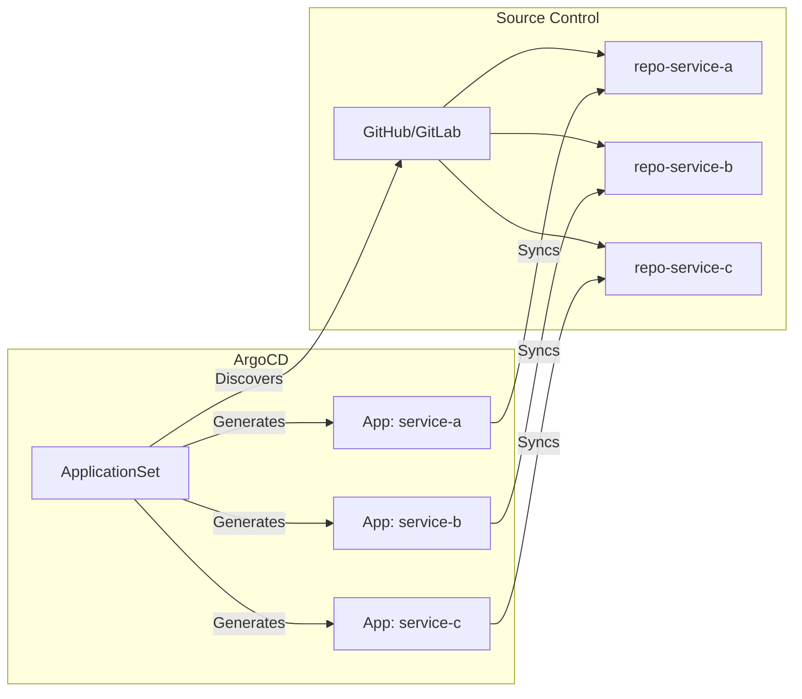
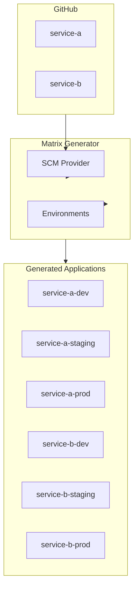

# How to Implement ArgoCD SCM Provider Generator

Author: [nawazdhandala](https://github.com/nawazdhandala)

Tags: ArgoCD, GitOps, Kubernetes, SCM

Description: Learn how to automatically generate ArgoCD Applications from repositories in your GitHub, GitLab, or Bitbucket organizations using the SCM Provider Generator.

---

Managing hundreds of microservices across multiple repositories is a challenge. The ArgoCD SCM Provider Generator solves this by automatically discovering repositories in your source control management (SCM) provider and generating Applications for each one. No more manually creating Application manifests for every new service.

## What Is the SCM Provider Generator?

The SCM Provider Generator is part of ArgoCD ApplicationSets. It scans your GitHub, GitLab, Bitbucket, or Azure DevOps organization and creates ArgoCD Applications based on repository filters.



Key benefits:
- **Auto-discovery** - New repos automatically get ArgoCD Applications
- **Consistent configuration** - All apps follow the same template
- **Reduced toil** - No manual Application creation
- **Scalable** - Handle hundreds of repositories effortlessly

## Prerequisites

Before implementing the SCM Provider Generator, ensure you have:

- ArgoCD v2.3 or later installed
- ApplicationSet controller enabled (included by default in ArgoCD 2.3+)
- Access token for your SCM provider
- Repositories following a consistent structure

## Setting Up GitHub Integration

### Step 1: Create a GitHub Personal Access Token

Create a token with the following permissions:

- `repo` (for private repositories)
- `read:org` (for organization access)

Go to GitHub Settings > Developer settings > Personal access tokens > Generate new token.

### Step 2: Store the Token in Kubernetes

Create a secret containing your GitHub token.

```yaml
apiVersion: v1
kind: Secret
metadata:
  name: github-token
  namespace: argocd
type: Opaque
stringData:
  token: ghp_your_github_token_here
```

Apply the secret to your cluster.

```bash
kubectl apply -f github-token-secret.yaml
```

### Step 3: Create the ApplicationSet

This ApplicationSet discovers all repositories in the `myorg` organization that have a `k8s/` directory.

```yaml
apiVersion: argoproj.io/v1alpha1
kind: ApplicationSet
metadata:
  name: org-services
  namespace: argocd
spec:
  generators:
    - scmProvider:
        github:
          organization: myorg
          tokenRef:
            secretName: github-token
            key: token
        filters:
          - repositoryMatch: "^service-.*"
            pathsExist:
              - k8s/deployment.yaml
  template:
    metadata:
      name: '{{repository}}'
    spec:
      project: default
      source:
        repoURL: '{{url}}'
        targetRevision: '{{branch}}'
        path: k8s
      destination:
        server: https://kubernetes.default.svc
        namespace: '{{repository}}'
      syncPolicy:
        automated:
          prune: true
          selfHeal: true
        syncOptions:
          - CreateNamespace=true
```

Apply the ApplicationSet.

```bash
kubectl apply -f applicationset.yaml
```

## Understanding the Template Variables

The SCM Provider Generator exposes several variables for use in your templates:

| Variable | Description | Example |
|----------|-------------|---------|
| `{{repository}}` | Repository name | `service-users` |
| `{{organization}}` | Organization/owner name | `myorg` |
| `{{url}}` | Full clone URL | `https://github.com/myorg/service-users.git` |
| `{{branch}}` | Default branch | `main` |
| `{{sha}}` | Latest commit SHA | `abc123...` |
| `{{labels}}` | Repository labels/topics | `backend,api` |

## Filtering Repositories

You can filter which repositories get Applications using multiple criteria.

### Filter by Repository Name

Match repositories using regex patterns.

```yaml
generators:
  - scmProvider:
      github:
        organization: myorg
        tokenRef:
          secretName: github-token
          key: token
      filters:
        - repositoryMatch: "^(service|api)-.*"
```

### Filter by Branch

Only include repositories with specific branches.

```yaml
generators:
  - scmProvider:
      github:
        organization: myorg
        tokenRef:
          secretName: github-token
          key: token
      filters:
        - branchMatch: "^main$"
```

### Filter by Path Existence

Only include repositories containing specific files or directories.

```yaml
generators:
  - scmProvider:
      github:
        organization: myorg
        tokenRef:
          secretName: github-token
          key: token
      filters:
        - pathsExist:
            - k8s/
            - Dockerfile
```

### Filter by Labels/Topics

Match repositories with specific GitHub topics.

```yaml
generators:
  - scmProvider:
      github:
        organization: myorg
        tokenRef:
          secretName: github-token
          key: token
      filters:
        - labelMatch: "kubernetes"
```

### Combining Filters

Filters within the same object are AND conditions. Multiple filter objects are OR conditions.

```yaml
generators:
  - scmProvider:
      github:
        organization: myorg
        tokenRef:
          secretName: github-token
          key: token
      filters:
        # Match services with k8s config (AND)
        - repositoryMatch: "^service-.*"
          pathsExist:
            - k8s/
        # OR match APIs with helm charts
        - repositoryMatch: "^api-.*"
          pathsExist:
            - charts/
```

## GitLab Integration

For GitLab, the configuration is similar but uses GitLab-specific options.

### Create GitLab Token Secret

```yaml
apiVersion: v1
kind: Secret
metadata:
  name: gitlab-token
  namespace: argocd
type: Opaque
stringData:
  token: glpat-your_gitlab_token
```

### GitLab ApplicationSet

This configuration works with GitLab groups.

```yaml
apiVersion: argoproj.io/v1alpha1
kind: ApplicationSet
metadata:
  name: gitlab-services
  namespace: argocd
spec:
  generators:
    - scmProvider:
        gitlab:
          group: mygroup
          includeSubgroups: true
          tokenRef:
            secretName: gitlab-token
            key: token
        filters:
          - repositoryMatch: "^service-.*"
            pathsExist:
              - k8s/
  template:
    metadata:
      name: '{{repository}}'
    spec:
      project: default
      source:
        repoURL: '{{url}}'
        targetRevision: '{{branch}}'
        path: k8s
      destination:
        server: https://kubernetes.default.svc
        namespace: '{{repository}}'
```

## Bitbucket Integration

### Bitbucket Cloud

```yaml
apiVersion: argoproj.io/v1alpha1
kind: ApplicationSet
metadata:
  name: bitbucket-services
  namespace: argocd
spec:
  generators:
    - scmProvider:
        bitbucket:
          owner: myworkspace
          user: myuser
          appPasswordRef:
            secretName: bitbucket-creds
            key: password
        filters:
          - repositoryMatch: "^service-.*"
  template:
    metadata:
      name: '{{repository}}'
    spec:
      project: default
      source:
        repoURL: '{{url}}'
        targetRevision: '{{branch}}'
        path: k8s
      destination:
        server: https://kubernetes.default.svc
        namespace: '{{repository}}'
```

### Bitbucket Server

```yaml
generators:
  - scmProvider:
      bitbucketServer:
        project: MYPROJECT
        api: https://bitbucket.mycompany.com
        basicAuth:
          secretRef:
            secretName: bitbucket-server-creds
            usernameKey: username
            passwordKey: password
```

## Multi-Environment Deployments

Deploy the same repositories to multiple environments using matrix generators.



This configuration creates Applications for each repository in each environment.

```yaml
apiVersion: argoproj.io/v1alpha1
kind: ApplicationSet
metadata:
  name: multi-env-services
  namespace: argocd
spec:
  generators:
    - matrix:
        generators:
          - scmProvider:
              github:
                organization: myorg
                tokenRef:
                  secretName: github-token
                  key: token
              filters:
                - repositoryMatch: "^service-.*"
                  pathsExist:
                    - k8s/overlays/
          - list:
              elements:
                - env: development
                  cluster: https://kubernetes.default.svc
                - env: staging
                  cluster: https://staging.example.com
                - env: production
                  cluster: https://prod.example.com
  template:
    metadata:
      name: '{{repository}}-{{env}}'
    spec:
      project: default
      source:
        repoURL: '{{url}}'
        targetRevision: '{{branch}}'
        path: 'k8s/overlays/{{env}}'
      destination:
        server: '{{cluster}}'
        namespace: '{{repository}}'
      syncPolicy:
        automated:
          prune: true
          selfHeal: true
```

## Advanced Patterns

### Using Repository Metadata

Add labels to your Applications based on repository topics.

```yaml
template:
  metadata:
    name: '{{repository}}'
    labels:
      team: '{{labels}}'
      repository: '{{repository}}'
```

### Custom Path Per Repository

Use repository naming conventions to determine Kubernetes manifest paths.

```yaml
template:
  spec:
    source:
      path: 'deploy/{{repository | replace "service-" ""}}'
```

### Webhook Integration

Configure webhooks to trigger immediate Application generation when new repositories are created.

```yaml
apiVersion: argoproj.io/v1alpha1
kind: ApplicationSet
metadata:
  name: org-services
  namespace: argocd
spec:
  generators:
    - scmProvider:
        github:
          organization: myorg
          tokenRef:
            secretName: github-token
            key: token
          webhookRef:
            secret: webhook-secret
            key: webhook.secret
```

### Clone Options for Performance

For organizations with many repositories, optimize clone operations.

```yaml
generators:
  - scmProvider:
      github:
        organization: myorg
        tokenRef:
          secretName: github-token
          key: token
        cloneProtocol: https
      cloneOptions:
        shallow: true
```

## Handling Private Repositories

For private repositories, you need to configure ArgoCD with repository credentials.

### Repository Credentials Template

Create a credential template that matches your organization's repositories.

```yaml
apiVersion: v1
kind: Secret
metadata:
  name: repo-creds-github
  namespace: argocd
  labels:
    argocd.argoproj.io/secret-type: repo-creds
stringData:
  type: git
  url: https://github.com/myorg
  password: ghp_your_token
  username: git
```

This template automatically applies to all repositories under `https://github.com/myorg`.

## Monitoring and Troubleshooting

### Check ApplicationSet Status

```bash
kubectl get applicationsets -n argocd

kubectl describe applicationset org-services -n argocd
```

### View Generated Applications

```bash
argocd app list

kubectl get applications -n argocd -l app.kubernetes.io/instance=org-services
```

### Debug Repository Discovery

Check the ApplicationSet controller logs for discovery issues.

```bash
kubectl logs -n argocd -l app.kubernetes.io/name=argocd-applicationset-controller -f
```

### Common Issues

**No Applications Generated**

1. Verify the token has correct permissions
2. Check filter patterns match your repositories
3. Ensure `pathsExist` paths are correct

**Authentication Errors**

1. Verify the secret exists and has the correct key
2. Check token expiration
3. Ensure the token has organization access

**Rate Limiting**

For large organizations, you may hit API rate limits. Configure polling intervals.

```yaml
spec:
  generators:
    - scmProvider:
        github:
          organization: myorg
          tokenRef:
            secretName: github-token
            key: token
        requeueAfterSeconds: 300  # Poll every 5 minutes
```

## Best Practices

### 1. Use Consistent Repository Structure

Standardize your repository layout across all services.

```
service-example/
├── k8s/
│   ├── base/
│   │   ├── kustomization.yaml
│   │   ├── deployment.yaml
│   │   └── service.yaml
│   └── overlays/
│       ├── development/
│       ├── staging/
│       └── production/
├── src/
└── Dockerfile
```

### 2. Implement Proper RBAC

Restrict what namespaces and resources the generated Applications can deploy to.

```yaml
apiVersion: argoproj.io/v1alpha1
kind: AppProject
metadata:
  name: scm-services
  namespace: argocd
spec:
  sourceRepos:
    - 'https://github.com/myorg/*'
  destinations:
    - namespace: 'service-*'
      server: https://kubernetes.default.svc
  clusterResourceWhitelist:
    - group: ''
      kind: Namespace
```

### 3. Use Progressive Sync

For large organizations, avoid syncing all Applications simultaneously.

```yaml
template:
  spec:
    syncPolicy:
      automated:
        prune: true
        selfHeal: true
      retry:
        limit: 5
        backoff:
          duration: 5s
          factor: 2
          maxDuration: 3m
```

### 4. Tag Repositories Appropriately

Use GitHub topics or GitLab labels to categorize repositories, then filter by label.

```yaml
filters:
  - labelMatch: "argocd-managed"
    repositoryMatch: "^service-.*"
```

---

The SCM Provider Generator transforms ArgoCD from a tool that manages individual Applications into a platform that manages your entire organization's deployments. Start with a simple filter matching your repository naming convention, then expand to multi-environment deployments as your GitOps maturity grows. The combination of automatic discovery and templated Applications means your platform team can focus on standards rather than configuration.
