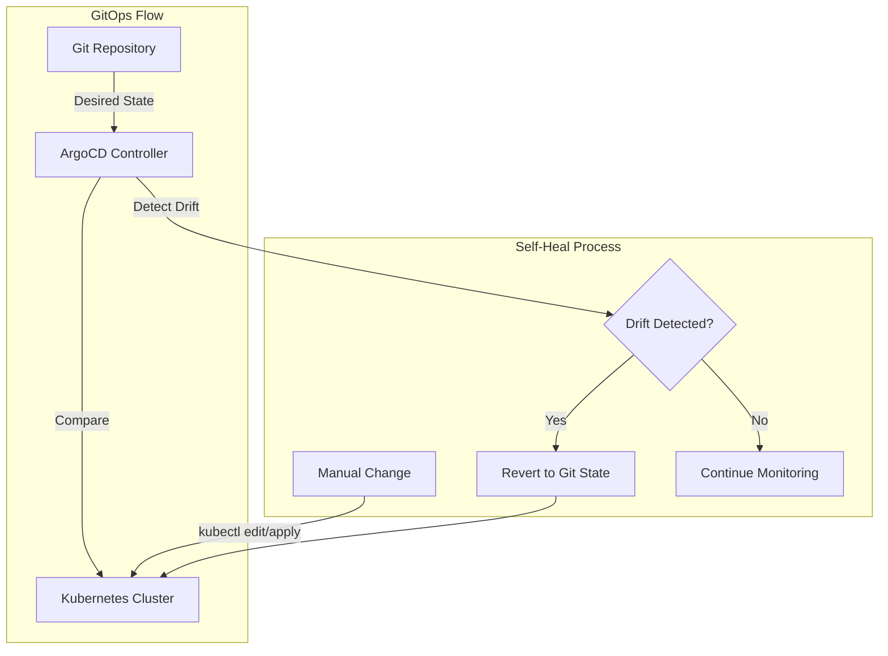
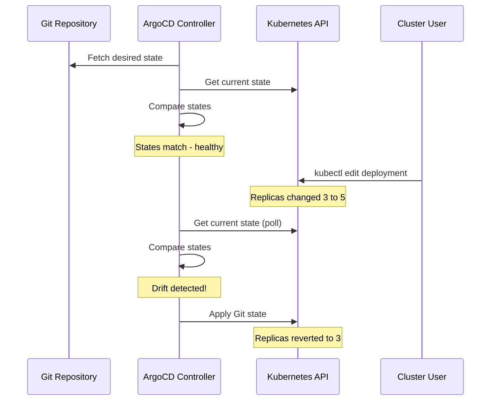
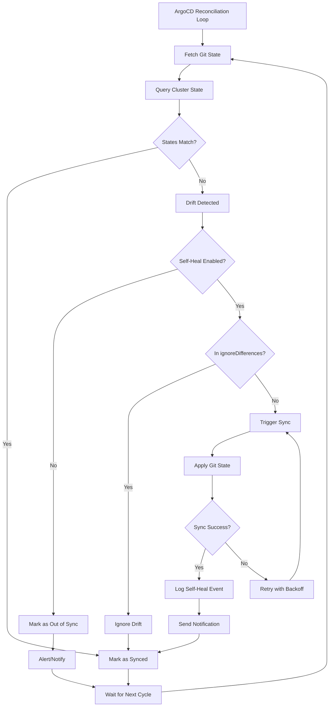

# How to Create ArgoCD Self-Heal Policy

Author: [nawazdhandala](https://github.com/nawazdhandala)

Tags: ArgoCD, GitOps, Kubernetes, Self-Healing

Description: Learn how to configure ArgoCD self-heal policies to automatically detect and fix configuration drift in your Kubernetes clusters.

---

Manual changes to Kubernetes clusters are inevitable. Someone runs `kubectl edit` to fix an urgent issue. A developer scales a deployment directly. These ad-hoc changes create drift between your Git repository and the actual cluster state. ArgoCD self-heal policy automatically detects and reverts these changes, ensuring your cluster always matches what is defined in Git.

## What Is Self-Healing in ArgoCD?

Self-healing is a sync policy that continuously monitors your cluster for drift and automatically corrects it. When someone makes a manual change that deviates from the Git-defined state, ArgoCD detects the difference and syncs the resource back to the desired configuration.



## Why Use Self-Heal?

Without self-heal, your cluster can drift from Git without anyone knowing. This causes several problems:

1. **Configuration inconsistency** - Production differs from what is documented in Git
2. **Debugging difficulty** - The actual state does not match expected state
3. **Compliance violations** - Audit trails become incomplete
4. **Deployment failures** - Next sync may conflict with manual changes

Self-heal addresses these by making Git the single source of truth in practice, not just in theory.

## Enabling Self-Heal on an Application

### Basic Self-Heal Configuration

The simplest way to enable self-heal is by setting it in the Application spec. This YAML defines an application with automated sync and self-heal enabled.

```yaml
apiVersion: argoproj.io/v1alpha1
kind: Application
metadata:
  name: myapp
  namespace: argocd
spec:
  project: default
  source:
    repoURL: https://github.com/myorg/myapp.git
    targetRevision: HEAD
    path: k8s/production
  destination:
    server: https://kubernetes.default.svc
    namespace: production
  syncPolicy:
    automated:
      selfHeal: true
```

### Self-Heal with Auto-Prune

Enable both self-heal and auto-prune to also remove resources that no longer exist in Git. This ensures deleted resources in Git are removed from the cluster.

```yaml
apiVersion: argoproj.io/v1alpha1
kind: Application
metadata:
  name: myapp
  namespace: argocd
spec:
  project: default
  source:
    repoURL: https://github.com/myorg/myapp.git
    targetRevision: HEAD
    path: k8s/production
  destination:
    server: https://kubernetes.default.svc
    namespace: production
  syncPolicy:
    automated:
      selfHeal: true
      prune: true
    syncOptions:
      - CreateNamespace=true
```

### Using the ArgoCD CLI

You can enable self-heal on an existing application using the CLI. This command updates the sync policy without modifying the Application YAML directly.

```bash
argocd app set myapp --self-heal
```

To enable both self-heal and auto-prune at once:

```bash
argocd app set myapp --sync-policy automated --self-heal --auto-prune
```

## How Self-Heal Works Internally

Understanding the internal mechanism helps you configure self-heal effectively.



ArgoCD uses a reconciliation loop that:

1. Periodically fetches the desired state from Git
2. Queries the Kubernetes API for the current state
3. Compares the two states using a diff algorithm
4. If drift is detected and self-heal is enabled, triggers a sync

The default reconciliation interval is 3 minutes, configurable via `timeout.reconciliation` in the ArgoCD ConfigMap.

## Configuring Self-Heal Behavior

### Adjusting Reconciliation Interval

To change how frequently ArgoCD checks for drift, modify the ArgoCD ConfigMap. This example sets the reconciliation interval to 60 seconds for faster drift detection.

```yaml
apiVersion: v1
kind: ConfigMap
metadata:
  name: argocd-cm
  namespace: argocd
data:
  timeout.reconciliation: 60s
```

### Ignoring Specific Fields

Some fields change frequently and should not trigger self-heal. Use `ignoreDifferences` to exclude them. This is useful for fields managed by controllers or operators.

```yaml
apiVersion: argoproj.io/v1alpha1
kind: Application
metadata:
  name: myapp
  namespace: argocd
spec:
  project: default
  source:
    repoURL: https://github.com/myorg/myapp.git
    targetRevision: HEAD
    path: k8s/production
  destination:
    server: https://kubernetes.default.svc
    namespace: production
  syncPolicy:
    automated:
      selfHeal: true
  ignoreDifferences:
    - group: apps
      kind: Deployment
      jsonPointers:
        - /spec/replicas
    - group: ""
      kind: Service
      jsonPointers:
        - /spec/clusterIP
        - /spec/clusterIPs
```

### Ignoring Fields Managed by HPA

When using Horizontal Pod Autoscaler, the replica count should not be managed by ArgoCD. Configure ignoreDifferences to prevent self-heal from fighting with HPA.

```yaml
apiVersion: argoproj.io/v1alpha1
kind: Application
metadata:
  name: myapp
  namespace: argocd
spec:
  project: default
  source:
    repoURL: https://github.com/myorg/myapp.git
    targetRevision: HEAD
    path: k8s/production
  destination:
    server: https://kubernetes.default.svc
    namespace: production
  syncPolicy:
    automated:
      selfHeal: true
  ignoreDifferences:
    - group: apps
      kind: Deployment
      jqPathExpressions:
        - .spec.replicas
```

## Self-Heal with ApplicationSets

When managing multiple applications, use ApplicationSets to apply consistent self-heal policies across all of them.

### Environment-Based ApplicationSet

This ApplicationSet creates applications for development, staging, and production environments, all with self-heal enabled.

```yaml
apiVersion: argoproj.io/v1alpha1
kind: ApplicationSet
metadata:
  name: myapp-environments
  namespace: argocd
spec:
  generators:
    - list:
        elements:
          - env: development
            selfHeal: "true"
          - env: staging
            selfHeal: "true"
          - env: production
            selfHeal: "true"
  template:
    metadata:
      name: 'myapp-{{env}}'
    spec:
      project: default
      source:
        repoURL: https://github.com/myorg/myapp.git
        targetRevision: HEAD
        path: 'k8s/overlays/{{env}}'
      destination:
        server: https://kubernetes.default.svc
        namespace: '{{env}}'
      syncPolicy:
        automated:
          selfHeal: true
          prune: true
```

### Selective Self-Heal by Environment

You may want self-heal in production but not in development where engineers experiment. Use conditional configuration.

```yaml
apiVersion: argoproj.io/v1alpha1
kind: ApplicationSet
metadata:
  name: myapp-environments
  namespace: argocd
spec:
  generators:
    - list:
        elements:
          - env: development
            selfHeal: "false"
          - env: staging
            selfHeal: "true"
          - env: production
            selfHeal: "true"
  template:
    metadata:
      name: 'myapp-{{env}}'
    spec:
      project: default
      source:
        repoURL: https://github.com/myorg/myapp.git
        targetRevision: HEAD
        path: 'k8s/overlays/{{env}}'
      destination:
        server: https://kubernetes.default.svc
        namespace: '{{env}}'
  templatePatch: |
    {{- if eq .selfHeal "true" }}
    spec:
      syncPolicy:
        automated:
          selfHeal: true
          prune: true
    {{- end }}
```

## Self-Heal Policy in Projects

Apply self-heal policies at the project level to enforce consistency across all applications in a project.

```yaml
apiVersion: argoproj.io/v1alpha1
kind: AppProject
metadata:
  name: production-apps
  namespace: argocd
spec:
  description: Production applications with strict GitOps
  sourceRepos:
    - 'https://github.com/myorg/*'
  destinations:
    - namespace: 'prod-*'
      server: https://kubernetes.default.svc
  clusterResourceWhitelist:
    - group: ''
      kind: Namespace
  syncWindows:
    - kind: allow
      schedule: '0 6-22 * * *'
      duration: 16h
      applications:
        - '*'
      manualSync: true
```

## Monitoring Self-Heal Activity

### Check Application Status

View the sync status and recent operations to see self-heal activity.

```bash
argocd app get myapp
```

Example output showing a self-heal sync:

```
Name:               myapp
Project:            default
Server:             https://kubernetes.default.svc
Namespace:          production
Sync Policy:        Automated (Prune, SelfHeal)
Sync Status:        Synced
Health Status:      Healthy

Operation:          Sync
Sync Revision:      abc123
Phase:              Succeeded
Start:              2026-01-30 10:15:32 +0000 UTC
Finished:           2026-01-30 10:15:35 +0000 UTC
Duration:           3s
Message:            successfully synced (self-heal)
```

### View Sync History

The sync history shows all synchronization events including self-heal operations.

```bash
argocd app history myapp
```

### Setting Up Notifications

Configure notifications to alert your team when self-heal occurs. This helps identify who is making manual changes.

```yaml
apiVersion: v1
kind: ConfigMap
metadata:
  name: argocd-notifications-cm
  namespace: argocd
data:
  service.slack: |
    token: $slack-token
  template.self-heal-triggered: |
    message: |
      :warning: Self-heal triggered for {{.app.metadata.name}}
      Drift was detected and automatically corrected.
      Review recent cluster activity.
  trigger.on-self-heal: |
    - description: Self-heal sync occurred
      send:
        - self-heal-triggered
      when: app.status.operationState.message contains 'self-heal'
```

Subscribe your application to the notification.

```yaml
apiVersion: argoproj.io/v1alpha1
kind: Application
metadata:
  name: myapp
  annotations:
    notifications.argoproj.io/subscribe.on-self-heal.slack: alerts
```

## Self-Heal Flow Visualization

This diagram shows the complete self-heal decision flow.



## Best Practices

### 1. Start with Monitoring Before Enforcement

Enable automated sync without self-heal first. Monitor what drift occurs, then enable self-heal once you understand the patterns.

```yaml
syncPolicy:
  automated:
    selfHeal: false  # Start here
    prune: false
```

### 2. Use Sync Windows for Controlled Self-Heal

Restrict when self-heal can occur to avoid disruption during critical periods.

```yaml
apiVersion: argoproj.io/v1alpha1
kind: Application
metadata:
  name: myapp
spec:
  syncPolicy:
    automated:
      selfHeal: true
  syncWindows:
    - kind: deny
      schedule: '0 0-6 * * *'
      duration: 6h
```

### 3. Document Ignored Fields

Keep a clear record of why certain fields are ignored. This helps future maintainers understand the configuration.

```yaml
ignoreDifferences:
  # Replicas managed by HPA - see JIRA-1234
  - group: apps
    kind: Deployment
    jsonPointers:
      - /spec/replicas
  # ClusterIP assigned by Kubernetes
  - group: ""
    kind: Service
    jsonPointers:
      - /spec/clusterIP
```

### 4. Test Self-Heal in Non-Production First

Verify self-heal behavior in development or staging before enabling in production.

```bash
# Make a manual change in staging
kubectl -n staging patch deployment myapp -p '{"spec":{"replicas":10}}'

# Watch ArgoCD revert it
argocd app get myapp-staging --watch
```

## Troubleshooting

### Self-Heal Not Triggering

Check if automated sync is enabled along with self-heal.

```bash
argocd app get myapp -o yaml | grep -A5 syncPolicy
```

Verify the application is not in a sync window that blocks syncs.

### Constant Sync Loops

If self-heal keeps triggering repeatedly, you likely have a field that changes after each sync. Common culprits include:

- Timestamps in annotations
- Generated fields like `resourceVersion`
- Fields managed by admission webhooks

Add problematic fields to `ignoreDifferences`.

### Self-Heal Fighting with Operators

If a Kubernetes operator manages certain fields, ArgoCD and the operator may fight over control. Either:

1. Add the field to `ignoreDifferences`
2. Remove the field from your Git manifests
3. Configure the operator to not manage that field

---

Self-heal is what makes GitOps truly declarative. Without it, Git is just documentation. With it, Git becomes the enforced source of truth. Enable self-heal, configure appropriate ignore rules, and set up notifications to catch drift before it becomes a problem.
