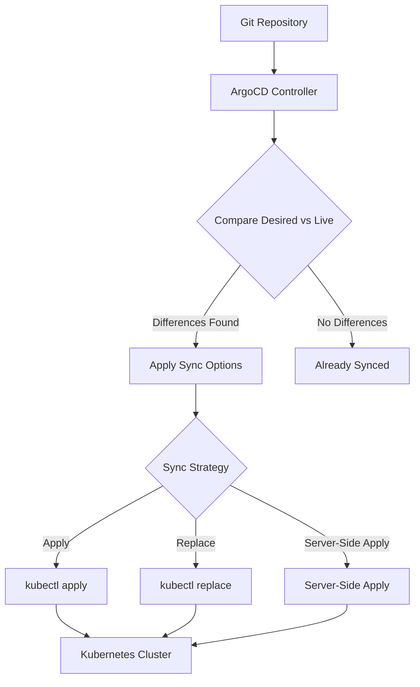
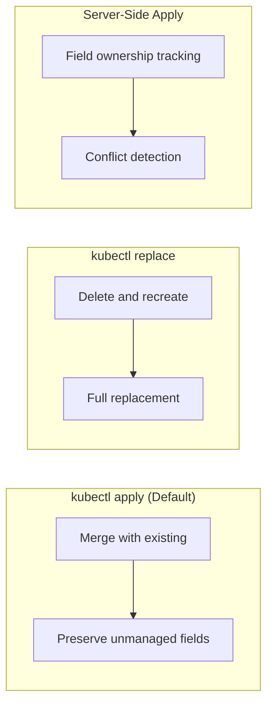
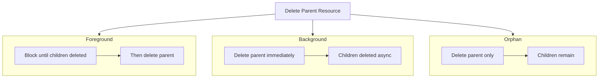
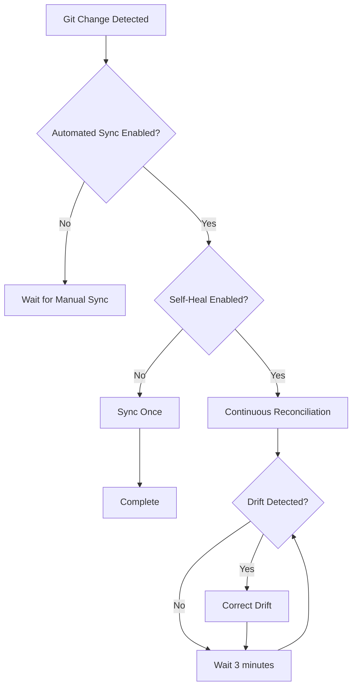

# How to Implement ArgoCD Sync Options

Author: [nawazdhandala](https://github.com/nawazdhandala)

Tags: ArgoCD, GitOps, Sync, Kubernetes

Description: Configure ArgoCD sync options to control how applications synchronize, prune resources, handle conflicts, and manage deployment behavior.

---

ArgoCD sync options give you fine-grained control over how your applications deploy to Kubernetes. The defaults work for simple cases, but production workloads need tuning. Here is how to configure sync options for reliability and safety.

## Understanding Sync Options

Sync options modify how ArgoCD applies resources to your cluster. They can be set at three levels:

1. **Application level** - Applies to all resources in the app
2. **Resource level** - Applies to specific resources via annotations
3. **Global level** - Applies to all applications (via ArgoCD config)



## Application-Level Sync Options

### Basic Configuration

```yaml
apiVersion: argoproj.io/v1alpha1
kind: Application
metadata:
  name: myapp
  namespace: argocd
spec:
  project: default
  source:
    repoURL: https://github.com/myorg/myapp.git
    targetRevision: HEAD
    path: k8s/production
  destination:
    server: https://kubernetes.default.svc
    namespace: production
  syncPolicy:
    automated:
      prune: true
      selfHeal: true
      allowEmpty: false
    syncOptions:
      - Validate=true
      - CreateNamespace=true
      - PrunePropagationPolicy=foreground
      - PruneLast=true
```

### Sync Options Breakdown

| Option | Default | Description |
|--------|---------|-------------|
| `Validate` | true | Validate resources against Kubernetes schema before applying |
| `CreateNamespace` | false | Create target namespace if it does not exist |
| `PruneLast` | false | Delete removed resources after all other resources sync |
| `ApplyOutOfSyncOnly` | false | Only apply resources that are out of sync |
| `Replace` | false | Use `kubectl replace` instead of `kubectl apply` |
| `ServerSideApply` | false | Use server-side apply for better conflict handling |
| `FailOnSharedResource` | false | Fail sync if a resource is managed by another app |
| `RespectIgnoreDifferences` | false | Use `ignoreDifferences` config during sync |

## Sync Strategies: Apply vs Replace vs Server-Side Apply

Choosing the right sync strategy prevents conflicts and ensures reliable deployments.



### When to Use Apply (Default)

Standard `kubectl apply` merges your manifest with the existing resource. Use this for most workloads.

```yaml
syncPolicy:
  syncOptions: []  # Default behavior, no special options needed
```

Pros:
- Works with most resources
- Preserves fields managed by controllers (like HPA replicas)
- Familiar behavior

Cons:
- Can leave orphaned fields when you remove them from manifests
- Merge conflicts possible with large manifests

### When to Use Replace

Replace deletes the resource and recreates it. Use this when you need a clean slate.

```yaml
syncPolicy:
  syncOptions:
    - Replace=true
```

Use cases:
- ConfigMaps or Secrets where you need to remove keys entirely
- Resources that do not support strategic merge patch
- Fixing corrupted resources

```yaml
# Resource-level replace for a specific ConfigMap
apiVersion: v1
kind: ConfigMap
metadata:
  name: app-config
  annotations:
    argocd.argoproj.io/sync-options: Replace=true
data:
  config.yaml: |
    setting: value
```

Warning: Replace causes brief downtime for the resource. Do not use on Deployments unless necessary.

### When to Use Server-Side Apply

Server-side apply tracks field ownership and detects conflicts automatically. Use this for shared resources or complex manifests.

```yaml
syncPolicy:
  syncOptions:
    - ServerSideApply=true
```

Benefits:
- Proper conflict detection when multiple controllers manage a resource
- Better handling of lists and maps
- Required for some CRDs with complex schemas

```yaml
apiVersion: argoproj.io/v1alpha1
kind: Application
metadata:
  name: shared-ingress
spec:
  syncPolicy:
    syncOptions:
      - ServerSideApply=true
  source:
    path: ingress
```

## Resource Pruning

Pruning removes resources from the cluster when they are deleted from Git. Without pruning, ArgoCD only adds and updates resources.

### Enable Pruning

```yaml
syncPolicy:
  automated:
    prune: true  # Enable automatic pruning
  syncOptions:
    - PruneLast=true  # Prune after all syncs complete
    - PrunePropagationPolicy=foreground  # Wait for dependents to delete
```

### Prune Propagation Policies



```yaml
syncPolicy:
  syncOptions:
    # Options: foreground, background, orphan
    - PrunePropagationPolicy=foreground
```

| Policy | Behavior | Use Case |
|--------|----------|----------|
| `foreground` | Wait for dependents before deleting parent | Stateful apps, ordered cleanup |
| `background` | Delete parent immediately, children async | Fast cleanup, stateless apps |
| `orphan` | Delete parent, leave children | Migrating ownership |

### Protect Resources from Pruning

Prevent specific resources from being deleted:

```yaml
apiVersion: v1
kind: PersistentVolumeClaim
metadata:
  name: database-pvc
  annotations:
    argocd.argoproj.io/sync-options: Prune=false
spec:
  accessModes:
    - ReadWriteOnce
  resources:
    requests:
      storage: 100Gi
```

## Selective Sync

Selective sync lets you synchronize specific resources instead of the entire application.

### Using the CLI

```bash
# Sync only Deployments
argocd app sync myapp --resource apps:Deployment:myapp

# Sync specific resources by name
argocd app sync myapp --resource :ConfigMap:app-config --resource :Secret:app-secrets

# Sync resources matching a label
argocd app sync myapp --label app.kubernetes.io/component=frontend
```

### Sync Only Out-of-Sync Resources

Skip resources that already match the desired state:

```yaml
syncPolicy:
  syncOptions:
    - ApplyOutOfSyncOnly=true
```

This speeds up large applications by skipping unchanged resources.

### Resource-Level Annotations

Control sync behavior per resource:

```yaml
apiVersion: apps/v1
kind: Deployment
metadata:
  name: myapp
  annotations:
    # Skip this resource during sync
    argocd.argoproj.io/sync-options: SkipDryRunOnMissingResource=true
    # Or combine multiple options
    argocd.argoproj.io/sync-options: Validate=false,Replace=true
```

## Handling Sync Conflicts

### Ignore Differences

Some fields change at runtime and should not trigger out-of-sync status:

```yaml
apiVersion: argoproj.io/v1alpha1
kind: Application
metadata:
  name: myapp
spec:
  ignoreDifferences:
    # Ignore replica count (managed by HPA)
    - group: apps
      kind: Deployment
      jsonPointers:
        - /spec/replicas
    # Ignore specific annotation
    - group: ""
      kind: Service
      jsonPointers:
        - /metadata/annotations/kubectl.kubernetes.io~1last-applied-configuration
    # Ignore using JQ path expressions
    - group: apps
      kind: Deployment
      jqPathExpressions:
        - .spec.template.spec.containers[].resources
```

### Respect Ignore Differences During Sync

By default, `ignoreDifferences` only affects status display. To also ignore during sync:

```yaml
syncPolicy:
  syncOptions:
    - RespectIgnoreDifferences=true
```

This prevents ArgoCD from overwriting runtime-managed fields.

## Automated Sync Settings



### Self-Healing

Self-heal reverts manual changes made directly to the cluster:

```yaml
syncPolicy:
  automated:
    selfHeal: true  # Revert manual kubectl changes
```

Use cases:
- Prevent configuration drift
- Enforce GitOps as single source of truth
- Block unauthorized changes

Warning: Self-heal can fight with controllers that modify resources. Use `ignoreDifferences` for those fields.

### Allow Empty

By default, ArgoCD rejects syncs that would delete all resources:

```yaml
syncPolicy:
  automated:
    allowEmpty: false  # Fail if sync would remove everything
```

Set to `true` only if you intentionally want to allow complete cleanup via Git.

## Sync Waves and Order

Control resource application order with sync waves:

```yaml
apiVersion: v1
kind: Namespace
metadata:
  name: myapp
  annotations:
    argocd.argoproj.io/sync-wave: "-1"  # Applied first

---
apiVersion: v1
kind: ConfigMap
metadata:
  name: app-config
  namespace: myapp
  annotations:
    argocd.argoproj.io/sync-wave: "0"  # Applied second

---
apiVersion: apps/v1
kind: Deployment
metadata:
  name: myapp
  namespace: myapp
  annotations:
    argocd.argoproj.io/sync-wave: "1"  # Applied last
```

Lower numbers sync first. Resources in the same wave sync in parallel.

## Complete Example

Here is a production-ready Application with recommended sync options:

```yaml
apiVersion: argoproj.io/v1alpha1
kind: Application
metadata:
  name: production-api
  namespace: argocd
  finalizers:
    - resources-finalizer.argocd.argoproj.io
spec:
  project: production
  source:
    repoURL: https://github.com/myorg/api-service.git
    targetRevision: main
    path: k8s/overlays/production
  destination:
    server: https://kubernetes.default.svc
    namespace: production
  syncPolicy:
    automated:
      prune: true
      selfHeal: true
      allowEmpty: false
    syncOptions:
      - Validate=true
      - CreateNamespace=true
      - PrunePropagationPolicy=foreground
      - PruneLast=true
      - ServerSideApply=true
      - ApplyOutOfSyncOnly=true
      - RespectIgnoreDifferences=true
    retry:
      limit: 5
      backoff:
        duration: 5s
        factor: 2
        maxDuration: 3m
  ignoreDifferences:
    - group: apps
      kind: Deployment
      jsonPointers:
        - /spec/replicas
    - group: autoscaling
      kind: HorizontalPodAutoscaler
      jsonPointers:
        - /status
```

## Troubleshooting Sync Issues

### Check Sync Status

```bash
# View detailed sync status
argocd app get myapp

# See what would change without applying
argocd app diff myapp

# Force a sync with specific options
argocd app sync myapp --force --prune
```

### Common Issues

**Issue: Resource always out of sync**

Fix: Add the field to `ignoreDifferences`:

```yaml
ignoreDifferences:
  - group: apps
    kind: Deployment
    jsonPointers:
      - /spec/template/metadata/annotations/kubectl.kubernetes.io~1restartedAt
```

**Issue: Sync fails with conflict error**

Fix: Enable server-side apply or replace:

```yaml
syncOptions:
  - ServerSideApply=true
```

**Issue: Prune deletes resources it should not**

Fix: Add prune protection annotation:

```yaml
metadata:
  annotations:
    argocd.argoproj.io/sync-options: Prune=false
```

---

Sync options are where ArgoCD flexibility meets your operational requirements. Start with the defaults, then add options as you encounter specific needs. The goal is reliable, predictable deployments where Git remains the source of truth.
