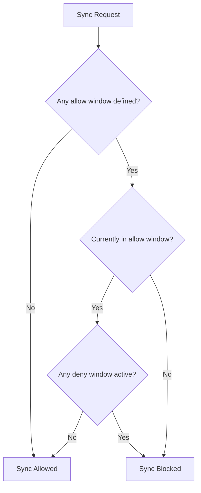
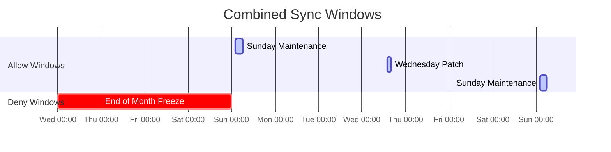

# How to Implement ArgoCD Sync Windows

Author: [nawazdhandala](https://github.com/nawazdhandala)

Tags: ArgoCD, GitOps, Sync Windows, Scheduling

Description: A practical guide to configuring ArgoCD sync windows in AppProject resources to control when applications can sync, including allow and deny windows, scheduling patterns, and maintenance window strategies.

---

Sync windows control when ArgoCD can sync applications. They let you block deployments during peak hours, restrict changes to maintenance windows, or prevent Friday evening deployments that ruin weekends.

## What Are Sync Windows?

Sync windows are time-based rules defined in AppProject resources. They specify when applications can or cannot sync to the target cluster.

```mermaid
gantt
    title Sync Window Schedule Example
    dateFormat HH:mm
    axisFormat %H:%M

    section Monday
    Deny (Business Hours)    :crit, 09:00, 8h
    Allow (Night)            :active, 00:00, 9h
    Allow (Evening)          :active, 17:00, 7h

    section Weekend
    Allow (All Day)          :active, 00:00, 24h
```



Two types of sync windows:

- **Allow windows**: Sync only works during these times
- **Deny windows**: Sync is blocked during these times

When both exist, deny windows take precedence.

## Basic Sync Window Configuration

Sync windows are defined in the AppProject resource:

```yaml
apiVersion: argoproj.io/v1alpha1
kind: AppProject
metadata:
  name: production
  namespace: argocd
spec:
  description: Production applications
  sourceRepos:
    - 'https://github.com/myorg/*'
  destinations:
    - namespace: '*'
      server: https://kubernetes.default.svc
  syncWindows:
    - kind: deny
      schedule: '0 9 * * 1-5'
      duration: 8h
      applications:
        - '*'
      namespaces:
        - production
```

This blocks all syncs to production namespaces during business hours (9 AM to 5 PM) on weekdays.

## Schedule Format

Sync window schedules use cron syntax:

```
┌───────────── minute (0 - 59)
│ ┌───────────── hour (0 - 23)
│ │ ┌───────────── day of month (1 - 31)
│ │ │ ┌───────────── month (1 - 12)
│ │ │ │ ┌───────────── day of week (0 - 6, Sunday = 0)
│ │ │ │ │
* * * * *
```

Common patterns:

| Pattern | Meaning |
|---------|---------|
| `0 9 * * 1-5` | 9 AM, Monday through Friday |
| `0 0 * * 0` | Midnight on Sunday |
| `0 22 * * *` | 10 PM every day |
| `0 6 1 * *` | 6 AM on the first of every month |
| `0 */4 * * *` | Every 4 hours |

## Allow Windows

Allow windows restrict syncs to specific times only:

```yaml
apiVersion: argoproj.io/v1alpha1
kind: AppProject
metadata:
  name: production
  namespace: argocd
spec:
  syncWindows:
    # Only allow syncs during maintenance window
    - kind: allow
      schedule: '0 2 * * 0'
      duration: 4h
      applications:
        - '*'
    # Allow syncs during weekly release window
    - kind: allow
      schedule: '0 14 * * 3'
      duration: 2h
      applications:
        - 'app-*'
```



When allow windows are defined, syncs are blocked outside those windows. If no allow windows exist, syncs are permitted by default (unless blocked by deny windows).

## Deny Windows

Deny windows block syncs during specific periods:

```yaml
apiVersion: argoproj.io/v1alpha1
kind: AppProject
metadata:
  name: production
  namespace: argocd
spec:
  syncWindows:
    # Block syncs during business hours
    - kind: deny
      schedule: '0 9 * * 1-5'
      duration: 8h
      applications:
        - '*'
    # Block syncs during end-of-quarter freeze
    - kind: deny
      schedule: '0 0 25 3,6,9,12 *'
      duration: 168h  # 7 days
      applications:
        - 'finance-*'
```

## Targeting Applications and Namespaces

Sync windows can target specific applications, namespaces, or clusters:

```yaml
syncWindows:
  # Target specific applications
  - kind: deny
    schedule: '0 9 * * 1-5'
    duration: 8h
    applications:
      - 'payment-service'
      - 'billing-*'

  # Target namespaces
  - kind: allow
    schedule: '0 2 * * 0'
    duration: 4h
    namespaces:
      - 'prod-*'
      - 'production'

  # Target clusters
  - kind: deny
    schedule: '0 0 * * *'
    duration: 24h
    clusters:
      - 'https://prod-cluster.example.com'
```

Wildcards work with `*`:
- `payment-*` matches `payment-service`, `payment-api`, etc.
- `*` matches everything

## Multiple Sync Windows

You can combine multiple windows for complex scheduling:

```yaml
apiVersion: argoproj.io/v1alpha1
kind: AppProject
metadata:
  name: production
  namespace: argocd
spec:
  syncWindows:
    # Allow syncs only during maintenance windows
    - kind: allow
      schedule: '0 2 * * 0'
      duration: 4h
      applications:
        - '*'

    # Also allow emergency patches on Wednesdays
    - kind: allow
      schedule: '0 14 * * 3'
      duration: 2h
      applications:
        - '*'

    # But never during end-of-month processing
    - kind: deny
      schedule: '0 0 28 * *'
      duration: 96h
      applications:
        - 'finance-*'
```



## Timezone Configuration

By default, sync windows use UTC. To use a different timezone:

```yaml
syncWindows:
  - kind: deny
    schedule: '0 9 * * 1-5'
    duration: 8h
    timeZone: 'America/New_York'
    applications:
      - '*'
```

Common timezone values:
- `America/New_York`
- `America/Los_Angeles`
- `Europe/London`
- `Europe/Berlin`
- `Asia/Tokyo`
- `UTC`

## Manual Override

Sync windows can be overridden manually when needed:

```yaml
syncWindows:
  - kind: deny
    schedule: '0 9 * * 1-5'
    duration: 8h
    applications:
      - '*'
    manualSync: true  # Allow manual syncs during this window
```

With `manualSync: true`:
- Automated syncs are blocked
- Manual syncs through UI or CLI still work

This is useful for emergency deployments.

## Sync Window Examples

### Maintenance Window Only

Allow deployments only during weekend maintenance:

```yaml
apiVersion: argoproj.io/v1alpha1
kind: AppProject
metadata:
  name: production
  namespace: argocd
spec:
  description: Production with maintenance windows
  sourceRepos:
    - 'https://github.com/myorg/*'
  destinations:
    - namespace: 'production'
      server: https://kubernetes.default.svc
  syncWindows:
    - kind: allow
      schedule: '0 2 * * 6'
      duration: 6h
      timeZone: 'America/New_York'
      applications:
        - '*'
      namespaces:
        - 'production'
```

### Block Business Hours

Prevent deployments during peak traffic:

```yaml
apiVersion: argoproj.io/v1alpha1
kind: AppProject
metadata:
  name: e-commerce
  namespace: argocd
spec:
  syncWindows:
    # Block business hours Monday-Friday
    - kind: deny
      schedule: '0 8 * * 1-5'
      duration: 10h
      timeZone: 'America/New_York'
      applications:
        - '*'
      manualSync: true

    # Block weekend sales events
    - kind: deny
      schedule: '0 10 * * 0,6'
      duration: 8h
      timeZone: 'America/New_York'
      applications:
        - 'storefront-*'
```

### Release Train Schedule

Deploy only during scheduled release windows:

```yaml
apiVersion: argoproj.io/v1alpha1
kind: AppProject
metadata:
  name: platform
  namespace: argocd
spec:
  syncWindows:
    # Tuesday release window
    - kind: allow
      schedule: '0 10 * * 2'
      duration: 4h
      timeZone: 'UTC'
      applications:
        - '*'

    # Thursday release window
    - kind: allow
      schedule: '0 10 * * 4'
      duration: 4h
      timeZone: 'UTC'
      applications:
        - '*'
```

### Change Freeze Period

Block deployments during holidays or critical periods:

```yaml
apiVersion: argoproj.io/v1alpha1
kind: AppProject
metadata:
  name: production
  namespace: argocd
spec:
  syncWindows:
    # Normal allow window
    - kind: allow
      schedule: '0 2 * * *'
      duration: 4h
      applications:
        - '*'

    # Holiday freeze (December 20 - January 5)
    - kind: deny
      schedule: '0 0 20 12 *'
      duration: 384h  # 16 days
      applications:
        - '*'

    # Quarter-end freeze
    - kind: deny
      schedule: '0 0 28 3,6,9,12 *'
      duration: 96h
      applications:
        - 'finance-*'
        - 'reporting-*'
```

### Environment-Specific Windows

Different rules for different environments:

```yaml
# Development - no restrictions
apiVersion: argoproj.io/v1alpha1
kind: AppProject
metadata:
  name: development
  namespace: argocd
spec:
  syncWindows: []  # Empty = no restrictions
---
# Staging - block overnight
apiVersion: argoproj.io/v1alpha1
kind: AppProject
metadata:
  name: staging
  namespace: argocd
spec:
  syncWindows:
    - kind: deny
      schedule: '0 22 * * *'
      duration: 8h
      applications:
        - '*'
---
# Production - maintenance windows only
apiVersion: argoproj.io/v1alpha1
kind: AppProject
metadata:
  name: production
  namespace: argocd
spec:
  syncWindows:
    - kind: allow
      schedule: '0 2 * * 0'
      duration: 4h
      applications:
        - '*'
```

## Checking Sync Window Status

### Using CLI

```bash
# List projects with sync windows
argocd proj list

# Get project details including sync windows
argocd proj get production

# Check if an app can sync now
argocd app get myapp
```

### Using kubectl

```bash
# View sync windows in AppProject
kubectl get appproject production -n argocd -o yaml

# Check application sync status
kubectl get application myapp -n argocd -o yaml
```

### Sync Window Status in UI

The ArgoCD UI shows sync window status:
- Green: Sync allowed
- Red: Sync blocked by window
- Yellow: Manual sync only

## Troubleshooting

### Sync Blocked Unexpectedly

Check active windows:

```bash
# View all sync windows
kubectl get appproject production -n argocd \
  -o jsonpath='{.spec.syncWindows}' | jq

# Check current time in configured timezone
TZ='America/New_York' date
```

### Window Not Taking Effect

Verify the application matches:

```bash
# Check application's project
argocd app get myapp --show-params

# Verify namespace and cluster match
kubectl get application myapp -n argocd \
  -o jsonpath='{.spec.destination}'
```

### Manual Sync Not Working

Ensure `manualSync: true` is set:

```yaml
syncWindows:
  - kind: deny
    schedule: '0 9 * * 1-5'
    duration: 8h
    applications:
      - '*'
    manualSync: true  # Must be true for manual override
```

## Best Practices

### 1. Start with Deny Windows

Deny windows are easier to reason about:

```yaml
# Clear intent: block during these times
- kind: deny
  schedule: '0 9 * * 1-5'
  duration: 8h
```

### 2. Use Timezones Explicitly

Avoid confusion by always specifying timezone:

```yaml
- kind: deny
  schedule: '0 9 * * 1-5'
  duration: 8h
  timeZone: 'America/New_York'  # Be explicit
```

### 3. Allow Manual Override

Keep an escape hatch for emergencies:

```yaml
- kind: deny
  schedule: '0 9 * * 1-5'
  duration: 8h
  manualSync: true  # Emergency deployments still possible
```

### 4. Document Your Windows

Add descriptions to projects:

```yaml
apiVersion: argoproj.io/v1alpha1
kind: AppProject
metadata:
  name: production
  annotations:
    description: |
      Sync Windows:
      - Maintenance: Sunday 2-6 AM EST
      - Blocked: Weekdays 9 AM - 5 PM EST
      - Holiday Freeze: Dec 20 - Jan 5
```

### 5. Monitor Sync Window Events

Set up alerts for blocked syncs:

```yaml
apiVersion: monitoring.coreos.com/v1
kind: PrometheusRule
metadata:
  name: argocd-sync-alerts
spec:
  groups:
    - name: argocd
      rules:
        - alert: SyncBlockedByWindow
          expr: |
            argocd_app_info{sync_status="OutOfSync"} == 1
          for: 2h
          annotations:
            summary: "Application {{ $labels.name }} out of sync for 2+ hours"
```

### 6. Test Windows Before Production

Validate window behavior:

```bash
# Check if sync would be allowed
argocd app sync myapp --dry-run

# View window schedule
argocd proj windows list production
```

## Complete Example

Here is a complete AppProject with sync windows for a production environment:

```yaml
apiVersion: argoproj.io/v1alpha1
kind: AppProject
metadata:
  name: production
  namespace: argocd
  annotations:
    notifications.argoproj.io/subscribe.on-sync-failed.slack: deployments
spec:
  description: Production applications with controlled deployment windows

  sourceRepos:
    - 'https://github.com/myorg/apps.git'
    - 'https://github.com/myorg/infra.git'

  destinations:
    - namespace: 'production'
      server: https://kubernetes.default.svc
    - namespace: 'prod-*'
      server: https://kubernetes.default.svc

  clusterResourceWhitelist:
    - group: ''
      kind: Namespace

  namespaceResourceWhitelist:
    - group: '*'
      kind: '*'

  syncWindows:
    # Primary maintenance window: Sunday 2-6 AM
    - kind: allow
      schedule: '0 2 * * 0'
      duration: 4h
      timeZone: 'America/New_York'
      applications:
        - '*'
      namespaces:
        - '*'

    # Secondary window: Wednesday 2-4 PM
    - kind: allow
      schedule: '0 14 * * 3'
      duration: 2h
      timeZone: 'America/New_York'
      applications:
        - '*'
      namespaces:
        - '*'
      manualSync: true

    # Holiday freeze
    - kind: deny
      schedule: '0 0 20 12 *'
      duration: 384h
      applications:
        - '*'

    # Quarter-end freeze for financial apps
    - kind: deny
      schedule: '0 0 28 3,6,9,12 *'
      duration: 96h
      applications:
        - 'finance-*'
        - 'billing-*'
        - 'reporting-*'
      manualSync: true

  roles:
    - name: deployer
      description: Can sync applications during allowed windows
      policies:
        - p, proj:production:deployer, applications, sync, production/*, allow
        - p, proj:production:deployer, applications, get, production/*, allow
      groups:
        - production-deployers
```

---

Sync windows give you control over when deployments happen. They prevent unexpected changes during critical business hours and ensure changes only roll out during planned maintenance periods. Start with simple deny windows for business hours, then add allow windows and freeze periods as your deployment process matures.
