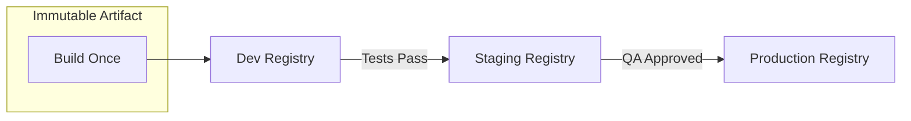
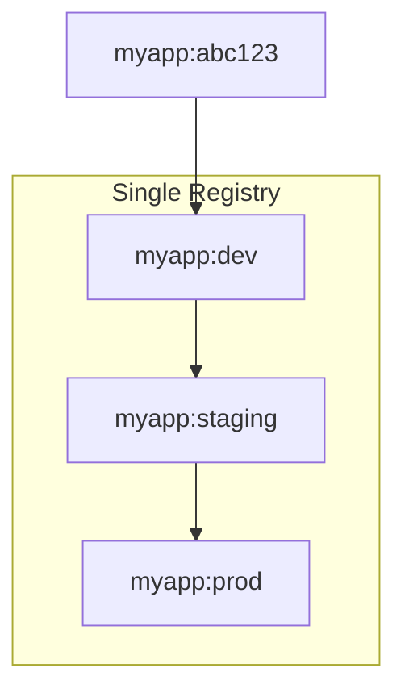
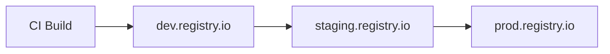

# How to Create Artifact Promotion

Author: [nawazdhandala](https://github.com/nawazdhandala)

Tags: DevOps, Artifacts, Registry, CI/CD

Description: Learn to create artifact promotion for container images across registries.

---

Artifact promotion is the practice of moving container images through a series of registries or tags as they pass validation gates. Instead of rebuilding images for each environment, you promote the exact same artifact that was tested. This guarantees what you tested is what you deploy.

## Why Artifact Promotion Matters

Rebuilding images for different environments introduces risk. Build tools change, dependencies update, and network issues cause subtle differences. Promotion eliminates these variables by using a single immutable artifact.



The same image digest flows through every environment. Only the tag or registry location changes.

## Promotion Strategies

There are two main approaches to artifact promotion: tag-based and registry-based.

### Tag-Based Promotion

With tag-based promotion, images stay in one registry but receive new tags as they advance. This approach is simpler to set up but requires careful tag management.



### Registry-Based Promotion

With registry-based promotion, images move between separate registries. This provides stronger isolation and access control but requires more infrastructure.



## Implementing Tag-Based Promotion

Here is a practical example using Docker and a shell script. The script copies an image from one tag to another within the same registry.

This script uses `skopeo` to copy images between tags without pulling and pushing through a local Docker daemon. This is faster and works well in CI environments.

```bash
#!/bin/bash
# promote-tag.sh - Promote an image to a new tag within the same registry

set -euo pipefail

# Configuration
REGISTRY="ghcr.io/myorg"
IMAGE="myapp"
SOURCE_TAG="${1:?Usage: promote-tag.sh <source-tag> <target-tag>}"
TARGET_TAG="${2:?Usage: promote-tag.sh <source-tag> <target-tag>}"

# Full image references
SOURCE="${REGISTRY}/${IMAGE}:${SOURCE_TAG}"
TARGET="${REGISTRY}/${IMAGE}:${TARGET_TAG}"

echo "Promoting ${SOURCE} to ${TARGET}"

# Copy the image using skopeo (no local pull needed)
skopeo copy \
    --src-creds="${REGISTRY_USER}:${REGISTRY_TOKEN}" \
    --dest-creds="${REGISTRY_USER}:${REGISTRY_TOKEN}" \
    "docker://${SOURCE}" \
    "docker://${TARGET}"

# Verify the promotion by checking digests match
SOURCE_DIGEST=$(skopeo inspect "docker://${SOURCE}" | jq -r '.Digest')
TARGET_DIGEST=$(skopeo inspect "docker://${TARGET}" | jq -r '.Digest')

if [ "${SOURCE_DIGEST}" = "${TARGET_DIGEST}" ]; then
    echo "Promotion successful. Digest: ${SOURCE_DIGEST}"
else
    echo "ERROR: Digest mismatch after promotion"
    exit 1
fi
```

## Implementing Registry-Based Promotion

For organizations with strict security requirements, separate registries provide better isolation. Each environment has its own registry with distinct access controls.

This script promotes an image from a source registry to a target registry. It preserves the image digest and adds environment-specific tags.

```bash
#!/bin/bash
# promote-registry.sh - Promote an image between registries

set -euo pipefail

# Source and target configuration
SOURCE_REGISTRY="dev-registry.myorg.io"
TARGET_REGISTRY="prod-registry.myorg.io"
IMAGE="myapp"
TAG="${1:?Usage: promote-registry.sh <tag>}"

# Authenticate to both registries
echo "Authenticating to registries..."
echo "${DEV_REGISTRY_TOKEN}" | skopeo login "${SOURCE_REGISTRY}" \
    --username "${DEV_REGISTRY_USER}" \
    --password-stdin

echo "${PROD_REGISTRY_TOKEN}" | skopeo login "${TARGET_REGISTRY}" \
    --username "${PROD_REGISTRY_USER}" \
    --password-stdin

# Get the source image digest for verification
SOURCE_REF="${SOURCE_REGISTRY}/${IMAGE}:${TAG}"
DIGEST=$(skopeo inspect "docker://${SOURCE_REF}" | jq -r '.Digest')
echo "Source digest: ${DIGEST}"

# Copy the image to the target registry
TARGET_REF="${TARGET_REGISTRY}/${IMAGE}:${TAG}"
echo "Copying ${SOURCE_REF} to ${TARGET_REF}"

skopeo copy \
    "docker://${SOURCE_REF}" \
    "docker://${TARGET_REF}"

# Also tag with the digest for immutable reference
skopeo copy \
    "docker://${SOURCE_REF}" \
    "docker://${TARGET_REGISTRY}/${IMAGE}@${DIGEST}"

echo "Promotion complete. Image available at:"
echo "  - ${TARGET_REF}"
echo "  - ${TARGET_REGISTRY}/${IMAGE}@${DIGEST}"
```

## GitHub Actions Workflow for Promotion

Here is a complete GitHub Actions workflow that promotes images through environments. It uses environment protection rules to require approval before production promotion.

```yaml
name: Promote Artifact

on:
  workflow_dispatch:
    inputs:
      image_tag:
        description: 'Image tag to promote'
        required: true
      target_environment:
        description: 'Target environment'
        required: true
        type: choice
        options:
          - staging
          - production

jobs:
  promote-to-staging:
    if: inputs.target_environment == 'staging'
    runs-on: ubuntu-latest
    steps:
      # Install skopeo for image manipulation
      - name: Install skopeo
        run: |
          sudo apt-get update
          sudo apt-get install -y skopeo

      # Authenticate to the container registry
      - name: Login to registry
        run: |
          echo "${{ secrets.REGISTRY_TOKEN }}" | \
          skopeo login ghcr.io --username ${{ github.actor }} --password-stdin

      # Promote the image by adding the staging tag
      - name: Promote to staging
        run: |
          skopeo copy \
            docker://ghcr.io/${{ github.repository }}:${{ inputs.image_tag }} \
            docker://ghcr.io/${{ github.repository }}:staging

      # Record the promotion in the workflow summary
      - name: Record promotion
        run: |
          echo "## Promotion Complete" >> $GITHUB_STEP_SUMMARY
          echo "- Source: \`${{ inputs.image_tag }}\`" >> $GITHUB_STEP_SUMMARY
          echo "- Target: \`staging\`" >> $GITHUB_STEP_SUMMARY

  promote-to-production:
    if: inputs.target_environment == 'production'
    runs-on: ubuntu-latest
    environment:
      name: production  # Requires approval from designated reviewers
    steps:
      - name: Install skopeo
        run: |
          sudo apt-get update
          sudo apt-get install -y skopeo

      - name: Login to registry
        run: |
          echo "${{ secrets.REGISTRY_TOKEN }}" | \
          skopeo login ghcr.io --username ${{ github.actor }} --password-stdin

      # Verify the image exists in staging before promoting to production
      - name: Verify staging image
        run: |
          skopeo inspect docker://ghcr.io/${{ github.repository }}:staging

      # Promote the staging image to production
      - name: Promote to production
        run: |
          skopeo copy \
            docker://ghcr.io/${{ github.repository }}:staging \
            docker://ghcr.io/${{ github.repository }}:production

          # Also create a timestamped release tag
          RELEASE_TAG="release-$(date +%Y%m%d-%H%M%S)"
          skopeo copy \
            docker://ghcr.io/${{ github.repository }}:staging \
            docker://ghcr.io/${{ github.repository }}:${RELEASE_TAG}

          echo "Created release tag: ${RELEASE_TAG}"
```

## Promotion with Digest Verification

The most reliable promotion strategy uses image digests instead of tags. Digests are immutable references that guarantee you are promoting exactly what was tested.

This workflow extracts the digest during build and uses it throughout the promotion pipeline.

```yaml
name: Build and Store Digest

on:
  push:
    branches: [main]

jobs:
  build:
    runs-on: ubuntu-latest
    outputs:
      digest: ${{ steps.build.outputs.digest }}
    steps:
      - uses: actions/checkout@v4

      - uses: docker/setup-buildx-action@v3

      - uses: docker/login-action@v3
        with:
          registry: ghcr.io
          username: ${{ github.actor }}
          password: ${{ secrets.GITHUB_TOKEN }}

      # Build and push, capturing the digest
      - name: Build and push
        id: build
        uses: docker/build-push-action@v5
        with:
          push: true
          tags: ghcr.io/${{ github.repository }}:${{ github.sha }}

      # Store the digest for downstream jobs
      - name: Store digest
        run: |
          echo "Image digest: ${{ steps.build.outputs.digest }}"
          echo "${{ steps.build.outputs.digest }}" > digest.txt

      # Upload digest as artifact for promotion jobs
      - uses: actions/upload-artifact@v4
        with:
          name: image-digest
          path: digest.txt
```

The promotion job then downloads this digest and uses it to reference the exact image.

```yaml
  promote:
    needs: build
    runs-on: ubuntu-latest
    steps:
      - uses: actions/download-artifact@v4
        with:
          name: image-digest

      - name: Promote by digest
        run: |
          DIGEST=$(cat digest.txt)
          echo "Promoting image with digest: ${DIGEST}"

          skopeo copy \
            docker://ghcr.io/${{ github.repository }}@${DIGEST} \
            docker://ghcr.io/${{ github.repository }}:production
```

## Best Practices

Follow these guidelines to build a reliable promotion pipeline.

**Use immutable references.** Always track and verify digests, not just tags. Tags can be overwritten, but digests cannot.

**Require gates between environments.** Use automated tests, security scans, and manual approvals as gates before promotion.

**Keep audit trails.** Log every promotion with timestamps, actors, and digests. This is essential for incident response and compliance.

**Separate credentials per environment.** Production registry credentials should never be accessible from development pipelines.

**Test rollback procedures.** Your promotion system should make it easy to roll back by promoting a previous artifact.

## Conclusion

Artifact promotion ensures consistency across environments by moving tested images rather than rebuilding them. Whether you choose tag-based or registry-based promotion depends on your security requirements and infrastructure. Start with tag-based promotion for simplicity, then evolve to separate registries as your needs grow. The key is to treat your artifacts as immutable and track them by digest throughout their lifecycle.
