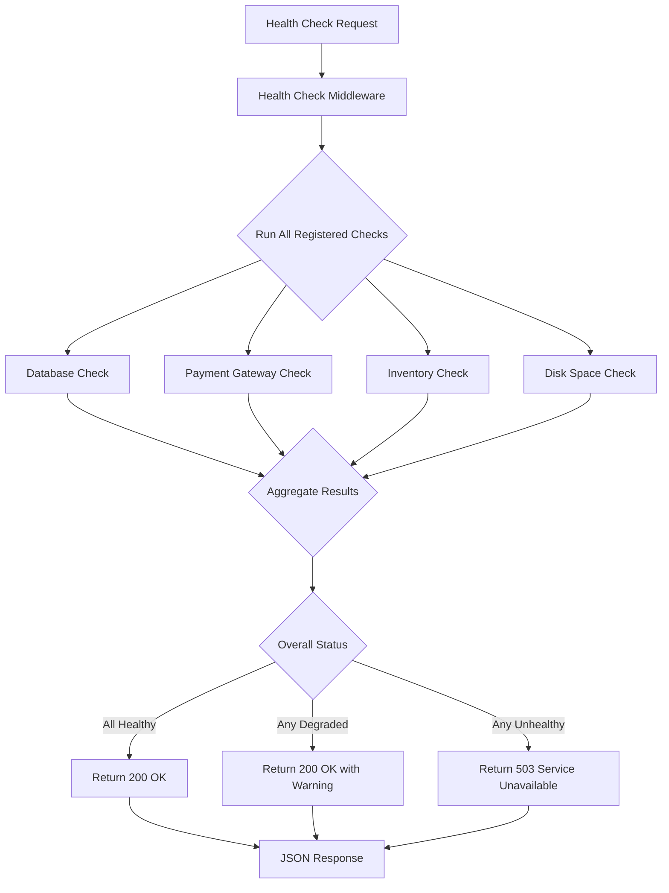

# How to Implement Custom Health Checks in ASP.NET

Author: [nawazdhandala](https://www.github.com/nawazdhandala)

Tags: C#, ASP.NET Core, Health Checks, Monitoring, .NET

Description: Create custom health checks in ASP.NET Core for database connectivity, external services, and business logic validation with detailed health reports.

---

Health checks are your application's way of telling the outside world how it's doing. While ASP.NET Core's built-in health checks cover basic scenarios, real-world applications often need custom health checks that verify business-specific conditions, validate complex dependencies, or check things that standard packages just don't cover.

In this guide, we'll build practical custom health checks that go beyond simple connectivity tests. You'll learn how to validate business rules, aggregate multiple checks, and create health reports that actually help you diagnose problems.

## The IHealthCheck Interface

Every custom health check implements the `IHealthCheck` interface. It has a single method that returns one of three states: `Healthy`, `Degraded`, or `Unhealthy`.

```csharp
// The IHealthCheck interface is simple but powerful
public interface IHealthCheck
{
    Task<HealthCheckResult> CheckHealthAsync(
        HealthCheckContext context,
        CancellationToken cancellationToken = default);
}
```

The `HealthCheckResult` can include a description, exception details, and arbitrary key-value data that gets included in health reports.

## Setting Up Health Checks

Before writing custom checks, set up the health checks middleware in your application.

```csharp
// Program.cs
var builder = WebApplication.CreateBuilder(args);

// Register health checks service
builder.Services.AddHealthChecks()
    .AddCheck<DatabaseHealthCheck>("database")
    .AddCheck<PaymentGatewayHealthCheck>("payment-gateway")
    .AddCheck<InventoryServiceHealthCheck>("inventory-service")
    .AddCheck<DiskSpaceHealthCheck>("disk-space");

var app = builder.Build();

// Map the health endpoint with detailed JSON output
app.MapHealthChecks("/health", new HealthCheckOptions
{
    ResponseWriter = WriteHealthCheckResponse
});

app.Run();
```

## Custom Health Check for Database Connectivity

A database health check should verify more than just connectivity. It should also check that queries execute within acceptable time limits.

```csharp
// HealthChecks/DatabaseHealthCheck.cs
public class DatabaseHealthCheck : IHealthCheck
{
    private readonly IDbConnection _connection;
    private readonly ILogger<DatabaseHealthCheck> _logger;

    // Maximum acceptable query time in milliseconds
    private const int MaxQueryTimeMs = 1000;

    public DatabaseHealthCheck(
        IDbConnection connection,
        ILogger<DatabaseHealthCheck> logger)
    {
        _connection = connection;
        _logger = logger;
    }

    public async Task<HealthCheckResult> CheckHealthAsync(
        HealthCheckContext context,
        CancellationToken cancellationToken = default)
    {
        var stopwatch = Stopwatch.StartNew();

        try
        {
            // Open connection if closed
            if (_connection.State != ConnectionState.Open)
            {
                _connection.Open();
            }

            // Run a simple query to verify the database responds
            using var command = _connection.CreateCommand();
            command.CommandText = "SELECT 1";
            command.CommandTimeout = 5;

            await Task.Run(() => command.ExecuteScalar(), cancellationToken);

            stopwatch.Stop();
            var elapsed = stopwatch.ElapsedMilliseconds;

            // Check if response time is acceptable
            if (elapsed > MaxQueryTimeMs)
            {
                return HealthCheckResult.Degraded(
                    description: $"Database responding slowly ({elapsed}ms)",
                    data: new Dictionary<string, object>
                    {
                        ["response_time_ms"] = elapsed,
                        ["threshold_ms"] = MaxQueryTimeMs
                    });
            }

            return HealthCheckResult.Healthy(
                description: $"Database healthy ({elapsed}ms)",
                data: new Dictionary<string, object>
                {
                    ["response_time_ms"] = elapsed
                });
        }
        catch (Exception ex)
        {
            _logger.LogError(ex, "Database health check failed");

            return HealthCheckResult.Unhealthy(
                description: "Database connection failed",
                exception: ex,
                data: new Dictionary<string, object>
                {
                    ["error"] = ex.Message
                });
        }
    }
}
```

## Checking External Service Dependencies

When your application depends on external APIs, you need health checks that verify those services are reachable and responding correctly.

```csharp
// HealthChecks/PaymentGatewayHealthCheck.cs
public class PaymentGatewayHealthCheck : IHealthCheck
{
    private readonly HttpClient _httpClient;
    private readonly IConfiguration _config;
    private readonly ILogger<PaymentGatewayHealthCheck> _logger;

    public PaymentGatewayHealthCheck(
        IHttpClientFactory httpClientFactory,
        IConfiguration config,
        ILogger<PaymentGatewayHealthCheck> logger)
    {
        _httpClient = httpClientFactory.CreateClient("PaymentGateway");
        _config = config;
        _logger = logger;
    }

    public async Task<HealthCheckResult> CheckHealthAsync(
        HealthCheckContext context,
        CancellationToken cancellationToken = default)
    {
        var healthUrl = _config["PaymentGateway:HealthEndpoint"];

        try
        {
            // Create a timeout for the health check request
            using var cts = CancellationTokenSource.CreateLinkedTokenSource(cancellationToken);
            cts.CancelAfter(TimeSpan.FromSeconds(10));

            var response = await _httpClient.GetAsync(healthUrl, cts.Token);

            if (response.IsSuccessStatusCode)
            {
                return HealthCheckResult.Healthy(
                    description: "Payment gateway is reachable");
            }

            // Non-success status codes indicate degraded service
            return HealthCheckResult.Degraded(
                description: $"Payment gateway returned {(int)response.StatusCode}",
                data: new Dictionary<string, object>
                {
                    ["status_code"] = (int)response.StatusCode,
                    ["reason"] = response.ReasonPhrase ?? "Unknown"
                });
        }
        catch (TaskCanceledException)
        {
            return HealthCheckResult.Unhealthy(
                description: "Payment gateway request timed out");
        }
        catch (HttpRequestException ex)
        {
            _logger.LogWarning(ex, "Payment gateway health check failed");

            return HealthCheckResult.Unhealthy(
                description: "Cannot reach payment gateway",
                exception: ex);
        }
    }
}
```

## Business Logic Health Checks

Sometimes health isn't just about connectivity. You might need to verify that business rules are being met, like checking inventory levels or order processing rates.

```csharp
// HealthChecks/InventoryServiceHealthCheck.cs
public class InventoryServiceHealthCheck : IHealthCheck
{
    private readonly IInventoryService _inventoryService;
    private readonly ILogger<InventoryServiceHealthCheck> _logger;

    // Alert threshold for low stock items
    private const int CriticalLowStockThreshold = 10;

    public InventoryServiceHealthCheck(
        IInventoryService inventoryService,
        ILogger<InventoryServiceHealthCheck> logger)
    {
        _inventoryService = inventoryService;
        _logger = logger;
    }

    public async Task<HealthCheckResult> CheckHealthAsync(
        HealthCheckContext context,
        CancellationToken cancellationToken = default)
    {
        try
        {
            // Get count of items below critical stock level
            var lowStockCount = await _inventoryService
                .GetLowStockItemCountAsync(CriticalLowStockThreshold, cancellationToken);

            // Get pending order backlog
            var pendingOrders = await _inventoryService
                .GetPendingOrderCountAsync(cancellationToken);

            var data = new Dictionary<string, object>
            {
                ["low_stock_items"] = lowStockCount,
                ["pending_orders"] = pendingOrders,
                ["threshold"] = CriticalLowStockThreshold
            };

            // Critical: too many items are out of stock
            if (lowStockCount > 50)
            {
                return HealthCheckResult.Unhealthy(
                    description: $"Critical inventory shortage: {lowStockCount} items below threshold",
                    data: data);
            }

            // Warning: some items running low
            if (lowStockCount > 20)
            {
                return HealthCheckResult.Degraded(
                    description: $"Inventory warning: {lowStockCount} items below threshold",
                    data: data);
            }

            return HealthCheckResult.Healthy(
                description: "Inventory levels healthy",
                data: data);
        }
        catch (Exception ex)
        {
            _logger.LogError(ex, "Inventory health check failed");

            return HealthCheckResult.Unhealthy(
                description: "Failed to check inventory status",
                exception: ex);
        }
    }
}
```

## System Resource Health Checks

Monitor system resources like disk space, memory, or CPU to catch infrastructure problems before they cause outages.

```csharp
// HealthChecks/DiskSpaceHealthCheck.cs
public class DiskSpaceHealthCheck : IHealthCheck
{
    private readonly ILogger<DiskSpaceHealthCheck> _logger;

    // Thresholds as percentages of free space
    private const double WarningThreshold = 20.0;
    private const double CriticalThreshold = 10.0;

    public DiskSpaceHealthCheck(ILogger<DiskSpaceHealthCheck> logger)
    {
        _logger = logger;
    }

    public Task<HealthCheckResult> CheckHealthAsync(
        HealthCheckContext context,
        CancellationToken cancellationToken = default)
    {
        try
        {
            // Get the drive where the application is running
            var appPath = AppContext.BaseDirectory;
            var driveInfo = new DriveInfo(Path.GetPathRoot(appPath)!);

            var totalBytes = driveInfo.TotalSize;
            var freeBytes = driveInfo.AvailableFreeSpace;
            var freePercentage = (double)freeBytes / totalBytes * 100;

            var data = new Dictionary<string, object>
            {
                ["drive"] = driveInfo.Name,
                ["total_gb"] = Math.Round(totalBytes / 1_073_741_824.0, 2),
                ["free_gb"] = Math.Round(freeBytes / 1_073_741_824.0, 2),
                ["free_percentage"] = Math.Round(freePercentage, 2)
            };

            if (freePercentage < CriticalThreshold)
            {
                return Task.FromResult(HealthCheckResult.Unhealthy(
                    description: $"Critical: Only {freePercentage:F1}% disk space remaining",
                    data: data));
            }

            if (freePercentage < WarningThreshold)
            {
                return Task.FromResult(HealthCheckResult.Degraded(
                    description: $"Warning: Only {freePercentage:F1}% disk space remaining",
                    data: data));
            }

            return Task.FromResult(HealthCheckResult.Healthy(
                description: $"Disk space healthy: {freePercentage:F1}% free",
                data: data));
        }
        catch (Exception ex)
        {
            _logger.LogError(ex, "Disk space health check failed");

            return Task.FromResult(HealthCheckResult.Unhealthy(
                description: "Failed to check disk space",
                exception: ex));
        }
    }
}
```

## Custom Health Check Response Writer

The default health check response is minimal. A custom response writer provides detailed JSON output that's useful for dashboards and monitoring tools.

```csharp
// HealthChecks/HealthCheckResponseWriter.cs
public static class HealthCheckResponseWriter
{
    public static async Task WriteHealthCheckResponse(
        HttpContext context,
        HealthReport report)
    {
        context.Response.ContentType = "application/json";

        // Set appropriate HTTP status code based on overall health
        context.Response.StatusCode = report.Status switch
        {
            HealthStatus.Healthy => StatusCodes.Status200OK,
            HealthStatus.Degraded => StatusCodes.Status200OK,
            HealthStatus.Unhealthy => StatusCodes.Status503ServiceUnavailable,
            _ => StatusCodes.Status500InternalServerError
        };

        var response = new
        {
            status = report.Status.ToString(),
            timestamp = DateTime.UtcNow.ToString("o"),
            duration_ms = report.TotalDuration.TotalMilliseconds,
            checks = report.Entries.Select(e => new
            {
                name = e.Key,
                status = e.Value.Status.ToString(),
                description = e.Value.Description,
                duration_ms = e.Value.Duration.TotalMilliseconds,
                data = e.Value.Data.Count > 0 ? e.Value.Data : null,
                error = e.Value.Exception?.Message
            })
        };

        var options = new JsonSerializerOptions
        {
            WriteIndented = true,
            DefaultIgnoreCondition = JsonIgnoreCondition.WhenWritingNull
        };

        await context.Response.WriteAsJsonAsync(response, options);
    }
}
```

## Health Check Flow

Here's how health checks flow through your application when a monitoring system polls the health endpoint.



## Registering Health Checks with Tags

Use tags to organize health checks and create different endpoints for different purposes.

```csharp
// Program.cs
builder.Services.AddHealthChecks()
    // Critical checks that should fail deployment if unhealthy
    .AddCheck<DatabaseHealthCheck>(
        "database",
        tags: new[] { "ready", "critical" })

    // External dependencies that may be temporarily unavailable
    .AddCheck<PaymentGatewayHealthCheck>(
        "payment-gateway",
        tags: new[] { "ready", "external" })

    // Business logic checks for operational monitoring
    .AddCheck<InventoryServiceHealthCheck>(
        "inventory",
        tags: new[] { "business" })

    // Infrastructure checks
    .AddCheck<DiskSpaceHealthCheck>(
        "disk-space",
        tags: new[] { "infrastructure" });

var app = builder.Build();

// Kubernetes readiness probe - only critical dependencies
app.MapHealthChecks("/health/ready", new HealthCheckOptions
{
    Predicate = check => check.Tags.Contains("ready"),
    ResponseWriter = HealthCheckResponseWriter.WriteHealthCheckResponse
});

// Full health report for dashboards
app.MapHealthChecks("/health/full", new HealthCheckOptions
{
    ResponseWriter = HealthCheckResponseWriter.WriteHealthCheckResponse
});
```

## Summary

Custom health checks in ASP.NET Core let you monitor exactly what matters for your application. Start with connectivity checks for your core dependencies, then add business logic checks that reflect your application's unique requirements.

Remember these key points when building custom health checks:

- Return `Degraded` for problems that don't require immediate action
- Include useful diagnostic data in the `Data` dictionary
- Set appropriate timeouts to prevent health checks from hanging
- Use tags to organize checks for different monitoring purposes
- Log errors but don't let exceptions crash your health checks

Well-designed health checks make troubleshooting faster and help prevent small issues from becoming major outages.

---

*Looking for comprehensive application monitoring? [OneUptime](https://oneuptime.com) provides health check monitoring, alerting, and status pages to keep your services running smoothly.*

**Related Reading:**
- [How to Build Health Probes with ASP.NET Core Health Checks](https://oneuptime.com/blog/post/2026-01-25-aspnet-core-health-checks/view) - Set up Kubernetes-compatible health probes
- [How to Implement Rate Limiting in ASP.NET Core](https://oneuptime.com/blog/post/2026-01-25-aspnet-core-rate-limiting/view) - Protect your APIs from overload
