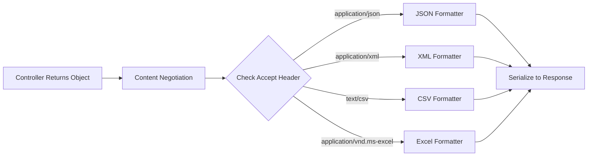
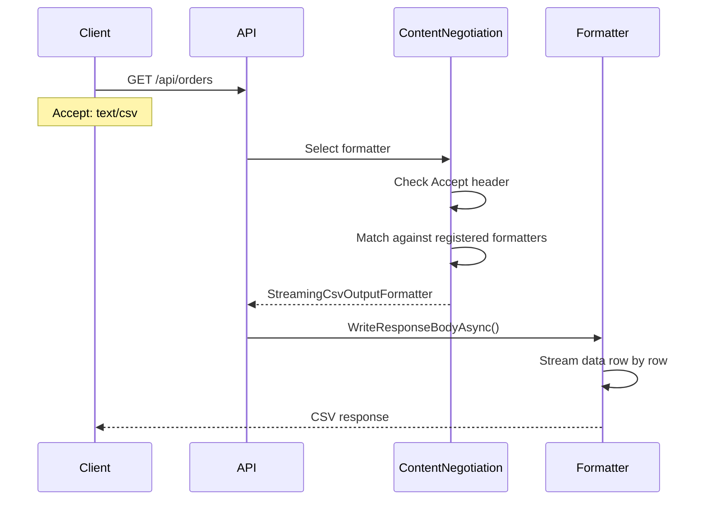

# How to Create Custom Output Formatters in ASP.NET

Author: [nawazdhandala](https://github.com/nawazdhandala)

Tags: C#, ASP.NET Core, Output Formatters, Content Negotiation, API Development, .NET

Description: Learn how to build production-ready custom output formatters in ASP.NET Core for Excel exports, PDF generation, RSS feeds, and streaming large datasets with proper content negotiation.

---

ASP.NET Core APIs typically return JSON, but many real-world scenarios demand different formats. Your finance team wants Excel exports. A legacy system needs XML. Mobile apps prefer Protocol Buffers for bandwidth efficiency. RSS readers expect Atom feeds. Instead of creating separate endpoints for each format, custom output formatters let you serve the same data in whatever format the client requests.

This guide focuses on building output formatters that handle these production scenarios. You will learn to stream large datasets without running out of memory, generate Excel files on the fly, and create RSS feeds from your content APIs.

## How Output Formatters Work

When your controller returns data, ASP.NET Core's content negotiation system selects an appropriate formatter based on the request's `Accept` header. The formatter then serializes your object into the response body.



## The OutputFormatter Base Classes

ASP.NET Core provides two base classes for output formatters:

- `OutputFormatter`: For binary formats like Excel, PDF, or Protocol Buffers
- `TextOutputFormatter`: For text-based formats like CSV, XML, or JSON

Choose `TextOutputFormatter` when your output is human-readable text. Choose `OutputFormatter` for binary data.

## Building a Streaming CSV Formatter

The first example shows a CSV formatter that streams data row by row. This approach handles millions of records without loading everything into memory.

```csharp
// Formatters/StreamingCsvOutputFormatter.cs
// This formatter writes CSV data directly to the response stream,
// making it suitable for exporting large datasets.

using Microsoft.AspNetCore.Mvc.Formatters;
using Microsoft.Net.Http.Headers;
using System.Collections;
using System.Reflection;
using System.Text;

public class StreamingCsvOutputFormatter : TextOutputFormatter
{
    public StreamingCsvOutputFormatter()
    {
        // Register the media types this formatter handles
        SupportedMediaTypes.Add(MediaTypeHeaderValue.Parse("text/csv"));
        SupportedMediaTypes.Add(MediaTypeHeaderValue.Parse("application/csv"));

        // Support common encodings
        SupportedEncodings.Add(Encoding.UTF8);
        SupportedEncodings.Add(Encoding.Unicode);
    }

    // Determine if this formatter can handle the given type.
    // We support IEnumerable types and single objects with properties.
    protected override bool CanWriteType(Type? type)
    {
        if (type == null) return false;

        // Handle collections
        if (typeof(IEnumerable).IsAssignableFrom(type) && type != typeof(string))
        {
            return true;
        }

        // Handle single objects (not primitives)
        return type.IsClass && type != typeof(string);
    }

    public override async Task WriteResponseBodyAsync(
        OutputFormatterWriteContext context,
        Encoding selectedEncoding)
    {
        var response = context.HttpContext.Response;
        var value = context.Object;

        if (value == null) return;

        // Set content disposition for file download
        var fileName = $"export_{DateTime.UtcNow:yyyyMMdd_HHmmss}.csv";
        response.Headers.Append("Content-Disposition", $"attachment; filename=\"{fileName}\"");

        // Get a StreamWriter for the response body
        await using var writer = new StreamWriter(
            response.Body,
            selectedEncoding,
            bufferSize: 4096,
            leaveOpen: true);

        if (value is IEnumerable enumerable)
        {
            await WriteEnumerableAsync(writer, enumerable, context.ObjectType);
        }
        else
        {
            await WriteSingleObjectAsync(writer, value);
        }

        await writer.FlushAsync();
    }

    private async Task WriteEnumerableAsync(
        StreamWriter writer,
        IEnumerable enumerable,
        Type? collectionType)
    {
        PropertyInfo[]? properties = null;
        var isFirstRow = true;

        foreach (var item in enumerable)
        {
            if (item == null) continue;

            // Get properties from the first item
            if (properties == null)
            {
                properties = item.GetType()
                    .GetProperties(BindingFlags.Public | BindingFlags.Instance)
                    .Where(p => p.CanRead && IsSimpleType(p.PropertyType))
                    .ToArray();
            }

            // Write header row once
            if (isFirstRow)
            {
                var headers = properties.Select(p => EscapeCsvValue(p.Name));
                await writer.WriteLineAsync(string.Join(",", headers));
                isFirstRow = false;
            }

            // Write data row
            var values = properties.Select(p =>
            {
                var propValue = p.GetValue(item);
                return EscapeCsvValue(FormatValue(propValue));
            });

            await writer.WriteLineAsync(string.Join(",", values));
        }
    }

    private async Task WriteSingleObjectAsync(StreamWriter writer, object obj)
    {
        var properties = obj.GetType()
            .GetProperties(BindingFlags.Public | BindingFlags.Instance)
            .Where(p => p.CanRead && IsSimpleType(p.PropertyType))
            .ToArray();

        // Write header
        var headers = properties.Select(p => EscapeCsvValue(p.Name));
        await writer.WriteLineAsync(string.Join(",", headers));

        // Write single data row
        var values = properties.Select(p =>
        {
            var propValue = p.GetValue(obj);
            return EscapeCsvValue(FormatValue(propValue));
        });

        await writer.WriteLineAsync(string.Join(",", values));
    }

    // Check if the type can be represented as a simple CSV value
    private static bool IsSimpleType(Type type)
    {
        var underlyingType = Nullable.GetUnderlyingType(type) ?? type;

        return underlyingType.IsPrimitive
            || underlyingType == typeof(string)
            || underlyingType == typeof(decimal)
            || underlyingType == typeof(DateTime)
            || underlyingType == typeof(DateTimeOffset)
            || underlyingType == typeof(Guid)
            || underlyingType.IsEnum;
    }

    // Format values for CSV output
    private static string FormatValue(object? value)
    {
        return value switch
        {
            null => "",
            DateTime dt => dt.ToString("yyyy-MM-dd HH:mm:ss"),
            DateTimeOffset dto => dto.ToString("yyyy-MM-dd HH:mm:ss"),
            bool b => b ? "true" : "false",
            _ => value.ToString() ?? ""
        };
    }

    // Escape special characters in CSV values
    private static string EscapeCsvValue(string value)
    {
        if (string.IsNullOrEmpty(value)) return "";

        // Escape if the value contains comma, quote, or newline
        if (value.Contains(',') || value.Contains('"') ||
            value.Contains('\n') || value.Contains('\r'))
        {
            return $"\"{value.Replace("\"", "\"\"")}\"";
        }

        return value;
    }
}
```

## Excel Output Formatter

For Excel exports, you need a binary output formatter. This example uses the ClosedXML library to generate proper XLSX files.

First, install the required package:

```bash
dotnet add package ClosedXML
```

Then implement the formatter:

```csharp
// Formatters/ExcelOutputFormatter.cs
// Generates Excel files from API responses using ClosedXML.
// Supports both collections and single objects.

using ClosedXML.Excel;
using Microsoft.AspNetCore.Mvc.Formatters;
using Microsoft.Net.Http.Headers;
using System.Collections;
using System.Reflection;

public class ExcelOutputFormatter : OutputFormatter
{
    public ExcelOutputFormatter()
    {
        // Standard Excel media types
        SupportedMediaTypes.Add(MediaTypeHeaderValue.Parse(
            "application/vnd.openxmlformats-officedocument.spreadsheetml.sheet"));
        SupportedMediaTypes.Add(MediaTypeHeaderValue.Parse(
            "application/vnd.ms-excel"));
    }

    protected override bool CanWriteType(Type? type)
    {
        if (type == null) return false;

        // Support collections and single objects
        return typeof(IEnumerable).IsAssignableFrom(type) && type != typeof(string)
            || (type.IsClass && type != typeof(string));
    }

    public override async Task WriteResponseBodyAsync(OutputFormatterWriteContext context)
    {
        var response = context.HttpContext.Response;
        var value = context.Object;

        if (value == null) return;

        // Set response headers for Excel download
        var fileName = $"export_{DateTime.UtcNow:yyyyMMdd_HHmmss}.xlsx";
        response.Headers.Append("Content-Disposition", $"attachment; filename=\"{fileName}\"");

        using var workbook = new XLWorkbook();
        var worksheet = workbook.Worksheets.Add("Data");

        if (value is IEnumerable enumerable && value is not string)
        {
            WriteEnumerableToWorksheet(worksheet, enumerable);
        }
        else
        {
            WriteSingleObjectToWorksheet(worksheet, value);
        }

        // Apply auto-fit to columns for better readability
        worksheet.Columns().AdjustToContents();

        // Write the workbook to the response stream
        using var stream = new MemoryStream();
        workbook.SaveAs(stream);
        stream.Position = 0;

        await stream.CopyToAsync(response.Body);
    }

    private void WriteEnumerableToWorksheet(IXLWorksheet worksheet, IEnumerable enumerable)
    {
        PropertyInfo[]? properties = null;
        var row = 1;

        foreach (var item in enumerable)
        {
            if (item == null) continue;

            // Initialize properties and write header from first item
            if (properties == null)
            {
                properties = item.GetType()
                    .GetProperties(BindingFlags.Public | BindingFlags.Instance)
                    .Where(p => p.CanRead)
                    .ToArray();

                // Write header row with bold formatting
                for (var col = 0; col < properties.Length; col++)
                {
                    var cell = worksheet.Cell(row, col + 1);
                    cell.Value = properties[col].Name;
                    cell.Style.Font.Bold = true;
                    cell.Style.Fill.BackgroundColor = XLColor.LightGray;
                }
                row++;
            }

            // Write data row
            for (var col = 0; col < properties.Length; col++)
            {
                var propValue = properties[col].GetValue(item);
                SetCellValue(worksheet.Cell(row, col + 1), propValue);
            }
            row++;
        }
    }

    private void WriteSingleObjectToWorksheet(IXLWorksheet worksheet, object obj)
    {
        var properties = obj.GetType()
            .GetProperties(BindingFlags.Public | BindingFlags.Instance)
            .Where(p => p.CanRead)
            .ToArray();

        // Write header row
        for (var col = 0; col < properties.Length; col++)
        {
            var cell = worksheet.Cell(1, col + 1);
            cell.Value = properties[col].Name;
            cell.Style.Font.Bold = true;
            cell.Style.Fill.BackgroundColor = XLColor.LightGray;
        }

        // Write data row
        for (var col = 0; col < properties.Length; col++)
        {
            var propValue = properties[col].GetValue(obj);
            SetCellValue(worksheet.Cell(2, col + 1), propValue);
        }
    }

    // Set cell value with appropriate Excel type
    private void SetCellValue(IXLCell cell, object? value)
    {
        switch (value)
        {
            case null:
                cell.Value = "";
                break;
            case DateTime dt:
                cell.Value = dt;
                cell.Style.DateFormat.Format = "yyyy-MM-dd HH:mm:ss";
                break;
            case DateTimeOffset dto:
                cell.Value = dto.DateTime;
                cell.Style.DateFormat.Format = "yyyy-MM-dd HH:mm:ss";
                break;
            case int i:
                cell.Value = i;
                break;
            case long l:
                cell.Value = l;
                break;
            case decimal d:
                cell.Value = d;
                cell.Style.NumberFormat.Format = "#,##0.00";
                break;
            case double dbl:
                cell.Value = dbl;
                break;
            case bool b:
                cell.Value = b;
                break;
            default:
                cell.Value = value.ToString();
                break;
        }
    }
}
```

## RSS/Atom Feed Output Formatter

Content APIs often need to provide RSS or Atom feeds. This formatter converts collections into valid RSS 2.0 feeds.

```csharp
// Formatters/RssFeedOutputFormatter.cs
// Converts collections into RSS 2.0 feeds.
// Objects must implement IRssFeedItem or have Title, Description, and Link properties.

using Microsoft.AspNetCore.Mvc.Formatters;
using Microsoft.Net.Http.Headers;
using System.Collections;
using System.Text;
using System.Xml;

// Interface for objects that can be represented in RSS feeds
public interface IRssFeedItem
{
    string Title { get; }
    string Description { get; }
    string Link { get; }
    DateTime? PublishedDate { get; }
    string? Author { get; }
}

public class RssFeedOutputFormatter : TextOutputFormatter
{
    private readonly string _feedTitle;
    private readonly string _feedDescription;
    private readonly string _feedLink;

    public RssFeedOutputFormatter(
        string feedTitle = "API Feed",
        string feedDescription = "Latest items from the API",
        string feedLink = "/")
    {
        _feedTitle = feedTitle;
        _feedDescription = feedDescription;
        _feedLink = feedLink;

        SupportedMediaTypes.Add(MediaTypeHeaderValue.Parse("application/rss+xml"));
        SupportedMediaTypes.Add(MediaTypeHeaderValue.Parse("application/xml"));

        SupportedEncodings.Add(Encoding.UTF8);
    }

    protected override bool CanWriteType(Type? type)
    {
        if (type == null) return false;

        // Only support collections
        return typeof(IEnumerable).IsAssignableFrom(type) && type != typeof(string);
    }

    public override async Task WriteResponseBodyAsync(
        OutputFormatterWriteContext context,
        Encoding selectedEncoding)
    {
        var response = context.HttpContext.Response;
        var value = context.Object as IEnumerable;

        if (value == null) return;

        var request = context.HttpContext.Request;
        var baseUrl = $"{request.Scheme}://{request.Host}";

        var settings = new XmlWriterSettings
        {
            Async = true,
            Encoding = selectedEncoding,
            Indent = true
        };

        await using var writer = XmlWriter.Create(response.Body, settings);

        await writer.WriteStartDocumentAsync();
        await writer.WriteStartElementAsync(null, "rss", null);
        await writer.WriteAttributeStringAsync(null, "version", null, "2.0");

        await writer.WriteStartElementAsync(null, "channel", null);

        // Write channel metadata
        await WriteElementAsync(writer, "title", _feedTitle);
        await WriteElementAsync(writer, "description", _feedDescription);
        await WriteElementAsync(writer, "link", baseUrl + _feedLink);
        await WriteElementAsync(writer, "lastBuildDate",
            DateTime.UtcNow.ToString("R"));

        // Write items
        foreach (var item in value)
        {
            if (item == null) continue;
            await WriteItemAsync(writer, item, baseUrl);
        }

        await writer.WriteEndElementAsync(); // channel
        await writer.WriteEndElementAsync(); // rss
        await writer.WriteEndDocumentAsync();

        await writer.FlushAsync();
    }

    private async Task WriteItemAsync(XmlWriter writer, object item, string baseUrl)
    {
        await writer.WriteStartElementAsync(null, "item", null);

        // Try to get values from IRssFeedItem interface first
        if (item is IRssFeedItem feedItem)
        {
            await WriteElementAsync(writer, "title", feedItem.Title);
            await WriteElementAsync(writer, "description", feedItem.Description);
            await WriteElementAsync(writer, "link",
                feedItem.Link.StartsWith("http")
                    ? feedItem.Link
                    : baseUrl + feedItem.Link);

            if (feedItem.PublishedDate.HasValue)
            {
                await WriteElementAsync(writer, "pubDate",
                    feedItem.PublishedDate.Value.ToString("R"));
            }

            if (!string.IsNullOrEmpty(feedItem.Author))
            {
                await WriteElementAsync(writer, "author", feedItem.Author);
            }
        }
        else
        {
            // Fall back to reflection for objects without the interface
            var type = item.GetType();

            var title = GetPropertyValue(type, item, "Title", "Name") ?? "Untitled";
            var description = GetPropertyValue(type, item, "Description", "Summary", "Content") ?? "";
            var link = GetPropertyValue(type, item, "Link", "Url", "Href") ?? "";
            var date = GetDatePropertyValue(type, item, "PublishedDate", "CreatedAt", "Date");

            await WriteElementAsync(writer, "title", title);
            await WriteElementAsync(writer, "description", description);

            if (!string.IsNullOrEmpty(link))
            {
                await WriteElementAsync(writer, "link",
                    link.StartsWith("http") ? link : baseUrl + link);
            }

            if (date.HasValue)
            {
                await WriteElementAsync(writer, "pubDate", date.Value.ToString("R"));
            }
        }

        await writer.WriteEndElementAsync();
    }

    private static async Task WriteElementAsync(XmlWriter writer, string name, string value)
    {
        await writer.WriteStartElementAsync(null, name, null);
        await writer.WriteStringAsync(value);
        await writer.WriteEndElementAsync();
    }

    private static string? GetPropertyValue(Type type, object obj, params string[] propertyNames)
    {
        foreach (var name in propertyNames)
        {
            var property = type.GetProperty(name,
                BindingFlags.Public | BindingFlags.Instance | BindingFlags.IgnoreCase);

            if (property != null)
            {
                return property.GetValue(obj)?.ToString();
            }
        }
        return null;
    }

    private static DateTime? GetDatePropertyValue(Type type, object obj, params string[] propertyNames)
    {
        foreach (var name in propertyNames)
        {
            var property = type.GetProperty(name,
                BindingFlags.Public | BindingFlags.Instance | BindingFlags.IgnoreCase);

            if (property != null)
            {
                var value = property.GetValue(obj);
                if (value is DateTime dt) return dt;
                if (value is DateTimeOffset dto) return dto.DateTime;
            }
        }
        return null;
    }
}
```

## PDF Output Formatter

For PDF generation, we use QuestPDF, a modern library with a fluent API.

```bash
dotnet add package QuestPDF
```

```csharp
// Formatters/PdfOutputFormatter.cs
// Generates PDF documents from collections using QuestPDF.
// Creates a table layout with automatic column sizing.

using Microsoft.AspNetCore.Mvc.Formatters;
using Microsoft.Net.Http.Headers;
using QuestPDF.Fluent;
using QuestPDF.Helpers;
using QuestPDF.Infrastructure;
using System.Collections;
using System.Reflection;

public class PdfOutputFormatter : OutputFormatter
{
    public PdfOutputFormatter()
    {
        SupportedMediaTypes.Add(MediaTypeHeaderValue.Parse("application/pdf"));

        // QuestPDF requires license configuration
        QuestPDF.Settings.License = LicenseType.Community;
    }

    protected override bool CanWriteType(Type? type)
    {
        if (type == null) return false;
        return typeof(IEnumerable).IsAssignableFrom(type) && type != typeof(string);
    }

    public override async Task WriteResponseBodyAsync(OutputFormatterWriteContext context)
    {
        var response = context.HttpContext.Response;
        var value = context.Object as IEnumerable;

        if (value == null) return;

        var fileName = $"export_{DateTime.UtcNow:yyyyMMdd_HHmmss}.pdf";
        response.Headers.Append("Content-Disposition", $"attachment; filename=\"{fileName}\"");

        // Convert enumerable to list for processing
        var items = value.Cast<object>().ToList();

        if (items.Count == 0)
        {
            // Return empty PDF
            var emptyDoc = Document.Create(container =>
            {
                container.Page(page =>
                {
                    page.Content().Text("No data available");
                });
            });

            using var emptyStream = new MemoryStream();
            emptyDoc.GeneratePdf(emptyStream);
            emptyStream.Position = 0;
            await emptyStream.CopyToAsync(response.Body);
            return;
        }

        // Get properties from first item
        var properties = items[0].GetType()
            .GetProperties(BindingFlags.Public | BindingFlags.Instance)
            .Where(p => p.CanRead && IsSimpleType(p.PropertyType))
            .ToArray();

        var document = Document.Create(container =>
        {
            container.Page(page =>
            {
                page.Size(PageSizes.A4.Landscape());
                page.Margin(1, Unit.Centimetre);
                page.DefaultTextStyle(x => x.FontSize(10));

                page.Header()
                    .Text($"Data Export - {DateTime.UtcNow:yyyy-MM-dd HH:mm}")
                    .FontSize(14)
                    .Bold()
                    .FontColor(Colors.Blue.Medium);

                page.Content()
                    .PaddingVertical(10)
                    .Table(table =>
                    {
                        // Define columns
                        table.ColumnsDefinition(columns =>
                        {
                            foreach (var _ in properties)
                            {
                                columns.RelativeColumn();
                            }
                        });

                        // Header row
                        table.Header(header =>
                        {
                            foreach (var prop in properties)
                            {
                                header.Cell()
                                    .Background(Colors.Grey.Lighten2)
                                    .Padding(5)
                                    .Text(prop.Name)
                                    .Bold();
                            }
                        });

                        // Data rows
                        foreach (var item in items)
                        {
                            foreach (var prop in properties)
                            {
                                var propValue = prop.GetValue(item);
                                var displayValue = FormatValue(propValue);

                                table.Cell()
                                    .BorderBottom(1)
                                    .BorderColor(Colors.Grey.Lighten1)
                                    .Padding(5)
                                    .Text(displayValue);
                            }
                        }
                    });

                page.Footer()
                    .AlignCenter()
                    .Text(x =>
                    {
                        x.Span("Page ");
                        x.CurrentPageNumber();
                        x.Span(" of ");
                        x.TotalPages();
                    });
            });
        });

        using var stream = new MemoryStream();
        document.GeneratePdf(stream);
        stream.Position = 0;

        await stream.CopyToAsync(response.Body);
    }

    private static bool IsSimpleType(Type type)
    {
        var underlyingType = Nullable.GetUnderlyingType(type) ?? type;

        return underlyingType.IsPrimitive
            || underlyingType == typeof(string)
            || underlyingType == typeof(decimal)
            || underlyingType == typeof(DateTime)
            || underlyingType == typeof(DateTimeOffset)
            || underlyingType == typeof(Guid)
            || underlyingType.IsEnum;
    }

    private static string FormatValue(object? value)
    {
        return value switch
        {
            null => "",
            DateTime dt => dt.ToString("yyyy-MM-dd HH:mm"),
            DateTimeOffset dto => dto.ToString("yyyy-MM-dd HH:mm"),
            decimal d => d.ToString("N2"),
            _ => value.ToString() ?? ""
        };
    }
}
```

## Registering Output Formatters

Add your custom formatters in `Program.cs`. The order matters because ASP.NET Core uses the first formatter that matches.

```csharp
// Program.cs
var builder = WebApplication.CreateBuilder(args);

builder.Services.AddControllers(options =>
{
    // Add custom output formatters
    options.OutputFormatters.Add(new StreamingCsvOutputFormatter());
    options.OutputFormatters.Add(new ExcelOutputFormatter());
    options.OutputFormatters.Add(new PdfOutputFormatter());
    options.OutputFormatters.Add(new RssFeedOutputFormatter(
        feedTitle: "Company Blog",
        feedDescription: "Latest posts from our engineering team",
        feedLink: "/blog"
    ));

    // Map URL format extensions to media types
    options.FormatterMappings.SetMediaTypeMappingForFormat("csv", "text/csv");
    options.FormatterMappings.SetMediaTypeMappingForFormat("xlsx",
        "application/vnd.openxmlformats-officedocument.spreadsheetml.sheet");
    options.FormatterMappings.SetMediaTypeMappingForFormat("pdf", "application/pdf");
    options.FormatterMappings.SetMediaTypeMappingForFormat("rss", "application/rss+xml");
});

var app = builder.Build();

app.MapControllers();
app.Run();
```

## Controller Implementation

Create a controller that serves data in multiple formats:

```csharp
// Controllers/OrdersController.cs
[ApiController]
[Route("api/[controller]")]
public class OrdersController : ControllerBase
{
    private readonly IOrderService _orderService;

    public OrdersController(IOrderService orderService)
    {
        _orderService = orderService;
    }

    // This endpoint supports multiple output formats based on Accept header
    [HttpGet]
    [Produces("application/json", "text/csv",
        "application/vnd.openxmlformats-officedocument.spreadsheetml.sheet",
        "application/pdf")]
    public async Task<IActionResult> GetOrders(
        [FromQuery] DateTime? from,
        [FromQuery] DateTime? to)
    {
        var orders = await _orderService.GetOrdersAsync(from, to);
        return Ok(orders);
    }

    // Use URL format extension for explicit format selection
    [HttpGet("export.{format}")]
    public async Task<IActionResult> ExportOrders(
        string format,
        [FromQuery] DateTime? from,
        [FromQuery] DateTime? to)
    {
        var orders = await _orderService.GetOrdersAsync(from, to);
        return Ok(orders);
    }
}

public class Order
{
    public int Id { get; set; }
    public string CustomerName { get; set; } = string.Empty;
    public decimal Total { get; set; }
    public string Status { get; set; } = string.Empty;
    public DateTime CreatedAt { get; set; }
}
```

## Content Negotiation Flow



## Making Requests

Use curl or any HTTP client to request different formats:

```bash
# Get JSON (default)
curl https://localhost:5001/api/orders

# Get CSV using Accept header
curl -H "Accept: text/csv" https://localhost:5001/api/orders

# Get Excel using Accept header
curl -H "Accept: application/vnd.openxmlformats-officedocument.spreadsheetml.sheet" \
  https://localhost:5001/api/orders -o orders.xlsx

# Get PDF
curl -H "Accept: application/pdf" \
  https://localhost:5001/api/orders -o orders.pdf

# Use format extension
curl https://localhost:5001/api/orders/export.csv -o orders.csv
curl https://localhost:5001/api/orders/export.xlsx -o orders.xlsx
```

## Streaming Large Datasets with IAsyncEnumerable

For truly large datasets, combine output formatters with `IAsyncEnumerable` to stream data directly from the database:

```csharp
// Services/OrderService.cs
public class OrderService : IOrderService
{
    private readonly AppDbContext _context;

    public OrderService(AppDbContext context)
    {
        _context = context;
    }

    // Stream orders from database without loading all into memory
    public async IAsyncEnumerable<Order> GetOrdersStreamAsync(
        DateTime? from,
        DateTime? to,
        [EnumeratorCancellation] CancellationToken cancellationToken = default)
    {
        var query = _context.Orders.AsQueryable();

        if (from.HasValue)
            query = query.Where(o => o.CreatedAt >= from.Value);

        if (to.HasValue)
            query = query.Where(o => o.CreatedAt <= to.Value);

        await foreach (var order in query.AsAsyncEnumerable()
            .WithCancellation(cancellationToken))
        {
            yield return order;
        }
    }
}
```

Update the formatter to handle `IAsyncEnumerable`:

```csharp
// Formatters/StreamingCsvOutputFormatter.cs (updated WriteResponseBodyAsync)
public override async Task WriteResponseBodyAsync(
    OutputFormatterWriteContext context,
    Encoding selectedEncoding)
{
    var response = context.HttpContext.Response;
    var value = context.Object;

    if (value == null) return;

    var fileName = $"export_{DateTime.UtcNow:yyyyMMdd_HHmmss}.csv";
    response.Headers.Append("Content-Disposition", $"attachment; filename=\"{fileName}\"");

    await using var writer = new StreamWriter(
        response.Body,
        selectedEncoding,
        bufferSize: 4096,
        leaveOpen: true);

    // Handle IAsyncEnumerable for streaming scenarios
    if (value.GetType().IsGenericType &&
        value.GetType().GetGenericTypeDefinition() == typeof(IAsyncEnumerable<>))
    {
        await WriteAsyncEnumerableAsync(writer, value);
    }
    else if (value is IEnumerable enumerable)
    {
        await WriteEnumerableAsync(writer, enumerable, context.ObjectType);
    }

    await writer.FlushAsync();
}

private async Task WriteAsyncEnumerableAsync(StreamWriter writer, object asyncEnumerable)
{
    PropertyInfo[]? properties = null;
    var isFirstRow = true;

    // Use reflection to iterate the IAsyncEnumerable
    var elementType = asyncEnumerable.GetType().GetGenericArguments()[0];
    var enumeratorMethod = typeof(IAsyncEnumerable<>)
        .MakeGenericType(elementType)
        .GetMethod("GetAsyncEnumerator");

    dynamic enumerator = enumeratorMethod!.Invoke(asyncEnumerable,
        new object[] { CancellationToken.None })!;

    while (await enumerator.MoveNextAsync())
    {
        var item = enumerator.Current;
        if (item == null) continue;

        if (properties == null)
        {
            properties = item.GetType()
                .GetProperties(BindingFlags.Public | BindingFlags.Instance)
                .Where(p => p.CanRead && IsSimpleType(p.PropertyType))
                .ToArray();
        }

        if (isFirstRow)
        {
            var headers = properties.Select(p => EscapeCsvValue(p.Name));
            await writer.WriteLineAsync(string.Join(",", headers));
            isFirstRow = false;
        }

        var values = properties.Select(p =>
        {
            var propValue = p.GetValue(item);
            return EscapeCsvValue(FormatValue(propValue));
        });

        await writer.WriteLineAsync(string.Join(",", values));
    }
}
```

## Custom Content Negotiation

Sometimes you need more control over which formatter gets selected. Create a custom `IContentTypeProvider` or use action filters:

```csharp
// Filters/FormatQueryStringAttribute.cs
// Allows format selection via query string parameter

public class FormatQueryStringAttribute : ActionFilterAttribute
{
    public override void OnActionExecuting(ActionExecutingContext context)
    {
        var query = context.HttpContext.Request.Query;

        if (query.TryGetValue("format", out var format))
        {
            var mediaType = format.ToString().ToLowerInvariant() switch
            {
                "csv" => "text/csv",
                "excel" or "xlsx" => "application/vnd.openxmlformats-officedocument.spreadsheetml.sheet",
                "pdf" => "application/pdf",
                "rss" => "application/rss+xml",
                "json" => "application/json",
                _ => null
            };

            if (mediaType != null)
            {
                // Override the Accept header
                context.HttpContext.Request.Headers.Accept = mediaType;
            }
        }

        base.OnActionExecuting(context);
    }
}

// Usage in controller
[HttpGet]
[FormatQueryString]
public async Task<IActionResult> GetOrders()
{
    var orders = await _orderService.GetOrdersAsync();
    return Ok(orders);
}
```

Now clients can request formats via query string:

```bash
curl "https://localhost:5001/api/orders?format=csv"
curl "https://localhost:5001/api/orders?format=excel"
curl "https://localhost:5001/api/orders?format=pdf"
```

## Testing Output Formatters

Write integration tests to verify your formatters work correctly:

```csharp
// Tests/OutputFormatterTests.cs
public class OutputFormatterTests : IClassFixture<WebApplicationFactory<Program>>
{
    private readonly WebApplicationFactory<Program> _factory;

    public OutputFormatterTests(WebApplicationFactory<Program> factory)
    {
        _factory = factory;
    }

    [Fact]
    public async Task GetOrders_WithCsvAcceptHeader_ReturnsCsv()
    {
        var client = _factory.CreateClient();
        var request = new HttpRequestMessage(HttpMethod.Get, "/api/orders");
        request.Headers.Accept.Add(new MediaTypeWithQualityHeaderValue("text/csv"));

        var response = await client.SendAsync(request);

        response.EnsureSuccessStatusCode();
        Assert.Equal("text/csv", response.Content.Headers.ContentType?.MediaType);

        var content = await response.Content.ReadAsStringAsync();
        Assert.Contains("Id,CustomerName,Total", content);
    }

    [Fact]
    public async Task GetOrders_WithExcelAcceptHeader_ReturnsXlsx()
    {
        var client = _factory.CreateClient();
        var request = new HttpRequestMessage(HttpMethod.Get, "/api/orders");
        request.Headers.Accept.Add(new MediaTypeWithQualityHeaderValue(
            "application/vnd.openxmlformats-officedocument.spreadsheetml.sheet"));

        var response = await client.SendAsync(request);

        response.EnsureSuccessStatusCode();

        // Verify it returns valid Excel file
        var bytes = await response.Content.ReadAsByteArrayAsync();
        using var stream = new MemoryStream(bytes);
        using var workbook = new XLWorkbook(stream);

        Assert.NotNull(workbook.Worksheet("Data"));
    }

    [Fact]
    public async Task GetOrders_WithFormatQueryString_ReturnsRequestedFormat()
    {
        var client = _factory.CreateClient();

        var response = await client.GetAsync("/api/orders?format=csv");

        response.EnsureSuccessStatusCode();
        Assert.Equal("text/csv", response.Content.Headers.ContentType?.MediaType);
    }
}
```

## Performance Considerations

When building output formatters for production, keep these points in mind:

1. **Stream large data**: Never load entire datasets into memory. Use streaming writes and `IAsyncEnumerable` for large exports.

2. **Set appropriate buffer sizes**: The default 4KB buffer works well for most cases, but larger exports may benefit from 16KB or 32KB buffers.

3. **Consider compression**: For large text-based outputs like CSV, enable response compression:

```csharp
builder.Services.AddResponseCompression(options =>
{
    options.EnableForHttps = true;
    options.MimeTypes = ResponseCompressionDefaults.MimeTypes.Concat(
        new[] { "text/csv", "application/rss+xml" });
});
```

4. **Cache generated files**: For expensive formats like PDF, consider caching the generated output if the same data is requested frequently.

## Summary

Custom output formatters let you serve the same API data in whatever format your clients need. The key patterns covered in this guide:

| Formatter Type | Base Class | Use Case |
|---------------|------------|----------|
| CSV | TextOutputFormatter | Spreadsheet imports, data analysis |
| Excel | OutputFormatter | Business reports, finance teams |
| PDF | OutputFormatter | Printable reports, documentation |
| RSS | TextOutputFormatter | Content syndication, news readers |

Remember to stream data for large exports, handle errors gracefully, and test with realistic data volumes. Your API becomes more versatile without cluttering your controllers with format-specific logic.

---

*Need to monitor API response times across different formats? [OneUptime](https://oneuptime.com) provides real-time API monitoring with detailed performance metrics for every endpoint.*

**Related Reading:**
- [How to Build Custom Formatters in ASP.NET Core](https://oneuptime.com/blog/post/2026-01-26-custom-formatters-aspnet-core/view) - Input and output formatters for CSV, YAML, and Protocol Buffers
- [How to Implement Custom Health Checks in ASP.NET](https://oneuptime.com/blog/post/2026-01-30-aspnet-custom-health-checks/view) - Monitor your API's health with custom checks
