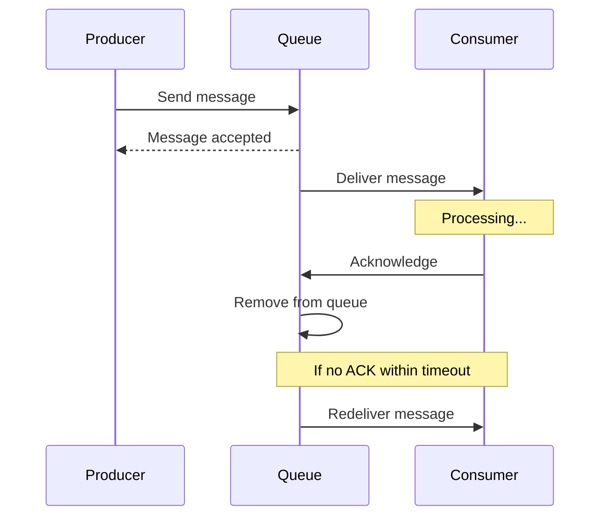
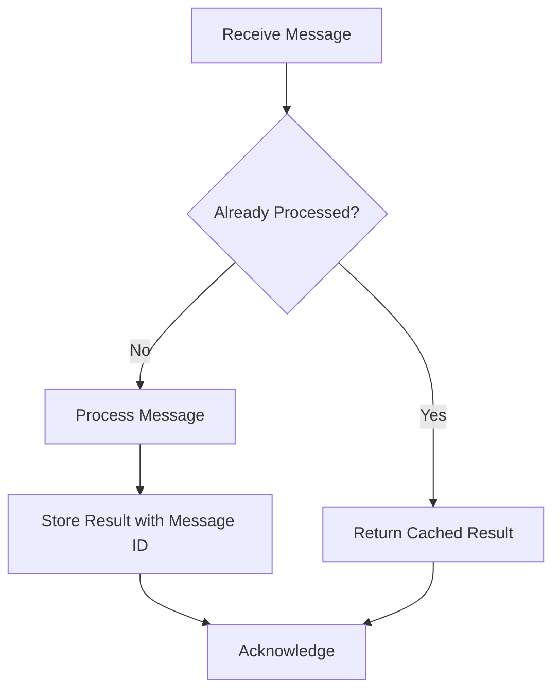
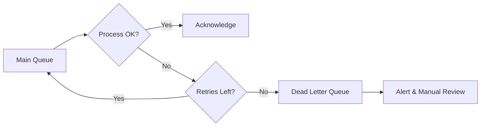

# How to Build At-Least-Once Delivery

Author: [nawazdhandala](https://github.com/nawazdhandala)

Tags: Event-Driven, Messaging, Reliability, Distributed Systems

Description: Learn to build at-least-once delivery guarantees with acknowledgments and retry mechanisms for reliable messaging.

---

In distributed systems, messages get lost. Networks fail, services crash, and queues overflow. At-least-once delivery ensures every message reaches its destination - even if it means delivering it more than once. This guide covers the patterns, trade-offs, and implementation details you need to build reliable messaging.

## Delivery Guarantees Explained

| Guarantee | Behavior | Use Case |
|-----------|----------|----------|
| **At-most-once** | Fire and forget. No retries. | Metrics, logs where loss is acceptable |
| **At-least-once** | Retry until acknowledged. May duplicate. | Payments, orders, notifications |
| **Exactly-once** | Delivered once, no more, no less. | Financial transactions (requires idempotency) |

At-least-once is the practical middle ground. It prevents message loss while keeping implementation complexity manageable. The trade-off is handling duplicate messages on the consumer side.

## How At-Least-Once Delivery Works

The core mechanism is simple: track every message until the consumer explicitly acknowledges it. If no acknowledgment arrives within a timeout, redeliver.



## Building a Message Queue with At-Least-Once Delivery

This implementation stores messages in a persistent queue, tracks their state, and redelivers unacknowledged messages after a timeout. The visibility timeout prevents multiple consumers from processing the same message simultaneously.

```typescript
// message-queue.ts
// A simple in-memory queue with at-least-once delivery semantics
// In production, use Redis, PostgreSQL, or a dedicated message broker

interface Message {
  id: string;
  payload: any;
  createdAt: number;
  attempts: number;
  visibleAt: number;  // When message becomes visible for redelivery
}

interface QueueConfig {
  visibilityTimeout: number;  // How long to wait before redelivery (ms)
  maxAttempts: number;        // Max delivery attempts before dead letter
}

class AtLeastOnceQueue {
  private messages: Map<string, Message> = new Map();
  private deadLetter: Message[] = [];
  private config: QueueConfig;

  constructor(config: Partial<QueueConfig> = {}) {
    this.config = {
      visibilityTimeout: 30000,  // 30 seconds default
      maxAttempts: 5,
      ...config
    };
  }

  // Producer sends a message
  send(payload: any): string {
    const id = crypto.randomUUID();
    const message: Message = {
      id,
      payload,
      createdAt: Date.now(),
      attempts: 0,
      visibleAt: Date.now()  // Immediately visible
    };
    this.messages.set(id, message);
    return id;
  }

  // Consumer receives the next available message
  receive(): Message | null {
    const now = Date.now();

    for (const message of this.messages.values()) {
      // Skip messages not yet visible (being processed)
      if (message.visibleAt > now) continue;

      // Check if max attempts exceeded
      if (message.attempts >= this.config.maxAttempts) {
        this.messages.delete(message.id);
        this.deadLetter.push(message);
        continue;
      }

      // Mark as in-flight by setting visibility timeout
      message.attempts++;
      message.visibleAt = now + this.config.visibilityTimeout;

      return { ...message };
    }

    return null;
  }

  // Consumer acknowledges successful processing
  acknowledge(messageId: string): boolean {
    if (this.messages.has(messageId)) {
      this.messages.delete(messageId);
      return true;
    }
    return false;
  }

  // Extend visibility timeout for long-running processing
  extendVisibility(messageId: string, additionalMs: number): boolean {
    const message = this.messages.get(messageId);
    if (message) {
      message.visibleAt = Date.now() + additionalMs;
      return true;
    }
    return false;
  }

  // Get messages that failed all retry attempts
  getDeadLetterMessages(): Message[] {
    return [...this.deadLetter];
  }
}
```

## Consumer Implementation with Proper Acknowledgment

The consumer must acknowledge messages only after successful processing. If processing fails, the message remains in the queue for redelivery. This pattern handles both transient failures (network issues) and processing errors.

```typescript
// consumer.ts
// Demonstrates proper message handling with acknowledgment

async function processMessages(queue: AtLeastOnceQueue) {
  while (true) {
    const message = queue.receive();

    if (!message) {
      // No messages available, wait before polling again
      await sleep(1000);
      continue;
    }

    console.log(`Processing message ${message.id}, attempt ${message.attempts}`);

    try {
      // Process the message - this is your business logic
      await handleMessage(message.payload);

      // Only acknowledge after successful processing
      queue.acknowledge(message.id);
      console.log(`Message ${message.id} processed successfully`);

    } catch (error) {
      // Do NOT acknowledge - message will be redelivered after timeout
      console.error(`Failed to process message ${message.id}:`, error);

      // Optionally: immediately make message visible for retry
      // queue.extendVisibility(message.id, 0);
    }
  }
}

async function handleMessage(payload: any): Promise<void> {
  // Your business logic here
  // Throw an error if processing fails
}

function sleep(ms: number): Promise<void> {
  return new Promise(resolve => setTimeout(resolve, ms));
}
```

## Handling Duplicates with Idempotency

At-least-once delivery means your consumer will receive duplicates. The solution is idempotent message handling - processing the same message multiple times produces the same result.



This idempotency handler uses a message ID to track which messages have been processed. It stores the result of each operation so duplicate deliveries return the same outcome without re-executing the business logic.

```typescript
// idempotency.ts
// Ensures duplicate messages don't cause duplicate side effects

interface ProcessedMessage {
  messageId: string;
  result: any;
  processedAt: number;
}

class IdempotentProcessor {
  // In production, use Redis or a database with TTL
  private processed: Map<string, ProcessedMessage> = new Map();
  private ttlMs: number;

  constructor(ttlMs: number = 24 * 60 * 60 * 1000) {  // 24 hour default
    this.ttlMs = ttlMs;
  }

  async process<T>(
    messageId: string,
    handler: () => Promise<T>
  ): Promise<T> {
    // Check if already processed
    const existing = this.processed.get(messageId);
    if (existing) {
      console.log(`Message ${messageId} already processed, returning cached result`);
      return existing.result as T;
    }

    // Process the message
    const result = await handler();

    // Store the result for deduplication
    this.processed.set(messageId, {
      messageId,
      result,
      processedAt: Date.now()
    });

    // Clean up old entries
    this.cleanup();

    return result;
  }

  private cleanup(): void {
    const cutoff = Date.now() - this.ttlMs;
    for (const [id, msg] of this.processed) {
      if (msg.processedAt < cutoff) {
        this.processed.delete(id);
      }
    }
  }
}

// Usage with the queue consumer
const processor = new IdempotentProcessor();

async function handleMessageIdempotently(message: Message): Promise<void> {
  await processor.process(message.id, async () => {
    // This only runs once per unique message ID
    await createOrder(message.payload);
    await sendConfirmationEmail(message.payload.email);
    return { success: true };
  });
}
```

## Retry Strategy with Exponential Backoff

Not all failures are equal. Transient errors (network timeouts) should retry quickly. Persistent errors (invalid data) should not retry indefinitely. This strategy implements exponential backoff with configurable retry behavior.

| Attempt | Delay | Total Wait |
|---------|-------|------------|
| 1 | 0s | 0s |
| 2 | 1s | 1s |
| 3 | 2s | 3s |
| 4 | 4s | 7s |
| 5 | 8s | 15s |

```typescript
// retry-strategy.ts
// Configurable retry delays for different failure scenarios

interface RetryConfig {
  initialDelayMs: number;
  maxDelayMs: number;
  backoffMultiplier: number;
}

function calculateRetryDelay(attempt: number, config: RetryConfig): number {
  // Exponential backoff: delay = initial * (multiplier ^ attempt)
  const delay = config.initialDelayMs * Math.pow(config.backoffMultiplier, attempt - 1);

  // Add jitter to prevent thundering herd (random 0-25% variation)
  const jitter = delay * Math.random() * 0.25;

  // Cap at maximum delay
  return Math.min(delay + jitter, config.maxDelayMs);
}

// Enhanced queue with retry delays
class RetryAwareQueue extends AtLeastOnceQueue {
  private retryConfig: RetryConfig = {
    initialDelayMs: 1000,
    maxDelayMs: 60000,
    backoffMultiplier: 2
  };

  // Override receive to implement backoff
  receive(): Message | null {
    const message = super.receive();

    if (message && message.attempts > 1) {
      // Calculate when this message should next be visible
      const delay = calculateRetryDelay(message.attempts, this.retryConfig);
      this.extendVisibility(message.id, delay);
    }

    return message;
  }
}
```

## Dead Letter Queue for Failed Messages

Messages that fail all retry attempts go to a dead letter queue (DLQ). This prevents poison messages from blocking the main queue while preserving them for investigation.



```typescript
// dead-letter.ts
// Handle messages that exceed max retry attempts

interface DeadLetterEntry {
  originalMessage: Message;
  failureReason: string;
  failedAt: number;
}

class DeadLetterQueue {
  private entries: DeadLetterEntry[] = [];

  add(message: Message, reason: string): void {
    this.entries.push({
      originalMessage: message,
      failureReason: reason,
      failedAt: Date.now()
    });

    // Alert operations team
    this.sendAlert(message, reason);
  }

  private sendAlert(message: Message, reason: string): void {
    console.error(`[DLQ ALERT] Message ${message.id} failed after ${message.attempts} attempts`);
    console.error(`Reason: ${reason}`);
    console.error(`Payload: ${JSON.stringify(message.payload)}`);
    // In production: send to alerting system (PagerDuty, Slack, etc.)
  }

  // Replay messages after fixing the issue
  replay(queue: AtLeastOnceQueue, filter?: (entry: DeadLetterEntry) => boolean): number {
    const toReplay = filter ? this.entries.filter(filter) : this.entries;
    let replayed = 0;

    for (const entry of toReplay) {
      // Reset attempts and re-queue
      queue.send(entry.originalMessage.payload);
      replayed++;
    }

    // Remove replayed entries
    this.entries = this.entries.filter(e => !toReplay.includes(e));

    return replayed;
  }
}
```

## Production Considerations

### Message Ordering

At-least-once delivery does not guarantee ordering. If order matters, include a sequence number in your payload and have consumers reorder or reject out-of-sequence messages.

### Visibility Timeout Selection

Set visibility timeout based on your slowest expected processing time plus a buffer. Too short causes unnecessary redeliveries. Too long delays retry after failures.

### Monitoring Metrics

Track these metrics to detect issues early:

| Metric | Purpose |
|--------|---------|
| Messages in queue | Backpressure indicator |
| Average processing time | Helps set visibility timeout |
| Retry rate | High rate indicates systemic issues |
| Dead letter queue size | Requires immediate attention |
| Consumer lag | Time between message creation and processing |

### When to Use a Managed Service

Building your own queue is educational but rarely practical for production. Use managed services like:

- **Amazon SQS** - Native at-least-once delivery with automatic scaling
- **RabbitMQ** - Manual acknowledgments with configurable retry
- **Apache Kafka** - Offset-based acknowledgment for high throughput
- **Redis Streams** - Lightweight option with consumer groups

## Summary

At-least-once delivery requires three components working together:

1. **Persistent storage** - Messages survive crashes and restarts
2. **Acknowledgment tracking** - Only remove messages after confirmed processing
3. **Retry mechanism** - Redeliver unacknowledged messages with backoff

The consumer side needs idempotency to handle duplicate deliveries safely. Dead letter queues catch poison messages before they block the system.

Start with a managed message broker for production workloads. The patterns in this guide apply whether you use SQS, RabbitMQ, Kafka, or a custom implementation.

---

**Related Reading:**

- [How to Implement Retry Logic with Exponential Backoff in Node.js](/blog/post/2026-01-06-nodejs-retry-exponential-backoff)
- [Traces and Spans in OpenTelemetry](/blog/post/2025-08-27-traces-and-spans-in-opentelemetry)
