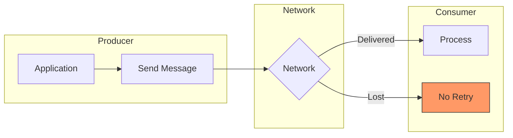
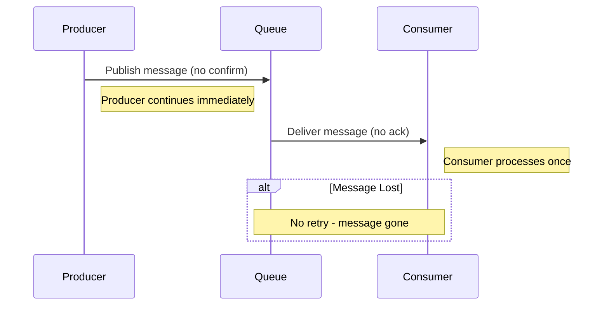
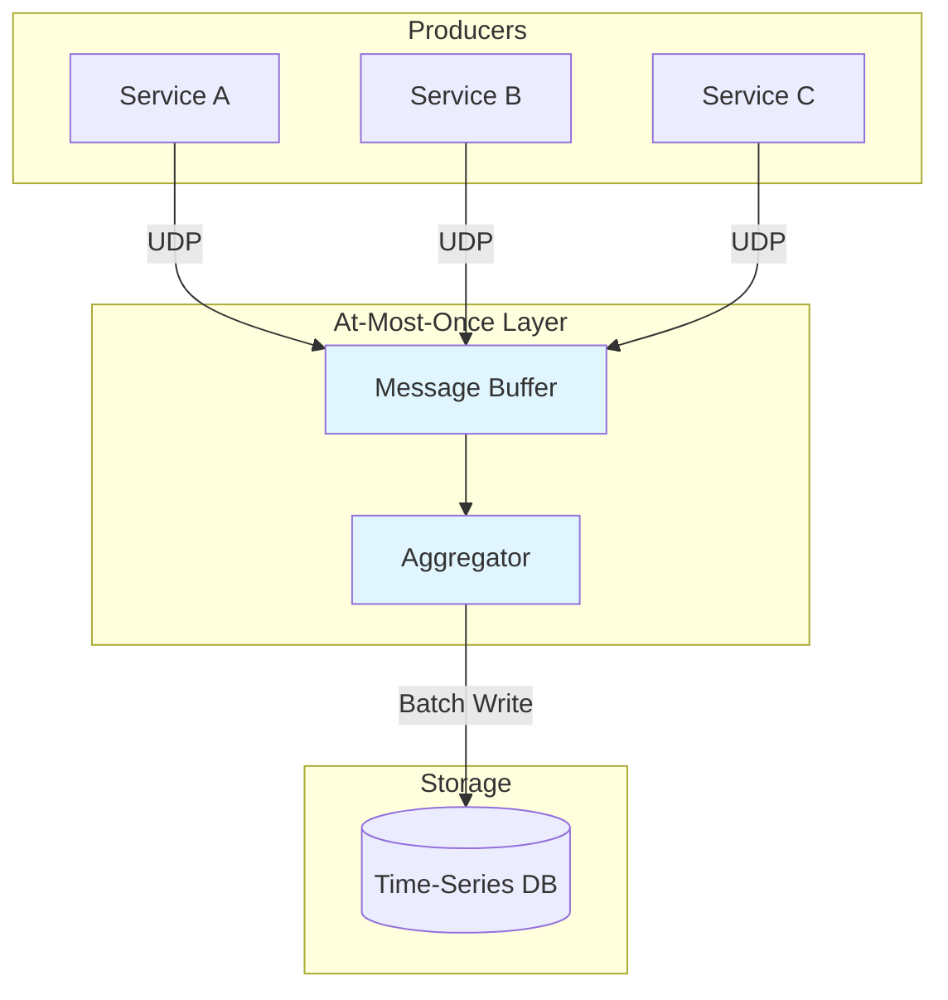

# How to Implement At-Most-Once Delivery

Author: [nawazdhandala](https://github.com/nawazdhandala)

Tags: Event-Driven, Messaging, Performance, Architecture

Description: Learn to implement at-most-once delivery semantics for fire-and-forget messaging with minimal overhead.

---

Not every message needs guaranteed delivery. Telemetry data, real-time metrics, and live updates often work better with at-most-once semantics - where messages are sent once without acknowledgment or retry. This approach trades delivery guarantees for lower latency and reduced system complexity.

## Understanding Delivery Semantics

Message delivery semantics define how systems handle message transmission and acknowledgment. Each semantic offers different tradeoffs between reliability and performance.

| Delivery Semantic | Guarantee | Use Case |
|-------------------|-----------|----------|
| **At-most-once** | Message delivered zero or one time | Metrics, telemetry, live updates |
| **At-least-once** | Message delivered one or more times | Orders, notifications |
| **Exactly-once** | Message delivered exactly one time | Financial transactions, inventory |

At-most-once delivery is the simplest and fastest approach. The producer sends a message and immediately moves on - no waiting for acknowledgments, no retry logic, no deduplication.

## When At-Most-Once Makes Sense

At-most-once delivery fits scenarios where losing occasional messages is acceptable but latency and throughput matter.



Good candidates for at-most-once delivery include:

- **Telemetry and metrics** - Missing one data point among thousands does not affect dashboards
- **Real-time location tracking** - The next update arrives in seconds anyway
- **Live video/audio streaming** - Retransmitting old frames creates worse user experience
- **Cache invalidation hints** - Stale data eventually expires regardless
- **Heartbeat signals** - The next heartbeat confirms status

## Basic Implementation with UDP

UDP provides natural at-most-once semantics since it has no built-in acknowledgment or retry mechanism. This example shows a simple metrics collector using UDP datagrams.

```javascript
const dgram = require('dgram');

// UDP client for fire-and-forget metrics
// No connection setup, no acknowledgment, minimal overhead
class MetricsClient {
  constructor(options = {}) {
    this.host = options.host || 'localhost';
    this.port = options.port || 8125;
    this.socket = dgram.createSocket('udp4');

    // Handle errors silently - this is intentional for at-most-once
    this.socket.on('error', (err) => {
      // Log but do not throw - message loss is acceptable
      console.debug('UDP send error (ignored):', err.message);
    });
  }

  // Send metric without waiting for acknowledgment
  send(metric, value, tags = {}) {
    const tagString = Object.entries(tags)
      .map(([k, v]) => `${k}:${v}`)
      .join(',');

    const message = `${metric}:${value}|g|#${tagString}`;
    const buffer = Buffer.from(message);

    // Fire and forget - callback only handles local errors
    this.socket.send(buffer, this.port, this.host, (err) => {
      if (err) {
        console.debug('Failed to send metric:', metric);
      }
    });
  }

  // Batch multiple metrics in one datagram for efficiency
  sendBatch(metrics) {
    const message = metrics
      .map(m => `${m.name}:${m.value}|${m.type}`)
      .join('\n');

    const buffer = Buffer.from(message);
    this.socket.send(buffer, this.port, this.host);
  }

  close() {
    this.socket.close();
  }
}

// Usage
const metrics = new MetricsClient({ host: 'metrics.example.com', port: 8125 });

// These calls return immediately - no blocking
metrics.send('api.request.count', 1, { endpoint: '/users', method: 'GET' });
metrics.send('api.response.time', 45.2, { endpoint: '/users' });
```

## At-Most-Once with Message Queues

Message queues like RabbitMQ and Kafka can implement at-most-once by disabling acknowledgments. This configuration prioritizes speed over delivery guarantees.



The following RabbitMQ configuration disables publisher confirms and consumer acknowledgments for maximum throughput.

```javascript
const amqp = require('amqplib');

// At-most-once RabbitMQ configuration
// Disables confirms and acks for fire-and-forget behavior
class AtMostOncePublisher {
  constructor(connectionUrl) {
    this.connectionUrl = connectionUrl;
    this.channel = null;
  }

  async connect() {
    const connection = await amqp.connect(this.connectionUrl);

    // Regular channel without publisher confirms
    this.channel = await connection.createChannel();

    // Declare queue as non-durable - messages lost on restart
    await this.channel.assertQueue('telemetry', {
      durable: false,       // Queue does not survive broker restart
      autoDelete: true,     // Delete when no consumers
      messageTtl: 60000,    // Messages expire after 60 seconds
    });
  }

  // Publish without waiting for confirmation
  publish(data) {
    const message = Buffer.from(JSON.stringify(data));

    // Returns immediately - no confirmation
    this.channel.sendToQueue('telemetry', message, {
      persistent: false,    // Do not write to disk
      expiration: '30000',  // Message expires in 30 seconds
    });
  }
}

// Consumer without acknowledgments
class AtMostOnceConsumer {
  async consume(channel, queue, handler) {
    await channel.consume(
      queue,
      (msg) => {
        if (msg) {
          const data = JSON.parse(msg.content.toString());
          handler(data);
          // No ack call - message considered delivered
        }
      },
      {
        noAck: true,  // Disable acknowledgments
      }
    );
  }
}
```

## Kafka At-Most-Once Configuration

Kafka achieves at-most-once delivery through specific producer and consumer configurations. The producer disables retries and acknowledgments, while the consumer commits offsets before processing.

```javascript
const { Kafka } = require('kafkajs');

// Kafka producer configured for at-most-once delivery
// acks=0 means producer does not wait for any acknowledgment
const kafka = new Kafka({
  clientId: 'telemetry-producer',
  brokers: ['kafka:9092'],
});

const producer = kafka.producer({
  // At-most-once producer settings
  acks: 0,              // Do not wait for broker acknowledgment
  retries: 0,           // Never retry failed sends
  idempotent: false,    // Disable idempotent producer
});

async function sendTelemetry(events) {
  // Fire and forget - returns after message queued locally
  await producer.send({
    topic: 'telemetry',
    messages: events.map(e => ({
      key: e.deviceId,
      value: JSON.stringify(e),
    })),
  });
}

// Consumer commits offset before processing
// If processing fails, message is not reprocessed
const consumer = kafka.consumer({ groupId: 'telemetry-group' });

async function consumeAtMostOnce() {
  await consumer.subscribe({ topic: 'telemetry' });

  await consumer.run({
    // Enable auto-commit before processing
    autoCommit: true,
    autoCommitInterval: 1000,

    eachMessage: async ({ topic, partition, message }) => {
      // Offset already committed - if this crashes, message is lost
      const data = JSON.parse(message.value.toString());
      processMetric(data);
    },
  });
}
```

## HTTP Fire-and-Forget Pattern

For HTTP-based systems, you can implement at-most-once by sending requests without waiting for responses. This requires careful timeout and error handling to prevent blocking.

```javascript
// HTTP client for fire-and-forget requests
// Uses short timeouts and ignores failures
class FireAndForgetClient {
  constructor(options = {}) {
    this.baseUrl = options.baseUrl;
    this.timeout = options.timeout || 1000; // Short timeout
  }

  // Send request without waiting for response
  async send(path, data) {
    const controller = new AbortController();
    const timeoutId = setTimeout(() => controller.abort(), this.timeout);

    try {
      // Do not await - fire and move on
      fetch(`${this.baseUrl}${path}`, {
        method: 'POST',
        headers: { 'Content-Type': 'application/json' },
        body: JSON.stringify(data),
        signal: controller.signal,
      }).catch(() => {
        // Silently ignore all errors
      });
    } finally {
      clearTimeout(timeoutId);
    }
  }

  // Batch requests to reduce connection overhead
  async sendBatch(path, items) {
    // Send all without waiting
    items.forEach(item => this.send(path, item));
  }
}

// Usage for analytics events
const analytics = new FireAndForgetClient({
  baseUrl: 'https://analytics.example.com',
  timeout: 500,
});

// These return immediately
analytics.send('/events', { event: 'page_view', path: '/home' });
analytics.send('/events', { event: 'click', element: 'signup_button' });
```

## Comparison of Approaches

Each implementation method has different characteristics suited to specific use cases.

| Approach | Latency | Throughput | Complexity | Best For |
|----------|---------|------------|------------|----------|
| **UDP** | Lowest | Highest | Simple | Local metrics, StatsD |
| **RabbitMQ (no ack)** | Low | High | Medium | Buffered events |
| **Kafka (acks=0)** | Low | Very High | Medium | High-volume streaming |
| **HTTP fire-and-forget** | Medium | Medium | Simple | External services |

## Architecture Considerations

When implementing at-most-once delivery, consider these architectural patterns to handle acceptable message loss gracefully.



Key design principles:

- **Aggregate before storing** - Buffer messages and write in batches to reduce the impact of individual message loss
- **Use sampling** - For high-volume telemetry, sample messages at the producer to reduce volume while maintaining statistical accuracy
- **Design for gaps** - Dashboards and alerts should handle missing data points gracefully with interpolation or null handling
- **Monitor delivery rates** - Track what percentage of messages arrive to detect network or infrastructure issues

## Summary

At-most-once delivery is not a compromise - it is a deliberate choice for scenarios where low latency and high throughput outweigh guaranteed delivery. Metrics, telemetry, and real-time updates benefit from this approach because the cost of complexity and latency from acknowledgments exceeds the cost of occasional message loss.

Choose at-most-once when:
- Missing some messages is acceptable
- Low latency is critical
- High throughput is required
- The next message will replace the previous one anyway

Avoid at-most-once for financial transactions, order processing, or any operation where losing a message has business consequences. For those cases, use at-least-once with idempotency or exactly-once semantics.
