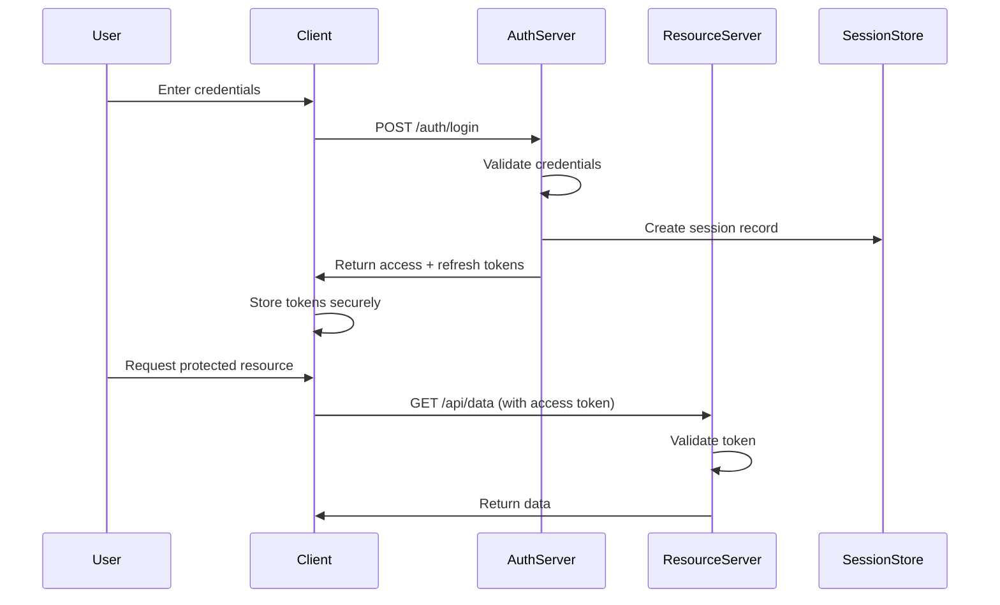
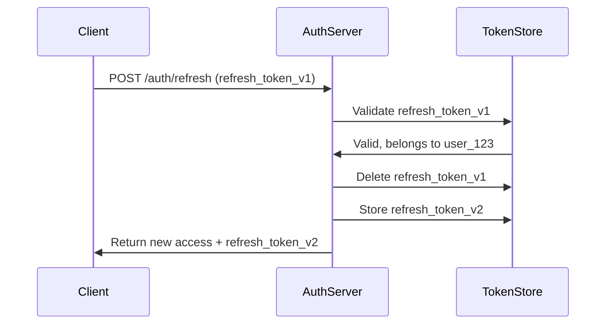
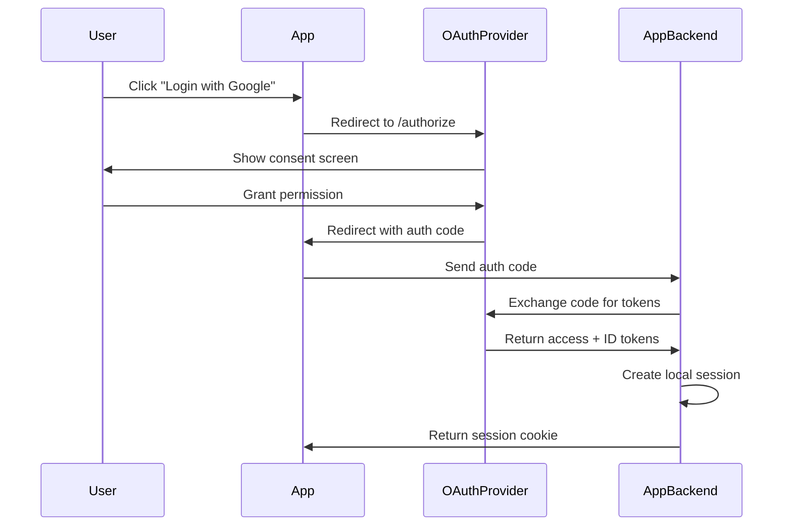

# How to Build Authentication Flow Design

Author: [nawazdhandala](https://github.com/nawazdhandala)

Tags: Security, Authentication, OAuth, JWT

Description: Learn to build authentication flow design with secure login, token management, and session handling.

---

Authentication is the gateway to every secure application. Getting it wrong means leaked data, frustrated users, and compliance headaches. Getting it right means users trust your system and attackers move on to easier targets.

This guide walks through designing authentication flows from first principles. We cover the core components, common patterns, token strategies, and session management with practical code you can adapt to your own stack.

---

## Core Components of Authentication

Before diving into flows, understand the building blocks.

| Component | Purpose | Example |
|-----------|---------|---------|
| Identity Provider (IdP) | Verifies user identity | Okta, Auth0, your own login service |
| Credentials | Proof of identity | Password, biometric, hardware key |
| Token | Portable proof of authenticated session | JWT, opaque session ID |
| Session Store | Tracks active sessions server-side | Redis, database table |
| Refresh Mechanism | Extends session without re-authentication | Refresh token rotation |

These pieces combine differently depending on your security requirements and user experience goals.

---

## Authentication Flow Overview

The following diagram shows a typical authentication flow from login to protected resource access.



Each arrow represents a point where security can fail. The rest of this guide addresses how to handle each transition safely.

---

## Token-Based Authentication with JWT

JSON Web Tokens (JWT) are the standard for stateless authentication. They encode claims, are signed for integrity, and can be verified without database lookups.

A JWT has three parts: header, payload, and signature. The following code shows how to generate and verify tokens in Node.js.

```typescript
import jwt from 'jsonwebtoken';

// Configuration for token generation
const ACCESS_TOKEN_SECRET = process.env.ACCESS_TOKEN_SECRET!;
const REFRESH_TOKEN_SECRET = process.env.REFRESH_TOKEN_SECRET!;
const ACCESS_TOKEN_EXPIRY = '15m';   // Short-lived for security
const REFRESH_TOKEN_EXPIRY = '7d';   // Longer-lived for convenience

interface TokenPayload {
  userId: string;
  email: string;
  roles: string[];
}

// Generate an access token with user claims
export function generateAccessToken(payload: TokenPayload): string {
  return jwt.sign(payload, ACCESS_TOKEN_SECRET, {
    expiresIn: ACCESS_TOKEN_EXPIRY,
    issuer: 'your-app-name',
    audience: 'your-app-users',
  });
}

// Generate a refresh token with minimal claims
export function generateRefreshToken(userId: string): string {
  return jwt.sign(
    { userId, type: 'refresh' },
    REFRESH_TOKEN_SECRET,
    { expiresIn: REFRESH_TOKEN_EXPIRY }
  );
}

// Verify and decode an access token
export function verifyAccessToken(token: string): TokenPayload | null {
  try {
    return jwt.verify(token, ACCESS_TOKEN_SECRET, {
      issuer: 'your-app-name',
      audience: 'your-app-users',
    }) as TokenPayload;
  } catch (err) {
    return null;  // Token invalid, expired, or tampered
  }
}
```

Keep access tokens short-lived (15 minutes or less). This limits the damage window if a token leaks.

---

## Login Flow Implementation

The login endpoint validates credentials and issues tokens. Here is a complete implementation.

```typescript
import bcrypt from 'bcrypt';
import { Request, Response } from 'express';
import { generateAccessToken, generateRefreshToken } from './tokens';
import { findUserByEmail, saveRefreshToken } from './database';

export async function loginHandler(req: Request, res: Response) {
  const { email, password } = req.body;

  // Step 1: Find user by email
  const user = await findUserByEmail(email);
  if (!user) {
    // Use generic message to prevent user enumeration
    return res.status(401).json({ error: 'Invalid credentials' });
  }

  // Step 2: Verify password hash
  const passwordValid = await bcrypt.compare(password, user.passwordHash);
  if (!passwordValid) {
    return res.status(401).json({ error: 'Invalid credentials' });
  }

  // Step 3: Generate tokens
  const accessToken = generateAccessToken({
    userId: user.id,
    email: user.email,
    roles: user.roles,
  });
  const refreshToken = generateRefreshToken(user.id);

  // Step 4: Store refresh token for later validation
  await saveRefreshToken(user.id, refreshToken);

  // Step 5: Return tokens to client
  res.json({
    accessToken,
    refreshToken,
    expiresIn: 900,  // 15 minutes in seconds
  });
}
```

---

## Refresh Token Rotation

Refresh tokens extend sessions without requiring users to log in again. Rotation adds security by invalidating old tokens each time a new one is issued.



The implementation below shows how to handle refresh token rotation.

```typescript
import { Request, Response } from 'express';
import jwt from 'jsonwebtoken';
import {
  findRefreshToken,
  deleteRefreshToken,
  saveRefreshToken,
  findUserById,
} from './database';
import { generateAccessToken, generateRefreshToken } from './tokens';

const REFRESH_TOKEN_SECRET = process.env.REFRESH_TOKEN_SECRET!;

export async function refreshHandler(req: Request, res: Response) {
  const { refreshToken } = req.body;

  // Step 1: Verify the refresh token signature
  let decoded: { userId: string };
  try {
    decoded = jwt.verify(refreshToken, REFRESH_TOKEN_SECRET) as { userId: string };
  } catch {
    return res.status(401).json({ error: 'Invalid refresh token' });
  }

  // Step 2: Check if token exists in store (prevents reuse of old tokens)
  const storedToken = await findRefreshToken(decoded.userId, refreshToken);
  if (!storedToken) {
    // Possible token reuse attack - invalidate all sessions for this user
    await deleteAllUserRefreshTokens(decoded.userId);
    return res.status(401).json({ error: 'Token reuse detected' });
  }

  // Step 3: Delete old token and issue new pair
  await deleteRefreshToken(refreshToken);

  const user = await findUserById(decoded.userId);
  const newAccessToken = generateAccessToken({
    userId: user.id,
    email: user.email,
    roles: user.roles,
  });
  const newRefreshToken = generateRefreshToken(user.id);

  await saveRefreshToken(user.id, newRefreshToken);

  res.json({
    accessToken: newAccessToken,
    refreshToken: newRefreshToken,
    expiresIn: 900,
  });
}
```

---

## Session Management Patterns

Different applications need different session strategies. The table below compares common approaches.

| Pattern | Storage | Scalability | Revocation | Use Case |
|---------|---------|-------------|------------|----------|
| Stateless JWT | None (token only) | Excellent | Hard (wait for expiry) | APIs, microservices |
| Server-side sessions | Redis/DB | Good with clustering | Instant | Traditional web apps |
| Hybrid (JWT + session store) | Minimal server state | Very good | Fast | Modern web apps |

The hybrid approach stores a session ID in the JWT and keeps minimal state server-side for revocation.

```typescript
import { Redis } from 'ioredis';

const redis = new Redis(process.env.REDIS_URL);
const SESSION_TTL = 60 * 60 * 24 * 7;  // 7 days in seconds

interface SessionData {
  userId: string;
  createdAt: number;
  lastActivity: number;
  deviceInfo: string;
}

// Create a new session and return the session ID
export async function createSession(data: SessionData): Promise<string> {
  const sessionId = crypto.randomUUID();
  await redis.setex(
    `session:${sessionId}`,
    SESSION_TTL,
    JSON.stringify(data)
  );
  return sessionId;
}

// Validate session and update last activity
export async function validateSession(sessionId: string): Promise<SessionData | null> {
  const data = await redis.get(`session:${sessionId}`);
  if (!data) return null;

  const session = JSON.parse(data) as SessionData;
  session.lastActivity = Date.now();

  // Extend TTL on activity
  await redis.setex(
    `session:${sessionId}`,
    SESSION_TTL,
    JSON.stringify(session)
  );

  return session;
}

// Revoke a single session instantly
export async function revokeSession(sessionId: string): Promise<void> {
  await redis.del(`session:${sessionId}`);
}

// Revoke all sessions for a user (logout everywhere)
export async function revokeAllUserSessions(userId: string): Promise<void> {
  const keys = await redis.keys(`session:*`);
  for (const key of keys) {
    const data = await redis.get(key);
    if (data && JSON.parse(data).userId === userId) {
      await redis.del(key);
    }
  }
}
```

---

## OAuth 2.0 Integration Flow

Many applications delegate authentication to third-party providers. The authorization code flow is the most secure option for web applications.



The backend exchange is critical. Never expose client secrets to the browser.

```typescript
import axios from 'axios';

interface OAuthConfig {
  clientId: string;
  clientSecret: string;
  redirectUri: string;
  tokenEndpoint: string;
  userInfoEndpoint: string;
}

// Exchange authorization code for tokens
export async function exchangeCodeForTokens(
  code: string,
  config: OAuthConfig
): Promise<{ accessToken: string; idToken: string }> {
  const response = await axios.post(config.tokenEndpoint, {
    grant_type: 'authorization_code',
    code,
    client_id: config.clientId,
    client_secret: config.clientSecret,
    redirect_uri: config.redirectUri,
  });

  return {
    accessToken: response.data.access_token,
    idToken: response.data.id_token,
  };
}

// Fetch user profile from provider
export async function fetchUserProfile(
  accessToken: string,
  config: OAuthConfig
): Promise<{ email: string; name: string; providerId: string }> {
  const response = await axios.get(config.userInfoEndpoint, {
    headers: { Authorization: `Bearer ${accessToken}` },
  });

  return {
    email: response.data.email,
    name: response.data.name,
    providerId: response.data.sub,
  };
}
```

---

## Security Checklist

Before deploying your authentication flow, verify these items.

| Check | Why It Matters |
|-------|----------------|
| Use HTTPS everywhere | Prevents token interception |
| Hash passwords with bcrypt/argon2 | Protects credentials at rest |
| Implement rate limiting on login | Blocks brute force attacks |
| Use HttpOnly cookies for tokens | Prevents XSS token theft |
| Validate redirect URIs strictly | Prevents authorization code theft |
| Log authentication events | Enables incident response |
| Set secure cookie flags | SameSite, Secure, HttpOnly |

---

## Middleware for Protected Routes

The final piece is middleware that validates tokens on every request to protected endpoints.

```typescript
import { Request, Response, NextFunction } from 'express';
import { verifyAccessToken } from './tokens';
import { validateSession } from './sessions';

export async function authMiddleware(
  req: Request,
  res: Response,
  next: NextFunction
) {
  // Extract token from Authorization header
  const authHeader = req.headers.authorization;
  if (!authHeader?.startsWith('Bearer ')) {
    return res.status(401).json({ error: 'Missing authorization header' });
  }

  const token = authHeader.slice(7);

  // Verify JWT signature and claims
  const payload = verifyAccessToken(token);
  if (!payload) {
    return res.status(401).json({ error: 'Invalid or expired token' });
  }

  // Optional: validate session still exists (for revocation support)
  if (payload.sessionId) {
    const session = await validateSession(payload.sessionId);
    if (!session) {
      return res.status(401).json({ error: 'Session revoked' });
    }
  }

  // Attach user info to request for downstream handlers
  req.user = payload;
  next();
}
```

---

## Summary

Authentication flow design requires balancing security with user experience. Start with these principles:

1. Keep access tokens short-lived and refresh tokens rotated
2. Store sensitive tokens server-side or in HttpOnly cookies
3. Validate every token on every request
4. Enable instant revocation through session stores
5. Log everything for audit and incident response

The patterns shown here work for most applications. Adjust token lifetimes, storage strategies, and revocation mechanisms based on your specific security requirements.

---

**Related Reading:**

- [How private status pages stay secure: authentication options explained](https://oneuptime.com/blog/post/2025-11-20-secure-your-status-page-authentication-options/view)
- [SSO is a Security Basic, Not an Enterprise Perk](https://oneuptime.com/blog/post/2025-08-19-sso-is-a-security-basic-not-an-enterprise-perk/view)
