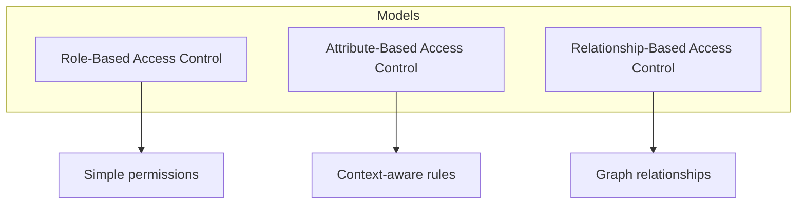
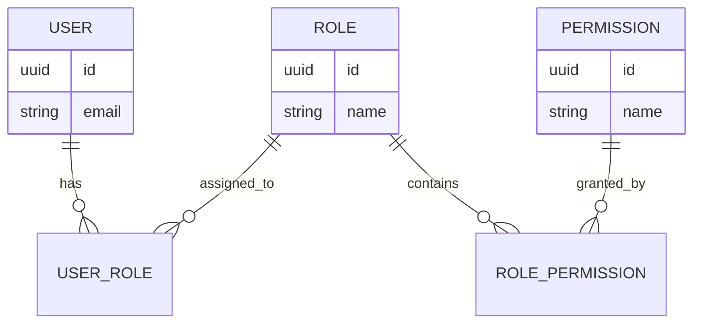
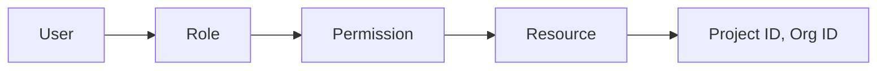
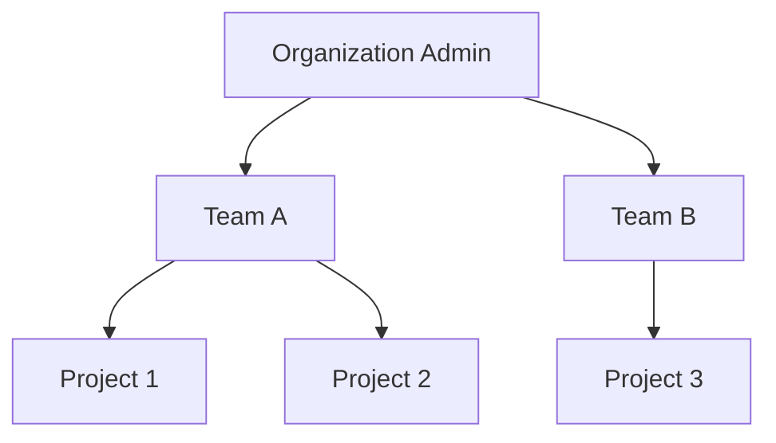

# How to Implement Authorization Model Design

Author: [nawazdhandala](https://github.com/nawazdhandala)

Tags: Security, Authorization, Access Control, Architecture

Description: Learn to implement authorization model design with roles, permissions, and policy-based access.

---

Authorization determines what authenticated users can do within your system. Get it wrong and you either lock people out of features they need or expose data they should never see. A well-designed authorization model balances security with usability while remaining maintainable as your application grows.

## Authorization vs Authentication

These terms get confused constantly. Authentication answers "who are you?" while authorization answers "what can you do?" Your login system handles authentication. Everything after login is authorization.

| Concern | Question Answered | Example |
| --- | --- | --- |
| Authentication | Who is this user? | Verify password, check SSO token |
| Authorization | What can this user do? | Can user edit this document? |
| Access Control | Where does this rule apply? | This resource, this action, this context |

## Common Authorization Models

Three models dominate production systems. Each fits different use cases.



### Role-Based Access Control (RBAC)

RBAC groups permissions into roles, then assigns roles to users. A user with the "editor" role inherits all permissions that role contains.

| Role | Permissions |
| --- | --- |
| viewer | read |
| editor | read, write |
| admin | read, write, delete, manage_users |

This model works well when permissions align with job functions. Most applications start here.

### Attribute-Based Access Control (ABAC)

ABAC evaluates policies based on attributes of the user, resource, action, and environment. Instead of checking "does this user have the editor role?" you check "is this user's department equal to the document's department and is it during business hours?"

ABAC handles nuanced rules but requires more infrastructure.

### Relationship-Based Access Control (ReBAC)

ReBAC defines access through relationships in a graph. If user A owns document B, and document B is in folder C, then user A has access to folder C. Google Docs uses this model for sharing.

## Designing Your Permission Schema

Start with the resources and actions in your system. List every noun (document, project, user) and every verb (create, read, update, delete, share).

The following table shows a typical permission matrix for a project management application.

| Resource | Actions | Notes |
| --- | --- | --- |
| Project | create, read, update, delete, archive | Archive is distinct from delete |
| Task | create, read, update, delete, assign | Assign changes ownership |
| Comment | create, read, update, delete | Users can only edit own comments |
| User | invite, remove, update_role | Scoped to project membership |

Map these to permission strings. Keep the format consistent.

```python
# Permission string format: resource:action
# Examples: "project:create", "task:assign", "user:invite"

PERMISSIONS = {
    "project:create",
    "project:read",
    "project:update",
    "project:delete",
    "project:archive",
    "task:create",
    "task:read",
    "task:update",
    "task:delete",
    "task:assign",
    "comment:create",
    "comment:read",
    "comment:update",
    "comment:delete",
    "user:invite",
    "user:remove",
    "user:update_role",
}
```

## Implementing RBAC

Here is a minimal RBAC implementation. Roles contain permissions, and users are assigned roles.



The database schema uses junction tables to model the many-to-many relationships between users, roles, and permissions.

```sql
-- Core tables for RBAC
CREATE TABLE users (
    id UUID PRIMARY KEY,
    email VARCHAR(255) UNIQUE NOT NULL
);

CREATE TABLE roles (
    id UUID PRIMARY KEY,
    name VARCHAR(100) UNIQUE NOT NULL
);

CREATE TABLE permissions (
    id UUID PRIMARY KEY,
    name VARCHAR(100) UNIQUE NOT NULL  -- e.g., "project:create"
);

-- Junction tables
CREATE TABLE user_roles (
    user_id UUID REFERENCES users(id),
    role_id UUID REFERENCES roles(id),
    PRIMARY KEY (user_id, role_id)
);

CREATE TABLE role_permissions (
    role_id UUID REFERENCES roles(id),
    permission_id UUID REFERENCES permissions(id),
    PRIMARY KEY (role_id, permission_id)
);
```

Query a user's permissions by joining through the role tables.

```sql
-- Get all permissions for a user
SELECT DISTINCT p.name
FROM permissions p
JOIN role_permissions rp ON rp.permission_id = p.id
JOIN user_roles ur ON ur.role_id = rp.role_id
WHERE ur.user_id = $1;
```

## Adding Resource-Level Permissions

Basic RBAC answers "can this user create projects?" but not "can this user edit this specific project?" You need to scope permissions to resources.



Extend your schema to track which resources a user has access to.

```sql
-- Resource-scoped permissions
CREATE TABLE resource_permissions (
    id UUID PRIMARY KEY,
    user_id UUID REFERENCES users(id),
    permission_id UUID REFERENCES permissions(id),
    resource_type VARCHAR(50) NOT NULL,  -- "project", "task"
    resource_id UUID NOT NULL,
    UNIQUE(user_id, permission_id, resource_type, resource_id)
);

-- Check if user can edit a specific project
SELECT EXISTS (
    SELECT 1 FROM resource_permissions
    WHERE user_id = $1
      AND permission_id = (SELECT id FROM permissions WHERE name = 'project:update')
      AND resource_type = 'project'
      AND resource_id = $2
);
```

## Building an Authorization Service

Centralize authorization checks in a dedicated service. This keeps business logic clean and makes auditing straightforward.

```python
from typing import Optional
from dataclasses import dataclass

@dataclass
class AuthContext:
    user_id: str
    resource_type: Optional[str] = None
    resource_id: Optional[str] = None

class AuthorizationService:
    def __init__(self, db):
        self.db = db
        # Cache permissions in memory for performance
        self._cache = {}

    def can(self, ctx: AuthContext, permission: str) -> bool:
        """Check if user has permission, optionally scoped to a resource."""
        # First check global permissions via roles
        if self._has_role_permission(ctx.user_id, permission):
            return True

        # Then check resource-specific permissions
        if ctx.resource_type and ctx.resource_id:
            return self._has_resource_permission(
                ctx.user_id, permission, ctx.resource_type, ctx.resource_id
            )

        return False

    def _has_role_permission(self, user_id: str, permission: str) -> bool:
        # Query role-based permissions (with caching)
        perms = self._get_user_permissions(user_id)
        return permission in perms

    def _has_resource_permission(
        self, user_id: str, permission: str,
        resource_type: str, resource_id: str
    ) -> bool:
        # Query resource-scoped permissions
        query = """
            SELECT EXISTS (
                SELECT 1 FROM resource_permissions rp
                JOIN permissions p ON p.id = rp.permission_id
                WHERE rp.user_id = %s
                  AND p.name = %s
                  AND rp.resource_type = %s
                  AND rp.resource_id = %s
            )
        """
        return self.db.fetch_one(query, user_id, permission, resource_type, resource_id)

    def _get_user_permissions(self, user_id: str) -> set:
        if user_id in self._cache:
            return self._cache[user_id]

        query = """
            SELECT DISTINCT p.name FROM permissions p
            JOIN role_permissions rp ON rp.permission_id = p.id
            JOIN user_roles ur ON ur.role_id = rp.role_id
            WHERE ur.user_id = %s
        """
        perms = set(row[0] for row in self.db.fetch_all(query, user_id))
        self._cache[user_id] = perms
        return perms
```

Use the service in your API handlers.

```python
# Example usage in a FastAPI route
@app.put("/projects/{project_id}")
async def update_project(project_id: str, data: ProjectUpdate, user: User = Depends(get_current_user)):
    ctx = AuthContext(
        user_id=user.id,
        resource_type="project",
        resource_id=project_id
    )

    # Check authorization before proceeding
    if not auth_service.can(ctx, "project:update"):
        raise HTTPException(status_code=403, detail="Not authorized to update this project")

    # Proceed with update
    return await project_service.update(project_id, data)
```

## Hierarchical Permissions

Organizations often have nested structures: organization > team > project. Users with organization-level admin should automatically have access to all teams and projects within.



Implement this by walking up the hierarchy when checking permissions.

```python
def can_with_hierarchy(self, ctx: AuthContext, permission: str) -> bool:
    """Check permission with hierarchy inheritance."""
    # Direct permission check
    if self.can(ctx, permission):
        return True

    # Walk up the resource hierarchy
    parent = self._get_parent_resource(ctx.resource_type, ctx.resource_id)
    while parent:
        parent_ctx = AuthContext(
            user_id=ctx.user_id,
            resource_type=parent["type"],
            resource_id=parent["id"]
        )
        if self.can(parent_ctx, permission):
            return True
        parent = self._get_parent_resource(parent["type"], parent["id"])

    return False
```

## Common Pitfalls

1. **Checking permissions in the wrong layer.** Authorization belongs in your service layer, not your database queries or UI. The UI can hide buttons, but the backend must enforce rules.

2. **Forgetting to invalidate caches.** When roles change, cached permissions become stale. Invalidate on role assignment changes or use short TTLs.

3. **Over-engineering early.** Start with RBAC. Move to ABAC or ReBAC only when RBAC cannot express your rules. Most applications never need that complexity.

4. **Missing audit logs.** Log every permission check, especially denials. This helps debug issues and satisfies compliance requirements.

5. **Hardcoding role names.** Store roles in the database, not code. This lets you add roles without deployments.

## Checklist Before Launch

- [ ] All API endpoints check authorization
- [ ] Permission denials return 403, not 404 (unless information leakage is a concern)
- [ ] Role changes take effect immediately (cache invalidation works)
- [ ] Audit logs capture permission checks
- [ ] Admin UI exists for managing roles and permissions
- [ ] Default roles are documented and tested
- [ ] Resource deletion cascades to permission records

Authorization is not a feature you ship once. As your product evolves, your permission model will need updates. Build it with change in mind: use a central service, keep permissions in the database, and log everything.
