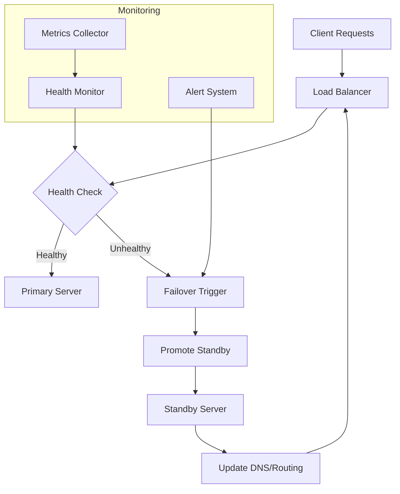
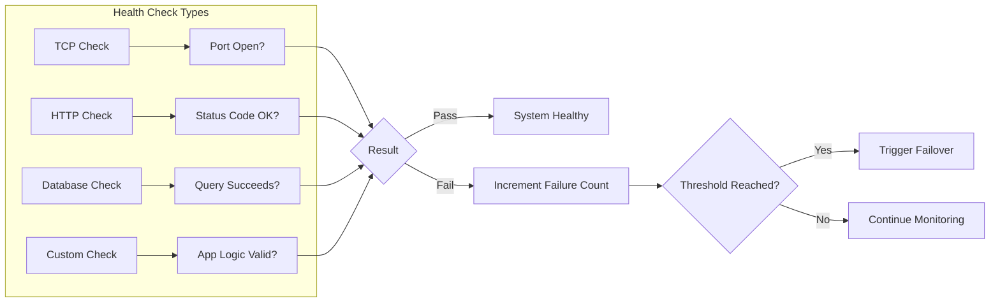
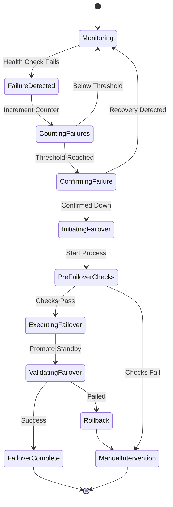
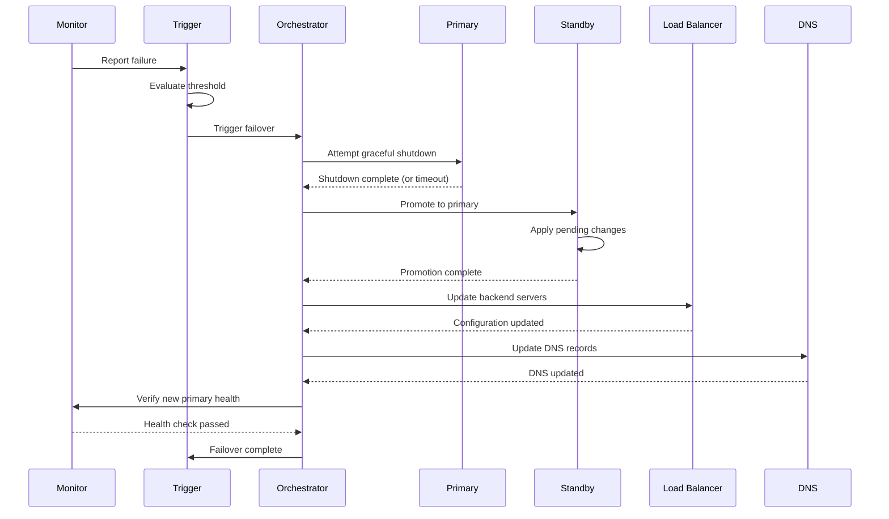
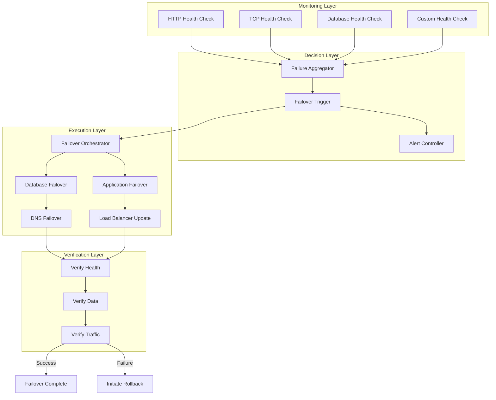

# How to Build Automatic Failover

Author: [nawazdhandala](https://github.com/nawazdhandala)

Tags: High Availability, Failover, Automation, SRE

Description: Learn how to implement automatic failover for zero-touch recovery from failures.

---

## Introduction

Automatic failover is a critical component of any high availability architecture. When a primary system fails, automatic failover ensures that a standby system takes over with minimal or zero downtime. This eliminates the need for manual intervention and reduces mean time to recovery (MTTR) significantly.

In this post, we will explore how to build automatic failover systems, covering health checks, failover triggers, and automation scripts for both databases and applications.

## Understanding Automatic Failover

Before diving into implementation, let us understand the core components of an automatic failover system:



The key components include:

1. **Health Checks**: Continuous monitoring of system health
2. **Failover Triggers**: Conditions that initiate failover
3. **Automation Scripts**: Code that executes the failover process
4. **State Synchronization**: Keeping standby systems up to date

## Health Checks: The Foundation of Failover

Health checks are the eyes and ears of your failover system. They continuously monitor your infrastructure and detect failures before they impact users.

### Types of Health Checks



### Implementing Health Checks in Python

Here is a comprehensive health check implementation:

```python
#!/usr/bin/env python3
"""
Health Check Module for Automatic Failover System

This module provides various health check implementations
for monitoring service availability and triggering failover.
"""

import time
import socket
import requests
import psycopg2
from dataclasses import dataclass
from typing import Callable, Optional
from enum import Enum
import logging

# Configure logging for health check operations
logging.basicConfig(
    level=logging.INFO,
    format='%(asctime)s - %(name)s - %(levelname)s - %(message)s'
)
logger = logging.getLogger(__name__)


class HealthStatus(Enum):
    """Enum representing possible health states of a service."""
    HEALTHY = "healthy"
    UNHEALTHY = "unhealthy"
    DEGRADED = "degraded"
    UNKNOWN = "unknown"


@dataclass
class HealthCheckResult:
    """Data class to store health check results."""
    status: HealthStatus
    latency_ms: float
    message: str
    timestamp: float

    def is_healthy(self) -> bool:
        """Return True if the service is healthy."""
        return self.status == HealthStatus.HEALTHY


class HealthChecker:
    """
    Base class for implementing health checks.

    This class provides the foundation for all health check types
    and handles common functionality like retry logic and timeouts.
    """

    def __init__(
        self,
        name: str,
        timeout_seconds: float = 5.0,
        failure_threshold: int = 3,
        success_threshold: int = 2
    ):
        """
        Initialize the health checker.

        Args:
            name: Identifier for this health check
            timeout_seconds: Maximum time to wait for a check
            failure_threshold: Consecutive failures before marking unhealthy
            success_threshold: Consecutive successes before marking healthy
        """
        self.name = name
        self.timeout_seconds = timeout_seconds
        self.failure_threshold = failure_threshold
        self.success_threshold = success_threshold

        # Track consecutive successes and failures
        self._consecutive_failures = 0
        self._consecutive_successes = 0
        self._current_status = HealthStatus.UNKNOWN

    def check(self) -> HealthCheckResult:
        """
        Perform the health check and update internal state.

        Returns:
            HealthCheckResult with the outcome of the check
        """
        start_time = time.time()

        try:
            # Execute the actual check (implemented by subclasses)
            result = self._perform_check()
            latency_ms = (time.time() - start_time) * 1000

            if result:
                # Check passed
                self._consecutive_failures = 0
                self._consecutive_successes += 1

                # Only mark healthy after meeting success threshold
                if self._consecutive_successes >= self.success_threshold:
                    self._current_status = HealthStatus.HEALTHY

                return HealthCheckResult(
                    status=self._current_status,
                    latency_ms=latency_ms,
                    message="Check passed",
                    timestamp=time.time()
                )
            else:
                # Check failed
                return self._handle_failure(latency_ms, "Check returned false")

        except Exception as e:
            latency_ms = (time.time() - start_time) * 1000
            return self._handle_failure(latency_ms, str(e))

    def _handle_failure(self, latency_ms: float, message: str) -> HealthCheckResult:
        """Handle a failed health check."""
        self._consecutive_successes = 0
        self._consecutive_failures += 1

        logger.warning(
            f"Health check '{self.name}' failed: {message} "
            f"(failures: {self._consecutive_failures}/{self.failure_threshold})"
        )

        # Mark unhealthy after reaching failure threshold
        if self._consecutive_failures >= self.failure_threshold:
            self._current_status = HealthStatus.UNHEALTHY
        elif self._consecutive_failures > 0:
            self._current_status = HealthStatus.DEGRADED

        return HealthCheckResult(
            status=self._current_status,
            latency_ms=latency_ms,
            message=message,
            timestamp=time.time()
        )

    def _perform_check(self) -> bool:
        """
        Perform the actual health check.

        Override this method in subclasses to implement
        specific health check logic.
        """
        raise NotImplementedError("Subclasses must implement _perform_check")


class TCPHealthCheck(HealthChecker):
    """Health check that verifies TCP connectivity."""

    def __init__(self, host: str, port: int, **kwargs):
        """
        Initialize TCP health check.

        Args:
            host: Target hostname or IP address
            port: Target port number
        """
        super().__init__(name=f"tcp://{host}:{port}", **kwargs)
        self.host = host
        self.port = port

    def _perform_check(self) -> bool:
        """Attempt to establish a TCP connection."""
        try:
            # Create a socket and attempt connection
            sock = socket.socket(socket.AF_INET, socket.SOCK_STREAM)
            sock.settimeout(self.timeout_seconds)

            result = sock.connect_ex((self.host, self.port))
            sock.close()

            # Return True if connection succeeded (result == 0)
            return result == 0

        except socket.error as e:
            logger.error(f"TCP check failed for {self.host}:{self.port}: {e}")
            return False


class HTTPHealthCheck(HealthChecker):
    """Health check that verifies HTTP endpoint availability."""

    def __init__(
        self,
        url: str,
        expected_status_codes: list = None,
        expected_body_contains: str = None,
        headers: dict = None,
        **kwargs
    ):
        """
        Initialize HTTP health check.

        Args:
            url: Target URL to check
            expected_status_codes: List of acceptable HTTP status codes
            expected_body_contains: String that must be present in response
            headers: Optional HTTP headers to include
        """
        super().__init__(name=f"http://{url}", **kwargs)
        self.url = url
        self.expected_status_codes = expected_status_codes or [200, 201, 204]
        self.expected_body_contains = expected_body_contains
        self.headers = headers or {}

    def _perform_check(self) -> bool:
        """Perform HTTP GET request and validate response."""
        try:
            response = requests.get(
                self.url,
                headers=self.headers,
                timeout=self.timeout_seconds,
                allow_redirects=True
            )

            # Check status code
            if response.status_code not in self.expected_status_codes:
                logger.warning(
                    f"HTTP check failed: got status {response.status_code}, "
                    f"expected one of {self.expected_status_codes}"
                )
                return False

            # Check response body if required
            if self.expected_body_contains:
                if self.expected_body_contains not in response.text:
                    logger.warning(
                        f"HTTP check failed: response body missing "
                        f"expected content '{self.expected_body_contains}'"
                    )
                    return False

            return True

        except requests.RequestException as e:
            logger.error(f"HTTP check failed for {self.url}: {e}")
            return False


class DatabaseHealthCheck(HealthChecker):
    """Health check for PostgreSQL database connectivity."""

    def __init__(
        self,
        host: str,
        port: int,
        database: str,
        user: str,
        password: str,
        query: str = "SELECT 1",
        **kwargs
    ):
        """
        Initialize database health check.

        Args:
            host: Database hostname
            port: Database port
            database: Database name
            user: Database user
            password: Database password
            query: Query to execute for health check
        """
        super().__init__(name=f"postgres://{host}:{port}/{database}", **kwargs)
        self.connection_params = {
            'host': host,
            'port': port,
            'database': database,
            'user': user,
            'password': password,
            'connect_timeout': int(kwargs.get('timeout_seconds', 5))
        }
        self.query = query

    def _perform_check(self) -> bool:
        """Execute a query against the database."""
        connection = None
        try:
            # Establish database connection
            connection = psycopg2.connect(**self.connection_params)
            cursor = connection.cursor()

            # Execute health check query
            cursor.execute(self.query)
            result = cursor.fetchone()

            cursor.close()
            return result is not None

        except psycopg2.Error as e:
            logger.error(f"Database check failed: {e}")
            return False

        finally:
            if connection:
                connection.close()


# Example usage demonstrating how to set up health checks
if __name__ == "__main__":
    # Create health checkers for different services
    web_check = HTTPHealthCheck(
        url="http://localhost:8080/health",
        expected_status_codes=[200],
        expected_body_contains="ok",
        failure_threshold=3,
        success_threshold=2
    )

    db_check = DatabaseHealthCheck(
        host="localhost",
        port=5432,
        database="myapp",
        user="healthcheck",
        password="secret",
        failure_threshold=2,
        success_threshold=1
    )

    # Run health checks
    web_result = web_check.check()
    db_result = db_check.check()

    print(f"Web service: {web_result.status.value}")
    print(f"Database: {db_result.status.value}")
```

## Failover Triggers: When to Take Action

Failover triggers define the conditions under which automatic failover should occur. It is crucial to balance sensitivity (detecting real failures quickly) with stability (avoiding false positives).

### Failover Decision Logic



### Implementing Failover Triggers

```python
#!/usr/bin/env python3
"""
Failover Trigger Module

This module implements the decision logic for when to
initiate automatic failover based on health check results.
"""

import time
import threading
from dataclasses import dataclass, field
from typing import List, Callable, Optional
from enum import Enum
import logging

logger = logging.getLogger(__name__)


class FailoverState(Enum):
    """Current state of the failover system."""
    NORMAL = "normal"           # Primary is healthy
    DEGRADED = "degraded"       # Some checks failing
    FAILING = "failing"         # Approaching failover threshold
    FAILOVER_IN_PROGRESS = "failover_in_progress"
    FAILED_OVER = "failed_over" # Running on standby
    MANUAL_INTERVENTION = "manual_intervention"


@dataclass
class FailoverConfig:
    """Configuration for failover behavior."""
    # Number of consecutive failures before failover
    failure_threshold: int = 3

    # Time window for counting failures (seconds)
    failure_window_seconds: int = 60

    # Minimum time between failovers (prevent flapping)
    cooldown_seconds: int = 300

    # Maximum time to wait for failover to complete
    failover_timeout_seconds: int = 120

    # Whether to require confirmation before failover
    require_confirmation: bool = False

    # Callback functions for various events
    on_failover_start: Optional[Callable] = None
    on_failover_complete: Optional[Callable] = None
    on_failover_failed: Optional[Callable] = None


@dataclass
class FailureEvent:
    """Records a single failure event."""
    timestamp: float
    check_name: str
    message: str


class FailoverTrigger:
    """
    Manages failover decision logic based on health check results.

    This class tracks failures over time and determines when
    conditions warrant automatic failover to a standby system.
    """

    def __init__(self, config: FailoverConfig):
        """
        Initialize the failover trigger.

        Args:
            config: FailoverConfig with behavior settings
        """
        self.config = config
        self.state = FailoverState.NORMAL
        self.failures: List[FailureEvent] = []
        self.last_failover_time: Optional[float] = None
        self._lock = threading.Lock()

        logger.info(
            f"Failover trigger initialized with threshold={config.failure_threshold}, "
            f"window={config.failure_window_seconds}s"
        )

    def record_failure(self, check_name: str, message: str) -> bool:
        """
        Record a health check failure and evaluate if failover is needed.

        Args:
            check_name: Name of the failing health check
            message: Description of the failure

        Returns:
            True if failover should be triggered, False otherwise
        """
        with self._lock:
            # Record the failure event
            event = FailureEvent(
                timestamp=time.time(),
                check_name=check_name,
                message=message
            )
            self.failures.append(event)

            # Clean up old failures outside the window
            self._cleanup_old_failures()

            # Count recent failures
            recent_failure_count = len(self.failures)

            logger.info(
                f"Recorded failure for '{check_name}': {recent_failure_count}/"
                f"{self.config.failure_threshold} failures in window"
            )

            # Update state based on failure count
            if recent_failure_count >= self.config.failure_threshold:
                return self._should_trigger_failover()
            elif recent_failure_count > 0:
                self.state = FailoverState.DEGRADED

            return False

    def record_success(self, check_name: str) -> None:
        """
        Record a successful health check.

        Args:
            check_name: Name of the successful health check
        """
        with self._lock:
            # Remove failures for this check from the list
            self.failures = [
                f for f in self.failures
                if f.check_name != check_name
            ]

            # Update state if no failures remain
            if len(self.failures) == 0:
                if self.state not in [
                    FailoverState.FAILOVER_IN_PROGRESS,
                    FailoverState.FAILED_OVER
                ]:
                    self.state = FailoverState.NORMAL

    def _cleanup_old_failures(self) -> None:
        """Remove failures older than the failure window."""
        cutoff_time = time.time() - self.config.failure_window_seconds
        self.failures = [
            f for f in self.failures
            if f.timestamp > cutoff_time
        ]

    def _should_trigger_failover(self) -> bool:
        """
        Determine if failover should be triggered.

        Returns:
            True if failover should proceed, False otherwise
        """
        # Check if already in failover
        if self.state == FailoverState.FAILOVER_IN_PROGRESS:
            logger.warning("Failover already in progress, not triggering again")
            return False

        # Check cooldown period
        if self.last_failover_time:
            time_since_last = time.time() - self.last_failover_time
            if time_since_last < self.config.cooldown_seconds:
                logger.warning(
                    f"Failover cooldown active: {time_since_last:.0f}s since last "
                    f"failover, need {self.config.cooldown_seconds}s"
                )
                self.state = FailoverState.MANUAL_INTERVENTION
                return False

        # All checks passed, failover should proceed
        self.state = FailoverState.FAILING
        logger.critical(
            f"Failover threshold reached! {len(self.failures)} failures "
            f"in {self.config.failure_window_seconds}s window"
        )

        return True

    def start_failover(self) -> None:
        """Mark failover as in progress."""
        with self._lock:
            self.state = FailoverState.FAILOVER_IN_PROGRESS
            self.last_failover_time = time.time()

            if self.config.on_failover_start:
                self.config.on_failover_start()

    def complete_failover(self, success: bool) -> None:
        """
        Mark failover as complete.

        Args:
            success: Whether the failover succeeded
        """
        with self._lock:
            if success:
                self.state = FailoverState.FAILED_OVER
                self.failures.clear()

                if self.config.on_failover_complete:
                    self.config.on_failover_complete()

                logger.info("Failover completed successfully")
            else:
                self.state = FailoverState.MANUAL_INTERVENTION

                if self.config.on_failover_failed:
                    self.config.on_failover_failed()

                logger.error("Failover failed, manual intervention required")

    def get_status(self) -> dict:
        """Return current failover system status."""
        with self._lock:
            return {
                'state': self.state.value,
                'recent_failures': len(self.failures),
                'failure_threshold': self.config.failure_threshold,
                'last_failover': self.last_failover_time,
                'failures': [
                    {
                        'check': f.check_name,
                        'message': f.message,
                        'time': f.timestamp
                    }
                    for f in self.failures
                ]
            }
```

## Automation Scripts: Executing the Failover

Once a failover is triggered, automation scripts handle the actual promotion of standby systems and traffic rerouting.

### Failover Process Flow



### Database Failover Script

Here is a comprehensive script for PostgreSQL failover:

```python
#!/usr/bin/env python3
"""
PostgreSQL Automatic Failover Script

This script handles automatic failover between PostgreSQL
primary and standby servers using streaming replication.
"""

import subprocess
import time
import socket
import psycopg2
from dataclasses import dataclass
from typing import Optional, Tuple
import logging

logging.basicConfig(
    level=logging.INFO,
    format='%(asctime)s - %(levelname)s - %(message)s'
)
logger = logging.getLogger(__name__)


@dataclass
class PostgresServer:
    """Configuration for a PostgreSQL server."""
    host: str
    port: int
    user: str
    password: str
    database: str
    ssh_user: str = "postgres"
    data_dir: str = "/var/lib/postgresql/14/main"

    @property
    def connection_string(self) -> str:
        """Generate connection string for this server."""
        return (
            f"host={self.host} port={self.port} "
            f"user={self.user} password={self.password} "
            f"dbname={self.database}"
        )


class PostgresFailoverManager:
    """
    Manages PostgreSQL failover between primary and standby servers.

    This class handles the complete failover process including:
    - Verifying standby is caught up with replication
    - Promoting standby to primary
    - Updating application connection strings
    - Verifying the new primary is accepting connections
    """

    def __init__(
        self,
        primary: PostgresServer,
        standby: PostgresServer,
        max_lag_bytes: int = 1024 * 1024,  # 1MB max lag
        promotion_timeout: int = 60
    ):
        """
        Initialize the failover manager.

        Args:
            primary: Configuration for the primary server
            standby: Configuration for the standby server
            max_lag_bytes: Maximum acceptable replication lag
            promotion_timeout: Seconds to wait for promotion
        """
        self.primary = primary
        self.standby = standby
        self.max_lag_bytes = max_lag_bytes
        self.promotion_timeout = promotion_timeout

    def check_replication_lag(self) -> Tuple[bool, int]:
        """
        Check the replication lag between primary and standby.

        Returns:
            Tuple of (is_acceptable, lag_bytes)
        """
        try:
            # Connect to primary and check replication status
            conn = psycopg2.connect(self.primary.connection_string)
            cursor = conn.cursor()

            # Query replication lag
            cursor.execute("""
                SELECT
                    client_addr,
                    state,
                    sent_lsn,
                    write_lsn,
                    flush_lsn,
                    replay_lsn,
                    pg_wal_lsn_diff(sent_lsn, replay_lsn) as lag_bytes
                FROM pg_stat_replication
                WHERE client_addr = %s
            """, (self.standby.host,))

            result = cursor.fetchone()
            cursor.close()
            conn.close()

            if result is None:
                logger.error("Standby not found in replication status")
                return False, -1

            lag_bytes = result[6] or 0
            is_acceptable = lag_bytes <= self.max_lag_bytes

            logger.info(
                f"Replication lag: {lag_bytes} bytes "
                f"(max allowed: {self.max_lag_bytes})"
            )

            return is_acceptable, lag_bytes

        except psycopg2.Error as e:
            logger.error(f"Failed to check replication lag: {e}")
            return False, -1

    def verify_standby_ready(self) -> bool:
        """
        Verify the standby server is ready for promotion.

        Returns:
            True if standby is ready, False otherwise
        """
        try:
            # Connect to standby
            conn = psycopg2.connect(self.standby.connection_string)
            cursor = conn.cursor()

            # Check if server is in recovery mode (standby)
            cursor.execute("SELECT pg_is_in_recovery()")
            is_standby = cursor.fetchone()[0]

            if not is_standby:
                logger.error("Target server is not in standby mode")
                cursor.close()
                conn.close()
                return False

            # Check replication status
            cursor.execute("""
                SELECT
                    status,
                    received_lsn,
                    last_msg_receipt_time
                FROM pg_stat_wal_receiver
            """)

            wal_receiver = cursor.fetchone()
            cursor.close()
            conn.close()

            if wal_receiver is None:
                logger.warning("WAL receiver not active")
                return False

            status = wal_receiver[0]
            if status != 'streaming':
                logger.warning(f"WAL receiver status: {status}")
                return False

            logger.info("Standby is ready for promotion")
            return True

        except psycopg2.Error as e:
            logger.error(f"Failed to verify standby: {e}")
            return False

    def promote_standby(self) -> bool:
        """
        Promote the standby server to primary.

        Returns:
            True if promotion succeeded, False otherwise
        """
        logger.info(f"Promoting standby {self.standby.host} to primary")

        try:
            # Execute pg_ctl promote via SSH
            promote_command = (
                f"ssh {self.standby.ssh_user}@{self.standby.host} "
                f"'pg_ctl promote -D {self.standby.data_dir}'"
            )

            result = subprocess.run(
                promote_command,
                shell=True,
                capture_output=True,
                text=True,
                timeout=30
            )

            if result.returncode != 0:
                logger.error(f"Promotion command failed: {result.stderr}")
                return False

            logger.info("Promotion command executed successfully")

            # Wait for promotion to complete
            return self._wait_for_promotion()

        except subprocess.TimeoutExpired:
            logger.error("Promotion command timed out")
            return False
        except Exception as e:
            logger.error(f"Promotion failed: {e}")
            return False

    def _wait_for_promotion(self) -> bool:
        """
        Wait for the standby to complete promotion.

        Returns:
            True if promotion completed, False if timeout
        """
        start_time = time.time()

        while time.time() - start_time < self.promotion_timeout:
            try:
                conn = psycopg2.connect(self.standby.connection_string)
                cursor = conn.cursor()

                # Check if no longer in recovery mode
                cursor.execute("SELECT pg_is_in_recovery()")
                is_recovery = cursor.fetchone()[0]

                cursor.close()
                conn.close()

                if not is_recovery:
                    logger.info("Promotion complete: server is now primary")
                    return True

                logger.info("Waiting for promotion to complete...")
                time.sleep(2)

            except psycopg2.Error:
                # Server may be restarting, wait and retry
                time.sleep(2)

        logger.error(f"Promotion timed out after {self.promotion_timeout}s")
        return False

    def execute_failover(self) -> bool:
        """
        Execute the complete failover process.

        Returns:
            True if failover succeeded, False otherwise
        """
        logger.info("=" * 50)
        logger.info("STARTING AUTOMATIC FAILOVER")
        logger.info("=" * 50)

        # Step 1: Verify standby is ready
        logger.info("Step 1: Verifying standby server")
        if not self.verify_standby_ready():
            logger.error("FAILOVER ABORTED: Standby not ready")
            return False

        # Step 2: Check replication lag (if primary is still accessible)
        logger.info("Step 2: Checking replication lag")
        lag_ok, lag_bytes = self.check_replication_lag()
        if not lag_ok and lag_bytes >= 0:
            logger.warning(
                f"FAILOVER WARNING: Replication lag ({lag_bytes} bytes) "
                f"exceeds threshold. Proceeding with potential data loss."
            )

        # Step 3: Promote standby
        logger.info("Step 3: Promoting standby to primary")
        if not self.promote_standby():
            logger.error("FAILOVER FAILED: Could not promote standby")
            return False

        # Step 4: Verify new primary
        logger.info("Step 4: Verifying new primary")
        if not self._verify_new_primary():
            logger.error("FAILOVER FAILED: New primary not responding")
            return False

        logger.info("=" * 50)
        logger.info("FAILOVER COMPLETED SUCCESSFULLY")
        logger.info(f"New primary: {self.standby.host}:{self.standby.port}")
        logger.info("=" * 50)

        return True

    def _verify_new_primary(self) -> bool:
        """Verify the new primary is accepting connections."""
        try:
            conn = psycopg2.connect(self.standby.connection_string)
            cursor = conn.cursor()

            # Execute a simple write test
            cursor.execute("""
                CREATE TABLE IF NOT EXISTS failover_test (
                    id SERIAL PRIMARY KEY,
                    test_time TIMESTAMP DEFAULT NOW()
                )
            """)
            cursor.execute("INSERT INTO failover_test DEFAULT VALUES")
            conn.commit()

            # Clean up test table
            cursor.execute("DROP TABLE failover_test")
            conn.commit()

            cursor.close()
            conn.close()

            logger.info("New primary verified: accepting writes")
            return True

        except psycopg2.Error as e:
            logger.error(f"New primary verification failed: {e}")
            return False


# Example usage
if __name__ == "__main__":
    primary = PostgresServer(
        host="primary.db.example.com",
        port=5432,
        user="replication_admin",
        password="secure_password",
        database="postgres"
    )

    standby = PostgresServer(
        host="standby.db.example.com",
        port=5432,
        user="replication_admin",
        password="secure_password",
        database="postgres"
    )

    manager = PostgresFailoverManager(primary, standby)

    # Execute failover
    success = manager.execute_failover()
    exit(0 if success else 1)
```

### Application Failover Script

For application-level failover, here is a load balancer configuration manager:

```python
#!/usr/bin/env python3
"""
Application Failover Manager

This script manages application failover by updating
load balancer configurations and DNS records.
"""

import requests
import json
import time
from dataclasses import dataclass
from typing import List, Dict, Optional
import logging
import boto3

logging.basicConfig(level=logging.INFO)
logger = logging.getLogger(__name__)


@dataclass
class ApplicationServer:
    """Represents an application server instance."""
    name: str
    host: str
    port: int
    weight: int = 100
    is_primary: bool = False
    health_endpoint: str = "/health"


class HAProxyManager:
    """
    Manages HAProxy configuration for application failover.

    Uses the HAProxy Runtime API to dynamically update
    backend server states without reloading configuration.
    """

    def __init__(self, socket_path: str = "/var/run/haproxy/admin.sock"):
        """
        Initialize HAProxy manager.

        Args:
            socket_path: Path to HAProxy admin socket
        """
        self.socket_path = socket_path

    def _send_command(self, command: str) -> str:
        """Send a command to HAProxy via the admin socket."""
        import socket

        try:
            sock = socket.socket(socket.AF_UNIX, socket.SOCK_STREAM)
            sock.connect(self.socket_path)
            sock.send(f"{command}\n".encode())

            # Read response
            response = b""
            while True:
                data = sock.recv(4096)
                if not data:
                    break
                response += data

            sock.close()
            return response.decode()

        except Exception as e:
            logger.error(f"HAProxy command failed: {e}")
            raise

    def disable_server(self, backend: str, server: str) -> bool:
        """
        Disable a server in the specified backend.

        Args:
            backend: Name of the HAProxy backend
            server: Name of the server to disable

        Returns:
            True if successful, False otherwise
        """
        try:
            # Set server state to MAINT (maintenance)
            command = f"set server {backend}/{server} state maint"
            response = self._send_command(command)

            logger.info(f"Disabled server {server} in backend {backend}")
            return True

        except Exception as e:
            logger.error(f"Failed to disable server: {e}")
            return False

    def enable_server(self, backend: str, server: str) -> bool:
        """
        Enable a server in the specified backend.

        Args:
            backend: Name of the HAProxy backend
            server: Name of the server to enable

        Returns:
            True if successful, False otherwise
        """
        try:
            # Set server state to READY
            command = f"set server {backend}/{server} state ready"
            response = self._send_command(command)

            logger.info(f"Enabled server {server} in backend {backend}")
            return True

        except Exception as e:
            logger.error(f"Failed to enable server: {e}")
            return False

    def set_server_weight(
        self,
        backend: str,
        server: str,
        weight: int
    ) -> bool:
        """
        Set the weight of a server for load balancing.

        Args:
            backend: Name of the HAProxy backend
            server: Name of the server
            weight: New weight value (0-256)

        Returns:
            True if successful, False otherwise
        """
        try:
            command = f"set server {backend}/{server} weight {weight}"
            response = self._send_command(command)

            logger.info(f"Set weight of {server} to {weight}")
            return True

        except Exception as e:
            logger.error(f"Failed to set server weight: {e}")
            return False

    def get_server_status(self, backend: str) -> List[Dict]:
        """
        Get status of all servers in a backend.

        Args:
            backend: Name of the HAProxy backend

        Returns:
            List of server status dictionaries
        """
        try:
            command = "show stat"
            response = self._send_command(command)

            servers = []
            lines = response.strip().split('\n')

            # Parse CSV format
            headers = lines[0].lstrip('# ').split(',')

            for line in lines[1:]:
                values = line.split(',')
                row = dict(zip(headers, values))

                if row.get('pxname') == backend and row.get('svname') != 'BACKEND':
                    servers.append({
                        'name': row.get('svname'),
                        'status': row.get('status'),
                        'weight': row.get('weight'),
                        'current_sessions': row.get('scur'),
                        'total_sessions': row.get('stot')
                    })

            return servers

        except Exception as e:
            logger.error(f"Failed to get server status: {e}")
            return []


class DNSFailoverManager:
    """
    Manages DNS-based failover using AWS Route 53.

    This class handles updating DNS records to point
    to standby servers during failover.
    """

    def __init__(self, hosted_zone_id: str, region: str = "us-east-1"):
        """
        Initialize DNS failover manager.

        Args:
            hosted_zone_id: AWS Route 53 hosted zone ID
            region: AWS region
        """
        self.hosted_zone_id = hosted_zone_id
        self.client = boto3.client('route53', region_name=region)

    def update_record(
        self,
        record_name: str,
        record_type: str,
        new_value: str,
        ttl: int = 60
    ) -> bool:
        """
        Update a DNS record to point to a new value.

        Args:
            record_name: DNS record name (e.g., app.example.com)
            record_type: Record type (A, CNAME, etc.)
            new_value: New record value
            ttl: Time to live in seconds

        Returns:
            True if successful, False otherwise
        """
        try:
            change_batch = {
                'Comment': 'Automatic failover DNS update',
                'Changes': [
                    {
                        'Action': 'UPSERT',
                        'ResourceRecordSet': {
                            'Name': record_name,
                            'Type': record_type,
                            'TTL': ttl,
                            'ResourceRecords': [
                                {'Value': new_value}
                            ]
                        }
                    }
                ]
            }

            response = self.client.change_resource_record_sets(
                HostedZoneId=self.hosted_zone_id,
                ChangeBatch=change_batch
            )

            change_id = response['ChangeInfo']['Id']
            logger.info(f"DNS update initiated: {change_id}")

            # Wait for propagation
            return self._wait_for_propagation(change_id)

        except Exception as e:
            logger.error(f"DNS update failed: {e}")
            return False

    def _wait_for_propagation(
        self,
        change_id: str,
        timeout: int = 120
    ) -> bool:
        """Wait for DNS change to propagate."""
        start_time = time.time()

        while time.time() - start_time < timeout:
            try:
                response = self.client.get_change(Id=change_id)
                status = response['ChangeInfo']['Status']

                if status == 'INSYNC':
                    logger.info("DNS change propagated successfully")
                    return True

                logger.info(f"DNS propagation status: {status}")
                time.sleep(5)

            except Exception as e:
                logger.error(f"Error checking DNS propagation: {e}")
                time.sleep(5)

        logger.warning("DNS propagation timed out")
        return False

    def activate_health_check_failover(
        self,
        health_check_id: str,
        primary_record: str,
        failover_record: str
    ) -> bool:
        """
        Configure Route 53 health check based failover.

        Args:
            health_check_id: ID of the Route 53 health check
            primary_record: Primary DNS record set ID
            failover_record: Failover DNS record set ID

        Returns:
            True if configuration succeeded
        """
        try:
            # Update health check configuration
            self.client.update_health_check(
                HealthCheckId=health_check_id,
                FailureThreshold=2,
                RequestInterval=10,
                Disabled=False
            )

            logger.info("Health check failover activated")
            return True

        except Exception as e:
            logger.error(f"Failed to activate health check failover: {e}")
            return False


class ApplicationFailoverOrchestrator:
    """
    Orchestrates complete application failover process.

    Coordinates between load balancer and DNS updates
    to ensure smooth failover with minimal downtime.
    """

    def __init__(
        self,
        haproxy: HAProxyManager,
        dns: DNSFailoverManager,
        backend_name: str,
        dns_record: str
    ):
        """
        Initialize the orchestrator.

        Args:
            haproxy: HAProxy manager instance
            dns: DNS manager instance
            backend_name: Name of the HAProxy backend
            dns_record: DNS record to update
        """
        self.haproxy = haproxy
        self.dns = dns
        self.backend_name = backend_name
        self.dns_record = dns_record

    def execute_failover(
        self,
        failed_server: str,
        standby_server: str,
        standby_ip: str
    ) -> bool:
        """
        Execute application failover.

        Args:
            failed_server: Name of the failed server
            standby_server: Name of the standby server
            standby_ip: IP address of the standby server

        Returns:
            True if failover succeeded
        """
        logger.info("=" * 50)
        logger.info("STARTING APPLICATION FAILOVER")
        logger.info("=" * 50)

        # Step 1: Disable failed server in load balancer
        logger.info(f"Step 1: Disabling failed server {failed_server}")
        if not self.haproxy.disable_server(self.backend_name, failed_server):
            logger.error("Failed to disable server in load balancer")
            # Continue anyway as server may already be down

        # Step 2: Enable standby server
        logger.info(f"Step 2: Enabling standby server {standby_server}")
        if not self.haproxy.enable_server(self.backend_name, standby_server):
            logger.error("Failed to enable standby server")
            return False

        # Step 3: Increase standby server weight
        logger.info("Step 3: Setting standby server to full weight")
        self.haproxy.set_server_weight(self.backend_name, standby_server, 100)

        # Step 4: Update DNS if needed
        logger.info("Step 4: Updating DNS records")
        if not self.dns.update_record(
            self.dns_record,
            'A',
            standby_ip,
            ttl=60
        ):
            logger.warning("DNS update failed, load balancer should handle traffic")

        # Step 5: Verify failover
        logger.info("Step 5: Verifying failover")
        status = self.haproxy.get_server_status(self.backend_name)

        for server in status:
            logger.info(
                f"  {server['name']}: status={server['status']}, "
                f"weight={server['weight']}"
            )

        logger.info("=" * 50)
        logger.info("APPLICATION FAILOVER COMPLETED")
        logger.info("=" * 50)

        return True
```

## Complete Failover System Integration

Now let us bring all the components together into a unified failover system:



### Main Orchestration Script

```python
#!/usr/bin/env python3
"""
Automatic Failover System - Main Orchestrator

This is the main entry point for the automatic failover system.
It coordinates health monitoring, failure detection, and failover execution.
"""

import time
import threading
import signal
import sys
from dataclasses import dataclass
from typing import Dict, List
import logging
import json

# Import our modules (from previous examples)
# from health_checks import HealthChecker, HTTPHealthCheck, DatabaseHealthCheck
# from failover_trigger import FailoverTrigger, FailoverConfig, FailoverState
# from database_failover import PostgresFailoverManager
# from application_failover import ApplicationFailoverOrchestrator

logging.basicConfig(
    level=logging.INFO,
    format='%(asctime)s - %(name)s - %(levelname)s - %(message)s'
)
logger = logging.getLogger(__name__)


@dataclass
class SystemConfig:
    """Configuration for the entire failover system."""
    # Health check settings
    health_check_interval_seconds: int = 10

    # Failover settings
    failure_threshold: int = 3
    failure_window_seconds: int = 60
    cooldown_seconds: int = 300

    # Notification settings
    notification_webhook: str = ""
    notification_email: str = ""

    # Component configurations
    primary_db_host: str = "primary.db.example.com"
    standby_db_host: str = "standby.db.example.com"
    primary_app_host: str = "primary.app.example.com"
    standby_app_host: str = "standby.app.example.com"


class AutomaticFailoverSystem:
    """
    Main orchestrator for the automatic failover system.

    This class coordinates all failover components and provides
    a unified interface for monitoring and management.
    """

    def __init__(self, config: SystemConfig):
        """
        Initialize the failover system.

        Args:
            config: System configuration
        """
        self.config = config
        self.running = False
        self._lock = threading.Lock()

        # Initialize health checkers
        self.health_checkers: Dict[str, 'HealthChecker'] = {}
        self._setup_health_checkers()

        # Initialize failover triggers
        self.db_trigger = self._create_failover_trigger("database")
        self.app_trigger = self._create_failover_trigger("application")

        # Initialize failover managers
        self.db_failover = None  # PostgresFailoverManager
        self.app_failover = None  # ApplicationFailoverOrchestrator

        # Monitoring thread
        self._monitor_thread = None

        logger.info("Automatic failover system initialized")

    def _setup_health_checkers(self) -> None:
        """Set up health check instances."""
        # Example health checker setup
        # In production, these would use the actual HealthChecker classes
        self.health_checkers = {
            'primary_db': {
                'type': 'database',
                'host': self.config.primary_db_host,
                'status': 'unknown'
            },
            'primary_app': {
                'type': 'http',
                'host': self.config.primary_app_host,
                'status': 'unknown'
            }
        }

    def _create_failover_trigger(self, name: str) -> 'FailoverTrigger':
        """Create a failover trigger with callbacks."""
        # This would use the actual FailoverTrigger class
        # For demonstration, we return a mock object
        class MockTrigger:
            def __init__(self, name):
                self.name = name
                self.state = 'normal'

            def record_failure(self, check_name, message):
                logger.warning(f"[{self.name}] Failure: {check_name} - {message}")
                return False

            def record_success(self, check_name):
                logger.debug(f"[{self.name}] Success: {check_name}")

        return MockTrigger(name)

    def start(self) -> None:
        """Start the automatic failover system."""
        if self.running:
            logger.warning("Failover system already running")
            return

        self.running = True

        # Start monitoring thread
        self._monitor_thread = threading.Thread(
            target=self._monitoring_loop,
            daemon=True
        )
        self._monitor_thread.start()

        logger.info("Automatic failover system started")

    def stop(self) -> None:
        """Stop the automatic failover system."""
        self.running = False

        if self._monitor_thread:
            self._monitor_thread.join(timeout=10)

        logger.info("Automatic failover system stopped")

    def _monitoring_loop(self) -> None:
        """Main monitoring loop that runs health checks."""
        while self.running:
            try:
                self._run_health_checks()
                time.sleep(self.config.health_check_interval_seconds)
            except Exception as e:
                logger.error(f"Error in monitoring loop: {e}")
                time.sleep(5)

    def _run_health_checks(self) -> None:
        """Execute all health checks and process results."""
        for name, checker in self.health_checkers.items():
            try:
                # Simulate health check
                # In production: result = checker.check()
                is_healthy = True  # Placeholder

                if is_healthy:
                    self._handle_health_check_success(name)
                else:
                    self._handle_health_check_failure(name, "Health check failed")

            except Exception as e:
                self._handle_health_check_failure(name, str(e))

    def _handle_health_check_success(self, check_name: str) -> None:
        """Handle a successful health check."""
        if 'db' in check_name:
            self.db_trigger.record_success(check_name)
        else:
            self.app_trigger.record_success(check_name)

    def _handle_health_check_failure(
        self,
        check_name: str,
        message: str
    ) -> None:
        """Handle a failed health check."""
        if 'db' in check_name:
            should_failover = self.db_trigger.record_failure(check_name, message)
            if should_failover:
                self._execute_database_failover()
        else:
            should_failover = self.app_trigger.record_failure(check_name, message)
            if should_failover:
                self._execute_application_failover()

    def _execute_database_failover(self) -> None:
        """Execute database failover procedure."""
        logger.critical("INITIATING DATABASE FAILOVER")

        with self._lock:
            try:
                # Send notification
                self._send_notification(
                    "Database Failover Started",
                    f"Automatic failover initiated for database. "
                    f"Primary: {self.config.primary_db_host}, "
                    f"Standby: {self.config.standby_db_host}"
                )

                # Execute failover
                # In production: success = self.db_failover.execute_failover()
                success = True  # Placeholder

                if success:
                    self._send_notification(
                        "Database Failover Complete",
                        f"Failover completed successfully. "
                        f"New primary: {self.config.standby_db_host}"
                    )
                else:
                    self._send_notification(
                        "Database Failover Failed",
                        "Automatic failover failed. Manual intervention required."
                    )

            except Exception as e:
                logger.error(f"Database failover error: {e}")
                self._send_notification(
                    "Database Failover Error",
                    f"Error during failover: {e}"
                )

    def _execute_application_failover(self) -> None:
        """Execute application failover procedure."""
        logger.critical("INITIATING APPLICATION FAILOVER")

        with self._lock:
            try:
                self._send_notification(
                    "Application Failover Started",
                    f"Automatic failover initiated for application."
                )

                # Execute failover
                # In production: success = self.app_failover.execute_failover(...)
                success = True  # Placeholder

                if success:
                    self._send_notification(
                        "Application Failover Complete",
                        "Application failover completed successfully."
                    )

            except Exception as e:
                logger.error(f"Application failover error: {e}")

    def _send_notification(self, subject: str, message: str) -> None:
        """Send notification about failover events."""
        logger.info(f"NOTIFICATION: {subject} - {message}")

        # Send webhook notification
        if self.config.notification_webhook:
            try:
                import requests
                requests.post(
                    self.config.notification_webhook,
                    json={
                        'subject': subject,
                        'message': message,
                        'timestamp': time.time()
                    },
                    timeout=5
                )
            except Exception as e:
                logger.error(f"Failed to send webhook notification: {e}")

    def get_status(self) -> Dict:
        """Get current system status."""
        return {
            'running': self.running,
            'health_checkers': {
                name: checker.get('status', 'unknown')
                for name, checker in self.health_checkers.items()
            },
            'database_trigger_state': self.db_trigger.state,
            'application_trigger_state': self.app_trigger.state
        }


def main():
    """Main entry point for the failover system."""
    # Load configuration
    config = SystemConfig(
        health_check_interval_seconds=10,
        failure_threshold=3,
        failure_window_seconds=60,
        notification_webhook="https://hooks.slack.com/services/xxx"
    )

    # Create and start the system
    system = AutomaticFailoverSystem(config)

    # Handle shutdown signals
    def signal_handler(signum, frame):
        logger.info("Shutdown signal received")
        system.stop()
        sys.exit(0)

    signal.signal(signal.SIGINT, signal_handler)
    signal.signal(signal.SIGTERM, signal_handler)

    # Start the system
    system.start()

    # Keep main thread alive
    try:
        while True:
            time.sleep(60)
            status = system.get_status()
            logger.info(f"System status: {json.dumps(status)}")
    except KeyboardInterrupt:
        system.stop()


if __name__ == "__main__":
    main()
```

## Best Practices for Automatic Failover

### 1. Test Your Failover Regularly

Run failover drills to ensure your system works when needed:

```bash
#!/bin/bash
# Failover drill script

# This script simulates a primary failure and verifies
# that automatic failover occurs correctly

echo "Starting failover drill at $(date)"

# Step 1: Record current state
echo "Recording current state..."
PRIMARY_STATUS=$(curl -s http://primary.app.example.com/health)
STANDBY_STATUS=$(curl -s http://standby.app.example.com/health)

echo "Primary: $PRIMARY_STATUS"
echo "Standby: $STANDBY_STATUS"

# Step 2: Simulate primary failure
echo "Simulating primary failure..."
# This could be: stopping a service, blocking network, etc.
# ssh primary.app.example.com "sudo systemctl stop myapp"

# Step 3: Wait for failover
echo "Waiting for failover detection (60 seconds)..."
sleep 60

# Step 4: Verify failover occurred
echo "Verifying failover..."
NEW_PRIMARY=$(curl -s http://app.example.com/health)
echo "Current endpoint status: $NEW_PRIMARY"

# Step 5: Restore original primary
echo "Restoring original primary..."
# ssh primary.app.example.com "sudo systemctl start myapp"

echo "Failover drill completed at $(date)"
```

### 2. Implement Circuit Breakers

Prevent cascading failures with circuit breakers:

```python
class CircuitBreaker:
    """
    Circuit breaker pattern implementation.

    Prevents repeated calls to a failing service
    and allows it time to recover.
    """

    def __init__(
        self,
        failure_threshold: int = 5,
        recovery_timeout: int = 30,
        half_open_requests: int = 3
    ):
        self.failure_threshold = failure_threshold
        self.recovery_timeout = recovery_timeout
        self.half_open_requests = half_open_requests

        self.failures = 0
        self.state = "closed"  # closed, open, half-open
        self.last_failure_time = None
        self.half_open_successes = 0

    def call(self, func, *args, **kwargs):
        """Execute a function through the circuit breaker."""
        if self.state == "open":
            # Check if recovery timeout has passed
            if time.time() - self.last_failure_time > self.recovery_timeout:
                self.state = "half-open"
                self.half_open_successes = 0
            else:
                raise CircuitOpenError("Circuit breaker is open")

        try:
            result = func(*args, **kwargs)
            self._record_success()
            return result
        except Exception as e:
            self._record_failure()
            raise

    def _record_success(self):
        """Record a successful call."""
        if self.state == "half-open":
            self.half_open_successes += 1
            if self.half_open_successes >= self.half_open_requests:
                # Fully recovered
                self.state = "closed"
                self.failures = 0
        else:
            self.failures = 0

    def _record_failure(self):
        """Record a failed call."""
        self.failures += 1
        self.last_failure_time = time.time()

        if self.failures >= self.failure_threshold:
            self.state = "open"
        elif self.state == "half-open":
            # Failed during recovery, go back to open
            self.state = "open"
```

### 3. Monitor Failover Metrics

Track these key metrics for your failover system:

- **Mean Time to Detect (MTTD)**: Time from failure occurrence to detection
- **Mean Time to Recover (MTTR)**: Time from detection to service restoration
- **Failover Success Rate**: Percentage of successful automatic failovers
- **False Positive Rate**: Failovers triggered without actual failure

## Conclusion

Building automatic failover requires careful consideration of health monitoring, failure detection, and recovery procedures. The key components are:

1. **Robust Health Checks**: Multiple check types with appropriate thresholds
2. **Smart Failover Triggers**: Balance between quick detection and avoiding false positives
3. **Reliable Automation Scripts**: Well-tested procedures for promoting standby systems
4. **Comprehensive Monitoring**: Track failover metrics and run regular drills

Remember that automatic failover is not a replacement for proper system design. It is a safety net that should rarely be needed if your primary systems are properly architected for high availability.

Start with simple failover mechanisms and gradually add complexity as you understand your system's failure modes. Test regularly, monitor continuously, and always have a plan for manual intervention when automation fails.
