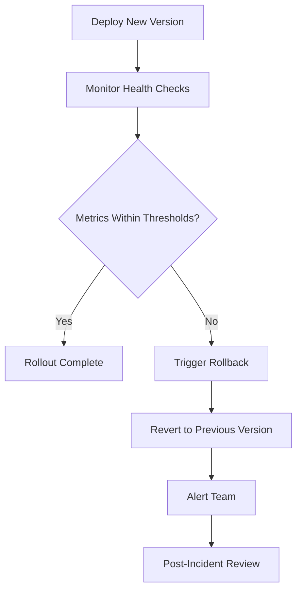
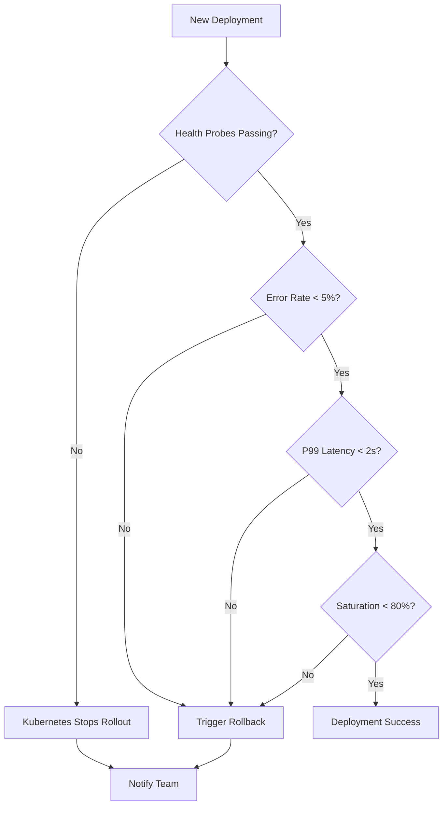

# How to Create Automatic Rollback Triggers

Author: [nawazdhandala](https://github.com/nawazdhandala)

Tags: DevOps, Rollback, Automation, Monitoring

Description: Learn to create automatic rollback triggers based on metrics and health checks.

---

Deploying new code is the easy part. Knowing when to roll it back before users notice the damage is what separates mature operations from firefighting. Automatic rollback triggers watch your metrics and health endpoints, then revert deployments the moment something goes wrong.

This guide walks through building rollback triggers using health checks, Prometheus metrics, and CI/CD pipelines.

## How Automatic Rollbacks Work

The basic flow is simple: deploy, monitor key signals, and revert if thresholds are breached. The challenge is choosing the right signals and thresholds.



The diagram shows the decision loop. Your monitoring system continuously evaluates metrics. If any signal crosses a threshold, the rollback executes automatically.

## Setting Up Health Check Based Triggers

Health endpoints are your first line of defense. Kubernetes can trigger rollbacks based on probe failures, but you need to configure the Deployment correctly.

The following Deployment manifest configures aggressive health checks that fail fast when something is wrong. The `progressDeadlineSeconds` setting tells Kubernetes to mark the rollout as failed if pods do not become healthy within the specified time.

```yaml
# deployment.yaml
apiVersion: apps/v1
kind: Deployment
metadata:
  name: api-service
  namespace: production
spec:
  replicas: 5
  # Mark rollout as failed if not complete within 3 minutes
  progressDeadlineSeconds: 180
  strategy:
    type: RollingUpdate
    rollingUpdate:
      maxSurge: 2        # Allow 2 extra pods during rollout
      maxUnavailable: 0  # Never remove a healthy pod until replacement is ready
  selector:
    matchLabels:
      app: api-service
  template:
    metadata:
      labels:
        app: api-service
    spec:
      containers:
        - name: api
          image: registry.example.com/api:v2.1.0
          ports:
            - containerPort: 8080
          # Readiness probe gates traffic to the pod
          readinessProbe:
            httpGet:
              path: /health/ready
              port: 8080
            initialDelaySeconds: 5
            periodSeconds: 5
            failureThreshold: 3      # Remove from service after 3 failures
            successThreshold: 1
          # Liveness probe triggers container restart
          livenessProbe:
            httpGet:
              path: /health/live
              port: 8080
            initialDelaySeconds: 15
            periodSeconds: 10
            failureThreshold: 3
```

When health probes fail, Kubernetes stops the rollout. Combine this with a rollback script in your CI/CD pipeline.

## Metric Based Rollback Triggers

Health checks only tell you if the process is alive. Metrics tell you if the service is performing well. You want to trigger rollbacks when error rates spike or latency degrades.

### Prometheus Alert Rules

This PrometheusRule fires when error rates or latency cross thresholds. The `for: 2m` clause prevents brief spikes from triggering false rollbacks.

```yaml
# rollback-alerts.yaml
apiVersion: monitoring.coreos.com/v1
kind: PrometheusRule
metadata:
  name: rollback-triggers
  namespace: monitoring
spec:
  groups:
    - name: deployment.rollback
      rules:
        # Trigger rollback when error rate exceeds 5%
        - alert: HighErrorRate
          expr: |
            (
              sum(rate(http_requests_total{status=~"5..", app="api-service"}[2m]))
              /
              sum(rate(http_requests_total{app="api-service"}[2m]))
            ) > 0.05
          for: 2m
          labels:
            severity: critical
            action: rollback
          annotations:
            summary: "Error rate above 5% for api-service"
            runbook: "https://wiki.example.com/runbooks/auto-rollback"

        # Trigger rollback when P99 latency exceeds 2 seconds
        - alert: HighLatency
          expr: |
            histogram_quantile(0.99,
              sum(rate(http_request_duration_seconds_bucket{app="api-service"}[2m])) by (le)
            ) > 2
          for: 2m
          labels:
            severity: critical
            action: rollback
          annotations:
            summary: "P99 latency above 2s for api-service"
```

### Alertmanager Webhook

Alertmanager routes alerts with `action: rollback` to a webhook that executes the rollback. This configuration shows how to route critical alerts to the rollback automation endpoint.

```yaml
# alertmanager-config.yaml
apiVersion: v1
kind: Secret
metadata:
  name: alertmanager-config
  namespace: monitoring
stringData:
  alertmanager.yaml: |
    global:
      resolve_timeout: 5m

    route:
      group_by: ['alertname', 'app']
      group_wait: 30s
      group_interval: 5m
      repeat_interval: 4h
      receiver: 'default'
      routes:
        # Route rollback alerts to automation webhook
        - match:
            action: rollback
          receiver: 'rollback-automation'
          continue: true

    receivers:
      - name: 'default'
        slack_configs:
          - api_url: 'https://hooks.slack.com/services/xxx'
            channel: '#alerts'

      - name: 'rollback-automation'
        webhook_configs:
          - url: 'http://rollback-controller.ops:8080/trigger'
            send_resolved: false
```

## Building a Rollback Controller

The rollback controller receives webhook alerts and executes `kubectl rollout undo`. This Python service shows the core logic for handling rollback triggers safely.

```python
# rollback_controller.py
from flask import Flask, request, jsonify
import subprocess
import logging
from datetime import datetime, timedelta

app = Flask(__name__)
logging.basicConfig(level=logging.INFO)

# Track recent rollbacks to prevent loops
rollback_history = {}

def can_rollback(app_name: str, cooldown_minutes: int = 30) -> bool:
    """Prevent rollback loops by enforcing a cooldown period."""
    last_rollback = rollback_history.get(app_name)
    if last_rollback is None:
        return True
    return datetime.now() - last_rollback > timedelta(minutes=cooldown_minutes)

def execute_rollback(app_name: str, namespace: str) -> dict:
    """Execute kubectl rollout undo and return the result."""
    if not can_rollback(app_name):
        return {"status": "skipped", "reason": "cooldown period active"}

    cmd = [
        "kubectl", "rollout", "undo",
        f"deployment/{app_name}",
        "-n", namespace
    ]

    try:
        result = subprocess.run(cmd, capture_output=True, text=True, timeout=60)
        rollback_history[app_name] = datetime.now()

        if result.returncode == 0:
            logging.info(f"Rollback successful for {app_name}")
            return {"status": "success", "output": result.stdout}
        else:
            logging.error(f"Rollback failed: {result.stderr}")
            return {"status": "failed", "error": result.stderr}
    except subprocess.TimeoutExpired:
        return {"status": "failed", "error": "command timeout"}

@app.route('/trigger', methods=['POST'])
def handle_alert():
    """Handle incoming Alertmanager webhook."""
    data = request.json
    alerts = data.get('alerts', [])

    results = []
    for alert in alerts:
        if alert.get('status') != 'firing':
            continue

        labels = alert.get('labels', {})
        app_name = labels.get('app')
        namespace = labels.get('namespace', 'production')

        if not app_name:
            continue

        result = execute_rollback(app_name, namespace)
        results.append({"app": app_name, "result": result})

    return jsonify({"processed": len(results), "results": results})

if __name__ == '__main__':
    app.run(host='0.0.0.0', port=8080)
```

The cooldown mechanism prevents rollback loops where a bad deployment keeps triggering rollbacks. After a rollback, the controller waits 30 minutes before allowing another rollback for the same application.

## CI/CD Pipeline Integration

You can also build rollback logic directly into your deployment pipeline. This approach gives you more control over the verification steps before declaring victory or reverting.

The following GitHub Actions workflow deploys, waits for metrics to stabilize, and rolls back if thresholds are breached.

```yaml
# .github/workflows/deploy.yaml
name: Deploy with Auto-Rollback

on:
  push:
    branches: [main]

jobs:
  deploy:
    runs-on: ubuntu-latest
    steps:
      - uses: actions/checkout@v4

      - name: Deploy to Kubernetes
        run: |
          kubectl apply -f manifests/
          kubectl rollout status deployment/api-service -n production --timeout=5m

      - name: Wait for metrics stabilization
        run: sleep 120  # Allow 2 minutes for metrics to populate

      - name: Check error rate
        id: metrics
        run: |
          # Query Prometheus for error rate over the last 2 minutes
          ERROR_RATE=$(curl -s "http://prometheus:9090/api/v1/query" \
            --data-urlencode 'query=sum(rate(http_requests_total{status=~"5..",app="api-service"}[2m]))/sum(rate(http_requests_total{app="api-service"}[2m]))' \
            | jq -r '.data.result[0].value[1] // "0"')

          echo "error_rate=$ERROR_RATE" >> $GITHUB_OUTPUT

          # Fail if error rate exceeds 5%
          if (( $(echo "$ERROR_RATE > 0.05" | bc -l) )); then
            echo "Error rate $ERROR_RATE exceeds threshold"
            exit 1
          fi

      - name: Rollback on failure
        if: failure()
        run: |
          echo "Deployment failed, initiating rollback"
          kubectl rollout undo deployment/api-service -n production
          kubectl rollout status deployment/api-service -n production --timeout=3m
```

## Decision Flow for Rollback Triggers

When configuring rollback triggers, you need to decide which signals matter most for your application. This decision tree helps you choose the right approach.



Start with basic health probes, then add error rate monitoring, then latency. Avoid adding too many signals initially since each one increases the chance of false positives.

## Choosing Thresholds

Threshold selection requires balancing sensitivity against false positives. Here are guidelines based on common patterns:

| Signal | Conservative | Aggressive | Use Case |
|--------|-------------|------------|----------|
| Error Rate | 10% for 5m | 1% for 1m | Payment services need aggressive |
| P99 Latency | 5s for 5m | 500ms for 2m | Real-time APIs need aggressive |
| Saturation | 90% for 10m | 70% for 5m | Depends on headroom |

Start with conservative thresholds and tighten them as you gain confidence in your metrics. Review rollback history monthly and adjust thresholds based on false positive rates.

## Testing Your Rollback Triggers

Before relying on automatic rollbacks in production, test them in staging:

1. Deploy a version that intentionally returns 500 errors
2. Verify the alert fires within expected time
3. Confirm the rollback executes
4. Check that the previous version is restored
5. Validate the cooldown prevents repeated rollbacks

This script deploys a broken version and verifies the rollback mechanism works end-to-end.

```bash
#!/bin/bash
# test-rollback.sh

# Deploy intentionally broken version
kubectl set image deployment/api-service api=registry.example.com/api:broken -n staging

# Wait for alert to fire and rollback to complete
echo "Waiting for automatic rollback..."
sleep 300

# Verify we're back on the previous version
CURRENT_IMAGE=$(kubectl get deployment/api-service -n staging -o jsonpath='{.spec.template.spec.containers[0].image}')
echo "Current image after rollback: $CURRENT_IMAGE"

# Check rollback history
kubectl rollout history deployment/api-service -n staging
```

## Summary

Automatic rollback triggers combine health probes, metric alerts, and automation to catch bad deployments before they cause widespread damage. Start with Kubernetes health probes and `progressDeadlineSeconds` for basic protection. Add Prometheus alerts for error rates and latency as you mature. Build rollback automation that includes cooldown logic to prevent loops.

The goal is not to eliminate human judgment but to buy time. Automatic rollbacks give your team breathing room to investigate while keeping users on a working version.

