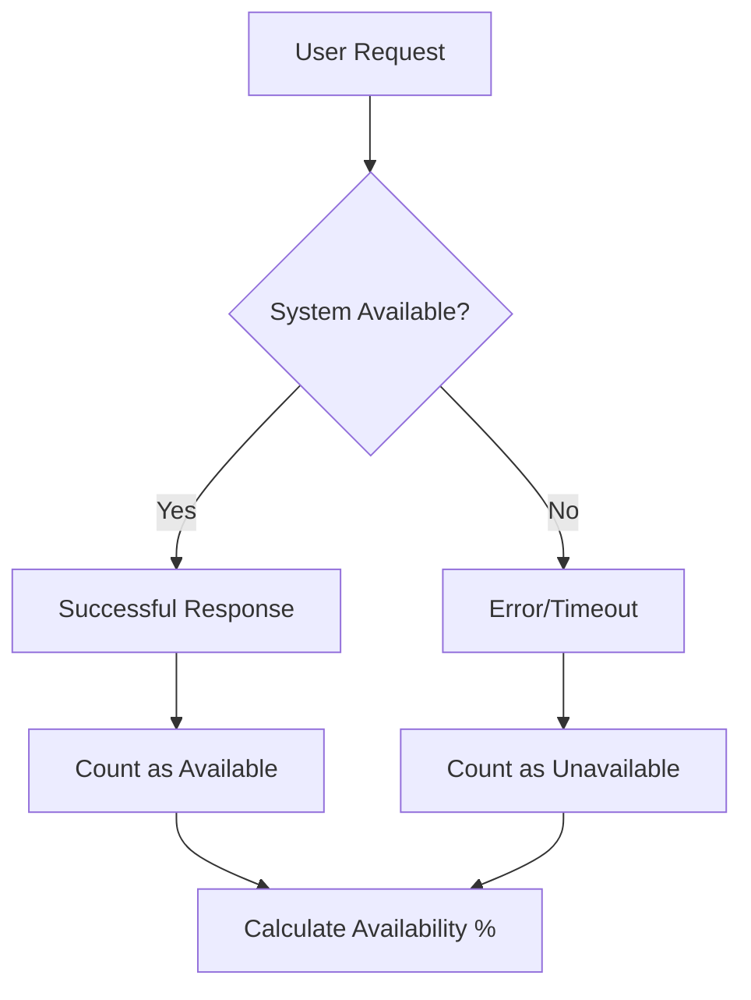
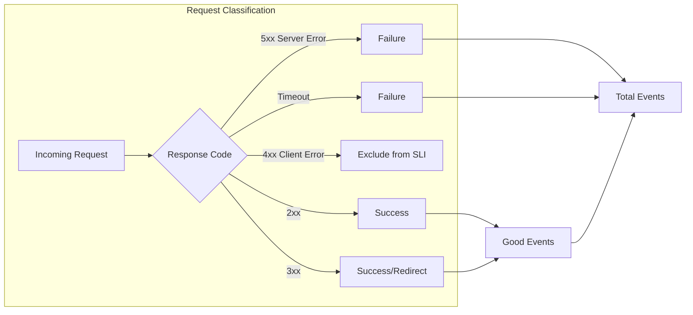
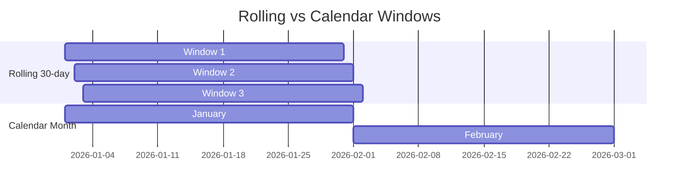
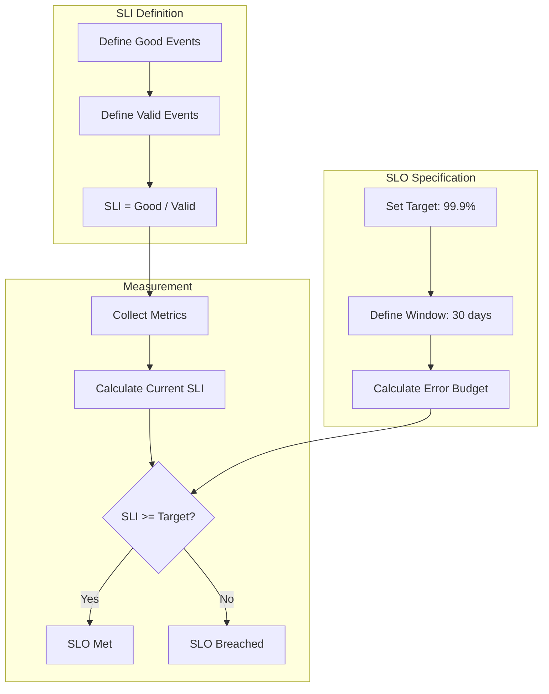
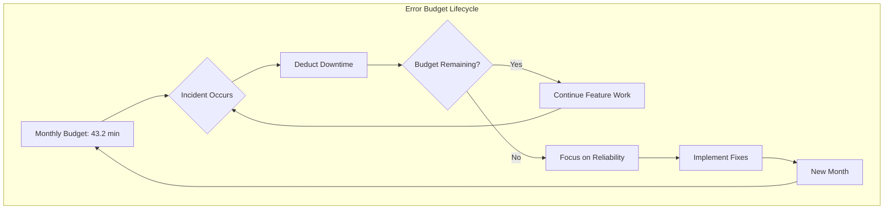
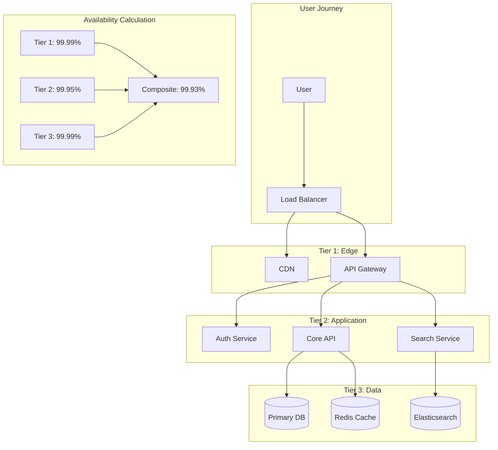

# How to Build Availability Metrics

Author: [nawazdhandala](https://github.com/nawazdhandala)

Tags: SRE, Metrics, Observability, Monitoring

Description: Learn how to design and implement availability metrics for measuring system uptime and SLO compliance.

---

Availability metrics are the foundation of Site Reliability Engineering. They tell you whether your system is working from your users' perspective and help you make data-driven decisions about reliability investments. In this guide, we will explore how to design and implement robust availability metrics that accurately capture system health and drive meaningful SLO compliance.

## Understanding Availability

Before diving into implementation, let us establish what availability means in modern distributed systems. Availability is typically expressed as a percentage representing the proportion of time (or requests) that a system is operational and serving users successfully.



## Uptime Calculation Methods

### Time-Based Availability

The traditional approach measures availability as the percentage of time a system is operational:

```
Availability = (Total Time - Downtime) / Total Time * 100
```

Here is a practical implementation in Python:

```python
from datetime import datetime, timedelta
from typing import List, Tuple

class UptimeCalculator:
    """Calculate time-based availability from incident records."""

    def __init__(self):
        self.incidents: List[Tuple[datetime, datetime]] = []

    def add_incident(self, start: datetime, end: datetime):
        """Record a downtime incident with start and end times."""
        self.incidents.append((start, end))

    def calculate_availability(
        self,
        period_start: datetime,
        period_end: datetime
    ) -> float:
        """
        Calculate availability percentage for a given time period.

        Args:
            period_start: Beginning of measurement window
            period_end: End of measurement window

        Returns:
            Availability as a percentage (0-100)
        """
        total_seconds = (period_end - period_start).total_seconds()
        downtime_seconds = 0.0

        for incident_start, incident_end in self.incidents:
            # Calculate overlap between incident and measurement period
            overlap_start = max(incident_start, period_start)
            overlap_end = min(incident_end, period_end)

            if overlap_start < overlap_end:
                downtime_seconds += (overlap_end - overlap_start).total_seconds()

        uptime_seconds = total_seconds - downtime_seconds
        return (uptime_seconds / total_seconds) * 100


# Example usage
calculator = UptimeCalculator()

# Record a 30-minute outage
calculator.add_incident(
    datetime(2026, 1, 15, 14, 0),
    datetime(2026, 1, 15, 14, 30)
)

# Calculate monthly availability
availability = calculator.calculate_availability(
    datetime(2026, 1, 1),
    datetime(2026, 2, 1)
)

print(f"Monthly availability: {availability:.4f}%")
# Output: Monthly availability: 99.9331%
```

### Probe-Based Availability

For systems without continuous traffic, synthetic monitoring provides availability data through periodic health checks:

```python
import asyncio
import aiohttp
from dataclasses import dataclass
from datetime import datetime
from typing import Optional
from collections import deque

@dataclass
class ProbeResult:
    timestamp: datetime
    success: bool
    latency_ms: Optional[float]
    status_code: Optional[int]
    error: Optional[str]

class AvailabilityProbe:
    """Synthetic monitoring probe for availability measurement."""

    def __init__(
        self,
        endpoint: str,
        timeout_seconds: float = 5.0,
        success_codes: set = None
    ):
        self.endpoint = endpoint
        self.timeout = aiohttp.ClientTimeout(total=timeout_seconds)
        self.success_codes = success_codes or {200, 201, 204}
        self.results: deque = deque(maxlen=10000)

    async def probe(self) -> ProbeResult:
        """Execute a single availability probe."""
        start_time = datetime.utcnow()

        try:
            async with aiohttp.ClientSession(timeout=self.timeout) as session:
                probe_start = asyncio.get_event_loop().time()
                async with session.get(self.endpoint) as response:
                    latency = (asyncio.get_event_loop().time() - probe_start) * 1000

                    result = ProbeResult(
                        timestamp=start_time,
                        success=response.status in self.success_codes,
                        latency_ms=latency,
                        status_code=response.status,
                        error=None
                    )
        except asyncio.TimeoutError:
            result = ProbeResult(
                timestamp=start_time,
                success=False,
                latency_ms=None,
                status_code=None,
                error="Timeout"
            )
        except Exception as e:
            result = ProbeResult(
                timestamp=start_time,
                success=False,
                latency_ms=None,
                status_code=None,
                error=str(e)
            )

        self.results.append(result)
        return result

    def calculate_availability(self, window_minutes: int = 60) -> float:
        """Calculate availability over a rolling window."""
        cutoff = datetime.utcnow() - timedelta(minutes=window_minutes)

        relevant_probes = [r for r in self.results if r.timestamp >= cutoff]

        if not relevant_probes:
            return 100.0  # No data, assume available

        successful = sum(1 for r in relevant_probes if r.success)
        return (successful / len(relevant_probes)) * 100
```

## Request Success Rate Metrics

For high-traffic services, request-based availability provides more accurate measurements than time-based approaches. This method counts the ratio of successful requests to total requests.



### Implementing Request-Based SLIs

```python
from prometheus_client import Counter, Histogram, Gauge
from functools import wraps
import time

# Define Prometheus metrics
REQUEST_TOTAL = Counter(
    'http_requests_total',
    'Total HTTP requests',
    ['method', 'endpoint', 'status_class']
)

REQUEST_LATENCY = Histogram(
    'http_request_duration_seconds',
    'HTTP request latency',
    ['method', 'endpoint'],
    buckets=[0.01, 0.025, 0.05, 0.1, 0.25, 0.5, 1.0, 2.5, 5.0, 10.0]
)

AVAILABILITY_GAUGE = Gauge(
    'service_availability_ratio',
    'Current availability ratio',
    ['window']
)


def classify_status(status_code: int) -> str:
    """Classify HTTP status code for availability calculation."""
    if 200 <= status_code < 300:
        return 'success'
    elif 300 <= status_code < 400:
        return 'redirect'
    elif 400 <= status_code < 500:
        return 'client_error'
    else:
        return 'server_error'


def track_availability(endpoint: str):
    """Decorator to track request availability metrics."""
    def decorator(func):
        @wraps(func)
        async def wrapper(*args, **kwargs):
            method = kwargs.get('method', 'GET')
            start_time = time.time()

            try:
                response = await func(*args, **kwargs)
                status_class = classify_status(response.status_code)

                REQUEST_TOTAL.labels(
                    method=method,
                    endpoint=endpoint,
                    status_class=status_class
                ).inc()

                return response

            except Exception as e:
                REQUEST_TOTAL.labels(
                    method=method,
                    endpoint=endpoint,
                    status_class='server_error'
                ).inc()
                raise

            finally:
                duration = time.time() - start_time
                REQUEST_LATENCY.labels(
                    method=method,
                    endpoint=endpoint
                ).observe(duration)

        return wrapper
    return decorator


# PromQL queries for availability calculation
AVAILABILITY_QUERIES = {
    # Request success rate (excluding client errors)
    'success_rate': '''
        sum(rate(http_requests_total{status_class="success"}[5m]))
        /
        sum(rate(http_requests_total{status_class!="client_error"}[5m]))
    ''',

    # Availability over 30-day window
    'monthly_availability': '''
        sum(increase(http_requests_total{status_class="success"}[30d]))
        /
        sum(increase(http_requests_total{status_class!="client_error"}[30d]))
    ''',
}
```

## Availability Windows

The measurement window significantly impacts how availability numbers are perceived and how actionable they are.

### Rolling Windows

Rolling windows provide a continuous view of availability, smoothing out short-term fluctuations:



```python
from datetime import datetime, timedelta
from typing import Generator, Tuple
from dataclasses import dataclass
from enum import Enum

class WindowType(Enum):
    ROLLING = "rolling"
    CALENDAR_DAY = "calendar_day"
    CALENDAR_WEEK = "calendar_week"
    CALENDAR_MONTH = "calendar_month"

@dataclass
class AvailabilityWindow:
    start: datetime
    end: datetime
    window_type: WindowType

    @property
    def duration_hours(self) -> float:
        return (self.end - self.start).total_seconds() / 3600


class WindowCalculator:
    """Generate availability measurement windows."""

    @staticmethod
    def rolling_window(
        duration_days: int,
        reference_time: datetime = None
    ) -> AvailabilityWindow:
        """Create a rolling window ending at reference time."""
        end = reference_time or datetime.utcnow()
        start = end - timedelta(days=duration_days)

        return AvailabilityWindow(
            start=start,
            end=end,
            window_type=WindowType.ROLLING
        )

    @staticmethod
    def calendar_month(
        year: int,
        month: int
    ) -> AvailabilityWindow:
        """Create a calendar month window."""
        start = datetime(year, month, 1)

        if month == 12:
            end = datetime(year + 1, 1, 1)
        else:
            end = datetime(year, month + 1, 1)

        return AvailabilityWindow(
            start=start,
            end=end,
            window_type=WindowType.CALENDAR_MONTH
        )

    @staticmethod
    def sliding_windows(
        period_start: datetime,
        period_end: datetime,
        window_size: timedelta,
        step: timedelta
    ) -> Generator[AvailabilityWindow, None, None]:
        """Generate overlapping sliding windows for trend analysis."""
        current_start = period_start

        while current_start + window_size <= period_end:
            yield AvailabilityWindow(
                start=current_start,
                end=current_start + window_size,
                window_type=WindowType.ROLLING
            )
            current_start += step


# Example: Compare rolling vs calendar availability
def compare_windows():
    calculator = WindowCalculator()

    # Rolling 30-day window
    rolling = calculator.rolling_window(duration_days=30)
    print(f"Rolling window: {rolling.start} to {rolling.end}")

    # Calendar month
    calendar = calculator.calendar_month(2026, 1)
    print(f"Calendar window: {calendar.start} to {calendar.end}")

    # Generate daily sliding windows for trend analysis
    windows = list(calculator.sliding_windows(
        period_start=datetime(2026, 1, 1),
        period_end=datetime(2026, 1, 31),
        window_size=timedelta(days=7),
        step=timedelta(days=1)
    ))
    print(f"Generated {len(windows)} sliding windows for trend analysis")
```

## SLI/SLO Based Availability

Service Level Indicators (SLIs) and Service Level Objectives (SLOs) provide a structured framework for defining and measuring availability.



### Implementing SLO Monitoring

```python
from dataclasses import dataclass, field
from datetime import datetime, timedelta
from typing import List, Optional, Callable
from enum import Enum
import json

class SLOStatus(Enum):
    HEALTHY = "healthy"
    AT_RISK = "at_risk"
    BREACHED = "breached"

@dataclass
class SLI:
    """Service Level Indicator definition."""
    name: str
    description: str
    good_events_query: str  # PromQL or similar
    valid_events_query: str
    unit: str = "ratio"

@dataclass
class SLO:
    """Service Level Objective definition."""
    name: str
    sli: SLI
    target: float  # e.g., 0.999 for 99.9%
    window_days: int
    alerting_threshold: float = 0.02  # Alert at 2% budget consumed

    @property
    def error_budget(self) -> float:
        """Calculate total error budget as a ratio."""
        return 1.0 - self.target

    def budget_minutes(self, window_days: int = None) -> float:
        """Convert error budget to minutes."""
        days = window_days or self.window_days
        total_minutes = days * 24 * 60
        return total_minutes * self.error_budget

@dataclass
class SLOReport:
    """Current state of an SLO."""
    slo: SLO
    current_sli: float
    window_start: datetime
    window_end: datetime
    good_events: int
    valid_events: int
    budget_remaining: float
    status: SLOStatus
    time_to_exhaustion: Optional[timedelta] = None

    def to_dict(self) -> dict:
        return {
            'slo_name': self.slo.name,
            'target': f"{self.slo.target * 100:.2f}%",
            'current': f"{self.current_sli * 100:.4f}%",
            'budget_remaining': f"{self.budget_remaining * 100:.2f}%",
            'status': self.status.value,
            'good_events': self.good_events,
            'valid_events': self.valid_events,
        }


class SLOCalculator:
    """Calculate and track SLO compliance."""

    def __init__(self, metrics_backend):
        self.metrics = metrics_backend

    def calculate_sli(
        self,
        sli: SLI,
        window: AvailabilityWindow
    ) -> Tuple[float, int, int]:
        """
        Calculate current SLI value.

        Returns:
            Tuple of (sli_ratio, good_events, valid_events)
        """
        good_events = self.metrics.query_sum(
            sli.good_events_query,
            window.start,
            window.end
        )

        valid_events = self.metrics.query_sum(
            sli.valid_events_query,
            window.start,
            window.end
        )

        if valid_events == 0:
            return 1.0, 0, 0  # No data, assume compliant

        sli_ratio = good_events / valid_events
        return sli_ratio, good_events, valid_events

    def evaluate_slo(self, slo: SLO) -> SLOReport:
        """Generate a complete SLO report."""
        window = WindowCalculator.rolling_window(slo.window_days)
        current_sli, good, valid = self.calculate_sli(slo.sli, window)

        # Calculate budget remaining
        if current_sli >= slo.target:
            # How much more can we lose?
            budget_remaining = (current_sli - slo.target) / slo.error_budget
        else:
            # Negative budget - we've exceeded our error budget
            budget_remaining = (current_sli - slo.target) / slo.error_budget

        # Clamp to reasonable range
        budget_remaining = max(-1.0, min(1.0, budget_remaining))

        # Determine status
        if budget_remaining > 0.5:
            status = SLOStatus.HEALTHY
        elif budget_remaining > 0:
            status = SLOStatus.AT_RISK
        else:
            status = SLOStatus.BREACHED

        return SLOReport(
            slo=slo,
            current_sli=current_sli,
            window_start=window.start,
            window_end=window.end,
            good_events=good,
            valid_events=valid,
            budget_remaining=budget_remaining,
            status=status
        )


# Example SLO definitions
API_AVAILABILITY_SLI = SLI(
    name="api_availability",
    description="Proportion of successful API requests",
    good_events_query='sum(http_requests_total{status_class="success"})',
    valid_events_query='sum(http_requests_total{status_class!="client_error"})'
)

API_AVAILABILITY_SLO = SLO(
    name="API Availability",
    sli=API_AVAILABILITY_SLI,
    target=0.999,  # 99.9%
    window_days=30
)
```

## Error Budget Tracking

Error budgets translate SLOs into actionable burn rates that help teams balance feature development with reliability work.



### Error Budget Implementation

```python
from dataclasses import dataclass
from datetime import datetime, timedelta
from typing import List, Optional
import math

@dataclass
class BurnEvent:
    """Represents an error budget burn event."""
    timestamp: datetime
    duration_minutes: float
    description: str
    incident_id: Optional[str] = None

@dataclass
class BurnRate:
    """Current error budget burn rate."""
    rate: float  # Multiplier (1.0 = normal, 2.0 = 2x burn)
    window_hours: int
    projected_exhaustion: Optional[datetime]

class ErrorBudgetTracker:
    """Track and manage error budget consumption."""

    def __init__(self, slo: SLO):
        self.slo = slo
        self.burn_events: List[BurnEvent] = []

    @property
    def total_budget_minutes(self) -> float:
        """Total error budget in minutes for the SLO window."""
        return self.slo.budget_minutes()

    def record_burn(
        self,
        duration_minutes: float,
        description: str,
        incident_id: str = None
    ):
        """Record an error budget burn event."""
        self.burn_events.append(BurnEvent(
            timestamp=datetime.utcnow(),
            duration_minutes=duration_minutes,
            description=description,
            incident_id=incident_id
        ))

    def consumed_budget(self, window: AvailabilityWindow) -> float:
        """Calculate consumed budget in the given window."""
        consumed = 0.0

        for event in self.burn_events:
            if window.start <= event.timestamp <= window.end:
                consumed += event.duration_minutes

        return consumed

    def remaining_budget(self) -> float:
        """Calculate remaining error budget in minutes."""
        window = WindowCalculator.rolling_window(self.slo.window_days)
        consumed = self.consumed_budget(window)
        return max(0, self.total_budget_minutes - consumed)

    def remaining_budget_percentage(self) -> float:
        """Calculate remaining budget as percentage."""
        return (self.remaining_budget() / self.total_budget_minutes) * 100

    def calculate_burn_rate(self, window_hours: int = 1) -> BurnRate:
        """
        Calculate current burn rate.

        A burn rate of 1.0 means burning at exactly the sustainable rate.
        A burn rate of 2.0 means burning at 2x the sustainable rate.
        """
        window_end = datetime.utcnow()
        window_start = window_end - timedelta(hours=window_hours)

        window = AvailabilityWindow(
            start=window_start,
            end=window_end,
            window_type=WindowType.ROLLING
        )

        consumed_in_window = self.consumed_budget(window)

        # Sustainable burn rate: total budget / window duration
        sustainable_rate = self.total_budget_minutes / (self.slo.window_days * 24 * 60)

        # Current burn rate per minute
        current_rate = consumed_in_window / (window_hours * 60) if window_hours > 0 else 0

        # Burn rate multiplier
        rate_multiplier = current_rate / sustainable_rate if sustainable_rate > 0 else 0

        # Project exhaustion time
        remaining = self.remaining_budget()
        if current_rate > 0:
            minutes_to_exhaustion = remaining / current_rate
            projected_exhaustion = datetime.utcnow() + timedelta(minutes=minutes_to_exhaustion)
        else:
            projected_exhaustion = None

        return BurnRate(
            rate=rate_multiplier,
            window_hours=window_hours,
            projected_exhaustion=projected_exhaustion
        )

    def should_alert(self) -> Tuple[bool, str]:
        """Determine if alerting is needed based on burn rate."""
        # Multi-window burn rate alerting (Google SRE approach)

        # Fast burn: 14.4x over 1 hour AND 6x over 6 hours
        fast_1h = self.calculate_burn_rate(window_hours=1)
        fast_6h = self.calculate_burn_rate(window_hours=6)

        if fast_1h.rate >= 14.4 and fast_6h.rate >= 6:
            return True, f"Critical: Fast burn detected ({fast_1h.rate:.1f}x in 1h)"

        # Slow burn: 3x over 6 hours AND 1x over 3 days
        slow_6h = self.calculate_burn_rate(window_hours=6)
        slow_3d = self.calculate_burn_rate(window_hours=72)

        if slow_6h.rate >= 3 and slow_3d.rate >= 1:
            return True, f"Warning: Slow burn detected ({slow_6h.rate:.1f}x in 6h)"

        return False, "Normal burn rate"


# Example usage
tracker = ErrorBudgetTracker(API_AVAILABILITY_SLO)

# Simulate some incidents
tracker.record_burn(
    duration_minutes=15,
    description="Database failover caused 15 minutes of errors",
    incident_id="INC-001"
)

tracker.record_burn(
    duration_minutes=5,
    description="Deployment rollback after failed health checks",
    incident_id="INC-002"
)

print(f"Total budget: {tracker.total_budget_minutes:.1f} minutes")
print(f"Remaining: {tracker.remaining_budget():.1f} minutes")
print(f"Remaining: {tracker.remaining_budget_percentage():.1f}%")

burn_rate = tracker.calculate_burn_rate(window_hours=24)
print(f"24h burn rate: {burn_rate.rate:.2f}x")
```

## Multi-Tier Availability

Complex systems often require measuring availability at multiple levels, from individual components to end-to-end user journeys.



### Composite Availability Calculator

```python
from dataclasses import dataclass
from typing import List, Dict, Optional
from enum import Enum
import math

class DependencyType(Enum):
    SERIAL = "serial"      # All must be available (multiply)
    PARALLEL = "parallel"  # Any one must be available (1 - product of failures)
    WEIGHTED = "weighted"  # Weighted average based on traffic

@dataclass
class ServiceTier:
    """Represents a service tier with its availability."""
    name: str
    availability: float  # 0.0 to 1.0
    weight: float = 1.0  # For weighted calculations
    is_critical: bool = True

@dataclass
class DependencyGroup:
    """A group of services with a specific dependency relationship."""
    name: str
    services: List[ServiceTier]
    dependency_type: DependencyType

class CompositeAvailabilityCalculator:
    """Calculate composite availability for multi-tier architectures."""

    @staticmethod
    def serial_availability(services: List[ServiceTier]) -> float:
        """
        Calculate availability when all services must be available.
        Result = Product of all availabilities.
        """
        result = 1.0
        for service in services:
            result *= service.availability
        return result

    @staticmethod
    def parallel_availability(services: List[ServiceTier]) -> float:
        """
        Calculate availability when any service can serve the request.
        Result = 1 - Product of all failure rates.
        """
        failure_product = 1.0
        for service in services:
            failure_product *= (1 - service.availability)
        return 1 - failure_product

    @staticmethod
    def weighted_availability(services: List[ServiceTier]) -> float:
        """
        Calculate weighted average availability.
        Useful when different services handle different traffic proportions.
        """
        total_weight = sum(s.weight for s in services)
        if total_weight == 0:
            return 0.0

        weighted_sum = sum(s.availability * s.weight for s in services)
        return weighted_sum / total_weight

    def calculate_group_availability(self, group: DependencyGroup) -> float:
        """Calculate availability for a dependency group."""
        if group.dependency_type == DependencyType.SERIAL:
            return self.serial_availability(group.services)
        elif group.dependency_type == DependencyType.PARALLEL:
            return self.parallel_availability(group.services)
        else:
            return self.weighted_availability(group.services)

    def calculate_system_availability(
        self,
        groups: List[DependencyGroup]
    ) -> Dict[str, float]:
        """
        Calculate availability for entire system.

        Returns breakdown by group and overall system availability.
        """
        results = {}
        overall = 1.0

        for group in groups:
            group_availability = self.calculate_group_availability(group)
            results[group.name] = group_availability
            overall *= group_availability  # Assume groups are serial

        results['overall'] = overall
        return results

    def analyze_impact(
        self,
        groups: List[DependencyGroup],
        service_name: str,
        new_availability: float
    ) -> Dict[str, float]:
        """
        Analyze the impact of changing a single service's availability.

        Useful for capacity planning and investment decisions.
        """
        # Calculate baseline
        baseline = self.calculate_system_availability(groups)

        # Find and modify the service
        modified_groups = []
        for group in groups:
            modified_services = []
            for service in group.services:
                if service.name == service_name:
                    modified_services.append(ServiceTier(
                        name=service.name,
                        availability=new_availability,
                        weight=service.weight,
                        is_critical=service.is_critical
                    ))
                else:
                    modified_services.append(service)

            modified_groups.append(DependencyGroup(
                name=group.name,
                services=modified_services,
                dependency_type=group.dependency_type
            ))

        # Calculate new availability
        new_result = self.calculate_system_availability(modified_groups)

        return {
            'baseline': baseline['overall'],
            'new': new_result['overall'],
            'improvement': new_result['overall'] - baseline['overall'],
            'improvement_percent': (
                (new_result['overall'] - baseline['overall'])
                / (1 - baseline['overall']) * 100
                if baseline['overall'] < 1 else 0
            )
        }


# Example: E-commerce platform availability calculation
calculator = CompositeAvailabilityCalculator()

# Define service tiers
edge_tier = DependencyGroup(
    name="Edge Services",
    services=[
        ServiceTier(name="CDN", availability=0.9999),
        ServiceTier(name="Load Balancer", availability=0.9999),
    ],
    dependency_type=DependencyType.SERIAL
)

app_tier = DependencyGroup(
    name="Application Services",
    services=[
        ServiceTier(name="API Server 1", availability=0.999),
        ServiceTier(name="API Server 2", availability=0.999),
        ServiceTier(name="API Server 3", availability=0.999),
    ],
    dependency_type=DependencyType.PARALLEL  # Any can serve
)

data_tier = DependencyGroup(
    name="Data Services",
    services=[
        ServiceTier(name="Primary DB", availability=0.9995),
        ServiceTier(name="Cache", availability=0.999),
    ],
    dependency_type=DependencyType.SERIAL
)

# Calculate system availability
results = calculator.calculate_system_availability([edge_tier, app_tier, data_tier])

print("Availability Breakdown:")
for name, availability in results.items():
    nines = -math.log10(1 - availability) if availability < 1 else float('inf')
    print(f"  {name}: {availability*100:.4f}% ({nines:.2f} nines)")

# Analyze impact of improving database availability
impact = calculator.analyze_impact(
    [edge_tier, app_tier, data_tier],
    service_name="Primary DB",
    new_availability=0.9999
)

print(f"\nImpact of improving Primary DB to 99.99%:")
print(f"  Baseline: {impact['baseline']*100:.4f}%")
print(f"  New: {impact['new']*100:.4f}%")
print(f"  Improvement: {impact['improvement']*100:.4f}%")
```

## Putting It All Together

Here is a complete example that combines all the concepts into a production-ready availability monitoring system:

```python
from dataclasses import dataclass
from datetime import datetime, timedelta
from typing import Dict, List
import json

@dataclass
class AvailabilityDashboard:
    """Comprehensive availability monitoring dashboard."""

    def __init__(self, slos: List[SLO]):
        self.slos = {slo.name: slo for slo in slos}
        self.calculators: Dict[str, SLOCalculator] = {}
        self.budget_trackers: Dict[str, ErrorBudgetTracker] = {}

        for slo in slos:
            self.budget_trackers[slo.name] = ErrorBudgetTracker(slo)

    def generate_report(self) -> Dict:
        """Generate comprehensive availability report."""
        report = {
            'generated_at': datetime.utcnow().isoformat(),
            'slos': [],
            'alerts': [],
            'recommendations': []
        }

        for name, slo in self.slos.items():
            tracker = self.budget_trackers[name]

            slo_report = {
                'name': name,
                'target': f"{slo.target * 100:.2f}%",
                'budget_total_minutes': tracker.total_budget_minutes,
                'budget_remaining_minutes': tracker.remaining_budget(),
                'budget_remaining_percent': tracker.remaining_budget_percentage(),
            }

            # Check for alerts
            should_alert, alert_message = tracker.should_alert()
            if should_alert:
                report['alerts'].append({
                    'slo': name,
                    'message': alert_message,
                    'severity': 'critical' if 'Critical' in alert_message else 'warning'
                })

            # Generate recommendations
            if tracker.remaining_budget_percentage() < 20:
                report['recommendations'].append({
                    'slo': name,
                    'recommendation': 'Consider freezing non-critical deployments',
                    'reason': f'Only {tracker.remaining_budget_percentage():.1f}% budget remaining'
                })

            report['slos'].append(slo_report)

        return report


# Create dashboard with multiple SLOs
dashboard = AvailabilityDashboard([
    SLO(
        name="API Availability",
        sli=SLI(
            name="api_success_rate",
            description="API request success rate",
            good_events_query='sum(http_requests_total{status="2xx"})',
            valid_events_query='sum(http_requests_total)'
        ),
        target=0.999,
        window_days=30
    ),
    SLO(
        name="Checkout Flow",
        sli=SLI(
            name="checkout_success_rate",
            description="End-to-end checkout success rate",
            good_events_query='sum(checkout_completed_total)',
            valid_events_query='sum(checkout_started_total)'
        ),
        target=0.995,
        window_days=30
    )
])

# Generate and print report
report = dashboard.generate_report()
print(json.dumps(report, indent=2, default=str))
```

## Key Takeaways

Building effective availability metrics requires careful consideration of several factors:

1. **Choose the right measurement method**: Time-based availability works for infrastructure, while request-based availability is better for services with high traffic.

2. **Select appropriate windows**: Rolling windows provide continuous visibility, while calendar windows align with business reporting.

3. **Define clear SLIs and SLOs**: Specificity in what constitutes a "good" event prevents ambiguity and gaming of metrics.

4. **Track error budgets actively**: Error budgets transform availability from a static number into an actionable resource that can be managed.

5. **Consider multi-tier dependencies**: System availability is the product of its components, so invest in the weakest links first.

6. **Implement multi-window alerting**: Different burn rates require different response urgencies and alert thresholds.

By implementing these patterns, you can build availability metrics that not only measure your system's reliability but also drive meaningful improvements in how your team balances feature development with reliability work.

## Further Reading

- Google SRE Book: Service Level Objectives
- The Art of SLOs Workshop
- Implementing Service Level Objectives by Alex Hidalgo
- OpenSLO Specification for standardized SLO definitions
