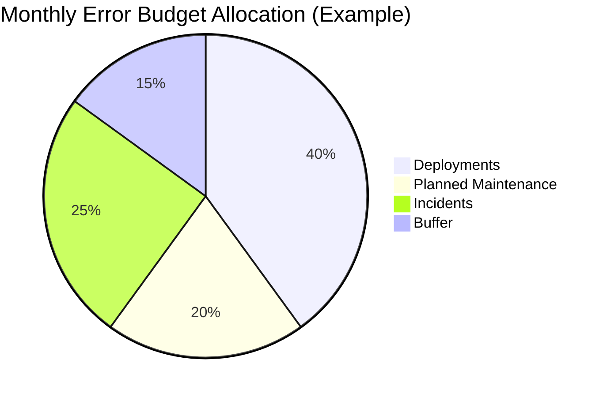
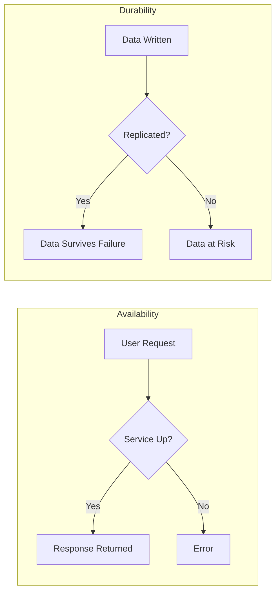
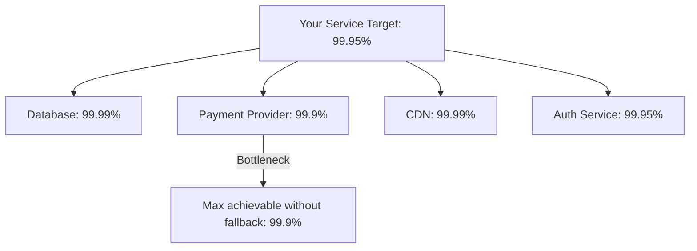
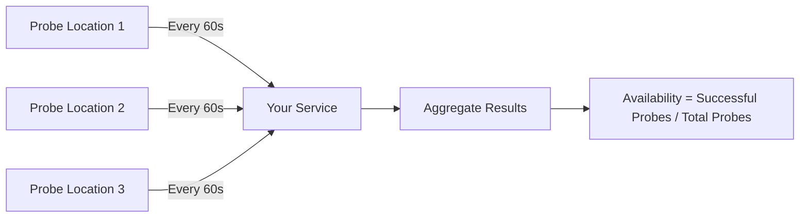
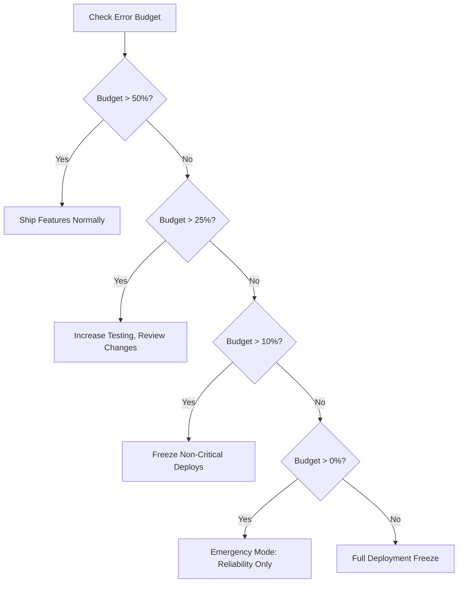

# How to Create Availability Targets

Author: [nawazdhandala](https://github.com/nawazdhandala)

Tags: SRE, Availability, SLO, Reliability

Description: A practical guide to defining, calculating, and managing availability targets that balance business needs with engineering reality.

---

Availability is the most visible promise you make to users. When your service is down, nothing else matters. But "we want high availability" is not a target. It is a wish. Real SRE work starts when you pick a specific number, understand its cost, and build systems and processes to hit it consistently.

This guide walks through how to create availability targets that actually work: from understanding the math behind nines to setting error budgets that give your team room to innovate.

---

## What Is Availability?

Availability measures the proportion of time a service is operational and serving users correctly. The standard formula is:

```
Availability = (Total Time - Downtime) / Total Time
```

Or expressed in terms of successful requests:

```
Availability = Successful Requests / Total Requests
```

Both definitions matter. Time-based availability tells you how long the service was up. Request-based availability tells you how often users got what they asked for. Most modern SRE teams use request-based metrics because they reflect actual user experience.

---

## The Nines Table

Availability targets are typically expressed in "nines." Each additional nine dramatically reduces allowable downtime:

| Availability | Nines | Downtime per Year | Downtime per Month | Downtime per Week |
|--------------|-------|-------------------|--------------------|--------------------|
| 99% | Two nines | 3.65 days | 7.3 hours | 1.68 hours |
| 99.9% | Three nines | 8.76 hours | 43.8 minutes | 10.1 minutes |
| 99.95% | Three and a half nines | 4.38 hours | 21.9 minutes | 5.04 minutes |
| 99.99% | Four nines | 52.6 minutes | 4.38 minutes | 1.01 minutes |
| 99.999% | Five nines | 5.26 minutes | 26.3 seconds | 6.05 seconds |

The jump from three nines to four nines is not 0.09 percentage points. It is a 10x reduction in allowable downtime. That requires fundamentally different architecture, operational practices, and investment.

---

## Calculating Your Error Budget

An error budget is the inverse of your availability target. If you promise 99.9% availability, your error budget is 0.1% of total requests or time.

```
Error Budget = 1 - Availability Target
```

For a service handling 1 million requests per day with a 99.9% target:

```
Daily Error Budget = 1,000,000 × 0.001 = 1,000 failed requests
Monthly Error Budget = 30,000,000 × 0.001 = 30,000 failed requests
```

This budget is not just for outages. It covers everything: planned maintenance, deployments that cause brief errors, infrastructure hiccups, and actual incidents. Spend it wisely.



---

## Availability vs Durability

These two concepts are often confused but measure different things:

| Concept | What It Measures | Example |
|---------|------------------|---------|
| **Availability** | Can you access the service right now? | API responds to requests |
| **Durability** | Will your data survive over time? | Stored files are not lost |

A storage service can be unavailable (you cannot access your files) but still durable (your files are safe and will be accessible when service returns). Conversely, a service can be available but not durable if it accepts writes that it later loses.



For databases and storage systems, you need targets for both. A database might target 99.95% availability and 99.999999999% (eleven nines) durability.

---

## Setting the Right Target

Choosing an availability target requires balancing multiple factors:

### 1. User Expectations

What do your users actually need? A consumer social app might tolerate brief outages. A payment processing system cannot. Interview users, review support tickets, and understand their workflows.

### 2. Business Impact

Calculate the cost of downtime. For an e-commerce site doing $10 million per month:

```
Hourly Revenue = $10,000,000 / 720 hours = $13,889/hour
Cost of 99.9% (43.8 min/month) = ~$10,000/month in lost sales
Cost of 99.99% (4.4 min/month) = ~$1,000/month in lost sales
```

But achieving 99.99% might cost $200,000/year more in infrastructure and engineering. Is the $108,000 annual savings worth the investment?

### 3. Technical Feasibility

Your service cannot be more available than its least reliable hard dependency. If your payment provider has 99.9% availability, your checkout flow cannot exceed that without fallback mechanisms.



### 4. Operational Capacity

Four nines requires:
- Automated deployment and rollback
- Multi-region or multi-zone architecture
- On-call rotations with fast response times
- Chaos engineering and game days

If your team deploys manually once a week, four nines is not realistic today.

---

## Building Your SLO

An availability SLO (Service Level Objective) has three parts:

1. **SLI (Service Level Indicator)**: The metric you measure
2. **Target**: The threshold you commit to
3. **Window**: The time period for measurement

Example SLO:

> 99.9% of HTTP requests to the /api/v1/* endpoints will return a successful response (status code 2xx or 4xx) within 500ms, measured over a rolling 30-day window.

Notice the specifics:
- Which endpoints (not all traffic)
- What counts as success (includes 4xx since those are client errors)
- Latency bound (slow successes are failures)
- Measurement window

---

## Measuring Availability

There are several approaches to measuring availability, each with trade-offs:

### Server-Side Metrics

Count successful vs failed requests at your load balancer or application:

```
Availability = (2xx + 4xx responses) / Total Responses
```

Pros: Easy to implement, complete coverage
Cons: Does not capture client-side failures, network issues

### Synthetic Monitoring

Run automated checks from external locations:



Pros: Catches network and DNS issues, user perspective
Cons: Sampling (misses issues between checks), limited to probe locations

### Real User Monitoring (RUM)

Instrument clients to report success/failure:

Pros: True user experience, catches client-specific issues
Cons: Sampling bias, requires client instrumentation, privacy considerations

Most teams use a combination: server-side metrics as the primary SLI, synthetic monitoring for external validation, and RUM for user experience insights.

---

## Error Budget Policies

An error budget policy defines what happens when you approach or exceed your budget:

| Budget Remaining | Action |
|------------------|--------|
| > 50% | Normal development velocity |
| 25-50% | Review recent changes, increase testing |
| 10-25% | Freeze non-critical deployments, focus on reliability |
| < 10% | Emergency mode: only reliability fixes ship |
| Exhausted | Full deployment freeze until budget recovers |

This policy turns availability from an abstract goal into concrete team behavior. When the budget is healthy, ship fast. When it is not, slow down and fix things.



---

## Multi-Tier Availability

Not all parts of your system need the same availability. Define tiers based on business impact:

| Tier | Example | Target | Investment |
|------|---------|--------|------------|
| Critical | Checkout, Login | 99.99% | Multi-region, auto-failover |
| High | Search, Product Pages | 99.9% | Multi-zone, manual failover |
| Standard | Recommendations, Analytics | 99.5% | Single zone, best effort |
| Low | Admin Tools, Internal Dashboards | 99% | Basic redundancy |

This tiering lets you focus expensive reliability investments where they matter most.

---

## Handling Planned Maintenance

Planned maintenance consumes error budget unless you exclude it. Common approaches:

1. **Count everything**: Maintenance is downtime. Be honest about total availability.
2. **Exclude with notice**: Maintenance announced 7+ days ahead does not count.
3. **Maintenance windows**: Define specific hours when SLO does not apply.

Whatever you choose, document it clearly and apply the rule consistently. Users care about total availability, not your internal accounting.

---

## Communicating Targets Externally

Your internal SLO should be stricter than your external SLA (Service Level Agreement):

```
Internal SLO: 99.95% (21.9 minutes downtime/month)
External SLA: 99.9% (43.8 minutes downtime/month)
```

This buffer protects you from SLA violations and associated penalties while still driving internal improvement.

When publishing a status page, report against your SLA threshold but use your SLO for internal alerting and decision-making.

---

## Review and Iteration

Availability targets are not permanent. Review them quarterly:

1. Did we meet the target? If consistently exceeding by large margins, consider tightening.
2. Was it the right target? Did users complain during allowed downtime windows?
3. What did we learn? Did incidents reveal gaps in our measurement?
4. What changed? New features, traffic patterns, or dependencies might require adjustment.

A target that is never missed might be too easy. A target that is always missed is demoralizing. Aim for targets that require effort but are achievable 90% of the time.

---

## Quick Start Checklist

1. Pick one critical user journey to start
2. Define success (what counts as a working request)
3. Choose a measurement method (server metrics, synthetic, or both)
4. Set an initial target based on current performance minus a small buffer
5. Calculate your error budget for the month
6. Write an error budget policy
7. Set up alerting for burn rate (budget consumption speed)
8. Review after 30 days and adjust

---

## Final Thoughts

Availability targets transform vague reliability goals into measurable commitments. They create shared understanding between engineering, product, and business teams about what "good enough" means and what trade-offs you are willing to make.

Start conservative. A target you can reliably hit builds trust and momentum. You can always tighten it later as your systems and practices mature.

The goal is not to maximize availability at any cost. The goal is to pick the right availability for your users, invest appropriately to achieve it, and use error budgets to balance reliability with the velocity your business needs.

---

**Related Reading:**

- [The Five Stages of SRE Maturity](https://oneuptime.com/blog/post/2025-09-01-the-five-stages-of-sre-maturity/view)
- [12 SRE Best Practices That Actually Move the Needle](https://oneuptime.com/blog/post/2025-11-28-sre-best-practices/view)
- [18 SRE Metrics Worth Tracking](https://oneuptime.com/blog/post/2025-11-28-sre-metrics-to-track/view)
