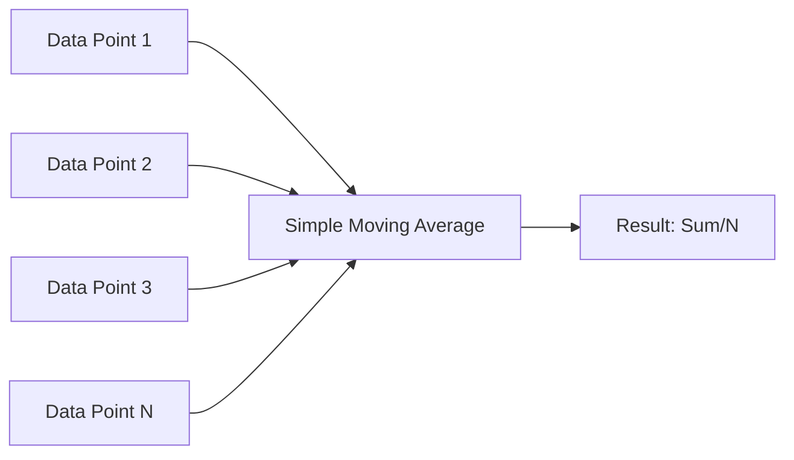
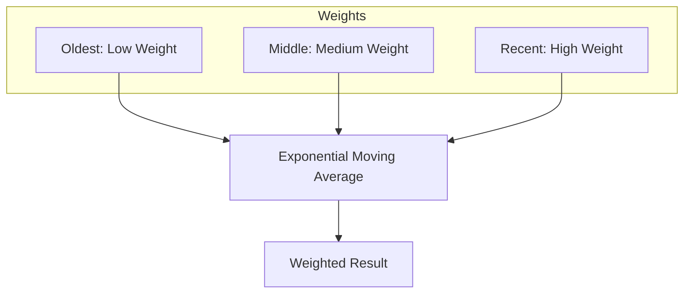
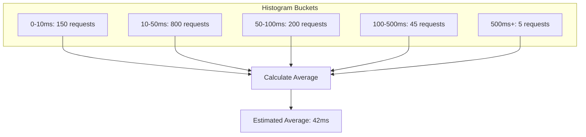
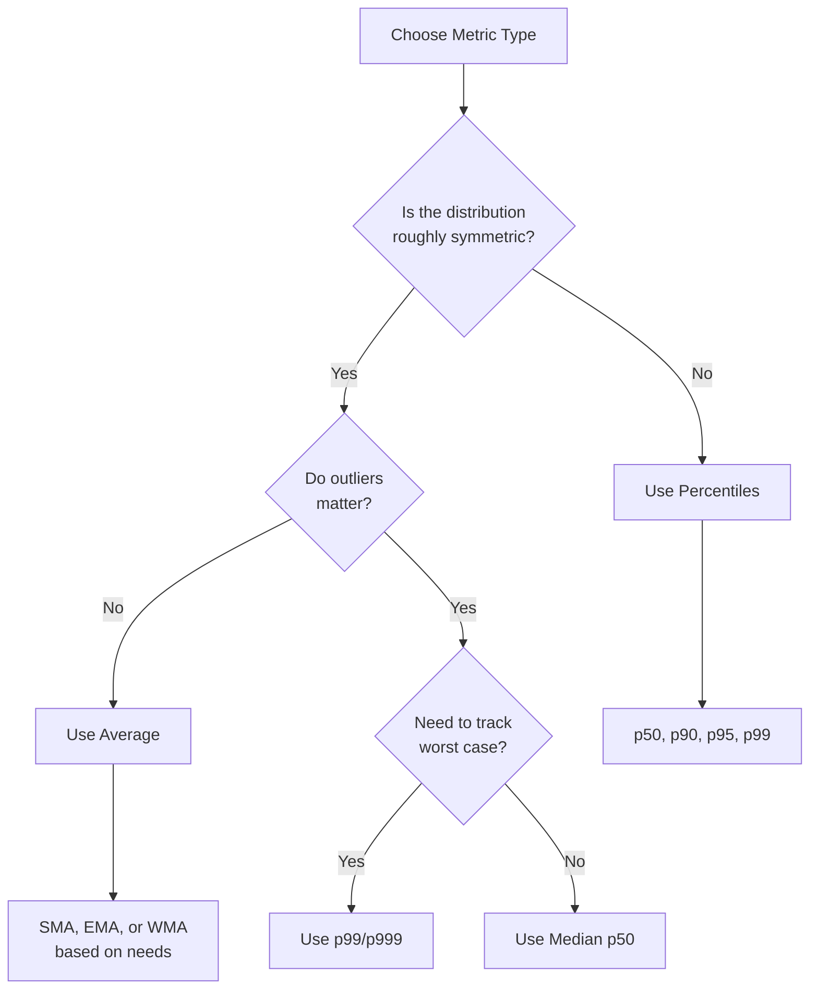
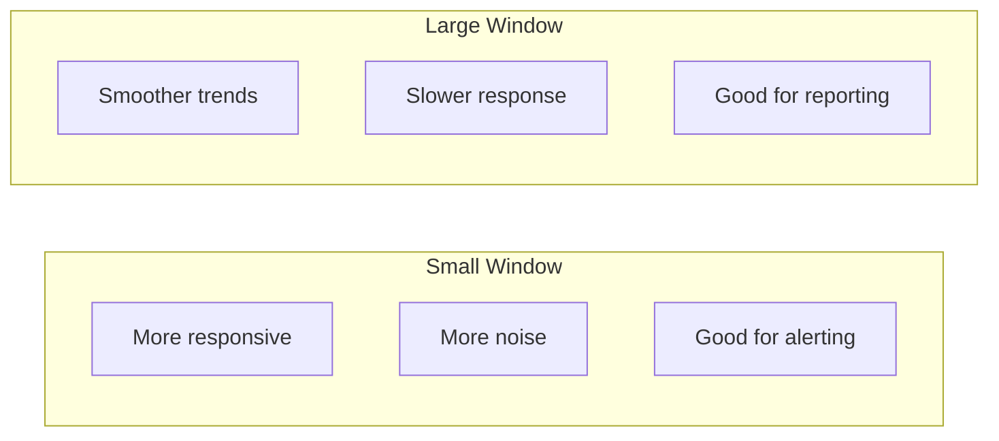

# How to Build Average Metrics

Author: [nawazdhandala](https://github.com/nawazdhandala)

Tags: Observability, Metrics, Monitoring, SRE

Description: Learn how to calculate and track average metrics for latency, response times, and resource utilization monitoring.

---

Monitoring systems generate enormous amounts of data every second. To make sense of this data, we need to aggregate it into meaningful metrics. Average metrics are one of the most common aggregation methods, but they come with nuances that every SRE and DevOps engineer should understand.

In this post, we will explore different types of averages, when to use them, and when percentiles might be a better choice.

## Why Average Metrics Matter

Average metrics provide a quick snapshot of system behavior over time. They help answer questions like:

- What is the typical response time of my API?
- How much CPU does my service consume on average?
- What is the mean throughput of my message queue?

However, averages can be misleading if used incorrectly. Understanding the different types of averages and their trade-offs is essential for building reliable monitoring systems.

## Types of Averages in Monitoring

### 1. Simple Moving Average (SMA)

A simple moving average calculates the mean of the last N data points. It smooths out short-term fluctuations and highlights longer-term trends.



Here is a Python implementation:

```python
from collections import deque
from typing import Optional

class SimpleMovingAverage:
    """
    Calculate a simple moving average over a sliding window.

    The SMA gives equal weight to all data points in the window,
    making it suitable for detecting general trends.
    """

    def __init__(self, window_size: int) -> None:
        # Store the window size for our sliding window
        self.window_size = window_size

        # Use a deque for O(1) append and popleft operations
        self.values: deque[float] = deque(maxlen=window_size)

        # Keep a running sum to avoid recalculating each time
        self.running_sum: float = 0.0

    def add(self, value: float) -> None:
        """Add a new value to the moving average window."""

        # If window is full, subtract the oldest value from running sum
        if len(self.values) == self.window_size:
            self.running_sum -= self.values[0]

        # Add the new value
        self.values.append(value)
        self.running_sum += value

    def get_average(self) -> Optional[float]:
        """Return the current moving average, or None if no data."""

        if len(self.values) == 0:
            return None

        # Calculate average from running sum for O(1) performance
        return self.running_sum / len(self.values)


# Example usage for monitoring response times
sma = SimpleMovingAverage(window_size=100)

# Simulate adding response times in milliseconds
response_times = [45, 52, 48, 51, 47, 150, 49, 46, 53, 48]

for rt in response_times:
    sma.add(rt)
    print(f"Response time: {rt}ms, Moving Avg: {sma.get_average():.2f}ms")
```

### 2. Exponential Moving Average (EMA)

The exponential moving average gives more weight to recent data points. This makes it more responsive to recent changes while still considering historical data.



```python
from typing import Optional

class ExponentialMovingAverage:
    """
    Calculate an exponential moving average with configurable smoothing.

    EMA responds faster to recent changes than SMA, making it ideal
    for alerting on sudden spikes or drops in metrics.
    """

    def __init__(self, alpha: float = 0.1) -> None:
        # Alpha controls the decay rate (0 < alpha <= 1)
        # Higher alpha = more weight to recent values
        # Lower alpha = smoother, slower response
        if not 0 < alpha <= 1:
            raise ValueError("Alpha must be between 0 (exclusive) and 1 (inclusive)")

        self.alpha = alpha
        self.ema: Optional[float] = None

    def add(self, value: float) -> None:
        """Add a new value and update the exponential moving average."""

        if self.ema is None:
            # First value initializes the EMA
            self.ema = value
        else:
            # EMA formula: new_ema = alpha * value + (1 - alpha) * old_ema
            # This gives recent values weight 'alpha' and historical average weight '1-alpha'
            self.ema = self.alpha * value + (1 - self.alpha) * self.ema

    def get_average(self) -> Optional[float]:
        """Return the current exponential moving average."""
        return self.ema


# Example: Monitoring CPU utilization with EMA
# Using alpha=0.2 for moderate responsiveness

ema_cpu = ExponentialMovingAverage(alpha=0.2)

cpu_readings = [25, 30, 28, 85, 90, 88, 35, 32, 30, 28]

print("CPU Monitoring with EMA (alpha=0.2)")
print("-" * 45)

for cpu in cpu_readings:
    ema_cpu.add(cpu)
    print(f"CPU: {cpu:3d}%, EMA: {ema_cpu.get_average():6.2f}%")
```

### 3. Weighted Moving Average (WMA)

A weighted moving average assigns custom weights to each data point. This is useful when certain time periods or data sources are more important than others.

```python
from collections import deque
from typing import List, Optional

class WeightedMovingAverage:
    """
    Calculate a weighted moving average with custom weights.

    WMA allows fine-grained control over how much each position
    in the window contributes to the final average.
    """

    def __init__(self, weights: List[float]) -> None:
        # Weights define importance of each position (oldest to newest)
        # Example: [1, 2, 3] means newest value is 3x more important than oldest
        self.weights = weights
        self.window_size = len(weights)

        # Normalize weights to sum to 1 for proper averaging
        weight_sum = sum(weights)
        self.normalized_weights = [w / weight_sum for w in weights]

        # Store values in a deque with fixed size
        self.values: deque[float] = deque(maxlen=self.window_size)

    def add(self, value: float) -> None:
        """Add a new value to the weighted average window."""
        self.values.append(value)

    def get_average(self) -> Optional[float]:
        """Calculate the weighted average of current values."""

        if len(self.values) == 0:
            return None

        # If window is not full yet, use proportional weights
        if len(self.values) < self.window_size:
            # Use only the weights for the positions we have
            active_weights = self.normalized_weights[-len(self.values):]
            weight_sum = sum(active_weights)
            normalized = [w / weight_sum for w in active_weights]

            return sum(v * w for v, w in zip(self.values, normalized))

        # Full window: apply all weights
        return sum(v * w for v, w in zip(self.values, self.normalized_weights))


# Example: Network latency monitoring
# Recent measurements are more important for alerting

# Weights: older readings get less weight, newer get more
weights = [1, 1, 2, 2, 3, 3, 4, 4, 5, 5]  # Linearly increasing weights

wma = WeightedMovingAverage(weights)

latencies = [10, 12, 11, 15, 14, 50, 55, 52, 20, 18]

print("Network Latency with WMA")
print("-" * 40)

for latency in latencies:
    wma.add(latency)
    avg = wma.get_average()
    if avg:
        print(f"Latency: {latency:3d}ms, WMA: {avg:6.2f}ms")
```

### 4. Histogram-Based Averages

For high-volume metrics, storing every data point is impractical. Histogram-based averages use buckets to approximate the distribution and calculate averages efficiently.



```python
from typing import List, Tuple, Optional

class HistogramAverage:
    """
    Calculate average from histogram buckets.

    This approach is memory-efficient for high-volume metrics
    where storing individual values is not feasible.
    Used by Prometheus and other monitoring systems.
    """

    def __init__(self, bucket_boundaries: List[float]) -> None:
        # Bucket boundaries define the upper limits of each bucket
        # Example: [10, 50, 100, 500] creates buckets: 0-10, 10-50, 50-100, 100-500, 500+
        self.boundaries = sorted(bucket_boundaries)

        # Count of observations in each bucket
        # Last bucket is for values above the highest boundary
        self.bucket_counts: List[int] = [0] * (len(self.boundaries) + 1)

        # Track total sum for accurate average calculation
        self.total_sum: float = 0.0
        self.total_count: int = 0

    def observe(self, value: float) -> None:
        """Record an observation in the appropriate bucket."""

        # Update totals for exact average
        self.total_sum += value
        self.total_count += 1

        # Find the right bucket
        for i, boundary in enumerate(self.boundaries):
            if value <= boundary:
                self.bucket_counts[i] += 1
                return

        # Value exceeds all boundaries, goes in overflow bucket
        self.bucket_counts[-1] += 1

    def get_exact_average(self) -> Optional[float]:
        """Return the exact average (when we track the sum)."""

        if self.total_count == 0:
            return None

        return self.total_sum / self.total_count

    def get_estimated_average(self) -> Optional[float]:
        """
        Estimate average from bucket midpoints.

        This is useful when you only have histogram data
        without the original sum (common in Prometheus queries).
        """

        if self.total_count == 0:
            return None

        estimated_sum = 0.0

        # Calculate midpoint for each bucket
        prev_boundary = 0.0

        for i, boundary in enumerate(self.boundaries):
            midpoint = (prev_boundary + boundary) / 2
            estimated_sum += midpoint * self.bucket_counts[i]
            prev_boundary = boundary

        # For overflow bucket, estimate using 2x the last boundary
        overflow_estimate = self.boundaries[-1] * 2
        estimated_sum += overflow_estimate * self.bucket_counts[-1]

        return estimated_sum / self.total_count

    def get_bucket_distribution(self) -> List[Tuple[str, int, float]]:
        """Return the distribution across buckets."""

        distribution = []
        prev = 0.0

        for i, boundary in enumerate(self.boundaries):
            label = f"{prev:.0f}-{boundary:.0f}"
            count = self.bucket_counts[i]
            pct = (count / self.total_count * 100) if self.total_count > 0 else 0
            distribution.append((label, count, pct))
            prev = boundary

        # Overflow bucket
        label = f"{self.boundaries[-1]:.0f}+"
        count = self.bucket_counts[-1]
        pct = (count / self.total_count * 100) if self.total_count > 0 else 0
        distribution.append((label, count, pct))

        return distribution


# Example: HTTP response time monitoring
# Using Prometheus-style buckets

buckets = [5, 10, 25, 50, 100, 250, 500, 1000]  # milliseconds

histogram = HistogramAverage(buckets)

# Simulate 1000 requests with realistic distribution
import random

random.seed(42)

for _ in range(1000):
    # Most requests are fast, some are slow
    if random.random() < 0.9:
        response_time = random.gauss(30, 15)  # Fast: ~30ms avg
    else:
        response_time = random.gauss(200, 100)  # Slow: ~200ms avg

    response_time = max(1, response_time)  # Ensure positive
    histogram.observe(response_time)

print("HTTP Response Time Histogram")
print("=" * 50)
print("\nBucket Distribution:")

for label, count, pct in histogram.get_bucket_distribution():
    bar = "#" * int(pct / 2)
    print(f"  {label:>10}ms: {count:4d} ({pct:5.1f}%) {bar}")

print(f"\nExact Average: {histogram.get_exact_average():.2f}ms")
print(f"Estimated Average: {histogram.get_estimated_average():.2f}ms")
```

## When to Use Averages vs Percentiles

Averages are not always the best choice. Here is a comparison to help you decide:



### Use Averages When:

1. **Data is normally distributed**: Response times from a healthy service
2. **You need computational efficiency**: Averages require less memory and CPU
3. **Aggregating across dimensions**: Average CPU across all pods
4. **Trending over long periods**: Week-over-week comparisons

### Use Percentiles When:

1. **Data has outliers**: Long-tail latency distributions
2. **SLOs require worst-case guarantees**: "99% of requests under 200ms"
3. **Debugging user experience**: The slowest requests affect real users
4. **Distributions are skewed**: Most metrics in distributed systems

### The Hidden Danger of Averages

Consider this example:

```python
def demonstrate_average_problem():
    """
    Show how averages can hide problems in bimodal distributions.

    This is common when a cache has hits (fast) and misses (slow).
    """

    # Scenario: Cache with 90% hit rate
    # Cache hits: 5ms, Cache misses: 500ms

    cache_hits = [5] * 90    # 90 requests at 5ms
    cache_misses = [500] * 10  # 10 requests at 500ms

    all_requests = cache_hits + cache_misses

    # Calculate average
    average = sum(all_requests) / len(all_requests)

    # Calculate percentiles
    sorted_requests = sorted(all_requests)
    p50 = sorted_requests[49]   # 50th percentile
    p90 = sorted_requests[89]   # 90th percentile
    p99 = sorted_requests[98]   # 99th percentile

    print("Cache Performance Analysis")
    print("=" * 40)
    print(f"Average latency:     {average:.0f}ms")
    print(f"Median (p50):        {p50}ms")
    print(f"p90:                 {p90}ms")
    print(f"p99:                 {p99}ms")
    print()
    print("The average of 54.5ms hides the bimodal nature!")
    print("10% of users experience 500ms latency.")


demonstrate_average_problem()
```

Output:
```
Cache Performance Analysis
========================================
Average latency:     54.5ms
Median (p50):        5ms
p90:                 5ms
p99:                 500ms

The average of 54.5ms hides the bimodal nature!
10% of users experience 500ms latency.
```

## Building a Complete Metrics Pipeline

Here is an example of a production-ready metrics collector that supports multiple average types:

```python
import time
from dataclasses import dataclass, field
from typing import Dict, List, Optional
from enum import Enum
from collections import deque

class AverageType(Enum):
    """Supported average calculation methods."""
    SIMPLE = "simple"
    EXPONENTIAL = "exponential"
    WEIGHTED = "weighted"


@dataclass
class MetricConfig:
    """Configuration for a metric."""
    name: str
    average_type: AverageType
    window_size: int = 100
    alpha: float = 0.1  # For EMA
    weights: Optional[List[float]] = None  # For WMA


@dataclass
class MetricStats:
    """Statistics for a metric."""
    current_average: Optional[float] = None
    min_value: Optional[float] = None
    max_value: Optional[float] = None
    count: int = 0
    last_updated: Optional[float] = None


class MetricsCollector:
    """
    Production-ready metrics collector with multiple average types.

    This collector can be used as a foundation for monitoring
    applications, providing flexible averaging strategies.
    """

    def __init__(self) -> None:
        # Store metric configurations
        self.configs: Dict[str, MetricConfig] = {}

        # Store values for each metric
        self.values: Dict[str, deque] = {}

        # Store running statistics
        self.stats: Dict[str, MetricStats] = {}

        # Store EMA values separately (they do not need full history)
        self.ema_values: Dict[str, float] = {}

    def register_metric(self, config: MetricConfig) -> None:
        """Register a new metric with its configuration."""

        self.configs[config.name] = config
        self.values[config.name] = deque(maxlen=config.window_size)
        self.stats[config.name] = MetricStats()

        if config.average_type == AverageType.EXPONENTIAL:
            self.ema_values[config.name] = 0.0

    def record(self, metric_name: str, value: float) -> None:
        """Record a value for a metric."""

        if metric_name not in self.configs:
            raise ValueError(f"Unknown metric: {metric_name}")

        config = self.configs[metric_name]
        stats = self.stats[metric_name]

        # Update basic statistics
        stats.count += 1
        stats.last_updated = time.time()

        if stats.min_value is None or value < stats.min_value:
            stats.min_value = value

        if stats.max_value is None or value > stats.max_value:
            stats.max_value = value

        # Store value and calculate average based on type
        if config.average_type == AverageType.EXPONENTIAL:
            # EMA does not need to store all values
            if stats.count == 1:
                self.ema_values[metric_name] = value
            else:
                alpha = config.alpha
                self.ema_values[metric_name] = (
                    alpha * value + (1 - alpha) * self.ema_values[metric_name]
                )
            stats.current_average = self.ema_values[metric_name]

        else:
            # SMA and WMA need the value history
            self.values[metric_name].append(value)
            stats.current_average = self._calculate_average(metric_name)

    def _calculate_average(self, metric_name: str) -> Optional[float]:
        """Calculate average based on metric configuration."""

        config = self.configs[metric_name]
        values = list(self.values[metric_name])

        if not values:
            return None

        if config.average_type == AverageType.SIMPLE:
            return sum(values) / len(values)

        elif config.average_type == AverageType.WEIGHTED:
            weights = config.weights or list(range(1, len(values) + 1))

            # Adjust weights if window is not full
            if len(values) < len(weights):
                weights = weights[-len(values):]

            weight_sum = sum(weights)
            weighted_sum = sum(v * w for v, w in zip(values, weights))

            return weighted_sum / weight_sum

        return None

    def get_stats(self, metric_name: str) -> MetricStats:
        """Get current statistics for a metric."""

        if metric_name not in self.stats:
            raise ValueError(f"Unknown metric: {metric_name}")

        return self.stats[metric_name]

    def get_all_stats(self) -> Dict[str, MetricStats]:
        """Get statistics for all metrics."""
        return self.stats.copy()


# Example: Complete monitoring setup

collector = MetricsCollector()

# Register different metrics with appropriate average types

# API latency: Use EMA for fast response to changes
collector.register_metric(MetricConfig(
    name="api_latency_ms",
    average_type=AverageType.EXPONENTIAL,
    alpha=0.2
))

# CPU usage: Use SMA for stable trending
collector.register_metric(MetricConfig(
    name="cpu_percent",
    average_type=AverageType.SIMPLE,
    window_size=60  # 1 minute of samples at 1/sec
))

# Memory: Use WMA with recent bias
collector.register_metric(MetricConfig(
    name="memory_mb",
    average_type=AverageType.WEIGHTED,
    window_size=10,
    weights=[1, 1, 2, 2, 3, 3, 4, 4, 5, 5]
))

# Simulate some data
import random

print("Metrics Collection Example")
print("=" * 50)

for i in range(20):
    # Simulate realistic values
    latency = random.gauss(50, 10) + (50 if i > 15 else 0)  # Spike at end
    cpu = 30 + random.gauss(0, 5) + (i * 2)  # Gradual increase
    memory = 512 + random.gauss(0, 20)

    collector.record("api_latency_ms", latency)
    collector.record("cpu_percent", cpu)
    collector.record("memory_mb", memory)

print("\nFinal Statistics:")
print("-" * 50)

for name, stats in collector.get_all_stats().items():
    print(f"\n{name}:")
    print(f"  Average: {stats.current_average:.2f}")
    print(f"  Min: {stats.min_value:.2f}")
    print(f"  Max: {stats.max_value:.2f}")
    print(f"  Count: {stats.count}")
```

## Best Practices

### 1. Choose the Right Window Size



### 2. Combine Averages with Other Metrics

Never rely on averages alone. A complete monitoring strategy includes:

- **Average**: Overall trend and typical behavior
- **Percentiles**: Tail latency and worst-case scenarios
- **Min/Max**: Boundaries and anomaly detection
- **Count/Rate**: Volume and throughput

### 3. Document Your Choices

When setting up metrics, document:

- Why you chose a specific average type
- What window size was selected and why
- How the metric relates to SLOs
- When alerts should fire

## Conclusion

Average metrics are powerful tools for monitoring, but they require careful consideration. Key takeaways:

1. **Simple Moving Average**: Best for general trending and smoothing
2. **Exponential Moving Average**: Best for responsive alerting
3. **Weighted Moving Average**: Best when recent data matters more
4. **Histogram Averages**: Best for high-volume, memory-constrained scenarios

Remember that averages can hide important patterns in your data. Always pair them with percentiles for a complete picture of system behavior.

Start with simple averages, measure their effectiveness, and evolve your approach based on what you learn about your system's behavior.
