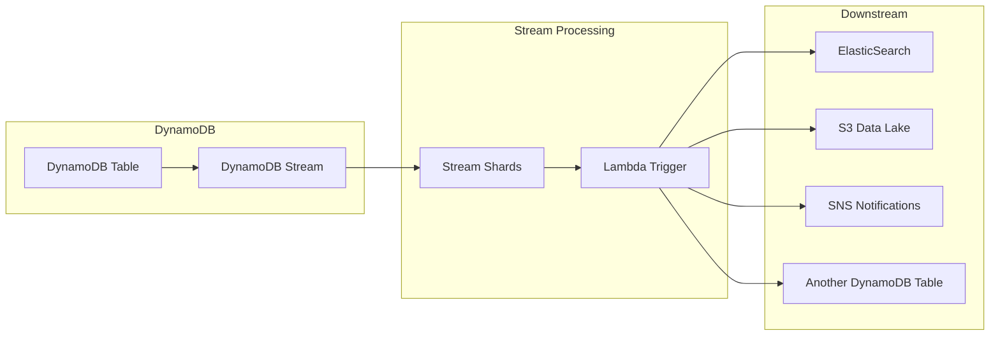
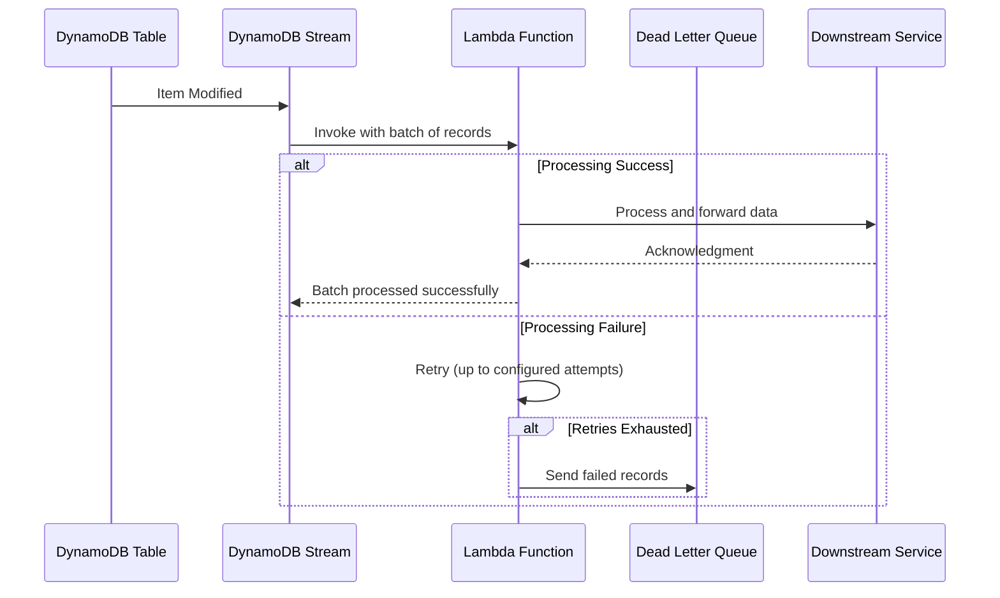
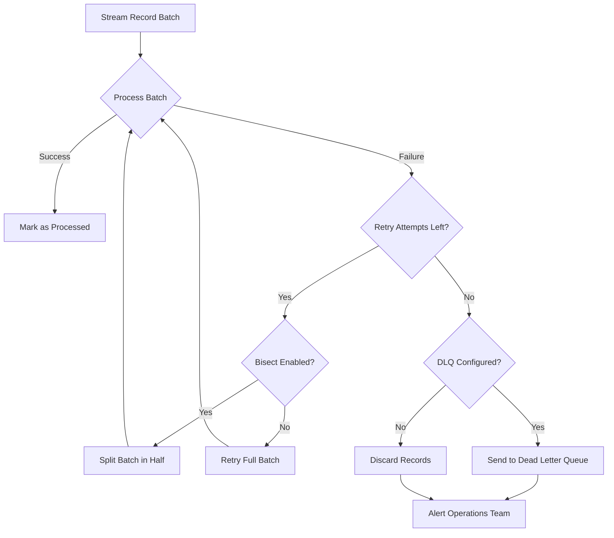

# How to Create AWS DynamoDB Streams Processing

Author: [nawazdhandala](https://github.com/nawazdhandala)

Tags: AWS, DynamoDB, Streams, CDC

Description: Learn how to implement change data capture (CDC) using AWS DynamoDB Streams with Lambda triggers for real-time data processing.

---

## Introduction

DynamoDB Streams is a powerful feature that captures a time-ordered sequence of item-level modifications in any DynamoDB table. This enables change data capture (CDC) patterns, allowing you to react to data changes in real-time. Whether you need to replicate data, trigger workflows, or maintain materialized views, DynamoDB Streams provides a reliable foundation for event-driven architectures.

## Architecture Overview



## Stream View Types

DynamoDB Streams supports four different view types that determine what data is captured for each modification:

| View Type | Description | Use Case |
|-----------|-------------|----------|
| `KEYS_ONLY` | Only the key attributes of the modified item | Lightweight triggers, deletion tracking |
| `NEW_IMAGE` | The entire item as it appears after modification | Data replication, search indexing |
| `OLD_IMAGE` | The entire item as it appeared before modification | Audit trails, rollback scenarios |
| `NEW_AND_OLD_IMAGES` | Both the new and old item images | Change comparison, audit logging |

## Enabling DynamoDB Streams

### Using AWS CloudFormation

```yaml
# cloudformation-dynamodb-stream.yaml
AWSTemplateFormatVersion: '2010-09-09'
Description: DynamoDB table with streams enabled for CDC

Resources:
  OrdersTable:
    Type: AWS::DynamoDB::Table
    Properties:
      TableName: orders
      AttributeDefinitions:
        - AttributeName: orderId
          AttributeType: S
        - AttributeName: customerId
          AttributeType: S
      KeySchema:
        - AttributeName: orderId
          KeyType: HASH
        - AttributeName: customerId
          KeyType: RANGE
      BillingMode: PAY_PER_REQUEST
      # Enable DynamoDB Streams with NEW_AND_OLD_IMAGES view type
      StreamSpecification:
        StreamViewType: NEW_AND_OLD_IMAGES

Outputs:
  TableStreamArn:
    Description: The ARN of the DynamoDB Stream
    Value: !GetAtt OrdersTable.StreamArn
```

### Using AWS CDK (TypeScript)

```typescript
// lib/dynamodb-streams-stack.ts
import * as cdk from 'aws-cdk-lib';
import * as dynamodb from 'aws-cdk-lib/aws-dynamodb';
import { Construct } from 'constructs';

export class DynamoDbStreamsStack extends cdk.Stack {
  public readonly table: dynamodb.Table;

  constructor(scope: Construct, id: string, props?: cdk.StackProps) {
    super(scope, id, props);

    // Create DynamoDB table with streams enabled
    this.table = new dynamodb.Table(this, 'OrdersTable', {
      tableName: 'orders',
      partitionKey: {
        name: 'orderId',
        type: dynamodb.AttributeType.STRING,
      },
      sortKey: {
        name: 'customerId',
        type: dynamodb.AttributeType.STRING,
      },
      billingMode: dynamodb.BillingMode.PAY_PER_REQUEST,
      // Enable streams with full change information
      stream: dynamodb.StreamViewType.NEW_AND_OLD_IMAGES,
      // Enable point-in-time recovery for data protection
      pointInTimeRecovery: true,
    });
  }
}
```

### Using Terraform

```hcl
# main.tf
resource "aws_dynamodb_table" "orders" {
  name         = "orders"
  billing_mode = "PAY_PER_REQUEST"
  hash_key     = "orderId"
  range_key    = "customerId"

  attribute {
    name = "orderId"
    type = "S"
  }

  attribute {
    name = "customerId"
    type = "S"
  }

  # Enable DynamoDB Streams
  stream_enabled   = true
  stream_view_type = "NEW_AND_OLD_IMAGES"

  point_in_time_recovery {
    enabled = true
  }

  tags = {
    Environment = "production"
    Application = "order-service"
  }
}

output "stream_arn" {
  description = "The ARN of the DynamoDB Stream"
  value       = aws_dynamodb_table.orders.stream_arn
}
```

## Lambda Stream Processor

### Stream Processing Architecture



### Lambda Function (TypeScript)

```typescript
// src/handlers/stream-processor.ts
import {
  DynamoDBStreamEvent,
  DynamoDBRecord,
  StreamRecord,
  Context,
} from 'aws-lambda';
import { unmarshall } from '@aws-sdk/util-dynamodb';
import { AttributeValue } from '@aws-sdk/client-dynamodb';

// Type definitions for our order data
interface Order {
  orderId: string;
  customerId: string;
  status: string;
  totalAmount: number;
  items: OrderItem[];
  createdAt: string;
  updatedAt: string;
}

interface OrderItem {
  productId: string;
  quantity: number;
  price: number;
}

// Enum for DynamoDB event types
enum EventType {
  INSERT = 'INSERT',
  MODIFY = 'MODIFY',
  REMOVE = 'REMOVE',
}

// Main handler function
export const handler = async (
  event: DynamoDBStreamEvent,
  context: Context
): Promise<void> => {
  console.log(`Processing ${event.Records.length} records`);
  console.log(`Request ID: ${context.awsRequestId}`);

  // Process records in parallel with error handling
  const results = await Promise.allSettled(
    event.Records.map((record) => processRecord(record))
  );

  // Check for failures
  const failures = results.filter((r) => r.status === 'rejected');

  if (failures.length > 0) {
    console.error(`Failed to process ${failures.length} records`);
    // Throw error to trigger retry mechanism
    throw new Error(`Failed to process ${failures.length} out of ${event.Records.length} records`);
  }

  console.log(`Successfully processed all ${event.Records.length} records`);
};

// Process individual stream record
async function processRecord(record: DynamoDBRecord): Promise<void> {
  const { eventName, dynamodb } = record;

  if (!dynamodb) {
    console.warn('Record missing dynamodb property, skipping');
    return;
  }

  // Log sequence information for debugging
  console.log(`Event: ${eventName}, Sequence: ${dynamodb.SequenceNumber}`);

  switch (eventName) {
    case EventType.INSERT:
      await handleInsert(dynamodb);
      break;
    case EventType.MODIFY:
      await handleModify(dynamodb);
      break;
    case EventType.REMOVE:
      await handleRemove(dynamodb);
      break;
    default:
      console.warn(`Unknown event type: ${eventName}`);
  }
}

// Handle new item insertions
async function handleInsert(streamRecord: StreamRecord): Promise<void> {
  if (!streamRecord.NewImage) {
    return;
  }

  // Convert DynamoDB format to plain JavaScript object
  const newItem = unmarshall(
    streamRecord.NewImage as Record<string, AttributeValue>
  ) as Order;

  console.log(`New order created: ${newItem.orderId}`);

  // Example: Send notification for new orders
  await sendOrderNotification(newItem, 'created');

  // Example: Index in search service
  await indexOrder(newItem);
}

// Handle item modifications
async function handleModify(streamRecord: StreamRecord): Promise<void> {
  if (!streamRecord.NewImage || !streamRecord.OldImage) {
    return;
  }

  const oldItem = unmarshall(
    streamRecord.OldImage as Record<string, AttributeValue>
  ) as Order;

  const newItem = unmarshall(
    streamRecord.NewImage as Record<string, AttributeValue>
  ) as Order;

  console.log(`Order modified: ${newItem.orderId}`);

  // Detect specific changes
  if (oldItem.status !== newItem.status) {
    console.log(`Status changed: ${oldItem.status} -> ${newItem.status}`);
    await handleStatusChange(oldItem, newItem);
  }

  // Update search index
  await indexOrder(newItem);
}

// Handle item deletions
async function handleRemove(streamRecord: StreamRecord): Promise<void> {
  if (!streamRecord.OldImage) {
    return;
  }

  const deletedItem = unmarshall(
    streamRecord.OldImage as Record<string, AttributeValue>
  ) as Order;

  console.log(`Order deleted: ${deletedItem.orderId}`);

  // Remove from search index
  await removeFromIndex(deletedItem.orderId);

  // Archive deleted order
  await archiveOrder(deletedItem);
}

// Handle order status changes
async function handleStatusChange(
  oldOrder: Order,
  newOrder: Order
): Promise<void> {
  // Send notification based on new status
  switch (newOrder.status) {
    case 'confirmed':
      await sendOrderNotification(newOrder, 'confirmed');
      break;
    case 'shipped':
      await sendOrderNotification(newOrder, 'shipped');
      break;
    case 'delivered':
      await sendOrderNotification(newOrder, 'delivered');
      break;
    case 'cancelled':
      await sendOrderNotification(newOrder, 'cancelled');
      // Trigger refund process
      await initiateRefund(newOrder);
      break;
  }
}

// Placeholder functions for downstream integrations
async function sendOrderNotification(
  order: Order,
  eventType: string
): Promise<void> {
  // Implementation: Send to SNS, SES, or notification service
  console.log(`Sending ${eventType} notification for order ${order.orderId}`);
}

async function indexOrder(order: Order): Promise<void> {
  // Implementation: Index in Elasticsearch or OpenSearch
  console.log(`Indexing order ${order.orderId}`);
}

async function removeFromIndex(orderId: string): Promise<void> {
  // Implementation: Remove from search index
  console.log(`Removing order ${orderId} from index`);
}

async function archiveOrder(order: Order): Promise<void> {
  // Implementation: Store in S3 or archive table
  console.log(`Archiving order ${order.orderId}`);
}

async function initiateRefund(order: Order): Promise<void> {
  // Implementation: Trigger refund workflow
  console.log(`Initiating refund for order ${order.orderId}`);
}
```

### Lambda Function (Python)

```python
# src/handlers/stream_processor.py
import json
import logging
from typing import Any, Dict, List, Optional
from dataclasses import dataclass
from enum import Enum
import boto3
from boto3.dynamodb.types import TypeDeserializer

# Configure logging
logger = logging.getLogger()
logger.setLevel(logging.INFO)

# Initialize type deserializer for converting DynamoDB format
deserializer = TypeDeserializer()


class EventType(Enum):
    """DynamoDB stream event types."""
    INSERT = "INSERT"
    MODIFY = "MODIFY"
    REMOVE = "REMOVE"


@dataclass
class Order:
    """Order data class."""
    order_id: str
    customer_id: str
    status: str
    total_amount: float
    items: List[Dict[str, Any]]
    created_at: str
    updated_at: str


def unmarshall(dynamodb_item: Dict[str, Any]) -> Dict[str, Any]:
    """Convert DynamoDB item format to Python dictionary."""
    return {
        key: deserializer.deserialize(value)
        for key, value in dynamodb_item.items()
    }


def dict_to_order(data: Dict[str, Any]) -> Order:
    """Convert dictionary to Order dataclass."""
    return Order(
        order_id=data.get("orderId", ""),
        customer_id=data.get("customerId", ""),
        status=data.get("status", ""),
        total_amount=float(data.get("totalAmount", 0)),
        items=data.get("items", []),
        created_at=data.get("createdAt", ""),
        updated_at=data.get("updatedAt", ""),
    )


def handler(event: Dict[str, Any], context: Any) -> Dict[str, Any]:
    """
    Main Lambda handler for DynamoDB Stream events.

    Args:
        event: DynamoDB Stream event containing records
        context: Lambda context object

    Returns:
        Processing result summary
    """
    records = event.get("Records", [])
    logger.info(f"Processing {len(records)} records")
    logger.info(f"Request ID: {context.aws_request_id}")

    success_count = 0
    failure_count = 0

    for record in records:
        try:
            process_record(record)
            success_count += 1
        except Exception as e:
            logger.error(f"Failed to process record: {e}")
            failure_count += 1

    # If any failures, raise exception to trigger retry
    if failure_count > 0:
        raise Exception(
            f"Failed to process {failure_count} out of {len(records)} records"
        )

    logger.info(f"Successfully processed {success_count} records")
    return {"processed": success_count, "failed": failure_count}


def process_record(record: Dict[str, Any]) -> None:
    """Process individual stream record."""
    event_name = record.get("eventName")
    dynamodb = record.get("dynamodb", {})

    # Log sequence information for debugging
    sequence_number = dynamodb.get("SequenceNumber")
    logger.info(f"Event: {event_name}, Sequence: {sequence_number}")

    if event_name == EventType.INSERT.value:
        handle_insert(dynamodb)
    elif event_name == EventType.MODIFY.value:
        handle_modify(dynamodb)
    elif event_name == EventType.REMOVE.value:
        handle_remove(dynamodb)
    else:
        logger.warning(f"Unknown event type: {event_name}")


def handle_insert(dynamodb: Dict[str, Any]) -> None:
    """Handle new item insertions."""
    new_image = dynamodb.get("NewImage")
    if not new_image:
        return

    # Convert to Python dictionary and Order object
    new_item = unmarshall(new_image)
    order = dict_to_order(new_item)

    logger.info(f"New order created: {order.order_id}")

    # Send notification for new orders
    send_order_notification(order, "created")

    # Index in search service
    index_order(order)


def handle_modify(dynamodb: Dict[str, Any]) -> None:
    """Handle item modifications."""
    old_image = dynamodb.get("OldImage")
    new_image = dynamodb.get("NewImage")

    if not old_image or not new_image:
        return

    old_item = unmarshall(old_image)
    new_item = unmarshall(new_image)

    old_order = dict_to_order(old_item)
    new_order = dict_to_order(new_item)

    logger.info(f"Order modified: {new_order.order_id}")

    # Detect status changes
    if old_order.status != new_order.status:
        logger.info(
            f"Status changed: {old_order.status} -> {new_order.status}"
        )
        handle_status_change(old_order, new_order)

    # Update search index
    index_order(new_order)


def handle_remove(dynamodb: Dict[str, Any]) -> None:
    """Handle item deletions."""
    old_image = dynamodb.get("OldImage")
    if not old_image:
        return

    deleted_item = unmarshall(old_image)
    order = dict_to_order(deleted_item)

    logger.info(f"Order deleted: {order.order_id}")

    # Remove from search index
    remove_from_index(order.order_id)

    # Archive deleted order
    archive_order(order)


def handle_status_change(old_order: Order, new_order: Order) -> None:
    """Handle order status transitions."""
    status_handlers = {
        "confirmed": lambda o: send_order_notification(o, "confirmed"),
        "shipped": lambda o: send_order_notification(o, "shipped"),
        "delivered": lambda o: send_order_notification(o, "delivered"),
        "cancelled": lambda o: (
            send_order_notification(o, "cancelled"),
            initiate_refund(o),
        ),
    }

    handler_func = status_handlers.get(new_order.status)
    if handler_func:
        handler_func(new_order)


# Placeholder functions for downstream integrations
def send_order_notification(order: Order, event_type: str) -> None:
    """Send notification for order events."""
    logger.info(
        f"Sending {event_type} notification for order {order.order_id}"
    )


def index_order(order: Order) -> None:
    """Index order in search service."""
    logger.info(f"Indexing order {order.order_id}")


def remove_from_index(order_id: str) -> None:
    """Remove order from search index."""
    logger.info(f"Removing order {order_id} from index")


def archive_order(order: Order) -> None:
    """Archive order to long-term storage."""
    logger.info(f"Archiving order {order.order_id}")


def initiate_refund(order: Order) -> None:
    """Initiate refund process for cancelled order."""
    logger.info(f"Initiating refund for order {order.order_id}")
```

## Lambda Event Source Mapping

### CloudFormation Configuration

```yaml
# cloudformation-lambda-stream.yaml
AWSTemplateFormatVersion: '2010-09-09'
Description: Lambda function with DynamoDB Stream trigger

Parameters:
  OrdersTableStreamArn:
    Type: String
    Description: ARN of the DynamoDB Stream

Resources:
  # Lambda execution role
  StreamProcessorRole:
    Type: AWS::IAM::Role
    Properties:
      RoleName: stream-processor-role
      AssumeRolePolicyDocument:
        Version: '2012-10-17'
        Statement:
          - Effect: Allow
            Principal:
              Service: lambda.amazonaws.com
            Action: sts:AssumeRole
      ManagedPolicyArns:
        - arn:aws:iam::aws:policy/service-role/AWSLambdaBasicExecutionRole
      Policies:
        - PolicyName: DynamoDBStreamAccess
          PolicyDocument:
            Version: '2012-10-17'
            Statement:
              - Effect: Allow
                Action:
                  - dynamodb:GetRecords
                  - dynamodb:GetShardIterator
                  - dynamodb:DescribeStream
                  - dynamodb:ListStreams
                Resource: !Ref OrdersTableStreamArn
        - PolicyName: SQSDeadLetterQueue
          PolicyDocument:
            Version: '2012-10-17'
            Statement:
              - Effect: Allow
                Action:
                  - sqs:SendMessage
                Resource: !GetAtt StreamProcessorDLQ.Arn

  # Dead Letter Queue for failed records
  StreamProcessorDLQ:
    Type: AWS::SQS::Queue
    Properties:
      QueueName: stream-processor-dlq
      MessageRetentionPeriod: 1209600  # 14 days

  # Lambda function
  StreamProcessorFunction:
    Type: AWS::Lambda::Function
    Properties:
      FunctionName: order-stream-processor
      Runtime: nodejs18.x
      Handler: stream-processor.handler
      Code:
        S3Bucket: !Sub ${AWS::StackName}-lambda-code
        S3Key: stream-processor.zip
      Role: !GetAtt StreamProcessorRole.Arn
      Timeout: 60
      MemorySize: 256
      Environment:
        Variables:
          LOG_LEVEL: INFO

  # Event source mapping connecting Lambda to DynamoDB Stream
  StreamEventSourceMapping:
    Type: AWS::Lambda::EventSourceMapping
    Properties:
      EventSourceArn: !Ref OrdersTableStreamArn
      FunctionName: !Ref StreamProcessorFunction
      # Start reading from the latest records
      StartingPosition: LATEST
      # Process records in batches
      BatchSize: 100
      # Maximum time to wait for batch to fill
      MaximumBatchingWindowInSeconds: 5
      # Retry configuration
      MaximumRetryAttempts: 3
      # Maximum age of records to process (1 hour)
      MaximumRecordAgeInSeconds: 3600
      # Split batch on error to isolate problematic records
      BisectBatchOnFunctionError: true
      # Send failed records to DLQ
      DestinationConfig:
        OnFailure:
          Destination: !GetAtt StreamProcessorDLQ.Arn
      # Enable parallel processing of shards
      ParallelizationFactor: 2
```

### CDK Configuration

```typescript
// lib/lambda-stream-stack.ts
import * as cdk from 'aws-cdk-lib';
import * as lambda from 'aws-cdk-lib/aws-lambda';
import * as dynamodb from 'aws-cdk-lib/aws-dynamodb';
import * as sqs from 'aws-cdk-lib/aws-sqs';
import * as lambdaEventSources from 'aws-cdk-lib/aws-lambda-event-sources';
import { Construct } from 'constructs';

interface LambdaStreamStackProps extends cdk.StackProps {
  table: dynamodb.Table;
}

export class LambdaStreamStack extends cdk.Stack {
  constructor(scope: Construct, id: string, props: LambdaStreamStackProps) {
    super(scope, id, props);

    // Dead Letter Queue for failed stream records
    const dlq = new sqs.Queue(this, 'StreamProcessorDLQ', {
      queueName: 'stream-processor-dlq',
      retentionPeriod: cdk.Duration.days(14),
    });

    // Lambda function for stream processing
    const streamProcessor = new lambda.Function(this, 'StreamProcessor', {
      functionName: 'order-stream-processor',
      runtime: lambda.Runtime.NODEJS_18_X,
      handler: 'stream-processor.handler',
      code: lambda.Code.fromAsset('dist/handlers'),
      timeout: cdk.Duration.seconds(60),
      memorySize: 256,
      environment: {
        LOG_LEVEL: 'INFO',
      },
    });

    // Add DynamoDB Stream as event source
    streamProcessor.addEventSource(
      new lambdaEventSources.DynamoEventSource(props.table, {
        // Start from the latest record in the stream
        startingPosition: lambda.StartingPosition.LATEST,
        // Batch configuration
        batchSize: 100,
        maxBatchingWindow: cdk.Duration.seconds(5),
        // Retry configuration
        maxRecordAge: cdk.Duration.hours(1),
        retryAttempts: 3,
        // Split batch on error to find problematic records
        bisectBatchOnError: true,
        // Send failures to DLQ
        onFailure: new lambdaEventSources.SqsDlq(dlq),
        // Process multiple batches in parallel
        parallelizationFactor: 2,
      })
    );
  }
}
```

## Error Handling and Retry Strategies

### Retry Flow



### Implementing Partial Batch Failure Reporting

```typescript
// src/handlers/stream-processor-partial-failure.ts
import {
  DynamoDBStreamEvent,
  DynamoDBBatchResponse,
  DynamoDBBatchItemFailure,
  DynamoDBRecord,
} from 'aws-lambda';

// Enable partial batch failure reporting
export const handler = async (
  event: DynamoDBStreamEvent
): Promise<DynamoDBBatchResponse> => {
  const batchItemFailures: DynamoDBBatchItemFailure[] = [];

  for (const record of event.Records) {
    try {
      await processRecord(record);
    } catch (error) {
      console.error(`Failed to process record: ${record.eventID}`, error);

      // Report this specific record as failed
      // Lambda will retry only this record
      if (record.eventID) {
        batchItemFailures.push({
          itemIdentifier: record.eventID,
        });
      }
    }
  }

  // Return failures for retry
  // Records not in this list are considered successful
  return { batchItemFailures };
};

async function processRecord(record: DynamoDBRecord): Promise<void> {
  // Processing logic here
  const { eventName, dynamodb } = record;

  if (!dynamodb?.NewImage && !dynamodb?.OldImage) {
    throw new Error('Missing image data in record');
  }

  // Simulate processing with potential failure
  console.log(`Processing ${eventName} event: ${record.eventID}`);
}
```

### DLQ Processing Lambda

```python
# src/handlers/dlq_processor.py
import json
import logging
from typing import Any, Dict
import boto3

logger = logging.getLogger()
logger.setLevel(logging.INFO)

# Initialize clients
sns_client = boto3.client("sns")
dynamodb = boto3.resource("dynamodb")


def handler(event: Dict[str, Any], context: Any) -> Dict[str, Any]:
    """
    Process records from the Dead Letter Queue.

    This handler is triggered by SQS and processes failed stream records
    for manual review or automated recovery.
    """
    processed = 0

    for sqs_record in event.get("Records", []):
        try:
            # Parse the DynamoDB stream record from SQS message
            body = json.loads(sqs_record["body"])

            # Extract original DynamoDB record
            dynamodb_record = body.get("DynamoDBStreamRecord", {})

            logger.info(f"Processing DLQ record: {dynamodb_record}")

            # Attempt to recover or log for manual intervention
            if can_auto_recover(dynamodb_record):
                recover_record(dynamodb_record)
            else:
                alert_operations(dynamodb_record)

            processed += 1

        except Exception as e:
            logger.error(f"Failed to process DLQ record: {e}")
            # Don't raise - we don't want infinite retries in DLQ processor

    return {"processed": processed}


def can_auto_recover(record: Dict[str, Any]) -> bool:
    """Determine if the record can be automatically recovered."""
    # Example: Check if it's a transient error that can be retried
    event_name = record.get("eventName")

    # Only auto-recover INSERT and MODIFY events
    # REMOVE events that failed might need manual review
    return event_name in ["INSERT", "MODIFY"]


def recover_record(record: Dict[str, Any]) -> None:
    """Attempt to recover the failed record."""
    event_name = record.get("eventName")
    new_image = record.get("NewImage")

    if event_name == "INSERT" and new_image:
        # Re-process the insert logic
        logger.info(f"Auto-recovering INSERT record")
        # Add recovery logic here
    elif event_name == "MODIFY" and new_image:
        # Re-process the modify logic
        logger.info(f"Auto-recovering MODIFY record")
        # Add recovery logic here


def alert_operations(record: Dict[str, Any]) -> None:
    """Alert operations team about unrecoverable record."""
    sns_topic_arn = "arn:aws:sns:us-east-1:123456789012:stream-alerts"

    message = {
        "alert": "DynamoDB Stream Processing Failure",
        "record": record,
        "action_required": "Manual review needed",
    }

    sns_client.publish(
        TopicArn=sns_topic_arn,
        Subject="DynamoDB Stream Processing Failure",
        Message=json.dumps(message, indent=2),
    )

    logger.info("Sent alert to operations team")
```

## Best Practices

### 1. Idempotent Processing

Always design your stream processor to be idempotent since records may be delivered more than once.

```typescript
// Use sequence numbers to detect duplicates
async function processWithDeduplication(
  record: DynamoDBRecord
): Promise<void> {
  const sequenceNumber = record.dynamodb?.SequenceNumber;

  if (!sequenceNumber) {
    throw new Error('Missing sequence number');
  }

  // Check if already processed using a tracking table
  const alreadyProcessed = await checkProcessed(sequenceNumber);

  if (alreadyProcessed) {
    console.log(`Record ${sequenceNumber} already processed, skipping`);
    return;
  }

  // Process the record
  await processRecord(record);

  // Mark as processed
  await markProcessed(sequenceNumber);
}
```

### 2. Monitor Stream Metrics

Set up CloudWatch alarms for critical metrics:

```yaml
# cloudformation-alarms.yaml
Resources:
  IteratorAgeAlarm:
    Type: AWS::CloudWatch::Alarm
    Properties:
      AlarmName: DynamoDB-Stream-Iterator-Age-High
      AlarmDescription: Iterator age is too high, processing is falling behind
      MetricName: IteratorAge
      Namespace: AWS/Lambda
      Dimensions:
        - Name: FunctionName
          Value: order-stream-processor
      Statistic: Maximum
      Period: 300
      EvaluationPeriods: 2
      Threshold: 300000  # 5 minutes in milliseconds
      ComparisonOperator: GreaterThanThreshold
      AlarmActions:
        - !Ref AlertTopic

  StreamProcessorErrorAlarm:
    Type: AWS::CloudWatch::Alarm
    Properties:
      AlarmName: Stream-Processor-Errors
      AlarmDescription: Stream processor is experiencing errors
      MetricName: Errors
      Namespace: AWS/Lambda
      Dimensions:
        - Name: FunctionName
          Value: order-stream-processor
      Statistic: Sum
      Period: 60
      EvaluationPeriods: 3
      Threshold: 5
      ComparisonOperator: GreaterThanThreshold
      AlarmActions:
        - !Ref AlertTopic
```

### 3. Choose the Right Batch Size

Consider these factors when configuring batch size:

| Factor | Small Batch (1-10) | Large Batch (100+) |
|--------|-------------------|-------------------|
| Latency | Lower latency per record | Higher latency per record |
| Throughput | Lower overall throughput | Higher overall throughput |
| Error isolation | Better error isolation | Use bisect for error isolation |
| Cost | More Lambda invocations | Fewer Lambda invocations |

## Conclusion

DynamoDB Streams provides a robust foundation for implementing change data capture patterns in your applications. By following the best practices outlined in this guide, you can build reliable, scalable stream processing pipelines that react to data changes in real-time.

Key takeaways:

- Choose the appropriate stream view type based on your use case
- Configure proper error handling with retries, batch bisecting, and dead letter queues
- Design idempotent processors to handle duplicate deliveries
- Monitor iterator age and error rates to catch processing issues early
- Use partial batch failure reporting to improve efficiency

With these patterns in place, you can confidently build event-driven architectures that leverage DynamoDB Streams for data synchronization, audit logging, real-time analytics, and more.

## Additional Resources

- [AWS DynamoDB Streams Documentation](https://docs.aws.amazon.com/amazondynamodb/latest/developerguide/Streams.html)
- [Lambda Event Source Mapping](https://docs.aws.amazon.com/lambda/latest/dg/with-ddb.html)
- [DynamoDB Streams and AWS Lambda Triggers](https://docs.aws.amazon.com/amazondynamodb/latest/developerguide/Streams.Lambda.html)
