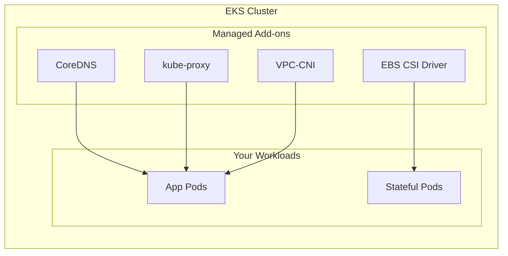
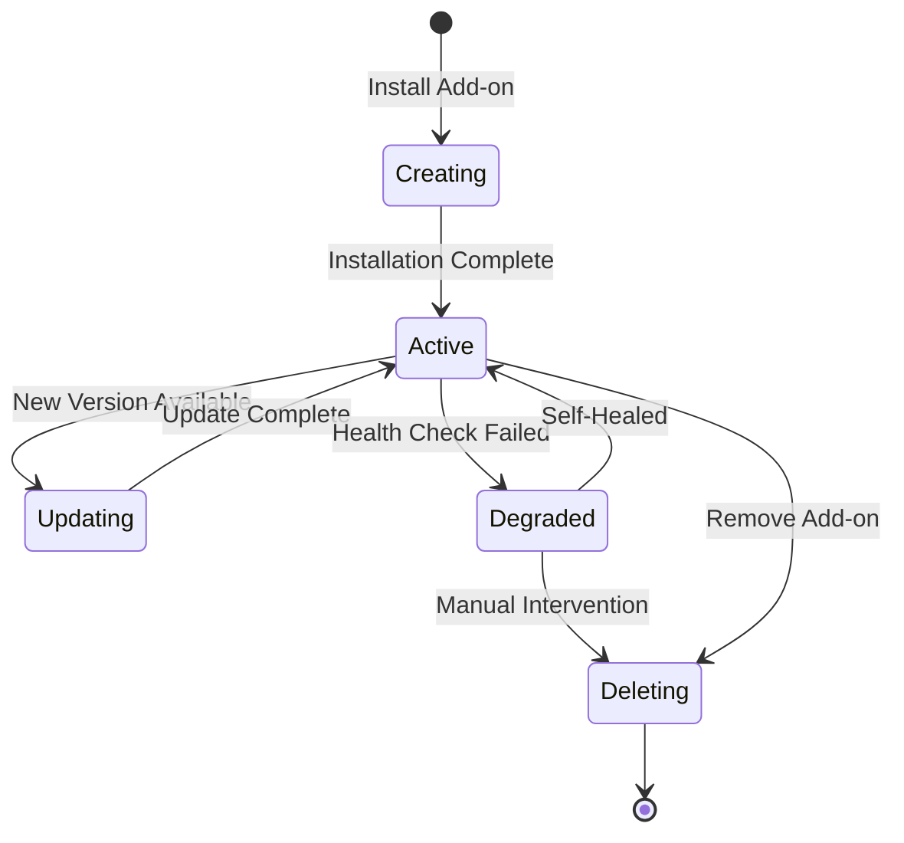
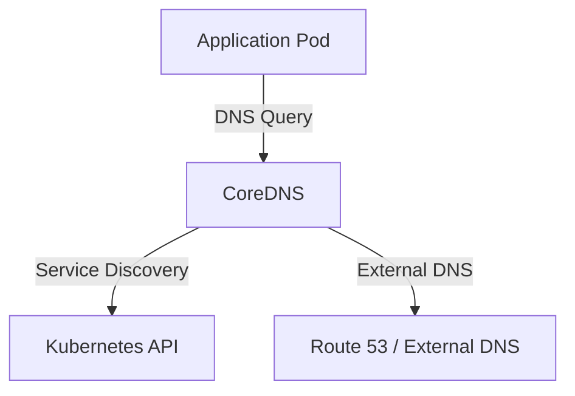
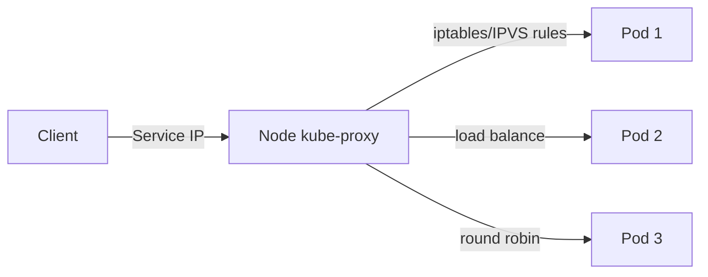
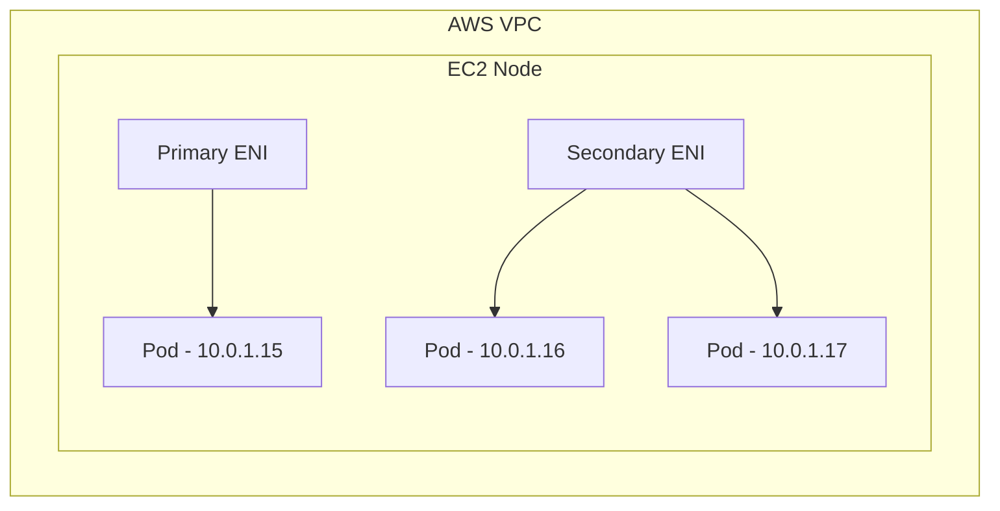
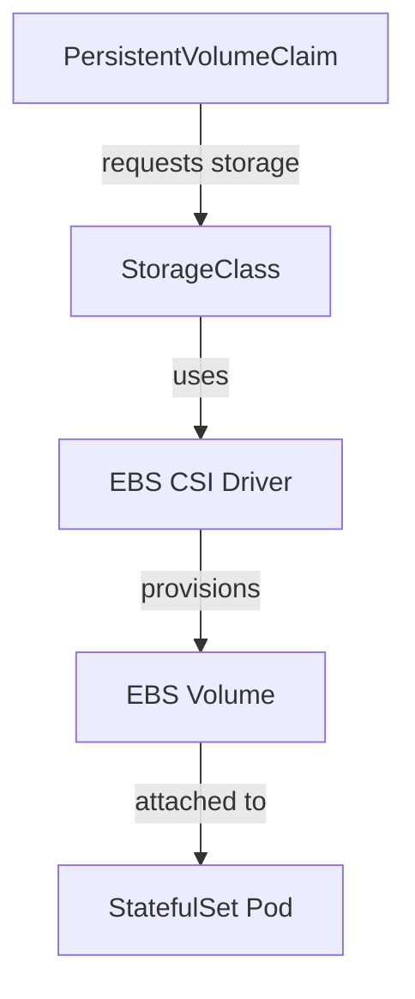

# How to Build AWS EKS Add-ons Management

Author: [nawazdhandala](https://github.com/nawazdhandala)

Tags: AWS, EKS, Add-ons, Kubernetes

Description: A practical guide to managing EKS add-ons including CoreDNS, kube-proxy, VPC-CNI, and EBS CSI driver using eksctl and AWS CLI.

---

EKS add-ons are the operational backbone of your Kubernetes cluster. They handle DNS resolution, network traffic routing, pod networking, and persistent storage. Managing them properly means fewer 3 a.m. pages and smoother cluster upgrades.

This guide covers the four essential EKS add-ons, how to manage their lifecycle, and the commands you need to keep everything running.

## What Are EKS Add-ons?

EKS add-ons are AWS-managed Kubernetes software components. Instead of deploying and upgrading these yourself with Helm or kubectl, AWS handles versioning, patching, and compatibility testing.



The four essential add-ons:

| Add-on | Purpose | Why It Matters |
| --- | --- | --- |
| CoreDNS | Cluster DNS resolution | Pods cannot resolve service names without it |
| kube-proxy | Network rules for Services | Load balancing and service discovery break without it |
| VPC-CNI | Pod networking via AWS ENIs | Pods get no IP addresses without it |
| EBS CSI Driver | Persistent volume provisioning | StatefulSets and PVCs for EBS fail without it |

## Add-on Lifecycle Overview

Understanding the add-on lifecycle helps you plan upgrades and avoid conflicts.



## Prerequisites

Before managing add-ons, ensure you have the required tools and permissions.

```bash
# Install eksctl
curl --silent --location "https://github.com/weaveworks/eksctl/releases/latest/download/eksctl_$(uname -s)_amd64.tar.gz" | tar xz -C /tmp
sudo mv /tmp/eksctl /usr/local/bin

# Verify installation
eksctl version

# Configure AWS CLI
aws configure
aws sts get-caller-identity
```

Your IAM user or role needs these permissions:

```json
{
    "Version": "2012-10-17",
    "Statement": [
        {
            "Effect": "Allow",
            "Action": [
                "eks:DescribeAddon",
                "eks:DescribeAddonVersions",
                "eks:ListAddons",
                "eks:CreateAddon",
                "eks:UpdateAddon",
                "eks:DeleteAddon"
            ],
            "Resource": "*"
        }
    ]
}
```

## Managing Add-ons with eksctl

### List Available Add-ons

```bash
# List add-ons available for your cluster version
eksctl utils describe-addon-versions --cluster my-cluster --region us-west-2

# Filter by specific add-on
eksctl utils describe-addon-versions --cluster my-cluster --name vpc-cni
```

### View Installed Add-ons

```bash
# List all installed add-ons
eksctl get addons --cluster my-cluster --region us-west-2
```

### Install Add-ons with eksctl

```bash
# Install CoreDNS
eksctl create addon \
    --cluster my-cluster \
    --name coredns \
    --version v1.11.1-eksbuild.6 \
    --region us-west-2

# Install kube-proxy
eksctl create addon \
    --cluster my-cluster \
    --name kube-proxy \
    --version v1.29.0-eksbuild.1 \
    --region us-west-2

# Install VPC-CNI with service account
eksctl create addon \
    --cluster my-cluster \
    --name vpc-cni \
    --version v1.16.0-eksbuild.1 \
    --service-account-role-arn arn:aws:iam::111122223333:role/AmazonEKSVPCCNIRole \
    --region us-west-2

# Install EBS CSI Driver with service account
eksctl create addon \
    --cluster my-cluster \
    --name aws-ebs-csi-driver \
    --version v1.28.0-eksbuild.1 \
    --service-account-role-arn arn:aws:iam::111122223333:role/AmazonEKS_EBS_CSI_DriverRole \
    --region us-west-2
```

### Update Add-ons with eksctl

```bash
# Update CoreDNS to latest compatible version
eksctl update addon \
    --cluster my-cluster \
    --name coredns \
    --version v1.11.1-eksbuild.8 \
    --region us-west-2

# Force update (overwrites custom config)
eksctl update addon \
    --cluster my-cluster \
    --name kube-proxy \
    --version v1.29.1-eksbuild.2 \
    --force \
    --region us-west-2
```

### Delete Add-ons with eksctl

```bash
# Remove an add-on
eksctl delete addon \
    --cluster my-cluster \
    --name aws-ebs-csi-driver \
    --region us-west-2
```

## Managing Add-ons with AWS CLI

The AWS CLI gives you finer control and works well in CI/CD pipelines.

### List Available Add-on Versions

```bash
# Get all versions for an add-on
aws eks describe-addon-versions \
    --addon-name vpc-cni \
    --kubernetes-version 1.29 \
    --query 'addons[].addonVersions[].addonVersion' \
    --output table

# Get the default version
aws eks describe-addon-versions \
    --addon-name coredns \
    --kubernetes-version 1.29 \
    --query 'addons[0].addonVersions[?compatibilities[0].defaultVersion==`true`].addonVersion' \
    --output text
```

### View Installed Add-ons

```bash
# List all add-ons on cluster
aws eks list-addons \
    --cluster-name my-cluster \
    --region us-west-2

# Get detailed info about an add-on
aws eks describe-addon \
    --cluster-name my-cluster \
    --addon-name vpc-cni \
    --region us-west-2
```

### Install Add-ons with AWS CLI

```bash
# Install CoreDNS
aws eks create-addon \
    --cluster-name my-cluster \
    --addon-name coredns \
    --addon-version v1.11.1-eksbuild.6 \
    --resolve-conflicts OVERWRITE \
    --region us-west-2

# Install kube-proxy
aws eks create-addon \
    --cluster-name my-cluster \
    --addon-name kube-proxy \
    --addon-version v1.29.0-eksbuild.1 \
    --resolve-conflicts OVERWRITE \
    --region us-west-2

# Install VPC-CNI with IAM role
aws eks create-addon \
    --cluster-name my-cluster \
    --addon-name vpc-cni \
    --addon-version v1.16.0-eksbuild.1 \
    --service-account-role-arn arn:aws:iam::111122223333:role/AmazonEKSVPCCNIRole \
    --resolve-conflicts OVERWRITE \
    --region us-west-2

# Install EBS CSI Driver
aws eks create-addon \
    --cluster-name my-cluster \
    --addon-name aws-ebs-csi-driver \
    --addon-version v1.28.0-eksbuild.1 \
    --service-account-role-arn arn:aws:iam::111122223333:role/AmazonEKS_EBS_CSI_DriverRole \
    --resolve-conflicts OVERWRITE \
    --region us-west-2
```

### Update Add-ons with AWS CLI

```bash
# Update to specific version
aws eks update-addon \
    --cluster-name my-cluster \
    --addon-name coredns \
    --addon-version v1.11.1-eksbuild.8 \
    --resolve-conflicts PRESERVE \
    --region us-west-2

# Check update status
aws eks describe-addon \
    --cluster-name my-cluster \
    --addon-name coredns \
    --query 'addon.status' \
    --output text
```

### Delete Add-ons with AWS CLI

```bash
# Delete add-on but preserve resources
aws eks delete-addon \
    --cluster-name my-cluster \
    --addon-name aws-ebs-csi-driver \
    --preserve \
    --region us-west-2

# Delete add-on and remove resources
aws eks delete-addon \
    --cluster-name my-cluster \
    --addon-name aws-ebs-csi-driver \
    --region us-west-2
```

## Deep Dive: CoreDNS

CoreDNS provides DNS resolution for all cluster services. Without it, pods cannot resolve `my-service.my-namespace.svc.cluster.local`.



### Check CoreDNS Health

```bash
# View CoreDNS pods
kubectl get pods -n kube-system -l k8s-app=kube-dns

# Check CoreDNS logs
kubectl logs -n kube-system -l k8s-app=kube-dns --tail=50

# Test DNS resolution
kubectl run dns-test --image=busybox:1.28 --rm -it --restart=Never -- nslookup kubernetes.default
```

### CoreDNS Configuration

```bash
# View current CoreDNS config
kubectl get configmap coredns -n kube-system -o yaml

# Edit CoreDNS config (add custom domains, adjust cache)
kubectl edit configmap coredns -n kube-system
```

Example custom CoreDNS config for forwarding specific domains:

```yaml
apiVersion: v1
kind: ConfigMap
metadata:
  name: coredns
  namespace: kube-system
data:
  Corefile: |
    .:53 {
        errors
        health {
            lameduck 5s
        }
        ready
        kubernetes cluster.local in-addr.arpa ip6.arpa {
            pods insecure
            fallthrough in-addr.arpa ip6.arpa
        }
        prometheus :9153
        forward . /etc/resolv.conf
        cache 30
        loop
        reload
        loadbalance
    }
    internal.company.com:53 {
        forward . 10.0.0.2
    }
```

## Deep Dive: kube-proxy

kube-proxy maintains network rules on nodes. It enables Services to work by routing traffic to the correct pods.



### Check kube-proxy Health

```bash
# View kube-proxy pods (runs as DaemonSet)
kubectl get pods -n kube-system -l k8s-app=kube-proxy

# Check kube-proxy logs
kubectl logs -n kube-system -l k8s-app=kube-proxy --tail=50

# Verify kube-proxy is running on each node
kubectl get ds kube-proxy -n kube-system
```

### kube-proxy Modes

EKS supports two kube-proxy modes:

- **iptables** (default): Uses iptables rules for service routing
- **ipvs**: Uses IPVS for better performance at scale

```bash
# Check current mode
kubectl get configmap kube-proxy-config -n kube-system -o yaml | grep mode
```

## Deep Dive: VPC-CNI

The Amazon VPC CNI plugin assigns AWS VPC IP addresses directly to pods. This enables native VPC networking for your workloads.



### Check VPC-CNI Health

```bash
# View VPC-CNI pods
kubectl get pods -n kube-system -l k8s-app=aws-node

# Check VPC-CNI logs
kubectl logs -n kube-system -l k8s-app=aws-node --tail=50

# View ENI allocation on a node
kubectl get node <node-name> -o json | jq '.status.allocatable'
```

### VPC-CNI Configuration

```bash
# View current VPC-CNI environment variables
kubectl get daemonset aws-node -n kube-system -o json | jq '.spec.template.spec.containers[0].env'

# Enable prefix delegation for more IPs per node
kubectl set env daemonset aws-node -n kube-system ENABLE_PREFIX_DELEGATION=true

# Enable custom networking
kubectl set env daemonset aws-node -n kube-system AWS_VPC_K8S_CNI_CUSTOM_NETWORK_CFG=true
```

### IAM Role for VPC-CNI

The VPC-CNI needs permissions to manage ENIs:

```bash
# Create IAM OIDC provider
eksctl utils associate-iam-oidc-provider \
    --cluster my-cluster \
    --approve \
    --region us-west-2

# Create IAM role for VPC-CNI
eksctl create iamserviceaccount \
    --cluster my-cluster \
    --namespace kube-system \
    --name aws-node \
    --attach-policy-arn arn:aws:iam::aws:policy/AmazonEKS_CNI_Policy \
    --approve \
    --region us-west-2
```

## Deep Dive: EBS CSI Driver

The EBS CSI driver enables Kubernetes to provision and manage EBS volumes for persistent storage.



### Check EBS CSI Driver Health

```bash
# View EBS CSI pods
kubectl get pods -n kube-system -l app.kubernetes.io/name=aws-ebs-csi-driver

# Check controller logs
kubectl logs -n kube-system -l app=ebs-csi-controller --tail=50

# List storage classes
kubectl get storageclass
```

### IAM Role for EBS CSI Driver

```bash
# Create IAM role for EBS CSI
eksctl create iamserviceaccount \
    --cluster my-cluster \
    --namespace kube-system \
    --name ebs-csi-controller-sa \
    --attach-policy-arn arn:aws:iam::aws:policy/service-role/AmazonEBSCSIDriverPolicy \
    --approve \
    --region us-west-2
```

### Create a StorageClass

```yaml
apiVersion: storage.k8s.io/v1
kind: StorageClass
metadata:
  name: ebs-gp3
  annotations:
    storageclass.kubernetes.io/is-default-class: "true"
provisioner: ebs.csi.aws.com
parameters:
  type: gp3
  encrypted: "true"
  fsType: ext4
volumeBindingMode: WaitForFirstConsumer
reclaimPolicy: Delete
allowVolumeExpansion: true
```

```bash
# Apply the StorageClass
kubectl apply -f storageclass.yaml

# Test with a PVC
kubectl apply -f - <<EOF
apiVersion: v1
kind: PersistentVolumeClaim
metadata:
  name: test-pvc
spec:
  accessModes:
    - ReadWriteOnce
  storageClassName: ebs-gp3
  resources:
    requests:
      storage: 10Gi
EOF
```

## Automating Add-on Management

### Infrastructure as Code with eksctl

Create a cluster config file that includes add-ons:

```yaml
# cluster-config.yaml
apiVersion: eksctl.io/v1alpha5
kind: ClusterConfig

metadata:
  name: my-cluster
  region: us-west-2
  version: "1.29"

iam:
  withOIDC: true

addons:
  - name: vpc-cni
    version: v1.16.0-eksbuild.1
    attachPolicyARNs:
      - arn:aws:iam::aws:policy/AmazonEKS_CNI_Policy
    resolveConflicts: overwrite

  - name: coredns
    version: v1.11.1-eksbuild.6
    resolveConflicts: overwrite

  - name: kube-proxy
    version: v1.29.0-eksbuild.1
    resolveConflicts: overwrite

  - name: aws-ebs-csi-driver
    version: v1.28.0-eksbuild.1
    wellKnownPolicies:
      ebsCSIController: true
    resolveConflicts: overwrite

managedNodeGroups:
  - name: ng-1
    instanceType: m5.large
    desiredCapacity: 3
    minSize: 1
    maxSize: 5
```

```bash
# Create cluster with add-ons
eksctl create cluster -f cluster-config.yaml

# Update add-ons from config
eksctl update addon -f cluster-config.yaml
```

### CI/CD Pipeline Script

```bash
#!/bin/bash
set -e

CLUSTER_NAME="my-cluster"
REGION="us-west-2"

# Function to update add-on if new version available
update_addon_if_needed() {
    local addon_name=$1

    current_version=$(aws eks describe-addon \
        --cluster-name $CLUSTER_NAME \
        --addon-name $addon_name \
        --query 'addon.addonVersion' \
        --output text \
        --region $REGION)

    latest_version=$(aws eks describe-addon-versions \
        --addon-name $addon_name \
        --kubernetes-version 1.29 \
        --query 'addons[0].addonVersions[0].addonVersion' \
        --output text)

    if [ "$current_version" != "$latest_version" ]; then
        echo "Updating $addon_name from $current_version to $latest_version"
        aws eks update-addon \
            --cluster-name $CLUSTER_NAME \
            --addon-name $addon_name \
            --addon-version $latest_version \
            --resolve-conflicts PRESERVE \
            --region $REGION

        # Wait for update to complete
        aws eks wait addon-active \
            --cluster-name $CLUSTER_NAME \
            --addon-name $addon_name \
            --region $REGION

        echo "$addon_name updated successfully"
    else
        echo "$addon_name is already at latest version: $current_version"
    fi
}

# Update all core add-ons
for addon in coredns kube-proxy vpc-cni aws-ebs-csi-driver; do
    update_addon_if_needed $addon
done

echo "All add-ons updated"
```

## Troubleshooting Add-ons

### Add-on Stuck in "Creating" or "Updating"

```bash
# Check add-on status
aws eks describe-addon \
    --cluster-name my-cluster \
    --addon-name vpc-cni \
    --query 'addon.[status,health]'

# View add-on issues
aws eks describe-addon \
    --cluster-name my-cluster \
    --addon-name vpc-cni \
    --query 'addon.health.issues'

# Force delete and recreate
aws eks delete-addon \
    --cluster-name my-cluster \
    --addon-name vpc-cni

aws eks create-addon \
    --cluster-name my-cluster \
    --addon-name vpc-cni \
    --resolve-conflicts OVERWRITE
```

### Pods Not Getting IP Addresses

```bash
# Check VPC-CNI logs for errors
kubectl logs -n kube-system -l k8s-app=aws-node -c aws-node --tail=100

# Check available IPs on nodes
kubectl get nodes -o custom-columns=NAME:.metadata.name,CAPACITY:.status.capacity.pods

# Verify IPAMD is running
kubectl get pods -n kube-system -l k8s-app=aws-node -o wide
```

### DNS Resolution Failing

```bash
# Test DNS from a debug pod
kubectl run debug --image=busybox:1.28 --rm -it --restart=Never -- sh
# Inside pod:
nslookup kubernetes.default
cat /etc/resolv.conf

# Check CoreDNS is responding
kubectl exec -n kube-system deploy/coredns -- nslookup kubernetes.default
```

### EBS Volumes Not Attaching

```bash
# Check CSI controller logs
kubectl logs -n kube-system -l app=ebs-csi-controller -c ebs-plugin --tail=100

# Verify IAM permissions
kubectl describe sa ebs-csi-controller-sa -n kube-system

# Check PVC events
kubectl describe pvc <pvc-name>
```

## Best Practices

1. **Pin add-on versions in production.** Do not use "latest" or auto-update without testing.

2. **Use IRSA (IAM Roles for Service Accounts).** Attach IAM roles to service accounts instead of node instance profiles.

3. **Test upgrades in staging first.** Add-on updates can break workloads if there are breaking changes.

4. **Monitor add-on health.** Set up alerts for add-on pod restarts or degraded status.

5. **Keep add-ons compatible with cluster version.** Check compatibility before upgrading your EKS cluster version.

6. **Preserve custom configurations.** Use `PRESERVE` conflict resolution to keep your custom settings during updates.

7. **Document your add-on versions.** Keep a record of which versions you run in each environment.

---

EKS add-ons simplify cluster operations, but they still require attention. Know your add-ons, monitor their health, and upgrade them deliberately. Your cluster stability depends on these foundational components working reliably.
