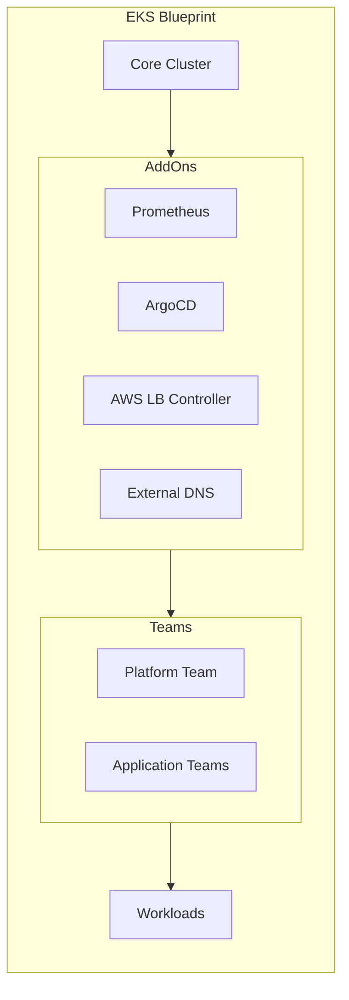

# How to Build AWS EKS Blueprints

Author: [nawazdhandala](https://www.github.com/nawazdhandala)

Tags: AWS, EKS, Kubernetes, Terraform, Cloud Infrastructure

Description: Create reusable AWS EKS cluster blueprints with add-ons, teams, and workloads using CDK or Terraform for consistent cluster deployments.

---

Managing Kubernetes clusters at scale is challenging. Every team wants slightly different configurations, add-ons, and security settings. AWS EKS Blueprints solve this by letting you define reusable patterns for cluster deployments. Think of them as templates that include not just the cluster itself, but also the entire ecosystem of tools your teams need.

## What Are EKS Blueprints?

EKS Blueprints are a framework for building consistent, production-ready EKS clusters. They handle the boring but critical stuff: networking, logging, monitoring, security policies, and add-on management. Instead of writing hundreds of lines of Terraform or CDK code for each cluster, you compose pre-built modules.



## Getting Started with Terraform

The Terraform approach is more widely adopted and works well with existing infrastructure-as-code practices. Let's build a complete blueprint.

### Project Structure

Organize your blueprint like this:

```
eks-blueprints/
  main.tf
  variables.tf
  outputs.tf
  versions.tf
  addons.tf
  teams.tf
```

### Base Configuration

Start with the provider setup and base cluster definition.

```hcl
# versions.tf
# Pin provider versions to avoid unexpected breaking changes
terraform {
  required_version = ">= 1.0"

  required_providers {
    aws = {
      source  = "hashicorp/aws"
      version = ">= 5.0"
    }
    kubernetes = {
      source  = "hashicorp/kubernetes"
      version = ">= 2.20"
    }
    helm = {
      source  = "hashicorp/helm"
      version = ">= 2.9"
    }
  }
}

provider "aws" {
  region = var.aws_region
}
```

```hcl
# variables.tf
# Define inputs that make the blueprint reusable across environments
variable "aws_region" {
  description = "AWS region for the EKS cluster"
  type        = string
  default     = "us-west-2"
}

variable "cluster_name" {
  description = "Name of the EKS cluster"
  type        = string
}

variable "cluster_version" {
  description = "Kubernetes version for the cluster"
  type        = string
  default     = "1.29"
}

variable "vpc_cidr" {
  description = "CIDR block for the VPC"
  type        = string
  default     = "10.0.0.0/16"
}

variable "environment" {
  description = "Environment name (dev, staging, production)"
  type        = string
}
```

### VPC and Cluster Setup

Create the networking foundation and core cluster.

```hcl
# main.tf
# Use the official EKS Blueprints module
module "vpc" {
  source  = "terraform-aws-modules/vpc/aws"
  version = "~> 5.0"

  name = "${var.cluster_name}-vpc"
  cidr = var.vpc_cidr

  # Spread across three availability zones for high availability
  azs             = slice(data.aws_availability_zones.available.names, 0, 3)
  private_subnets = [for k, v in slice(data.aws_availability_zones.available.names, 0, 3) : cidrsubnet(var.vpc_cidr, 4, k)]
  public_subnets  = [for k, v in slice(data.aws_availability_zones.available.names, 0, 3) : cidrsubnet(var.vpc_cidr, 8, k + 48)]

  enable_nat_gateway   = true
  single_nat_gateway   = var.environment != "production"
  enable_dns_hostnames = true

  # Required tags for EKS to discover subnets
  public_subnet_tags = {
    "kubernetes.io/role/elb" = 1
  }

  private_subnet_tags = {
    "kubernetes.io/role/internal-elb" = 1
  }

  tags = local.tags
}

module "eks" {
  source  = "terraform-aws-modules/eks/aws"
  version = "~> 20.0"

  cluster_name    = var.cluster_name
  cluster_version = var.cluster_version

  # Enable public and private API access
  cluster_endpoint_public_access  = true
  cluster_endpoint_private_access = true

  vpc_id     = module.vpc.vpc_id
  subnet_ids = module.vpc.private_subnets

  # Enable IRSA for pod-level IAM permissions
  enable_irsa = true

  # Managed node groups provide easier lifecycle management
  eks_managed_node_groups = {
    # Core system workloads
    system = {
      instance_types = ["m6i.large"]
      min_size       = 2
      max_size       = 4
      desired_size   = 2

      labels = {
        role = "system"
      }

      taints = [{
        key    = "CriticalAddonsOnly"
        value  = "true"
        effect = "NO_SCHEDULE"
      }]
    }

    # Application workloads
    application = {
      instance_types = ["m6i.xlarge"]
      min_size       = 2
      max_size       = 10
      desired_size   = 3

      labels = {
        role = "application"
      }
    }
  }

  tags = local.tags
}

data "aws_availability_zones" "available" {}

locals {
  tags = {
    Environment = var.environment
    ManagedBy   = "terraform"
    Blueprint   = "eks-blueprint"
  }
}
```

## Adding Essential Add-Ons

Add-ons are where blueprints shine. Instead of manually configuring each tool, define them declaratively.

```hcl
# addons.tf
# Configure Kubernetes and Helm providers to talk to our new cluster
provider "kubernetes" {
  host                   = module.eks.cluster_endpoint
  cluster_ca_certificate = base64decode(module.eks.cluster_certificate_authority_data)

  exec {
    api_version = "client.authentication.k8s.io/v1beta1"
    command     = "aws"
    args        = ["eks", "get-token", "--cluster-name", module.eks.cluster_name]
  }
}

provider "helm" {
  kubernetes {
    host                   = module.eks.cluster_endpoint
    cluster_ca_certificate = base64decode(module.eks.cluster_certificate_authority_data)

    exec {
      api_version = "client.authentication.k8s.io/v1beta1"
      command     = "aws"
      args        = ["eks", "get-token", "--cluster-name", module.eks.cluster_name]
    }
  }
}

# AWS Load Balancer Controller for ingress
module "aws_load_balancer_controller" {
  source = "aws-ia/eks-blueprints-addons/aws"

  cluster_name      = module.eks.cluster_name
  cluster_endpoint  = module.eks.cluster_endpoint
  cluster_version   = module.eks.cluster_version
  oidc_provider_arn = module.eks.oidc_provider_arn

  enable_aws_load_balancer_controller = true
  aws_load_balancer_controller = {
    # Tolerate system node taints so it runs on dedicated nodes
    values = [yamlencode({
      tolerations = [{
        key      = "CriticalAddonsOnly"
        operator = "Exists"
        effect   = "NoSchedule"
      }]
      nodeSelector = {
        role = "system"
      }
    })]
  }
}

# External DNS for automatic DNS record management
module "external_dns" {
  source = "aws-ia/eks-blueprints-addons/aws"

  cluster_name      = module.eks.cluster_name
  cluster_endpoint  = module.eks.cluster_endpoint
  cluster_version   = module.eks.cluster_version
  oidc_provider_arn = module.eks.oidc_provider_arn

  enable_external_dns = true
  external_dns = {
    values = [yamlencode({
      provider   = "aws"
      txtOwnerId = var.cluster_name
      policy     = "sync"
    })]
  }

  external_dns_route53_zone_arns = var.route53_zone_arns
}

# Karpenter for intelligent autoscaling
module "karpenter" {
  source = "aws-ia/eks-blueprints-addons/aws"

  cluster_name      = module.eks.cluster_name
  cluster_endpoint  = module.eks.cluster_endpoint
  cluster_version   = module.eks.cluster_version
  oidc_provider_arn = module.eks.oidc_provider_arn

  enable_karpenter = true
  karpenter = {
    repository_username = data.aws_ecrpublic_authorization_token.token.user_name
    repository_password = data.aws_ecrpublic_authorization_token.token.password
  }
  karpenter_node = {
    iam_role_use_name_prefix = false
  }
}

data "aws_ecrpublic_authorization_token" "token" {
  provider = aws.virginia
}

# Provider alias for ECR public (always us-east-1)
provider "aws" {
  alias  = "virginia"
  region = "us-east-1"
}
```

## Configuring Teams

Teams let you define namespaces with specific RBAC policies, quotas, and network policies.

```hcl
# teams.tf
# Platform team has cluster-admin access
resource "kubernetes_namespace" "platform" {
  metadata {
    name = "platform"
    labels = {
      team = "platform"
    }
  }
}

resource "kubernetes_cluster_role_binding" "platform_admin" {
  metadata {
    name = "platform-admin"
  }

  role_ref {
    api_group = "rbac.authorization.k8s.io"
    kind      = "ClusterRole"
    name      = "cluster-admin"
  }

  subject {
    kind      = "Group"
    name      = "platform-team"
    api_group = "rbac.authorization.k8s.io"
  }
}

# Application teams get namespace-scoped access
resource "kubernetes_namespace" "app_teams" {
  for_each = var.application_teams

  metadata {
    name = each.key
    labels = {
      team        = each.key
      environment = var.environment
    }
  }
}

# Resource quotas prevent any single team from consuming all resources
resource "kubernetes_resource_quota" "team_quota" {
  for_each = var.application_teams

  metadata {
    name      = "${each.key}-quota"
    namespace = kubernetes_namespace.app_teams[each.key].metadata[0].name
  }

  spec {
    hard = {
      "requests.cpu"    = each.value.cpu_quota
      "requests.memory" = each.value.memory_quota
      "pods"            = each.value.pod_quota
    }
  }
}

# Network policies isolate team namespaces by default
resource "kubernetes_network_policy" "team_isolation" {
  for_each = var.application_teams

  metadata {
    name      = "default-deny"
    namespace = kubernetes_namespace.app_teams[each.key].metadata[0].name
  }

  spec {
    pod_selector {}

    policy_types = ["Ingress", "Egress"]

    # Allow DNS
    egress {
      to {
        namespace_selector {
          match_labels = {
            "kubernetes.io/metadata.name" = "kube-system"
          }
        }
        pod_selector {
          match_labels = {
            "k8s-app" = "kube-dns"
          }
        }
      }
      ports {
        port     = 53
        protocol = "UDP"
      }
    }

    # Allow same-namespace traffic
    ingress {
      from {
        pod_selector {}
      }
    }
    egress {
      to {
        pod_selector {}
      }
    }
  }
}
```

Add the team variables:

```hcl
# Add to variables.tf
variable "application_teams" {
  description = "Map of application teams and their resource quotas"
  type = map(object({
    cpu_quota    = string
    memory_quota = string
    pod_quota    = string
  }))
  default = {
    "team-alpha" = {
      cpu_quota    = "10"
      memory_quota = "20Gi"
      pod_quota    = "50"
    }
    "team-beta" = {
      cpu_quota    = "8"
      memory_quota = "16Gi"
      pod_quota    = "40"
    }
  }
}

variable "route53_zone_arns" {
  description = "Route53 zone ARNs for External DNS"
  type        = list(string)
  default     = []
}
```

## Deploying the Blueprint

With everything defined, deployment is straightforward.

```bash
# Initialize Terraform and download modules
terraform init

# Review what will be created
terraform plan -var="cluster_name=production-eks" -var="environment=production"

# Apply the blueprint
terraform apply -var="cluster_name=production-eks" -var="environment=production"
```

After deployment, configure kubectl:

```bash
# Update kubeconfig to connect to the new cluster
aws eks update-kubeconfig --name production-eks --region us-west-2

# Verify the cluster is healthy
kubectl get nodes
kubectl get pods -A
```

## Extending with GitOps

For production environments, combine blueprints with ArgoCD for continuous deployment.

```hcl
# Add to addons.tf
module "argocd" {
  source = "aws-ia/eks-blueprints-addons/aws"

  cluster_name      = module.eks.cluster_name
  cluster_endpoint  = module.eks.cluster_endpoint
  cluster_version   = module.eks.cluster_version
  oidc_provider_arn = module.eks.oidc_provider_arn

  enable_argocd = true
  argocd = {
    values = [yamlencode({
      server = {
        service = {
          type = "LoadBalancer"
        }
      }
    })]
  }
}
```

## Best Practices

A few lessons learned from running blueprints in production:

1. **Version your modules** - Pin exact versions in production to avoid surprise updates
2. **Use workspaces** - Terraform workspaces let you manage multiple clusters from one codebase
3. **Separate state** - Keep blueprint state separate from application state
4. **Test upgrades** - Always test cluster version upgrades in a non-production environment first
5. **Document deviations** - When teams need non-standard configurations, document why

---

EKS Blueprints turn weeks of cluster setup into hours. They enforce consistency, reduce configuration drift, and let platform teams focus on improving the platform rather than fighting fires. Start with the basics, add add-ons as needed, and iterate based on what your teams actually use.
