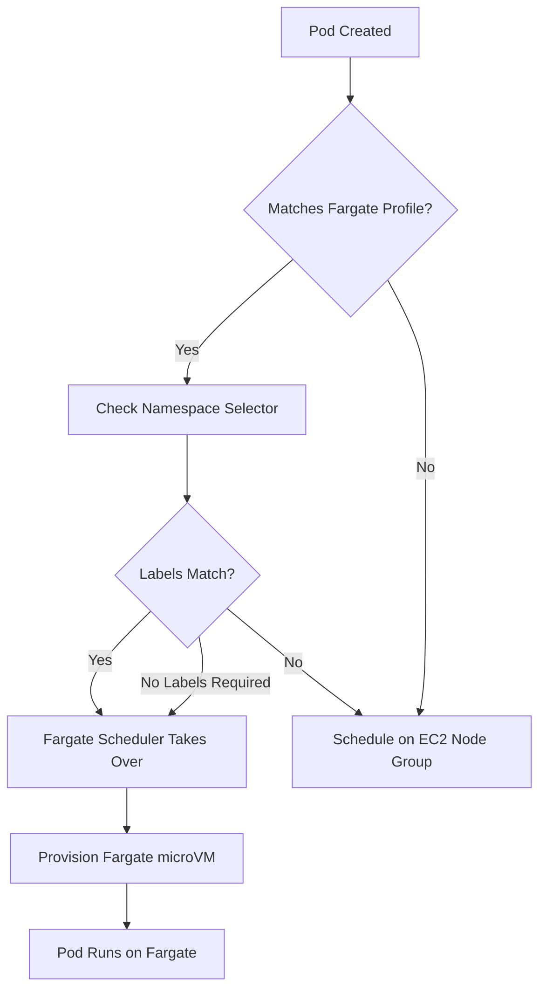
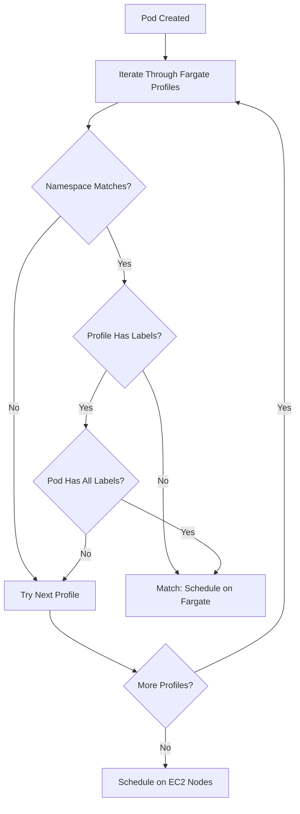

# How to Create AWS EKS Fargate Profiles

Author: [nawazdhandala](https://github.com/nawazdhandala)

Tags: AWS, EKS, Fargate, Serverless

Description: A practical guide to configuring Fargate profiles in Amazon EKS for serverless Kubernetes workloads, covering eksctl, Terraform, selectors, and IAM setup.

---

Running Kubernetes without managing nodes sounds too good to be true. With EKS Fargate profiles, it is not. AWS handles the compute layer entirely. You define which pods run on Fargate through profiles, and AWS provisions right-sized instances on demand. No EC2 patching. No capacity planning. No idle node costs.

This guide walks through creating Fargate profiles using both eksctl and Terraform, explains how selectors work, and covers the IAM roles that make it all function.

## How Fargate Scheduling Works

When a pod gets created in EKS, the Fargate scheduler evaluates it against your profiles. If the pod matches a profile selector (namespace plus optional labels), Fargate provisions a dedicated microVM for that pod. If no profile matches, the pod runs on your managed or self-managed node groups instead.



Each Fargate pod runs in isolation. No sharing compute with other pods. This makes Fargate excellent for multi-tenant workloads and batch jobs where you want strong isolation without managing node taints.

## Prerequisites

Before creating Fargate profiles, you need:

- An existing EKS cluster (version 1.24 or later recommended)
- IAM permissions to create roles and manage EKS
- eksctl 0.170.0+ or Terraform 1.0+ with the AWS provider
- kubectl configured to talk to your cluster

## Creating Fargate Profiles with eksctl

eksctl makes Fargate profile creation straightforward. You can create profiles during cluster creation or add them to existing clusters.

### Create a Profile for a Single Namespace

```bash
eksctl create fargateprofile \
  --cluster my-cluster \
  --name fp-default \
  --namespace default
```

This profile schedules all pods in the `default` namespace on Fargate. eksctl automatically creates the required pod execution IAM role.

### Create a Profile with Label Selectors

When you need finer control, add label selectors. Only pods matching both the namespace and labels will run on Fargate.

```bash
eksctl create fargateprofile \
  --cluster my-cluster \
  --name fp-batch-jobs \
  --namespace jobs \
  --labels workload=batch,environment=production
```

Pods must have both labels to match:

```yaml
apiVersion: v1
kind: Pod
metadata:
  name: data-processor
  namespace: jobs
  labels:
    workload: batch
    environment: production
spec:
  containers:
    - name: processor
      image: myapp/processor:latest
```

### Create Multiple Profiles via Config File

For production setups, define profiles in a YAML config:

```yaml
# cluster-config.yaml
apiVersion: eksctl.io/v1alpha5
kind: ClusterConfig

metadata:
  name: my-cluster
  region: us-west-2

fargateProfiles:
  - name: fp-default
    selectors:
      - namespace: default
      - namespace: kube-system
        labels:
          k8s-app: kube-dns

  - name: fp-applications
    selectors:
      - namespace: production
        labels:
          compute: fargate
      - namespace: staging
        labels:
          compute: fargate

  - name: fp-batch
    selectors:
      - namespace: batch-jobs
```

Apply the config:

```bash
eksctl create fargateprofile -f cluster-config.yaml
```

### List and Delete Profiles

```bash
# List all profiles
eksctl get fargateprofile --cluster my-cluster

# Delete a profile
eksctl delete fargateprofile --cluster my-cluster --name fp-batch
```

## Creating Fargate Profiles with Terraform

Terraform gives you infrastructure-as-code benefits: version control, plan/apply workflows, and integration with your existing AWS resources.

### Basic Terraform Configuration

```hcl
# providers.tf
terraform {
  required_providers {
    aws = {
      source  = "hashicorp/aws"
      version = "~> 5.0"
    }
  }
}

provider "aws" {
  region = "us-west-2"
}
```

### IAM Role for Fargate Pod Execution

Fargate needs an IAM role to pull container images and write logs. This role gets assumed by the Fargate infrastructure, not your pods.

```hcl
# iam.tf
data "aws_iam_policy_document" "fargate_assume_role" {
  statement {
    effect = "Allow"
    principals {
      type        = "Service"
      identifiers = ["eks-fargate-pods.amazonaws.com"]
    }
    actions = ["sts:AssumeRole"]
    condition {
      test     = "ArnLike"
      variable = "aws:SourceArn"
      values   = ["arn:aws:eks:${var.region}:${data.aws_caller_identity.current.account_id}:fargateprofile/${var.cluster_name}/*"]
    }
  }
}

resource "aws_iam_role" "fargate_pod_execution" {
  name               = "${var.cluster_name}-fargate-pod-execution"
  assume_role_policy = data.aws_iam_policy_document.fargate_assume_role.json
}

resource "aws_iam_role_policy_attachment" "fargate_pod_execution" {
  role       = aws_iam_role.fargate_pod_execution.name
  policy_arn = "arn:aws:iam::aws:policy/AmazonEKSFargatePodExecutionRolePolicy"
}

data "aws_caller_identity" "current" {}
```

### Simple Fargate Profile

```hcl
# fargate-profiles.tf
resource "aws_eks_fargate_profile" "default" {
  cluster_name           = var.cluster_name
  fargate_profile_name   = "fp-default"
  pod_execution_role_arn = aws_iam_role.fargate_pod_execution.arn
  subnet_ids             = var.private_subnet_ids

  selector {
    namespace = "default"
  }
}
```

### Profile with Multiple Selectors

A single profile can have multiple selectors. A pod matching any selector runs on Fargate.

```hcl
resource "aws_eks_fargate_profile" "applications" {
  cluster_name           = var.cluster_name
  fargate_profile_name   = "fp-applications"
  pod_execution_role_arn = aws_iam_role.fargate_pod_execution.arn
  subnet_ids             = var.private_subnet_ids

  selector {
    namespace = "production"
    labels = {
      compute = "fargate"
    }
  }

  selector {
    namespace = "staging"
    labels = {
      compute = "fargate"
    }
  }

  selector {
    namespace = "development"
    labels = {
      compute     = "fargate"
      cost-center = "engineering"
    }
  }

  tags = {
    Environment = "shared"
    ManagedBy   = "terraform"
  }
}
```

### CoreDNS on Fargate

By default, CoreDNS runs on EC2 nodes. To run it on Fargate, create a profile and patch the deployment.

```hcl
resource "aws_eks_fargate_profile" "coredns" {
  cluster_name           = var.cluster_name
  fargate_profile_name   = "fp-coredns"
  pod_execution_role_arn = aws_iam_role.fargate_pod_execution.arn
  subnet_ids             = var.private_subnet_ids

  selector {
    namespace = "kube-system"
    labels = {
      k8s-app = "kube-dns"
    }
  }
}
```

After applying, patch CoreDNS to remove the EC2 compute type annotation:

```bash
kubectl patch deployment coredns \
  -n kube-system \
  --type json \
  -p='[{"op": "remove", "path": "/spec/template/metadata/annotations/eks.amazonaws.com~1compute-type"}]'

# Restart CoreDNS pods
kubectl rollout restart deployment coredns -n kube-system
```

### Complete Terraform Module

Here is a reusable module structure:

```hcl
# modules/fargate-profile/variables.tf
variable "cluster_name" {
  description = "Name of the EKS cluster"
  type        = string
}

variable "profile_name" {
  description = "Name of the Fargate profile"
  type        = string
}

variable "subnet_ids" {
  description = "List of subnet IDs for Fargate pods"
  type        = list(string)
}

variable "pod_execution_role_arn" {
  description = "ARN of the pod execution IAM role"
  type        = string
}

variable "selectors" {
  description = "List of selectors for the profile"
  type = list(object({
    namespace = string
    labels    = optional(map(string), {})
  }))
}

variable "tags" {
  description = "Tags to apply to the profile"
  type        = map(string)
  default     = {}
}
```

```hcl
# modules/fargate-profile/main.tf
resource "aws_eks_fargate_profile" "this" {
  cluster_name           = var.cluster_name
  fargate_profile_name   = var.profile_name
  pod_execution_role_arn = var.pod_execution_role_arn
  subnet_ids             = var.subnet_ids

  dynamic "selector" {
    for_each = var.selectors
    content {
      namespace = selector.value.namespace
      labels    = selector.value.labels
    }
  }

  tags = var.tags
}
```

```hcl
# Usage in root module
module "fargate_batch" {
  source = "./modules/fargate-profile"

  cluster_name           = aws_eks_cluster.main.name
  profile_name           = "fp-batch"
  subnet_ids             = module.vpc.private_subnets
  pod_execution_role_arn = aws_iam_role.fargate_pod_execution.arn

  selectors = [
    {
      namespace = "batch"
      labels    = { tier = "compute" }
    },
    {
      namespace = "batch"
      labels    = { tier = "memory" }
    }
  ]

  tags = {
    Team = "data-engineering"
  }
}
```

## Understanding Profile Selectors

Selectors determine which pods land on Fargate. Getting them right is critical.

### Selector Logic



### Rules to Remember

1. **Namespace is required.** Every selector must specify a namespace.

2. **Labels are optional but additive.** If you specify labels, the pod must have all of them. Missing one label means no match.

3. **Multiple selectors in one profile use OR logic.** A pod matching any selector runs on Fargate.

4. **Multiple profiles are evaluated in order.** First matching profile wins.

5. **Wildcards do not exist.** You cannot use `*` for namespaces or labels.

### Example Selector Scenarios

**Scenario 1: All pods in a namespace**

```hcl
selector {
  namespace = "analytics"
}
```

Every pod in `analytics` runs on Fargate. No labels required.

**Scenario 2: Only labeled pods**

```hcl
selector {
  namespace = "production"
  labels = {
    fargate-enabled = "true"
  }
}
```

Only pods with `fargate-enabled: true` in `production` run on Fargate.

**Scenario 3: Multiple label requirements**

```hcl
selector {
  namespace = "production"
  labels = {
    team        = "payments"
    environment = "prod"
    tier        = "backend"
  }
}
```

Pods need all three labels to match.

## IAM Roles Deep Dive

Two IAM roles matter for Fargate:

### Pod Execution Role

This role allows Fargate to pull images from ECR and write logs to CloudWatch. It is assumed by the Fargate service, not your application.

Required policy: `AmazonEKSFargatePodExecutionRolePolicy`

Trust relationship:

```json
{
  "Version": "2012-10-17",
  "Statement": [
    {
      "Effect": "Allow",
      "Principal": {
        "Service": "eks-fargate-pods.amazonaws.com"
      },
      "Action": "sts:AssumeRole",
      "Condition": {
        "ArnLike": {
          "aws:SourceArn": "arn:aws:eks:us-west-2:123456789012:fargateprofile/my-cluster/*"
        }
      }
    }
  ]
}
```

### Pod IAM Role (IRSA)

For your application to access AWS services (S3, DynamoDB, SQS), use IAM Roles for Service Accounts (IRSA). This works identically on Fargate and EC2 nodes.

```hcl
# Create OIDC provider for the cluster
data "tls_certificate" "cluster" {
  url = aws_eks_cluster.main.identity[0].oidc[0].issuer
}

resource "aws_iam_openid_connect_provider" "cluster" {
  client_id_list  = ["sts.amazonaws.com"]
  thumbprint_list = [data.tls_certificate.cluster.certificates[0].sha1_fingerprint]
  url             = aws_eks_cluster.main.identity[0].oidc[0].issuer
}

# Create role for your application
resource "aws_iam_role" "app_role" {
  name = "my-app-role"

  assume_role_policy = jsonencode({
    Version = "2012-10-17"
    Statement = [{
      Effect = "Allow"
      Principal = {
        Federated = aws_iam_openid_connect_provider.cluster.arn
      }
      Action = "sts:AssumeRoleWithWebIdentity"
      Condition = {
        StringEquals = {
          "${replace(aws_eks_cluster.main.identity[0].oidc[0].issuer, "https://", "")}:sub" = "system:serviceaccount:production:my-app"
        }
      }
    }]
  })
}

# Attach policies your app needs
resource "aws_iam_role_policy_attachment" "app_s3" {
  role       = aws_iam_role.app_role.name
  policy_arn = "arn:aws:iam::aws:policy/AmazonS3ReadOnlyAccess"
}
```

Annotate the Kubernetes service account:

```yaml
apiVersion: v1
kind: ServiceAccount
metadata:
  name: my-app
  namespace: production
  annotations:
    eks.amazonaws.com/role-arn: arn:aws:iam::123456789012:role/my-app-role
```

## Networking Considerations

Fargate pods only run in private subnets. You must specify subnet IDs when creating profiles.

### Subnet Requirements

- Subnets must be private (no direct internet gateway route)
- Subnets need NAT gateway access for pulling images from public registries
- Subnets must have available IP addresses (Fargate uses ENIs)
- Tag subnets appropriately: `kubernetes.io/cluster/my-cluster: shared`

### Security Groups

Fargate pods use the cluster security group by default. You can specify additional security groups via pod annotations:

```yaml
apiVersion: v1
kind: Pod
metadata:
  name: my-pod
  annotations:
    eks.amazonaws.com/security-groups: sg-12345678,sg-87654321
```

## Limitations to Know

Fargate is powerful but not universal. Know these constraints:

1. **No DaemonSets.** Fargate pods run in isolation. Node-level agents need EC2 nodes.

2. **No privileged containers.** `securityContext.privileged: true` fails on Fargate.

3. **No HostNetwork or HostPort.** Pods cannot bind to node IPs.

4. **No GPUs.** GPU workloads require EC2 node groups.

5. **No persistent volumes with EBS.** Use EFS for persistent storage on Fargate.

6. **20 GB ephemeral storage cap.** Default is 20 GB; configurable up to 175 GB.

7. **Cold start latency.** First pod in a profile takes 30-60 seconds to start.

## Monitoring Fargate Workloads

### CloudWatch Container Insights

Enable Container Insights for Fargate metrics:

```bash
aws eks update-cluster-config \
  --name my-cluster \
  --logging '{"clusterLogging":[{"types":["api","audit","authenticator","controllerManager","scheduler"],"enabled":true}]}'
```

### Fluent Bit for Log Forwarding

Deploy Fluent Bit as a sidecar since you cannot run it as a DaemonSet:

```yaml
apiVersion: v1
kind: ConfigMap
metadata:
  name: fluent-bit-config
  namespace: production
data:
  fluent-bit.conf: |
    [SERVICE]
        Flush         1
        Log_Level     info
        Daemon        off

    [INPUT]
        Name              tail
        Path              /var/log/containers/*.log
        Parser            docker
        Tag               kube.*
        Refresh_Interval  5

    [OUTPUT]
        Name              cloudwatch_logs
        Match             *
        region            us-west-2
        log_group_name    /aws/eks/my-cluster/fargate
        log_stream_prefix fargate-
        auto_create_group true
```

## Troubleshooting

### Pod Stuck in Pending

Check if a profile matches:

```bash
kubectl describe pod my-pod

# Look for events mentioning Fargate
# If no Fargate profile matches, you'll see scheduling errors
```

Verify profile selectors:

```bash
aws eks describe-fargate-profile \
  --cluster-name my-cluster \
  --fargate-profile-name fp-default
```

### CoreDNS Not Starting

CoreDNS needs the compute-type annotation removed:

```bash
kubectl get deployment coredns -n kube-system -o yaml | grep -A2 annotations
```

If you see `eks.amazonaws.com/compute-type: ec2`, patch it:

```bash
kubectl patch deployment coredns \
  -n kube-system \
  --type json \
  -p='[{"op": "remove", "path": "/spec/template/metadata/annotations/eks.amazonaws.com~1compute-type"}]'
```

### IAM Permission Errors

Check the pod execution role has the required policy:

```bash
aws iam list-attached-role-policies \
  --role-name my-cluster-fargate-pod-execution
```

Verify the trust policy allows eks-fargate-pods.amazonaws.com.

## When to Use Fargate vs EC2 Nodes

| Use Fargate | Use EC2 Nodes |
|-------------|---------------|
| Batch jobs with variable load | Workloads needing GPUs |
| Multi-tenant isolation | DaemonSet requirements |
| Unpredictable scaling | Privileged containers |
| Dev/test environments | HostNetwork access |
| Stateless microservices | EBS persistent volumes |
| Cost optimization for spiky workloads | Predictable, steady-state workloads |

Many clusters use both. Run your control plane components and system workloads on managed node groups. Use Fargate for application pods that benefit from isolation and elastic scaling.

---

Fargate profiles turn Kubernetes node management into a configuration problem instead of an operational burden. Define your selectors, set up IAM, and let AWS handle the rest. Start with a profile for your test namespace, verify pods schedule correctly, then expand to production workloads.
