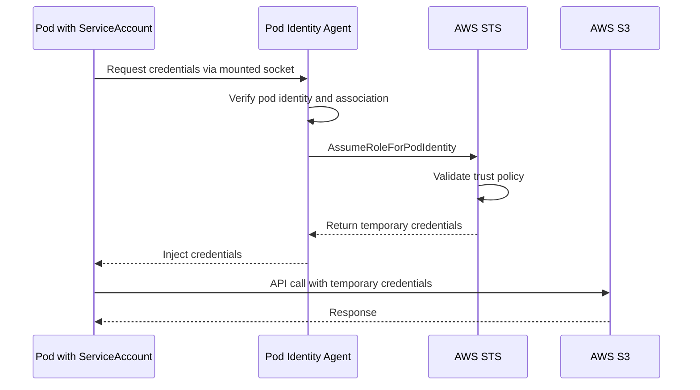
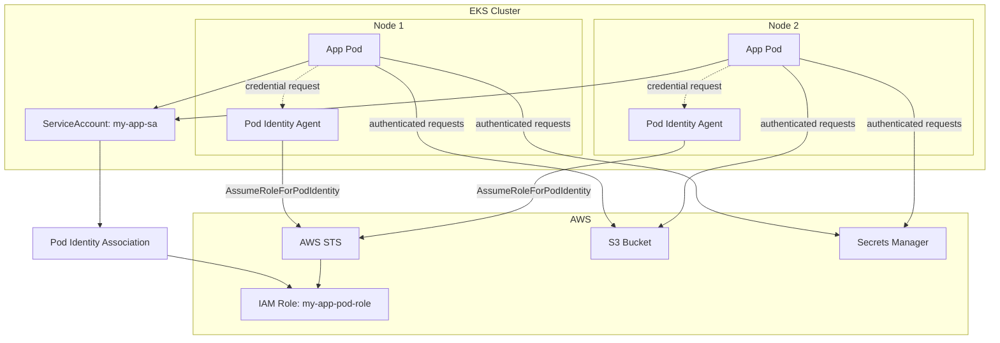

# How to Create AWS EKS Pod Identity

Author: [nawazdhandala](https://github.com/nawazdhandala)

Tags: AWS, EKS, Kubernetes, Security

Description: A practical guide to configuring EKS Pod Identity for secure workload authentication to AWS services without long-lived credentials.

---

Your Kubernetes pods need to talk to AWS services like S3, DynamoDB, and Secrets Manager. The old way was to embed AWS access keys in your deployments. That approach is a security nightmare. EKS Pod Identity is the modern, secure alternative that assigns IAM roles directly to pods.

## Understanding the Authentication Problem

Pods running on EKS often need AWS permissions. Consider these common scenarios:

- A backend service reading configuration from Secrets Manager
- A worker pod processing files from S3
- An application writing metrics to CloudWatch

Before Pod Identity, teams used these approaches:

1. **Static credentials** - Access keys stored in Kubernetes Secrets (risky, hard to rotate)
2. **Node IAM roles** - Every pod on a node shares the same permissions (overly permissive)
3. **IRSA** - IAM Roles for Service Accounts (works, but complex to set up)

EKS Pod Identity improves on all of these.

## Pod Identity vs IRSA Comparison

Both Pod Identity and IRSA solve the same problem, but they differ in implementation complexity and operational overhead.

| Feature | Pod Identity | IRSA |
|---------|-------------|------|
| OIDC Provider Required | No | Yes |
| IAM Trust Policy Complexity | Simple | Complex with OIDC conditions |
| Cross-Account Support | Native | Requires additional setup |
| Setup Steps | 3 steps | 6+ steps |
| AWS SDK Support | All modern SDKs | All modern SDKs |
| EKS Add-on Required | Yes | No |
| Credential Refresh | Automatic | Automatic |

### When to Use Each

**Choose Pod Identity when:**
- Starting fresh on EKS 1.24+
- You want simpler IAM trust policies
- Cross-account access is a requirement
- You prefer managed add-ons

**Choose IRSA when:**
- Running older EKS versions (pre-1.24)
- You already have IRSA working and do not want to migrate
- You need fine-grained OIDC claim conditions

## How Pod Identity Works



The Pod Identity Agent runs as a DaemonSet on every node. When a pod needs AWS credentials, the SDK contacts the agent through a mounted Unix socket. The agent verifies the pod's service account, calls STS to assume the configured IAM role, and returns temporary credentials to the pod.

## Prerequisites

Before configuring Pod Identity, ensure you have:

```bash
# Check your EKS cluster version (must be 1.24+)
aws eks describe-cluster \
  --name my-cluster \
  --query "cluster.version"

# Verify kubectl access
kubectl get nodes

# Check if Pod Identity Agent add-on is installed
aws eks describe-addon \
  --cluster-name my-cluster \
  --addon-name eks-pod-identity-agent
```

## Step 1: Install the Pod Identity Agent Add-on

The Pod Identity Agent must run on your cluster to handle credential requests.

```bash
# Install the Pod Identity Agent add-on
aws eks create-addon \
  --cluster-name my-cluster \
  --addon-name eks-pod-identity-agent \
  --addon-version v1.3.4-eksbuild.1

# Wait for the add-on to become active
aws eks describe-addon \
  --cluster-name my-cluster \
  --addon-name eks-pod-identity-agent \
  --query "addon.status"
```

Verify the agent pods are running:

```bash
# Check that agent pods are running on each node
kubectl get pods -n kube-system -l app.kubernetes.io/name=eks-pod-identity-agent

# Expected output shows one pod per node
NAME                              READY   STATUS    RESTARTS   AGE
eks-pod-identity-agent-7kx2m      1/1     Running   0          2m
eks-pod-identity-agent-9qz4n      1/1     Running   0          2m
eks-pod-identity-agent-xr8p1      1/1     Running   0          2m
```

## Step 2: Create the IAM Role

Create an IAM role that your pods will assume. The trust policy for Pod Identity is simpler than IRSA.

### IAM Trust Policy

```json
{
  "Version": "2012-10-17",
  "Statement": [
    {
      "Effect": "Allow",
      "Principal": {
        "Service": "pods.eks.amazonaws.com"
      },
      "Action": [
        "sts:AssumeRole",
        "sts:TagSession"
      ]
    }
  ]
}
```

Save this as `trust-policy.json` and create the role:

```bash
# Create the IAM role with the Pod Identity trust policy
aws iam create-role \
  --role-name my-app-pod-role \
  --assume-role-policy-document file://trust-policy.json \
  --description "Role for my-app pods to access AWS services"
```

### Attach Permissions Policy

Create a policy with the permissions your application needs:

```json
{
  "Version": "2012-10-17",
  "Statement": [
    {
      "Effect": "Allow",
      "Action": [
        "s3:GetObject",
        "s3:PutObject",
        "s3:ListBucket"
      ],
      "Resource": [
        "arn:aws:s3:::my-app-bucket",
        "arn:aws:s3:::my-app-bucket/*"
      ]
    },
    {
      "Effect": "Allow",
      "Action": [
        "secretsmanager:GetSecretValue"
      ],
      "Resource": [
        "arn:aws:secretsmanager:us-west-2:123456789012:secret:my-app/*"
      ]
    }
  ]
}
```

Save as `permissions-policy.json` and attach it:

```bash
# Create the permissions policy
aws iam create-policy \
  --policy-name my-app-pod-policy \
  --policy-document file://permissions-policy.json

# Attach the policy to the role
aws iam attach-role-policy \
  --role-name my-app-pod-role \
  --policy-arn arn:aws:iam::123456789012:policy/my-app-pod-policy
```

## Step 3: Create the Kubernetes Service Account

Service accounts link Kubernetes identities to IAM roles.

```yaml
# service-account.yaml
apiVersion: v1
kind: ServiceAccount
metadata:
  name: my-app-sa
  namespace: production
  # Note: Pod Identity does NOT require annotations on the service account
  # The association is created separately via AWS API
```

Apply the service account:

```bash
# Create the namespace if it does not exist
kubectl create namespace production --dry-run=client -o yaml | kubectl apply -f -

# Apply the service account
kubectl apply -f service-account.yaml
```

## Step 4: Create the Pod Identity Association

This is the key step that connects your Kubernetes service account to the IAM role.

```bash
# Create the pod identity association
aws eks create-pod-identity-association \
  --cluster-name my-cluster \
  --namespace production \
  --service-account my-app-sa \
  --role-arn arn:aws:iam::123456789012:role/my-app-pod-role
```

Verify the association:

```bash
# List all pod identity associations for your cluster
aws eks list-pod-identity-associations \
  --cluster-name my-cluster

# Get details of a specific association
aws eks describe-pod-identity-association \
  --cluster-name my-cluster \
  --association-id a-1234567890abcdef0
```

## Step 5: Deploy Your Application

Configure your deployment to use the service account:

```yaml
# deployment.yaml
apiVersion: apps/v1
kind: Deployment
metadata:
  name: my-app
  namespace: production
spec:
  replicas: 3
  selector:
    matchLabels:
      app: my-app
  template:
    metadata:
      labels:
        app: my-app
    spec:
      # This service account has the Pod Identity association
      serviceAccountName: my-app-sa
      containers:
        - name: my-app
          image: my-app:latest
          # No AWS credentials in environment variables
          # The SDK automatically discovers credentials via Pod Identity
          env:
            - name: AWS_REGION
              value: us-west-2
```

Apply the deployment:

```bash
kubectl apply -f deployment.yaml
```

## Verifying Pod Identity Works

Test that your pods can access AWS services.

### Check Credentials from Inside a Pod

```bash
# Exec into a running pod
kubectl exec -it deployment/my-app -n production -- /bin/sh

# Inside the pod, check for credentials
# The AWS SDK reads these automatically
env | grep AWS

# Test access to S3
aws s3 ls s3://my-app-bucket/

# Test access to Secrets Manager
aws secretsmanager get-secret-value \
  --secret-id my-app/config
```

### Debug Credential Issues

```bash
# Check if the pod has the correct service account
kubectl get pod -n production -l app=my-app \
  -o jsonpath='{.items[0].spec.serviceAccountName}'

# View pod identity agent logs for errors
kubectl logs -n kube-system -l app.kubernetes.io/name=eks-pod-identity-agent

# Verify the association exists
aws eks list-pod-identity-associations \
  --cluster-name my-cluster \
  --namespace production \
  --service-account my-app-sa
```

## Architecture Overview



## Cross-Account Access

Pod Identity simplifies cross-account scenarios. Your pods in Account A can assume a role in Account B.

### Step 1: Create Role in Target Account (Account B)

```json
{
  "Version": "2012-10-17",
  "Statement": [
    {
      "Effect": "Allow",
      "Principal": {
        "AWS": "arn:aws:iam::111111111111:root"
      },
      "Action": "sts:AssumeRole",
      "Condition": {
        "StringEquals": {
          "aws:PrincipalTag/eks-cluster-name": "my-cluster",
          "aws:PrincipalTag/kubernetes-namespace": "production",
          "aws:PrincipalTag/kubernetes-service-account": "my-app-sa"
        }
      }
    }
  ]
}
```

### Step 2: Grant AssumeRole Permission

Add to your source account role's permissions policy:

```json
{
  "Version": "2012-10-17",
  "Statement": [
    {
      "Effect": "Allow",
      "Action": "sts:AssumeRole",
      "Resource": "arn:aws:iam::222222222222:role/cross-account-role"
    }
  ]
}
```

### Step 3: Use in Application Code

```python
import boto3

# First, get credentials via Pod Identity (automatic)
sts_client = boto3.client('sts')

# Assume the cross-account role
response = sts_client.assume_role(
    RoleArn='arn:aws:iam::222222222222:role/cross-account-role',
    RoleSessionName='my-app-cross-account'
)

# Create a client with cross-account credentials
s3_client = boto3.client(
    's3',
    aws_access_key_id=response['Credentials']['AccessKeyId'],
    aws_secret_access_key=response['Credentials']['SecretAccessKey'],
    aws_session_token=response['Credentials']['SessionToken']
)

# Access resources in Account B
s3_client.list_buckets()
```

## Migrating from IRSA to Pod Identity

If you have existing IRSA configurations, migrate gradually.

### Migration Steps

1. **Install Pod Identity Agent** - Add the EKS add-on
2. **Update IAM trust policy** - Add Pod Identity principal alongside OIDC
3. **Create associations** - Set up Pod Identity associations
4. **Test** - Verify pods can authenticate both ways
5. **Remove IRSA annotations** - Delete service account annotations
6. **Clean up** - Remove OIDC trust policy statements

### Dual-Mode Trust Policy (During Migration)

```json
{
  "Version": "2012-10-17",
  "Statement": [
    {
      "Effect": "Allow",
      "Principal": {
        "Service": "pods.eks.amazonaws.com"
      },
      "Action": [
        "sts:AssumeRole",
        "sts:TagSession"
      ]
    },
    {
      "Effect": "Allow",
      "Principal": {
        "Federated": "arn:aws:iam::123456789012:oidc-provider/oidc.eks.us-west-2.amazonaws.com/id/EXAMPLED539D4633E53DE1B716D3041E"
      },
      "Action": "sts:AssumeRoleWithWebIdentity",
      "Condition": {
        "StringEquals": {
          "oidc.eks.us-west-2.amazonaws.com/id/EXAMPLED539D4633E53DE1B716D3041E:sub": "system:serviceaccount:production:my-app-sa",
          "oidc.eks.us-west-2.amazonaws.com/id/EXAMPLED539D4633E53DE1B716D3041E:aud": "sts.amazonaws.com"
        }
      }
    }
  ]
}
```

## Terraform Configuration

Automate Pod Identity setup with Terraform.

```hcl
# Create the IAM role for Pod Identity
resource "aws_iam_role" "pod_role" {
  name = "my-app-pod-role"

  assume_role_policy = jsonencode({
    Version = "2012-10-17"
    Statement = [
      {
        Effect = "Allow"
        Principal = {
          Service = "pods.eks.amazonaws.com"
        }
        Action = [
          "sts:AssumeRole",
          "sts:TagSession"
        ]
      }
    ]
  })
}

# Attach permissions to the role
resource "aws_iam_role_policy_attachment" "pod_role_policy" {
  role       = aws_iam_role.pod_role.name
  policy_arn = aws_iam_policy.app_permissions.arn
}

# Install Pod Identity Agent add-on
resource "aws_eks_addon" "pod_identity_agent" {
  cluster_name = aws_eks_cluster.main.name
  addon_name   = "eks-pod-identity-agent"
}

# Create the Pod Identity association
resource "aws_eks_pod_identity_association" "my_app" {
  cluster_name    = aws_eks_cluster.main.name
  namespace       = "production"
  service_account = "my-app-sa"
  role_arn        = aws_iam_role.pod_role.arn
}

# Create the Kubernetes service account
resource "kubernetes_service_account" "my_app" {
  metadata {
    name      = "my-app-sa"
    namespace = "production"
  }
}
```

## Troubleshooting

### Common Issues and Solutions

**Issue: Pods cannot get credentials**

```bash
# Check Pod Identity Agent is running
kubectl get pods -n kube-system -l app.kubernetes.io/name=eks-pod-identity-agent

# Verify association exists
aws eks list-pod-identity-associations --cluster-name my-cluster

# Check agent logs
kubectl logs -n kube-system -l app.kubernetes.io/name=eks-pod-identity-agent --tail=50
```

**Issue: Access denied errors**

```bash
# Verify the IAM role trust policy allows pods.eks.amazonaws.com
aws iam get-role --role-name my-app-pod-role --query "Role.AssumeRolePolicyDocument"

# Check the permissions policy is attached
aws iam list-attached-role-policies --role-name my-app-pod-role

# Test the specific permission
aws iam simulate-principal-policy \
  --policy-source-arn arn:aws:iam::123456789012:role/my-app-pod-role \
  --action-names s3:GetObject \
  --resource-arns arn:aws:s3:::my-app-bucket/*
```

**Issue: Association not found**

```bash
# List associations filtered by namespace and service account
aws eks list-pod-identity-associations \
  --cluster-name my-cluster \
  --namespace production \
  --service-account my-app-sa

# Recreate if missing
aws eks create-pod-identity-association \
  --cluster-name my-cluster \
  --namespace production \
  --service-account my-app-sa \
  --role-arn arn:aws:iam::123456789012:role/my-app-pod-role
```

## Security Best Practices

1. **Principle of least privilege** - Grant only the permissions each workload needs
2. **Separate roles per workload** - Do not share IAM roles between different applications
3. **Use resource-level permissions** - Scope policies to specific S3 buckets, secrets, etc.
4. **Enable CloudTrail logging** - Audit all API calls made by pods
5. **Rotate associations** - Delete and recreate associations when service accounts change
6. **Monitor with AWS Config** - Create rules to detect overly permissive policies

---

EKS Pod Identity removes the complexity of workload authentication. No OIDC providers to manage, no complex trust policies, and no credentials in your deployments. Start with Pod Identity for new workloads and migrate IRSA configurations when you have time.
