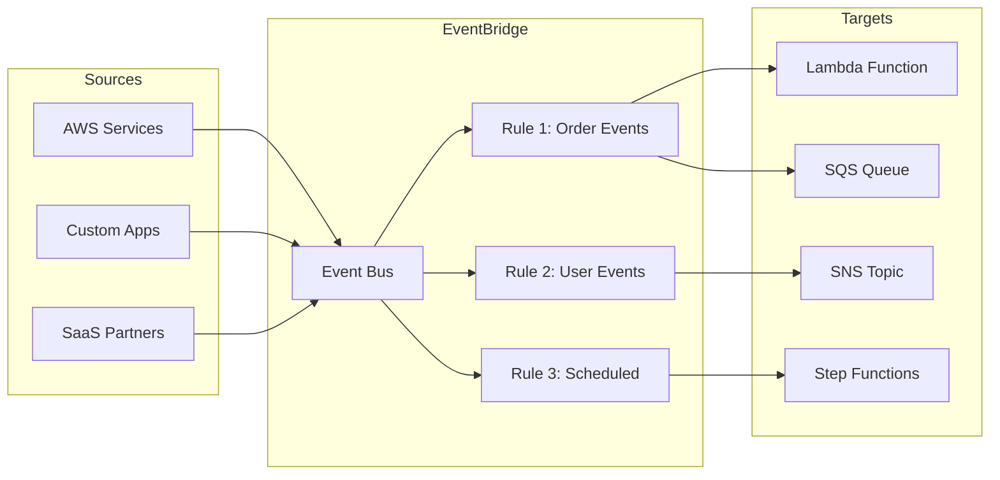
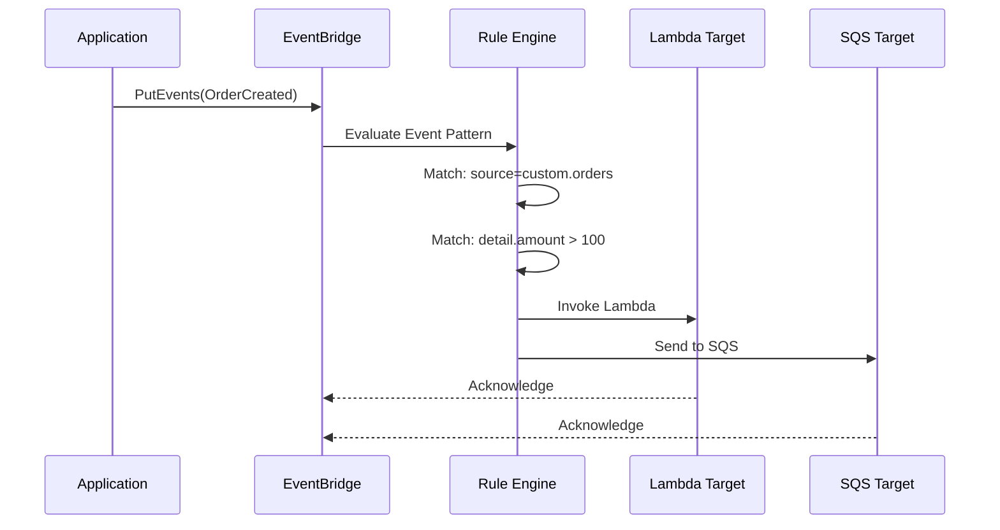

# How to Create AWS EventBridge Rules

Author: [nawazdhandala](https://github.com/nawazdhandala)

Tags: AWS, EventBridge, EventDriven, Serverless

Description: Learn how to create and configure AWS EventBridge rules for routing events to targets with pattern matching and scheduling.

---

AWS EventBridge is a serverless event bus service that enables you to build event-driven architectures. At the heart of EventBridge are rules, which determine how events are routed to targets. In this guide, we will explore how to create and configure EventBridge rules for various use cases.

## Understanding EventBridge Rules

EventBridge rules evaluate incoming events and route them to one or more targets based on pattern matching. Each rule can have up to five targets, and you can create rules that trigger on event patterns or on a schedule.



## Rule Pattern Configuration

### Basic Event Pattern

Event patterns define which events trigger a rule. Here is a basic pattern that matches EC2 instance state change events:

```json
{
  "source": ["aws.ec2"],
  "detail-type": ["EC2 Instance State-change Notification"],
  "detail": {
    "state": ["running", "stopped"]
  }
}
```

### Creating a Rule with AWS CLI

```bash
# Create an EventBridge rule that matches EC2 state changes
aws events put-rule \
  --name "ec2-state-change-rule" \
  --event-pattern '{
    "source": ["aws.ec2"],
    "detail-type": ["EC2 Instance State-change Notification"],
    "detail": {
      "state": ["running", "stopped", "terminated"]
    }
  }' \
  --state ENABLED \
  --description "Captures EC2 instance state changes"
```

## Event Patterns and Content Filtering

EventBridge supports sophisticated pattern matching with various operators.

### Prefix Matching

Match events where a field starts with a specific value:

```json
{
  "source": ["aws.s3"],
  "detail": {
    "bucket": {
      "name": [{"prefix": "prod-"}]
    }
  }
}
```

### Numeric Matching

Filter events based on numeric comparisons:

```json
{
  "source": ["custom.orders"],
  "detail": {
    "amount": [{"numeric": [">=", 100, "<=", 1000]}]
  }
}
```

### Exists Pattern

Match events where a field exists or does not exist:

```json
{
  "source": ["custom.users"],
  "detail": {
    "premium-member": [{"exists": true}],
    "trial-expired": [{"exists": false}]
  }
}
```

### Anything-But Pattern

Match any value except the specified ones:

```json
{
  "source": ["custom.orders"],
  "detail": {
    "status": [{"anything-but": ["cancelled", "refunded"]}]
  }
}
```

### Complex Pattern Example

Combine multiple operators for advanced filtering:

```json
{
  "source": ["custom.ecommerce"],
  "detail-type": ["Order Placed"],
  "detail": {
    "region": ["us-east-1", "us-west-2"],
    "order-value": [{"numeric": [">", 500]}],
    "customer-type": [{"anything-but": "guest"}],
    "product-category": [{"prefix": "electronics-"}]
  }
}
```

## Event Flow Architecture



## Target Configuration Options

### Adding a Lambda Target

```bash
# Add a Lambda function as target for the rule
aws events put-targets \
  --rule "order-processing-rule" \
  --targets '[
    {
      "Id": "order-processor-lambda",
      "Arn": "arn:aws:lambda:us-east-1:123456789012:function:ProcessOrder",
      "Input": "{\"source\": \"eventbridge\"}",
      "RetryPolicy": {
        "MaximumRetryAttempts": 3,
        "MaximumEventAgeInSeconds": 3600
      }
    }
  ]'
```

### Adding an SQS Target with Input Transformation

```bash
# Add an SQS queue as target with input transformation
aws events put-targets \
  --rule "order-processing-rule" \
  --targets '[
    {
      "Id": "order-queue",
      "Arn": "arn:aws:sqs:us-east-1:123456789012:order-queue",
      "InputTransformer": {
        "InputPathsMap": {
          "orderId": "$.detail.order-id",
          "amount": "$.detail.amount",
          "customer": "$.detail.customer-email"
        },
        "InputTemplate": "{\"orderId\": <orderId>, \"amount\": <amount>, \"customerEmail\": <customer>}"
      }
    }
  ]'
```

### Adding Multiple Targets

```bash
# Add multiple targets to a single rule
aws events put-targets \
  --rule "user-signup-rule" \
  --targets '[
    {
      "Id": "welcome-email-lambda",
      "Arn": "arn:aws:lambda:us-east-1:123456789012:function:SendWelcomeEmail"
    },
    {
      "Id": "analytics-queue",
      "Arn": "arn:aws:sqs:us-east-1:123456789012:analytics-queue"
    },
    {
      "Id": "notification-topic",
      "Arn": "arn:aws:sns:us-east-1:123456789012:user-notifications"
    }
  ]'
```

## Scheduled Rules with Cron Expressions

EventBridge supports both rate expressions and cron expressions for scheduled rules.

### Rate Expression Examples

```bash
# Run every 5 minutes
aws events put-rule \
  --name "health-check-rule" \
  --schedule-expression "rate(5 minutes)" \
  --state ENABLED

# Run every hour
aws events put-rule \
  --name "hourly-report-rule" \
  --schedule-expression "rate(1 hour)" \
  --state ENABLED

# Run every day
aws events put-rule \
  --name "daily-cleanup-rule" \
  --schedule-expression "rate(1 day)" \
  --state ENABLED
```

### Cron Expression Examples

EventBridge cron expressions use the format: `cron(minutes hours day-of-month month day-of-week year)`

```bash
# Run at 9:00 AM UTC every Monday through Friday
aws events put-rule \
  --name "weekday-morning-job" \
  --schedule-expression "cron(0 9 ? * MON-FRI *)" \
  --state ENABLED

# Run at midnight on the first day of every month
aws events put-rule \
  --name "monthly-billing-job" \
  --schedule-expression "cron(0 0 1 * ? *)" \
  --state ENABLED

# Run every 15 minutes during business hours (9 AM to 5 PM)
aws events put-rule \
  --name "business-hours-sync" \
  --schedule-expression "cron(0/15 9-17 ? * MON-FRI *)" \
  --state ENABLED

# Run at 6:00 PM on the last Friday of every month
aws events put-rule \
  --name "end-of-month-report" \
  --schedule-expression "cron(0 18 ? * 6L *)" \
  --state ENABLED
```

## Practical Code Examples

### Terraform Configuration

```hcl
# Define an EventBridge rule with Terraform
resource "aws_cloudwatch_event_rule" "order_events" {
  name        = "capture-order-events"
  description = "Capture all order events from the e-commerce application"

  event_pattern = jsonencode({
    source      = ["custom.ecommerce"]
    detail-type = ["Order Created", "Order Updated", "Order Cancelled"]
    detail = {
      region = ["us-east-1", "us-west-2"]
    }
  })

  tags = {
    Environment = "production"
    Team        = "orders"
  }
}

# Add Lambda target
resource "aws_cloudwatch_event_target" "order_processor" {
  rule      = aws_cloudwatch_event_rule.order_events.name
  target_id = "OrderProcessor"
  arn       = aws_lambda_function.order_processor.arn

  # Configure retry policy
  retry_policy {
    maximum_retry_attempts       = 3
    maximum_event_age_in_seconds = 3600
  }

  # Configure dead-letter queue
  dead_letter_config {
    arn = aws_sqs_queue.dlq.arn
  }
}

# Scheduled rule for daily reports
resource "aws_cloudwatch_event_rule" "daily_report" {
  name                = "daily-sales-report"
  description         = "Triggers daily sales report generation"
  schedule_expression = "cron(0 8 * * ? *)"
}

resource "aws_cloudwatch_event_target" "report_lambda" {
  rule      = aws_cloudwatch_event_rule.daily_report.name
  target_id = "DailySalesReport"
  arn       = aws_lambda_function.report_generator.arn
}
```

### AWS CDK (TypeScript)

```typescript
import * as cdk from 'aws-cdk-lib';
import * as events from 'aws-cdk-lib/aws-events';
import * as targets from 'aws-cdk-lib/aws-events-targets';
import * as lambda from 'aws-cdk-lib/aws-lambda';
import * as sqs from 'aws-cdk-lib/aws-sqs';

export class EventBridgeStack extends cdk.Stack {
  constructor(scope: cdk.App, id: string, props?: cdk.StackProps) {
    super(scope, id, props);

    // Create a Lambda function for processing orders
    const orderProcessor = new lambda.Function(this, 'OrderProcessor', {
      runtime: lambda.Runtime.NODEJS_18_X,
      handler: 'index.handler',
      code: lambda.Code.fromAsset('lambda/order-processor'),
    });

    // Create an SQS queue for failed events
    const dlq = new sqs.Queue(this, 'OrderEventsDLQ', {
      queueName: 'order-events-dlq',
      retentionPeriod: cdk.Duration.days(14),
    });

    // Create an EventBridge rule for order events
    const orderRule = new events.Rule(this, 'OrderEventsRule', {
      ruleName: 'capture-order-events',
      description: 'Routes order events to processing targets',
      eventPattern: {
        source: ['custom.ecommerce'],
        detailType: ['Order Created', 'Order Updated'],
        detail: {
          'order-value': [{ numeric: ['>', 0] }],
        },
      },
    });

    // Add Lambda target with retry and DLQ configuration
    orderRule.addTarget(new targets.LambdaFunction(orderProcessor, {
      maxEventAge: cdk.Duration.hours(1),
      retryAttempts: 3,
      deadLetterQueue: dlq,
    }));

    // Create a scheduled rule for cleanup tasks
    const cleanupRule = new events.Rule(this, 'DailyCleanupRule', {
      ruleName: 'daily-cleanup',
      schedule: events.Schedule.cron({
        minute: '0',
        hour: '2',
        weekDay: 'MON-FRI',
      }),
    });

    // Add target for scheduled rule
    const cleanupFunction = new lambda.Function(this, 'CleanupFunction', {
      runtime: lambda.Runtime.PYTHON_3_11,
      handler: 'cleanup.handler',
      code: lambda.Code.fromAsset('lambda/cleanup'),
    });

    cleanupRule.addTarget(new targets.LambdaFunction(cleanupFunction));
  }
}
```

### Python (Boto3)

```python
import boto3
import json

# Initialize the EventBridge client
eventbridge = boto3.client('events')

def create_event_pattern_rule():
    """Create an event pattern rule for order processing."""

    # Define the event pattern
    event_pattern = {
        "source": ["custom.ecommerce"],
        "detail-type": ["Order Created"],
        "detail": {
            "status": ["pending", "confirmed"],
            "amount": [{"numeric": [">=", 50]}]
        }
    }

    # Create the rule
    response = eventbridge.put_rule(
        Name='order-processing-rule',
        EventPattern=json.dumps(event_pattern),
        State='ENABLED',
        Description='Processes new orders with amount >= 50'
    )

    print(f"Rule ARN: {response['RuleArn']}")
    return response['RuleArn']

def add_lambda_target(rule_name: str, lambda_arn: str):
    """Add a Lambda function as a target for the rule."""

    response = eventbridge.put_targets(
        Rule=rule_name,
        Targets=[
            {
                'Id': 'order-processor-target',
                'Arn': lambda_arn,
                'RetryPolicy': {
                    'MaximumRetryAttempts': 3,
                    'MaximumEventAgeInSeconds': 3600
                }
            }
        ]
    )

    if response['FailedEntryCount'] > 0:
        print(f"Failed to add targets: {response['FailedEntries']}")
    else:
        print("Target added successfully")

def create_scheduled_rule():
    """Create a scheduled rule for daily reports."""

    # Create rule with cron expression
    # Runs at 8:00 AM UTC every day
    response = eventbridge.put_rule(
        Name='daily-report-rule',
        ScheduleExpression='cron(0 8 * * ? *)',
        State='ENABLED',
        Description='Generates daily sales report at 8 AM UTC'
    )

    print(f"Scheduled Rule ARN: {response['RuleArn']}")
    return response['RuleArn']

def send_custom_event():
    """Send a custom event to EventBridge."""

    response = eventbridge.put_events(
        Entries=[
            {
                'Source': 'custom.ecommerce',
                'DetailType': 'Order Created',
                'Detail': json.dumps({
                    'order-id': 'ORD-12345',
                    'customer-email': 'customer@example.com',
                    'amount': 150.00,
                    'status': 'pending',
                    'items': [
                        {'sku': 'PROD-001', 'quantity': 2},
                        {'sku': 'PROD-002', 'quantity': 1}
                    ]
                }),
                'EventBusName': 'default'
            }
        ]
    )

    if response['FailedEntryCount'] > 0:
        print(f"Failed to send events: {response['Entries']}")
    else:
        print("Event sent successfully")

# Example usage
if __name__ == '__main__':
    # Create rule and add target
    rule_arn = create_event_pattern_rule()
    add_lambda_target(
        'order-processing-rule',
        'arn:aws:lambda:us-east-1:123456789012:function:ProcessOrder'
    )

    # Create scheduled rule
    create_scheduled_rule()

    # Send a test event
    send_custom_event()
```

## Best Practices

1. **Use specific event patterns**: Avoid overly broad patterns that match more events than necessary. This reduces unnecessary invocations and costs.

2. **Implement dead-letter queues**: Always configure DLQs for your targets to capture failed event deliveries for later analysis.

3. **Set appropriate retry policies**: Configure retry attempts and maximum event age based on your use case requirements.

4. **Use input transformers**: Transform events before sending to targets to reduce payload size and simplify target processing.

5. **Monitor rule metrics**: Use CloudWatch metrics to track rule invocations, failed invocations, and throttled events.

6. **Test patterns with EventBridge Sandbox**: Use the AWS Console sandbox feature to test your event patterns before deploying.

## Conclusion

AWS EventBridge rules provide a powerful way to route events in your serverless architecture. By mastering event patterns, content filtering, and scheduling expressions, you can build robust event-driven systems that respond to changes in real-time. Whether you are processing orders, triggering automated workflows, or integrating with third-party services, EventBridge rules give you the flexibility to handle events efficiently.
