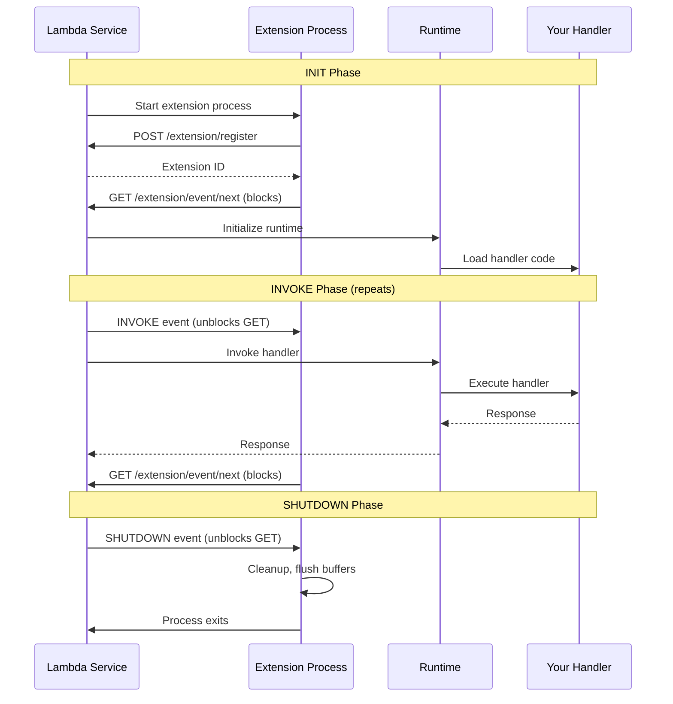
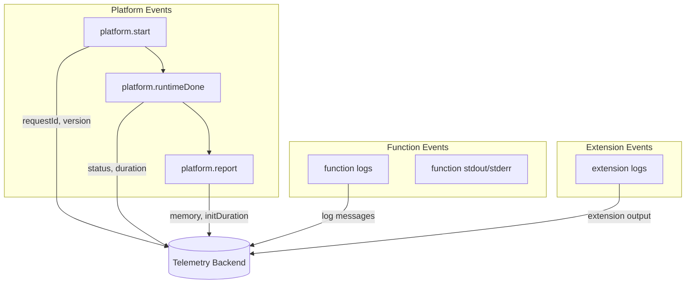

# How to Implement AWS Lambda Extensions Custom

Author: [nawazdhandala](https://github.com/nawazdhandala)

Tags: AWS, Lambda, Extensions, Serverless

Description: A practical guide to building custom Lambda extensions for telemetry collection, secrets caching, and lifecycle hooks in your serverless applications.

---

Lambda extensions let you plug custom logic into the Lambda execution environment without modifying your function code. They run as separate processes alongside your handler, giving you hooks into the init, invoke, and shutdown phases. This is useful for shipping telemetry to external backends, caching secrets and configuration, or integrating with third-party security and monitoring tools.

This guide walks through the extension lifecycle, compares internal vs external extensions, and shows you how to build both types from scratch.

---

## Table of Contents

1. What Are Lambda Extensions
2. Internal vs External Extensions
3. Extension Lifecycle
4. Building an External Extension
5. Building an Internal Extension
6. Event Hooks and Telemetry API
7. Secrets Caching Example
8. Packaging and Deployment
9. Testing Extensions Locally
10. Production Considerations
11. Common Pitfalls

---

## 1. What Are Lambda Extensions

Lambda extensions are companion processes that augment your function's runtime environment. They were introduced to solve a recurring problem: how do you run auxiliary logic (logging agents, APM collectors, security scanners) without bloating your function code or paying cold start penalties on every invocation?

Extensions have their own lifecycle and can:

- Initialize before your handler runs
- Receive notifications for each invocation
- Continue running after your handler returns
- Clean up during shutdown

They are packaged as Lambda layers and can be shared across functions.

---

## 2. Internal vs External Extensions

Lambda supports two extension types. The choice depends on whether you need a separate process or can run within the runtime.

| Aspect | Internal Extension | External Extension |
|--------|-------------------|-------------------|
| Process model | Runs inside the runtime process | Runs as a separate process |
| Language | Must match the runtime (e.g., Python for Python functions) | Any language (Go, Rust, etc.) |
| Use case | Lightweight wrappers, in-process hooks | Heavy lifting, long-running agents, telemetry collection |
| Startup | Loaded via runtime hooks (wrapper scripts) | Registered with Extensions API |
| Lifecycle control | Limited | Full access to INIT, INVOKE, SHUTDOWN events |
| Isolation | Shares memory with handler | Separate memory space |

**Internal extensions** are simpler. You drop a wrapper script that modifies how the runtime starts your handler. They are good for injecting middleware or patching libraries.

**External extensions** are standalone executables. They register with the Lambda Extensions API and receive lifecycle events. They can run in parallel with your handler and continue processing after the handler returns.

---

## 3. Extension Lifecycle

Understanding the lifecycle is critical for building reliable extensions.



Key points:

1. **INIT**: Extensions register and then block waiting for events. The runtime initializes in parallel. Lambda waits for all extensions to register before proceeding.

2. **INVOKE**: Extensions receive the invoke event, can do pre-processing, but the handler runs independently. After the handler returns, extensions can continue processing (post-invoke work) until they call `next` again.

3. **SHUTDOWN**: Triggered by scale-down, timeout, or errors. Extensions have limited time (up to 2 seconds) to flush buffers and clean up.

---

## 4. Building an External Extension

External extensions are standalone binaries. Go is a popular choice because it compiles to a single static binary with no runtime dependencies.

### Project Structure

```
my-telemetry-extension/
  extensions/
    my-telemetry-extension    # The executable (must match folder name)
  go.mod
  main.go
```

### The Extension Code (Go)

```go
// main.go
package main

import (
    "bytes"
    "context"
    "encoding/json"
    "fmt"
    "io"
    "net/http"
    "os"
    "os/signal"
    "syscall"
    "time"
)

const (
    extensionName   = "my-telemetry-extension"
    lambdaRuntimeAPI = "AWS_LAMBDA_RUNTIME_API"
)

type RegisterResponse struct {
    FunctionName    string `json:"functionName"`
    FunctionVersion string `json:"functionVersion"`
    Handler         string `json:"handler"`
}

type EventResponse struct {
    EventType          string `json:"eventType"`
    DeadlineMs         int64  `json:"deadlineMs"`
    RequestID          string `json:"requestId,omitempty"`
    InvokedFunctionArn string `json:"invokedFunctionArn,omitempty"`
    ShutdownReason     string `json:"shutdownReason,omitempty"`
}

func main() {
    runtimeAPI := os.Getenv(lambdaRuntimeAPI)
    if runtimeAPI == "" {
        fmt.Println("AWS_LAMBDA_RUNTIME_API not set, exiting")
        os.Exit(1)
    }

    baseURL := fmt.Sprintf("http://%s/2020-01-01/extension", runtimeAPI)

    // Handle graceful shutdown
    ctx, cancel := context.WithCancel(context.Background())
    sigs := make(chan os.Signal, 1)
    signal.Notify(sigs, syscall.SIGTERM, syscall.SIGINT)
    go func() {
        <-sigs
        cancel()
    }()

    // Register the extension
    extensionID, err := register(baseURL)
    if err != nil {
        fmt.Printf("Failed to register: %v\n", err)
        os.Exit(1)
    }
    fmt.Printf("Registered with ID: %s\n", extensionID)

    // Initialize telemetry client, open connections, etc.
    initTelemetry()

    // Event loop
    for {
        select {
        case <-ctx.Done():
            fmt.Println("Context cancelled, shutting down")
            return
        default:
            event, err := nextEvent(baseURL, extensionID)
            if err != nil {
                fmt.Printf("Error getting next event: %v\n", err)
                continue
            }

            switch event.EventType {
            case "INVOKE":
                handleInvoke(event)
            case "SHUTDOWN":
                handleShutdown(event)
                return
            }
        }
    }
}

func register(baseURL string) (string, error) {
    url := baseURL + "/register"
    payload := map[string][]string{
        "events": {"INVOKE", "SHUTDOWN"},
    }
    body, _ := json.Marshal(payload)

    req, _ := http.NewRequest("POST", url, bytes.NewReader(body))
    req.Header.Set("Lambda-Extension-Name", extensionName)
    req.Header.Set("Content-Type", "application/json")

    client := &http.Client{Timeout: 5 * time.Second}
    resp, err := client.Do(req)
    if err != nil {
        return "", err
    }
    defer resp.Body.Close()

    if resp.StatusCode != http.StatusOK {
        respBody, _ := io.ReadAll(resp.Body)
        return "", fmt.Errorf("register failed: %s", string(respBody))
    }

    return resp.Header.Get("Lambda-Extension-Identifier"), nil
}

func nextEvent(baseURL, extensionID string) (*EventResponse, error) {
    url := baseURL + "/event/next"
    req, _ := http.NewRequest("GET", url, nil)
    req.Header.Set("Lambda-Extension-Identifier", extensionID)

    // This call blocks until an event is available
    client := &http.Client{Timeout: 0}
    resp, err := client.Do(req)
    if err != nil {
        return nil, err
    }
    defer resp.Body.Close()

    var event EventResponse
    if err := json.NewDecoder(resp.Body).Decode(&event); err != nil {
        return nil, err
    }
    return &event, nil
}

func initTelemetry() {
    // Initialize connections to telemetry backend
    // This runs once during INIT phase
    fmt.Println("Telemetry initialized")
}

func handleInvoke(event *EventResponse) {
    fmt.Printf("INVOKE: requestId=%s\n", event.RequestID)
    // Collect metrics, prepare to receive telemetry
    // The handler runs in parallel
}

func handleShutdown(event *EventResponse) {
    fmt.Printf("SHUTDOWN: reason=%s\n", event.ShutdownReason)
    // Flush all buffered telemetry
    // You have ~2 seconds to complete
    flushTelemetry()
}

func flushTelemetry() {
    // Send any buffered data to your backend
    fmt.Println("Flushing telemetry...")
    time.Sleep(100 * time.Millisecond) // Simulate flush
    fmt.Println("Telemetry flushed")
}
```

### Build Script

```bash
#!/bin/bash
# build.sh

GOOS=linux GOARCH=amd64 go build -o extensions/my-telemetry-extension main.go
chmod +x extensions/my-telemetry-extension

# Package as a layer
zip -r extension.zip extensions/
```

---

## 5. Building an Internal Extension

Internal extensions use wrapper scripts to intercept the runtime initialization. They are simpler but limited to the runtime's language.

### Python Wrapper Example

Create a file `python_wrapper.py` in your layer:

```python
# python_wrapper.py
import os
import sys
import time
import importlib

def wrap_handler():
    # Pre-initialization hook
    print("Extension: Pre-init hook running")

    # Cache secrets, warm connections, etc.
    cache_secrets()

    # Get the original handler
    handler_module, handler_func = os.environ.get(
        '_HANDLER', 'lambda_function.handler'
    ).rsplit('.', 1)

    # Import the handler module
    module = importlib.import_module(handler_module)
    original_handler = getattr(module, handler_func)

    def wrapped_handler(event, context):
        # Pre-invocation hook
        start_time = time.time()
        request_id = context.aws_request_id
        print(f"Extension: Request {request_id} starting")

        try:
            # Call the original handler
            result = original_handler(event, context)

            # Post-invocation hook (success)
            duration = time.time() - start_time
            print(f"Extension: Request {request_id} completed in {duration:.3f}s")
            record_metric("invocation_success", 1, {"duration": duration})

            return result
        except Exception as e:
            # Post-invocation hook (error)
            duration = time.time() - start_time
            print(f"Extension: Request {request_id} failed: {e}")
            record_metric("invocation_error", 1, {"duration": duration, "error": str(e)})
            raise

    return wrapped_handler

def cache_secrets():
    """Fetch secrets during init to avoid cold start latency per invocation."""
    # Example: Fetch from AWS Secrets Manager
    print("Extension: Caching secrets...")
    # boto3.client('secretsmanager').get_secret_value(...)

def record_metric(name, value, dimensions):
    """Send metric to your backend."""
    print(f"Extension: Metric {name}={value} {dimensions}")

# Export the wrapped handler
handler = wrap_handler()
```

### Layer Structure

```
my-internal-extension/
  python/
    python_wrapper.py
```

### Activating the Wrapper

Set the `AWS_LAMBDA_EXEC_WRAPPER` environment variable on your function:

```yaml
# SAM template
Environment:
  Variables:
    AWS_LAMBDA_EXEC_WRAPPER: /opt/python/python_wrapper.py
```

Or for a full wrapper script approach, create an executable:

```bash
#!/bin/bash
# wrapper.sh

# Pre-exec hook
echo "Extension: Wrapper starting"

# Execute the runtime with the original handler
exec "$@"
```

---

## 6. Event Hooks and Telemetry API

Lambda provides a Telemetry API that streams logs, metrics, and trace data directly to your extension. This is more efficient than parsing CloudWatch logs.

### Subscribing to Telemetry API

```go
// telemetry.go
package main

import (
    "bytes"
    "encoding/json"
    "fmt"
    "net/http"
    "os"
)

type TelemetrySubscription struct {
    SchemaVersion string   `json:"schemaVersion"`
    Destination   Dest     `json:"destination"`
    Types         []string `json:"types"`
    Buffering     Buffer   `json:"buffering"`
}

type Dest struct {
    Protocol string `json:"protocol"`
    URI      string `json:"URI"`
}

type Buffer struct {
    MaxItems  int `json:"maxItems"`
    MaxBytes  int `json:"maxBytes"`
    TimeoutMs int `json:"timeoutMs"`
}

func subscribeTelemetry(extensionID string, listenerPort int) error {
    runtimeAPI := os.Getenv("AWS_LAMBDA_RUNTIME_API")
    url := fmt.Sprintf("http://%s/2022-07-01/telemetry", runtimeAPI)

    subscription := TelemetrySubscription{
        SchemaVersion: "2022-12-13",
        Destination: Dest{
            Protocol: "HTTP",
            URI:      fmt.Sprintf("http://sandbox.localdomain:%d", listenerPort),
        },
        Types: []string{"platform", "function", "extension"},
        Buffering: Buffer{
            MaxItems:  1000,
            MaxBytes:  262144,
            TimeoutMs: 100,
        },
    }

    body, _ := json.Marshal(subscription)
    req, _ := http.NewRequest("PUT", url, bytes.NewReader(body))
    req.Header.Set("Lambda-Extension-Identifier", extensionID)
    req.Header.Set("Content-Type", "application/json")

    client := &http.Client{}
    resp, err := client.Do(req)
    if err != nil {
        return err
    }
    defer resp.Body.Close()

    if resp.StatusCode != http.StatusOK {
        return fmt.Errorf("telemetry subscribe failed: %d", resp.StatusCode)
    }

    return nil
}
```

### Telemetry Listener

```go
// listener.go
package main

import (
    "encoding/json"
    "fmt"
    "io"
    "net/http"
)

type TelemetryEvent struct {
    Time   string          `json:"time"`
    Type   string          `json:"type"`
    Record json.RawMessage `json:"record"`
}

func startTelemetryListener(port int) {
    http.HandleFunc("/", func(w http.ResponseWriter, r *http.Request) {
        body, _ := io.ReadAll(r.Body)
        defer r.Body.Close()

        var events []TelemetryEvent
        if err := json.Unmarshal(body, &events); err != nil {
            fmt.Printf("Failed to parse telemetry: %v\n", err)
            w.WriteHeader(http.StatusBadRequest)
            return
        }

        for _, event := range events {
            processTelemetryEvent(event)
        }

        w.WriteHeader(http.StatusOK)
    })

    go http.ListenAndServe(fmt.Sprintf(":%d", port), nil)
}

func processTelemetryEvent(event TelemetryEvent) {
    switch event.Type {
    case "platform.start":
        fmt.Printf("Platform start: %s\n", event.Record)
    case "platform.runtimeDone":
        fmt.Printf("Runtime done: %s\n", event.Record)
    case "function":
        // Function logs
        fmt.Printf("Function log: %s\n", event.Record)
    case "platform.report":
        // Invocation metrics (duration, memory, etc.)
        fmt.Printf("Report: %s\n", event.Record)
    }
}
```

### Telemetry Event Types



---

## 7. Secrets Caching Example

A common use case is caching secrets during INIT to avoid per-invocation latency.

```go
// secrets_extension.go
package main

import (
    "context"
    "encoding/json"
    "fmt"
    "net/http"
    "os"
    "sync"
    "time"

    "github.com/aws/aws-sdk-go-v2/config"
    "github.com/aws/aws-sdk-go-v2/service/secretsmanager"
)

type SecretsCache struct {
    mu      sync.RWMutex
    secrets map[string]string
    ttl     time.Duration
    expiry  time.Time
}

var cache = &SecretsCache{
    secrets: make(map[string]string),
    ttl:     5 * time.Minute,
}

func initSecretsCache() error {
    ctx := context.Background()
    cfg, err := config.LoadDefaultConfig(ctx)
    if err != nil {
        return fmt.Errorf("failed to load AWS config: %w", err)
    }

    client := secretsmanager.NewFromConfig(cfg)

    // Fetch secrets defined in environment
    secretNames := os.Getenv("CACHE_SECRET_NAMES") // comma-separated
    if secretNames == "" {
        return nil
    }

    cache.mu.Lock()
    defer cache.mu.Unlock()

    for _, name := range splitAndTrim(secretNames) {
        result, err := client.GetSecretValue(ctx, &secretsmanager.GetSecretValueInput{
            SecretId: &name,
        })
        if err != nil {
            fmt.Printf("Warning: failed to fetch secret %s: %v\n", name, err)
            continue
        }
        cache.secrets[name] = *result.SecretString
    }

    cache.expiry = time.Now().Add(cache.ttl)
    fmt.Printf("Cached %d secrets\n", len(cache.secrets))
    return nil
}

// HTTP endpoint for the function to query cached secrets
func startSecretsServer(port int) {
    http.HandleFunc("/secrets/", func(w http.ResponseWriter, r *http.Request) {
        name := r.URL.Path[len("/secrets/"):]

        cache.mu.RLock()
        value, ok := cache.secrets[name]
        cache.mu.RUnlock()

        if !ok {
            http.NotFound(w, r)
            return
        }

        w.Header().Set("Content-Type", "application/json")
        json.NewEncoder(w).Encode(map[string]string{"value": value})
    })

    go http.ListenAndServe(fmt.Sprintf("127.0.0.1:%d", port), nil)
}
```

Your function code can then fetch secrets from the local extension endpoint:

```python
# lambda_function.py
import urllib.request
import json
import os

SECRETS_PORT = os.environ.get('SECRETS_EXTENSION_PORT', '4000')

def get_secret(name):
    url = f"http://127.0.0.1:{SECRETS_PORT}/secrets/{name}"
    with urllib.request.urlopen(url) as response:
        data = json.loads(response.read())
        return data['value']

def handler(event, context):
    db_password = get_secret('prod/database/password')
    # Use the secret...
    return {"statusCode": 200}
```

---

## 8. Packaging and Deployment

### Layer Structure

```
extension-layer/
  extensions/
    my-extension           # External extension executable
  python/                  # (optional) Internal extension code
    wrapper.py
  lib/                     # (optional) Shared libraries
```

### SAM Template

```yaml
AWSTemplateFormatVersion: '2010-09-09'
Transform: AWS::Serverless-2016-10-31

Resources:
  TelemetryExtensionLayer:
    Type: AWS::Serverless::LayerVersion
    Properties:
      LayerName: telemetry-extension
      Description: Custom telemetry collection extension
      ContentUri: ./extension-layer/
      CompatibleRuntimes:
        - python3.11
        - python3.12
        - nodejs20.x
      CompatibleArchitectures:
        - x86_64
        - arm64
    Metadata:
      BuildMethod: makefile

  MyFunction:
    Type: AWS::Serverless::Function
    Properties:
      Handler: lambda_function.handler
      Runtime: python3.11
      CodeUri: ./src/
      Layers:
        - !Ref TelemetryExtensionLayer
      Environment:
        Variables:
          TELEMETRY_ENDPOINT: https://telemetry.example.com/ingest
          CACHE_SECRET_NAMES: prod/api/key,prod/database/password
```

### Makefile for Building

```makefile
# Makefile

.PHONY: build-TelemetryExtensionLayer

build-TelemetryExtensionLayer:
	mkdir -p $(ARTIFACTS_DIR)/extensions
	GOOS=linux GOARCH=amd64 go build -o $(ARTIFACTS_DIR)/extensions/telemetry-extension ./cmd/extension
	chmod +x $(ARTIFACTS_DIR)/extensions/telemetry-extension
```

### Deploy Commands

```bash
# Build and deploy
sam build
sam deploy --guided

# Or with AWS CLI
aws lambda publish-layer-version \
    --layer-name telemetry-extension \
    --zip-file fileb://extension.zip \
    --compatible-runtimes python3.11 python3.12 nodejs20.x

# Attach to function
aws lambda update-function-configuration \
    --function-name my-function \
    --layers arn:aws:lambda:us-east-1:123456789:layer:telemetry-extension:1
```

---

## 9. Testing Extensions Locally

### Lambda Runtime Interface Emulator (RIE)

```bash
# Install RIE
mkdir -p ~/.aws-lambda-rie
curl -Lo ~/.aws-lambda-rie/aws-lambda-rie \
    https://github.com/aws/aws-lambda-runtime-interface-emulator/releases/latest/download/aws-lambda-rie
chmod +x ~/.aws-lambda-rie/aws-lambda-rie

# Run locally with extension
docker build -t my-function .
docker run -p 9000:8080 \
    -v ~/.aws-lambda-rie:/aws-lambda \
    -e AWS_LAMBDA_RUNTIME_API=127.0.0.1:9001 \
    my-function

# Invoke
curl -XPOST "http://localhost:9000/2015-03-31/functions/function/invocations" \
    -d '{"test": "event"}'
```

### Dockerfile with Extension

```dockerfile
FROM public.ecr.aws/lambda/python:3.11

# Copy extension
COPY extensions/ /opt/extensions/

# Copy function code
COPY src/ ${LAMBDA_TASK_ROOT}/

CMD ["lambda_function.handler"]
```

### Unit Testing Extension Logic

```go
// extension_test.go
package main

import (
    "net/http"
    "net/http/httptest"
    "testing"
)

func TestRegister(t *testing.T) {
    server := httptest.NewServer(http.HandlerFunc(func(w http.ResponseWriter, r *http.Request) {
        if r.URL.Path != "/2020-01-01/extension/register" {
            t.Errorf("unexpected path: %s", r.URL.Path)
        }
        if r.Header.Get("Lambda-Extension-Name") == "" {
            t.Error("missing extension name header")
        }
        w.Header().Set("Lambda-Extension-Identifier", "test-id")
        w.WriteHeader(http.StatusOK)
    }))
    defer server.Close()

    id, err := register(server.URL + "/2020-01-01/extension")
    if err != nil {
        t.Fatalf("register failed: %v", err)
    }
    if id != "test-id" {
        t.Errorf("unexpected id: %s", id)
    }
}

func TestTelemetryProcessing(t *testing.T) {
    event := TelemetryEvent{
        Time: "2024-01-15T10:30:00Z",
        Type: "platform.report",
        Record: []byte(`{"duration": 150, "memory": 128}`),
    }

    // Should not panic
    processTelemetryEvent(event)
}
```

---

## 10. Production Considerations

### Timeouts and Deadlines

Extensions receive a `deadlineMs` in each event. Respect it:

```go
func handleInvoke(event *EventResponse) {
    deadline := time.UnixMilli(event.DeadlineMs)
    ctx, cancel := context.WithDeadline(context.Background(), deadline)
    defer cancel()

    // Use ctx for any operations
    select {
    case <-ctx.Done():
        fmt.Println("Deadline exceeded, aborting")
        return
    default:
        // Do work
    }
}
```

### Memory Considerations

Extensions share the function's memory allocation. If your function is configured for 128MB, your extension should be lean. For memory-hungry extensions (large buffers, ML models), ensure the function has adequate memory.

### Cold Start Impact

Extension initialization adds to cold start latency. Keep INIT fast:

- Defer heavy work to background goroutines
- Use connection pooling
- Lazy-load non-critical resources

```mermaid
gantt
    title Cold Start Timeline
    dateFormat X
    axisFormat %L ms

    section Init Phase
    Extension register     :0, 50
    Runtime init           :0, 100
    Extension telemetry sub:50, 80
    Handler module load    :100, 150

    section First Invoke
    Event dispatch         :150, 155
    Handler execution      :155, 300
    Extension post-process :300, 350
```



### Error Handling

Extensions should not crash the function. Catch and log errors:

```go
func safeProcess() {
    defer func() {
        if r := recover(); r != nil {
            fmt.Printf("Extension recovered from panic: %v\n", r)
        }
    }()
    // Risky operation
}
```

### Graceful Shutdown

The SHUTDOWN event gives you limited time. Prioritize flushing critical data:

```go
func handleShutdown(event *EventResponse) {
    deadline := time.UnixMilli(event.DeadlineMs)
    timeout := time.Until(deadline) - 100*time.Millisecond // Buffer

    ctx, cancel := context.WithTimeout(context.Background(), timeout)
    defer cancel()

    // Flush in priority order
    done := make(chan bool)
    go func() {
        flushMetrics(ctx)
        flushTraces(ctx)
        flushLogs(ctx) // Lowest priority
        done <- true
    }()

    select {
    case <-done:
        fmt.Println("Graceful shutdown complete")
    case <-ctx.Done():
        fmt.Println("Shutdown timeout, some data may be lost")
    }
}
```

---

## 11. Common Pitfalls

### 1. Blocking the Event Loop

Calling `nextEvent` blocks until Lambda sends an event. Do not do heavy processing before calling it during INIT, or you will delay the function start.

```go
// Bad: Processing before nextEvent delays function
func main() {
    register(...)
    heavyInit() // Blocks everything
    nextEvent(...) // Lambda waits for this
}

// Good: Init in parallel, then block
func main() {
    register(...)
    go heavyInit() // Background
    nextEvent(...) // Lambda can proceed
}
```

### 2. Not Handling All Event Types

Always handle SHUTDOWN, even if you only care about INVOKE:

```go
switch event.EventType {
case "INVOKE":
    handleInvoke(event)
case "SHUTDOWN":
    handleShutdown(event)
    return // Exit cleanly
default:
    fmt.Printf("Unknown event type: %s\n", event.EventType)
}
```

### 3. Ignoring Telemetry API Buffering

The Telemetry API batches events. Your listener may receive multiple events per request. Handle arrays:

```go
// Wrong: Expects single event
var event TelemetryEvent
json.Unmarshal(body, &event)

// Right: Expects array
var events []TelemetryEvent
json.Unmarshal(body, &events)
```

### 4. Hardcoding Ports

Use environment variables for configuration. Port 4000 might conflict in some environments:

```go
port := os.Getenv("EXTENSION_TELEMETRY_PORT")
if port == "" {
    port = "4000"
}
```

### 5. Missing ARM64 Builds

If your functions run on Graviton (arm64), build your extension for both architectures:

```bash
GOOS=linux GOARCH=amd64 go build -o extensions/my-extension-amd64
GOOS=linux GOARCH=arm64 go build -o extensions/my-extension-arm64
```

Or use a multi-arch layer with separate builds.

---

## Summary

| Component | Purpose |
|-----------|---------|
| External Extension | Standalone process for telemetry, monitoring, security agents |
| Internal Extension | Lightweight wrapper for in-process hooks |
| Extensions API | Registration and lifecycle events (INIT, INVOKE, SHUTDOWN) |
| Telemetry API | Stream logs, metrics, traces directly to extension |
| Secrets Cache | Reduce per-invocation latency for secret fetching |

Lambda extensions let you build reusable observability and operational tooling that works across functions without code changes. Start with the built-in extensions from AWS partners (Datadog, New Relic, Dynatrace), and build custom extensions when you need specific behavior or want to ship data to your own backends.

---

**Related Reading:**

- [Why diversify away from AWS us-east-1](https://oneuptime.com/blog/post/2025-10-21-aws-us-east-1-region-of-last-resort/view)
- [Traces and Spans in OpenTelemetry](https://oneuptime.com/blog/post/2025-08-27-traces-and-spans-in-opentelemetry/view)
- [What is OpenTelemetry Collector and Why Use One](https://oneuptime.com/blog/post/2025-09-18-what-is-opentelemetry-collector-and-why-use-one/view)
