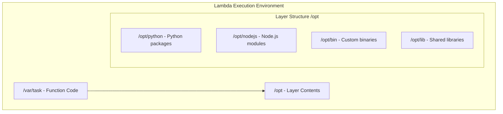
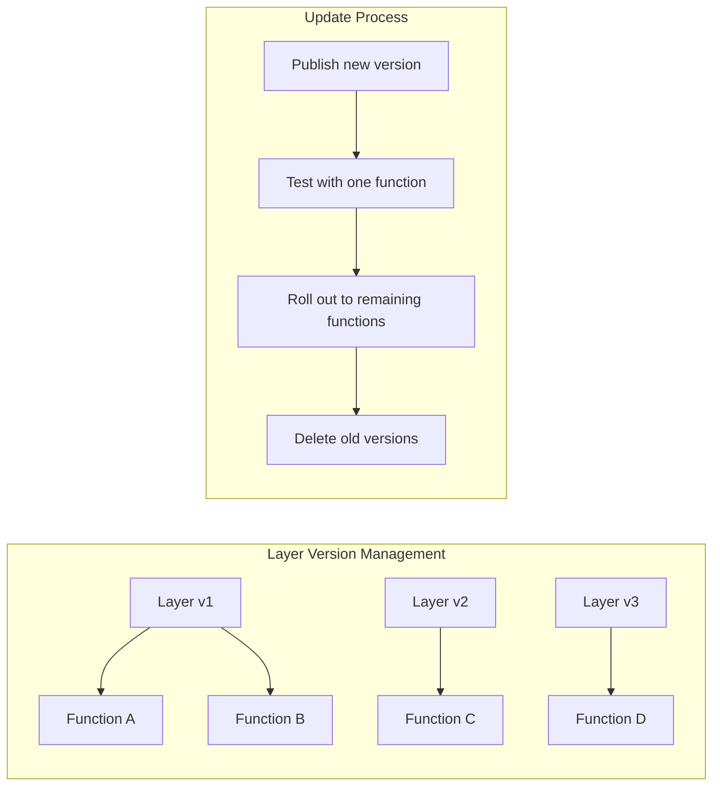

# How to Build AWS Lambda Layers Custom

Author: [nawazdhandala](https://github.com/nawazdhandala)

Tags: AWS, Lambda, Serverless, DevOps

Description: Learn how to create custom AWS Lambda Layers to share code, dependencies, and binaries across multiple functions while reducing deployment package sizes and simplifying maintenance.

---

AWS Lambda Layers let you package libraries, custom runtimes, and shared code separately from your function code. Instead of bundling everything into each function's deployment package, you extract common dependencies into reusable layers. This reduces deployment size, speeds up uploads, and makes it easier to update shared code across multiple functions.

## Why Use Lambda Layers?

| Problem | Without Layers | With Layers |
|---------|----------------|-------------|
| Shared dependencies | Duplicated in every function | Shared across functions |
| Deployment package size | Can hit 250MB limit | Function code stays small |
| Dependency updates | Update every function | Update layer once |
| Cold start time | Large packages load slowly | Smaller packages load faster |
| Code organization | Mixed application and library code | Clean separation |

## How Lambda Layers Work

When your Lambda function runs, AWS mounts layers in the `/opt` directory. For each supported runtime, there are specific paths where Lambda looks for code and libraries.



## Creating a Python Lambda Layer

Let's build a layer containing common Python packages like `requests` and `boto3` utilities.

### Step 1: Set Up the Directory Structure

Lambda expects Python packages in a specific directory structure. The path must be `python/` or `python/lib/python3.x/site-packages/`.

```bash
# Create the layer directory structure
mkdir -p my-python-layer/python

# Navigate to the layer directory
cd my-python-layer
```

### Step 2: Install Dependencies

Install packages into the layer directory. You need to target the correct platform since Lambda runs on Amazon Linux.

```bash
# Install packages for Lambda's Amazon Linux 2 environment
# The --platform flag ensures compatibility with Lambda's runtime
pip install \
    --platform manylinux2014_x86_64 \
    --target ./python \
    --implementation cp \
    --python-version 3.11 \
    --only-binary=:all: \
    requests \
    python-dateutil \
    aws-lambda-powertools

# Check the installed packages
ls -la python/
```

### Step 3: Create the Layer ZIP

Package the layer into a ZIP file that AWS Lambda can consume.

```bash
# Create the ZIP file from the layer directory
# The python/ directory must be at the root of the ZIP
zip -r my-python-layer.zip python/

# Verify the structure
unzip -l my-python-layer.zip | head -20
```

### Step 4: Publish the Layer to AWS

Use the AWS CLI to publish your layer.

```bash
# Publish the layer to AWS Lambda
aws lambda publish-layer-version \
    --layer-name my-python-utilities \
    --description "Common Python utilities including requests and powertools" \
    --zip-file fileb://my-python-layer.zip \
    --compatible-runtimes python3.11 python3.12 \
    --compatible-architectures x86_64
```

The command returns the layer ARN, which you will use when attaching it to functions.

```json
{
    "LayerArn": "arn:aws:lambda:us-east-1:123456789012:layer:my-python-utilities",
    "LayerVersionArn": "arn:aws:lambda:us-east-1:123456789012:layer:my-python-utilities:1",
    "Description": "Common Python utilities including requests and powertools",
    "CreatedDate": "2026-01-30T10:00:00.000+0000",
    "Version": 1,
    "CompatibleRuntimes": ["python3.11", "python3.12"],
    "CompatibleArchitectures": ["x86_64"]
}
```

## Creating a Node.js Lambda Layer

Node.js layers follow a similar pattern but use a different directory structure.

### Directory Structure for Node.js

Node.js packages must be in `nodejs/node_modules/` for Lambda to find them.

```bash
# Create the layer directory structure
mkdir -p my-node-layer/nodejs

# Navigate to the nodejs directory
cd my-node-layer/nodejs

# Initialize a package.json
npm init -y

# Install dependencies
npm install lodash axios uuid dayjs --save
```

### Package and Publish

```bash
# Go back to the layer root
cd ..

# Create the ZIP file
zip -r my-node-layer.zip nodejs/

# Publish to AWS Lambda
aws lambda publish-layer-version \
    --layer-name my-node-utilities \
    --description "Common Node.js utilities including lodash and axios" \
    --zip-file fileb://my-node-layer.zip \
    --compatible-runtimes nodejs18.x nodejs20.x \
    --compatible-architectures x86_64 arm64
```

## Creating a Layer with Custom Binaries

Sometimes you need native binaries in your Lambda function, such as FFmpeg for video processing or ImageMagick for image manipulation. Layers are perfect for this.

### Building FFmpeg Layer

Since Lambda runs on Amazon Linux 2, you should compile or download binaries that are compatible with that environment.

```bash
# Use Docker to build in an Amazon Linux 2 environment
# This ensures binary compatibility with Lambda

# Create a Dockerfile for building the layer
cat > Dockerfile << 'EOF'
FROM amazonlinux:2

RUN yum update -y && \
    yum install -y tar gzip xz

# Download pre-compiled FFmpeg for Amazon Linux
RUN curl -L https://johnvansickle.com/ffmpeg/releases/ffmpeg-release-amd64-static.tar.xz \
    -o ffmpeg.tar.xz && \
    tar -xf ffmpeg.tar.xz && \
    mkdir -p /opt/bin && \
    cp ffmpeg-*-amd64-static/ffmpeg /opt/bin/ && \
    cp ffmpeg-*-amd64-static/ffprobe /opt/bin/ && \
    chmod +x /opt/bin/*

# Create the layer ZIP
WORKDIR /opt
RUN yum install -y zip && \
    zip -r /ffmpeg-layer.zip bin/
EOF

# Build the Docker image and extract the layer
docker build -t ffmpeg-layer-builder .
docker run --rm -v $(pwd):/output ffmpeg-layer-builder cp /ffmpeg-layer.zip /output/

# Publish the layer
aws lambda publish-layer-version \
    --layer-name ffmpeg \
    --description "FFmpeg and FFprobe binaries" \
    --zip-file fileb://ffmpeg-layer.zip \
    --compatible-runtimes python3.11 python3.12 nodejs18.x nodejs20.x \
    --compatible-architectures x86_64
```

### Using Binaries in Your Function

When you attach the layer to your function, the binaries are available at `/opt/bin/`.

```python
# Lambda function using FFmpeg from layer
import subprocess
import os

# Add the layer's bin directory to PATH
os.environ['PATH'] = '/opt/bin:' + os.environ.get('PATH', '')

def lambda_handler(event, context):
    # Get input video URL from event
    video_url = event['video_url']
    output_path = '/tmp/output.mp4'

    # Run FFmpeg to process video
    # This example extracts a 10-second clip starting at 30 seconds
    result = subprocess.run([
        'ffmpeg',
        '-i', video_url,
        '-ss', '00:00:30',      # Start at 30 seconds
        '-t', '10',              # Duration of 10 seconds
        '-c:v', 'libx264',       # Video codec
        '-c:a', 'aac',           # Audio codec
        '-y',                    # Overwrite output
        output_path
    ], capture_output=True, text=True)

    if result.returncode != 0:
        return {
            'statusCode': 500,
            'body': f'FFmpeg error: {result.stderr}'
        }

    # Upload processed video to S3 or return path
    return {
        'statusCode': 200,
        'body': f'Video processed: {output_path}'
    }
```

## Creating Shared Code Layers

Beyond dependencies, layers are excellent for sharing your own utility code across functions.

### Shared Utilities Layer Structure

```bash
# Create a shared utilities layer
mkdir -p shared-utils-layer/python/shared_utils

# Create the shared module
cat > shared-utils-layer/python/shared_utils/__init__.py << 'EOF'
from .logging import setup_logger
from .response import api_response
from .validation import validate_event

__all__ = ['setup_logger', 'api_response', 'validate_event']
EOF
```

### Logging Utility

Create a standardized logging configuration for all your functions.

```python
# shared-utils-layer/python/shared_utils/logging.py

import logging
import json
import os
from datetime import datetime

class JSONFormatter(logging.Formatter):
    """
    Format log records as JSON for CloudWatch Logs Insights
    This makes logs searchable and parseable
    """

    def format(self, record):
        log_entry = {
            'timestamp': datetime.utcnow().isoformat(),
            'level': record.levelname,
            'message': record.getMessage(),
            'logger': record.name,
            'function_name': os.environ.get('AWS_LAMBDA_FUNCTION_NAME', 'local'),
            'request_id': getattr(record, 'request_id', None),
        }

        # Include exception info if present
        if record.exc_info:
            log_entry['exception'] = self.formatException(record.exc_info)

        # Include any extra fields
        if hasattr(record, 'extra'):
            log_entry.update(record.extra)

        return json.dumps(log_entry)

def setup_logger(name, level=None):
    """
    Set up a JSON-formatted logger for Lambda functions

    Args:
        name: Logger name, typically __name__
        level: Log level, defaults to LOG_LEVEL env var or INFO

    Returns:
        Configured logger instance
    """
    logger = logging.getLogger(name)

    # Determine log level from environment or default
    if level is None:
        level = os.environ.get('LOG_LEVEL', 'INFO')
    logger.setLevel(getattr(logging, level.upper()))

    # Remove existing handlers to avoid duplicates
    logger.handlers = []

    # Add JSON formatter handler
    handler = logging.StreamHandler()
    handler.setFormatter(JSONFormatter())
    logger.addHandler(handler)

    return logger
```

### Response Helper

Standardize API Gateway responses across all functions.

```python
# shared-utils-layer/python/shared_utils/response.py

import json
from typing import Any, Dict, Optional

def api_response(
    status_code: int,
    body: Any,
    headers: Optional[Dict[str, str]] = None,
    cors: bool = True
) -> Dict:
    """
    Create a standardized API Gateway response

    Args:
        status_code: HTTP status code
        body: Response body (will be JSON serialized)
        headers: Additional headers to include
        cors: Whether to include CORS headers

    Returns:
        API Gateway formatted response dictionary
    """
    response_headers = {
        'Content-Type': 'application/json',
    }

    # Add CORS headers if enabled
    if cors:
        response_headers.update({
            'Access-Control-Allow-Origin': '*',
            'Access-Control-Allow-Methods': 'GET, POST, PUT, DELETE, OPTIONS',
            'Access-Control-Allow-Headers': 'Content-Type, Authorization',
        })

    # Merge custom headers
    if headers:
        response_headers.update(headers)

    # Handle body serialization
    if isinstance(body, str):
        serialized_body = body
    else:
        serialized_body = json.dumps(body, default=str)

    return {
        'statusCode': status_code,
        'headers': response_headers,
        'body': serialized_body,
    }


def success(data: Any, status_code: int = 200) -> Dict:
    """Shorthand for successful responses"""
    return api_response(status_code, {'success': True, 'data': data})


def error(message: str, status_code: int = 400, details: Any = None) -> Dict:
    """Shorthand for error responses"""
    body = {'success': False, 'error': message}
    if details:
        body['details'] = details
    return api_response(status_code, body)
```

### Validation Utility

```python
# shared-utils-layer/python/shared_utils/validation.py

from typing import Any, Dict, List, Optional

class ValidationError(Exception):
    """Custom exception for validation failures"""
    def __init__(self, errors: List[str]):
        self.errors = errors
        super().__init__(f"Validation failed: {', '.join(errors)}")

def validate_event(
    event: Dict[str, Any],
    required_fields: List[str],
    optional_fields: Optional[List[str]] = None
) -> Dict[str, Any]:
    """
    Validate Lambda event has required fields

    Args:
        event: Lambda event dictionary
        required_fields: List of field names that must be present
        optional_fields: List of allowed optional fields

    Returns:
        Validated and cleaned event data

    Raises:
        ValidationError: If required fields are missing
    """
    errors = []
    validated = {}

    # Parse body if it is a string (API Gateway)
    if 'body' in event and isinstance(event['body'], str):
        import json
        try:
            body = json.loads(event['body'])
        except json.JSONDecodeError:
            raise ValidationError(['Invalid JSON in request body'])
    else:
        body = event.get('body', event)

    # Check required fields
    for field in required_fields:
        if field not in body or body[field] is None:
            errors.append(f"Missing required field: {field}")
        else:
            validated[field] = body[field]

    # Include optional fields if present
    if optional_fields:
        for field in optional_fields:
            if field in body and body[field] is not None:
                validated[field] = body[field]

    if errors:
        raise ValidationError(errors)

    return validated
```

### Package and Deploy the Shared Utils Layer

```bash
# Create the ZIP file
cd shared-utils-layer
zip -r shared-utils.zip python/

# Publish the layer
aws lambda publish-layer-version \
    --layer-name shared-utils \
    --description "Shared utility functions for Lambda" \
    --zip-file fileb://shared-utils.zip \
    --compatible-runtimes python3.11 python3.12
```

## Using Layers in Your Functions

### Attaching Layers via AWS CLI

```bash
# Update function to use layers
# You can attach up to 5 layers to a single function
aws lambda update-function-configuration \
    --function-name my-api-function \
    --layers \
        arn:aws:lambda:us-east-1:123456789012:layer:my-python-utilities:1 \
        arn:aws:lambda:us-east-1:123456789012:layer:shared-utils:1
```

### Using Layers with AWS SAM

AWS SAM makes layer management easier with infrastructure as code.

```yaml
# template.yaml
AWSTemplateFormatVersion: '2010-09-09'
Transform: AWS::Serverless-2016-10-31

Globals:
  Function:
    Runtime: python3.11
    Timeout: 30
    # Layers applied to all functions
    Layers:
      - !Ref SharedUtilsLayer
      - !Ref DependenciesLayer

Resources:
  # Define the shared utilities layer
  SharedUtilsLayer:
    Type: AWS::Serverless::LayerVersion
    Properties:
      LayerName: shared-utils
      Description: Shared utility functions
      ContentUri: layers/shared-utils/
      CompatibleRuntimes:
        - python3.11
        - python3.12
      RetentionPolicy: Retain
    Metadata:
      BuildMethod: python3.11

  # Define the dependencies layer
  DependenciesLayer:
    Type: AWS::Serverless::LayerVersion
    Properties:
      LayerName: python-dependencies
      Description: Python dependencies
      ContentUri: layers/dependencies/
      CompatibleRuntimes:
        - python3.11
        - python3.12
      RetentionPolicy: Retain
    Metadata:
      BuildMethod: python3.11

  # API function using the layers
  ApiFunction:
    Type: AWS::Serverless::Function
    Properties:
      Handler: app.lambda_handler
      CodeUri: functions/api/
      Events:
        Api:
          Type: Api
          Properties:
            Path: /items
            Method: GET

Outputs:
  SharedUtilsLayerArn:
    Description: Shared Utils Layer ARN
    Value: !Ref SharedUtilsLayer
    Export:
      Name: SharedUtilsLayerArn
```

### Using Layers with Terraform

```hcl
# layers.tf

# Package the layer contents
data "archive_file" "shared_utils_layer" {
  type        = "zip"
  source_dir  = "${path.module}/layers/shared-utils"
  output_path = "${path.module}/dist/shared-utils.zip"
}

# Create the Lambda layer
resource "aws_lambda_layer_version" "shared_utils" {
  filename            = data.archive_file.shared_utils_layer.output_path
  layer_name          = "shared-utils"
  description         = "Shared utility functions for Lambda"
  source_code_hash    = data.archive_file.shared_utils_layer.output_base64sha256

  compatible_runtimes = ["python3.11", "python3.12"]
  compatible_architectures = ["x86_64", "arm64"]
}

# Lambda function using the layer
resource "aws_lambda_function" "api" {
  filename         = data.archive_file.api_function.output_path
  function_name    = "api-function"
  role             = aws_iam_role.lambda_role.arn
  handler          = "app.lambda_handler"
  runtime          = "python3.11"
  source_code_hash = data.archive_file.api_function.output_base64sha256

  # Attach the layer
  layers = [
    aws_lambda_layer_version.shared_utils.arn,
  ]

  environment {
    variables = {
      LOG_LEVEL = "INFO"
    }
  }
}

# Output the layer ARN for use in other modules
output "shared_utils_layer_arn" {
  value       = aws_lambda_layer_version.shared_utils.arn
  description = "ARN of the shared utils layer"
}
```

## Example: Complete Function Using Layers

Here is a complete Lambda function that uses all the layers we created.

```python
# functions/api/app.py

# Import from the shared-utils layer
from shared_utils import setup_logger, api_response, validate_event
from shared_utils.response import success, error
from shared_utils.validation import ValidationError

# Import from the dependencies layer
import requests
from aws_lambda_powertools import Tracer
from aws_lambda_powertools.utilities.typing import LambdaContext

# Set up logging and tracing
logger = setup_logger(__name__)
tracer = Tracer()

@tracer.capture_lambda_handler
def lambda_handler(event: dict, context: LambdaContext) -> dict:
    """
    API endpoint handler that processes incoming requests
    Uses shared utilities from Lambda layers
    """
    # Add request ID to all log messages
    request_id = context.aws_request_id
    logger.info('Processing request', extra={'request_id': request_id})

    try:
        # Validate the incoming event
        data = validate_event(
            event,
            required_fields=['item_id'],
            optional_fields=['include_details']
        )

        item_id = data['item_id']
        include_details = data.get('include_details', False)

        # Fetch data from external API using requests from layer
        response = requests.get(
            f'https://api.example.com/items/{item_id}',
            timeout=5
        )
        response.raise_for_status()

        item_data = response.json()

        # Filter response based on options
        if not include_details:
            item_data = {
                'id': item_data['id'],
                'name': item_data['name'],
                'status': item_data['status']
            }

        logger.info(
            'Item retrieved successfully',
            extra={'request_id': request_id, 'item_id': item_id}
        )

        return success(item_data)

    except ValidationError as e:
        logger.warning(
            'Validation failed',
            extra={'request_id': request_id, 'errors': e.errors}
        )
        return error('Validation failed', status_code=400, details=e.errors)

    except requests.RequestException as e:
        logger.error(
            'External API error',
            extra={'request_id': request_id, 'error': str(e)}
        )
        return error('Failed to fetch item', status_code=502)

    except Exception as e:
        logger.exception(
            'Unexpected error',
            extra={'request_id': request_id}
        )
        return error('Internal server error', status_code=500)
```

## Layer Versioning and Updates



### Safe Layer Update Process

```bash
# 1. Publish new layer version (does not affect existing functions)
aws lambda publish-layer-version \
    --layer-name shared-utils \
    --zip-file fileb://shared-utils-v2.zip \
    --compatible-runtimes python3.11 python3.12

# 2. Test with a single function first
aws lambda update-function-configuration \
    --function-name test-function \
    --layers arn:aws:lambda:us-east-1:123456789012:layer:shared-utils:2

# 3. Run tests against the test function
# 4. If successful, update remaining functions

# 5. List all layer versions
aws lambda list-layer-versions \
    --layer-name shared-utils

# 6. Delete old versions (only if no functions use them)
aws lambda delete-layer-version \
    --layer-name shared-utils \
    --version-number 1
```

## Best Practices

### 1. Keep Layers Focused

Each layer should serve a single purpose. Do not bundle unrelated dependencies together.

```bash
# Good: Separate layers for different concerns
layers/
  python-http/          # HTTP libraries: requests, httpx
  python-data/          # Data processing: pandas, numpy
  python-aws/           # AWS utilities: boto3 extras, powertools
  shared-utils/         # Your shared code

# Bad: Everything in one giant layer
layers/
  everything/           # All dependencies mixed together
```

### 2. Pin Dependency Versions

Always pin exact versions to ensure reproducible builds.

```bash
# requirements.txt for layer
requests==2.31.0
python-dateutil==2.8.2
aws-lambda-powertools==2.30.0
```

### 3. Test Layers Locally

Use Docker to test layers before deploying.

```bash
# Test layer locally with SAM
sam local invoke MyFunction

# Or use Docker directly
docker run --rm \
    -v $(pwd)/layers/shared-utils:/opt \
    -v $(pwd)/functions/api:/var/task \
    public.ecr.aws/lambda/python:3.11 \
    app.lambda_handler
```

### 4. Monitor Layer Usage

Track which functions use which layer versions.

```bash
# List all functions using a specific layer
aws lambda list-functions \
    --query "Functions[?Layers[?contains(Arn, 'shared-utils')]].FunctionName"
```

### 5. Document Layer Contents

Maintain documentation of what each layer contains and its version history.

```markdown
# shared-utils Layer

## Version 3 (2026-01-30)
- Added response.success() and response.error() shortcuts
- Updated logging to include function name

## Version 2 (2026-01-15)
- Added validation module
- Fixed JSON serialization for datetime objects

## Version 1 (2026-01-01)
- Initial release with logging and response modules
```

## Troubleshooting Common Issues

| Issue | Cause | Solution |
|-------|-------|----------|
| Module not found | Wrong directory structure | Verify `python/` or `nodejs/node_modules/` at root |
| Binary not executable | Permissions lost in ZIP | Run `chmod +x` before zipping |
| Binary fails to run | Wrong architecture | Build for Amazon Linux 2 and x86_64 or arm64 |
| Import errors | Version mismatch | Pin versions and test with same runtime |
| Layer too large | Over 250MB limit | Split into multiple layers or use container images |

## Summary

Lambda Layers provide a clean way to manage shared code and dependencies across serverless functions. By extracting common libraries into layers, you reduce deployment sizes, simplify updates, and keep your function code focused on business logic.

Key takeaways:

- Use the correct directory structure for your runtime (`python/` or `nodejs/node_modules/`)
- Build native binaries in an Amazon Linux 2 environment for compatibility
- Version your layers and test updates incrementally
- Keep layers focused on single concerns
- Use infrastructure as code (SAM or Terraform) for reproducible deployments

**Related Reading:**

- [How to Build a Graceful Shutdown Handler in Node.js](https://oneuptime.com/blog/post/2026-01-06-nodejs-graceful-shutdown-handler/view)
- [Node.js Health Checks for Kubernetes](https://oneuptime.com/blog/post/2026-01-06-nodejs-health-checks-kubernetes/view)
- [Python Health Checks for Kubernetes](https://oneuptime.com/blog/post/2025-01-06-python-health-checks-kubernetes/view)
